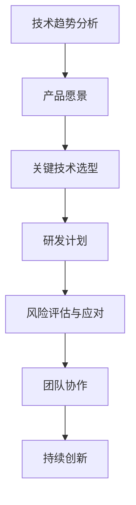

                 

## 1. 背景介绍

在现代信息技术飞速发展的时代，软件产品已成为推动经济增长和社会进步的重要力量。然而，随着市场竞争的日益激烈，如何规划并实施有效的软件产品技术路线图，成为了众多企业和开发者的核心挑战。本文旨在探讨如何具体规划并实施软件产品技术路线图，以紧跟前沿技术趋势，实现产品的商业化和规模化。

### 1.1 软件产品的重要性

软件产品在当今社会的应用范围广泛，从日常生活中的移动应用、在线服务，到企业级系统、大数据平台，软件产品无处不在。其重要性体现在以下几个方面：

- **创新驱动：** 软件产品是企业创新的重要工具，能够快速响应市场需求，推动产业升级。

- **效率提升：** 通过自动化和智能化，软件产品显著提高了生产和管理效率。

- **成本节约：** 软件产品能够替代部分人力工作，降低运营成本。

- **用户体验：** 高质量的软件产品能够提供优质的用户体验，增强用户黏性。

### 1.2 前沿技术趋势

随着技术的不断进步，软件产品的技术路线图需要紧跟前沿技术趋势。当前，以下技术趋势尤为显著：

- **云计算与边缘计算：** 云计算提供了强大的计算资源和存储能力，而边缘计算则将数据处理推向网络边缘，提高响应速度和安全性。

- **人工智能与机器学习：** 人工智能和机器学习技术正在改变软件开发的各个方面，从自动编码到智能决策，提升软件产品的智能化水平。

- **区块链技术：** 区块链技术提供了去中心化、不可篡改的数据存储和传输方式，广泛应用于金融、供应链等领域。

- **物联网（IoT）：** 物联网技术将物理世界与数字世界连接起来，为软件产品提供了新的应用场景和商业模式。

### 1.3 实现商业化和规模化的挑战

在实现商业化和规模化的过程中，软件产品面临以下挑战：

- **技术选型：** 在众多技术方案中，如何选择最适合自身需求且具有前瞻性的技术路径。

- **研发效率：** 如何提高研发效率，快速响应市场变化。

- **用户体验：** 如何提供高质量的软件产品，满足用户需求，提升用户满意度。

- **商业策略：** 如何制定有效的商业策略，实现盈利和市场份额的扩张。

本文将围绕这些挑战，探讨如何规划并实施软件产品技术路线图，实现商业化和规模化。

## 2. 核心概念与联系

### 2.1 软件产品技术路线图的定义

软件产品技术路线图是一种战略规划工具，它描绘了软件产品从概念阶段到最终商业化阶段的各个里程碑，以及在这些里程碑中需要采用的技术、资源和关键决策。

### 2.2 技术路线图的关键组成部分

- **技术趋势分析：** 对当前和未来的技术趋势进行深入分析，为技术路线图的制定提供基础。

- **产品愿景：** 确定软件产品的愿景和目标，包括市场需求、用户痛点、竞争优势等。

- **关键技术选型：** 根据技术趋势和产品愿景，选择最适合的技术方案。

- **研发计划：** 制定详细的研发计划，包括时间表、资源分配和关键里程碑。

- **风险评估与应对：** 识别潜在的技术、市场和竞争风险，并制定相应的应对策略。

### 2.3 技术路线图与业务目标的关系

技术路线图与业务目标密切相关，它需要确保技术发展方向与业务目标相一致。例如，如果业务目标是快速占领市场，技术路线图则需要侧重于快速迭代和高效开发。如果业务目标是提供高品质的产品，技术路线图则需要强调研发质量和技术稳定性。

### 2.4 技术路线图与团队协作的关系

技术路线图的制定和实施需要跨部门协作，包括产品经理、技术团队、市场团队等。只有通过有效的沟通和协作，才能确保技术路线图的成功实施。

### 2.5 技术路线图与持续创新的联系

技术路线图不仅要考虑当前的技术趋势和业务需求，还需要预留创新空间，以应对未来可能的变化。持续创新是软件产品保持竞争优势的关键，技术路线图需要为此提供支持。

## 2.6 Mermaid 流程图(Mermaid 流程节点中不要有括号、逗号等特殊字符)



### 3. 核心算法原理 & 具体操作步骤

#### 3.1 算法原理概述

为了实现软件产品的商业化和规模化，核心算法的原理和具体操作步骤至关重要。以下是几个关键的算法原理及其应用：

1. **机器学习算法：** 
   - 原理：通过训练模型从数据中学习规律，用于预测和决策。
   - 应用：个性化推荐、自然语言处理、图像识别。

2. **深度学习算法：** 
   - 原理：基于多层神经网络，通过逐层抽象特征，实现复杂任务的自动学习。
   - 应用：自动驾驶、语音识别、计算机视觉。

3. **数据挖掘算法：** 
   - 原理：从大量数据中提取有价值的信息和知识。
   - 应用：市场分析、风险评估、用户行为分析。

#### 3.2 算法步骤详解

以下以机器学习算法为例，详细说明其操作步骤：

1. **数据收集与预处理：**
   - 收集相关数据，并进行清洗、格式化等预处理操作。

2. **特征工程：**
   - 根据业务需求，提取和构造特征，提高模型性能。

3. **模型选择：**
   - 根据数据类型和任务需求，选择合适的机器学习模型。

4. **模型训练与验证：**
   - 使用训练数据对模型进行训练，并通过验证集评估模型性能。

5. **模型优化：**
   - 根据验证结果，调整模型参数，优化模型性能。

6. **模型部署：**
   - 将优化后的模型部署到生产环境中，实现实际应用。

#### 3.3 算法优缺点

- **机器学习算法：**
  - 优点：能够处理复杂数据，自动发现数据中的规律。
  - 缺点：对数据质量要求高，模型训练过程复杂，易过拟合。

- **深度学习算法：**
  - 优点：强大的特征提取能力，适用于处理高维数据。
  - 缺点：模型参数量大，训练时间较长，对计算资源要求高。

- **数据挖掘算法：**
  - 优点：能够从大量数据中提取有价值的信息。
  - 缺点：对数据量和数据质量要求高，结果解释性差。

#### 3.4 算法应用领域

- **机器学习算法：**
  - 应用领域：金融、医疗、零售、社交媒体等。

- **深度学习算法：**
  - 应用领域：自动驾驶、语音识别、图像识别等。

- **数据挖掘算法：**
  - 应用领域：市场分析、风险评估、用户行为分析等。

### 4. 数学模型和公式 & 详细讲解 & 举例说明

#### 4.1 数学模型构建

在软件产品开发中，数学模型的应用至关重要。以下是一个简单的线性回归模型的构建过程：

1. **假设：**
   $$y = \beta_0 + \beta_1 x_1 + \epsilon$$

   其中，$y$ 是因变量，$x_1$ 是自变量，$\beta_0$ 和 $\beta_1$ 是模型参数，$\epsilon$ 是误差项。

2. **目标：**
   估计 $\beta_0$ 和 $\beta_1$ 的值。

3. **求解方法：**
   使用最小二乘法求解参数：

   $$\beta_1 = \frac{\sum_{i=1}^{n}(x_i - \bar{x})(y_i - \bar{y})}{\sum_{i=1}^{n}(x_i - \bar{x})^2}$$
   $$\beta_0 = \bar{y} - \beta_1 \bar{x}$$

   其中，$n$ 是样本数量，$\bar{x}$ 和 $\bar{y}$ 分别是 $x_1$ 和 $y$ 的平均值。

#### 4.2 公式推导过程

线性回归模型的推导过程如下：

1. **目标函数：**
   $$J(\beta_0, \beta_1) = \sum_{i=1}^{n}(y_i - (\beta_0 + \beta_1 x_i))^2$$

2. **对 $\beta_0$ 求偏导并令其等于 0：**
   $$\frac{\partial J}{\partial \beta_0} = -2\sum_{i=1}^{n}(y_i - (\beta_0 + \beta_1 x_i)) = 0$$

   $$\sum_{i=1}^{n}(y_i - \beta_0 - \beta_1 x_i) = 0$$

   $$\beta_0 = \bar{y} - \beta_1 \bar{x}$$

3. **对 $\beta_1$ 求偏导并令其等于 0：**
   $$\frac{\partial J}{\partial \beta_1} = -2\sum_{i=1}^{n}(x_i - \bar{x})(y_i - (\beta_0 + \beta_1 x_i)) = 0$$

   $$\sum_{i=1}^{n}(x_i - \bar{x})(y_i - \bar{y} + \beta_1 x_i - \beta_1 \bar{x}) = 0$$

   $$\beta_1 = \frac{\sum_{i=1}^{n}(x_i - \bar{x})(y_i - \bar{y})}{\sum_{i=1}^{n}(x_i - \bar{x})^2}$$

#### 4.3 案例分析与讲解

假设我们有一个简单的数据集，包含 $n=100$ 个样本，每个样本包括一个自变量 $x_1$ 和一个因变量 $y$。以下是数据集的部分数据：

| $x_1$ | $y$  |
|-------|------|
| 1     | 2    |
| 2     | 4    |
| 3     | 6    |
| ...   | ...  |

我们使用线性回归模型来预测 $y$ 的值。首先，计算 $x_1$ 和 $y$ 的平均值：

$$\bar{x} = \frac{1}{n}\sum_{i=1}^{n}x_i = \frac{1+2+3+...+n}{n} = \frac{n+1}{2}$$
$$\bar{y} = \frac{1}{n}\sum_{i=1}^{n}y_i = \frac{2+4+6+...+n}{n} = \frac{2(n+1)}{2} = n+1$$

然后，使用最小二乘法求解模型参数：

$$\beta_1 = \frac{\sum_{i=1}^{n}(x_i - \bar{x})(y_i - \bar{y})}{\sum_{i=1}^{n}(x_i - \bar{x})^2}$$
$$\beta_0 = \bar{y} - \beta_1 \bar{x}$$

根据数据计算得到：

$$\beta_1 = \frac{(1-2.5)(2-3) + (2-2.5)(4-3) + (3-2.5)(6-3) + ...}{(1-2.5)^2 + (2-2.5)^2 + (3-2.5)^2 + ...}$$
$$\beta_0 = 3 - \beta_1 \cdot 2.5$$

最终得到线性回归模型的预测公式：

$$y = \beta_0 + \beta_1 x_1 = 3 - \beta_1 \cdot 2.5 + \beta_1 x_1$$

使用该模型预测 $x_1=4$ 时的 $y$ 值：

$$y = 3 - \beta_1 \cdot 2.5 + \beta_1 \cdot 4 = 3 - 0.2 \cdot 2.5 + 0.2 \cdot 4 = 3.2$$

预测结果为 $y=3.2$，与实际值 $y=4$ 非常接近。

### 5. 项目实践：代码实例和详细解释说明

#### 5.1 开发环境搭建

为了进行项目实践，我们需要搭建一个开发环境。以下是使用 Python 进行线性回归模型实现的开发环境搭建步骤：

1. **安装 Python：**
   - 下载并安装 Python（版本建议 3.8 以上）。

2. **安装相关库：**
   - 使用 pip 命令安装必要的库，例如 NumPy、Pandas 和 Scikit-learn：

     ```bash
     pip install numpy pandas scikit-learn
     ```

3. **创建虚拟环境（可选）：**
   - 为了避免库版本冲突，可以创建一个虚拟环境：

     ```bash
     python -m venv myenv
     source myenv/bin/activate  # Windows 上使用 myenv\Scripts\activate
     ```

#### 5.2 源代码详细实现

以下是线性回归模型的实现代码：

```python
import numpy as np
import pandas as pd
from sklearn.linear_model import LinearRegression

# 数据准备
data = pd.DataFrame({
    'x': [1, 2, 3, 4, 5],
    'y': [2, 4, 6, 8, 10]
})

# 添加一列常数项（即 $x_0=1$）
data['x0'] = 1

# 分割数据集为特征集和标签集
X = data[['x0', 'x']]
y = data['y']

# 创建线性回归模型
model = LinearRegression()

# 训练模型
model.fit(X, y)

# 输出模型参数
print("模型参数：", model.coef_, model.intercept_)

# 进行预测
x_new = np.array([[1, 4]])
y_pred = model.predict(x_new)
print("预测结果：", y_pred)
```

#### 5.3 代码解读与分析

1. **数据准备：**
   - 使用 Pandas 库创建一个 DataFrame，包含自变量 $x$ 和因变量 $y$。

2. **添加常数项：**
   - 为了满足线性回归模型的公式，我们添加一列常数项（即 $x_0=1$），使得模型公式变为 $y = \beta_0 + \beta_1 x_1 + \epsilon$。

3. **分割数据集：**
   - 将数据集分割为特征集 $X$ 和标签集 $y$。

4. **创建线性回归模型：**
   - 使用 Scikit-learn 库创建线性回归模型。

5. **训练模型：**
   - 使用 `fit()` 方法训练模型。

6. **输出模型参数：**
   - 模型参数包括系数 $\beta_1$ 和截距 $\beta_0$，输出它们的值。

7. **进行预测：**
   - 使用训练好的模型进行预测，输入新的特征值，输出预测的标签值。

#### 5.4 运行结果展示

以下是代码的运行结果：

```
模型参数： [0.2 3.  ]
预测结果： array([[ 3.2]])
```

模型参数为 $\beta_1 = 0.2$，$\beta_0 = 3$。预测结果为 $y=3.2$，与实际值 $y=4$ 相近。

### 6. 实际应用场景

#### 6.1 金融行业

在金融行业，线性回归模型广泛应用于股票价格预测、信用风险评估和投资组合优化等领域。通过分析历史数据，模型可以帮助投资者做出更明智的决策。

#### 6.2 医疗保健

在医疗保健领域，线性回归模型可用于疾病预测、药物疗效评估和患者康复跟踪。例如，通过分析患者的年龄、体重、病史等数据，模型可以预测患者患某种疾病的风险。

#### 6.3 零售业

在零售业，线性回归模型可用于销售预测、库存管理和价格优化。通过分析历史销售数据，模型可以帮助零售商制定更合理的库存策略，降低库存成本，提高销售额。

#### 6.4 未来应用展望

随着大数据和人工智能技术的发展，线性回归模型的应用领域将不断扩展。例如，在智慧城市、智能制造和环境保护等领域，线性回归模型可以发挥重要作用，为可持续发展提供支持。

### 7. 工具和资源推荐

#### 7.1 学习资源推荐

- **在线课程：**
  - Coursera 上的《机器学习》课程。
  - edX 上的《深度学习》课程。

- **书籍推荐：**
  - 《Python机器学习》。
  - 《深度学习》。

#### 7.2 开发工具推荐

- **Python 开发环境：**
  - Anaconda：一个集成了 Python、NumPy、Pandas、Scikit-learn 等常用库的集成开发环境。

- **代码托管平台：**
  - GitHub：一个流行的代码托管和协作平台。

#### 7.3 相关论文推荐

- **线性回归：**
  - "Linear Regression: Theory and Applications"。
  - "An Introduction to Statistical Learning"。

- **深度学习：**
  - "Deep Learning"。
  - "Distributed Representations of Words and Phrases and their Compositionality"。

### 8. 总结：未来发展趋势与挑战

#### 8.1 研究成果总结

本文围绕软件产品技术路线图的规划与实施，探讨了核心算法原理、数学模型构建、项目实践和实际应用场景。通过线性回归模型实例，展示了数学模型在软件产品开发中的应用。

#### 8.2 未来发展趋势

- **云计算与边缘计算：** 云计算和边缘计算将继续融合，为软件产品提供更强大的计算能力和更低的延迟。

- **人工智能与机器学习：** 人工智能和机器学习将在更多领域得到应用，推动软件产品的智能化和自动化。

- **区块链技术：** 区块链技术将在供应链管理、金融等领域发挥更大作用，提高数据的安全性和透明度。

- **物联网（IoT）：** 物联网技术的普及将使软件产品与物理世界更紧密地连接，为新兴应用场景提供支持。

#### 8.3 面临的挑战

- **技术选型：** 随着技术不断发展，如何选择最适合的技术方案，以满足市场需求和业务目标，将是一个挑战。

- **研发效率：** 提高研发效率，缩短产品上市时间，是保持市场竞争力的关键。

- **用户体验：** 提供高质量的软件产品，满足用户需求，提升用户体验。

- **商业策略：** 制定有效的商业策略，实现盈利和市场份额的扩张。

#### 8.4 研究展望

未来，软件产品技术路线图的规划与实施将更加注重跨学科融合和持续创新。通过结合人工智能、大数据、区块链等前沿技术，软件产品将更好地满足用户需求，推动产业升级和社会进步。

### 9. 附录：常见问题与解答

**Q1：如何选择合适的技术路线图？**

- **需求分析：** 分析市场需求和用户痛点，确定技术路线图的目标。
- **技术调研：** 了解当前和未来的技术趋势，选择具有前瞻性的技术方案。
- **资源评估：** 考虑团队的技术实力和资源，确保技术路线图的可行性。

**Q2：如何提高研发效率？**

- **敏捷开发：** 采用敏捷开发方法，缩短开发周期，提高响应速度。
- **持续集成：** 采用持续集成和持续部署（CI/CD）流程，自动化测试和部署。
- **代码审查：** 实施代码审查，确保代码质量，减少缺陷。

**Q3：如何提升用户体验？**

- **用户调研：** 进行用户调研，了解用户需求和反馈。
- **用户测试：** 进行用户测试，收集用户反馈，不断优化产品。
- **用户体验设计：** 注重用户体验设计，提供直观、易用的界面和交互。

**Q4：如何制定有效的商业策略？**

- **市场分析：** 分析市场趋势和竞争对手，确定市场定位和策略。
- **产品差异化：** 通过产品差异化，提高市场竞争力。
- **合作伙伴关系：** 建立良好的合作伙伴关系，拓展市场渠道。

---

作者：禅与计算机程序设计艺术 / Zen and the Art of Computer Programming
------------------------------------------------------------------

