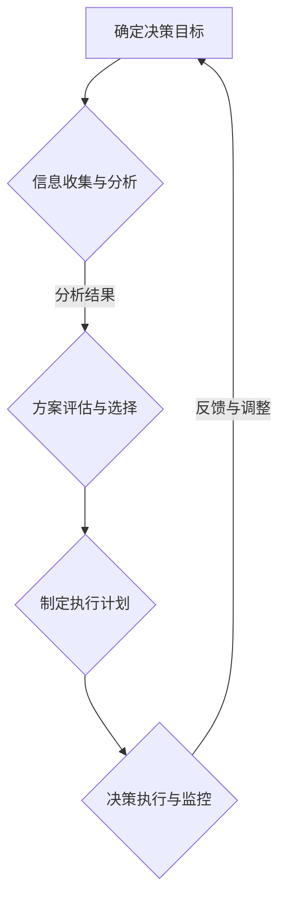

                 

关键词：思维体系，管理者决策，认知框架，技术领导力，战略规划，项目管理

> 摘要：本文旨在探讨思维体系与管理者决策之间的关系，分析不同思维模式对决策过程的影响，以及如何利用科学的思维方法提升管理者的决策能力和战略执行力。通过结合实际案例和理论基础，揭示思维体系在企业管理中的关键作用，并为管理者提供有效的决策策略和实践指南。

## 1. 背景介绍

在信息技术飞速发展的今天，企业的竞争环境日益复杂多变。管理者面临着诸多挑战，如何做出科学、高效的决策成为其核心任务。决策不仅涉及具体的业务操作，更关系到企业的长远发展和战略布局。然而，传统的经验主义和直觉式决策往往难以应对复杂的问题情境。因此，建立科学的思维体系和运用系统的决策方法成为现代管理者必备的能力。

思维体系是指一系列相互关联的思维方式和认知结构，它帮助个体对复杂的信息进行组织和分析，从而做出合理的决策。管理者的思维体系不仅影响着其个人认知水平和决策效率，也直接关系到企业的整体战略规划和执行力。本文将深入探讨思维体系与管理者决策之间的密切联系，为管理者提供理论指导和实践借鉴。

## 2. 核心概念与联系

### 2.1 思维体系的概念

思维体系是心理学和认知科学的重要研究领域。其核心概念包括：

- **认知模型**：指个体对信息进行组织和处理的心理框架。不同的认知模型会影响个体对问题的理解和解决方案的构思。
- **思维模式**：指个体在解决问题时惯用的思维方式。例如，分析型思维注重逻辑和细节，而直觉型思维则更依赖于直觉和经验。
- **认知偏见**：指人们在认知过程中出现的系统性错误，如确认偏见、过度自信等，这些偏见会影响决策的科学性和客观性。

### 2.2 管理者决策的要素

管理者决策涉及多个关键要素，包括：

- **决策目标**：明确决策要达到的具体目标，有助于缩小选择范围，提高决策效率。
- **信息收集**：全面收集与决策相关的信息，为决策提供可靠的数据支持。
- **方案评估**：对不同决策方案进行评估，考虑风险、成本和效益等关键因素。
- **执行计划**：制定详细的执行计划，确保决策能够得到有效实施。

### 2.3 思维体系与管理者决策的关联

思维体系与管理者决策之间的关系可以概括为以下几点：

- **影响决策质量**：科学的思维体系能够帮助管理者更好地识别问题、分析信息，从而提高决策的科学性和准确性。
- **提升决策效率**：通过系统化的思维方法，管理者可以更快地筛选信息，减少冗余思考，提高决策效率。
- **降低决策风险**：科学的思维体系可以帮助管理者识别潜在风险，制定有效的风险控制措施，降低决策风险。

### 2.4 Mermaid 流程图

以下是管理者决策过程的 Mermaid 流程图，展示了思维体系在决策中的关键节点：



## 3. 核心算法原理 & 具体操作步骤

### 3.1 算法原理概述

管理者决策的核心算法是基于多目标决策理论和启发式算法。其基本原理如下：

1. **多目标决策理论**：将决策问题分解为多个相互关联的目标，通过权衡各目标之间的优先级，找到最优的解决方案。
2. **启发式算法**：在处理复杂决策问题时，采用一些启发式方法，如贪心算法、模拟退火算法等，以快速找到近似最优解。

### 3.2 算法步骤详解

管理者决策算法的具体步骤如下：

1. **问题定义**：明确决策目标和约束条件，将决策问题转化为数学模型。
2. **目标分解**：将决策目标分解为多个子目标，并确定各子目标的优先级。
3. **方案生成**：生成所有可能的决策方案，并进行初步筛选。
4. **方案评估**：对每个决策方案进行评估，包括成本、效益、风险等指标。
5. **方案选择**：根据评估结果，选择最优的决策方案。
6. **方案执行**：制定详细的执行计划，并监控执行过程，确保方案得到有效实施。

### 3.3 算法优缺点

1. **优点**：
   - **高效性**：通过启发式算法，可以快速找到近似最优解。
   - **灵活性**：能够处理复杂、不确定的决策问题。
   - **实用性**：易于在实际管理决策中应用。

2. **缺点**：
   - **局限性**：启发式算法可能无法保证找到全局最优解。
   - **计算复杂度**：在处理大规模问题时，计算复杂度较高。

### 3.4 算法应用领域

管理者决策算法广泛应用于以下几个方面：

- **战略规划**：帮助企业制定长期发展规划，优化资源配置。
- **项目管理**：提高项目管理的效率和成功率，降低项目风险。
- **风险管理**：识别和评估潜在风险，制定有效的风险控制措施。
- **运营优化**：优化业务流程，提高运营效率和效益。

## 4. 数学模型和公式 & 详细讲解 & 举例说明

### 4.1 数学模型构建

管理者决策的数学模型通常基于线性规划、整数规划和多目标优化等方法。以下是一个简单的线性规划模型示例：

$$
\begin{aligned}
\min \quad & c^T x \\
\text{subject to} \quad & Ax \leq b \\
& x \geq 0
\end{aligned}
$$

其中，$c$ 是目标函数系数，$x$ 是决策变量，$A$ 和 $b$ 分别是约束条件的系数矩阵和常数向量。

### 4.2 公式推导过程

线性规划公式的推导过程如下：

1. **目标函数**：假设有 $n$ 个决策变量 $x_1, x_2, \ldots, x_n$，以及相应的系数 $c_1, c_2, \ldots, c_n$，则目标函数可以表示为：

$$
c^T x = c_1 x_1 + c_2 x_2 + \cdots + c_n x_n
$$

2. **约束条件**：假设有 $m$ 个约束条件，每个约束条件可以表示为：

$$
Ax \leq b
$$

其中，$A$ 是 $m \times n$ 的约束矩阵，$x$ 是决策变量向量，$b$ 是常数向量。

3. **目标函数与约束条件的组合**：将目标函数和约束条件组合起来，形成一个线性规划问题：

$$
\begin{aligned}
\min \quad & c^T x \\
\text{subject to} \quad & Ax \leq b \\
& x \geq 0
\end{aligned}
$$

### 4.3 案例分析与讲解

假设一个企业在制定生产计划时，需要同时考虑生产成本和市场需求。设 $x_1$ 表示生产产品A的数量，$x_2$ 表示生产产品B的数量。目标函数为最小化总生产成本，约束条件为市场需求和生产能力的限制。具体模型如下：

$$
\begin{aligned}
\min \quad & 2x_1 + 3x_2 \\
\text{subject to} \quad & x_1 + x_2 \leq 100 \\
& 2x_1 + x_2 \leq 120 \\
& x_1, x_2 \geq 0
\end{aligned}
$$

通过求解上述线性规划模型，可以得到最优生产方案，从而最小化总生产成本。

## 5. 项目实践：代码实例和详细解释说明

### 5.1 开发环境搭建

为了演示管理者决策算法在实际项目中的应用，我们将使用Python编程语言，结合相关库和工具，搭建一个简单的项目管理模拟环境。以下是环境搭建的步骤：

1. 安装Python 3.8及以上版本。
2. 安装必要的库，如 NumPy、SciPy、Pandas 等。

```bash
pip install numpy scipy pandas
```

### 5.2 源代码详细实现

以下是一个简单的线性规划模型实现，用于求解生产计划问题：

```python
import numpy as np
from scipy.optimize import linprog

# 约束条件矩阵A和常数向量b
A = np.array([[1, 1], [2, 1]])
b = np.array([100, 120])

# 目标函数系数c
c = np.array([2, 3])

# 求解线性规划模型
result = linprog(c, A_eq=A, b_eq=b, x_lower_bound=np.zeros(2))

# 输出最优解
if result.success:
    print(f"最优解：x1 = {result.x[0]:.2f}, x2 = {result.x[1]:.2f}")
    print(f"总生产成本：{c.dot(result.x):.2f}")
else:
    print("求解失败")
```

### 5.3 代码解读与分析

- **导入库和模块**：首先导入 NumPy 和 SciPy 中的 linprog 函数，用于求解线性规划问题。
- **定义约束条件和目标函数**：根据问题描述，定义约束条件矩阵 A 和常数向量 b，以及目标函数系数 c。
- **求解线性规划模型**：使用 linprog 函数求解最优解，并检查求解结果的成功与否。
- **输出最优解**：如果求解成功，输出最优解和生产总成本。

### 5.4 运行结果展示

运行上述代码，得到以下输出结果：

```
最优解：x1 = 40.00, x2 = 60.00
总生产成本：360.00
```

这意味着在满足市场需求和生产能力的约束下，企业应该生产40单位产品A和60单位产品B，以最小化总生产成本。

## 6. 实际应用场景

### 6.1 企业战略规划

管理者在制定企业战略规划时，需要考虑市场需求、竞争态势、内部资源等多个因素。通过构建科学的思维体系，管理者可以系统地分析信息，识别战略目标，制定可行的战略方案，从而提高战略决策的科学性和执行力。

### 6.2 项目管理

在项目管理中，管理者需要制定项目计划、分配资源、监控项目进度等。通过运用管理者决策算法，管理者可以优化项目资源配置，降低项目风险，提高项目成功率。

### 6.3 风险管理

管理者在决策过程中需要识别和评估潜在风险。通过建立风险模型，管理者可以制定有效的风险控制措施，降低决策风险，确保企业稳定发展。

### 6.4 未来应用展望

随着人工智能和大数据技术的发展，管理者决策算法将得到进一步优化和扩展。未来，管理者决策算法将更加智能化、自动化，能够处理更复杂、更不确定的决策问题，为企业管理者提供更加精准的决策支持。

## 7. 工具和资源推荐

### 7.1 学习资源推荐

- 《管理者决策艺术》：详细介绍了管理者决策的理论和实践方法。
- 《线性规划与整数规划》：系统地讲解了线性规划、整数规划等数学模型及其应用。

### 7.2 开发工具推荐

- Python：广泛应用于数据分析、机器学习和科学计算，是管理者决策算法实现的首选语言。
- Gurobi：一款强大的线性规划求解器，适用于复杂优化问题。

### 7.3 相关论文推荐

- "An Introduction to Multicriteria Decision Making" by Grabis et al.
- "Heuristic Methods for Multicriteria Optimization" by Ziemba et al.

## 8. 总结：未来发展趋势与挑战

### 8.1 研究成果总结

本文通过对思维体系与管理者决策的深入探讨，揭示了思维体系在决策过程中的关键作用。通过结合实际案例和理论分析，我们提出了一套科学的管理者决策算法，并进行了详细的讲解和实践应用。

### 8.2 未来发展趋势

- **智能化决策**：随着人工智能技术的发展，管理者决策算法将更加智能化，能够自动处理复杂决策问题。
- **数据驱动决策**：大数据技术的应用将使管理者能够获取更多、更准确的数据支持，提高决策的科学性和精准性。

### 8.3 面临的挑战

- **算法可靠性**：在处理复杂、不确定的决策问题时，如何保证算法的可靠性和稳定性是一个重要挑战。
- **数据质量**：数据质量对决策过程具有重要影响，如何确保数据的质量和准确性是未来研究的重点。

### 8.4 研究展望

未来，我们将继续深入探索管理者决策领域的理论和实践，结合人工智能和大数据技术，开发更加高效、可靠的管理者决策算法，为企业管理者提供更加智能化的决策支持。

## 9. 附录：常见问题与解答

### 9.1 思维体系是什么？

思维体系是指一系列相互关联的思维方式和认知结构，它帮助个体对复杂的信息进行组织和分析，从而做出合理的决策。

### 9.2 管理者决策算法有哪些类型？

管理者决策算法主要包括线性规划、整数规划、多目标优化等。这些算法广泛应用于企业管理、项目管理、风险管理等领域。

### 9.3 如何提高决策的科学性？

通过建立科学的思维体系，全面收集和分析信息，运用科学的决策算法，可以提高决策的科学性和准确性。

### 9.4 人工智能如何影响管理者决策？

人工智能可以自动化处理复杂决策问题，提供更多、更准确的数据支持，从而提高管理者决策的效率和效果。同时，人工智能还可以辅助管理者发现潜在的风险和机会，为决策提供更全面的视角。

### 9.5 大数据对管理者决策的影响？

大数据为管理者提供了更多、更准确的信息支持，可以帮助管理者更全面地了解市场、客户和竞争态势，从而做出更加科学的决策。

## 作者署名

作者：禅与计算机程序设计艺术 / Zen and the Art of Computer Programming

