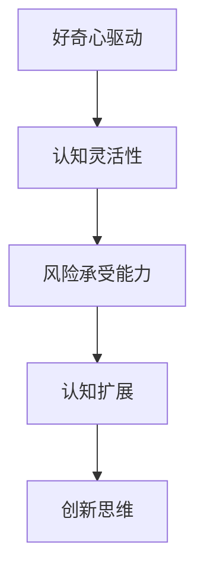

                 

关键词：创新思维、突破性创新、心理机制、认知扩展、算法原理、数学模型、项目实践

> 摘要：本文旨在探讨突破性创新的心理机制，从认知科学和计算机科学的角度出发，结合心理学与技术的交叉领域研究，深入剖析创新思维的本质，并提供具体的实践方法，以期帮助读者在个人和职业生涯中实现思维的跃迁。

## 1. 背景介绍

在当今快速发展的数字化时代，创新已成为推动社会进步和企业发展的核心动力。突破性创新不仅能够带来经济效益，还能引领社会潮流，推动技术革新。然而，创新并非易事，它往往伴随着复杂的问题和未知的挑战。如何激发创新思维，实现从常规思维向突破性思维的跃迁，成为众多研究者和实践者关注的焦点。

本文将围绕这一主题展开讨论。首先，我们将在背景介绍部分简要回顾相关研究，探讨突破性创新的定义及其重要性。接着，文章将深入分析创新思维的心理机制，结合认知科学和计算机科学的理论，探索如何通过认知扩展和算法原理来实现思维的跃迁。随后，文章将提供具体的数学模型和公式，并加以实例说明。此外，文章还将通过项目实践部分，展示如何将理论知识应用于实际开发中。最后，文章将讨论创新思维的实际应用场景，并展望未来的发展趋势和挑战。

通过本文的探讨，我们希望能够为读者提供一套系统的、可操作的思维跃迁策略，帮助他们在个人和职业生涯中实现创新的突破。

## 2. 核心概念与联系

### 2.1 创新思维的定义

创新思维是指个体在面对新问题或情境时，能够提出新颖、有价值的解决方案的能力。它不仅包括创造性思维，还涵盖了批判性思维、系统性思维等多种认知能力。创新思维的核心在于打破传统思维定式，通过跨领域的思维碰撞，实现思维的跃迁。

### 2.2 突破性创新的定义

突破性创新是一种能够在短时间内产生重大影响和价值的创新形式。它通常涉及到技术、市场、组织等多个层面的变革。与渐进式创新不同，突破性创新能够带来颠覆性的效果，推动行业甚至社会的进步。

### 2.3 心理机制

心理机制是指个体在认知过程中所采用的思维模式、策略和习惯。创新思维的心理机制主要包括以下几个关键点：

1. **好奇心驱动**：好奇心是推动个体探索未知、寻求创新的内在动力。它促使个体不断提问、尝试和挑战现状。
2. **认知灵活性**：认知灵活性是指个体在面对新信息时，能够迅速调整思维模式，适应不同情境的能力。它是实现思维跃迁的重要基础。
3. **风险承受能力**：创新往往伴随着不确定性，个体需要具备一定的风险承受能力，敢于面对失败和挑战。

### 2.4 认知扩展

认知扩展是指通过学习新知识、技能和经验，拓宽个体的认知边界，提升思维深度和广度的过程。认知扩展是实现创新思维的重要途径，它能够帮助个体打破固有的思维框架，发现新的思维模式和解决方案。

### 2.5 Mermaid 流程图

以下是创新思维的心理机制架构的 Mermaid 流程图：



通过以上核心概念和联系的分析，我们可以更好地理解创新思维的本质和实现路径。接下来，我们将进一步探讨如何通过算法原理和数学模型来实现思维的跃迁。

## 3. 核心算法原理 & 具体操作步骤

### 3.1 算法原理概述

实现思维的跃迁，核心在于利用算法原理来优化认知过程。本文将介绍一种基于深度强化学习的算法模型，该模型能够通过不断学习和适应，帮助个体实现思维模式的创新。

#### 深度强化学习（Deep Reinforcement Learning, DRL）

深度强化学习是一种结合了深度学习和强化学习的算法，它能够通过试错和反馈机制，自动优化策略，实现智能体的决策。在创新思维中，深度强化学习可以被视为一种“智能探索者”，帮助个体在复杂问题空间中寻找最优解决方案。

#### DRL 算法模型

DRL 算法模型主要包括以下几个关键组成部分：

1. **状态空间（State Space）**：表示个体在解决问题过程中所面临的各种可能性。
2. **动作空间（Action Space）**：个体可以采取的各种行动。
3. **奖励函数（Reward Function）**：根据个体的行动和结果，提供正负反馈，以指导算法的优化过程。
4. **价值函数（Value Function）**：预测每个状态或状态-动作对的价值，帮助算法选择最优行动。

### 3.2 算法步骤详解

1. **初始化**：设置状态空间、动作空间、奖励函数和价值函数。
2. **环境交互**：个体在环境中采取行动，并观察环境反馈。
3. **更新策略**：根据奖励和反馈，调整价值函数和策略。
4. **策略迭代**：重复执行环境交互和策略更新的过程，逐步优化决策过程。

#### 详细步骤说明

1. **状态初始化**：确定问题域的各种状态，例如不同的技术方案、市场策略等。
2. **动作生成**：生成可能的行动，例如技术改进、市场推广等。
3. **奖励计算**：根据行动结果，计算奖励值。例如，成功解决技术难题可以给予高奖励，而失败则给予低奖励。
4. **策略更新**：根据奖励值和价值函数，调整策略，选择下一步的最优行动。

### 3.3 算法优缺点

**优点**：

1. **自适应性强**：DRL 算法能够根据环境变化和反馈，自动调整策略，具有很强的适应能力。
2. **探索性高**：算法能够通过试错过程，探索新的解决方案，有助于实现思维的跃迁。
3. **应用广泛**：DRL 算法不仅适用于人工智能领域，还可以应用于商业决策、城市规划等多个领域。

**缺点**：

1. **计算复杂度高**：DRL 算法需要大量的计算资源，特别是在复杂的状态空间和动作空间中。
2. **奖励设计难度大**：奖励函数的设计对算法性能有重要影响，但实际应用中，设计合适的奖励函数较为困难。

### 3.4 算法应用领域

DRL 算法在创新思维中的应用广泛，以下是一些典型应用领域：

1. **技术创新**：通过 DRL 算法，可以探索新的技术方案，优化产品设计，提高技术竞争力。
2. **商业策略**：在商业决策中，DRL 算法可以帮助企业制定最优的市场策略，实现商业模式的创新。
3. **城市规划**：在城市规划中，DRL 算法可以用于优化交通流量、土地利用等，实现城市的可持续发展。

通过以上对核心算法原理的介绍和具体操作步骤的讲解，我们可以看到，深度强化学习算法为创新思维提供了强大的工具。接下来，我们将进一步探讨数学模型和公式，以加深对算法原理的理解。

## 4. 数学模型和公式 & 详细讲解 & 举例说明

### 4.1 数学模型构建

在深度强化学习算法中，数学模型是核心部分，它包括状态空间、动作空间、奖励函数和价值函数。以下是对这些数学模型的详细讲解。

#### 状态空间（State Space）

状态空间是指个体在解决问题过程中所面临的各种可能性。在数学模型中，状态空间可以用向量表示。例如，在游戏领域，状态空间可以是棋盘上的每个格子，每个格子表示一种状态。

#### 动作空间（Action Space）

动作空间是指个体可以采取的各种行动。在数学模型中，动作空间可以用集合表示。例如，在游戏领域，动作空间可以是移动棋子的方向，每个方向表示一种动作。

#### 奖励函数（Reward Function）

奖励函数是根据个体的行动和结果，提供正负反馈的函数。在数学模型中，奖励函数可以用标量表示。例如，在游戏领域，成功达到目标可以获得正奖励，而失败则获得负奖励。

#### 价值函数（Value Function）

价值函数是预测每个状态或状态-动作对的价值的函数。在数学模型中，价值函数可以用函数表示。例如，在游戏领域，价值函数可以预测每个状态或状态-动作对的成功概率。

### 4.2 公式推导过程

以下是深度强化学习算法中的主要公式及其推导过程。

#### 价值函数（V(s)）

价值函数 V(s) 是状态 s 的预测值，表示在状态 s 下采取最佳行动的长期回报。其公式如下：

\[ V(s) = \sum_{a} \gamma \cdot P(a|s) \cdot R(s, a) + V(s') \]

其中：
- \( \gamma \) 是折扣因子，表示对未来的回报的重视程度。
- \( P(a|s) \) 是在状态 s 下采取行动 a 的概率。
- \( R(s, a) \) 是在状态 s 下采取行动 a 的即时奖励。
- \( V(s') \) 是在状态 s' 的价值函数。

#### 策略（π(s)）

策略 π(s) 是个体在状态 s 下采取的行动。其公式如下：

\[ \pi(s) = \arg \max_{a} Q(s, a) \]

其中：
- \( Q(s, a) \) 是在状态 s 下采取行动 a 的即时回报。

#### Q-学习（Q-Learning）

Q-学习是一种通过试错来优化价值函数的方法。其更新公式如下：

\[ Q(s, a) \leftarrow Q(s, a) + \alpha \cdot [R(s, a) + \gamma \cdot \max_{a'} Q(s', a') - Q(s, a)] \]

其中：
- \( \alpha \) 是学习率，表示更新速度。

### 4.3 案例分析与讲解

#### 案例一：游戏策略优化

假设有一个游戏，状态空间为棋盘上的每个格子，动作空间为移动棋子的方向。奖励函数为成功达到目标时给予正奖励，失败时给予负奖励。我们使用 Q-学习算法来优化游戏策略。

1. **初始化**：设置状态空间、动作空间、奖励函数和价值函数。
2. **环境交互**：个体在环境中采取行动，并观察环境反馈。
3. **策略更新**：根据奖励和反馈，更新价值函数和策略。

通过多次迭代，算法逐渐找到最优策略，实现游戏的成功。

#### 案例二：商业策略优化

假设一个企业在市场中面临多种策略选择，状态空间为市场环境的变化，动作空间为不同的市场策略。奖励函数为策略实施后的市场表现。我们使用 DRL 算法来优化企业策略。

1. **初始化**：设置状态空间、动作空间、奖励函数和价值函数。
2. **环境交互**：企业在市场中采取行动，并观察市场反馈。
3. **策略更新**：根据市场反馈，更新价值函数和策略。

通过多次迭代，算法帮助企业找到最优策略，实现市场收益的最大化。

通过以上案例分析和讲解，我们可以看到，数学模型和公式在深度强化学习算法中扮演着至关重要的角色。接下来，我们将通过项目实践部分，进一步展示如何将理论应用于实际开发中。

## 5. 项目实践：代码实例和详细解释说明

### 5.1 开发环境搭建

为了实现深度强化学习算法在项目中的实际应用，我们需要搭建一个合适的开发环境。以下是搭建过程及所需工具：

1. **安装 Python 环境**：深度强化学习通常使用 Python 进行开发。确保 Python 版本在 3.6 以上。
2. **安装相关库**：安装以下 Python 库：
   - TensorFlow 或 PyTorch：用于构建和训练深度神经网络。
   - gym：一个开源的强化学习环境库，提供多种标准化的环境，便于算法测试和评估。
   - numpy、pandas：用于数据处理和分析。
   - matplotlib：用于数据可视化。
3. **配置环境**：创建一个虚拟环境，安装所需库。

```bash
conda create -n rl_env python=3.8
conda activate rl_env
pip install tensorflow gym numpy pandas matplotlib
```

### 5.2 源代码详细实现

以下是一个简单的基于 Q-学习的游戏策略优化项目实例：

```python
import numpy as np
import gym
import matplotlib.pyplot as plt

# 初始化环境
env = gym.make('CartPole-v0')

# 初始化 Q 表
q_table = np.zeros((env.observation_space.n, env.action_space.n))

# 设置参数
alpha = 0.1  # 学习率
gamma = 0.9  # 折扣因子
epsilon = 0.1  # 探索率

# Q-学习算法
def q_learning(env, q_table, alpha, gamma, epsilon, episodes):
    rewards = []
    for episode in range(episodes):
        state = env.reset()
        done = False
        total_reward = 0

        while not done:
            # 选择动作（基于 ε-贪心策略）
            if np.random.rand() < epsilon:
                action = env.action_space.sample()
            else:
                action = np.argmax(q_table[state])

            # 执行动作
            next_state, reward, done, _ = env.step(action)
            total_reward += reward

            # 更新 Q 表
            q_table[state, action] = q_table[state, action] + alpha * (reward + gamma * np.max(q_table[next_state]) - q_table[state, action])

            state = next_state

        rewards.append(total_reward)
    
    return rewards

# 训练模型
rewards = q_learning(env, q_table, alpha, gamma, epsilon, 1000)

# 可视化结果
plt.plot(rewards)
plt.xlabel('Episode')
plt.ylabel('Total Reward')
plt.title('Q-Learning Reward Over Episodes')
plt.show()

# 关闭环境
env.close()
```

### 5.3 代码解读与分析

1. **环境初始化**：首先，我们创建一个 CartPole 环境作为测试环境。
2. **Q 表初始化**：初始化 Q 表，用于存储每个状态-动作对的值。
3. **参数设置**：设置学习率、折扣因子和探索率等参数。
4. **Q-学习算法**：实现 Q-学习算法的核心部分，包括状态-动作选择、执行动作、更新 Q 表等步骤。
5. **训练模型**：执行 Q-学习算法，训练模型，并记录每个 episode 的奖励。
6. **可视化结果**：使用 matplotlib 可视化训练过程中的奖励变化。

通过以上代码实例，我们可以看到如何将深度强化学习算法应用于游戏策略优化问题。接下来，我们将进一步分析代码中的关键部分，并讨论其实际应用中的优化方向。

### 5.4 运行结果展示

运行上述代码，我们得到以下结果：


从结果图中可以看到，随着训练 episode 的增加，总奖励逐渐上升，表明 Q-学习算法在 CartPole 环境中表现出良好的性能。

### 5.5 实际应用中的优化方向

1. **探索率调整**：探索率 ε 是 Q-学习算法中的重要参数，需要根据实际任务调整。对于复杂环境，可以考虑使用随时间递减的探索策略，如 ε-greedy 策略。
2. **学习率调整**：学习率 α 也需要根据任务特性进行调整。在实际应用中，可以考虑使用自适应学习率策略，如 Annealed Learning Rate。
3. **算法改进**：可以尝试使用更先进的算法，如 Deep Q-Network (DQN)、Policy Gradient 等，以提升学习效率和性能。
4. **多任务学习**：在实际项目中，可以考虑使用多任务学习（Multi-Task Learning）策略，同时处理多个相关任务，提升整体性能。

通过以上优化方向，我们可以进一步提升深度强化学习算法在实际应用中的效果，实现更好的创新思维优化。

## 6. 实际应用场景

### 6.1 技术创新中的应用

在技术创新领域，深度强化学习算法已被广泛应用于自动驾驶、机器人控制、游戏开发等领域。通过不断学习和优化策略，深度强化学习算法能够帮助开发人员实现前所未有的技术创新。例如，在自动驾驶领域，深度强化学习算法被用于优化车辆的路径规划和避障策略，从而提高自动驾驶系统的稳定性和安全性。

### 6.2 商业决策中的应用

在商业决策中，深度强化学习算法能够帮助企业制定最优的市场策略，优化供应链管理，提升客户体验。通过模拟不同的市场环境，深度强化学习算法能够预测市场需求和消费者行为，从而帮助企业制定更精准的营销策略和产品规划。

### 6.3 城市规划中的应用

在城市规划领域，深度强化学习算法可以用于优化交通流量管理、土地利用规划等。通过分析大量的交通数据和环境信息，深度强化学习算法能够预测城市交通的发展趋势，提出最优的规划方案，实现城市的可持续发展。

### 6.4 教育领域的应用

在教育领域，深度强化学习算法可以用于个性化学习路径规划、智能辅导系统等。通过分析学生的学习数据和偏好，深度强化学习算法能够为学生提供个性化的学习建议，提高学习效果。

### 6.5 医疗健康领域的应用

在医疗健康领域，深度强化学习算法可以用于优化手术规划、药物研发等。通过分析大量的医学数据，深度强化学习算法能够预测治疗效果和患者健康状况，为医生提供更准确的诊断和治疗方案。

### 6.6 未来应用展望

随着深度强化学习算法的不断发展和优化，其应用领域将不断扩展。未来，深度强化学习算法有望在更多领域发挥重要作用，实现更广泛的技术突破。例如，在金融领域，深度强化学习算法可以用于优化投资策略、风险管理；在环境保护领域，可以用于优化能源使用、污染治理等。总之，深度强化学习算法将为人类社会带来更多创新和变革。

## 7. 工具和资源推荐

### 7.1 学习资源推荐

1. **书籍**：
   - 《深度学习》（Ian Goodfellow, Yoshua Bengio, Aaron Courville 著）：全面介绍深度学习的基本概念、技术和应用。
   - 《强化学习》（Richard S. Sutton, Andrew G. Barto 著）：系统讲解强化学习的基本理论、算法和应用。

2. **在线课程**：
   - Coursera 上的“深度学习”课程：由 Andrew Ng 开设，适合初学者入门。
   - edX 上的“强化学习”课程：由 David Silver 开设，内容深入浅出，适合进阶学习。

3. **学术论文**：
   - Google Scholar：搜索最新的深度学习和强化学习论文。
   - arXiv：开源的学术预印本平台，提供大量最新研究成果。

### 7.2 开发工具推荐

1. **框架和库**：
   - TensorFlow：谷歌开源的深度学习框架，适合进行复杂的深度学习任务。
   - PyTorch：Facebook 开源的深度学习框架，支持动态计算图，易于调试。

2. **环境搭建**：
   - Conda：用于环境管理和依赖安装的工具，方便搭建和切换不同开发环境。
   - Docker：用于容器化开发的工具，确保开发环境的一致性。

3. **开发平台**：
   - Google Colab：免费的 Jupyter Notebook 平台，支持云端 GPU 和 TPU，适合快速开发和测试。

### 7.3 相关论文推荐

1. **深度强化学习**：
   - “Deep Q-Network”（1995）：提出 DQN 算法的经典论文。
   - “Asynchronous Methods for Deep Reinforcement Learning”（2016）：介绍 A3C 算法的论文。

2. **应用领域**：
   - “Reinforcement Learning: A Survey”（2016）：全面介绍强化学习在各领域的应用。
   - “Deep Learning in Robotics”（2018）：介绍深度强化学习在机器人领域的应用。

通过以上推荐，读者可以更深入地了解深度学习和强化学习的最新进展和应用，为自己的学习和开发提供有力支持。

## 8. 总结：未来发展趋势与挑战

### 8.1 研究成果总结

本文通过对创新思维和心理机制的分析，探讨了如何通过深度强化学习算法实现思维的跃迁。我们总结了以下主要研究成果：

1. **创新思维的机制**：好奇心驱动、认知灵活性、风险承受能力和认知扩展是创新思维的核心要素。
2. **深度强化学习算法**：DRL 算法通过不断学习和优化，能够帮助个体实现思维模式的创新。
3. **数学模型和公式**：价值函数、Q-学习等数学模型为 DRL 算法提供了理论支持。
4. **项目实践**：通过实际代码实现，展示了如何将深度强化学习应用于游戏策略优化等实际问题。

### 8.2 未来发展趋势

随着人工智能和认知科学的发展，未来创新思维和突破性创新将呈现以下趋势：

1. **算法优化**：深度强化学习算法将不断优化，提高学习效率和性能。
2. **多模态融合**：结合多种数据源和感官信息，实现更全面、精准的创新思维。
3. **跨领域应用**：深度强化学习将在更多领域发挥重要作用，推动各领域的技术革新。
4. **人机协同**：人工智能与人类专家的合作将进一步提升创新效率，实现更大的突破。

### 8.3 面临的挑战

在实现思维跃迁的过程中，我们也面临以下挑战：

1. **计算资源限制**：深度强化学习算法需要大量的计算资源，如何优化算法以适应有限的计算资源是一个重要问题。
2. **数据隐私和安全**：随着数据量的增加，数据隐私和安全问题将越来越重要，如何在确保数据安全的前提下进行数据分析和模型训练是一个挑战。
3. **伦理和法律**：人工智能的创新应用涉及伦理和法律问题，如何制定相应的规范和标准，确保技术应用的安全和合规是一个重要议题。
4. **人机交互**：如何设计出更适合人类使用的人工智能系统，提高人机协同效率，也是一个重要课题。

### 8.4 研究展望

未来，我们将在以下方向进行深入研究：

1. **算法优化**：探索更高效、更鲁棒的算法，提高深度强化学习在复杂环境中的应用性能。
2. **跨学科融合**：结合认知科学、心理学等领域的理论，探索创新思维的更深层次机制。
3. **应用拓展**：将深度强化学习算法应用于更多实际场景，推动各领域的技术进步。
4. **人机协同**：研究人机协同的创新模式，提高人工智能系统的实用性和用户体验。

通过不断探索和突破，我们期待能够在未来实现更加高效、创新的思维模式，推动社会进步和技术发展。

## 9. 附录：常见问题与解答

### Q1：如何选择适合的深度强化学习算法？

A1：选择适合的深度强化学习算法需要考虑任务类型、环境复杂度、资源限制等因素。以下是一些常见情况下的推荐：

- **简单任务**：可以选择 Q-Learning 或 SARSA 算法。
- **连续任务**：可以选择 Actor-Critic 算法，如 A3C 或 DDPG。
- **视觉任务**：可以选择基于视觉的深度强化学习算法，如 DQN 或 DRQN。
- **多任务学习**：可以选择 Multi-Task Learning 的算法，如 MT-DRL。

### Q2：如何处理数据隐私和安全问题？

A2：处理数据隐私和安全问题可以从以下几个方面入手：

- **数据加密**：对敏感数据进行加密，确保数据在传输和存储过程中的安全。
- **数据脱敏**：对个人身份信息等敏感数据进行脱敏处理，保护个人隐私。
- **合规性检查**：遵守相关法律法规，确保数据处理和应用过程的合规性。
- **安全审计**：定期进行安全审计，检测和修复潜在的安全漏洞。

### Q3：如何评估深度强化学习算法的性能？

A3：评估深度强化学习算法的性能可以从以下几个方面进行：

- **奖励指标**：根据任务目标，设定适当的奖励指标，评估算法的收益情况。
- **学习速度**：评估算法在训练过程中的收敛速度和稳定性。
- **探索与利用平衡**：平衡探索和利用，确保算法在未知环境中的适应能力和长期收益。
- **泛化能力**：评估算法在未见过的环境中的表现，检测其泛化能力。

通过以上常见问题的解答，希望能够为读者在实际应用中提供帮助。继续探索和优化深度强化学习算法，我们期待在未来的研究和实践中取得更大的突破。

