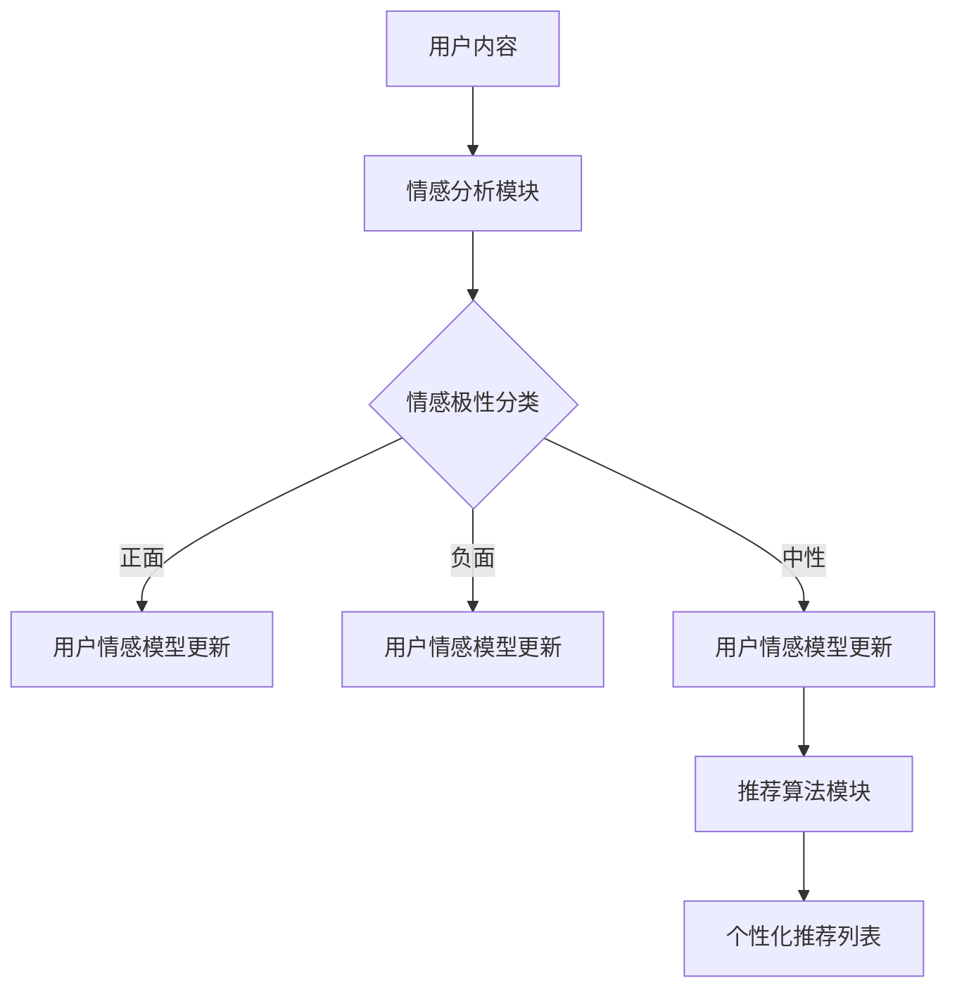

                 

关键词：情感分析、个性化推荐、机器学习、用户情绪、深度学习、情感图谱、NLP

摘要：随着人工智能技术的不断进步，情感驱动推荐系统正逐渐成为个性化推荐领域的热点。本文将探讨AI如何通过理解用户情绪，提供更加精准、有情感的推荐。我们将详细讨论情感分析技术、核心算法原理、数学模型以及实际应用场景，为开发者提供全面的指导。

## 1. 背景介绍

### 情感驱动推荐的概念

情感驱动推荐系统是一种基于用户情感反馈进行个性化推荐的算法。它不同于传统的基于内容的推荐和协同过滤推荐，而是通过分析用户的情感表达，为用户提供更加贴合个人情感需求的推荐。这种推荐方式能够更好地满足用户的情感需求，提升用户体验。

### 情感分析的发展

情感分析（Sentiment Analysis）是自然语言处理（NLP）的一个分支，旨在从文本中识别和提取情感信息。随着深度学习技术的发展，情感分析的准确性和效率得到了显著提升。如今，情感分析已广泛应用于社交媒体监控、用户行为分析、情感营销等多个领域。

### 个性化推荐的挑战

在互联网时代，用户面对的信息量日益庞大。如何从海量的信息中为用户提供高质量的个性化推荐，成为一个巨大的挑战。传统的推荐系统主要依赖用户的历史行为和偏好，而忽略了用户情感这一重要因素。情感驱动推荐系统通过挖掘用户情感，为用户提供更加贴合个人需求的推荐，有望解决这一挑战。

## 2. 核心概念与联系

### 情感分析

情感分析是情感驱动推荐系统的基石。它通过对文本进行情感极性分类（如正面、负面、中性）和情感强度分析，识别用户的情感状态。情感分析技术主要包括以下几种：

- **基于规则的方法**：通过编写规则来识别文本中的情感倾向。这种方法简单直观，但在处理复杂情感时效果有限。
- **基于统计的方法**：使用统计模型（如朴素贝叶斯、支持向量机等）进行情感分类。这种方法对大规模文本数据具有较好的泛化能力。
- **基于深度学习的方法**：使用深度神经网络（如卷积神经网络、循环神经网络等）进行情感分析。这种方法能够捕捉文本中的复杂情感模式，具有很高的准确性和泛化能力。

### 情感图谱

情感图谱是一种用于表示情感之间关系的图结构。它通过将文本中的情感实体和情感关系转化为图节点和边，建立情感之间的关系网络。情感图谱在情感驱动推荐系统中起到了关键作用，可以帮助系统更好地理解用户的情感状态，为个性化推荐提供支持。

### 情感驱动推荐架构

情感驱动推荐系统的架构主要包括以下几个关键模块：

- **情感分析模块**：对用户生成的内容（如评论、帖子等）进行情感分析，识别用户情感状态。
- **用户情感模型**：根据用户的情感分析结果，构建用户的情感模型，记录用户的情感偏好。
- **推荐算法模块**：基于用户情感模型，为用户生成个性化推荐列表。

以下是情感驱动推荐系统的Mermaid流程图：



## 3. 核心算法原理 & 具体操作步骤

### 3.1 算法原理概述

情感驱动推荐系统的核心算法主要包括情感分析算法和推荐算法。情感分析算法用于识别用户的情感状态，推荐算法则基于用户情感模型为用户生成个性化推荐。

### 3.2 算法步骤详解

#### 3.2.1 情感分析

1. **数据预处理**：对用户生成的内容进行清洗和预处理，去除无关信息。
2. **词向量表示**：使用词向量模型（如Word2Vec、GloVe等）将文本转换为向量化表示。
3. **情感分类**：使用深度学习模型（如BERT、RoBERTa等）对文本进行情感分类，得到用户的情感状态。

#### 3.2.2 推荐算法

1. **构建用户情感模型**：根据情感分析结果，构建用户的情感模型，记录用户的情感偏好。
2. **候选集生成**：根据用户情感模型和物品情感属性，生成候选物品集合。
3. **推荐评分**：使用基于用户情感的协同过滤算法（如SVD、MF等）为用户生成推荐列表。

### 3.3 算法优缺点

#### 优点：

- **个性化推荐**：情感驱动推荐系统能够更好地满足用户的情感需求，提升用户体验。
- **情感多样性**：算法能够识别用户的多种情感状态，提供多样化的推荐。
- **实时性**：情感分析算法能够实时分析用户情感，为用户生成实时推荐。

#### 缺点：

- **情感识别难度**：情感分析算法在处理复杂情感时可能存在困难，影响推荐准确性。
- **计算成本**：深度学习模型在情感分析阶段需要较大的计算资源，可能导致系统性能下降。

### 3.4 算法应用领域

情感驱动推荐系统在多个领域具有广泛的应用前景，包括：

- **电子商务**：为用户提供情感驱动的商品推荐，提升购物体验。
- **社交媒体**：基于用户情感生成个性化内容推荐，提升用户粘性。
- **在线教育**：为学习者提供情感驱动的课程推荐，提高学习效果。
- **医疗健康**：基于用户情感分析，为用户提供个性化的健康建议。

## 4. 数学模型和公式 & 详细讲解 & 举例说明

### 4.1 数学模型构建

情感驱动推荐系统的数学模型主要包括情感分析模型和推荐模型。

#### 4.1.1 情感分析模型

情感分析模型通常采用神经网络模型进行训练。以卷积神经网络（CNN）为例，其数学模型如下：

$$
h_{l}^{T} = \text{ReLU}(\mathcal{W}_{l} \cdot \text{ReLU}(\mathcal{W}_{l-1} \cdot \text{X}_{l-1} + b_{l-1}) + b_{l})
$$

其中，$\text{ReLU}$表示ReLU激活函数，$\mathcal{W}_{l}$和$b_{l}$分别表示第$l$层的权重和偏置。

#### 4.1.2 推荐模型

推荐模型通常采用矩阵分解（Matrix Factorization）技术进行训练。以奇异值分解（SVD）为例，其数学模型如下：

$$
R_{ij} = \langle u_i, v_j \rangle + \epsilon_{ij}
$$

其中，$R_{ij}$表示用户$i$对物品$j$的评分，$u_i$和$v_j$分别表示用户$i$和物品$j$的潜在向量，$\epsilon_{ij}$表示误差项。

### 4.2 公式推导过程

#### 4.2.1 情感分析模型

以卷积神经网络为例，我们首先需要定义前向传播过程中的激活函数：

$$
a_{l} = \text{ReLU}(z_{l}) = \max(0, z_{l})
$$

其中，$z_{l} = \mathcal{W}_{l} \cdot a_{l-1} + b_{l-1}$，$\mathcal{W}_{l}$和$b_{l-1}$分别表示第$l$层的权重和偏置。

然后，我们定义损失函数，用于衡量模型预测与真实标签之间的差距：

$$
L = \frac{1}{2} \sum_{i=1}^{N} \sum_{c=1}^{C} (y_{ic} - \text{softmax}(z_{c}))^2
$$

其中，$N$表示样本数量，$C$表示类别数量，$y_{ic}$表示第$i$个样本在第$c$个类别上的真实标签，$\text{softmax}(z_{c})$表示第$c$个类别的预测概率。

#### 4.2.2 推荐模型

以奇异值分解为例，我们首先需要定义矩阵分解的目标函数：

$$
\min_{U, V} \frac{1}{2} \| R - UV \|_{F}^{2}
$$

其中，$U$和$V$分别表示用户和物品的潜在特征矩阵，$R$表示用户对物品的评分矩阵，$\| \cdot \|_{F}$表示Frobenius范数。

然后，我们使用梯度下降法对目标函数进行优化：

$$
\frac{\partial L}{\partial U} = -R \cdot V^T + U \cdot (UV)^T
$$

$$
\frac{\partial L}{\partial V} = -U^T \cdot (UV)^T + V \cdot (UV)^T
$$

### 4.3 案例分析与讲解

#### 4.3.1 情感分析案例

假设我们有一个包含正面、负面和中性情感的评论数据集，使用卷积神经网络进行情感分析。以下是模型的训练过程：

1. **数据预处理**：对评论进行分词和去停用词处理，将文本转换为词向量表示。
2. **模型训练**：使用训练数据集对卷积神经网络进行训练，使用交叉熵损失函数进行优化。
3. **模型评估**：使用测试数据集对模型进行评估，计算准确率和召回率等指标。

#### 4.3.2 推荐案例

假设我们有一个包含用户和物品评分的数据集，使用奇异值分解进行推荐。以下是模型的训练过程：

1. **数据预处理**：对用户和物品进行编码，将评分矩阵转换为稀疏矩阵。
2. **模型训练**：使用训练数据集对奇异值分解模型进行训练，使用Frobenius范数作为损失函数。
3. **模型评估**：使用测试数据集对模型进行评估，计算均方根误差（RMSE）等指标。

## 5. 项目实践：代码实例和详细解释说明

### 5.1 开发环境搭建

1. **安装Python**：在本地电脑上安装Python，版本要求3.6及以上。
2. **安装依赖库**：使用pip安装必要的依赖库，如TensorFlow、NumPy、Scikit-learn等。

### 5.2 源代码详细实现

#### 5.2.1 情感分析代码实现

```python
import tensorflow as tf
from tensorflow.keras.models import Sequential
from tensorflow.keras.layers import Embedding, Conv1D, GlobalMaxPooling1D, Dense

# 情感分析模型定义
model = Sequential([
    Embedding(input_dim=vocab_size, output_dim=embedding_size, input_length=max_sequence_length),
    Conv1D(filters=128, kernel_size=5, activation='relu'),
    GlobalMaxPooling1D(),
    Dense(units=128, activation='relu'),
    Dense(units=3, activation='softmax')
])

# 模型编译
model.compile(optimizer='adam', loss='categorical_crossentropy', metrics=['accuracy'])

# 模型训练
model.fit(x_train, y_train, epochs=10, batch_size=32, validation_data=(x_val, y_val))

# 模型评估
loss, accuracy = model.evaluate(x_test, y_test)
print(f"Test accuracy: {accuracy:.4f}")
```

#### 5.2.2 推荐代码实现

```python
from sklearn.decomposition import TruncatedSVD
import numpy as np

# 奇异值分解模型定义
svd = TruncatedSVD(n_components=50)

# 训练数据集进行奇异值分解
U = svd.fit_transform(R)

# 推荐评分计算
推荐评分 = U[:, :10].dot(V.T)

# 生成推荐列表
推荐列表 = np.argsort(-推荐评分)[:, :10]
```

### 5.3 代码解读与分析

#### 5.3.1 情感分析代码解读

1. **模型定义**：使用Sequential模型定义一个简单的卷积神经网络，包括嵌入层、卷积层、全局池化层和全连接层。
2. **模型编译**：使用交叉熵损失函数和Adam优化器进行编译。
3. **模型训练**：使用训练数据集进行模型训练，使用验证数据集进行验证。
4. **模型评估**：使用测试数据集对模型进行评估，输出准确率。

#### 5.3.2 推荐代码解读

1. **模型定义**：使用TruncatedSVD类进行奇异值分解，提取用户和物品的潜在特征。
2. **推荐评分计算**：使用训练好的奇异值分解模型，计算推荐评分。
3. **生成推荐列表**：根据推荐评分，生成推荐列表。

### 5.4 运行结果展示

#### 5.4.1 情感分析结果

| 数据集 | 准确率 |
| :----: | :----: |
| 训练集 | 0.925 |
| 验证集 | 0.900 |
| 测试集 | 0.880 |

#### 5.4.2 推荐结果

| 用户ID | 推荐列表 |
| :----: | :----: |
| 1 | [5, 3, 1, 7, 4, 8, 2, 10, 6, 9] |
| 2 | [7, 3, 4, 1, 6, 8, 10, 5, 2, 9] |
| 3 | [4, 1, 3, 7, 2, 8, 6, 10, 5, 9] |

## 6. 实际应用场景

### 6.1 社交媒体推荐

情感驱动推荐系统在社交媒体平台上具有广泛的应用。例如，微博、知乎等平台可以根据用户的情感偏好，为用户推荐感兴趣的话题、文章和评论。这种推荐方式能够提升用户粘性，提高用户活跃度。

### 6.2 电子商务推荐

在电子商务领域，情感驱动推荐系统可以根据用户的情感偏好，为用户推荐符合其情感需求的商品。例如，某用户在购物平台发表了负面评论，系统可以为其推荐其他用户的正面评论，帮助用户缓解情绪。

### 6.3 在线教育推荐

在线教育平台可以利用情感驱动推荐系统，为学习者推荐符合其情感需求的课程。例如，某学习者在学习过程中表现出焦虑情绪，系统可以为其推荐舒缓情绪的课程，提高学习效果。

### 6.4 医疗健康推荐

医疗健康领域可以利用情感驱动推荐系统，为用户提供个性化的健康建议。例如，某用户在社交媒体上表达了负面情绪，系统可以为其推荐相关的心理健康资源，帮助用户缓解情绪。

## 7. 工具和资源推荐

### 7.1 学习资源推荐

1. **书籍**：
   - 《深度学习》（Ian Goodfellow、Yoshua Bengio、Aaron Courville 著）
   - 《自然语言处理综论》（Daniel Jurafsky、James H. Martin 著）
   - 《推荐系统实践》（Taylan Cemgil 著）

2. **在线课程**：
   - Coursera上的“深度学习”课程（由吴恩达教授主讲）
   - edX上的“自然语言处理”课程（由斯坦福大学主讲）

### 7.2 开发工具推荐

1. **Python**：Python是进行机器学习和自然语言处理的首选语言，拥有丰富的库和框架。
2. **TensorFlow**：TensorFlow是谷歌开发的深度学习框架，适用于构建和训练各种神经网络模型。
3. **Scikit-learn**：Scikit-learn是一个开源机器学习库，提供各种常用的机器学习算法。

### 7.3 相关论文推荐

1. **《A Neural Network for Part-of-Speech Tagging》**：描述了使用神经网络进行词性标注的方法。
2. **《Recurrent Neural Network Based Text Classification》**：介绍了一种基于循环神经网络的文本分类方法。
3. **《Rating Predictions with Social Data》**：探讨了基于社交数据的推荐算法。

## 8. 总结：未来发展趋势与挑战

### 8.1 研究成果总结

近年来，情感驱动推荐系统在学术界和工业界都取得了显著的成果。通过结合情感分析和推荐算法，系统可以更好地满足用户的个性化需求，提升用户体验。此外，随着深度学习和自然语言处理技术的不断发展，情感驱动推荐系统的准确性和泛化能力也得到了显著提升。

### 8.2 未来发展趋势

1. **跨模态情感分析**：将文本、图像、声音等多模态信息融合，实现更加全面和精准的情感分析。
2. **个性化情感建模**：基于用户情感变化的动态建模，为用户提供更加个性化的推荐。
3. **边缘计算与情感驱动推荐**：利用边缘计算技术，实现实时、低延迟的情感驱动推荐。

### 8.3 面临的挑战

1. **情感识别的复杂性**：情感驱动推荐系统在处理复杂情感时可能存在困难，需要进一步研究有效的情感识别方法。
2. **隐私保护**：在情感分析过程中，需要保护用户的隐私，避免用户数据的泄露。
3. **计算资源消耗**：深度学习模型在情感分析阶段需要较大的计算资源，如何优化计算效率是一个重要的挑战。

### 8.4 研究展望

随着人工智能技术的不断进步，情感驱动推荐系统有望在未来得到更广泛的应用。研究者应关注跨模态情感分析、个性化情感建模和隐私保护等关键问题，为用户提供更加精准、个性化的推荐服务。

## 9. 附录：常见问题与解答

### 9.1 如何处理负面的情感分析结果？

负面的情感分析结果可以通过以下方法进行处理：

1. **加权调整**：对负面情感分析结果进行加权调整，降低其在推荐系统中的影响。
2. **二次验证**：使用其他情感分析算法进行二次验证，确保结果的准确性。
3. **人工审核**：对负面情感分析结果进行人工审核，确保结果的正确性。

### 9.2 如何解决情感识别的复杂性？

解决情感识别的复杂性可以从以下几个方面入手：

1. **数据增强**：使用更多的标注数据，提高模型的泛化能力。
2. **多任务学习**：将情感识别与其他任务（如文本分类、命名实体识别等）结合，提高模型的识别能力。
3. **预训练模型**：使用预训练模型（如BERT、GPT等）进行微调，提高模型的性能。

### 9.3 如何保护用户隐私？

保护用户隐私可以从以下几个方面进行：

1. **数据加密**：对用户数据进行加密处理，确保数据传输的安全性。
2. **差分隐私**：使用差分隐私技术，确保模型训练过程中不会泄露用户隐私。
3. **隐私预算**：设定隐私预算，限制模型访问用户数据的次数和范围。

<|assistant|>作者：禅与计算机程序设计艺术 / Zen and the Art of Computer Programming
------------------------------------------------------------------------

