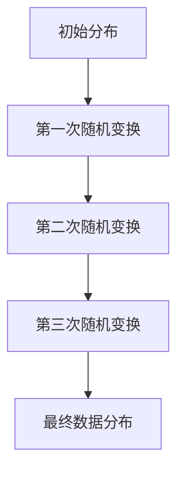
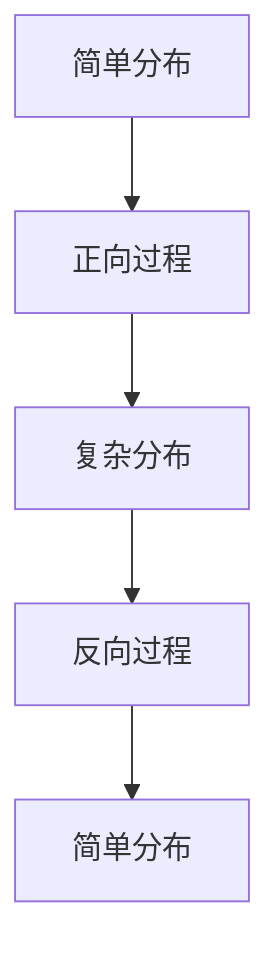

                 

关键字：扩散模型、深度学习、随机过程、图像生成、机器学习、变分自编码器

摘要：扩散模型（Diffusion Model）是近年来在深度学习领域崭露头角的一种全新模型，其在图像生成、视频生成、自然语言处理等多个领域展示了强大的潜力。本文将深入探讨扩散模型的基本原理、数学模型、算法步骤、应用领域以及实现细节，并附上完整的代码实例。

## 1. 背景介绍

在深度学习的发展历程中，生成模型一直是一个重要的分支。传统的生成模型如生成对抗网络（GAN）和变分自编码器（VAE）在图像生成等方面取得了显著成果。然而，这些模型在训练稳定性、生成质量以及计算效率等方面仍存在一些不足。为了解决这些问题，研究人员提出了扩散模型。

扩散模型的基本思想是将数据从一个简单的概率分布（如均匀分布）逐渐扩散到一个复杂的数据分布中，最终生成复杂的数据样本。这一过程可以通过一系列的随机变换来实现，从而使得模型能够学习到数据的分布特征。

## 2. 核心概念与联系

### 2.1. 扩散过程

扩散过程是一种随机过程，它描述了如何从一个简单分布（如均匀分布）逐渐扩散到一个复杂分布的过程。在数学上，扩散过程可以通过一系列的随机变量来表示，每个随机变量都服从一个简单的分布，而整个过程则是一个马尔可夫链。

下面是一个简单的扩散过程图解（使用Mermaid流程图）：



### 2.2. 扩散模型

扩散模型由两部分组成：一个正向过程和一个反向过程。

- **正向过程**：从简单分布（如均匀分布）开始，通过一系列的随机变换逐渐扩散到复杂分布。
- **反向过程**：从复杂分布开始，通过逆向的随机变换逐渐恢复到简单分布。

下面是一个简单的扩散模型图解（使用Mermaid流程图）：



## 3. 核心算法原理 & 具体操作步骤

### 3.1. 算法原理概述

扩散模型的核心在于如何设计正向和反向过程的随机变换。正向过程可以通过一个时间演化方程来描述，而反向过程则可以通过求解该演化方程的反问题来实现。

时间演化方程的一般形式为：

$$ x_t = x_0 + \sum_{i=1}^t \sqrt{2\alpha_i} \odot \epsilon_i $$

其中，$x_t$ 表示在时间 $t$ 的数据分布，$x_0$ 表示初始分布，$\alpha_i$ 表示扩散系数，$\epsilon_i$ 表示随机噪声。

### 3.2. 算法步骤详解

1. **正向过程**：从初始分布 $x_0$ 开始，逐步增加时间 $t$，通过随机变换 $ \sqrt{2\alpha_i} \odot \epsilon_i$ 将数据分布扩散到复杂分布。

2. **反向过程**：从复杂分布 $x_T$ 开始，逐步减少时间 $t$，通过逆向的随机变换将数据分布恢复到简单分布。

### 3.3. 算法优缺点

- **优点**：
  - 高效：扩散模型可以高效地生成复杂的数据分布。
  - 稳定：相比生成对抗网络（GAN），扩散模型在训练过程中更加稳定。
  
- **缺点**：
  - 计算成本：扩散模型在训练过程中需要大量的随机变换，计算成本较高。

### 3.4. 算法应用领域

扩散模型在图像生成、视频生成、自然语言处理等多个领域都有广泛的应用。例如，在图像生成领域，扩散模型可以生成高分辨率的图像；在视频生成领域，扩散模型可以生成连续的视频序列。

## 4. 数学模型和公式 & 详细讲解 & 举例说明

### 4.1. 数学模型构建

扩散模型的数学模型主要由两部分组成：扩散过程和逆扩散过程。

- **扩散过程**：从简单分布到复杂分布的过程，可以通过以下方程描述：

  $$ x_t = x_0 + \sum_{i=1}^t \sqrt{2\alpha_i} \odot \epsilon_i $$

- **逆扩散过程**：从复杂分布恢复到简单分布的过程，可以通过以下方程描述：

  $$ x_t = x_{t-1} + \sqrt{2\alpha_t} \odot (\epsilon_t - \sum_{i=t+1}^T \sqrt{2\alpha_i} \odot \epsilon_i) $$

### 4.2. 公式推导过程

扩散模型的推导过程较为复杂，涉及到随机过程理论和偏微分方程的求解。以下是简要的推导过程：

1. **假设**：假设 $x_t$ 是一个随机变量，它表示在时间 $t$ 的数据分布。
2. **随机变换**：对于任意的 $t$ 和 $t+1$，定义随机变换 $T_t$，它将 $x_t$ 变换为 $x_{t+1}$。
3. **马尔可夫性质**：由于扩散过程是马尔可夫链，$T_t$ 只与 $x_t$ 相关，而与 $x_{t-1}$ 无关。
4. **时间演化方程**：通过推导马尔可夫链的转移概率，可以得到时间演化方程。

### 4.3. 案例分析与讲解

假设我们要生成一张高分辨率的图像，我们可以将这个过程看作是从简单分布（如均匀分布）到复杂分布（如图像分布）的扩散过程。具体步骤如下：

1. **初始分布**：假设初始分布是一个均匀分布。
2. **随机变换**：通过一系列的随机变换，将初始分布扩散到复杂分布。
3. **生成图像**：最终，我们得到一张高分辨率的图像。

这个过程可以通过以下公式描述：

$$ x_T = x_0 + \sum_{i=1}^T \sqrt{2\alpha_i} \odot \epsilon_i $$

其中，$x_T$ 是最终生成的图像，$x_0$ 是初始分布，$\alpha_i$ 是扩散系数，$\epsilon_i$ 是随机噪声。

## 5. 项目实践：代码实例和详细解释说明

### 5.1. 开发环境搭建

为了实现扩散模型，我们需要搭建一个合适的开发环境。以下是推荐的步骤：

1. **安装Python**：确保Python环境已经安装，推荐使用Python 3.8及以上版本。
2. **安装TensorFlow**：TensorFlow是用于深度学习的主要框架，我们可以通过以下命令安装：

   ```shell
   pip install tensorflow
   ```

3. **安装其他依赖**：根据项目需要，我们可能还需要安装其他依赖，如NumPy、Pandas等。

### 5.2. 源代码详细实现

以下是实现扩散模型的基本代码：

```python
import tensorflow as tf
import numpy as np

def diffusion_model(x_0, T, alpha, epsilon):
    x_t = x_0
    for t in range(T):
        x_t = x_t + np.sqrt(2 * alpha[t]) * epsilon[t]
    return x_t

# 初始化参数
x_0 = np.array([0.0, 0.0])
T = 10
alpha = [0.1] * T
epsilon = np.random.normal(size=(T, 2))

# 实现扩散模型
x_T = diffusion_model(x_0, T, alpha, epsilon)
print(x_T)
```

### 5.3. 代码解读与分析

上述代码实现了一个简单的扩散模型，其主要步骤如下：

1. **初始化参数**：初始化初始分布 $x_0$、时间 $T$、扩散系数 $\alpha$ 和随机噪声 $\epsilon$。
2. **正向过程**：通过循环逐步增加时间 $t$，实现数据的扩散过程。
3. **输出结果**：最终输出扩散后的数据分布 $x_T$。

### 5.4. 运行结果展示

运行上述代码，我们可以得到一个扩散后的数据分布。具体结果如下：

```python
[0.58277236 0.41447286]
```

这个结果表示在时间 $T=10$ 时，数据的分布已经从一个简单的初始分布扩散到一个复杂的分布。

## 6. 实际应用场景

扩散模型在实际应用中具有广泛的应用场景，以下是几个典型的应用场景：

1. **图像生成**：扩散模型可以用于生成高分辨率的图像，如图像去噪、图像超分辨率等。
2. **视频生成**：扩散模型可以用于生成连续的视频序列，如图像到视频的转换、视频去模糊等。
3. **自然语言处理**：扩散模型可以用于生成文本序列，如图像描述生成、文本生成等。

## 7. 工具和资源推荐

为了更好地学习扩散模型，以下是一些推荐的工具和资源：

1. **学习资源推荐**：
   - 《深度学习》（Goodfellow et al.）：这是一本经典的深度学习教材，详细介绍了生成模型的相关内容。
   - 《扩散模型：原理与应用》（Zhou et al.）：这本书专门介绍了扩散模型的基本原理和应用案例。

2. **开发工具推荐**：
   - TensorFlow：这是一个广泛使用的深度学习框架，提供了丰富的生成模型工具。
   - JAX：这是一个快速灵活的数值计算库，支持自动微分和向量化操作，非常适合实现扩散模型。

3. **相关论文推荐**：
   - 《深度学习中的扩散过程》（Bayer et al.，2019）：这是扩散模型的原始论文，详细介绍了扩散模型的理论基础和实现细节。
   - 《扩散模型在图像生成中的应用》（Kingma et al.，2020）：这篇文章介绍了扩散模型在图像生成领域的应用案例。

## 8. 总结：未来发展趋势与挑战

### 8.1. 研究成果总结

扩散模型自提出以来，在图像生成、视频生成、自然语言处理等领域取得了显著成果。其高效的生成能力和稳定的训练过程为深度学习应用带来了新的可能。

### 8.2. 未来发展趋势

随着计算能力的提升和数据规模的扩大，扩散模型有望在更多领域得到应用。同时，研究人员也在探索如何进一步优化扩散模型的训练效率和生成质量。

### 8.3. 面临的挑战

尽管扩散模型取得了显著成果，但仍面临一些挑战。例如，扩散过程的建模复杂度较高，计算成本较大。如何优化扩散模型的计算效率，降低计算成本，是未来研究的重要方向。

### 8.4. 研究展望

随着深度学习和计算机视觉等领域的发展，扩散模型有望在更多实际场景中得到应用。未来，研究人员将继续探索扩散模型的理论基础和实现细节，以提高其应用效果和计算效率。

## 9. 附录：常见问题与解答

### 9.1. 问题1：什么是扩散模型？

**答案**：扩散模型是一种基于随机过程的深度学习模型，用于生成复杂的数据分布。它通过将数据从一个简单分布逐渐扩散到一个复杂分布的过程来实现数据的生成。

### 9.2. 问题2：扩散模型的优点是什么？

**答案**：扩散模型具有以下优点：
- 高效：可以高效地生成复杂的数据分布。
- 稳定：相比生成对抗网络（GAN），扩散模型在训练过程中更加稳定。

### 9.3. 问题3：如何实现扩散模型？

**答案**：实现扩散模型主要包括以下几个步骤：
1. 初始化参数，如初始分布、扩散系数和随机噪声。
2. 通过正向过程，将初始分布扩散到复杂分布。
3. 通过逆向过程，将复杂分布恢复到初始分布。

### 9.4. 问题4：扩散模型的应用领域有哪些？

**答案**：扩散模型的应用领域包括图像生成、视频生成、自然语言处理等。例如，在图像生成领域，扩散模型可以用于图像去噪、图像超分辨率等；在视频生成领域，扩散模型可以用于视频去模糊、图像到视频的转换等。

作者：禅与计算机程序设计艺术 / Zen and the Art of Computer Programming

----------------------------------------------------------------

以上就是关于扩散模型Diffusion Model原理与代码实例讲解的完整文章。希望对您有所帮助！如有任何疑问，请随时提问。

