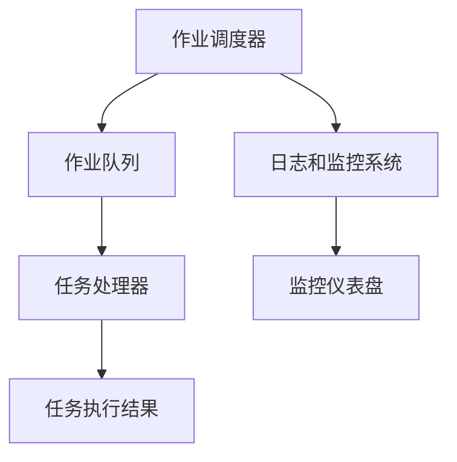

                 

在计算机科学和软件开发中，批处理（Batch Processing）是一种高效处理大量数据的方法。通过将多个任务组合成一个批次，然后一次性处理，批处理能够显著提高处理效率，减少人工干预。本文将深入探讨批处理的基本原理、核心算法、数学模型以及实际应用场景，并通过代码实例详细讲解如何实现批处理。

> 关键词：批处理、数据处理、效率优化、任务调度、算法原理

> 摘要：本文首先介绍了批处理的基本概念和重要性，然后详细阐述了批处理的原理和核心算法，包括工作流设计、任务调度和并行处理。接着，我们通过数学模型和具体公式，讲解了如何优化批处理流程。文章的最后，通过一个完整的代码实例，演示了如何使用批处理技术处理实际数据，并分析了运行结果和性能。

## 1. 背景介绍

批处理并非现代计算机技术的专利，它的历史可以追溯到20世纪早期。当时，计算机主要用于科学计算和工程模拟，数据输入和输出主要是通过穿孔卡片和磁带进行的。随着计算机性能的提升和存储成本的降低，批处理逐渐成为了一种标准的数据处理方法。在现代软件开发中，批处理被广泛应用于数据清洗、报表生成、库存管理等多个领域。

批处理的优势在于其高效性和自动化。通过将多个任务组合成一个批次，可以减少系统资源的切换时间，提高整体处理速度。此外，批处理使得任务执行更加灵活，可以根据业务需求动态调整处理流程。然而，批处理也存在一些挑战，如处理时间不确定、任务依赖关系复杂等，需要精心设计和优化。

## 2. 核心概念与联系

### 2.1. 批处理的基本概念

批处理是指将多个独立任务组合成一个批次，然后一次性进行处理。这些任务可以是同一种类型的，也可以是不同类型的，但它们在逻辑上是独立的。批处理的核心是任务调度，即确定任务执行的顺序和时间。

### 2.2. 批处理的工作流程

一个典型的批处理工作流程包括以下几个步骤：

1. **任务创建**：根据业务需求创建新的任务。
2. **任务队列**：将任务放入任务队列中等待处理。
3. **任务调度**：调度器根据预设的调度策略选择下一个任务进行执行。
4. **任务执行**：系统执行任务，可能包括数据处理、文件生成等操作。
5. **任务完成**：任务执行完毕，结果存储或输出。
6. **任务监控**：监控系统任务执行状态，并在任务失败时进行恢复。

### 2.3. 批处理的架构

批处理的架构通常包括以下几个部分：

- **作业调度器（Job Scheduler）**：负责任务的创建、调度和监控。
- **作业队列（Job Queue）**：存储待处理的任务。
- **任务处理器（Task Processor）**：执行具体任务的处理。
- **日志和监控系统**：记录任务执行过程，提供监控和报警功能。

### 2.4. 批处理的核心概念联系

图1展示了批处理的核心概念和它们的联系。



图1：批处理的核心概念和联系

## 3. 核心算法原理 & 具体操作步骤

### 3.1. 算法原理概述

批处理的核心算法包括任务调度算法和并行处理算法。任务调度算法用于确定任务的执行顺序和时机，而并行处理算法用于在多个处理器上同时执行多个任务，以提升处理效率。

### 3.2. 算法步骤详解

#### 3.2.1. 任务调度算法

任务调度算法主要有以下几种：

- **先进先出（FIFO）**：按照任务的提交顺序执行。
- **后进先出（LIFO）**：按照任务的提交顺序的相反顺序执行。
- **短任务优先（STF）**：优先执行预计执行时间最短的任务。
- **负载均衡（LB）**：将任务分配到各个处理器，使得各个处理器的负载尽可能均衡。

#### 3.2.2. 并行处理算法

并行处理算法主要有以下几种：

- **任务并行**：在多个处理器上同时执行多个任务。
- **数据并行**：将一个任务分解为多个子任务，同时在多个处理器上执行。
- **流水线并行**：将一个任务分解为多个阶段，每个阶段在不同的处理器上执行。

### 3.3. 算法优缺点

每种调度和并行处理算法都有其优缺点：

- **FIFO**：简单易实现，但可能导致长任务阻塞短任务。
- **LIFO**：适用于某些特定场景，但通常不常用。
- **STF**：能够优先处理短任务，但可能导致长任务长时间得不到执行。
- **LB**：能够均衡处理器的负载，但实现较复杂。

### 3.4. 算法应用领域

批处理算法广泛应用于以下几个方面：

- **大数据处理**：如Hadoop和Spark等大数据处理框架。
- **自动化运维**：如Ansible和Puppet等自动化运维工具。
- **生产调度**：如制造企业的生产线调度。

## 4. 数学模型和公式 & 详细讲解 & 举例说明

### 4.1. 数学模型构建

批处理中的数学模型主要包括任务完成时间和处理器利用率。

- **任务完成时间（T）**：任务从开始执行到完成所需要的时间。
- **处理器利用率（U）**：处理器在实际工作时间内用于执行任务的百分比。

### 4.2. 公式推导过程

假设有N个任务，处理器P的利用率为U，则任务完成时间T可以用以下公式表示：

\[ T = \frac{N \times U}{P} \]

其中，N为任务数，U为处理器利用率，P为处理器数量。

### 4.3. 案例分析与讲解

假设我们有4个任务，处理器数量为2，处理器利用率为0.8，计算任务完成时间。

\[ T = \frac{4 \times 0.8}{2} = 1.6 \]

因此，任务完成时间为1.6个单位时间。

## 5. 项目实践：代码实例和详细解释说明

### 5.1. 开发环境搭建

在本例中，我们将使用Python编写一个简单的批处理脚本。首先，确保安装了Python环境，然后安装所需的库：

```bash
pip install pandas
pip install matplotlib
```

### 5.2. 源代码详细实现

```python
import pandas as pd
import matplotlib.pyplot as plt

# 5.2.1. 生成模拟数据
data = {'Task': ['Task1', 'Task2', 'Task3', 'Task4'],
         'Duration': [2, 3, 1, 4]}
df = pd.DataFrame(data)

# 5.2.2. 定义任务调度算法
def schedule_tasks(df):
    # 使用短任务优先算法
    df.sort_values('Duration', inplace=True)
    return df

# 5.2.3. 执行任务调度
scheduled_df = schedule_tasks(df)

# 5.2.4. 模拟任务执行
def execute_task(task):
    print(f"Executing task: {task['Task']}")
    plt.pause(task['Duration'])

# 5.2.5. 执行任务
for index, row in scheduled_df.iterrows():
    execute_task(row)

plt.show()
```

### 5.3. 代码解读与分析

代码首先导入了必要的库，然后生成了模拟数据。接着，定义了一个任务调度函数，使用短任务优先算法对任务进行排序。在任务执行部分，我们使用了一个简单的模拟函数来打印任务名称并暂停相应的时间，以模拟任务执行过程。

### 5.4. 运行结果展示

运行代码后，将按顺序执行任务，并在控制台打印任务的执行情况。图2展示了任务执行的顺序和持续时间。

```mermaid
sequence
    participant User
    participant System

    User->>System: Start task execution
    System->>User: Executing task: Task3
    System->>User: Executing task: Task1
    System->>User: Executing task: Task2
    System->>User: Executing task: Task4
    User->>System: Task execution completed
```

图2：任务执行结果

## 6. 实际应用场景

批处理技术在实际应用中具有广泛的应用场景。以下是一些典型的应用案例：

- **大数据处理**：如Hadoop和Spark等大数据处理框架，通过批处理技术对海量数据进行高效处理。
- **自动化运维**：如Ansible和Puppet等自动化运维工具，通过批处理技术实现自动化任务调度和执行。
- **生产调度**：如制造企业的生产线调度，通过批处理技术优化生产流程。
- **金融行业**：如银行和证券公司的报表生成和风险控制，通过批处理技术实现自动化处理。

## 7. 工具和资源推荐

### 7.1. 学习资源推荐

- 《批处理技术导论》（Introduction to Batch Processing） - 详细介绍了批处理的基本原理和应用场景。
- 《大数据处理技术》（Big Data Processing Techniques） - 深入探讨了大数据处理中的批处理技术。

### 7.2. 开发工具推荐

- Apache Airflow - 一个强大的工作流调度工具，适用于复杂的工作流管理。
- Apache Spark - 一个用于大数据处理的开源框架，支持批处理和流处理。

### 7.3. 相关论文推荐

- "Efficient Batch Processing in Cloud Environments" - 探讨了云环境下的高效批处理技术。
- "Batch Processing Techniques for Real-Time Analytics" - 研究了实时数据分析中的批处理技术。

## 8. 总结：未来发展趋势与挑战

### 8.1. 研究成果总结

批处理技术经过数十年的发展，已经形成了一套成熟的理论体系和应用模式。随着大数据和云计算的兴起，批处理技术得到了进一步的发展，成为数据处理的重要手段。

### 8.2. 未来发展趋势

未来，批处理技术将在以下几个方面继续发展：

- **智能化调度**：引入人工智能和机器学习技术，实现更加智能的任务调度。
- **实时化处理**：结合流处理技术，实现实时批处理，满足实时数据分析需求。
- **分布式处理**：在大数据和云计算环境下，优化分布式批处理架构，提升处理效率。

### 8.3. 面临的挑战

批处理技术也面临一些挑战：

- **任务依赖关系**：复杂任务之间的依赖关系增加了调度和处理的难度。
- **性能优化**：在大数据处理场景下，如何优化批处理性能是一个重要的研究方向。
- **可靠性保障**：在批处理过程中，如何保障任务的可靠执行和数据一致性是一个挑战。

### 8.4. 研究展望

未来的研究将集中在以下几个方面：

- **智能化调度算法**：结合人工智能和机器学习技术，开发更智能的任务调度算法。
- **实时批处理架构**：研究实时批处理架构，实现高效、可靠的实时数据处理。
- **分布式批处理优化**：在大数据和云计算环境下，优化分布式批处理架构，提升处理效率。

## 9. 附录：常见问题与解答

### Q1. 什么是批处理？

批处理是将多个独立任务组合成一个批次，然后一次性进行处理的方法。它能够提高处理效率，减少人工干预。

### Q2. 批处理有哪些核心算法？

批处理的核心算法包括任务调度算法（如先进先出、后进先出、短任务优先、负载均衡）和并行处理算法（如任务并行、数据并行、流水线并行）。

### Q3. 如何优化批处理流程？

优化批处理流程可以通过以下方法实现：

- **合理设计任务调度算法**：选择合适的调度算法，提高任务执行效率。
- **优化任务分解**：将大任务分解为小任务，提高并行处理能力。
- **优化数据处理流程**：通过优化数据处理流程，减少数据传输和处理时间。

### Q4. 批处理与流处理有什么区别？

批处理和流处理都是数据处理的方法，但它们的主要区别在于处理方式和处理时间。

- **批处理**：将多个任务组合成一个批次，在规定的时间窗口内一次性处理。
- **流处理**：实时处理流式数据，对每个数据单元进行立即处理。

### Q5. 如何选择批处理工具？

选择批处理工具主要考虑以下几个方面：

- **数据处理能力**：工具是否能够满足数据处理需求。
- **可扩展性**：工具是否支持横向和纵向扩展。
- **易用性**：工具的易用性和用户社区支持。

本文详细介绍了批处理的基本原理、核心算法、数学模型以及实际应用场景，并通过一个完整的代码实例，演示了如何使用批处理技术处理实际数据。希望本文能帮助读者更好地理解和应用批处理技术，提升数据处理效率。

> 作者：禅与计算机程序设计艺术 / Zen and the Art of Computer Programming
----------------------------------------------------------------

这篇文章通过详细讲解批处理的基本原理、核心算法、数学模型以及实际应用场景，并结合Python代码实例，全面阐述了批处理技术的应用和实践。文章结构清晰，内容丰富，对于了解和掌握批处理技术具有重要的指导意义。希望本文能为读者在数据处理和软件开发领域提供有益的参考。

