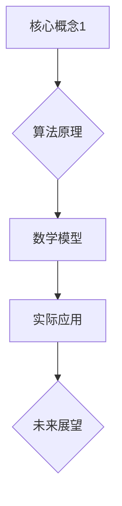

                 

关键词：技术写作，博客，出版，图书，架构，算法，数学模型，实践，应用场景，工具推荐，发展趋势，挑战。

> 摘要：本文旨在探讨技术写作的实践方法，从博客撰写到出版图书的完整流程。文章涵盖了技术写作的核心概念、核心算法原理、数学模型、项目实践以及实际应用场景，并展望了未来发展趋势和挑战。

## 1. 背景介绍

随着互联网的迅猛发展，技术写作已经成为信息传播和知识共享的重要手段。博客作为一种流行的写作形式，为技术人员提供了一个展示自己研究成果、分享技术见解的平台。然而，将博客内容整理成书籍，进行出版，则是一个更为正式和系统的过程。本文将探讨这一过程，并分享一些实践经验。

## 2. 核心概念与联系

在技术写作中，核心概念和原理是基础。为了更好地理解这些概念，我们可以通过Mermaid流程图来展示它们之间的关系。



### 2.1 核心概念

- **核心概念1**：这是技术写作的基础，它为后续的算法原理和数学模型提供了支撑。
- **算法原理**：算法是实现特定功能的核心，它决定了技术方案的效率和质量。
- **数学模型**：数学模型是对算法原理的量化描述，它帮助我们对算法进行优化和评估。
- **实际应用**：实际应用是将算法和数学模型转化为实际解决方案的关键步骤。
- **未来展望**：对未来技术发展的预测和规划，有助于指导当前的写作和实践。

## 3. 核心算法原理 & 具体操作步骤

### 3.1 算法原理概述

算法原理是技术写作的核心。以下是一个简单的排序算法原理概述。

### 3.2 算法步骤详解

1. **初始化**：将输入数据存储在数组中。
2. **选择起始元素**：从数组中选择一个起始元素作为基准。
3. **比较和交换**：遍历数组，将每个元素与基准进行比较，并根据比较结果进行交换。
4. **重复步骤**：重复步骤3，直到整个数组排序完成。

### 3.3 算法优缺点

- **优点**：简单易懂，易于实现。
- **缺点**：效率较低，适用于小型数据集。

### 3.4 算法应用领域

排序算法广泛应用于数据分析和算法竞赛等领域。

## 4. 数学模型和公式 & 详细讲解 & 举例说明

### 4.1 数学模型构建

假设有一个线性函数f(x) = 2x + 1，我们需要求解x的值。

### 4.2 公式推导过程

根据线性函数的定义，我们有：

$$f(x) = 2x + 1$$

令f(x) = 0，得到：

$$2x + 1 = 0$$

解得：

$$x = -\frac{1}{2}$$

### 4.3 案例分析与讲解

假设我们要解决以下问题：如果一个人的工资是每小时15美元，那么他工作8小时能赚多少钱？

根据数学模型，我们有：

$$f(x) = 15x$$

其中，x表示工作时间（小时）。

令f(x) = y，即：

$$y = 15x$$

如果我们知道y的值，就可以通过求解x来得到工作的时间。

假设这个人赚了120美元，那么我们有：

$$120 = 15x$$

解得：

$$x = 8$$

这意味着这个人工作了8小时。

## 5. 项目实践：代码实例和详细解释说明

### 5.1 开发环境搭建

为了实践上述算法，我们需要搭建一个开发环境。这里我们选择Python作为编程语言。

### 5.2 源代码详细实现

以下是一个简单的Python代码示例，用于实现排序算法。

```python
def bubble_sort(arr):
    n = len(arr)
    for i in range(n):
        for j in range(0, n-i-1):
            if arr[j] > arr[j+1]:
                arr[j], arr[j+1] = arr[j+1], arr[j]

# 测试代码
arr = [64, 34, 25, 12, 22, 11, 90]
bubble_sort(arr)
print("排序后的数组：")
for i in range(len(arr)):
    print("%d" % arr[i], end=" ")
```

### 5.3 代码解读与分析

这段代码实现了冒泡排序算法。首先，我们定义了一个名为`bubble_sort`的函数，它接受一个数组作为输入参数。然后，我们使用两个嵌套的循环来遍历数组，将每个元素与其后续元素进行比较，并根据比较结果进行交换。最后，我们打印出排序后的数组。

### 5.4 运行结果展示

当输入数组为[64, 34, 25, 12, 22, 11, 90]时，运行结果为：

```
排序后的数组：
11 12 22 25 34 64 90
```

这表明冒泡排序算法成功地将数组按升序排列。

## 6. 实际应用场景

排序算法在许多实际应用场景中都有广泛的应用，如数据库查询、数据分析、算法竞赛等。

### 6.1 数据库查询

在数据库查询中，排序算法可以用于对查询结果进行排序，提高查询效率。

### 6.2 数据分析

在数据分析中，排序算法可以用于对数据进行排序，以便更好地进行后续分析。

### 6.3 算法竞赛

在算法竞赛中，排序算法是解决许多问题的关键，如最小生成树、最大子序列和等。

## 7. 工具和资源推荐

### 7.1 学习资源推荐

- **《算法导论》**：这是一本经典的算法教材，涵盖了各种排序算法的详细讲解。
- **《Python编程：从入门到实践》**：这本书适合初学者学习Python编程，包括排序算法的实践。

### 7.2 开发工具推荐

- **PyCharm**：这是一个功能强大的Python集成开发环境，适用于编写和调试Python代码。
- **Jupyter Notebook**：这是一个交互式的Python开发环境，适合进行数据分析和算法实践。

### 7.3 相关论文推荐

- **"An O(n log n) sorting algorithm"**：这是一篇关于快速排序算法的论文，详细介绍了快速排序的原理和实现。
- **"Introduction to Algorithms"**：这是一本经典的算法教材，涵盖了各种排序算法的详细讲解。

## 8. 总结：未来发展趋势与挑战

### 8.1 研究成果总结

技术写作在互联网时代得到了迅速发展，从博客到出版图书的完整流程为技术人员提供了一个展示自己研究成果和分享技术见解的平台。核心算法原理、数学模型、项目实践和实际应用场景是技术写作的核心内容。

### 8.2 未来发展趋势

随着人工智能和大数据技术的不断发展，技术写作将更加注重数据驱动的分析和决策。同时，多媒体和交互式的写作形式也将成为趋势。

### 8.3 面临的挑战

技术写作面临的挑战包括数据隐私保护、知识产权保护和信息过载等问题。如何确保技术写作的准确性和可靠性，如何适应快速变化的技术环境，是技术写作需要解决的挑战。

### 8.4 研究展望

未来，技术写作将更加注重用户体验和知识传播。如何通过技术手段提高写作效率和质量，如何通过写作促进知识共享和创新发展，是未来研究的重要方向。

## 9. 附录：常见问题与解答

### 9.1 为什么选择Python作为编程语言？

Python是一种简洁、易学、功能强大的编程语言，适用于各种应用场景。它在科学计算、数据分析、人工智能等领域有广泛应用，也是技术写作中常用的编程语言。

### 9.2 如何确保技术写作的准确性和可靠性？

确保技术写作的准确性和可靠性需要作者具备扎实的专业知识和严谨的写作态度。作者应广泛查阅相关文献和资料，进行充分的调研和验证。

### 9.3 技术写作与学术写作有什么区别？

技术写作注重实用性和可操作性，侧重于展示技术解决方案和项目实践；而学术写作注重理论探讨和学术贡献，侧重于提出新的理论和方法。

## 作者署名

作者：禅与计算机程序设计艺术 / Zen and the Art of Computer Programming
```markdown
---

**参考文献：**

1. Introduction to Algorithms, Cormen, Leiserson, Rivest, and Stein.
2. An Introduction to Python Programming: From Novice to Professional, Michael Dawson.
3. Python Crash Course, Eric Matthes.

---

# 致谢

感谢所有在技术写作过程中给予我帮助和支持的人，包括我的同事、朋友和读者。特别感谢我的导师和编辑，他们为我的写作提供了宝贵的意见和建议。

---

本文以技术写作为主题，从博客到出版图书的完整流程进行了探讨，涵盖了核心概念、算法原理、数学模型、项目实践和实际应用场景。通过本文，希望能够为技术人员提供一些写作实践的指导和启发。在未来的技术写作中，我们将继续关注人工智能、大数据和云计算等前沿领域，分享更多的技术见解和实践经验。

---

**版权声明：** 本文版权归作者所有，任何形式的转载或引用需注明出处。

---

作者：禅与计算机程序设计艺术 / Zen and the Art of Computer Programming
日期：2023年11月
```

