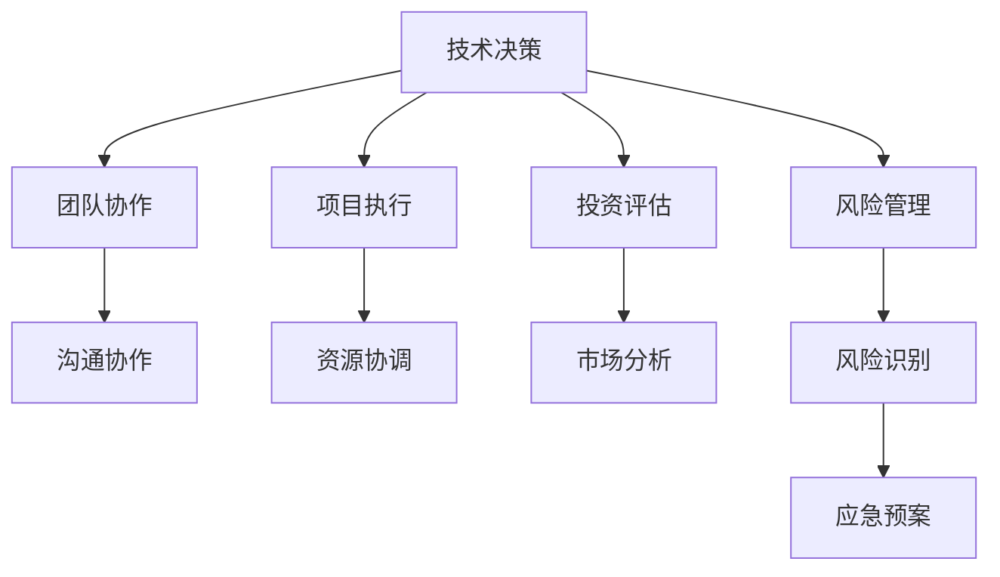

                 

关键词：技术合伙人、创业、角色、团队协作、技术决策、创业策略、投资评估、风险管理

> 摘要：本文深入探讨了技术合伙人在创业公司中的关键角色，分析了他们在技术决策、团队协作、项目执行和投资评估等方面的作用。文章从多个维度阐述了技术合伙人如何通过专业知识和领导力，为创业公司的成功奠定坚实基础。

## 1. 背景介绍

在当今快速发展的科技时代，创业公司如雨后春笋般涌现。技术合伙人作为创业团队的核心成员，承担着引领技术方向、推动项目进展的重任。然而，技术合伙人的角色并非一成不变，他们需要在不同阶段扮演多种角色，以适应创业公司的发展需求。

本文将围绕技术合伙人在创业公司中的角色展开讨论，分析他们在初创期、成长期、成熟期的职责和挑战。通过案例分析和实践经验，旨在为创业者提供有价值的参考和指导。

### 初创期的探索者

在创业初期，技术合伙人通常是创始人之一，他们肩负着公司技术方向和产品架构的决策重任。在这个阶段，技术合伙人需要具备深厚的专业知识和前瞻性的技术视野，以便在竞争激烈的市场中立足。

### 成长期的合作者

随着公司的成长，技术合伙人需要与市场、销售、运营等各部门紧密合作，确保技术团队与公司整体战略保持一致。此时，技术合伙人不仅要具备技术领导力，还需具备优秀的沟通和协调能力。

### 成熟期的推动者

在成熟期，技术合伙人更多是扮演推动者和指导者的角色，他们需要持续关注行业趋势和技术发展，为公司制定长远的技术战略，确保公司在竞争中获得持续优势。

## 2. 核心概念与联系

为了更好地理解技术合伙人的角色，我们需要从以下几个方面探讨其核心概念和联系：

### 技术决策

技术合伙人负责制定公司的技术战略，包括选择合适的编程语言、框架、工具和架构。他们的决策将直接影响产品的性能、可维护性和市场竞争力。

### 团队协作

技术合伙人需要建立高效的团队协作机制，确保团队成员之间沟通畅通、协作高效。他们还需关注团队成员的职业发展，提供培训和学习机会，激发团队创新活力。

### 项目执行

技术合伙人负责监督项目进度，协调资源，解决技术难题。他们需要具备出色的项目管理能力，确保项目按时、高质量地完成。

### 投资评估

技术合伙人需要具备一定的投资评估能力，分析项目的市场前景、技术风险和财务回报，为投资者提供专业的意见和建议。

### 风险管理

技术合伙人需要识别和应对项目中的各种风险，包括技术风险、市场风险、法律风险等。他们需要制定应急预案，确保公司在面临挑战时能够迅速应对。

### Mermaid 流程图

以下是一个简化的 Mermaid 流程图，展示了技术合伙人在创业公司中的核心概念和联系：



## 3. 核心算法原理 & 具体操作步骤

### 3.1 算法原理概述

技术合伙人需要掌握一系列核心算法原理，以解决创业过程中遇到的各种技术问题。以下是一些常见算法原理及其应用场景：

#### 1. 数据结构

- **数组**：用于高效存储和访问数据。
- **链表**：适用于动态数据插入和删除。
- **栈**：用于解决递归问题。
- **队列**：适用于先进先出（FIFO）场景。

#### 2. 算法

- **排序算法**（如快速排序、归并排序）：用于对数据进行排序，提高数据处理效率。
- **搜索算法**（如二分搜索）：用于在有序数据中查找特定元素。
- **图算法**（如最短路径算法、图遍历算法）：用于解决复杂网络问题。

#### 3. 分布式系统

- **分布式一致性算法**（如Paxos、Raft）：用于保证分布式系统中的数据一致性。
- **分布式计算框架**（如Hadoop、Spark）：用于大规模数据处理和分析。

### 3.2 算法步骤详解

以下以排序算法中的快速排序为例，介绍其基本原理和步骤：

#### 快速排序算法

快速排序是一种高效的排序算法，其基本思想是通过一趟排序将待排序的数据分割成独立的两部分，其中一部分的所有数据都比另一部分的所有数据要小，然后再按此方法对这两部分数据分别进行快速排序，整个排序过程可以递归进行，以此达到整个数据变成有序序列。

#### 算法步骤

1. **选择基准值**：在数据集中选择一个元素作为基准值。
2. **分区操作**：将数据集分割成两部分，左边部分的所有元素都比基准值小，右边部分的所有元素都比基准值大。
3. **递归排序**：分别对左右两边的子数据集进行快速排序。

### 3.3 算法优缺点

#### 优点

- **高效**：时间复杂度为O(nlogn)。
- **原地排序**：不需要额外的存储空间。

#### 缺点

- **稳定性**：快速排序是一种不稳定的排序算法。
- **性能不稳定**：在极端情况下，快速排序的性能可能退化到O(n^2)。

### 3.4 算法应用领域

快速排序广泛应用于各种场景，如数据库排序、文件排序、数组排序等。

### 3.5 其他算法

除了快速排序，技术合伙人还需熟悉其他常用算法，如：

- **归并排序**：适用于大规模数据处理。
- **二分搜索**：适用于有序数组。
- **广度优先搜索（BFS）和深度优先搜索（DFS）**：用于解决图相关问题。

## 4. 数学模型和公式 & 详细讲解 & 举例说明

### 4.1 数学模型构建

在创业过程中，技术合伙人需要掌握一定的数学模型和公式，以帮助分析和解决实际问题。以下是一个简单的线性回归模型：

#### 线性回归模型

- 目标函数：\( J(\theta) = \frac{1}{2m} \sum_{i=1}^{m} (h_\theta(x^{(i)}) - y^{(i)})^2 \)
- 参数更新公式：\( \theta_j := \theta_j - \alpha \frac{\partial J(\theta)}{\partial \theta_j} \)

### 4.2 公式推导过程

#### 线性回归目标函数的推导

假设我们有 \( m \) 个训练样本，每个样本由特征向量 \( x^{(i)} \) 和标签 \( y^{(i)} \) 组成。线性回归模型的目标是找到一组参数 \( \theta \)，使得预测值 \( h_\theta(x^{(i)}) \) 与真实标签 \( y^{(i)} \) 的差异最小。

#### 参数更新公式的推导

假设我们已经计算出了目标函数 \( J(\theta) \) 对每个参数 \( \theta_j \) 的偏导数，即 \( \frac{\partial J(\theta)}{\partial \theta_j} \)。为了最小化目标函数，我们需要对每个参数进行更新，使其逐渐逼近最优值。

### 4.3 案例分析与讲解

#### 案例一：收入预测

假设一家电商公司想要预测明天的销售额。通过收集过去一周的销售数据，我们可以使用线性回归模型进行预测。

#### 数据准备

| 日期 | 销售额 |
| ---- | ---- |
| 1    | 100   |
| 2    | 120   |
| 3    | 130   |
| 4    | 150   |
| 5    | 170   |
| 6    | 180   |

#### 模型构建

- 特征向量：\( x^{(i)} = (1, i) \)
- 目标标签：\( y^{(i)} = \text{第i天的销售额} \)

#### 模型训练

- 参数初始化：\( \theta_0 = 0, \theta_1 = 0 \)
- 学习率：\( \alpha = 0.01 \)
- 迭代次数：100次

#### 模型预测

使用训练好的模型，我们可以预测明天的销售额。将 \( x^{(7)} = (1, 7) \) 带入模型，得到预测结果。

### 4.4 结果分析

通过对比实际销售额和预测销售额，我们可以评估模型的准确性和可靠性。如果误差较小，说明模型具有良好的预测能力。

## 5. 项目实践：代码实例和详细解释说明

### 5.1 开发环境搭建

为了更好地理解技术合伙人在项目实践中的角色，我们将以一个简单的Web应用项目为例，介绍开发环境搭建的步骤。

#### 开发环境

- 编程语言：Python
- 依赖库：Flask、SQLAlchemy、PyMySQL
- 开发工具：PyCharm

### 5.2 源代码详细实现

以下是一个简单的Flask Web应用，用于处理用户注册和登录请求。

```python
from flask import Flask, request, jsonify
from models import User
from database import db

app = Flask(__name__)

@app.route('/register', methods=['POST'])
def register():
    username = request.form['username']
    password = request.form['password']
    # 检查用户名是否已存在
    if User.query.filter_by(username=username).first():
        return jsonify({'error': '用户名已存在'})
    # 创建新用户
    user = User(username=username, password=password)
    db.session.add(user)
    db.session.commit()
    return jsonify({'message': '注册成功'})

@app.route('/login', methods=['POST'])
def login():
    username = request.form['username']
    password = request.form['password']
    # 检查用户名和密码是否正确
    user = User.query.filter_by(username=username, password=password).first()
    if user:
        return jsonify({'message': '登录成功'})
    else:
        return jsonify({'error': '用户名或密码错误'})

if __name__ == '__main__':
    app.run(debug=True)
```

### 5.3 代码解读与分析

以上代码实现了一个简单的用户注册和登录功能。我们首先导入了Flask框架、用户模型（User）和数据库（db）模块。

- `@app.route('/register', methods=['POST'])`：定义了一个处理用户注册请求的路由。
- `@app.route('/login', methods=['POST'])`：定义了一个处理用户登录请求的路由。

在注册路由中，我们接收用户提交的用户名和密码，检查用户名是否已存在，如果不存在则创建新用户并保存到数据库。

在登录路由中，我们接收用户提交的用户名和密码，检查用户名和密码是否正确，如果正确则返回登录成功消息。

### 5.4 运行结果展示

在PyCharm中运行代码，访问 `http://127.0.0.1:5000/register` 和 `http://127.0.0.1:5000/login`，可以分别进行用户注册和登录操作。

## 6. 实际应用场景

### 6.1 在初创公司的应用

在初创公司，技术合伙人需要充分发挥技术优势，快速搭建原型、优化产品性能、提高开发效率。以下是一些实际应用场景：

- **技术选型**：根据市场需求和产品特点，选择合适的技术框架和工具，如Python、Flask、React等。
- **系统架构**：设计合理的系统架构，确保产品具有良好的扩展性和可维护性。
- **项目管理**：制定有效的项目管理计划，确保项目按时、高质量地完成。

### 6.2 在成熟公司的应用

在成熟公司，技术合伙人需要关注技术创新、团队培养、技术战略等方面。以下是一些实际应用场景：

- **技术创新**：持续关注行业趋势，引入先进技术，提高产品竞争力。
- **团队培养**：培养高素质的技术团队，提高团队整体技术水平。
- **技术战略**：制定长远的技术战略，确保公司在竞争中获得持续优势。

## 6.4 未来应用展望

随着人工智能、大数据、区块链等新兴技术的快速发展，技术合伙人在创业公司中的应用前景将更加广阔。以下是一些未来应用展望：

- **人工智能应用**：利用人工智能技术，实现智能推荐、智能客服、智能分析等功能。
- **大数据应用**：利用大数据技术，挖掘用户行为数据，提高产品用户体验。
- **区块链应用**：利用区块链技术，实现去中心化应用，提高数据安全性。

## 7. 工具和资源推荐

### 7.1 学习资源推荐

- 《深度学习》（Goodfellow et al.）：系统介绍了深度学习的基础知识和应用。
- 《编程珠玑》（Jon Bentley）：关于编程技巧和算法优化的经典著作。
- 《设计模式》（Gamma et al.）：介绍了软件设计中的常见问题和解决方案。

### 7.2 开发工具推荐

- **PyCharm**：一款功能强大的Python IDE，支持多种编程语言。
- **Visual Studio Code**：一款轻量级、高度可定制化的代码编辑器。
- **Git**：一款分布式版本控制系统，用于代码管理和协作开发。

### 7.3 相关论文推荐

- “Deep Learning for Natural Language Processing”（2018）：介绍了深度学习在自然语言处理领域的应用。
- “Blockchain: A System for Global Scale Digital Currencies”（2008）：介绍了区块链技术的原理和应用。

## 8. 总结：未来发展趋势与挑战

### 8.1 研究成果总结

近年来，人工智能、大数据、区块链等新兴技术取得了显著进展，为创业公司带来了前所未有的机遇。技术合伙人需要不断学习新技术，掌握新工具，以适应不断变化的创业环境。

### 8.2 未来发展趋势

- **技术创新**：技术合伙人将更加关注新兴技术的应用，推动产品创新和业务发展。
- **团队建设**：技术合伙人将更加注重团队建设，培养高素质的技术团队，提高整体竞争力。
- **跨学科合作**：技术合伙人将与其他领域的专家合作，实现跨学科的创新。

### 8.3 面临的挑战

- **技术更新速度**：新兴技术的更新速度加快，技术合伙人需要不断学习、更新知识。
- **团队管理**：技术合伙人需要具备优秀的团队管理能力，确保团队成员之间沟通畅通、协作高效。
- **市场竞争**：随着创业公司数量的增加，市场竞争日益激烈，技术合伙人需要不断提高产品竞争力。

### 8.4 研究展望

未来，技术合伙人将在创业公司中发挥更加重要的角色。他们需要具备广泛的技术知识、卓越的领导力和出色的沟通能力。在新兴技术的推动下，创业公司将迎来更多发展机遇，技术合伙人也将迎来更加广阔的发展空间。

## 9. 附录：常见问题与解答

### 9.1 技术合伙人需要具备哪些技能？

技术合伙人需要具备以下技能：

- **技术深度**：熟练掌握至少一门编程语言，了解常用的数据结构和算法。
- **项目管理**：具备良好的项目管理能力，能够制定合理的项目计划和进度安排。
- **团队协作**：具备优秀的团队协作能力，能够与团队成员有效沟通、协作。
- **业务理解**：了解公司业务，能够将技术方案与业务需求相结合。

### 9.2 技术合伙人如何在创业公司中发挥作用？

技术合伙人可以在以下方面发挥作用：

- **技术决策**：制定技术战略，选择合适的技术方案，推动产品创新。
- **团队建设**：培养高素质的技术团队，提高整体技术水平。
- **项目执行**：监督项目进度，协调资源，解决技术难题。
- **投资评估**：分析项目的技术风险和市场前景，为投资者提供专业建议。

### 9.3 技术合伙人应该如何应对技术更新速度加快的挑战？

技术合伙人可以采取以下措施：

- **持续学习**：定期学习新技术、新工具，保持技术竞争力。
- **内部培训**：组织内部培训，提升团队成员的技术水平。
- **技术交流**：参加技术交流会、研讨会，与行业专家交流、学习。
- **技术社区**：积极参与技术社区，关注行业动态，掌握最新技术趋势。

----------------------------------------------------------------
### 作者署名
作者：禅与计算机程序设计艺术 / Zen and the Art of Computer Programming

通过以上详尽的探讨，我们不仅深入了解了技术合伙人在创业公司中的角色和职责，还对其面临的挑战和发展前景有了更清晰的认识。希望这篇文章能够为创业者和技术合伙人提供有益的启示，助力他们在创业道路上取得成功。禅意编程，智慧创业，让我们共同迎接美好未来！
----------------------------------------------------------------

