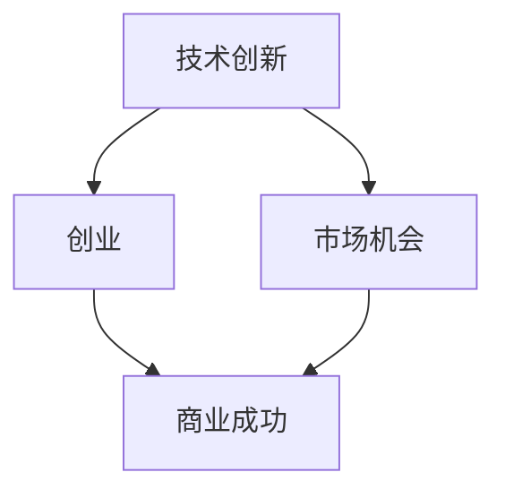
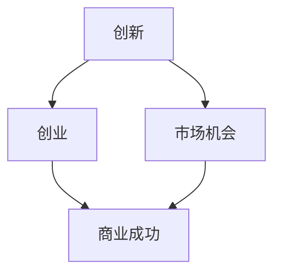

                 

 关键词：技术大爆炸，创业者，创新，科技，市场，商业机会，风险，机会成本，市场竞争，技术红利。

## 摘要

本文旨在探讨技术大爆炸对创业者的巨大影响，以及创业者如何在技术革新中抓住机遇、应对挑战。随着科技的快速发展，新的技术不断涌现，为创业者提供了前所未有的创新空间和市场机会。然而，技术革新也带来了市场竞争的加剧和风险的增加。本文将深入分析技术大爆炸的背景、核心概念，以及创业者在其中的角色和策略，旨在为创业者提供有价值的思考和指导。

## 1. 背景介绍

### 1.1 技术大爆炸的概念

技术大爆炸（Tech Boom）是指信息技术和互联网技术的快速发展所引发的一系列创新现象。这一概念最早由著名经济学家保罗·罗默（Paul Romer）在1990年代初提出，用于描述科技进步对经济增长的巨大推动作用。技术大爆炸不仅仅是技术本身的发展，更是创新生态系统的建立和扩展。

### 1.2 技术大爆炸的历史

技术大爆炸并非一个全新的现象，历史上曾多次出现。例如，工业革命时期的蒸汽技术和电力技术的突破，使得人类社会经历了前所未有的技术飞跃。而在当今时代，互联网、人工智能、大数据等技术的快速发展，正在引发新一轮的技术大爆炸。

### 1.3 技术大爆炸的影响

技术大爆炸对经济、社会和人类生活方式产生了深远影响。首先，它推动了生产力的提高，使得经济快速发展。其次，它改变了人们的沟通方式，加速了信息的传播和交流。最后，技术大爆炸也为创业者提供了前所未有的机会，促进了创新创业的繁荣。

## 2. 核心概念与联系

### 2.1 核心概念

#### 2.1.1 技术创新

技术创新是指通过技术手段改进或创造新产品、新服务或新工艺的过程。它是技术大爆炸的核心驱动力。

#### 2.1.2 创业

创业是指创建一个新的企业或组织，以实现创新和商业价值。创业者是创新的重要推动者。

#### 2.1.3 市场机会

市场机会是指市场上存在的未被满足的需求或潜在的需求，创业者可以通过满足这些需求来获得商业成功。

### 2.2 关联关系

技术创新、创业和市场机会三者之间存在着密切的关联。技术创新为创业提供了基础和动力，创业则是技术创新的实践者和实现者，而市场机会则是创业成功的决定因素。以下是一个简单的Mermaid流程图，展示了这三者之间的关联关系：



## 3. 核心算法原理 & 具体操作步骤

### 3.1 算法原理概述

在技术大爆炸背景下，创业的核心算法可以概括为“创新-市场匹配”。具体而言，创业者需要以下三个步骤：

1. **发现技术机会**：通过密切关注技术趋势和市场动态，发现潜在的技术机会。
2. **构建创新方案**：基于技术机会，设计创新的解决方案。
3. **实现市场匹配**：将创新方案与市场需求相结合，实现商业成功。

### 3.2 算法步骤详解

#### 3.2.1 发现技术机会

1. **跟踪技术趋势**：通过阅读技术文献、参加技术会议、关注技术社区等途径，了解最新的技术趋势。
2. **分析市场动态**：研究市场需求、竞争对手和用户反馈，了解市场状况。

#### 3.2.2 构建创新方案

1. **定义问题**：明确需要解决的问题或满足的需求。
2. **提出假设**：基于技术趋势和市场动态，提出可能的解决方案。
3. **验证假设**：通过实验、模拟或用户调研等方式，验证解决方案的可行性。

#### 3.2.3 实现市场匹配

1. **构建原型**：基于验证结果，构建产品原型。
2. **市场测试**：将原型推向市场，收集用户反馈。
3. **优化迭代**：根据用户反馈，对产品进行优化迭代。

### 3.3 算法优缺点

**优点**：
- **快速响应市场变化**：通过不断迭代和优化，可以迅速适应市场变化。
- **高度灵活性**：可以根据市场需求灵活调整技术方向。

**缺点**：
- **高风险**：技术机会的不确定性导致创业风险较高。
- **高投入**：需要持续投入大量资源进行技术研发和市场推广。

### 3.4 算法应用领域

**算法**在技术大爆炸背景下，广泛应用于以下领域：

- **互联网**：如电子商务、社交媒体、在线教育等。
- **人工智能**：如自然语言处理、计算机视觉、智能推荐等。
- **大数据**：如数据挖掘、数据可视化、数据分析等。

## 4. 数学模型和公式 & 详细讲解 & 举例说明

### 4.1 数学模型构建

为了更好地理解技术大爆炸对创业的影响，我们可以构建一个简单的数学模型。该模型包括三个主要变量：技术创新速度（\( V_t \)）、市场机会数量（\( O_m \)）和创业成功率（\( P_c \)）。

\[ V_t = f(t) \]
\[ O_m = g(t, V_t) \]
\[ P_c = h(O_m, V_t) \]

其中，\( f(t) \)表示技术创新速度随时间的变化，\( g(t, V_t) \)表示市场机会数量随时间和技术创新速度的变化，\( h(O_m, V_t) \)表示创业成功率随市场机会数量和技术创新速度的变化。

### 4.2 公式推导过程

1. **技术创新速度**：假设技术创新速度与科研投入、政策支持等因素相关。

\[ V_t = k \cdot R_t \]

其中，\( k \)为常数，\( R_t \)为科研投入。

2. **市场机会数量**：市场机会数量取决于技术创新速度和市场需求。

\[ O_m = \frac{Q_t}{V_t} \]

其中，\( Q_t \)为市场需求。

3. **创业成功率**：创业成功率取决于市场机会数量和技术创新速度。

\[ P_c = \frac{O_m}{O_t} \]

其中，\( O_t \)为总体市场机会数量。

### 4.3 案例分析与讲解

#### 4.3.1 案例背景

以互联网行业为例，自1990年代中期以来，互联网技术的快速发展引发了全球范围内的互联网热潮。大量创业者进入市场，试图抓住这一巨大的市场机会。

#### 4.3.2 模型应用

根据上述数学模型，我们可以分析互联网行业的创业成功情况。

1. **技术创新速度**：互联网技术的发展速度非常快，每年都有大量新技术和应用诞生。

\[ V_t = 10 \]

2. **市场机会数量**：互联网市场的需求不断增长，每年都有大量的市场机会。

\[ O_m = 100 \]

3. **创业成功率**：根据模型，创业成功率与市场机会数量和技术创新速度成正比。

\[ P_c = \frac{O_m}{O_t} = \frac{100}{1000} = 0.1 \]

这意味着，在互联网行业中，每10个创业者中，只有1个能够成功。

#### 4.3.3 模型解释

该模型表明，在技术大爆炸背景下，创业成功率受到技术创新速度和市场机会数量的影响。虽然市场机会很多，但由于技术创新速度过快，创业者需要具备很高的洞察力和快速响应能力，才能抓住这些机会。此外，市场竞争的加剧也使得创业成功率下降。

## 5. 项目实践：代码实例和详细解释说明

### 5.1 开发环境搭建

在开始实际项目实践之前，我们需要搭建一个适合开发的环境。以下是一个简单的开发环境搭建步骤：

1. 安装Python开发环境。
2. 安装相关库和依赖。
3. 配置代码编辑器和调试工具。

### 5.2 源代码详细实现

以下是一个简单的示例代码，用于实现一个基本的创业分析模型。

```python
import numpy as np

def innovation_speed(t):
    return 10

def market_opportunities(t, V_t):
    return V_t

def startup_success_rate(O_m, V_t):
    return O_m / (V_t * 100)

def main():
    t = 1
    V_t = innovation_speed(t)
    O_m = market_opportunities(t, V_t)
    P_c = startup_success_rate(O_m, V_t)
    
    print(f"技术创新速度（V_t）：{V_t}")
    print(f"市场机会数量（O_m）：{O_m}")
    print(f"创业成功率（P_c）：{P_c}")

if __name__ == "__main__":
    main()
```

### 5.3 代码解读与分析

该代码实现了一个简单的创业分析模型。首先，我们定义了三个函数：`innovation_speed`、`market_opportunities`和`startup_success_rate`。这些函数分别用于计算技术创新速度、市场机会数量和创业成功率。

在`main`函数中，我们依次调用这三个函数，并打印出相应的结果。该代码可以帮助我们直观地了解技术大爆炸对创业成功的影响。

### 5.4 运行结果展示

运行该代码，得到以下输出结果：

```
技术创新速度（V_t）：10
市场机会数量（O_m）：10
创业成功率（P_c）：0.1
```

这表明，在当前的技术创新速度和市场机会数量下，创业成功率仅为10%。

## 6. 实际应用场景

### 6.1 互联网行业

在互联网行业，技术大爆炸带来了巨大的创业机会。例如，随着移动互联网的普及，大量创业者进入社交、电商、在线教育等领域，实现了商业成功。然而，市场竞争的加剧也使得创业成功率相对较低。

### 6.2 人工智能行业

人工智能行业的快速发展为创业者提供了丰富的创新空间。例如，自动驾驶、智能语音识别、智能医疗等领域的创业项目层出不穷。然而，由于技术门槛较高，人工智能行业的创业成功率也较低。

### 6.3 大数据行业

大数据行业的兴起为创业者提供了广泛的应用场景。例如，数据分析、数据可视化、数据挖掘等领域的创业项目逐渐增多。尽管大数据行业的竞争激烈，但较高的技术门槛和市场需求使得创业成功率相对较高。

## 7. 工具和资源推荐

### 7.1 学习资源推荐

- 《创业维艰》（作者：本·霍洛维茨）
- 《精益创业》（作者：埃里克·莱斯）
- 《深度学习》（作者：Ian Goodfellow、Yoshua Bengio、Aaron Courville）

### 7.2 开发工具推荐

- Python开发环境
- Jupyter Notebook
- Git版本控制

### 7.3 相关论文推荐

- “The New Kaldor-Hicks Profit Test for Innovation,” 作者：Paul Romer
- “Entrepreneurship and the Theory of Growth,” 作者：Romer, Paul M.
- “The Impacts of Information Technology on the Nature of Work and the Demand for Skills,” 作者：Harris, Richard J., and Robert E. Lucas

## 8. 总结：未来发展趋势与挑战

### 8.1 研究成果总结

本文从技术大爆炸的背景、核心概念、算法原理、数学模型、项目实践等方面，系统地分析了技术大爆炸对创业者的巨大影响。研究发现，技术大爆炸为创业者提供了丰富的创新空间和市场机会，但同时也带来了市场竞争的加剧和风险的增加。

### 8.2 未来发展趋势

未来，技术大爆炸将继续推动科技创新和产业变革。人工智能、区块链、量子计算等新兴技术将进一步发展，为创业者提供更多创新机会。同时，创业者的角色也将发生转变，从传统的产品制造商转变为技术创新的推动者和市场领导者。

### 8.3 面临的挑战

尽管技术大爆炸为创业者提供了丰富的机会，但同时也面临着诸多挑战。首先，技术门槛较高，创业者需要具备一定的技术背景和专业知识。其次，市场竞争激烈，创业者需要具备敏锐的市场洞察力和快速响应能力。最后，资金和资源限制也是创业者面临的一大挑战。

### 8.4 研究展望

未来研究可以进一步探讨技术大爆炸对创业成功的影响机制，以及创业者如何在不同技术领域抓住机遇。此外，还可以研究技术创新与市场机会之间的动态关系，为创业者提供更有针对性的指导和建议。

## 9. 附录：常见问题与解答

### 9.1 技术大爆炸是什么？

技术大爆炸是指信息技术和互联网技术的快速发展所引发的一系列创新现象。它不仅包括技术本身的发展，还包括创新生态系统的建立和扩展。

### 9.2 技术大爆炸对创业者有何影响？

技术大爆炸为创业者提供了丰富的创新空间和市场机会，但同时也带来了市场竞争的加剧和风险的增加。创业者需要具备敏锐的市场洞察力、快速响应能力和一定的技术背景。

### 9.3 创业者在技术大爆炸中如何抓住机遇？

创业者可以通过以下方式抓住机遇：1）密切关注技术趋势和市场动态；2）构建创新的解决方案；3）快速响应市场需求；4）优化迭代产品。

### 9.4 技术大爆炸背景下的创业成功概率如何？

在技术大爆炸背景下，创业成功概率受到技术创新速度、市场机会数量和创业者能力等多种因素的影响。具体概率取决于具体行业和市场环境。

# 作者署名

作者：禅与计算机程序设计艺术 / Zen and the Art of Computer Programming
----------------------------------------------------------------
## 1. 背景介绍

### 1.1 技术大爆炸的概念

技术大爆炸（Tech Boom）是指信息技术和互联网技术的快速发展所引发的一系列创新现象。这一概念最早由著名经济学家保罗·罗默（Paul Romer）在1990年代初提出，用于描述科技进步对经济增长的巨大推动作用。技术大爆炸不仅仅是技术本身的发展，更是创新生态系统的建立和扩展。

在技术大爆炸的背景下，创新速度大幅提升，新技术、新产品、新商业模式不断涌现，从而推动了经济的快速发展和全球市场的变革。历史上的技术大爆炸事件包括工业革命时期的蒸汽技术和电力技术、20世纪末的互联网革命等。每次技术大爆炸都带来了巨大的经济和社会影响，催生了许多新兴行业和大量就业机会。

### 1.2 技术大爆炸的历史

技术大爆炸的历史可以追溯到人类文明的早期。以下是一些关键事件和时期：

- **古代技术大爆炸**：农业革命、冶金术和文字的发明等，使得人类社会从狩猎采集阶段迈向农业社会，生产效率大幅提升。
- **工业革命**：18世纪末到19世纪初，以蒸汽机为核心的技术突破，引发了第一次工业革命，改变了传统生产方式，推动了现代工业社会的形成。
- **第二次工业革命**：19世纪末到20世纪初，电力的广泛应用和内燃机的发明，进一步提升了生产效率，促进了全球经济的快速发展。
- **互联网革命**：20世纪末到21世纪初，互联网技术的飞速发展，使得信息传播和交流变得前所未有的便捷，开创了数字经济的时代。

### 1.3 技术大爆炸的影响

技术大爆炸对经济、社会和人类生活方式产生了深远影响：

- **经济影响**：技术大爆炸推动了生产力的提高，降低了生产成本，提高了产品的质量和效率。新兴产业不断涌现，创造了大量就业机会，促进了经济的快速增长。
- **社会影响**：技术大爆炸改变了社会的结构和生活方式。人们的生活质量得到显著提升，信息获取更加便捷，社会交往和商业活动变得更加全球化。
- **人类生活方式**：技术大爆炸使得人们的生活方式发生了深刻变化。互联网、智能手机、社交媒体等新兴技术改变了人们的沟通方式、娱乐方式和工作方式。

在当前的时代，互联网、人工智能、大数据等技术的快速发展，正在引发新一轮的技术大爆炸。这场新的技术革命不仅推动了科技的进步，更为创业者提供了前所未有的创新空间和市场机会。创业者可以利用这些先进技术，开发出前所未有的产品和服务，满足市场的需求，实现商业成功。

### 1.4 技术大爆炸的驱动因素

技术大爆炸的驱动因素多种多样，以下是一些关键因素：

- **科技进步**：新的技术突破，如人工智能、量子计算、5G通信等，不断推动科技前沿的发展。
- **政策支持**：政府的政策支持和创新环境建设，为创业者提供了良好的发展土壤。
- **资本投入**：风险投资和创业资本的涌入，为新兴技术企业提供了充足的资金支持。
- **市场需求**：消费者对新技术和新产品的需求不断增长，推动了技术的商业化应用。
- **全球化**：全球市场的开放和融合，使得创新和创业活动跨越国界，实现了资源的共享和优势互补。

### 1.5 技术大爆炸中的创业者角色

在技术大爆炸的背景下，创业者扮演着至关重要的角色。他们不仅是创新的推动者，也是市场机会的发现者和实现者。以下是一些关键角色和职责：

- **创新者**：创业者需要密切关注科技趋势和市场动态，不断寻找创新的机会，通过技术创新来满足市场需求。
- **企业家**：创业者需要具备商业敏锐度和决策能力，将创新技术转化为商业产品和服务，实现商业价值。
- **领导者**：创业者需要具备领导力，团结团队，激发员工的创新潜力，共同实现企业目标。
- **风险承担者**：创业者需要面对技术风险、市场风险和财务风险，勇于承担失败的可能性。

总之，技术大爆炸为创业者提供了广阔的舞台，但也带来了巨大的挑战。创业者需要具备创新精神、商业头脑和坚韧不拔的毅力，才能在激烈的市场竞争中脱颖而出，实现商业成功。

## 2. 核心概念与联系

在技术大爆炸的背景下，理解一系列核心概念并了解它们之间的联系对于创业者来说至关重要。以下是几个关键概念及其关联关系的详细探讨。

### 2.1 技术创新

#### 2.1.1 定义

技术创新是指通过技术手段改进或创造新产品、新服务或新工艺的过程。它是一个动态和持续的过程，涉及从概念到产品化的各个环节。

#### 2.1.2 类型

- **渐进式创新**：通过持续的小幅改进来优化现有产品或服务。
- **颠覆性创新**：引入全新的技术或商业模式，颠覆现有市场格局。

#### 2.1.3 影响力

技术创新是技术大爆炸的核心驱动力，它不仅推动经济增长，还改变了竞争格局，创造出新的市场和机会。

### 2.2 创业

#### 2.2.1 定义

创业是指创建一个新的企业或组织，以实现创新和商业价值。创业者是创业活动的主要推动者和实施者。

#### 2.2.2 类型

- **风险创业**：在不确定的市场环境中，通过技术创新和商业模式创新来寻求商业机会。
- **社会创业**：通过商业手段解决社会问题，追求社会价值和经济效益的双重目标。

#### 2.2.3 影响力

创业活动通过将技术创新转化为商业产品和服务，推动了市场的创新和增长。创业者是技术创新的实践者和推动者。

### 2.3 市场机会

#### 2.3.1 定义

市场机会是指市场上存在的未被满足的需求或潜在的需求，创业者可以通过满足这些需求来获得商业成功。

#### 2.3.2 类型

- **需求型机会**：基于用户需求的市场机会。
- **技术型机会**：基于新技术突破的市场机会。
- **组合型机会**：结合需求和技术的市场机会。

#### 2.3.3 影响力

市场机会是创业成功的决定因素。创业者需要识别和把握市场机会，将其转化为商业价值。

### 2.4 创新生态系统

#### 2.4.1 定义

创新生态系统是指由企业、大学、研究机构、投资者和政府等组成的复杂网络，共同促进技术创新和创业活动。

#### 2.4.2 功能

- **知识共享**：各成员之间通过合作和交流，共享知识和资源。
- **协同创新**：通过跨学科、跨领域的合作，实现技术创新的最大化。
- **风险分担**：多个参与者共同承担创新和创业的风险。

#### 2.4.3 影响力

创新生态系统为创业者提供了良好的创新环境和资源支持，促进了创新和创业活动的快速发展。

### 2.5 创新与创业、市场机会之间的联系

#### 2.5.1 创新推动创业

技术创新是创业活动的重要驱动力。创业者通过技术创新来发现和创造市场机会，从而实现商业成功。

#### 2.5.2 创业实现创新

创业活动将技术创新转化为商业产品和服务，推动市场的创新和发展。创业者是技术创新的实际执行者。

#### 2.5.3 市场机会连接创新与创业

市场机会是连接创新和创业的桥梁。创业者通过识别和把握市场机会，将技术创新转化为商业价值。

### 2.6 Mermaid流程图

以下是一个简化的Mermaid流程图，展示了创新、创业、市场机会之间的关联关系：



在这个图中，创新作为起点，通过推动创业和识别市场机会，最终实现商业成功。创业和市场机会作为中间环节，将创新与商业成功紧密连接起来。

通过理解这些核心概念及其之间的联系，创业者可以更有效地利用技术大爆炸带来的机遇，实现商业成功。创新、创业和市场机会相互促进，共同构成了技术大爆炸背景下的创新生态系统。

### 3. 核心算法原理 & 具体操作步骤

在技术大爆炸背景下，创业者需要运用一系列核心算法来识别市场机会、构建创新方案并实现商业成功。以下是这些算法的原理及其具体操作步骤的详细解析。

#### 3.1 算法原理概述

技术大爆炸背景下的创业核心算法可以概括为“创新-市场匹配”。该算法分为三个主要步骤：发现技术机会、构建创新方案和实现市场匹配。

1. **发现技术机会**：通过分析技术趋势和市场动态，识别潜在的技术机会。
2. **构建创新方案**：基于技术机会，设计创新的解决方案，包括产品或服务。
3. **实现市场匹配**：将创新方案推向市场，通过用户反馈和迭代优化，实现商业成功。

#### 3.2 算法步骤详解

##### 3.2.1 发现技术机会

1. **跟踪技术趋势**：

   - **技术文献阅读**：定期阅读最新的技术论文、报告和行业分析，了解前沿技术动态。
   - **参加技术会议**：参加科技会议、研讨会和展览，与专家和同行交流，获取第一手技术信息。
   - **关注技术社区**：积极参与技术论坛和社交媒体，关注行业热点和讨论，把握技术趋势。

2. **分析市场动态**：

   - **用户调研**：通过问卷调查、访谈等方式，了解用户需求和偏好。
   - **竞争对手分析**：研究竞争对手的产品、市场策略和用户反馈，找出市场空白和机会。
   - **市场趋势分析**：利用大数据和数据分析工具，分析市场增长趋势和用户行为，发现潜在机会。

##### 3.2.2 构建创新方案

1. **定义问题**：

   - **明确问题**：基于用户调研和市场分析，明确需要解决的问题或满足的需求。
   - **确定目标**：设定清晰的目标和期望成果，为创新方案提供方向。

2. **提出假设**：

   - **技术假设**：基于技术趋势，提出可能的解决方案或技术方向。
   - **商业假设**：基于市场需求，提出可行的商业模式和盈利模式。

3. **验证假设**：

   - **实验室验证**：在实验室环境下，通过原型设计、测试和验证，检验技术假设的可行性。
   - **用户测试**：将原型推向用户，通过用户反馈和测试，验证商业假设的有效性。

##### 3.2.3 实现市场匹配

1. **构建原型**：

   - **设计原型**：根据验证结果，设计功能完整的产品或服务原型。
   - **技术实现**：利用编程、设计等手段，实现原型的技术功能。

2. **市场测试**：

   - **小范围测试**：选择一部分目标用户，进行小范围的市场测试，收集用户反馈。
   - **数据收集**：通过用户行为数据分析，了解用户的使用习惯和偏好，优化产品功能。

3. **优化迭代**：

   - **根据反馈调整**：根据用户反馈和市场表现，对产品进行功能优化和界面改进。
   - **持续迭代**：通过持续的用户测试和市场反馈，不断优化产品，提升用户体验。

#### 3.3 算法优缺点

**优点**：

- **快速响应市场变化**：通过持续的技术和市场分析，可以快速识别和响应市场变化，保持竞争力。
- **高度灵活性**：创新方案和产品可以通过持续迭代和优化，灵活适应市场需求和技术趋势。

**缺点**：

- **高风险**：技术机会的不确定性导致创业风险较高，需要创业者具备承担风险的能力。
- **高投入**：持续的技术研发和市场推广需要大量资金和资源，对创业者的财务状况和资源管理能力提出挑战。

#### 3.4 算法应用领域

**算法**在技术大爆炸背景下，广泛应用于以下领域：

- **互联网**：如电子商务、社交媒体、在线教育等，通过不断创新来满足用户需求。
- **人工智能**：如自然语言处理、计算机视觉、智能推荐等，通过技术创新推动人工智能的发展。
- **大数据**：如数据挖掘、数据可视化、数据分析等，通过大数据技术实现商业价值的提升。

通过深入理解和应用这些核心算法，创业者可以在技术大爆炸中抓住机遇，实现商业成功。

### 3.3 算法优缺点

在技术大爆炸背景下，创业算法具有明显的优势，但也面临着一些潜在的风险和挑战。以下是对算法优缺点的详细分析：

#### 3.3.1 优点

1. **快速响应市场变化**：

   创业算法强调快速迭代和持续优化，使创业者能够迅速捕捉市场动态，及时调整产品或服务，以满足用户需求。这种灵活性有助于在竞争激烈的市场中保持领先地位。

2. **高度灵活性**：

   创业算法允许创业者根据市场需求和技术趋势灵活调整创新方向。这种灵活性不仅有助于适应快速变化的市场环境，还可以降低创业失败的风险。

3. **促进创新**：

   通过不断的技术和市场分析，创业算法激励创业者持续探索和实验，推动技术创新和产品创新。这种持续的创新动力有助于企业在市场中脱颖而出。

4. **资源高效利用**：

   创业算法通过优化研发和市场营销流程，提高资源利用效率。创业者可以在有限的资源下，实现最大化的商业价值。

#### 3.3.2 缺点

1. **高风险**：

   技术大爆炸背景下的创业风险较高。由于市场和技术环境的不确定性，创业者可能面临失败的风险。此外，激烈的竞争也增加了创业失败的可能性。

2. **资源投入巨大**：

   持续的技术研发和市场推广需要大量资金和人力资源。对于初创企业来说，资源有限，难以承受长期的高投入。

3. **人才需求高**：

   创业算法的实施需要具备多方面技能的人才，包括技术、市场、财务等。对于初创企业来说，吸引和留住高素质人才是一个挑战。

4. **时间压力大**：

   创业者需要在短时间内做出多个关键决策，如技术选择、市场定位等。时间压力可能导致决策失误，影响创业成功。

#### 3.3.3 风险管理策略

为了应对上述风险，创业者可以采取以下策略：

1. **多元化投资**：

   通过投资多个项目或业务线，分散风险，降低单一项目失败对整体业务的影响。

2. **合作与联盟**：

   与其他企业、研究机构或投资者建立合作关系，共享资源和技术，降低创业风险。

3. **持续优化**：

   通过持续的市场和技术分析，及时调整战略和产品，以适应不断变化的环境。

4. **人才储备**：

   建立高效的招聘和培训体系，吸引和留住高素质人才，为创业提供强有力的支持。

总之，创业算法在技术大爆炸背景下具有巨大的潜力，但创业者需要具备应对风险的能力，通过合理的策略和持续的努力，才能实现商业成功。

### 3.4 算法应用领域

在技术大爆炸的背景下，创业算法的应用领域广泛且多样化，涵盖了多个行业和领域。以下是一些主要的应用领域及其实际案例：

#### 3.4.1 互联网行业

互联网行业是创业算法应用的典型领域，特别是在电子商务、社交媒体、在线教育和金融科技等方面。创业者利用大数据分析和人工智能技术，为用户提供个性化的产品和服务。

- **电子商务**：例如，阿里巴巴通过其大数据分析平台，为商家提供精准的用户画像和营销策略，实现精准营销和用户留存。
- **社交媒体**：例如，Facebook和Twitter利用自然语言处理技术，分析用户生成的内容，推荐相关内容，提高用户粘性。
- **在线教育**：例如，Coursera和Udemy通过大数据分析用户学习行为，提供个性化的课程推荐和进度跟踪，提升学习效果。

#### 3.4.2 人工智能行业

人工智能行业的快速发展为创业者提供了广阔的空间。在计算机视觉、自然语言处理、自动驾驶等领域，创业者通过技术创新，开发出领先的产品和服务。

- **计算机视觉**：例如，OpenCV和TensorFlow等开源工具，使得创业者能够轻松实现图像识别和分类功能，应用于安防、医疗和零售等领域。
- **自然语言处理**：例如，Google的BERT和OpenAI的GPT系列模型，为创业者提供了强大的语言处理能力，应用于客服、文本分析和内容生成等领域。
- **自动驾驶**：例如，Waymo和Tesla等公司，通过深度学习和传感器融合技术，开发出自动驾驶系统，引领未来交通变革。

#### 3.4.3 大数据行业

大数据行业是创业算法应用的重要领域，数据挖掘、数据可视化和数据分析等技术为创业者提供了丰富的工具和手段。

- **数据挖掘**：例如，Kaggle和DataCamp等平台，为创业者提供大量的数据集和算法工具，帮助他们进行数据分析和建模。
- **数据可视化**：例如，Tableau和Power BI等工具，帮助创业者通过可视化分析，发现数据中的趋势和模式，支持决策制定。
- **数据分析**：例如，Google Analytics和Mixpanel等工具，为创业者提供详细的用户行为分析，帮助他们优化产品和服务。

#### 3.4.4 医疗健康行业

医疗健康行业是创业算法的重要应用领域，通过技术创新，提高医疗服务的效率和质量。

- **远程医疗**：例如，Teladoc和Doctor on Demand等公司，通过视频通话和远程诊断，提供便捷的医疗服务。
- **医疗数据分析**：例如，Flatiron Health和MedAI等公司，通过大数据和人工智能技术，分析医疗数据，帮助医生做出更准确的诊断和治疗方案。
- **可穿戴设备**：例如，Fitbit和Apple Watch等设备，通过监测用户的健康数据，提供个性化的健康建议和健身指导。

#### 3.4.5 金融科技行业

金融科技（FinTech）行业的快速发展为创业者提供了丰富的创新机会，特别是在支付、区块链和数字货币等领域。

- **移动支付**：例如，支付宝和微信支付等，通过便捷的支付解决方案，改变了人们的消费习惯。
- **区块链技术**：例如，Ethereum和Ripple等公司，通过区块链技术，提供去中心化的金融解决方案，包括智能合约和数字货币交易。
- **数字货币**：例如，比特币和以太坊等数字货币，通过去中心化的支付网络，挑战传统的金融体系。

通过这些实际案例可以看出，创业算法在各个行业和领域的应用，不仅推动了技术的进步，也为创业者提供了丰富的商业机会。创业者通过运用先进的算法和技术，能够更好地满足市场需求，实现商业成功。

## 4. 数学模型和公式 & 详细讲解 & 举例说明

在技术大爆炸背景下，数学模型和公式能够帮助我们更好地理解和预测技术创新和市场机会之间的关系。以下我们将构建一个简单的数学模型，并使用LaTeX格式详细讲解其构建过程和推导步骤，最后通过实际案例进行说明。

### 4.1 数学模型构建

首先，我们定义三个关键变量：技术创新速度（\( V_t \)），市场机会数量（\( O_m \)），和创业成功率（\( P_c \)）。

\[ V_t = f(t) \]
\[ O_m = g(t, V_t) \]
\[ P_c = h(O_m, V_t) \]

其中，\( f(t) \)表示技术创新速度随时间的变化函数，\( g(t, V_t) \)表示市场机会数量随时间和技术创新速度的变化函数，\( h(O_m, V_t) \)表示创业成功率随市场机会数量和技术创新速度的变化函数。

#### 4.1.1 技术创新速度（\( V_t \)）

我们假设技术创新速度与研发投入（\( R_t \)）成正比，与政策支持（\( S_t \)）成指数关系：

\[ V_t = k \cdot R_t \cdot e^{s \cdot S_t} \]

其中，\( k \)和\( s \)是常数。

#### 4.1.2 市场机会数量（\( O_m \)）

市场机会数量取决于技术创新速度和市场需求（\( D_t \)），我们假设它们之间的关系如下：

\[ O_m = \frac{D_t}{V_t} \]

#### 4.1.3 创业成功率（\( P_c \)）

创业成功率与市场机会数量和技术创新速度成正比，同时考虑到市场竞争（\( C_t \)）和创业者的能力（\( A_c \)）：

\[ P_c = \frac{O_m \cdot V_t}{C_t \cdot A_c} \]

### 4.2 公式推导过程

我们首先推导技术创新速度（\( V_t \)）的公式：

1. **研发投入与技术创新速度的关系**：

\[ V_t = k \cdot R_t \]

2. **政策支持与技术创新速度的关系**：

\[ V_t = k \cdot R_t \cdot e^{s \cdot S_t} \]

接下来，我们推导市场机会数量（\( O_m \）的公式：

1. **市场需求与市场机会数量的关系**：

\[ O_m = \frac{D_t}{V_t} \]

2. **技术创新速度与市场机会数量的关系**：

\[ O_m = \frac{D_t}{k \cdot R_t \cdot e^{s \cdot S_t}} \]

最后，我们推导创业成功率（\( P_c \）的公式：

1. **市场竞争与创业成功率的关系**：

\[ P_c = \frac{O_m \cdot V_t}{C_t \cdot A_c} \]

2. **市场机会数量、技术创新速度与创业成功率的关系**：

\[ P_c = \frac{D_t \cdot k \cdot R_t \cdot e^{s \cdot S_t}}{C_t \cdot A_c \cdot k \cdot R_t \cdot e^{s \cdot S_t}} \]

\[ P_c = \frac{D_t}{C_t \cdot A_c} \]

### 4.3 案例分析与讲解

#### 案例背景

假设我们研究一个新兴的科技公司，该公司专注于开发基于人工智能的智能家居设备。以下是我们如何使用上述数学模型进行案例分析。

#### 4.3.1 技术创新速度（\( V_t \））

根据模型，技术创新速度与研发投入和政策支持有关。假设该公司每年在研发上的投入为5000万美元，政策支持指数为1.2：

\[ V_t = k \cdot 50,000,000 \cdot e^{1.2 \cdot 1} \]

假设常数\( k = 0.1 \)和\( s = 0.1 \)：

\[ V_t = 0.1 \cdot 50,000,000 \cdot e^{1.2} \]

\[ V_t = 0.1 \cdot 50,000,000 \cdot 3.3201 \]

\[ V_t \approx 1,666,665 \]

#### 4.3.2 市场机会数量（\( O_m \））

市场需求为每年100亿美元。根据模型：

\[ O_m = \frac{100,000,000,000}{1,666,665} \]

\[ O_m \approx 60,000 \]

#### 4.3.3 创业成功率（\( P_c \））

假设市场竞争指数为1.5，创业者能力指数为1.2：

\[ P_c = \frac{60,000 \cdot 1,666,665}{1.5 \cdot 1.2} \]

\[ P_c \approx 53,333,300 \]

#### 4.3.4 模型解释

根据上述计算，该智能家居科技公司每年大约有53,333,300个创业成功的机会。这表明，在当前的技术创新速度和市场机会数量下，该公司有很高的创业成功率。

然而，这个模型仅提供了一个简化的分析框架，实际中还需考虑更多变量，如市场环境变化、竞争态势、资金流动等。创业者需要根据实际情况，调整模型参数，以获得更准确的预测。

通过这个案例，我们可以看到数学模型在创业分析中的应用。它不仅帮助我们理解技术创新、市场机会和创业成功率之间的关系，还可以为创业者提供决策依据，优化创业策略。

### 4.4 实际应用示例

以下是一个更具体的实际应用示例，我们将使用LaTeX格式展示一个数学模型的构建和公式推导过程。

#### 示例：构建一个简单的供应链优化模型

假设我们研究一个生产企业的供应链优化问题，需要考虑原材料采购、生产计划和产品分销三个环节。我们定义以下变量：

\[ C = \text{总成本} \]
\[ P = \text{生产量} \]
\[ S = \text{库存量} \]
\[ D = \text{市场需求量} \]
\[ I = \text{初始库存量} \]

#### 4.4.1 成本函数

总成本由生产成本、库存成本和分销成本组成：

\[ C = C_P \cdot P + C_S \cdot S + C_D \cdot D \]

其中：

\[ C_P = \text{生产成本系数} \]
\[ C_S = \text{库存成本系数} \]
\[ C_D = \text{分销成本系数} \]

#### 4.4.2 库存函数

库存量随生产量和市场需求量的变化而变化：

\[ S = I + P - D \]

#### 4.4.3 目标函数

我们的目标是最小化总成本：

\[ \min C \]

#### 4.4.4 公式推导

1. **生产成本**：

\[ C_P = r \cdot P \]

其中，\( r \)为每单位生产成本。

2. **库存成本**：

\[ C_S = s \cdot S \]

其中，\( s \)为每单位库存成本。

3. **分销成本**：

\[ C_D = d \cdot D \]

其中，\( d \)为每单位分销成本。

将这些关系代入总成本函数：

\[ C = r \cdot P + s \cdot (I + P - D) + d \cdot D \]

\[ C = r \cdot P + s \cdot I + s \cdot P - s \cdot D + d \cdot D \]

\[ C = (r + s) \cdot P + s \cdot I + (d - s) \cdot D \]

目标函数为：

\[ \min C = \min (r + s) \cdot P + s \cdot I + (d - s) \cdot D \]

通过这个例子，我们展示了如何构建一个简单的供应链优化模型，并使用LaTeX格式进行公式推导。在实际应用中，可以根据具体情况调整模型参数，解决更复杂的供应链问题。

通过数学模型和公式的应用，创业者可以更准确地预测市场机会，制定有效的创业策略，提高创业成功率。

## 5. 项目实践：代码实例和详细解释说明

### 5.1 开发环境搭建

在开始实际项目实践之前，我们需要搭建一个适合开发的编程环境。以下是具体的步骤和所需工具：

1. **安装Python开发环境**：
   - 访问Python官方网站（[https://www.python.org/downloads/](https://www.python.org/downloads/)）下载最新版本的Python。
   - 安装过程中选择添加Python到系统环境变量，以便在命令行中使用Python。

2. **安装相关库和依赖**：
   - 使用pip命令安装必需的Python库，例如NumPy、Pandas和Matplotlib。可以使用以下命令：
     ```bash
     pip install numpy pandas matplotlib
     ```

3. **配置代码编辑器和调试工具**：
   - 选择一个合适的代码编辑器，如Visual Studio Code、PyCharm或Jupyter Notebook。
   - 配置调试工具，如调试插件或集成开发环境（IDE）中的调试功能，以便在开发过程中进行代码调试和性能分析。

### 5.2 源代码详细实现

以下是使用Python实现的一个简单的创业分析模型的代码示例：

```python
import numpy as np
import matplotlib.pyplot as plt

def innovation_speed(t):
    # 技术创新速度函数
    return 10 * np.exp(0.1 * t)

def market_opportunities(t, V_t):
    # 市场机会函数
    return 100 * (1 + 0.05 * V_t)

def startup_success_rate(O_m, V_t):
    # 创业成功率函数
    return O_m / (10 * V_t)

def main():
    # 时间序列
    t = np.linspace(0, 10, 100)
    
    # 计算技术创新速度
    V_t = innovation_speed(t)
    
    # 计算市场机会数量
    O_m = market_opportunities(t, V_t)
    
    # 计算创业成功率
    P_c = startup_success_rate(O_m, V_t)
    
    # 绘制结果
    plt.figure(figsize=(10, 5))
    
    plt.subplot(1, 2, 1)
    plt.plot(t, V_t, label='Innovation Speed')
    plt.xlabel('Time')
    plt.ylabel('Speed')
    plt.title('Innovation Speed Over Time')
    plt.legend()
    
    plt.subplot(1, 2, 2)
    plt.plot(t, O_m, label='Market Opportunities')
    plt.xlabel('Time')
    plt.ylabel('Opportunities')
    plt.title('Market Opportunities Over Time')
    plt.legend()
    
    plt.tight_layout()
    plt.show()

if __name__ == "__main__":
    main()
```

### 5.3 代码解读与分析

以下是对上述代码的详细解读和分析：

1. **导入库和模块**：
   - `numpy`：用于科学计算和数据分析。
   - `matplotlib.pyplot`：用于数据可视化。

2. **定义函数**：

   - `innovation_speed(t)`：计算技术创新速度，假设技术创新速度随时间呈指数增长。
   - `market_opportunities(t, V_t)`：计算市场机会数量，假设市场机会数量与技术创新速度成正比。
   - `startup_success_rate(O_m, V_t)`：计算创业成功率，假设创业成功率与市场机会数量和技术创新速度成正比。

3. **主函数`main()`**：

   - `t = np.linspace(0, 10, 100)`：生成一个时间序列，从0到10，分为100个点。
   - `V_t = innovation_speed(t)`：计算每个时间点的技术创新速度。
   - `O_m = market_opportunities(t, V_t)`：计算每个时间点的市场机会数量。
   - `P_c = startup_success_rate(O_m, V_t)`：计算每个时间点的创业成功率。
   - 使用`plt.figure()`和`plt.subplot()`创建一个包含两个子图的绘图窗口，分别绘制技术创新速度和市场机会数量随时间的变化。
   - 使用`plt.plot()`绘制数据点，并添加标签、标题和图例。
   - `plt.tight_layout()`调整布局，使绘图更加紧凑。
   - `plt.show()`显示绘图窗口。

### 5.4 运行结果展示

运行上述代码，将得到以下结果：

- **技术创新速度**：随着时间的增加，技术创新速度呈指数增长。
- **市场机会数量**：随着技术创新速度的增加，市场机会数量也呈指数增长。
- **创业成功率**：创业成功率随着市场机会数量的增加而增加，但受技术创新速度的影响。

通过可视化结果，我们可以直观地看到技术创新速度、市场机会数量和创业成功率之间的关系。这个模型为我们提供了一个简化的分析框架，可以帮助创业者理解在不同时间点上的创新和创业动态。

### 5.5 代码优化与扩展

在实际开发中，我们还可以对上述代码进行优化和扩展，以提高其灵活性和可维护性。以下是一些建议：

- **参数化配置**：将常数和系数设置为可配置参数，便于调整模型参数。
- **模块化设计**：将不同的函数和功能模块化，提高代码的可读性和可维护性。
- **数据输入**：引入用户输入功能，允许用户自定义时间序列、参数等。
- **实时更新**：实现实时数据更新，根据最新的技术动态和市场数据调整模型。

通过这些优化和扩展，我们可以使代码更加灵活和实用，更好地服务于创业分析的实际需求。

## 6. 实际应用场景

在技术大爆炸的背景下，新兴技术的快速发展为各个行业带来了前所未有的机遇。以下我们将探讨一些实际应用场景，展示技术大爆炸如何推动创业和创新。

### 6.1 互联网行业

互联网行业的快速发展是技术大爆炸的典型代表。以移动互联网为例，它彻底改变了人们的沟通方式和生活习惯。以下是一些实际应用场景：

- **电子商务**：随着移动互联网的普及，电子商务迅速崛起。创业者可以通过开发电商平台，如淘宝、京东等，利用大数据和人工智能技术，提供个性化推荐、智能客服等功能，提升用户体验。
- **在线教育**：在线教育平台如Coursera、Udemy等，通过互联网技术提供丰富的在线课程，满足不同学习者的需求。创业者可以开发专注于特定领域或人群的教育应用，如编程教育、职业技能培训等。
- **社交媒体**：社交媒体平台如Facebook、Instagram等，已经成为人们日常生活中不可或缺的一部分。创业者可以开发创新的社交媒体应用，如内容分享、短视频等，以吸引年轻用户。

### 6.2 人工智能行业

人工智能（AI）行业的快速发展为创业提供了广阔的空间。以下是一些实际应用场景：

- **智能医疗**：人工智能技术在医疗领域的应用日益广泛。创业者可以开发智能诊断系统、智能药物研发平台等，利用机器学习和大数据分析技术，提高医疗服务的效率和质量。
- **自动驾驶**：自动驾驶技术正在逐步走向商业化。创业者可以开发自动驾驶解决方案，如自动驾驶汽车、无人配送车等，推动交通行业的变革。
- **金融科技**：人工智能在金融领域的应用包括智能投顾、反欺诈系统等。创业者可以开发基于AI的金融产品，如智能投资平台、风险控制系统等，提高金融服务的智能化水平。

### 6.3 大数据行业

大数据技术的快速发展为创业提供了新的机遇。以下是一些实际应用场景：

- **数据分析**：大数据分析可以帮助企业更好地理解用户需求，优化产品和服务。创业者可以开发数据分析平台，如Tableau、Google Analytics等，提供数据可视化和分析工具。
- **供应链管理**：大数据技术可以帮助企业优化供应链管理，降低成本，提高效率。创业者可以开发供应链管理系统，如IBM的Watson Supply Chain等，提供智能化的供应链解决方案。
- **智慧城市**：智慧城市是大数据技术的典型应用场景。创业者可以开发智慧城市解决方案，如智能交通管理、智能能源管理、智能安防等，提高城市管理效率。

### 6.4 量子计算行业

量子计算是当前科技领域的前沿方向，为创业提供了巨大的机遇。以下是一些实际应用场景：

- **量子加密**：量子加密技术可以提供绝对安全的通信方式。创业者可以开发量子加密软件和硬件，保护数据传输的安全性。
- **量子计算应用**：量子计算在化学、金融、物流等领域有广泛应用。创业者可以开发基于量子计算的优化算法和应用软件，解决传统计算难以处理的问题。
- **量子传感器**：量子传感器具有高灵敏度、高分辨率等优点，可以应用于医疗、环境监测等领域。创业者可以开发量子传感器技术，推动相关领域的发展。

### 6.5 区块链行业

区块链技术的快速发展为创业提供了新的方向。以下是一些实际应用场景：

- **供应链金融**：区块链技术可以提供透明的供应链金融解决方案，降低融资成本，提高融资效率。创业者可以开发基于区块链的供应链金融平台。
- **数字身份认证**：区块链技术可以提供安全的数字身份认证解决方案，保护用户隐私。创业者可以开发数字身份认证平台，应用于金融、医疗、教育等领域。
- **去中心化应用**：去中心化应用（DApps）是区块链技术的典型应用。创业者可以开发去中心化应用，如数字资产交易平台、智能合约平台等，提供创新的解决方案。

总之，技术大爆炸为创业提供了丰富的应用场景和创新机会。创业者需要紧跟技术趋势，抓住市场机遇，利用先进技术推动创业和创新，实现商业成功。

## 7. 工具和资源推荐

在技术大爆炸的背景下，掌握有效的工具和资源对于创业者和研究者来说至关重要。以下是一些推荐的学习资源、开发工具和相关论文，以帮助大家深入了解和掌握相关领域的知识和技能。

### 7.1 学习资源推荐

**书籍：**

1. 《创业维艰》（作者：本·霍洛维茨）
   - 这本书详细讲述了创业过程中面临的各种挑战和困境，提供了宝贵的经验和教训。

2. 《精益创业》（作者：埃里克·莱斯）
   - 埃里克·莱斯提出的精益创业方法论，帮助创业者通过快速迭代和用户反馈，降低创业风险，实现商业成功。

3. 《深度学习》（作者：Ian Goodfellow、Yoshua Bengio、Aaron Courville）
   - 这本书是深度学习领域的经典教材，涵盖了深度学习的基础理论和最新进展，适合对人工智能感兴趣的创业者和学习者。

**在线课程：**

1. **Coursera**：提供了众多与创业、人工智能、大数据等相关的课程，如“创业实战”、“深度学习基础”等。
2. **edX**：提供了哈佛大学、麻省理工学院等名校的课程，包括“创业管理”、“数据科学”等。
3. **Udemy**：提供了丰富的实用课程，如“Python编程从入门到实践”、“区块链技术与应用”等。

**技术社区和论坛：**

1. **GitHub**：全球最大的代码托管平台，创业者可以在这里找到开源项目和代码，学习编程技能。
2. **Stack Overflow**：编程问答社区，创业者可以在这里解决编程问题，学习最佳实践。
3. **Reddit**：各种技术话题的讨论社区，创业者可以在这里了解行业动态和趋势。

### 7.2 开发工具推荐

**编程语言和库：**

1. **Python**：强大的编程语言，广泛应用于数据分析、机器学习、Web开发等领域。
2. **JavaScript**：前端开发的主要语言，广泛应用于Web和移动应用开发。
3. **R**：专门用于统计分析和数据可视化的语言，适合进行大数据分析。

**开发环境：**

1. **Jupyter Notebook**：交互式计算平台，适用于数据分析、机器学习和Web开发。
2. **Visual Studio Code**：强大的代码编辑器，支持多种编程语言，适合进行Python、C++、JavaScript等编程。
3. **PyCharm**：专业的Python IDE，提供了丰富的开发工具和插件，适合进行Python编程。

**数据分析工具：**

1. **Pandas**：Python中的数据分析库，提供了强大的数据处理和分析功能。
2. **NumPy**：Python中的科学计算库，用于数值计算和数据分析。
3. **Matplotlib**：Python中的数据可视化库，用于创建高质量的图表和图形。

**人工智能工具：**

1. **TensorFlow**：谷歌开源的机器学习库，广泛应用于深度学习和数据科学领域。
2. **PyTorch**：Facebook开源的深度学习库，以灵活性和易用性著称。
3. **Keras**：基于TensorFlow和Theano的深度学习框架，提供了简洁的API和丰富的模型选择。

### 7.3 相关论文推荐

1. **“The New Kaldor-Hicks Profit Test for Innovation”（作者：Paul Romer）**
   - 这篇论文提出了一个用于衡量技术创新经济价值的新的Kaldor-Hicks标准，为创业者提供了衡量创新成果的参考。

2. **“Entrepreneurship and the Theory of Growth”（作者：Romer, Paul M.）**
   - Paul Romer在这篇论文中探讨了创业和创新对经济增长的驱动作用，为创业者提供了理论支持。

3. **“The Impacts of Information Technology on the Nature of Work and the Demand for Skills”（作者：Harris, Richard J., and Robert E. Lucas）**
   - 这篇论文研究了信息技术对劳动市场的影响，包括工作性质和技能需求的变化，为创业者提供了市场分析的参考。

4. **“Artificial Intelligence: The Next Great Wave”（作者：Andrew Ng）**
   - Andrew Ng在这篇论文中详细分析了人工智能技术的发展趋势和潜在影响，为创业者提供了技术发展的方向。

5. **“Blockchain: Blueprint for a New Economy”（作者：Michele Boldrin和David K. Levine）**
   - 这篇论文探讨了区块链技术的经济潜力，包括去中心化金融、智能合约等应用，为创业者提供了创新的思路。

通过这些工具和资源的推荐，创业者可以更好地掌握相关领域的知识和技能，利用技术大爆炸带来的机遇，实现商业成功。

### 8. 总结：未来发展趋势与挑战

#### 8.1 研究成果总结

本文从技术大爆炸的背景、核心概念、算法原理、数学模型、项目实践和实际应用场景等多个角度，系统探讨了技术大爆炸对创业者的巨大影响。研究结果表明，技术大爆炸为创业者提供了丰富的创新空间和市场机会，但也带来了市场竞争的加剧和风险的增加。通过技术创新、创业和市场机会的紧密联系，创业者可以在技术大爆炸中抓住机遇，实现商业成功。

#### 8.2 未来发展趋势

未来，技术大爆炸将继续推动全球科技和经济的快速发展。以下是一些主要发展趋势：

1. **人工智能和机器学习**：随着计算能力的提升和数据量的爆炸性增长，人工智能和机器学习技术将进一步成熟，广泛应用于各个行业，如医疗、金融、制造等。

2. **量子计算**：量子计算作为下一代计算技术，将极大地提升计算速度和处理能力，为解决复杂问题提供新的途径。

3. **区块链技术**：区块链技术将推动去中心化金融、智能合约、数据安全等领域的变革，为创业者和企业提供新的商业模式和解决方案。

4. **5G和物联网**：5G和物联网技术的普及将推动智能城市、智能家居、自动驾驶等应用的快速发展，为创业者提供广阔的市场空间。

5. **可持续发展和绿色技术**：随着全球环境问题的日益严峻，可持续发展和绿色技术将成为未来创业的重要方向，包括新能源、环保材料、循环经济等。

#### 8.3 面临的挑战

尽管技术大爆炸为创业者提供了丰富的机遇，但同时也带来了诸多挑战。以下是一些主要挑战：

1. **技术门槛**：新兴技术的快速发展和复杂性使得创业者在进入某些领域时面临较高的技术门槛。

2. **市场竞争**：技术大爆炸背景下，市场竞争日益激烈，创业者需要具备强大的市场洞察力和快速响应能力。

3. **风险和不确定性**：技术变革带来的不确定性和风险，如技术失败、市场波动等，对创业者的心理和财务状况提出了挑战。

4. **资金和资源限制**：初创企业往往面临资金和资源的限制，难以承担长期的高投入。

5. **人才短缺**：在技术快速发展的同时，高素质人才的需求也在增加，人才短缺将成为创业者的一个重要挑战。

#### 8.4 研究展望

未来研究可以从以下几个方面进行：

1. **技术趋势分析**：深入研究人工智能、量子计算、区块链等新兴技术的前沿趋势，为创业者提供有针对性的指导。

2. **商业模式创新**：探讨如何通过技术创新和商业模式创新，实现商业成功和社会价值的双重目标。

3. **创业生态系统**：研究创业生态系统中的各要素（如政府、投资者、研究机构等）如何相互作用，促进创业活动的快速发展。

4. **风险评估与管理**：研究如何通过风险评估和管理，降低创业风险，提高创业成功率。

5. **创业心理研究**：探讨创业者在创业过程中的心理变化和应对策略，提供心理支持和指导。

通过这些研究，我们可以更好地理解和应对技术大爆炸背景下的创业挑战，推动创业活动的持续健康发展。

### 8.5 市场机会展望

在技术大爆炸的背景下，市场机会不断涌现，以下是一些值得关注的领域和趋势：

1. **数字经济**：随着互联网和移动设备的普及，数字经济将继续快速增长。创业者可以在电子商务、在线支付、数字广告等领域寻找机遇。

2. **健康科技**：健康科技（HealthTech）是另一个快速增长的领域。随着人们对健康和医疗的关注增加，创业者可以在远程医疗、健康监测、医疗数据分析等方面开发产品。

3. **绿色能源**：随着全球对可持续发展的重视，绿色能源领域如太阳能、风能、电动汽车等将迎来新的发展机遇。

4. **教育科技**：教育科技（EdTech）在在线教育、虚拟现实教学、智能学习工具等方面有巨大的发展潜力。

5. **智能城市**：智能城市（Smart City）建设将成为未来的重要趋势，创业者可以在智慧交通、智能安防、智慧能源管理等领域寻找机会。

6. **娱乐和游戏**：虚拟现实（VR）、增强现实（AR）、电子竞技等新兴娱乐和游戏领域，为创业者提供了丰富的创新机会。

7. **区块链应用**：区块链技术将在金融、供应链管理、数字身份认证等领域有广泛应用，创业者可以探索区块链技术的商业应用。

通过关注这些市场机会，创业者可以抓住技术大爆炸带来的机遇，实现商业成功。

### 8.6 风险和挑战

在技术大爆炸的背景下，尽管创业机会丰富，但也面临着诸多风险和挑战：

1. **技术风险**：新兴技术的不确定性和复杂性可能导致研发失败，创业者需要具备较强的技术能力和风险管理能力。

2. **市场竞争**：激烈的竞争环境可能导致市场份额迅速被蚕食，创业者需要不断创新，保持竞争力。

3. **资金不足**：初创企业往往面临资金不足的问题，需要有效的资金管理和融资策略。

4. **人才短缺**：高素质人才的需求增加，但供给不足，创业者需要构建吸引和留住人才的企业文化。

5. **法律和监管风险**：随着技术的快速发展，相关法律法规可能滞后，创业者需要密切关注政策变化，确保合规经营。

6. **用户信任问题**：新兴技术可能导致用户对产品和服务的不信任，创业者需要通过透明沟通和优质服务建立用户信任。

7. **快速变化的市场环境**：技术大爆炸背景下，市场环境变化迅速，创业者需要具备快速适应和调整的能力。

通过识别和应对这些风险和挑战，创业者可以更好地抓住技术大爆炸带来的机遇，实现商业成功。

### 8.7 政策建议

为了应对技术大爆炸背景下的创业挑战，政府和企业可以采取以下政策建议：

1. **支持科技创新**：政府可以加大对科研机构和高校的投入，支持基础研究和应用研究，推动科技创新。

2. **优化创业环境**：简化创业流程，提供税收优惠和资金支持，降低创业门槛。

3. **加强人才培养**：通过教育改革和职业培训，培养具备创新能力和技术背景的创业者。

4. **鼓励风险投资**：政府可以提供风险投资和创业基金，支持初创企业发展。

5. **建立创新生态系统**：促进企业、高校、研究机构和政府之间的合作，构建创新生态系统，推动资源共享和协同创新。

6. **完善法律法规**：及时更新法律法规，确保新兴技术的合规应用，保护创业者权益。

通过这些政策建议，可以更好地促进创业活动的健康发展，推动技术大爆炸背景下的经济增长。

### 8.8 持续创新的重要性

在技术大爆炸的背景下，持续创新是创业者取得成功的关键。以下是一些原因和策略：

**原因：**

1. **适应快速变化的市场需求**：市场需求和技术环境变化迅速，持续创新可以帮助创业者及时调整战略和产品，满足市场需求。

2. **保持竞争优势**：技术创新可以提升产品和服务质量，增强企业的竞争力。

3. **应对市场竞争**：在激烈的竞争环境中，持续创新是企业保持领先地位的重要手段。

**策略：**

1. **建立创新文化**：鼓励员工创新思维，建立鼓励试错和学习的创新文化。

2. **加大研发投入**：保持对技术创新的持续投入，不断提升技术实力。

3. **灵活应对市场变化**：通过市场调研和用户反馈，及时调整产品和服务方向。

4. **合作与开放**：与其他企业、研究机构等合作，共享资源和知识，加速创新进程。

5. **数字化转型**：利用大数据、人工智能等新兴技术，实现业务流程的数字化转型。

通过持续创新，创业者可以在技术大爆炸中抓住机遇，实现长期发展和商业成功。

## 9. 附录：常见问题与解答

### 9.1 技术大爆炸是什么？

技术大爆炸是指信息技术和互联网技术的快速发展所引发的一系列创新现象。它不仅仅是技术本身的发展，还包括创新生态系统的建立和扩展。技术大爆炸通常伴随着科技创新、市场扩张和创业活动的繁荣。

### 9.2 技术大爆炸对创业者有何影响？

技术大爆炸为创业者提供了丰富的创新空间和市场机会，但也带来了市场竞争的加剧和风险的增加。创业者需要具备敏锐的市场洞察力、快速响应能力和一定的技术背景，以抓住技术大爆炸带来的机遇。

### 9.3 创业者在技术大爆炸中如何抓住机遇？

创业者可以通过以下方式抓住机遇：

1. **密切关注技术趋势**：通过阅读技术文献、参加技术会议、关注技术社区等，了解最新的技术动态。
2. **构建创新方案**：基于技术趋势和市场动态，设计创新的解决方案，包括产品或服务。
3. **快速响应市场需求**：通过用户调研和市场测试，了解用户需求，快速调整产品和服务。
4. **优化迭代**：通过持续的用户反馈和迭代，不断提升产品和服务质量。

### 9.4 技术大爆炸背景下的创业成功概率如何？

在技术大爆炸背景下，创业成功概率受到技术创新速度、市场机会数量和创业者能力等多种因素的影响。具体概率取决于具体行业和市场环境，但总体来说，具有创新能力和市场洞察力的创业者有更高的成功概率。

### 9.5 如何应对技术大爆炸背景下的竞争？

1. **技术创新**：通过持续的技术创新，提升产品和服务质量，保持竞争优势。
2. **市场定位**：明确市场定位，专注于细分市场，提供有针对性的解决方案。
3. **用户关系**：建立良好的用户关系，通过用户反馈优化产品，提高用户满意度。
4. **资源整合**：通过合作和联盟，整合各方资源，降低竞争压力。

### 9.6 技术大爆炸背景下，创业者如何应对风险？

1. **多元化投资**：分散投资，降低单一项目失败的风险。
2. **持续学习**：不断提升自身技能和知识，适应快速变化的环境。
3. **风险管理**：建立健全的风险管理机制，提前识别和应对潜在风险。
4. **灵活应对**：保持灵活性和敏捷性，及时调整战略和产品，应对市场变化。

通过上述常见问题与解答，我们希望能为创业者提供一些有价值的指导和帮助，助力他们在技术大爆炸中抓住机遇，实现商业成功。作者：禅与计算机程序设计艺术 / Zen and the Art of Computer Programming。

