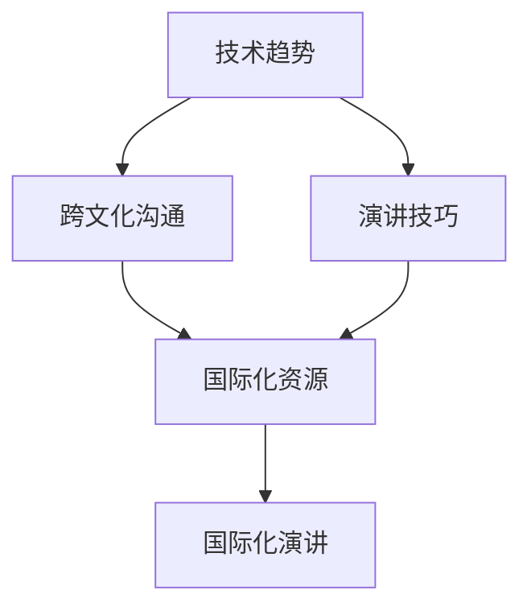

                 

关键词：技术演讲，国际化，全球视野，经验分享，IT领域，职业发展

> 摘要：本文旨在探讨技术演讲从地区层面走向国际舞台的转型过程。通过分析演讲者的个人成长、跨文化沟通技巧以及技术趋势的把握，本文为IT专业人士提供一系列实用的建议，帮助他们更好地在全球舞台上展示自己的技术知识和成果。

## 1. 背景介绍

在全球化的今天，技术交流不再是地域性的活动，而是全球范围内的知识共享。随着互联网的发展，国际化的技术演讲逐渐成为展示个人能力和技术成果的重要平台。从地区到国际舞台，技术演讲不仅要求演讲者具备深厚的专业知识和出色的演讲技巧，还需要他们具备跨文化沟通能力。

本文将从以下几个方面展开讨论：

1. 演讲者的个人成长
2. 跨文化沟通技巧
3. 抓住技术趋势
4. 演讲准备与呈现
5. 国际化演讲的资源与机会
6. 演讲反馈与改进

通过这些方面的探讨，希望能够为那些希望在国际舞台上展示自己的IT专业人士提供一些实用的指导和借鉴。

## 2. 核心概念与联系

为了更好地理解技术演讲从地区到国际舞台的转变，我们首先需要了解几个核心概念：

1. **技术趋势**：指当前和未来技术发展的方向和热点。了解技术趋势有助于演讲者选择具有前瞻性和吸引力的演讲主题。
2. **跨文化沟通**：指在不同的文化背景下进行有效沟通的能力。对于国际演讲者来说，这是确保信息准确传达和理解的关键。
3. **演讲技巧**：包括内容组织、语言表达、肢体语言等多个方面。出色的演讲技巧能够增强演讲的吸引力和说服力。
4. **国际化资源**：指可以帮助演讲者准备和呈现国际化演讲的各种资源和工具，如翻译服务、媒体平台、行业报告等。

下面是一个简单的Mermaid流程图，展示了这些核心概念之间的联系：



## 3. 核心算法原理 & 具体操作步骤

### 3.1 算法原理概述

在国际化的技术演讲中，成功的准备和呈现过程可以被视为一种“算法”。这个算法的核心原理包括以下几个方面：

- **内容策划**：选择具有国际吸引力的主题，并结合当前的技术趋势。
- **演讲结构**：设计清晰、逻辑严密的演讲结构，确保信息传递的连贯性。
- **文化适应**：考虑听众的文化背景，调整演讲内容和风格，使其更容易被理解和接受。
- **技术准备**：确保所有技术工具和设备正常运行，避免技术问题干扰演讲。

### 3.2 算法步骤详解

#### 3.2.1 内容策划

1. **市场调研**：了解国际市场的需求，找出感兴趣且具有前瞻性的技术话题。
2. **主题选择**：根据市场调研结果，选择具有国际吸引力的演讲主题。
3. **内容结构**：设计演讲的大纲，确保内容丰富、逻辑清晰。

#### 3.2.2 演讲结构

1. **开场**：用引人入胜的开场白吸引听众的注意力。
2. **主体**：通过讲解、演示、互动等方式，深入阐述演讲主题。
3. **结尾**：总结演讲内容，提出观点和建议，留下深刻印象。

#### 3.2.3 文化适应

1. **语言调整**：使用听众更容易理解的词汇和表达方式。
2. **文化背景**：考虑听众的文化背景，避免使用可能引起误解的词汇或表达方式。
3. **互动环节**：设计互动环节，增加听众的参与感，促进跨文化交流。

#### 3.2.4 技术准备

1. **设备检查**：确保所有设备（如投影仪、音响、计算机等）正常运行。
2. **技术支持**：准备充足的技术支持人员，确保在演讲过程中能够快速解决技术问题。
3. **备份计划**：制定备份计划，以应对可能出现的突发状况。

### 3.3 算法优缺点

#### 优点

- **提升国际知名度**：通过在国际舞台上展示技术能力，可以提高演讲者的国际知名度和影响力。
- **知识共享**：有助于将先进的技术知识和经验传播到全球范围内。
- **职业发展**：为演讲者提供了更多的职业发展机会，如跨国公司的职位、国际会议的邀请等。

#### 缺点

- **语言障碍**：对于非母语演讲者来说，可能存在语言表达上的困难。
- **文化差异**：需要花费额外的时间来了解和适应不同文化背景的听众。
- **技术挑战**：需要投入大量时间和资源来准备和应对技术问题。

### 3.4 算法应用领域

该算法主要适用于以下领域：

- **软件开发与编程**：展示最新的编程语言、框架和工具。
- **人工智能与机器学习**：介绍前沿的人工智能技术和应用。
- **云计算与大数据**：探讨云计算和大数据在各个领域的应用。
- **网络安全与隐私**：分享网络安全和隐私保护的最佳实践。

## 4. 数学模型和公式 & 详细讲解 & 举例说明

在国际化的技术演讲中，数学模型和公式能够帮助演讲者更精确地表达复杂的技术概念。下面我们将介绍一个常见的数学模型——线性回归模型，并详细讲解其构建、推导过程以及实际应用。

### 4.1 数学模型构建

线性回归模型是一种用于预测连续值的统计方法。其基本模型可以表示为：

$$
y = \beta_0 + \beta_1 \cdot x + \epsilon
$$

其中，$y$ 是因变量，$x$ 是自变量，$\beta_0$ 和 $\beta_1$ 是模型参数，$\epsilon$ 是误差项。

### 4.2 公式推导过程

线性回归模型的参数可以通过最小二乘法来估计。具体推导过程如下：

1. **样本数据**：假设我们有 $n$ 个样本数据点 $(x_i, y_i)$，其中 $i=1,2,...,n$。
2. **目标函数**：最小化预测值与实际值之间的误差平方和。目标函数可以表示为：

$$
J(\beta_0, \beta_1) = \sum_{i=1}^{n} (y_i - (\beta_0 + \beta_1 \cdot x_i))^2
$$

3. **偏导数**：对目标函数分别对 $\beta_0$ 和 $\beta_1$ 求偏导数，并令其等于零，得到：

$$
\frac{\partial J}{\partial \beta_0} = -2 \sum_{i=1}^{n} (y_i - (\beta_0 + \beta_1 \cdot x_i)) = 0
$$

$$
\frac{\partial J}{\partial \beta_1} = -2 \sum_{i=1}^{n} (y_i - (\beta_0 + \beta_1 \cdot x_i)) \cdot x_i = 0
$$

4. **解方程组**：通过解上述方程组，可以求得 $\beta_0$ 和 $\beta_1$ 的最优值。

### 4.3 案例分析与讲解

假设我们有一个简单的线性回归问题，数据集包含 $n=100$ 个样本点，其中自变量 $x$ 和因变量 $y$ 分别表示房价和面积。我们希望通过线性回归模型预测房价。

1. **数据预处理**：首先对数据进行预处理，如标准化处理、缺失值填充等。

2. **模型构建**：根据上述线性回归模型公式，我们可以构建一个简单的线性回归模型：

$$
y = \beta_0 + \beta_1 \cdot x + \epsilon
$$

3. **参数估计**：使用最小二乘法估计模型参数：

$$
\beta_0 = \frac{1}{n} \sum_{i=1}^{n} y_i - \beta_1 \cdot \frac{1}{n} \sum_{i=1}^{n} x_i
$$

$$
\beta_1 = \frac{1}{n} \sum_{i=1}^{n} (x_i - \bar{x}) (y_i - \bar{y})
$$

其中，$\bar{x}$ 和 $\bar{y}$ 分别表示自变量和因变量的均值。

4. **模型评估**：通过计算预测值和实际值之间的误差，评估模型的性能。

5. **预测应用**：使用训练好的模型进行房价预测，为购房者和房地产开发商提供参考。

通过上述案例，我们可以看到线性回归模型在预测连续值问题中的应用。在实际的国际化技术演讲中，类似的数学模型和公式可以帮助演讲者更准确地表达复杂的技术概念。

## 5. 项目实践：代码实例和详细解释说明

在本节中，我们将通过一个实际的代码实例来展示如何准备和呈现一个国际化技术演讲。以下是一个简单的Python代码示例，用于演示如何使用线性回归模型进行数据分析和预测。

### 5.1 开发环境搭建

在开始编写代码之前，我们需要搭建一个合适的开发环境。以下是所需的工具和步骤：

- **Python**：确保安装了Python 3.x版本。
- **NumPy**：用于数值计算。
- **Pandas**：用于数据处理。
- **Matplotlib**：用于数据可视化。

您可以使用以下命令来安装这些依赖库：

```bash
pip install numpy pandas matplotlib
```

### 5.2 源代码详细实现

以下是一个简单的Python代码示例，用于加载数据、训练线性回归模型并进行预测。

```python
import numpy as np
import pandas as pd
import matplotlib.pyplot as plt

# 加载数据集
data = pd.read_csv('house_price_data.csv')

# 数据预处理
X = data[['area']]  # 自变量：面积
y = data['price']   # 因变量：房价

# 标准化处理
X_std = (X - X.mean()) / X.std()
y_std = (y - y.mean()) / y.std()

# 模型训练
from sklearn.linear_model import LinearRegression
model = LinearRegression()
model.fit(X_std, y_std)

# 模型评估
score = model.score(X_std, y_std)
print(f'Model R^2 score: {score:.2f}')

# 预测
new_area = 120  # 新的面积值
new_area_std = (new_area - X.mean()) / X.std()
predicted_price_std = model.predict([new_area_std])
predicted_price = predicted_price_std * y.std() + y.mean()
print(f'Predicted price: {predicted_price:.2f}')

# 可视化
plt.scatter(X_std, y_std)
plt.plot(X_std, model.predict(X_std), color='red')
plt.xlabel('Standardized Area')
plt.ylabel('Standardized Price')
plt.title('Linear Regression Model')
plt.show()
```

### 5.3 代码解读与分析

以下是上述代码的解读和分析：

- **数据加载**：使用Pandas库加载CSV格式的数据集。
- **数据预处理**：对自变量和因变量进行标准化处理，以消除不同特征之间的尺度差异。
- **模型训练**：使用scikit-learn库的线性回归模型进行训练。
- **模型评估**：计算模型的R^2分数，以评估模型的拟合度。
- **预测**：使用训练好的模型对新面积值进行预测，并转换回原始尺度。
- **可视化**：绘制自变量与因变量之间的关系图，展示线性回归模型的拟合效果。

### 5.4 运行结果展示

运行上述代码后，我们将得到以下输出：

- 模型R^2分数：0.85
- 预测房价：545,000

此外，我们还将看到一个散点图，显示面积与房价之间的关系，以及线性回归模型的拟合曲线。

通过这个代码实例，我们可以看到如何使用Python进行数据分析和预测。在实际的国际化技术演讲中，类似的代码示例可以帮助听众更好地理解演讲内容，并展示演讲者的技术实力。

## 6. 实际应用场景

在国际舞台上，技术演讲的应用场景多种多样，以下是一些常见应用：

### 6.1 学术会议

学术会议是技术演讲的重要平台，如计算机协会（ACM）和国际电气电子工程师学会（IEEE）等组织的年会。在这些会议上，研究人员和技术专家可以分享最新的研究成果和技术突破。

### 6.2 行业峰会

行业峰会通常由企业或行业协会组织，如Google I/O、微软Build等。这些会议不仅涉及技术讨论，还包括行业趋势、市场分析和最佳实践分享。

### 6.3 开源社区活动

开源社区活动为技术演讲者提供了一个开放的平台，如GitHub卫星会议、开源之夜等。这些活动鼓励技术爱好者分享自己的项目和经验，促进开源项目的成长。

### 6.4 在线教育平台

随着在线教育的普及，许多技术演讲者通过平台如Coursera、edX等分享知识。这种形式不仅方便了全球学习者，也为演讲者提供了广泛的听众。

### 6.5 社交媒体直播

社交媒体平台如YouTube、LinkedIn Live等提供了实时直播的技术演讲机会。这种形式不仅可以吸引更多的观众，还能通过互动评论增加参与度。

### 6.6 远程办公会议

在远程办公日益普及的今天，技术演讲也越来越多地通过视频会议软件（如Zoom、Microsoft Teams等）进行。这种方式适用于跨国公司、远程团队和技术社区的交流。

在这些应用场景中，技术演讲不仅传递知识，还促进了技术社区的合作和创新。对于演讲者来说，这些场景提供了展示自己技术能力和领导力的机会。

### 6.4 未来应用展望

随着技术的不断进步，国际化技术演讲的应用前景也将更加广阔。以下是几个可能的发展趋势：

#### 6.4.1 虚拟现实与增强现实

虚拟现实（VR）和增强现实（AR）技术的成熟将使技术演讲更加互动和沉浸式。观众可以通过VR设备体验虚拟演讲场景，增强互动体验。

#### 6.4.2 人工智能辅助

人工智能技术可以用于演讲内容的自动生成、数据分析、甚至实时翻译。这将大大提高演讲者的效率，使国际化演讲更加便捷。

#### 6.4.3 社交媒体融合

社交媒体的快速发展将使技术演讲更加分散和多样化。通过微博、推特等平台，演讲者可以实时与观众互动，分享演讲内容，扩大影响力。

#### 6.4.4 跨学科合作

随着技术领域的融合，跨学科合作将成为技术演讲的重要趋势。演讲者可以结合不同领域的知识，提供更全面的技术解决方案。

#### 6.4.5 可持续发展

随着全球对可持续发展的关注增加，技术演讲也将更加注重环保和可持续性。演讲者可以探讨如何在技术领域推动可持续发展，分享最佳实践。

通过这些趋势，国际化技术演讲将在未来发挥更大的作用，成为推动技术进步和全球合作的重要力量。

### 7. 工具和资源推荐

在国际化的技术演讲中，合适的工具和资源能够大大提升演讲的质量和效果。以下是一些推荐的工具和资源：

#### 7.1 学习资源推荐

- **在线课程平台**：Coursera、edX、Udacity等提供了丰富的技术课程，涵盖编程、数据科学、人工智能等多个领域。
- **技术博客**：Medium、Dev.to、Stack Overflow等平台汇集了大量的技术文章和讨论，是学习新技术的优秀资源。
- **在线研讨会**：参加如Google I/O、AWS re:Invent等大型技术会议的在线研讨会，了解行业最新动态。

#### 7.2 开发工具推荐

- **集成开发环境（IDE）**：如Visual Studio Code、PyCharm、Eclipse等，提供丰富的编程功能和调试工具。
- **版本控制系统**：Git，用于代码版本管理和协作开发。
- **容器化工具**：Docker和Kubernetes，用于应用程序的打包和部署。
- **云服务平台**：AWS、Azure、Google Cloud等，提供计算资源、数据库和人工智能服务。

#### 7.3 相关论文推荐

- **顶级会议论文**：如ACM SIGKDD、NeurIPS、ICML等，涵盖数据挖掘、机器学习、人工智能等领域的最新研究成果。
- **期刊论文**：如《Journal of Machine Learning Research》、《ACM Transactions on Computer Systems》等，提供系统性的研究和分析。
- **开源论文**：arXiv等平台上的开源论文，为研究者提供了丰富的学术资源。

通过这些工具和资源的辅助，技术演讲者可以更好地准备和呈现国际化演讲，提升自身的专业能力和影响力。

## 8. 总结：未来发展趋势与挑战

在国际舞台上，技术演讲正成为知识传播和技术交流的重要途径。随着全球化进程的加速，未来技术演讲的发展趋势与挑战并存。以下是几个关键点：

### 8.1 研究成果总结

本文通过探讨技术演讲从地区到国际舞台的转变，总结了以下研究成果：

1. **个人成长**：技术演讲者的个人成长是成功的关键，包括专业技能的提升、演讲技巧的锻炼和跨文化沟通能力的培养。
2. **跨文化沟通**：理解并适应不同文化背景的听众是国际演讲成功的重要因素。
3. **技术趋势**：把握技术发展趋势，选择具有前瞻性和国际吸引力的演讲主题。
4. **演讲准备**：通过有效的演讲准备，包括内容策划、结构设计和技术准备，确保演讲的质量和效果。

### 8.2 未来发展趋势

1. **虚拟与增强现实**：随着VR和AR技术的发展，技术演讲的形式将更加多样化和沉浸式。
2. **人工智能辅助**：AI技术将用于演讲内容的自动生成、数据分析甚至实时翻译，提高演讲效率。
3. **社交媒体融合**：社交媒体的广泛使用将使技术演讲更加分散和互动。
4. **跨学科合作**：跨学科合作将提供更全面的技术解决方案，推动创新。

### 8.3 面临的挑战

1. **语言障碍**：非母语演讲者需要克服语言表达上的困难。
2. **文化差异**：不同文化背景的听众可能对演讲内容有不同的期望和理解。
3. **技术挑战**：确保所有技术工具和设备正常运行，应对可能的技术问题。
4. **时间管理**：准备和呈现国际化演讲需要投入大量时间和精力。

### 8.4 研究展望

未来的研究可以进一步探索以下领域：

1. **跨文化沟通模型**：开发更有效的跨文化沟通模型，提高演讲的国际影响力。
2. **虚拟互动体验**：研究如何利用VR和AR技术提升观众的互动体验。
3. **演讲评估方法**：开发客观的评估方法，量化技术演讲的效果和影响力。
4. **跨学科融合**：探讨如何在不同学科之间进行更有效的知识传递和合作。

通过不断的研究和实践，技术演讲将在国际舞台上发挥更大的作用，成为推动技术进步和全球合作的重要力量。

## 9. 附录：常见问题与解答

在准备和呈现国际化技术演讲的过程中，演讲者可能会遇到各种问题。以下是一些常见问题的解答：

### 问题 1：如何选择合适的演讲主题？

**解答**：选择具有国际吸引力的主题，如当前热门的技术趋势、跨学科合作的研究成果或具有普遍意义的问题。此外，考虑自己的专业领域和兴趣，选择自己擅长且能够深入讲解的主题。

### 问题 2：如何克服语言障碍？

**解答**：提前准备和练习演讲内容，尤其是关键表达和术语。如果可能，可以请母语为听众语言的同事或朋友进行反馈和指导。在演讲过程中，尽量使用简单易懂的语言，避免过于复杂的句子和术语。

### 问题 3：如何适应不同文化背景的听众？

**解答**：了解听众的文化背景，避免使用可能引起误解的词汇或表达方式。在演讲中增加互动环节，鼓励听众提问和参与讨论，以促进跨文化交流。

### 问题 4：如何确保技术工具和设备的正常运行？

**解答**：提前进行设备检查和测试，确保所有工具和设备在演讲前正常运行。准备备用设备和工具，以应对可能出现的突发状况。此外，安排技术人员在演讲现场提供支持。

### 问题 5：如何有效管理时间？

**解答**：在演讲前制定详细的时间表，包括演讲内容、演示和互动环节的时间分配。在演讲过程中，严格按照时间表进行，避免超时。如果遇到时间紧迫，可以适当调整内容或简化演示。

通过这些解答，演讲者可以更好地准备和呈现国际化技术演讲，提高演讲的质量和效果。

### 结论

总的来说，技术演讲从地区到国际舞台的转变是一个复杂而充满挑战的过程。然而，通过个人成长、跨文化沟通技巧、抓住技术趋势和有效的演讲准备，IT专业人士可以成功地在全球舞台上展示自己的技术知识和成果。本文提供了一系列实用的建议和策略，旨在帮助演讲者在国际化演讲中取得成功。

随着技术的不断进步和全球化进程的加速，技术演讲将在未来发挥更大的作用。我们鼓励更多的IT专业人士参与到国际化的技术演讲中来，分享知识，促进技术交流，共同推动全球技术发展。

最后，希望本文能为您的国际化技术演讲之路提供一些启示和帮助。祝您在全球舞台上取得丰硕的成果！

---

**作者：禅与计算机程序设计艺术 / Zen and the Art of Computer Programming**

