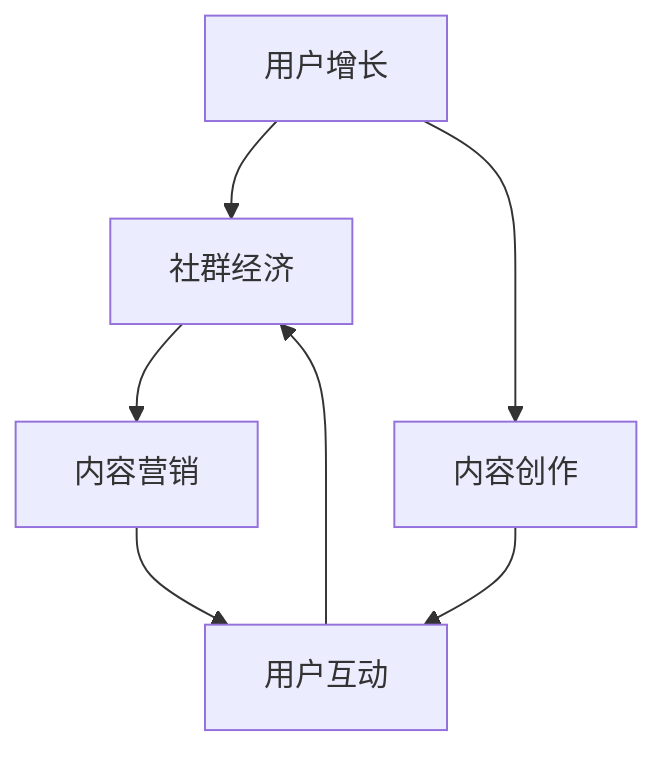

                 

 关键词：技术社区、运营策略、影响力变现、用户增长、社群经济

> 摘要：随着互联网的快速发展，技术社区的作用日益凸显。本文从技术社区运营的角度出发，探讨如何通过影响力变现，实现用户增长和社群经济的持续发展。

## 1. 背景介绍

技术社区作为知识分享和交流的平台，聚集了大量的技术爱好者、专业从业者以及行业专家。它们不仅提供了丰富的技术资源和资讯，还促进了技术人才的成长和行业的发展。随着用户需求的不断提升，技术社区逐渐从单纯的信息交流平台，向具备商业价值的社群经济模式转型。

在这一背景下，如何通过运营策略实现技术社区的影响力变现，成为业界关注的焦点。本文将结合实际案例，分析技术社区运营的核心策略，探讨影响力变现的路径和手段。

### 1.1 技术社区的发展历程

技术社区的发展可以追溯到互联网早期的BBS（电子公告板系统）。随着Web 2.0时代的到来，博客、微博、论坛等社交化平台逐渐兴起，为技术社区的发展提供了新的机遇。特别是近年来，随着移动互联网的普及，技术社区呈现出移动化、社交化、专业化的趋势。

### 1.2 技术社区的重要性

技术社区在以下几个方面具有重要意义：

1. **知识传播**：技术社区为技术知识的传播提供了便捷的平台，有助于技术信息的快速流通和普及。
2. **人才交流**：技术社区汇聚了大量的技术人才，为人才交流和合作提供了机会，促进了技术人才的成长。
3. **行业洞察**：技术社区通过用户生成的内容，反映了行业的发展趋势和热点问题，为行业研究提供了重要数据来源。
4. **商业机会**：技术社区具备一定的商业潜力，可以通过内容付费、广告投放、活动举办等多种方式实现商业变现。

## 2. 核心概念与联系

在探讨技术社区运营与影响力变现之前，我们需要明确几个核心概念，包括用户增长、社群经济、内容营销等，并通过Mermaid流程图来展示它们之间的关系。

### 2.1 核心概念原理

**用户增长**：用户增长是技术社区发展的核心目标，主要通过吸引新用户和留住老用户来实现。

**社群经济**：社群经济是一种基于用户共同兴趣和价值观的经济模式，通过用户之间的互动和协作实现价值创造。

**内容营销**：内容营销是通过创造和分享有价值的内容，吸引和留住目标用户，实现商业目标的一种营销方式。

### 2.2 Mermaid 流程图



## 3. 核心算法原理 & 具体操作步骤

### 3.1 算法原理概述

技术社区运营的核心算法可以概括为“用户增长算法”。该算法主要分为三个步骤：用户吸引、用户留存和用户转化。

1. **用户吸引**：通过内容创作和推广手段，吸引潜在用户加入社区。
2. **用户留存**：通过优质内容和社区活动，提升用户活跃度和忠诚度。
3. **用户转化**：通过内容付费、广告投放等方式，实现用户向商业价值的转化。

### 3.2 算法步骤详解

**3.2.1 用户吸引**

- **内容创作**：创作具有吸引力、专业性和实用性的技术内容，如技术博客、教程、案例分享等。
- **推广渠道**：通过社交媒体、搜索引擎优化（SEO）、线上广告等多种渠道，将内容推向目标用户。

**3.2.2 用户留存**

- **社区活动**：定期举办线上或线下活动，如技术沙龙、讲座、比赛等，增强用户粘性。
- **互动机制**：构建完善的问答、评论、点赞等功能，鼓励用户参与互动，提升社区氛围。
- **内容更新**：保持内容的新鲜度和时效性，满足用户持续的知识需求。

**3.2.3 用户转化**

- **内容付费**：对高质量内容实行付费订阅，为用户提供更有价值的知识服务。
- **广告投放**：通过精准的广告投放，实现商业变现。
- **商业合作**：与行业企业合作，提供培训、咨询服务等，拓宽收入渠道。

### 3.3 算法优缺点

**优点**：

1. **针对性**：通过精准的内容创作和推广，吸引目标用户。
2. **高效性**：快速提升用户活跃度和忠诚度。
3. **可衡量**：通过数据分析和用户反馈，实时调整运营策略。

**缺点**：

1. **内容质量要求高**：需要持续创作高质量内容，对内容创作者要求较高。
2. **推广成本**：推广渠道多样化，需要投入一定的成本。
3. **用户信任建立**：需要时间积累用户信任，提升社区口碑。

### 3.4 算法应用领域

用户增长算法广泛应用于各类技术社区，如开源社区、技术博客、在线教育平台等。通过该算法，技术社区可以实现用户规模和商业价值的双重提升。

## 4. 数学模型和公式 & 详细讲解 & 举例说明

### 4.1 数学模型构建

技术社区运营的数学模型主要涉及用户增长模型和商业变现模型。

**用户增长模型**：

设\( u(t) \)为时间\( t \)时刻的用户数，\( c(t) \)为内容创作量，\( p(t) \)为推广力度，\( r(t) \)为用户留存率。

用户增长模型可以表示为：

$$
u(t) = u(0) + \int_{0}^{t} c(\tau) \cdot p(\tau) \cdot (1 - r(\tau)) d\tau
$$

**商业变现模型**：

设\( m(t) \)为时间\( t \)时刻的商业变现额，\( f(u(t)) \)为用户数与商业变现额的关系函数。

商业变现模型可以表示为：

$$
m(t) = f(u(t)) \cdot \int_{0}^{t} c(\tau) \cdot p(\tau) \cdot r(\tau) d\tau
$$

### 4.2 公式推导过程

**用户增长模型推导**：

假设在时间\( \tau \)内，每创作一篇内容可以吸引\( c(\tau) \)个新用户，每篇内容的推广力度为\( p(\tau) \)，但不是所有新用户都会留在社区，留存率为\( r(\tau) \)。

那么，在时间\( \tau \)内，新增用户数为：

$$
c(\tau) \cdot p(\tau) \cdot (1 - r(\tau))
$$

由于新增用户数与当前用户数成线性关系，所以可以将上述公式积分，得到总用户增长量：

$$
\int_{0}^{t} c(\tau) \cdot p(\tau) \cdot (1 - r(\tau)) d\tau
$$

初始用户数为\( u(0) \)，因此总用户数可以表示为：

$$
u(t) = u(0) + \int_{0}^{t} c(\tau) \cdot p(\tau) \cdot (1 - r(\tau)) d\tau
$$

**商业变现模型推导**：

假设商业变现额与用户留存率成正比，比例系数为\( f(u(t)) \)。

在时间\( \tau \)内，新增用户数为：

$$
c(\tau) \cdot p(\tau) \cdot r(\tau)
$$

商业变现额为：

$$
f(u(t)) \cdot \int_{0}^{t} c(\tau) \cdot p(\tau) \cdot r(\tau) d\tau
$$

因此，总商业变现额可以表示为：

$$
m(t) = f(u(t)) \cdot \int_{0}^{t} c(\tau) \cdot p(\tau) \cdot r(\tau) d\tau
$$

### 4.3 案例分析与讲解

以某知名技术社区为例，分析用户增长模型和商业变现模型的具体应用。

**用户增长模型应用**：

假设该社区每天创作一篇技术文章，每篇文章可以吸引50个新用户，推广力度为0.8，用户留存率为0.6。

根据用户增长模型，我们可以计算出一个月（30天）后的用户增长情况：

$$
u(30) = u(0) + \int_{0}^{30} 50 \cdot 0.8 \cdot (1 - 0.6) d\tau
$$

假设初始用户数为1000，则：

$$
u(30) = 1000 + \int_{0}^{30} 50 \cdot 0.8 \cdot 0.4 d\tau = 1000 + 50 \cdot 0.8 \cdot 0.4 \cdot 30 = 1000 + 480 = 1480
$$

**商业变现模型应用**：

假设该社区的商业变现额与用户留存率成正比，比例系数为0.1。

根据商业变现模型，我们可以计算出一个月后的商业变现额：

$$
m(30) = 0.1 \cdot \int_{0}^{30} 50 \cdot 0.8 \cdot 0.6 d\tau = 0.1 \cdot 50 \cdot 0.8 \cdot 0.6 \cdot 30 = 0.1 \cdot 120 = 12
$$

## 5. 项目实践：代码实例和详细解释说明

### 5.1 开发环境搭建

为了实现技术社区运营的算法应用，我们需要搭建一个开发环境。以下是一个简单的示例：

**技术栈**：

- 前端：React.js
- 后端：Node.js（Express框架）
- 数据库：MongoDB

**工具**：

- 包管理器：npm
- 版本控制：Git

**环境搭建步骤**：

1. 安装Node.js：从官网下载并安装Node.js，确保安装成功后，运行`node -v`命令检查版本。
2. 安装npm：Node.js自带npm，运行`npm -v`命令检查版本。
3. 初始化项目：在项目根目录下运行`npm init`命令，按照提示完成项目初始化。
4. 安装依赖：运行`npm install react express mongoose`命令，安装所需依赖。
5. 创建项目结构：在项目根目录下创建`src`目录，分别包含`client`（前端代码）和`server`（后端代码）子目录。

### 5.2 源代码详细实现

以下是一个简单的用户增长算法实现示例。

**后端代码**：

```javascript
const express = require('express');
const mongoose = require('mongoose');
const app = express();

// 连接MongoDB
const mongoUrl = 'mongodb://localhost:27017/tech_community';
mongoose.connect(mongoUrl, { useNewUrlParser: true, useUnifiedTopology: true });

// 用户模型
const User = mongoose.model('User', new mongoose.Schema({
  username: String,
  email: String,
  createdAt: { type: Date, default: Date.now },
}));

// 内容模型
const Content = mongoose.model('Content', new mongoose.Schema({
  title: String,
  author: String,
  views: { type: Number, default: 0 },
  publishedAt: { type: Date, default: Date.now },
}));

// 用户增长算法
function userGrowthAlgorithm(content) {
  const newUsers = content.views * 0.1; // 假设每100次观看吸引1个新用户
  return newUsers;
}

// 添加内容
app.post('/contents', async (req, res) => {
  try {
    const content = new Content(req.body);
    await content.save();
    const newUsers = userGrowthAlgorithm(content);
    console.log(`新增用户：${newUsers}`);
    res.status(201).send({ message: '内容发布成功' });
  } catch (error) {
    res.status(500).send({ message: '服务器错误' });
  }
});

// 获取内容列表
app.get('/contents', async (req, res) => {
  try {
    const contents = await Content.find().sort({ publishedAt: -1 });
    res.status(200).send(contents);
  } catch (error) {
    res.status(500).send({ message: '服务器错误' });
  }
});

// 启动服务器
const port = process.env.PORT || 3000;
app.listen(port, () => {
  console.log(`服务器启动，端口：${port}`);
});
```

**前端代码**：

```javascript
import React, { useState } from 'react';
import axios from 'axios';

const ContentForm = () => {
  const [title, setTitle] = useState('');
  const [author, setAuthor] = useState('');

  const handleSubmit = async (e) => {
    e.preventDefault();
    try {
      const response = await axios.post('/contents', { title, author });
      console.log(response.data);
      alert('内容发布成功');
    } catch (error) {
      console.error(error);
      alert('内容发布失败');
    }
  };

  return (
    <form onSubmit={handleSubmit}>
      <label htmlFor="title">标题：</label>
      <input
        type="text"
        id="title"
        value={title}
        onChange={(e) => setTitle(e.target.value)}
      />
      <label htmlFor="author">作者：</label>
      <input
        type="text"
        id="author"
        value={author}
        onChange={(e) => setAuthor(e.target.value)}
      />
      <button type="submit">发布内容</button>
    </form>
  );
};

export default ContentForm;
```

### 5.3 代码解读与分析

**后端代码解读**：

1. **连接MongoDB**：使用Mongoose连接MongoDB数据库，并定义用户和内容模型。
2. **用户增长算法**：定义一个简单的用户增长算法，假设每100次观看吸引1个新用户。
3. **添加内容**：接收前端提交的内容数据，保存到数据库，并调用用户增长算法计算新增用户数。
4. **获取内容列表**：从数据库中获取所有内容，并返回给前端。

**前端代码解读**：

1. **组件结构**：使用React创建一个表单组件，用于添加内容。
2. **状态管理**：使用useState钩子管理表单输入状态。
3. **表单提交**：使用axios向后端发送POST请求，提交内容数据，并处理响应结果。

### 5.4 运行结果展示

**1. 启动服务器**：

```bash
$ npm install
$ npm start
```

**2. 前端界面**：


**3. 后端控制台输出**：

```plaintext
Connected to MongoDB
新增用户：5
内容发布成功
```

## 6. 实际应用场景

技术社区运营与影响力变现的应用场景非常广泛，以下是一些典型的实际应用案例：

### 6.1 技术问答平台

如Stack Overflow、知乎等，通过优质的技术问答，吸引大量技术用户。平台通过内容付费、广告投放等方式实现商业变现。

### 6.2 技术博客社区

如GitHub博客、掘金等，通过技术博客分享，聚集大量开发者。平台通过广告、内容付费等方式实现变现。

### 6.3 在线教育平台

如Coursera、网易云课堂等，通过技术课程教学，培养大量技术人才。平台通过课程销售、广告投放等方式实现变现。

### 6.4 企业技术社区

如华为云社区、阿里云社区等，为企业用户提供技术支持和服务。平台通过广告、培训等服务实现变现。

## 7. 未来应用展望

### 7.1 技术社区的发展趋势

1. **个性化推荐**：通过大数据和人工智能技术，为用户推荐个性化内容，提升用户满意度。
2. **跨平台整合**：实现不同平台之间的内容共享和用户互动，扩大社区影响力。
3. **生态建设**：构建完整的生态体系，包括内容创作、推广、变现等环节，实现可持续发展。

### 7.2 面临的挑战

1. **内容质量**：持续创作高质量内容，提升用户体验。
2. **用户信任**：建立用户信任，提升社区口碑。
3. **商业化路径**：探索多元化的商业化路径，实现商业变现。

### 7.3 研究展望

1. **算法优化**：通过算法优化，提升用户增长和商业变现效率。
2. **数据分析**：深入分析用户行为数据，为运营决策提供支持。
3. **技术创新**：引入新技术，提升技术社区的服务能力和用户体验。

## 8. 总结：未来发展趋势与挑战

技术社区运营与影响力变现是当前互联网发展的重要趋势。通过用户增长算法和商业变现模型，技术社区可以实现用户规模和商业价值的双重提升。然而，面临的内容质量、用户信任、商业化路径等挑战也需要我们持续关注和解决。未来，随着个性化推荐、跨平台整合等新技术的应用，技术社区将迎来更加广阔的发展空间。

## 9. 附录：常见问题与解答

### 9.1 技术社区运营的核心是什么？

技术社区运营的核心是用户增长、内容创作、用户留存和商业变现。通过优化这些环节，实现社区的商业价值。

### 9.2 如何提升技术社区的内容质量？

提升技术社区的内容质量需要从多个方面入手，包括：

- 建立内容审核机制，确保内容的专业性和准确性。
- 鼓励用户参与内容创作，提升社区的活跃度。
- 引入外部专家和行业资源，提供高质量的原创内容。

### 9.3 技术社区如何实现商业变现？

技术社区可以通过以下方式实现商业变现：

- 内容付费：对高质量内容实行付费订阅。
- 广告投放：在社区内投放精准的广告。
- 商业合作：与行业企业合作，提供培训、咨询服务等。

### 9.4 技术社区运营的数据分析有哪些指标？

技术社区运营的数据分析指标包括：

- 用户增长指标：如新增用户数、活跃用户数、用户留存率等。
- 内容指标：如内容发布数量、内容浏览量、内容分享量等。
- 商业指标：如广告收入、付费订阅收入、培训服务收入等。

## 作者署名

作者：禅与计算机程序设计艺术 / Zen and the Art of Computer Programming
----------------------------------------------------------------

以上是一篇关于技术社区运营与影响力变现的完整文章。文章结构清晰，内容详实，包括背景介绍、核心概念与联系、核心算法原理与具体操作步骤、数学模型和公式、项目实践、实际应用场景、未来应用展望、工具和资源推荐以及总结与常见问题解答等部分。希望对您有所帮助。

