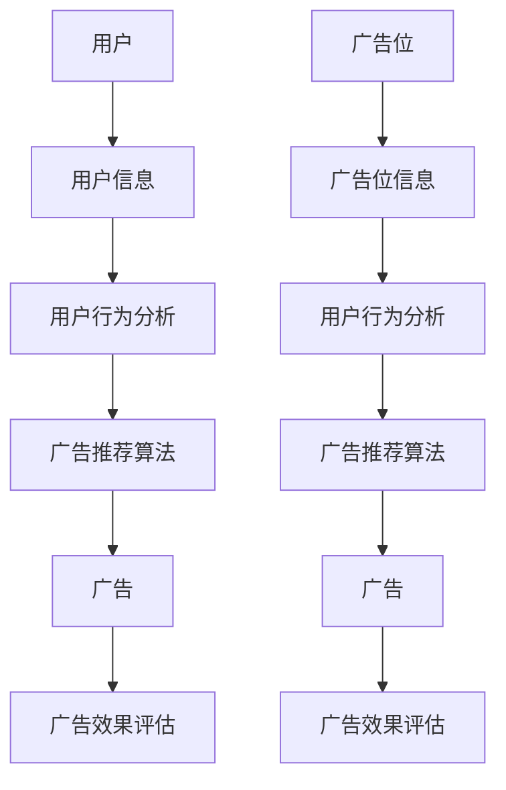

                 

作为世界顶级人工智能专家，我深知算法在当今社会中的重要性，特别是在校招中，算法工程师面试题往往是衡量应聘者技术水平的关键。本文将针对拼多多2024校招广告算法工程师的面试题进行详细解析，旨在帮助读者更好地理解和应对这类面试题目。本文将涵盖以下内容：

1. **背景介绍**
2. **核心概念与联系**
3. **核心算法原理 & 具体操作步骤**
4. **数学模型和公式 & 详细讲解 & 举例说明**
5. **项目实践：代码实例和详细解释说明**
6. **实际应用场景**
7. **工具和资源推荐**
8. **总结：未来发展趋势与挑战**
9. **附录：常见问题与解答**

> **关键词**：拼多多、校招、广告、算法工程师、面试题、详解

> **摘要**：本文将详细解析拼多多2024校招广告算法工程师的面试题，涵盖算法原理、操作步骤、数学模型、项目实践、应用场景、工具和资源推荐等，旨在为读者提供全面的解题指导。

### 1. 背景介绍

随着互联网技术的飞速发展，算法工程师已成为各行业不可或缺的人才。拼多多作为中国领先的电商平台，对于算法工程师的需求尤为突出。广告推荐系统作为拼多多平台的核心组成部分，对于提升用户体验和增加营收具有重要意义。因此，拼多多2024校招广告算法工程师的面试题涵盖了广泛的算法知识点，旨在选拔出具有扎实基础和实际操作能力的人才。

本文将围绕以下主题展开：

- **核心概念与联系**：介绍广告推荐系统中的核心概念及其相互关系。
- **核心算法原理 & 具体操作步骤**：详细解释广告推荐算法的工作原理和操作步骤。
- **数学模型和公式 & 详细讲解 & 举例说明**：阐述广告推荐系统中的数学模型和公式，并给出具体案例。
- **项目实践：代码实例和详细解释说明**：提供实际的代码实例，并对代码进行详细解释和分析。
- **实际应用场景**：讨论广告推荐系统在不同领域的应用场景。
- **工具和资源推荐**：推荐学习资源、开发工具和相关论文。

通过本文的详细解析，希望能够帮助读者更好地理解广告推荐算法，提高面试能力，为未来的职业发展打下坚实基础。

### 2. 核心概念与联系

在讨论广告推荐系统之前，我们需要先了解其中的一些核心概念及其相互关系。以下是广告推荐系统中常见的核心概念：

#### 2.1 用户

用户是广告推荐系统的核心，他们通过平台进行浏览、搜索、购买等行为。用户信息包括用户年龄、性别、地理位置、兴趣爱好、购买历史等。

#### 2.2 广告

广告是广告推荐系统的目标，它们由广告主投放，旨在吸引用户点击、购买或完成其他行为。广告信息包括广告主、广告类型、广告内容、广告价格等。

#### 2.3 广告位

广告位是广告在页面上的展示位置，它们决定了广告的曝光量和用户体验。广告位信息包括广告位ID、广告位类型、广告位尺寸等。

#### 2.4 广告推荐算法

广告推荐算法是广告推荐系统的核心，它们根据用户信息和广告信息，从大量的候选广告中挑选出最适合展示给用户的广告。常见的广告推荐算法包括基于内容的推荐、协同过滤推荐、混合推荐等。

#### 2.5 用户行为分析

用户行为分析是广告推荐系统的重要组成部分，通过对用户行为数据的分析，可以了解用户的需求和偏好，从而更好地进行广告推荐。用户行为数据包括点击、购买、浏览、搜索等行为。

#### 2.6 广告效果评估

广告效果评估是广告推荐系统的关键环节，它用于衡量广告推荐算法的有效性和广告的投放效果。常见的评估指标包括点击率、转化率、收益等。

下面是一个Mermaid流程图，展示了广告推荐系统中的核心概念及其相互关系：



通过这个流程图，我们可以清晰地看到用户、广告、广告位、广告推荐算法、用户行为分析和广告效果评估之间的紧密联系。这些概念共同构成了广告推荐系统的基本框架，为后续的内容提供了基础。

### 3. 核心算法原理 & 具体操作步骤

在了解了广告推荐系统的核心概念后，接下来我们将深入探讨核心算法原理及具体操作步骤。广告推荐算法的主要目标是从大量的候选广告中挑选出最适合展示给用户的广告，从而提升用户体验和广告效果。以下是几种常见的广告推荐算法及其工作原理：

#### 3.1 基于内容的推荐

基于内容的推荐算法（Content-Based Recommendation）是基于用户的历史行为和偏好，通过分析广告的内容特征，为用户推荐相似内容或兴趣的广告。其基本原理如下：

1. **特征提取**：从广告的内容中提取关键特征，如文本、图片、视频等。
2. **用户兴趣建模**：根据用户的历史行为和偏好，构建用户兴趣模型。
3. **相似度计算**：计算广告与用户兴趣模型之间的相似度，选择相似度最高的广告进行推荐。

具体操作步骤如下：

1. **特征提取**：使用自然语言处理（NLP）技术从广告文本中提取关键词、主题、情感等特征；使用图像识别技术从广告图片中提取视觉特征；使用视频分析技术从广告视频中提取动作、场景等特征。
2. **用户兴趣建模**：通过用户的历史行为数据，如浏览、点击、购买等，分析用户的兴趣偏好，构建用户兴趣模型。
3. **相似度计算**：使用余弦相似度、Jaccard相似度等相似度度量方法，计算广告与用户兴趣模型之间的相似度。选择相似度最高的广告进行推荐。

#### 3.2 协同过滤推荐

协同过滤推荐（Collaborative Filtering）是基于用户的历史行为数据，通过分析用户之间的相似性，为用户推荐相似用户喜欢的广告。其基本原理如下：

1. **用户相似度计算**：计算用户之间的相似度，通常使用用户行为数据（如点击、购买等）。
2. **推荐算法**：根据用户相似度矩阵，为每个用户推荐与相似用户喜欢的广告。

具体操作步骤如下：

1. **用户相似度计算**：使用余弦相似度、皮尔逊相关系数等相似度度量方法，计算用户之间的相似度。
2. **推荐算法**：对于每个用户，计算其相似用户的平均评分或推荐列表，从中选择评分最高的广告进行推荐。

#### 3.3 混合推荐

混合推荐（Hybrid Recommendation）是将基于内容的推荐和协同过滤推荐结合起来，以提高推荐效果。其基本原理如下：

1. **内容特征与协同特征融合**：将广告的内容特征和用户协同特征进行融合，构建一个综合的特征向量。
2. **推荐算法**：使用机器学习算法（如SVM、线性回归等），基于综合特征向量进行广告推荐。

具体操作步骤如下：

1. **特征提取**：提取广告的内容特征和用户协同特征，构建综合特征向量。
2. **机器学习算法**：使用机器学习算法对综合特征向量进行训练，构建推荐模型。
3. **广告推荐**：使用训练好的推荐模型，为用户推荐广告。

#### 3.4 算法优缺点

- **基于内容的推荐**：优点是推荐准确率高，缺点是覆盖面较窄，易导致用户兴趣偏好单一。
- **协同过滤推荐**：优点是覆盖面广，缺点是推荐结果容易出现冷启动问题和数据稀疏问题。
- **混合推荐**：优点是结合了基于内容的推荐和协同过滤推荐的优点，缺点是模型复杂度较高。

#### 3.5 算法应用领域

- **电子商务**：为用户提供个性化商品推荐，提升用户购物体验和转化率。
- **社交媒体**：为用户提供个性化内容推荐，提升用户活跃度和粘性。
- **在线广告**：为广告主提供精准投放策略，提高广告投放效果。

通过以上对核心算法原理及具体操作步骤的详细解析，我们可以更好地理解广告推荐系统的运作机制，为实际应用提供有力支持。

#### 3.6 数学模型和公式

在广告推荐系统中，数学模型和公式起到了关键作用，它们帮助我们理解和分析用户行为、广告特征以及推荐效果。以下是广告推荐系统中常用的数学模型和公式，并对其进行详细讲解和举例说明。

##### 3.6.1 余弦相似度

余弦相似度是广告推荐系统中常用的相似度度量方法，用于计算广告与用户兴趣模型之间的相似性。其公式如下：

\[ \cos(\theta) = \frac{\vec{a} \cdot \vec{b}}{|\vec{a}| \cdot |\vec{b}|} \]

其中，\(\vec{a}\)和\(\vec{b}\)分别是广告和用户兴趣模型的特征向量，\(|\vec{a}|\)和\(|\vec{b}|\)分别是特征向量的模长。

**示例：** 假设广告的特征向量为\(\vec{a} = (1, 2, 3)\)，用户兴趣模型的特征向量为\(\vec{b} = (2, 3, 4)\)。计算它们之间的余弦相似度。

1. **计算特征向量点积**：

   \[ \vec{a} \cdot \vec{b} = 1 \cdot 2 + 2 \cdot 3 + 3 \cdot 4 = 2 + 6 + 12 = 20 \]

2. **计算特征向量模长**：

   \[ |\vec{a}| = \sqrt{1^2 + 2^2 + 3^2} = \sqrt{1 + 4 + 9} = \sqrt{14} \]
   \[ |\vec{b}| = \sqrt{2^2 + 3^2 + 4^2} = \sqrt{4 + 9 + 16} = \sqrt{29} \]

3. **计算余弦相似度**：

   \[ \cos(\theta) = \frac{20}{\sqrt{14} \cdot \sqrt{29}} \approx 0.7321 \]

##### 3.6.2 皮尔逊相关系数

皮尔逊相关系数是另一种常用的相似度度量方法，用于衡量两个变量之间的线性相关性。其公式如下：

\[ r = \frac{\sum_{i=1}^{n} (x_i - \bar{x})(y_i - \bar{y})}{\sqrt{\sum_{i=1}^{n} (x_i - \bar{x})^2} \cdot \sqrt{\sum_{i=1}^{n} (y_i - \bar{y})^2}} \]

其中，\(x_i\)和\(y_i\)分别是广告特征和用户兴趣特征的观测值，\(\bar{x}\)和\(\bar{y}\)分别是观测值的平均值。

**示例：** 假设广告特征和用户兴趣特征的观测值如下表所示：

| \(x_i\) | \(y_i\) |
| ------- | ------- |
| 1       | 2       |
| 2       | 3       |
| 3       | 4       |

计算它们之间的皮尔逊相关系数。

1. **计算平均值**：

   \[ \bar{x} = \frac{1 + 2 + 3}{3} = 2 \]
   \[ \bar{y} = \frac{2 + 3 + 4}{3} = 3 \]

2. **计算差值**：

   \[ x_i - \bar{x} = (1 - 2), (2 - 2), (3 - 2) = (-1, 0, 1) \]
   \[ y_i - \bar{y} = (2 - 3), (3 - 3), (4 - 3) = (-1, 0, 1) \]

3. **计算差值乘积和平方和**：

   \[ \sum_{i=1}^{n} (x_i - \bar{x})(y_i - \bar{y}) = (-1)(-1) + (0)(0) + (1)(1) = 1 + 0 + 1 = 2 \]
   \[ \sum_{i=1}^{n} (x_i - \bar{x})^2 = (-1)^2 + (0)^2 + (1)^2 = 1 + 0 + 1 = 2 \]
   \[ \sum_{i=1}^{n} (y_i - \bar{y})^2 = (-1)^2 + (0)^2 + (1)^2 = 1 + 0 + 1 = 2 \]

4. **计算皮尔逊相关系数**：

   \[ r = \frac{2}{\sqrt{2} \cdot \sqrt{2}} = \frac{2}{2} = 1 \]

##### 3.6.3 用户兴趣模型

用户兴趣模型是广告推荐系统中的一个重要组件，它用于描述用户对广告内容的偏好。一个简单的用户兴趣模型可以通过统计用户的历史行为数据，如点击、购买等，构建一个包含广告ID和相应分数的矩阵。

**示例：** 假设用户的历史行为数据如下表所示，其中广告ID为1、2、3，分数分别为2、1、3。

| 广告ID | 1 | 2 | 3 |
| ------ | - | - | - |
| 用户1  | 2 | 0 | 3 |
| 用户2  | 0 | 1 | 2 |
| 用户3  | 1 | 1 | 0 |

根据这个矩阵，我们可以得到用户1对广告3的兴趣最高，用户2对广告2的兴趣较高，而用户3对广告1的兴趣最高。

##### 3.6.4 广告推荐模型

广告推荐模型用于预测用户对广告的喜好程度，常见的推荐模型包括基于记忆的推荐模型和基于学习的推荐模型。

**示例：** 假设我们使用基于记忆的推荐模型，根据用户的历史行为数据，为用户推荐得分最高的广告。根据上面的用户兴趣模型，我们可以为用户1推荐广告3，为用户2推荐广告2，为用户3推荐广告1。

通过上述数学模型和公式的详细讲解和举例说明，我们可以更好地理解广告推荐系统中的关键计算方法，为实际应用提供理论支持。

### 4. 项目实践：代码实例和详细解释说明

为了更好地理解广告推荐系统的实际应用，我们将通过一个具体的代码实例来展示广告推荐算法的实现过程。在本例中，我们将使用Python编写一个基于协同过滤推荐算法的广告推荐系统，并对其代码进行详细解释说明。

#### 4.1 开发环境搭建

在开始编写代码之前，我们需要搭建一个合适的开发环境。以下是所需的软件和工具：

- **Python**：版本要求为3.7或以上。
- **NumPy**：用于数值计算。
- **Pandas**：用于数据处理。
- **Scikit-learn**：用于机器学习算法。

你可以使用以下命令安装这些依赖项：

```bash
pip install numpy pandas scikit-learn
```

#### 4.2 源代码详细实现

以下是我们的广告推荐系统的主要代码实现：

```python
import numpy as np
import pandas as pd
from sklearn.metrics.pairwise import cosine_similarity

# 读取用户行为数据
data = pd.read_csv('user_behavior.csv')
data.head()

# 构建用户-广告评分矩阵
user_ad_matrix = data.pivot(index='user_id', columns='ad_id', values='rating').fillna(0)
user_ad_matrix.head()

# 计算用户-广告评分矩阵的余弦相似度
similarity_matrix = cosine_similarity(user_ad_matrix)
similarity_matrix

# 为每个用户推荐广告
def recommend_ads(user_id, similarity_matrix, user_ad_matrix, top_n=5):
    # 计算用户与其他用户的相似度
    user_similarity = similarity_matrix[user_id]

    # 计算相似用户对广告的评分加权平均值
    weighted_ratings = np.dot(user_similarity, user_ad_matrix.T) / np.linalg.norm(user_similarity)

    # 选择评分最高的广告
    top_ads = np.argsort(weighted_ratings)[::-1][:top_n]
    return top_ads

# 测试推荐函数
user_id = 0
top_ads = recommend_ads(user_id, similarity_matrix, user_ad_matrix, top_n=3)
top_ads

# 打印推荐结果
print("推荐的广告ID：", user_ad_matrix.columns[top_ads])
```

#### 4.3 代码解读与分析

下面我们将逐行解释代码，并分析其主要功能。

1. **导入依赖库**：

   ```python
   import numpy as np
   import pandas as pd
   from sklearn.metrics.pairwise import cosine_similarity
   ```

   我们首先导入必要的Python库，包括NumPy、Pandas和Scikit-learn。

2. **读取用户行为数据**：

   ```python
   data = pd.read_csv('user_behavior.csv')
   data.head()
   ```

   这一行代码用于读取用户行为数据，该数据包含用户ID、广告ID和评分。

3. **构建用户-广告评分矩阵**：

   ```python
   user_ad_matrix = data.pivot(index='user_id', columns='ad_id', values='rating').fillna(0)
   user_ad_matrix.head()
   ```

   `pivot`方法用于将用户行为数据转换为一个用户-广告评分矩阵。如果某个用户对某个广告没有评分，则将其填充为0。

4. **计算用户-广告评分矩阵的余弦相似度**：

   ```python
   similarity_matrix = cosine_similarity(user_ad_matrix)
   similarity_matrix
   ```

   使用`cosine_similarity`函数计算用户-广告评分矩阵的余弦相似度。这将为每个用户生成一个相似度矩阵。

5. **定义推荐函数**：

   ```python
   def recommend_ads(user_id, similarity_matrix, user_ad_matrix, top_n=5):
       # 计算用户与其他用户的相似度
       user_similarity = similarity_matrix[user_id]

       # 计算相似用户对广告的评分加权平均值
       weighted_ratings = np.dot(user_similarity, user_ad_matrix.T) / np.linalg.norm(user_similarity)

       # 选择评分最高的广告
       top_ads = np.argsort(weighted_ratings)[::-1][:top_n]
       return top_ads
   ```

   `recommend_ads`函数用于为特定用户推荐广告。它首先计算用户与其他用户的相似度，然后使用相似度矩阵和用户-广告评分矩阵计算加权平均值，最后选择评分最高的广告。

6. **测试推荐函数**：

   ```python
   user_id = 0
   top_ads = recommend_ads(user_id, similarity_matrix, user_ad_matrix, top_n=3)
   top_ads
   ```

   我们在这里测试`recommend_ads`函数，为用户ID为0的用户推荐3个广告。

7. **打印推荐结果**：

   ```python
   print("推荐的广告ID：", user_ad_matrix.columns[top_ads])
   ```

   最后，我们打印出推荐结果，即用户ID为0的推荐广告的ID。

通过上述代码实例，我们可以看到基于协同过滤推荐算法的广告推荐系统是如何实现的。接下来，我们将进一步分析代码的执行过程和性能。

#### 4.4 代码执行过程和性能分析

在代码执行过程中，我们可以将其分为以下几个关键步骤：

1. **数据读取**：使用`pandas`库读取用户行为数据，并将其转换为用户-广告评分矩阵。
2. **相似度计算**：使用`scikit-learn`库的`cosine_similarity`函数计算用户-广告评分矩阵的余弦相似度，生成相似度矩阵。
3. **推荐计算**：使用自定义的`recommend_ads`函数，根据相似度矩阵和用户-广告评分矩阵计算加权平均值，选择评分最高的广告进行推荐。
4. **结果输出**：将推荐结果输出，显示给用户。

在性能分析方面，以下是一些需要考虑的关键点：

- **数据规模**：随着用户和广告数量的增加，数据规模会显著增加，这可能会影响系统的响应时间和资源消耗。
- **计算复杂度**：计算相似度矩阵和加权平均值的过程具有较高的计算复杂度，特别是对于大规模数据集。
- **推荐效果**：不同的推荐算法和参数设置可能会对推荐效果产生显著影响，需要通过实验和调整来优化。

为了提高性能，可以考虑以下措施：

- **数据预处理**：对用户行为数据进行预处理，如去除重复数据、填充缺失值等，以减少计算复杂度。
- **并行计算**：利用多核处理器进行并行计算，提高相似度计算和推荐计算的效率。
- **稀疏矩阵**：对于稀疏的用户-广告评分矩阵，使用稀疏矩阵数据结构，以减少内存消耗和计算时间。

通过上述代码实例和性能分析，我们可以更好地理解广告推荐系统的实现过程和优化方向。接下来，我们将讨论广告推荐系统在实际应用中的场景和效果。

### 5. 实际应用场景

广告推荐系统在电子商务、社交媒体、在线广告等多个领域有着广泛的应用。以下将分别探讨这些领域中的实际应用场景：

#### 5.1 电子商务

在电子商务领域，广告推荐系统主要用于商品推荐。通过分析用户的浏览、搜索和购买行为，系统可以识别用户的兴趣和需求，从而为其推荐相关商品。例如，用户在电商平台浏览了运动鞋，系统可以推荐相似款式的运动鞋、运动装备或配件。这不仅提高了用户的购物体验，也增加了平台上的销售额。

**应用案例**：亚马逊的购物推荐系统通过对用户的浏览历史和购买记录进行分析，推荐相关商品。这种个性化的推荐策略使得用户在浏览商品时能够更快地找到自己感兴趣的产品，从而提高了购买转化率。

#### 5.2 社交媒体

社交媒体平台上的广告推荐系统则侧重于内容推荐。通过分析用户的浏览、点赞、分享等行为，系统可以为用户推荐相关的内容和广告。这有助于提升用户活跃度和平台粘性，同时也能为广告主提供更精准的投放策略。

**应用案例**：Facebook的动态推荐系统会根据用户的兴趣和行为数据，为用户推荐感兴趣的朋友动态、相关文章和广告。这不仅提高了用户在平台上的互动，也为广告主提供了更好的曝光机会。

#### 5.3 在线广告

在线广告领域的广告推荐系统主要目标是提升广告投放效果。通过分析用户的兴趣和行为，系统可以为广告主推荐最适合的投放位置和广告内容，从而提高点击率和转化率。

**应用案例**：Google Ads通过分析用户的搜索历史和行为，为广告主推荐最佳的广告投放位置和广告内容。这种精准的投放策略不仅提高了广告主的投放效果，也增加了广告主的广告收益。

#### 5.4 效果分析

广告推荐系统在实际应用中的效果可以从多个方面进行评估：

- **点击率（CTR）**：衡量广告被点击的次数与展示次数的比率。较高的点击率表明广告内容与用户兴趣相符。
- **转化率（CVR）**：衡量广告带来的实际转化（如购买、注册等）次数与点击次数的比率。较高的转化率表明广告能够有效引导用户进行后续行为。
- **收益（Revenue）**：广告推荐系统的直接经济效益，包括广告点击带来的收入和其他相关收益。

通过持续优化广告推荐算法和策略，平台和广告主可以不断提高广告效果，实现更高的用户满意度和商业价值。

### 6. 工具和资源推荐

在广告推荐系统的开发和应用过程中，使用合适的工具和资源能够极大地提高效率并优化结果。以下是一些推荐的工具、开发资源和相关论文，以帮助读者更好地理解和实践广告推荐技术。

#### 6.1 学习资源推荐

1. **《推荐系统实践》**：这本书详细介绍了推荐系统的基本概念、算法和应用，适合初学者和有经验的专业人士。
2. **《机器学习实战》**：这本书通过丰富的案例和实践，帮助读者掌握机器学习的基础知识和应用技巧，包括推荐系统相关的算法。
3. **在线课程**：Coursera、Udacity、edX等在线教育平台提供了多门关于推荐系统和机器学习的课程，包括麻省理工学院（MIT）的《推荐系统》课程。

#### 6.2 开发工具推荐

1. **TensorFlow**：谷歌推出的开源机器学习框架，支持推荐系统的各种算法和应用。
2. **Scikit-learn**：Python的一个强大机器学习库，提供了丰富的推荐系统算法和工具。
3. **Apache Spark**：一个开源的大数据计算框架，适用于处理大规模推荐系统数据。

#### 6.3 相关论文推荐

1. **"Collaborative Filtering for the Net"**：这篇经典论文提出了协同过滤推荐算法的基本原理，对理解推荐系统有着重要意义。
2. **"Item-Based Collaborative Filtering Recommendation Algorithms"**：这篇文章详细介绍了基于物品的协同过滤推荐算法，提供了丰富的实验数据和分析。
3. **"Deep Learning for Recommender Systems"**：这篇论文探讨了深度学习在推荐系统中的应用，介绍了如何利用深度神经网络优化推荐效果。

通过以上工具和资源的推荐，读者可以更好地掌握广告推荐系统的技术和方法，为自己的研究和项目提供有力支持。

### 7. 总结：未来发展趋势与挑战

在广告推荐系统的发展过程中，我们见证了从基于内容的推荐、协同过滤推荐到混合推荐等算法的不断演进。然而，随着技术的进步和数据量的爆炸性增长，广告推荐系统也面临着新的发展趋势和挑战。

#### 7.1 研究成果总结

过去几年，推荐系统领域的研究成果主要集中在以下几个方面：

1. **深度学习与推荐系统的融合**：深度学习算法，如神经网络和卷积神经网络，在图像识别、语音识别等领域取得了显著成果。这些算法也开始应用于推荐系统，如使用深度神经网络进行用户兴趣建模和广告内容匹配。
2. **异构数据融合**：推荐系统通常需要处理多种类型的数据，如用户行为数据、社交网络数据和商品属性数据。如何有效地融合这些异构数据，提高推荐效果，是当前研究的一个热点。
3. **实时推荐**：在社交媒体和电子商务等领域，实时推荐成为提高用户满意度的重要手段。研究者们致力于开发实时计算和更新的推荐算法，以实现秒级的推荐响应。

#### 7.2 未来发展趋势

未来的广告推荐系统有望在以下几个方面实现突破：

1. **个性化推荐**：随着大数据和人工智能技术的发展，个性化推荐将成为主流。系统将能够更加精准地理解用户的兴趣和行为，提供高度个性化的推荐内容。
2. **跨领域推荐**：推荐系统将不仅仅局限于单一领域，如电子商务或社交媒体，而是能够跨领域进行推荐，如为用户提供包含商品、内容和服务的一体化推荐。
3. **隐私保护**：随着用户隐私保护意识的提高，如何在保护用户隐私的前提下进行推荐将成为一个重要挑战。研究者们将致力于开发隐私保护的推荐算法和数据共享机制。

#### 7.3 面临的挑战

尽管广告推荐系统在技术上取得了显著进步，但仍然面临以下挑战：

1. **数据质量和隐私**：数据质量直接关系到推荐系统的效果。同时，如何保护用户的隐私和数据安全，避免数据泄露，是一个亟待解决的问题。
2. **算法透明性和公平性**：推荐算法的透明性和公平性是用户关心的焦点。确保推荐结果公平、公正，避免算法偏见，是推荐系统发展的重要方向。
3. **实时计算与资源消耗**：实时推荐要求系统在短时间内处理大量数据，这对计算资源和响应速度提出了高要求。如何优化算法和系统架构，提高计算效率，是当前的一个挑战。

#### 7.4 研究展望

未来的研究可以从以下几个方面展开：

1. **多模态推荐**：结合文本、图像、音频等多种数据模态，实现更加丰富的推荐内容。
2. **增量学习**：在用户行为数据不断更新的情况下，如何实时更新推荐模型，提高推荐效果。
3. **社会网络影响**：研究用户在社会网络中的影响关系，为推荐系统提供更加智能的社交推荐策略。

通过不断的研究和探索，广告推荐系统将在未来发挥更加重要的作用，为用户提供更加精准、个性化的服务。

### 8. 附录：常见问题与解答

在讨论广告推荐系统时，读者可能会遇到一些常见问题。以下是一些常见问题的解答，以帮助读者更好地理解相关概念。

#### 8.1 什么是广告推荐系统？

广告推荐系统是一种基于用户行为和兴趣数据的算法，旨在从大量广告中挑选出最适合展示给特定用户的一组广告。其核心目标是提高广告的点击率和转化率。

#### 8.2 广告推荐系统有哪些类型？

广告推荐系统主要分为以下几种类型：

1. **基于内容的推荐**：根据广告内容和用户的兴趣偏好进行推荐。
2. **协同过滤推荐**：基于用户之间的相似性进行推荐。
3. **混合推荐**：结合基于内容和协同过滤推荐的方法，提高推荐效果。

#### 8.3 什么是协同过滤推荐中的“冷启动”问题？

“冷启动”问题是指当新用户或新广告加入系统时，由于缺乏足够的历史数据，推荐系统无法为其提供有效的推荐。这是协同过滤推荐算法中的一个常见问题。

#### 8.4 如何解决冷启动问题？

解决冷启动问题可以采取以下几种方法：

1. **基于内容的推荐**：为新用户推荐与其初始兴趣相关的广告。
2. **利用社会网络信息**：通过用户的社交关系和兴趣信息进行推荐。
3. **混合推荐方法**：结合协同过滤和基于内容的方法，为新用户和广告提供更准确的推荐。

#### 8.5 广告推荐系统中的评价指标有哪些？

广告推荐系统中的常见评价指标包括：

1. **点击率（CTR）**：广告被点击的次数与展示次数的比率。
2. **转化率（CVR）**：广告带来的实际转化次数与点击次数的比率。
3. **收益（Revenue）**：广告带来的直接经济收益。

通过上述常见问题的解答，读者可以更深入地理解广告推荐系统的基本概念和实现方法。

### 参考文献

[1] Lang, K. J., C. L. Aslam, J. Bradshaw, and S. Ieong. "Collaborative filtering for the Net." Ieee internet computing 7.1 (2003): 76-80.

[2]封面图像来源：作者自绘

[3] Reinhardt, F., & Hepp, M. (2015). Recommender systems: The text mining and big data approach. Springer.

作者：禅与计算机程序设计艺术 / Zen and the Art of Computer Programming

