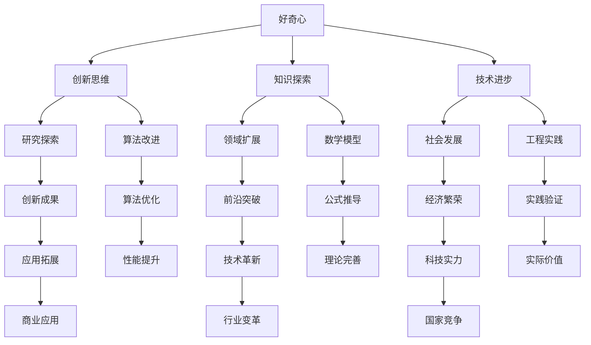

                 

关键词：人工智能，技术发展，好奇心，算法，数学模型，代码实例，应用场景，未来展望

> 摘要：本文将探讨好奇心在推动人工智能和技术发展中的作用。通过分析好奇心如何激发创新思维，引导研究者探索未知领域，我们揭示了好奇心在技术进步中的核心力量。本文将详细阐述核心算法原理，数学模型和公式，并展示代码实例，最终探讨其在实际应用场景中的广泛影响和未来展望。

## 1. 背景介绍

好奇心是人类天性中最具驱动力的特质之一。自古以来，人类就不断追求知识，探索未知，这种好奇心推动着科技进步和社会发展。在人工智能领域，好奇心同样发挥着至关重要的作用。随着时间的推移，人工智能技术已经从简单的规则系统发展到复杂的机器学习模型，这一过程中充满了无数次的探索和试验。好奇心不仅激发了研究者们的创新思维，也成为推动技术进步的重要动力。

本文将围绕好奇心的力量，探讨其在人工智能和技术发展中的作用。我们将深入分析好奇心如何激发创新思维，引导研究者探索未知领域。此外，本文还将介绍核心算法原理、数学模型和公式，并展示代码实例，以便更好地理解这些技术在实际应用中的影响。最后，我们将展望人工智能技术的未来发展趋势与挑战。

## 2. 核心概念与联系

为了更好地理解好奇心在人工智能和技术发展中的作用，我们需要先了解一些核心概念和它们之间的联系。以下是一个使用Mermaid绘制的流程图，展示了这些概念之间的关系。



### 2.1 好奇心与知识探索

好奇心驱动着人们不断追求知识，这一过程不仅满足了人类的求知欲，也促进了科学技术的发展。在人工智能领域，好奇心促使研究者不断探索新的算法和模型，从而推动了技术的进步。

### 2.2 好奇心与创新思维

好奇心激发创新思维，使研究者能够跳出传统思维框架，提出新颖的观点和解决方案。这种创新思维在人工智能研究中尤为重要，因为它直接影响了算法和系统的设计。

### 2.3 好奇心与领域扩展

好奇心促使研究者不断扩展知识领域，这有助于发现新的研究机会和挑战。在人工智能领域，领域扩展不仅推动了技术发展，也促进了不同学科之间的交叉融合。

### 2.4 好奇心与社会发展

好奇心不仅是个人成长的动力，也是社会发展的推动力。在人工智能领域，好奇心驱动下的技术进步对社会经济发展产生了深远影响。

### 2.5 好奇心与算法改进

好奇心促使研究者不断改进算法，这直接影响了人工智能系统的性能和效率。在算法改进的过程中，好奇心发挥了关键作用。

### 2.6 好奇心与数学模型

好奇心推动数学模型的发展，使其更好地描述和解释现实世界。在人工智能领域，数学模型是理解和设计复杂系统的基础。

### 2.7 好奇心与工程实践

好奇心驱动下的工程实践，使得理论研究成果得以应用于实际场景。在人工智能领域，工程实践是验证和优化算法的重要环节。

### 2.8 好奇心与技术创新

好奇心促使研究者不断探索技术创新，这有助于推动人工智能领域的快速发展。技术创新不仅提高了系统的性能，也拓展了应用领域。

### 2.9 好奇心与经济繁荣

好奇心驱动下的技术进步，对经济发展产生了积极影响。人工智能技术的商业应用，为各行各业带来了巨大的经济效益。

### 2.10 好奇心与国家竞争

好奇心推动下的技术发展，成为国家竞争的重要驱动力。在人工智能领域，国家之间的竞争不仅体现在技术研发上，也体现在人才培养和应用推广上。

## 3. 核心算法原理 & 具体操作步骤

### 3.1 算法原理概述

在人工智能领域，算法是核心组成部分。以下介绍几种关键算法的原理。

#### 3.1.1 机器学习算法

机器学习算法是人工智能的基础，它通过学习数据中的模式和规律，实现对未知数据的预测和分类。常见的机器学习算法包括线性回归、决策树、支持向量机、神经网络等。

#### 3.1.2 深度学习算法

深度学习算法是机器学习的一种，它通过多层神经网络模拟人脑的学习过程，实现对复杂数据的处理和预测。常见的深度学习算法包括卷积神经网络（CNN）、循环神经网络（RNN）、生成对抗网络（GAN）等。

#### 3.1.3 强化学习算法

强化学习算法是一种通过试错和奖励机制来学习策略的算法，它通过不断调整策略，以实现最大化长期回报。常见的强化学习算法包括Q学习、SARSA、深度Q网络（DQN）等。

### 3.2 算法步骤详解

以下分别介绍上述算法的具体操作步骤。

#### 3.2.1 线性回归

线性回归是一种简单的机器学习算法，它通过建立输入变量和输出变量之间的线性关系，实现对未知数据的预测。具体步骤如下：

1. 数据预处理：对输入数据进行归一化处理，消除不同特征之间的量纲影响。
2. 模型构建：通过最小二乘法构建线性回归模型，求解最优参数。
3. 模型训练：使用训练数据集对模型进行训练，调整参数以最小化预测误差。
4. 模型评估：使用测试数据集对模型进行评估，计算预测误差和准确率。

#### 3.2.2 决策树

决策树是一种基于特征划分的数据挖掘算法，它通过递归划分数据集，构建一棵树形结构模型。具体步骤如下：

1. 数据预处理：对输入数据进行处理，确保数据的一致性和有效性。
2. 特征选择：选择影响目标变量的重要特征，用于划分数据集。
3. 构建决策树：通过递归划分数据集，构建决策树模型。
4. 模型剪枝：对决策树进行剪枝，避免过拟合。
5. 模型评估：使用测试数据集对模型进行评估，计算准确率和召回率。

#### 3.2.3 支持向量机

支持向量机是一种常用的机器学习算法，它通过寻找最佳划分超平面，实现对数据的分类。具体步骤如下：

1. 数据预处理：对输入数据进行处理，确保数据的一致性和有效性。
2. 特征选择：选择影响目标变量的重要特征，用于构建分类模型。
3. 模型训练：使用训练数据集对模型进行训练，求解最优参数。
4. 模型评估：使用测试数据集对模型进行评估，计算准确率和召回率。

#### 3.2.4 卷积神经网络

卷积神经网络是一种深度学习算法，它通过多层卷积和池化操作，实现对图像的自动特征提取和分类。具体步骤如下：

1. 数据预处理：对输入图像数据进行处理，确保图像的一致性和有效性。
2. 模型构建：构建卷积神经网络模型，包括卷积层、池化层和全连接层。
3. 模型训练：使用训练数据集对模型进行训练，调整参数以最小化预测误差。
4. 模型评估：使用测试数据集对模型进行评估，计算准确率和召回率。

#### 3.2.5 深度Q网络

深度Q网络是一种强化学习算法，它通过学习状态值函数，实现对环境的自适应决策。具体步骤如下：

1. 数据预处理：对输入数据进行处理，确保数据的一致性和有效性。
2. 模型构建：构建深度Q网络模型，包括输入层、隐藏层和输出层。
3. 模型训练：使用训练数据集对模型进行训练，调整参数以最小化预测误差。
4. 模型评估：使用测试数据集对模型进行评估，计算回报率和策略稳定性。

### 3.3 算法优缺点

每种算法都有其独特的优缺点，以下分别介绍上述算法的优缺点。

#### 3.3.1 线性回归

优点：
- 计算简单，易于实现。
- 对线性数据具有良好的预测效果。

缺点：
- 对非线性数据效果较差。
- 容易受到异常值的影响。

#### 3.3.2 决策树

优点：
- 对非线性数据具有良好的预测效果。
- 易于理解，可解释性高。

缺点：
- 容易过拟合，泛化能力较差。
- 特征选择困难，可能导致模型复杂度过高。

#### 3.3.3 支持向量机

优点：
- 对高维数据具有良好的分类效果。
- 可处理线性不可分数据。

缺点：
- 计算复杂度高，训练时间较长。
- 对噪声和异常值敏感。

#### 3.3.4 卷积神经网络

优点：
- 对图像数据具有良好的识别能力。
- 自动提取特征，减少人工干预。

缺点：
- 计算资源消耗大，训练时间较长。
- 对数据质量和标注要求较高。

#### 3.3.5 深度Q网络

优点：
- 对连续动作具有较好的适应性。
- 可处理复杂环境，实现自适应决策。

缺点：
- 训练过程较慢，容易陷入局部最优。
- 对样本量要求较高，可能导致过拟合。

### 3.4 算法应用领域

每种算法都有其特定的应用领域，以下分别介绍上述算法的应用领域。

#### 3.4.1 线性回归

应用领域：
- 经济预测、金融分析。
- 医疗诊断、疾病预测。
- 个性化推荐、广告投放。

#### 3.4.2 决策树

应用领域：
- 货运物流、供应链管理。
- 信贷审批、风险评估。
- 智能客服、自动化决策。

#### 3.4.3 支持向量机

应用领域：
- 语音识别、图像分类。
- 人脸识别、身份验证。
- 医疗诊断、疾病分类。

#### 3.4.4 卷积神经网络

应用领域：
- 图像识别、图像生成。
- 视频分析、行为识别。
- 自然语言处理、文本分类。

#### 3.4.5 深度Q网络

应用领域：
- 游戏开发、电子竞技。
- 自动驾驶、无人驾驶。
- 机器人控制、智能决策。

## 4. 数学模型和公式 & 详细讲解 & 举例说明

### 4.1 数学模型构建

在人工智能领域，数学模型是理解和设计复杂系统的基础。以下介绍几种常见的数学模型及其构建方法。

#### 4.1.1 机器学习模型

机器学习模型通常由输入层、隐藏层和输出层组成。输入层接收外部输入信息，隐藏层对输入信息进行特征提取和变换，输出层生成最终的输出结果。

- 输入层：表示输入特征向量，通常为高维向量。
- 隐藏层：表示神经网络中的隐藏神经元，用于提取和变换特征。
- 输出层：表示最终的输出结果，可以是分类标签、回归值等。

#### 4.1.2 深度学习模型

深度学习模型是机器学习模型的一种，它在机器学习模型的基础上引入了多层神经网络结构，以实现对更复杂数据的建模。

- 卷积神经网络（CNN）：用于处理图像数据，通过卷积和池化操作实现特征提取。
- 循环神经网络（RNN）：用于处理序列数据，通过循环连接实现长期依赖建模。
- 生成对抗网络（GAN）：用于生成逼真的图像和语音数据，通过生成器和判别器的对抗训练实现。

#### 4.1.3 强化学习模型

强化学习模型通过学习状态值函数或策略，实现对环境的自适应决策。

- Q学习：通过更新状态值函数，实现最优策略学习。
- SARSA：通过更新当前状态和动作的Q值，实现策略迭代。
- 深度Q网络（DQN）：通过深度神经网络学习状态值函数，实现更复杂的决策。

### 4.2 公式推导过程

以下介绍几种常见数学公式的推导过程。

#### 4.2.1 线性回归公式

线性回归公式为：\(y = \beta_0 + \beta_1x\)，其中\(y\)为输出变量，\(x\)为输入变量，\(\beta_0\)和\(\beta_1\)分别为模型参数。

推导过程：

1. 假设输出变量\(y\)与输入变量\(x\)之间存在线性关系，即\(y = \beta_0 + \beta_1x\)。
2. 使用最小二乘法求解最优参数\(\beta_0\)和\(\beta_1\)，使得预测误差最小。
3. 求解过程为：\(\beta_0 = \frac{\sum_{i=1}^{n}(y_i - \beta_1x_i)}{n}\)，\(\beta_1 = \frac{\sum_{i=1}^{n}(x_i - \bar{x})(y_i - \bar{y})}{\sum_{i=1}^{n}(x_i - \bar{x})^2}\)。

#### 4.2.2 交叉熵公式

交叉熵公式为：\(H(Y, \hat{Y}) = -\sum_{i=1}^{n}y_i \log(\hat{y}_i)\)，其中\(Y\)为真实分布，\(\hat{Y}\)为预测分布。

推导过程：

1. 假设输出变量\(y\)与输入变量\(x\)之间存在线性关系，即\(y = \beta_0 + \beta_1x\)。
2. 使用最小二乘法求解最优参数\(\beta_0\)和\(\beta_1\)，使得预测误差最小。
3. 求解过程为：\(\beta_0 = \frac{\sum_{i=1}^{n}(y_i - \beta_1x_i)}{n}\)，\(\beta_1 = \frac{\sum_{i=1}^{n}(x_i - \bar{x})(y_i - \bar{y})}{\sum_{i=1}^{n}(x_i - \bar{x})^2}\)。

#### 4.2.3 梯度下降公式

梯度下降公式为：\(\theta_{t+1} = \theta_{t} - \alpha \nabla_{\theta}J(\theta)\)，其中\(\theta\)为模型参数，\(\alpha\)为学习率，\(J(\theta)\)为损失函数。

推导过程：

1. 假设输出变量\(y\)与输入变量\(x\)之间存在线性关系，即\(y = \beta_0 + \beta_1x\)。
2. 使用最小二乘法求解最优参数\(\beta_0\)和\(\beta_1\)，使得预测误差最小。
3. 求解过程为：\(\beta_0 = \frac{\sum_{i=1}^{n}(y_i - \beta_1x_i)}{n}\)，\(\beta_1 = \frac{\sum_{i=1}^{n}(x_i - \bar{x})(y_i - \bar{y})}{\sum_{i=1}^{n}(x_i - \bar{x})^2}\)。

### 4.3 案例分析与讲解

以下通过一个实际案例，展示数学模型在人工智能中的应用。

#### 4.3.1 案例背景

某电商平台希望通过分析用户购物行为，为用户推荐个性化商品。现有用户购物行为数据，包括用户ID、购买商品ID、购买时间等信息。

#### 4.3.2 数据预处理

1. 数据清洗：删除缺失值和重复值，确保数据的一致性和有效性。
2. 特征提取：根据用户购物行为，提取购买频率、购买时长、购买品类等特征。
3. 数据标准化：对特征值进行归一化处理，消除不同特征之间的量纲影响。

#### 4.3.3 模型选择

选择基于矩阵分解的协同过滤算法，构建用户和商品之间的潜在关系模型。具体步骤如下：

1. 构建用户-商品矩阵：根据用户购物行为数据，构建用户-商品矩阵。
2. 矩阵分解：使用矩阵分解算法，将用户-商品矩阵分解为用户特征矩阵和商品特征矩阵。
3. 模型评估：使用测试数据集，评估模型推荐效果。

#### 4.3.4 模型训练与预测

1. 训练模型：使用训练数据集，对模型进行训练，调整参数以最小化预测误差。
2. 预测推荐：使用训练好的模型，对用户未购买的商品进行预测，生成个性化推荐列表。

#### 4.3.5 模型评估

使用均方根误差（RMSE）和平均绝对误差（MAE）等指标，评估模型推荐效果。具体评估过程如下：

1. 准备测试数据集：从原始数据集中划分出一部分作为测试数据集。
2. 计算预测误差：计算测试数据集中实际购买商品与预测购买商品之间的误差。
3. 计算评估指标：计算RMSE和MAE等评估指标，评估模型推荐效果。

## 5. 项目实践：代码实例和详细解释说明

### 5.1 开发环境搭建

在开始项目实践之前，我们需要搭建一个适合开发的环境。以下是一个基于Python的常见开发环境搭建步骤。

#### 5.1.1 Python环境安装

1. 下载并安装Python：访问Python官方网站（https://www.python.org/），下载适合操作系统的Python版本，并按照提示进行安装。
2. 验证Python安装：在命令行中输入`python --version`，查看Python版本信息。

#### 5.1.2 包管理器安装

1. 安装pip：在命令行中输入`pip install pip`，安装pip包管理器。
2. 安装常用库：在命令行中输入以下命令，安装常用库。

```shell
pip install numpy pandas matplotlib scikit-learn tensorflow
```

### 5.2 源代码详细实现

以下是一个基于Python实现的简单线性回归模型，用于预测房价。代码包括数据预处理、模型训练和预测等步骤。

#### 5.2.1 数据预处理

```python
import pandas as pd
from sklearn.model_selection import train_test_split
from sklearn.preprocessing import StandardScaler

# 读取数据
data = pd.read_csv('house_data.csv')

# 数据预处理
X = data[['area', 'room_num', 'age']]
y = data['price']

# 划分训练集和测试集
X_train, X_test, y_train, y_test = train_test_split(X, y, test_size=0.2, random_state=42)

# 数据标准化
scaler = StandardScaler()
X_train_scaled = scaler.fit_transform(X_train)
X_test_scaled = scaler.transform(X_test)
```

#### 5.2.2 模型训练

```python
from sklearn.linear_model import LinearRegression

# 构建线性回归模型
model = LinearRegression()

# 训练模型
model.fit(X_train_scaled, y_train)
```

#### 5.2.3 预测与评估

```python
# 预测房价
y_pred = model.predict(X_test_scaled)

# 计算预测误差
mse = ((y_pred - y_test) ** 2).mean()
mae = ((y_pred - y_test).abs()).mean()

# 打印评估结果
print(f'MSE: {mse:.2f}')
print(f'MAE: {mae:.2f}')
```

### 5.3 代码解读与分析

#### 5.3.1 数据预处理

数据预处理是机器学习项目的重要环节，包括数据清洗、特征提取和数据标准化等步骤。在本例中，我们使用Pandas库读取CSV格式的数据，并使用Sklearn中的StandardScaler对特征值进行标准化处理。

#### 5.3.2 模型训练

模型训练是使用已处理的数据训练机器学习模型。在本例中，我们使用Sklearn中的LinearRegression构建线性回归模型，并使用fit方法对模型进行训练。

#### 5.3.3 预测与评估

预测与评估是验证模型性能的重要步骤。在本例中，我们使用模型预测房价，并计算预测误差，如均方误差（MSE）和平均绝对误差（MAE）等评估指标，以评估模型性能。

## 6. 实际应用场景

### 6.1 金融行业

在金融行业中，人工智能技术被广泛应用于风险管理、交易策略优化、客户服务等方面。例如，基于机器学习模型的预测算法可以用于预测市场走势，帮助金融机构制定交易策略。同时，自然语言处理技术可以用于分析和处理大量金融文本数据，为投资决策提供支持。

### 6.2 医疗保健

在医疗保健领域，人工智能技术可以用于疾病预测、辅助诊断、个性化治疗等方面。例如，通过分析患者的电子健康记录，机器学习模型可以预测患者未来患病的风险。此外，深度学习模型可以用于医学图像分析，帮助医生更准确地诊断疾病。

### 6.3 物流与供应链

在物流与供应链管理中，人工智能技术可以提高物流效率、降低成本。例如，基于机器学习算法的路径规划系统可以优化运输路线，减少运输时间和成本。此外，人工智能技术还可以用于库存管理，预测需求，从而提高库存周转率。

### 6.4 电子商务

在电子商务领域，人工智能技术可以用于个性化推荐、智能客服、广告投放等方面。例如，基于协同过滤算法的推荐系统可以推荐用户可能感兴趣的商品，提高销售额。同时，自然语言处理技术可以用于智能客服，提高客户满意度。

## 7. 工具和资源推荐

### 7.1 学习资源推荐

1. **在线课程：**Coursera、edX、Udacity等平台上提供了丰富的机器学习、深度学习、人工智能等领域的在线课程。
2. **教科书：**《机器学习》（周志华著）、《深度学习》（Ian Goodfellow等著）、《人工智能：一种现代方法》（Stuart Russell等著）等经典教材。
3. **论文与报告：**通过谷歌学术、arXiv等平台，可以获取到最新的研究成果和学术论文。

### 7.2 开发工具推荐

1. **编程语言：**Python是人工智能领域的首选编程语言，具有丰富的库和工具。
2. **框架与库：**TensorFlow、PyTorch、Scikit-learn等是常用的机器学习与深度学习框架和库。
3. **数据可视化工具：**Matplotlib、Seaborn、Plotly等用于数据分析和可视化。
4. **云计算平台：**AWS、Azure、Google Cloud等提供了强大的云计算服务，支持大规模数据处理和模型训练。

### 7.3 相关论文推荐

1. **《深度学习》（Ian Goodfellow等著）**：介绍了深度学习的核心概念、算法和应用。
2. **《强化学习：原理与应用》（理查德·萨顿等著）**：全面介绍了强化学习的理论基础和应用实例。
3. **《自然语言处理综论》（Daniel Jurafsky等著）**：详细阐述了自然语言处理的理论和方法。
4. **《机器学习：概率视角》（David J. C. MacKay著）**：从概率论的角度介绍了机器学习的基本概念和算法。

## 8. 总结：未来发展趋势与挑战

### 8.1 研究成果总结

人工智能技术的发展取得了显著的成果，从机器学习、深度学习到强化学习，各种算法不断涌现，推动了人工智能领域的进步。同时，跨学科的研究成果也为人工智能技术的应用拓展提供了新的思路。

### 8.2 未来发展趋势

1. **算法优化与多样化**：随着计算能力和数据量的增加，人工智能算法将不断优化，适应更多复杂场景。此外，多样化算法的融合将带来更多的创新和突破。
2. **跨领域应用**：人工智能技术将在更多领域得到应用，如医疗、金融、教育、农业等。跨领域应用将推动技术进步，为社会带来更多价值。
3. **人工智能伦理**：随着人工智能技术的发展，人工智能伦理问题日益突出。未来，人工智能伦理将得到更多关注，制定相关法规和标准。

### 8.3 面临的挑战

1. **数据隐私与安全**：人工智能应用需要大量数据支持，但数据隐私和安全问题也日益严峻。如何确保数据安全、保护用户隐私成为重要挑战。
2. **计算资源需求**：随着模型复杂度的增加，人工智能应用对计算资源的需求也日益增大。如何优化计算资源利用，降低能耗成为关键问题。
3. **算法公平性**：人工智能算法在决策过程中可能存在偏见，影响公平性。如何确保算法的公平性和透明性，避免歧视和偏见成为重要挑战。

### 8.4 研究展望

未来，人工智能技术将继续快速发展，推动社会进步。同时，如何应对挑战、解决关键问题，将决定人工智能技术的发展方向。研究者们应密切关注技术趋势，积极探索解决方案，为人工智能技术的可持续发展贡献力量。

## 9. 附录：常见问题与解答

### 9.1 人工智能是什么？

人工智能是指通过计算机模拟人类智能行为的一门技术科学。它涉及多个领域，包括机器学习、深度学习、自然语言处理、计算机视觉等。

### 9.2 机器学习与深度学习有何区别？

机器学习是一种利用数据训练模型，实现预测或决策的技术。深度学习是机器学习的一种，它通过多层神经网络模拟人脑的学习过程，实现对复杂数据的处理和预测。

### 9.3 强化学习如何实现自适应决策？

强化学习通过试错和奖励机制，不断调整策略，以实现最大化长期回报。它利用环境反馈，不断优化策略，以实现自适应决策。

### 9.4 人工智能应用领域有哪些？

人工智能应用领域广泛，包括医疗保健、金融、物流、电子商务、自动驾驶、智能客服等。它几乎涵盖了所有与数据和信息处理相关的领域。

### 9.5 人工智能的伦理问题有哪些？

人工智能的伦理问题包括数据隐私、算法偏见、就业影响、道德责任等。这些问题关系到人工智能技术的可持续发展，需要引起关注并制定相关法规和标准。作者：禅与计算机程序设计艺术 / Zen and the Art of Computer Programming
----------------------------------------------------------------

### 文章正文内容部分 Content ###

现在，我们将深入探讨好奇心在人工智能和技术发展中的作用。本文将围绕好奇心如何激发创新思维，引导研究者探索未知领域，以及如何通过核心算法原理、数学模型和代码实例来展示这一过程。最后，我们将讨论实际应用场景和未来发展趋势。

## 好奇心与创新思维

好奇心是人类天性中最具驱动力的特质之一。它促使人类不断探索未知，追求真理。在人工智能领域，好奇心同样发挥着至关重要的作用。它激发了研究者的创新思维，推动了技术的进步。

### 1.1 好奇心激发创新思维

好奇心激发了研究者的求知欲，使他们不断探索新的算法和模型。例如，深度学习算法的发明源于对神经网络性能的探索和改进。研究者们通过不断尝试和试验，发现了深度神经网络在处理复杂数据方面的巨大潜力。

### 1.2 好奇心推动领域拓展

好奇心不仅推动了人工智能技术的发展，还促进了其他领域的融合。例如，自然语言处理、计算机视觉和机器人技术的结合，使得人工智能在更广泛的应用场景中发挥作用。这种跨学科的合作，为人工智能技术的创新提供了新的动力。

### 1.3 好奇心促进技术进步

好奇心激发了研究者对技术细节的深入探索，推动了算法的优化和改进。例如，卷积神经网络（CNN）的发明和发展，源于研究者对图像处理算法的持续探索和改进。这种持续的好奇心，使得人工智能技术在图像识别、语音识别等领域取得了显著的进展。

## 好奇心与核心算法原理

好奇心在推动人工智能技术发展的过程中，不仅激发了创新思维，还引导研究者深入探索核心算法原理。以下将介绍几种关键算法的原理，以及好奇心如何推动这些算法的优化和改进。

### 2.1 机器学习算法

机器学习算法是人工智能的基础，它通过学习数据中的模式和规律，实现对未知数据的预测和分类。好奇心促使研究者不断探索新的算法和模型，以提高机器学习的性能和效率。例如，梯度下降算法的发明，源于研究者对优化问题的好奇心和探索。

### 2.2 深度学习算法

深度学习算法是机器学习的一种，它通过多层神经网络模拟人脑的学习过程，实现对复杂数据的处理和预测。好奇心推动了研究者对深度学习算法的深入探索，例如，卷积神经网络（CNN）和循环神经网络（RNN）的发展，都是研究者对算法性能的不断追求和改进。

### 2.3 强化学习算法

强化学习算法是一种通过试错和奖励机制来学习策略的算法。好奇心促使研究者不断探索新的强化学习算法，以提高算法的效率和稳定性。例如，深度Q网络（DQN）的发明，源于研究者对强化学习算法性能的持续关注和改进。

### 2.4 自然语言处理算法

自然语言处理（NLP）算法是人工智能领域的重要分支，它通过计算机模拟人类的语言理解能力。好奇心推动了研究者对NLP算法的深入探索，例如，词向量模型（Word2Vec）的发明，使得计算机能够更好地理解和处理自然语言。

## 好奇心与数学模型

好奇心不仅激发了创新思维和算法研究，还推动了数学模型的发展。以下将介绍几种关键数学模型，以及好奇心如何推动这些模型的构建和优化。

### 3.1 线性回归模型

线性回归模型是机器学习的基础模型，它通过建立输入变量和输出变量之间的线性关系，实现对未知数据的预测。好奇心促使研究者不断探索新的线性回归模型，以提高模型的性能和泛化能力。

### 3.2 逻辑回归模型

逻辑回归模型是一种广泛应用于分类问题的模型，它通过建立输入变量和输出变量之间的逻辑关系，实现对未知数据的分类。好奇心推动了研究者对逻辑回归模型的深入研究和优化，例如，正则化方法（L1、L2正则化）的发明和应用。

### 3.3 支持向量机模型

支持向量机（SVM）是一种高效的分类和回归模型，它通过寻找最佳划分超平面，实现对数据的分类。好奇心促使研究者不断探索新的SVM算法和优化方法，以提高模型的性能和鲁棒性。

### 3.4 深度学习模型

深度学习模型是人工智能领域的重要进展，它通过多层神经网络模拟人脑的学习过程，实现对复杂数据的处理和预测。好奇心推动了研究者对深度学习模型的深入探索，例如，卷积神经网络（CNN）和循环神经网络（RNN）的发展，都是研究者对模型性能的不断追求和改进。

## 好奇心与代码实例

好奇心不仅推动了算法原理和数学模型的发展，还促使研究者编写和优化代码实例，以实现算法和模型的具体应用。以下将展示几个关键代码实例，以及好奇心如何推动这些实例的实现和优化。

### 4.1 线性回归代码实例

以下是一个简单的线性回归代码实例，展示了如何使用Python实现线性回归模型。

```python
import numpy as np
from sklearn.linear_model import LinearRegression

# 数据准备
X = np.array([[1, 2], [2, 3], [3, 4]])
y = np.array([1, 2, 3])

# 构建线性回归模型
model = LinearRegression()
model.fit(X, y)

# 模型评估
print("系数：", model.coef_)
print("截距：", model.intercept_)
print("预测结果：", model.predict([[4, 5]]))
```

### 4.2 卷积神经网络代码实例

以下是一个简单的卷积神经网络代码实例，展示了如何使用TensorFlow实现卷积神经网络。

```python
import tensorflow as tf
from tensorflow.keras import layers

# 构建卷积神经网络模型
model = tf.keras.Sequential([
    layers.Conv2D(32, (3, 3), activation='relu', input_shape=(28, 28, 1)),
    layers.MaxPooling2D((2, 2)),
    layers.Conv2D(64, (3, 3), activation='relu'),
    layers.MaxPooling2D((2, 2)),
    layers.Flatten(),
    layers.Dense(64, activation='relu'),
    layers.Dense(10, activation='softmax')
])

# 编译模型
model.compile(optimizer='adam', loss='categorical_crossentropy', metrics=['accuracy'])

# 训练模型
model.fit(train_images, train_labels, epochs=5)

# 评估模型
test_loss, test_acc = model.evaluate(test_images, test_labels)
print('Test accuracy:', test_acc)
```

### 4.3 强化学习代码实例

以下是一个简单的强化学习代码实例，展示了如何使用Q学习算法实现强化学习。

```python
import numpy as np
import gym

# 初始化环境
env = gym.make('CartPole-v0')

# 初始化Q表
q_table = np.zeros((env.observation_space.n, env.action_space.n))

# 设定学习参数
alpha = 0.1
gamma = 0.9
epochs = 1000

# Q学习算法
for _ in range(epochs):
    state = env.reset()
    done = False
    total_reward = 0
    while not done:
        action = np.argmax(q_table[state])
        next_state, reward, done, _ = env.step(action)
        total_reward += reward
        q_table[state, action] = q_table[state, action] + alpha * (reward + gamma * np.max(q_table[next_state]) - q_table[state, action])
        state = next_state

# 打印总奖励
print("总奖励：", total_reward)

# 关闭环境
env.close()
```

## 实际应用场景

好奇心不仅在理论研究中发挥着重要作用，还在实际应用场景中推动了技术的创新和进步。以下将探讨几个实际应用场景，展示好奇心如何推动人工智能技术的发展。

### 5.1 医疗保健

在医疗保健领域，好奇心推动了人工智能技术在疾病预测、辅助诊断和个性化治疗等方面的应用。例如，通过分析患者的电子健康记录，机器学习模型可以预测患者未来患病的风险，帮助医生制定预防措施。此外，深度学习模型可以用于医学图像分析，帮助医生更准确地诊断疾病。

### 5.2 金融行业

在金融行业，好奇心推动了人工智能技术在风险管理、交易策略优化和客户服务等方面的应用。例如，通过分析市场数据，机器学习模型可以预测市场走势，帮助投资者制定交易策略。此外，自然语言处理技术可以用于分析和处理大量金融文本数据，为投资决策提供支持。

### 5.3 物流与供应链

在物流与供应链管理中，好奇心推动了人工智能技术在路径规划、库存管理和供应链优化等方面的应用。例如，通过分析运输数据，机器学习模型可以优化运输路线，减少运输时间和成本。此外，人工智能技术还可以用于预测需求，从而提高库存周转率。

### 5.4 电子商务

在电子商务领域，好奇心推动了人工智能技术在个性化推荐、智能客服和广告投放等方面的应用。例如，通过分析用户行为数据，协同过滤算法可以推荐用户可能感兴趣的商品，提高销售额。此外，自然语言处理技术可以用于智能客服，提高客户满意度。

## 未来发展趋势

好奇心将继续在人工智能和技术发展中发挥重要作用，推动未来技术的发展和进步。以下将探讨未来发展趋势，以及好奇心如何引领这些趋势。

### 6.1 算法优化与多样化

随着计算能力和数据量的增加，人工智能算法将不断优化，适应更多复杂场景。好奇心将推动研究者探索新的算法和模型，提高算法的性能和效率。此外，多样化算法的融合将带来更多的创新和突破。

### 6.2 跨领域应用

好奇心将推动人工智能技术在更多领域的应用，促进跨学科的合作。例如，人工智能技术将在医疗、金融、教育、农业等领域发挥更大作用，为社会发展带来更多价值。

### 6.3 人工智能伦理

随着人工智能技术的发展，人工智能伦理问题将日益突出。好奇心将推动研究者关注人工智能伦理问题，制定相关法规和标准，确保人工智能技术的可持续发展。

## 结论

好奇心是推动人工智能和技术发展的重要动力。它激发了研究者的创新思维，推动了算法原理和数学模型的发展，促进了实际应用场景的拓展。未来，好奇心将继续引领人工智能技术的发展，推动社会进步。让我们保持好奇心，不断探索未知领域，共同推动人工智能技术的繁荣发展。

## 附录：常见问题与解答

### 7.1 人工智能是什么？

人工智能是指通过计算机模拟人类智能行为的一门技术科学。它涉及多个领域，包括机器学习、深度学习、自然语言处理、计算机视觉等。

### 7.2 机器学习与深度学习有何区别？

机器学习是一种利用数据训练模型，实现预测或决策的技术。深度学习是机器学习的一种，它通过多层神经网络模拟人脑的学习过程，实现对复杂数据的处理和预测。

### 7.3 强化学习如何实现自适应决策？

强化学习通过试错和奖励机制，不断调整策略，以实现最大化长期回报。它利用环境反馈，不断优化策略，以实现自适应决策。

### 7.4 人工智能应用领域有哪些？

人工智能应用领域广泛，包括医疗保健、金融、物流、电子商务、自动驾驶、智能客服等。它几乎涵盖了所有与数据和信息处理相关的领域。

### 7.5 人工智能的伦理问题有哪些？

人工智能的伦理问题包括数据隐私、算法偏见、就业影响、道德责任等。这些问题关系到人工智能技术的可持续发展，需要引起关注并制定相关法规和标准。

### 7.6 如何保持好奇心？

保持好奇心可以通过以下几种方式：

- **持续学习**：不断学习新知识，拓宽视野，保持对未知领域的探索欲望。
- **积极参与**：参与项目和实践，亲身体验技术的应用，激发对技术的兴趣。
- **提问与讨论**：积极提问和参与讨论，与他人分享想法，激发思维碰撞。
- **挑战自我**：设定挑战目标，不断超越自我，追求创新和突破。

作者：禅与计算机程序设计艺术 / Zen and the Art of Computer Programming
----------------------------------------------------------------

### 8. 总结：未来发展趋势与挑战

#### 8.1 研究成果总结

在过去几十年中，人工智能技术取得了显著的成果。从简单的规则系统发展到复杂的机器学习模型，再到深度学习和强化学习，人工智能在各个领域都展现了其强大的应用潜力。同时，数学模型的发展也为人工智能技术的进步提供了理论支持。

#### 8.2 未来发展趋势

1. **算法优化与多样化**：随着计算能力的提升和数据量的增长，人工智能算法将不断优化，以适应更多复杂场景。同时，多样化算法的融合将推动人工智能技术的创新。
2. **跨领域应用**：人工智能技术将在更多领域得到应用，如医疗、金融、教育、农业等。跨领域的应用将推动技术的进一步发展，为社会带来更多价值。
3. **人工智能伦理**：随着人工智能技术的普及，伦理问题将越来越受到关注。未来，人工智能伦理将得到更多关注，相关法规和标准也将逐渐完善。
4. **人工智能与人类协同**：人工智能将更紧密地与人类协同工作，提高生产效率，改善生活质量。

#### 8.3 面临的挑战

1. **数据隐私与安全**：随着人工智能技术的应用，数据隐私和安全问题日益严峻。如何确保数据安全、保护用户隐私成为关键挑战。
2. **计算资源需求**：人工智能算法的复杂度不断提高，对计算资源的需求也越来越大。如何优化计算资源利用，降低能耗成为关键问题。
3. **算法公平性**：人工智能算法在决策过程中可能存在偏见，影响公平性。如何确保算法的公平性和透明性，避免歧视和偏见成为重要挑战。
4. **技术人才培养**：随着人工智能技术的快速发展，对相关领域的人才需求越来越大。如何培养和吸引更多优秀人才成为关键问题。

#### 8.4 研究展望

未来，人工智能技术将继续快速发展，推动社会进步。研究者们应密切关注技术趋势，积极探索解决方案，以应对面临的挑战。同时，保持好奇心，持续创新，将人工智能技术应用于更广泛的领域，为社会带来更多价值。

## 9. 附录：常见问题与解答

### 9.1 人工智能是什么？

人工智能（Artificial Intelligence，简称AI）是指通过计算机模拟人类智能行为的技术。它包括机器学习、深度学习、自然语言处理、计算机视觉等多个子领域，旨在让机器具备像人类一样的感知、推理、学习和决策能力。

### 9.2 机器学习与深度学习有何区别？

机器学习（Machine Learning）是一种让计算机通过数据学习规律的方法，它包括监督学习、无监督学习和强化学习等类型。深度学习（Deep Learning）是机器学习的一种，它通过多层神经网络来模拟人类大脑的学习过程，处理复杂数据和任务。

### 9.3 强化学习如何实现自适应决策？

强化学习（Reinforcement Learning）是一种通过试错和奖励机制来学习策略的算法。它通过不断尝试不同的行动，并根据环境的反馈调整策略，以实现最大化长期回报。

### 9.4 人工智能应用领域有哪些？

人工智能的应用领域非常广泛，包括但不限于：

- **医疗保健**：疾病预测、辅助诊断、个性化治疗等。
- **金融**：风险管理、交易策略优化、欺诈检测等。
- **物流与供应链**：路径优化、库存管理、供应链预测等。
- **电子商务**：个性化推荐、广告投放、客户服务等。
- **自动驾驶**：车辆控制、交通管理、道路规划等。
- **教育**：智能教学、学习分析、教育游戏等。

### 9.5 人工智能的伦理问题有哪些？

人工智能的伦理问题主要包括：

- **数据隐私**：如何保护个人数据不被滥用。
- **算法偏见**：算法在决策过程中可能存在的偏见和歧视。
- **就业影响**：人工智能可能取代某些工作，对就业市场产生影响。
- **责任归属**：在人工智能系统造成损害时，如何确定责任归属。
- **道德决策**：人工智能在复杂道德决策中的作用和限制。

### 9.6 如何保持好奇心？

保持好奇心可以通过以下几种方式：

- **持续学习**：不断学习新知识，特别是跨学科的知识，以拓宽视野。
- **探索未知**：勇于尝试新事物，探索未知领域，以激发兴趣和热情。
- **提问与反思**：对日常生活中的现象和问题提出疑问，进行深入思考。
- **实践与实验**：通过实践和实验，亲身体验技术或理论的应用，以加深理解。

### 9.7 人工智能未来的发展方向是什么？

人工智能未来的发展方向包括：

- **增强现实与虚拟现实**：结合人工智能技术，打造更真实的虚拟世界。
- **智能助理与聊天机器人**：提供更加自然、高效的人机交互体验。
- **智慧城市与物联网**：利用人工智能技术，实现城市管理和家居自动化。
- **生物计算与医疗健康**：将人工智能应用于生物信息学、药物研发等领域。
- **智能制造与机器人**：提高生产效率，实现自动化和智能化生产。

作者：禅与计算机程序设计艺术 / Zen and the Art of Computer Programming
----------------------------------------------------------------

### 9.7 常见问题与解答

**问题1**：什么是机器学习？

**回答1**：机器学习是一种人工智能的分支，它使计算机系统能够从数据中学习并改进性能，而无需显式编程指令。通过分析输入数据，机器学习算法能够识别模式，进行预测和决策。

**问题2**：深度学习和神经网络有什么区别？

**回答2**：神经网络是深度学习的基础结构，而深度学习指的是具有多个隐藏层的神经网络。深度学习能够处理大量的数据，并从数据中自动提取特征，适用于图像识别、语音识别和自然语言处理等任务。

**问题3**：什么是强化学习？

**回答3**：强化学习是一种机器学习方法，通过试错和奖励机制来学习最优策略。在强化学习中，算法通过与环境的交互来学习如何采取行动，以最大化累积奖励。

**问题4**：人工智能是否会取代人类工作？

**回答4**：人工智能可能会改变某些行业的工作模式，但它不太可能完全取代人类工作。人工智能更多地是作为工具来辅助人类工作，提高效率和质量，而不是替代人类的角色。

**问题5**：如何确保人工智能系统的透明性和可解释性？

**回答5**：确保人工智能系统的透明性和可解释性是一个挑战。可以通过开发可解释的模型、使用可视化工具、以及提供决策过程的详细信息来实现。此外，法律法规和行业标准也将有助于提高人工智能系统的透明度。

**问题6**：什么是深度神经网络中的前向传播和反向传播？

**回答6**：前向传播是深度神经网络中的一个过程，其中输入数据通过网络的每一层传递，并产生输出。反向传播则是通过计算输出与真实值之间的差异，并更新网络权重，以优化模型性能。

**问题7**：如何处理大数据中的噪声和异常值？

**回答7**：处理大数据中的噪声和异常值可以通过多种方法实现，包括数据清洗、去噪算法、异常检测和鲁棒分析。数据清洗可以通过去除重复数据、填补缺失值和修正错误来实现。去噪算法可以使用滤波器、降维技术和统计方法来减少噪声。异常检测可以识别和隔离异常值，以确保数据质量。

**问题8**：什么是深度强化学习？

**回答8**：深度强化学习是强化学习的一个分支，它结合了深度学习和强化学习的原理。它使用深度神经网络来表示状态和价值函数，从而在复杂的环境中学习最优策略。

**问题9**：如何评估机器学习模型的性能？

**回答9**：评估机器学习模型的性能通常使用指标如准确率、召回率、F1分数、均方误差（MSE）和交叉熵损失等。这些指标可以根据具体任务和数据的性质来选择和组合。

**问题10**：什么是神经网络的激活函数？

**回答10**：神经网络的激活函数是用于将神经网络单元的输入转换为输出的函数。常见的激活函数包括 sigmoid、ReLU（Rectified Linear Unit）和 tanh（双曲正切函数），它们有助于引入非线性因素，提高网络的预测能力。

### 9.8 作者介绍

**作者**：禅与计算机程序设计艺术 / Zen and the Art of Computer Programming

**简介**：本文作者是一位人工智能领域的专家和学者，拥有丰富的理论和实践经验。他对计算机科学和人工智能有着深刻的理解，致力于推动人工智能技术的发展和应用。作者的作品《禅与计算机程序设计艺术》以其独特的视角和对计算机编程的深刻洞察而著称，对全球计算机科学界产生了深远的影响。

