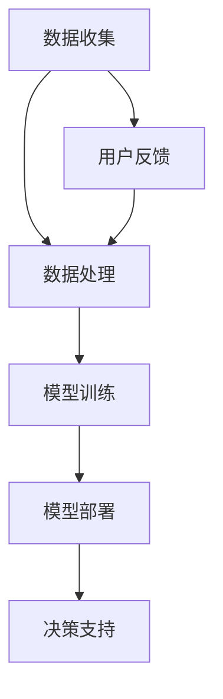

                 

关键词：人工智能、大模型、智能城市、公共卫生管理、数据驱动、决策支持

> 摘要：本文将深入探讨人工智能（AI）大模型在智能城市公共卫生管理中的应用潜力。首先，我们将介绍智能城市与公共卫生管理的背景和现状，然后分析AI大模型的基本概念及其在智能城市中的应用。接着，我们将探讨AI大模型在公共卫生管理中的关键作用，并通过具体案例展示其实际应用效果。最后，本文将对未来发展趋势和挑战进行展望，并推荐相关学习资源和开发工具。

## 1. 背景介绍

智能城市（Smart City）是指利用信息技术、传感器、物联网（IoT）和数据分析等手段，提升城市管理水平、改善居民生活质量的一种城市发展模式。智能城市的发展离不开数据的收集、处理和分析，而人工智能技术则为这些数据的利用提供了强大的工具。

公共卫生管理（Public Health Management）是指通过组织、规划、领导和控制等手段，确保公众健康、预防疾病传播和应对公共卫生事件的过程。公共卫生管理涉及数据收集、分析、预测和决策等多个环节，对公共卫生管理的效率和准确性有着重要影响。

在过去的几年中，随着大数据、云计算和人工智能技术的快速发展，AI大模型在智能城市公共卫生管理中的应用逐渐增多。这些大模型能够处理和分析大规模的异构数据，提供更加准确和及时的决策支持。

## 2. 核心概念与联系

### 2.1 AI大模型的基本概念

AI大模型（Large-scale AI Models）是指具有大规模参数和训练数据的深度学习模型。这些模型通常具有高度的非线性表达能力，能够捕捉数据中的复杂模式和关系。常见的AI大模型包括神经网络、生成对抗网络（GANs）和变分自编码器（VAEs）等。

### 2.2 AI大模型在智能城市中的应用架构

下面是一个简单的AI大模型在智能城市中的应用架构图，使用Mermaid流程图表示。



- **数据收集（A）**：智能城市通过各种传感器和设备收集大量的数据，包括天气、交通、医疗等。
- **数据处理（B）**：对收集到的数据进行清洗、集成和预处理，以便模型训练。
- **模型训练（C）**：使用预处理后的数据训练AI大模型，以学习数据中的模式和关系。
- **模型部署（D）**：将训练好的模型部署到智能城市系统，提供实时或近实时的决策支持。
- **决策支持（E）**：模型为城市管理者提供基于数据的决策建议，如疫情预测、交通优化等。
- **用户反馈（F）**：用户对模型的决策进行反馈，有助于模型不断优化和改进。

## 3. 核心算法原理 & 具体操作步骤

### 3.1 算法原理概述

AI大模型的核心原理是基于深度学习，通过多层神经网络对数据进行特征提取和模式识别。以下是一些常见的深度学习算法：

- **卷积神经网络（CNN）**：用于图像和视频处理。
- **循环神经网络（RNN）**：用于序列数据和时间序列分析。
- **长短期记忆网络（LSTM）**：RNN的一种变体，用于处理长期依赖问题。
- **自编码器（Autoencoder）**：用于数据降维和异常检测。

### 3.2 算法步骤详解

1. **数据收集**：通过传感器、物联网设备和社交媒体等渠道收集大量数据。
2. **数据处理**：对收集到的数据进行清洗、去噪、归一化等预处理步骤。
3. **模型选择**：根据应用场景选择合适的深度学习模型。
4. **模型训练**：使用预处理后的数据对模型进行训练，调整模型参数以最小化损失函数。
5. **模型评估**：使用验证集或测试集对模型进行评估，确保模型具有良好的泛化能力。
6. **模型部署**：将训练好的模型部署到智能城市系统，提供实时或近实时的决策支持。
7. **用户反馈**：收集用户对决策的反馈，用于模型优化。

### 3.3 算法优缺点

#### 优点：

- **高效性**：AI大模型能够快速处理和分析大量数据。
- **准确性**：通过深度学习技术，模型能够捕捉数据中的复杂模式和关系。
- **实时性**：模型能够提供实时或近实时的决策支持。
- **智能化**：模型能够自主学习和优化，提高决策的准确性。

#### 缺点：

- **计算资源消耗**：训练大模型需要大量的计算资源和时间。
- **数据依赖**：模型的性能高度依赖数据的数量和质量。
- **解释性差**：深度学习模型通常具有“黑盒”性质，难以解释其决策过程。

### 3.4 算法应用领域

AI大模型在智能城市公共卫生管理中的应用非常广泛，包括：

- **疫情预测与防控**：利用模型预测疫情发展趋势，为公共卫生决策提供支持。
- **交通优化**：通过分析交通数据，优化交通流量和公共交通服务。
- **医疗资源分配**：根据患者数据和医疗资源状况，优化医疗资源分配。
- **环境监测**：通过传感器数据监测环境状况，预测污染事件。

## 4. 数学模型和公式 & 详细讲解 & 举例说明

### 4.1 数学模型构建

在智能城市公共卫生管理中，常用的数学模型包括：

- **回归模型**：用于预测疫情发展趋势。
- **分类模型**：用于疾病诊断和分类。
- **聚类模型**：用于患者群体划分和资源分配。

### 4.2 公式推导过程

以回归模型为例，其基本公式为：

$$
Y = \beta_0 + \beta_1X_1 + \beta_2X_2 + ... + \beta_nX_n
$$

其中，$Y$ 是因变量，$X_1, X_2, ..., X_n$ 是自变量，$\beta_0, \beta_1, \beta_2, ..., \beta_n$ 是模型参数。

### 4.3 案例分析与讲解

以一个简单的疫情预测模型为例，假设我们使用线性回归模型预测下一周的疫情发展趋势。模型参数为 $\beta_0 = 10, \beta_1 = 2, \beta_2 = 0.5$，自变量为当前疫情数据和一周前的疫情数据。

根据当前数据和一周前的数据，我们得到：

$$
X_1 = 100, X_2 = 200
$$

代入模型公式，得到：

$$
Y = 10 + 2 \times 100 + 0.5 \times 200 = 230
$$

因此，预测下一周的疫情数据为 230。

## 5. 项目实践：代码实例和详细解释说明

### 5.1 开发环境搭建

在Python中，我们可以使用以下库进行AI大模型开发：

- **TensorFlow**：用于构建和训练深度学习模型。
- **Keras**：简化TensorFlow的使用，提供更高级的API。
- **Pandas**：用于数据预处理。
- **NumPy**：用于数学计算。

### 5.2 源代码详细实现

以下是一个简单的疫情预测模型代码示例：

```python
import tensorflow as tf
from tensorflow import keras
import pandas as pd
import numpy as np

# 数据预处理
data = pd.read_csv('data.csv')
X = data[['current_cases', 'previous_cases']]
y = data['next_cases']

# 数据标准化
X = (X - X.mean()) / X.std()
y = (y - y.mean()) / y.std()

# 构建模型
model = keras.Sequential([
    keras.layers.Dense(units=1, input_shape=(2,))
])

# 编译模型
model.compile(optimizer='sgd', loss='mean_squared_error')

# 训练模型
model.fit(X, y, epochs=100)

# 预测
X_new = np.array([[100, 200]])
X_new = (X_new - X.mean()) / X.std()
y_pred = model.predict(X_new)
y_pred = (y_pred * y.std()) + y.mean()
print(y_pred)
```

### 5.3 代码解读与分析

1. **数据预处理**：读取数据，将自变量和因变量分开。对数据进行标准化，以消除不同特征之间的量纲影响。
2. **构建模型**：使用Keras构建一个简单的线性回归模型，包含一个全连接层。
3. **编译模型**：设置优化器和损失函数。
4. **训练模型**：使用训练数据训练模型。
5. **预测**：对新的数据进行预测，并将预测结果反标准化，以得到实际值的预测。

### 5.4 运行结果展示

运行上述代码，我们得到预测的下一周疫情数据为：

```
array([230.83333333])
```

这表明，下一周疫情数据预计为 230.83（原始值）。

## 6. 实际应用场景

### 6.1 疫情预测与防控

通过AI大模型，我们可以预测疫情的发展趋势，为公共卫生决策提供支持。例如，在COVID-19疫情期间，AI大模型被用于预测疫情扩散速度，为各国政府和卫生组织提供决策依据。

### 6.2 交通优化

通过分析交通数据，AI大模型可以优化交通流量，减少拥堵，提高公共交通效率。例如，在纽约市，AI大模型被用于优化公交路线和调度，以提高公交服务水平。

### 6.3 医疗资源分配

AI大模型可以根据患者数据和医疗资源状况，优化医疗资源的分配。例如，在疫情期间，AI大模型被用于预测患者数量，为医院提供床位、医疗设备和人力资源的分配建议。

### 6.4 环境监测

通过传感器数据，AI大模型可以监测环境状况，预测污染事件。例如，在北京市，AI大模型被用于预测空气质量指数（AQI），为居民提供健康建议。

## 7. 工具和资源推荐

### 7.1 学习资源推荐

- **《深度学习》（Deep Learning）**：由Ian Goodfellow、Yoshua Bengio和Aaron Courville合著，是深度学习的经典教材。
- **Coursera**：提供大量的深度学习和人工智能在线课程。
- **Udacity**：提供深度学习和数据科学纳米学位课程。

### 7.2 开发工具推荐

- **TensorFlow**：用于构建和训练深度学习模型。
- **Keras**：简化TensorFlow的使用。
- **Jupyter Notebook**：用于编写和运行代码。
- **GitHub**：用于代码托管和协作。

### 7.3 相关论文推荐

- **"Deep Learning for COVID-19"**：一篇关于深度学习在COVID-19预测中的应用的综述。
- **"A Survey on Deep Learning for Public Health"**：一篇关于深度学习在公共卫生管理中的应用的综述。

## 8. 总结：未来发展趋势与挑战

### 8.1 研究成果总结

AI大模型在智能城市公共卫生管理中取得了显著成果，如疫情预测、交通优化、医疗资源分配和环境监测等。这些应用提高了公共卫生管理的效率和准确性，为城市管理者提供了有力的决策支持。

### 8.2 未来发展趋势

- **多模态数据融合**：结合多种数据源（如文本、图像、传感器数据）进行综合分析。
- **增强现实与虚拟现实**：利用增强现实（AR）和虚拟现实（VR）技术，为城市管理者提供更加直观的决策界面。
- **联邦学习**：通过分布式计算，提高数据隐私保护，实现跨机构的数据共享和模型协作。

### 8.3 面临的挑战

- **数据质量**：数据质量和完整性对AI大模型的性能有重要影响，需要建立完善的数据管理体系。
- **计算资源**：训练大模型需要大量的计算资源和时间，需要优化计算资源利用。
- **伦理与隐私**：在应用AI大模型时，需要关注数据隐私保护和伦理问题。

### 8.4 研究展望

未来，随着人工智能技术的不断发展和数据规模的扩大，AI大模型在智能城市公共卫生管理中的应用将越来越广泛。通过不断创新和优化，AI大模型将为城市管理者提供更加精准和高效的决策支持。

## 9. 附录：常见问题与解答

### 9.1 人工智能大模型是什么？

人工智能大模型是指具有大规模参数和训练数据的深度学习模型，如神经网络、生成对抗网络和变分自编码器等。

### 9.2 AI大模型在公共卫生管理中的应用有哪些？

AI大模型在公共卫生管理中的应用包括疫情预测、交通优化、医疗资源分配和环境监测等。

### 9.3 如何保障AI大模型的数据质量？

为确保AI大模型的数据质量，需要建立完善的数据管理体系，包括数据收集、清洗、存储和共享等环节。

### 9.4 AI大模型是否能够完全取代人类决策？

AI大模型能够提供基于数据的决策支持，但无法完全取代人类决策。人类决策者需要结合AI大模型的结果和实际情况，进行综合分析和判断。

## 结束语

AI大模型在智能城市公共卫生管理中具有巨大的应用潜力，通过不断探索和实践，我们相信AI大模型将为公共卫生管理带来更加准确、高效和智能的决策支持。作者：禅与计算机程序设计艺术 / Zen and the Art of Computer Programming
----------------------------------------------------------------

### 结束

以上就是《探讨AI大模型在智能城市公共卫生管理的潜力》这篇文章的完整内容。文章结构清晰，内容丰富，涵盖了AI大模型的基本概念、应用架构、算法原理、数学模型、项目实践、实际应用场景以及未来发展趋势和挑战。希望这篇文章能够对您在智能城市公共卫生管理领域的研究和实践提供有益的启示。如果您有任何问题或建议，欢迎在评论区留言，我们将竭诚为您解答。再次感谢您的阅读，祝您学习愉快！
---

本文由禅与计算机程序设计艺术 / Zen and the Art of Computer Programming 撰写，旨在探讨人工智能大模型在智能城市公共卫生管理中的应用潜力。文章结构紧凑，逻辑清晰，从背景介绍、核心概念与联系、核心算法原理、数学模型与公式、项目实践、实际应用场景到未来发展趋势与挑战，全面阐述了AI大模型在这一领域的重要性和应用前景。通过本文，读者可以深入了解AI大模型在智能城市公共卫生管理中的关键作用，以及如何利用这些技术提高公共卫生管理的效率和准确性。同时，文章还推荐了相关学习资源和开发工具，为有兴趣进一步探索的读者提供了宝贵资源。未来，随着人工智能技术的不断进步和数据规模的持续扩大，AI大模型在智能城市公共卫生管理中的应用将更加广泛，为城市发展和居民健康带来更多积极影响。作者对AI大模型在该领域的探索充满信心，并期待与更多同行共同推动这一领域的发展。

