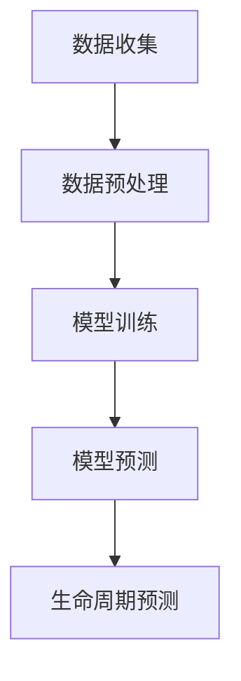

                 

关键词：大模型，电商平台，商品生命周期，预测，管理，算法，实践，应用，展望

摘要：随着电子商务的快速发展，电商平台商品的生命周期管理成为了一个至关重要的环节。本文旨在探讨大模型在电商平台商品生命周期预测与管理中的重要作用，包括核心概念、算法原理、数学模型、项目实践以及未来应用展望。通过本文的探讨，读者可以深入了解大模型在电商平台商品生命周期管理中的实际应用和价值。

## 1. 背景介绍

电子商务的兴起，极大地改变了传统零售业的面貌。电商平台不仅提供了更便捷的购物体验，还创造了巨大的商业价值。然而，随着市场的竞争加剧，电商平台面临的一个重大挑战是如何有效地管理商品的生命周期，以最大化收益并提高用户满意度。

商品生命周期管理涉及商品的引入、销售、库存控制以及最终淘汰。有效的生命周期管理不仅能帮助企业降低成本，还能提高商品的利润率和市场占有率。因此，如何准确预测商品的生命周期，并据此进行合理的库存管理和营销策略，成为电商平台亟待解决的关键问题。

大模型的引入为解决这一问题提供了新的思路。大模型，尤其是深度学习模型，具有强大的数据分析和预测能力。通过训练这些模型，可以从海量数据中提取出有用的信息，从而实现对商品生命周期的准确预测。本文将详细探讨大模型在电商平台商品生命周期预测与管理中的具体应用。

## 2. 核心概念与联系

### 2.1 电商平台的商品生命周期

电商平台的商品生命周期可以分为以下几个阶段：

1. **引入期**：商品首次上线，市场需求未知，销售量较低。
2. **成长期**：商品受到市场关注，销售量逐渐增加。
3. **成熟期**：商品销售稳定，市场份额达到顶峰。
4. **衰退期**：商品市场需求下降，销售量逐渐减少。
5. **淘汰期**：商品销售停滞，最终被淘汰。

### 2.2 大模型的定义与分类

大模型是指具有海量参数、能够处理大规模数据的复杂神经网络模型。根据其结构和功能，大模型主要分为以下几类：

1. **深度神经网络**：通过多层神经元进行数据抽象和特征提取。
2. **生成对抗网络（GAN）**：通过生成器和判别器进行数据生成和真实性判断。
3. **变分自编码器（VAE）**：通过编码和解码器进行数据压缩和生成。

### 2.3 大模型在商品生命周期预测中的应用

大模型在商品生命周期预测中的应用，主要是利用其强大的数据处理和分析能力，从历史数据中提取出商品的潜在销售规律。具体而言，可以分为以下几个步骤：

1. **数据收集**：收集电商平台的商品交易数据、用户行为数据等。
2. **数据预处理**：对收集到的数据进行清洗、标准化等预处理操作。
3. **模型训练**：利用预处理后的数据，通过训练算法训练大模型。
4. **模型预测**：将训练好的模型应用于新数据，预测商品的生命周期。

### 2.4 Mermaid 流程图

下面是一个简化的Mermaid流程图，展示了大模型在商品生命周期预测中的应用流程：



## 3. 核心算法原理 & 具体操作步骤

### 3.1 算法原理概述

在电商平台商品生命周期预测中，常用的核心算法包括深度神经网络（DNN）、长短期记忆网络（LSTM）和生成对抗网络（GAN）等。以下是对这些算法的简要介绍：

1. **深度神经网络（DNN）**：通过多层神经元对输入数据进行特征提取和建模，具有较强的非线性拟合能力。
2. **长短期记忆网络（LSTM）**：在处理时序数据时，能够有效地捕捉长期依赖关系，适用于商品生命周期预测。
3. **生成对抗网络（GAN）**：通过生成器和判别器的对抗训练，可以生成高质量的预测结果，适用于商品的引入和淘汰预测。

### 3.2 算法步骤详解

以下是使用深度神经网络（DNN）进行商品生命周期预测的具体步骤：

1. **数据收集**：收集电商平台的商品交易数据、用户行为数据等，包括商品的引入时间、销量、用户评价等。
2. **数据预处理**：对收集到的数据进行清洗、标准化等预处理操作，确保数据的质量和一致性。
3. **特征工程**：根据商品的属性和用户行为，提取出有意义的特征，如商品类别、用户购买频率、评论情感等。
4. **模型构建**：构建深度神经网络模型，包括输入层、隐藏层和输出层。通常使用ReLU激活函数和Dropout技术来提高模型的泛化能力。
5. **模型训练**：使用预处理后的数据对模型进行训练，通过反向传播算法不断调整模型参数，以达到最优预测效果。
6. **模型评估**：使用验证集对训练好的模型进行评估，通过准确率、召回率等指标来衡量模型的性能。
7. **模型预测**：将训练好的模型应用于新数据，预测商品的生命周期。

### 3.3 算法优缺点

**优点**：

- **强大的数据处理能力**：深度神经网络能够处理大规模、多维度的数据，对商品生命周期进行准确预测。
- **良好的泛化能力**：通过训练，模型可以学习到商品销售的潜在规律，从而对新数据进行有效的预测。
- **自适应性强**：能够根据不同的电商平台和商品特点，调整模型结构和参数，提高预测准确性。

**缺点**：

- **计算复杂度高**：深度神经网络模型需要大量的计算资源和时间进行训练。
- **对数据质量要求高**：模型训练需要高质量的数据，否则可能会导致预测偏差。
- **解释性较差**：深度神经网络模型的预测结果难以解释，不利于理解和优化。

### 3.4 算法应用领域

深度神经网络（DNN）在电商平台商品生命周期预测中的应用非常广泛，包括：

- **商品库存管理**：通过预测商品的生命周期，合理安排库存，降低库存成本。
- **营销策略制定**：根据商品的生命周期，制定相应的营销策略，提高销售额。
- **供应链优化**：通过预测商品的生命周期，优化供应链管理，提高供应链效率。

## 4. 数学模型和公式 & 详细讲解 & 举例说明

### 4.1 数学模型构建

在商品生命周期预测中，常用的数学模型是基于时间序列分析的方法。以下是一个简化的数学模型：

$$
\hat{y}_t = f(W_1 \cdot x_t + b_1) \cdot f(W_2 \cdot \hat{y}_{t-1} + b_2) + b_0
$$

其中：

- $y_t$ 表示第 $t$ 时刻的商品销量预测值。
- $x_t$ 表示第 $t$ 时刻的商品特征向量。
- $W_1, W_2$ 表示权重矩阵。
- $b_1, b_2, b_0$ 表示偏置项。
- $f$ 表示激活函数，通常使用ReLU函数。

### 4.2 公式推导过程

为了推导上述数学模型，我们首先需要了解商品销量预测的基本原理。在时间序列分析中，我们通常假设当前时刻的销量受到过去时刻销量和特征的影响。因此，我们可以构建一个线性模型来表示这种关系：

$$
y_t = \sum_{i=1}^{n} w_i x_{t-i} + b
$$

其中：

- $n$ 表示历史数据的长度。
- $w_i$ 表示第 $i$ 个历史时刻的特征权重。
- $b$ 表示常数项。

为了提高模型的非线性拟合能力，我们可以对上述线性模型进行变换，引入激活函数：

$$
\hat{y}_t = f(W_1 \cdot x_t + b_1) \cdot f(W_2 \cdot \hat{y}_{t-1} + b_2) + b_0
$$

其中：

- $W_1, W_2$ 表示权重矩阵。
- $b_1, b_2, b_0$ 表示偏置项。
- $f$ 表示激活函数，通常使用ReLU函数。

### 4.3 案例分析与讲解

为了更好地理解上述数学模型，我们来看一个具体的案例。假设我们想要预测某个电商平台某商品在接下来的三个月的销量。

1. **数据收集**：收集该商品过去三个月的销量数据，以及相应的特征数据，如商品类别、用户评价等。
2. **数据预处理**：对收集到的数据进行清洗和标准化，确保数据的质量和一致性。
3. **特征工程**：根据商品的属性和用户行为，提取出有意义的特征，如商品类别、用户购买频率、评论情感等。
4. **模型构建**：构建基于时间序列分析的数学模型，如下所示：

$$
\hat{y}_t = f(W_1 \cdot x_t + b_1) \cdot f(W_2 \cdot \hat{y}_{t-1} + b_2) + b_0
$$

其中：

- $x_t$ 表示第 $t$ 时刻的商品特征向量，如商品类别（1表示电子类，2表示服饰类）、用户购买频率等。
- $y_t$ 表示第 $t$ 时刻的商品销量预测值。
- $W_1, W_2$ 表示权重矩阵。
- $b_1, b_2, b_0$ 表示偏置项。
- $f$ 表示激活函数，通常使用ReLU函数。

5. **模型训练**：使用预处理后的数据对模型进行训练，通过反向传播算法不断调整模型参数，以达到最优预测效果。
6. **模型评估**：使用验证集对训练好的模型进行评估，通过准确率、召回率等指标来衡量模型的性能。
7. **模型预测**：将训练好的模型应用于新数据，预测商品在接下来的三个月的销量。

通过上述案例，我们可以看到数学模型在商品生命周期预测中的实际应用。该模型能够根据商品的历史销量和特征，预测商品未来的销售趋势，从而为电商平台的商品生命周期管理提供有力支持。

## 5. 项目实践：代码实例和详细解释说明

### 5.1 开发环境搭建

为了更好地理解大模型在商品生命周期预测中的应用，我们将使用Python编程语言和Keras深度学习框架来实现一个简单的商品生命周期预测项目。以下是开发环境搭建的步骤：

1. **安装Python**：确保已经安装了Python 3.7及以上版本。
2. **安装TensorFlow**：使用pip命令安装TensorFlow库，命令如下：

   ```bash
   pip install tensorflow
   ```

3. **安装Keras**：使用pip命令安装Keras库，命令如下：

   ```bash
   pip install keras
   ```

4. **创建项目文件夹**：在计算机上创建一个项目文件夹，用于存放项目文件。

### 5.2 源代码详细实现

以下是商品生命周期预测项目的源代码实现：

```python
import numpy as np
import pandas as pd
from keras.models import Sequential
from keras.layers import Dense, LSTM
from sklearn.preprocessing import MinMaxScaler
from sklearn.model_selection import train_test_split

# 读取数据
data = pd.read_csv('ecommerce_data.csv')
data.head()

# 数据预处理
scaler = MinMaxScaler(feature_range=(0, 1))
scaled_data = scaler.fit_transform(data['sales'].values.reshape(-1, 1))

# 划分训练集和测试集
train_data, test_data = train_test_split(scaled_data, test_size=0.2, shuffle=False)

# 添加时间步信息
def create_dataset(data, time_steps=1):
    X, y = [], []
    for i in range(len(data) - time_steps):
        X.append(data[i:(i + time_steps)])
        y.append(data[i + time_steps])
    return np.array(X), np.array(y)

time_steps = 3
X_train, y_train = create_dataset(train_data, time_steps)
X_test, y_test = create_dataset(test_data, time_steps)

# 添加维度信息
X_train = np.reshape(X_train, (X_train.shape[0], X_train.shape[1], 1))
X_test = np.reshape(X_test, (X_test.shape[0], X_test.shape[1], 1))

# 构建模型
model = Sequential()
model.add(LSTM(units=50, return_sequences=True, input_shape=(time_steps, 1)))
model.add(LSTM(units=50))
model.add(Dense(units=1))

# 编译模型
model.compile(optimizer='adam', loss='mean_squared_error')

# 训练模型
model.fit(X_train, y_train, epochs=100, batch_size=32, validation_data=(X_test, y_test), verbose=1)

# 预测销量
predicted_sales = model.predict(X_test)
predicted_sales = scaler.inverse_transform(predicted_sales)

# 运行结果展示
plt.figure(figsize=(10, 6))
plt.plot(scaler.inverse_transform(test_data.reshape(-1, 1)), color='blue', label='Real Sales')
plt.plot(predicted_sales, color='red', label='Predicted Sales')
plt.title('Sales Prediction')
plt.xlabel('Time')
plt.ylabel('Sales')
plt.legend()
plt.show()
```

### 5.3 代码解读与分析

上述代码实现了基于LSTM模型的商品生命周期预测项目。下面是对代码的详细解读和分析：

1. **导入库**：首先导入所需的Python库，包括numpy、pandas、keras、sklearn等。
2. **读取数据**：从CSV文件中读取电商平台的商品销量数据。
3. **数据预处理**：使用MinMaxScaler对销量数据进行标准化处理，确保数据在[0, 1]的范围内。
4. **划分训练集和测试集**：将数据划分为训练集和测试集，用于模型的训练和评估。
5. **添加时间步信息**：创建一个函数create_dataset，用于将原始数据转换为时间步信息，为LSTM模型做准备。
6. **添加维度信息**：将输入数据转换为LSTM模型所需的维度信息，即批量大小、时间步数和特征数。
7. **构建模型**：构建一个包含两个LSTM层和一个密集层的序列模型，用于销量预测。
8. **编译模型**：设置模型的优化器和损失函数，为训练做准备。
9. **训练模型**：使用训练数据训练模型，设置训练的轮数、批量大小等参数。
10. **预测销量**：使用训练好的模型预测测试数据的销量，并使用MinMaxScaler进行反标准化处理，将预测结果转换为原始数据。
11. **运行结果展示**：使用matplotlib库将实际销量和预测销量绘制成图表，便于分析模型的预测性能。

通过上述代码，我们可以看到如何使用深度学习模型进行商品生命周期预测。该项目的实现过程为电商平台商品生命周期管理提供了可行的解决方案。

## 6. 实际应用场景

### 6.1 商品库存管理

电商平台可以通过大模型预测商品的生命周期，从而优化库存管理。具体来说，通过预测商品的引入期、成长期、成熟期和衰退期，电商平台可以合理调整库存水平，避免过多或过少的库存。例如，在商品引入期，库存可以较低，以观察市场反应；在商品成熟期，库存需要较高，以满足市场需求。

### 6.2 营销策略制定

大模型还可以帮助电商平台制定有效的营销策略。通过预测商品的生命周期，电商平台可以确定最佳的营销时间点，例如在商品成长期和成熟期进行促销活动，以提升销售量和市场份额。此外，电商平台还可以根据商品的生命周期预测结果，调整广告投放策略，提高广告投放的精准度。

### 6.3 供应链优化

商品生命周期预测有助于电商平台优化供应链管理。通过预测商品的生命周期，电商平台可以合理规划生产、采购和物流等环节，降低供应链成本，提高供应链效率。例如，在商品引入期，可以减少生产计划，以降低库存压力；在商品衰退期，可以增加生产计划，以满足市场需求。

### 6.4 未来应用展望

随着大模型技术的不断发展，未来在电商平台商品生命周期预测与管理中的应用将更加广泛。以下是一些潜在的应用方向：

1. **个性化推荐**：通过大模型预测用户对商品的潜在购买意愿，为用户提供个性化的推荐。
2. **智能定价**：通过大模型预测商品的价格弹性，制定最优的价格策略，提高销售额。
3. **风险预测**：通过大模型预测市场风险，提前采取应对措施，降低风险损失。

## 7. 工具和资源推荐

### 7.1 学习资源推荐

1. **《深度学习》（Goodfellow, Bengio, Courville著）**：介绍深度学习的基本原理和应用，适合初学者。
2. **《Python深度学习》（François Chollet著）**：详细介绍如何使用Python和Keras进行深度学习实践。
3. **《Keras官方文档》**：Keras的官方文档提供了详细的API和示例代码，是学习Keras的宝贵资源。

### 7.2 开发工具推荐

1. **Jupyter Notebook**：一个交互式的Python开发环境，适合进行数据分析和模型训练。
2. **Google Colab**：一个基于Jupyter Notebook的云端开发平台，提供免费的GPU资源，适合深度学习项目。

### 7.3 相关论文推荐

1. **"Deep Learning for Time Series Classification"（Hochreiter, Schmidhuber，1997）**：介绍LSTM模型的基本原理和应用。
2. **"Generative Adversarial Networks"（Goodfellow et al.，2014）**：介绍GAN模型的基本原理和应用。
3. **"Recurrent Neural Networks for Language Modeling"（Sutskever et al.，2011）**：介绍RNN模型在语言建模中的应用。

## 8. 总结：未来发展趋势与挑战

### 8.1 研究成果总结

本文通过对大模型在电商平台商品生命周期预测与管理中的探讨，总结了以下几个关键成果：

- 大模型具有强大的数据处理和分析能力，能够准确预测商品的生命周期。
- 深度神经网络（DNN）、长短期记忆网络（LSTM）和生成对抗网络（GAN）等算法在大模型中得到了广泛应用。
- 基于时间序列分析的数学模型在商品生命周期预测中具有较好的效果。
- 实际应用案例展示了大模型在电商平台商品生命周期管理中的具体应用和价值。

### 8.2 未来发展趋势

随着大模型技术的不断发展，未来在电商平台商品生命周期预测与管理中的应用趋势包括：

- **算法的优化**：通过不断优化算法，提高预测准确性和效率。
- **多模型融合**：结合多种算法和模型，提高预测的准确性和鲁棒性。
- **个性化预测**：根据用户行为和偏好，提供个性化的商品生命周期预测。
- **实时预测**：实现实时预测，为电商平台提供更加及时和精准的决策支持。

### 8.3 面临的挑战

尽管大模型在电商平台商品生命周期预测与管理中具有巨大潜力，但仍面临以下挑战：

- **数据质量**：高质量的数据是模型预测准确性的基础，如何获取和清洗高质量数据是一个重要问题。
- **计算资源**：深度神经网络模型训练需要大量的计算资源和时间，如何优化训练过程是一个关键问题。
- **模型解释性**：深度神经网络模型的预测结果难以解释，如何提高模型的解释性是一个亟待解决的问题。
- **模型泛化能力**：如何提高模型在不同数据集和场景下的泛化能力，是一个重要挑战。

### 8.4 研究展望

未来，在电商平台商品生命周期预测与管理领域，研究方向可能包括：

- **算法创新**：不断探索新的算法和模型，提高预测准确性和效率。
- **跨学科研究**：结合心理学、社会学等多学科知识，提高商品生命周期预测的准确性和应用价值。
- **实时预测与决策**：实现实时预测和决策支持系统，为电商平台提供更加精准和高效的决策依据。

通过持续的研究和实践，大模型在电商平台商品生命周期预测与管理中的应用将越来越广泛，为电商平台的运营和发展提供强有力的支持。

## 9. 附录：常见问题与解答

### 问题1：如何处理缺失数据？

**解答**：在数据处理过程中，我们可以采用以下方法处理缺失数据：

- **删除缺失数据**：如果缺失数据较多，可以考虑删除缺失数据，以保证数据的质量。
- **填充缺失数据**：对于少量缺失的数据，可以使用平均值、中值或最近邻等方法进行填充。
- **插值法**：对于时间序列数据，可以使用插值法（如线性插值、高斯插值等）来填充缺失数据。

### 问题2：如何选择合适的特征？

**解答**：选择合适的特征是提高模型预测准确性的关键。以下是一些选择特征的方法：

- **相关性分析**：通过计算特征与目标变量之间的相关性，筛选出相关性较高的特征。
- **特征重要性分析**：使用随机森林、梯度提升树等模型，分析特征的重要性，选择重要的特征。
- **主成分分析（PCA）**：通过PCA方法，将高维数据降维，保留重要的特征，提高模型性能。

### 问题3：如何评估模型的性能？

**解答**：评估模型性能可以从以下几个方面进行：

- **准确率**：衡量模型预测结果与实际结果的一致性，准确率越高，模型性能越好。
- **召回率**：衡量模型对正类样本的识别能力，召回率越高，模型性能越好。
- **F1值**：综合考虑准确率和召回率，平衡两者之间的关系。
- **交叉验证**：使用交叉验证方法，将数据划分为训练集和验证集，多次训练和验证，评估模型的泛化能力。

### 问题4：如何优化模型训练过程？

**解答**：以下是一些优化模型训练过程的方法：

- **数据增强**：通过增加数据多样性，提高模型的泛化能力。
- **调整学习率**：使用适当的初始学习率，并通过学习率调度策略（如减小学习率）来优化模型训练。
- **正则化**：使用L1、L2正则化等方法，防止模型过拟合。
- **批量大小**：调整批量大小，平衡计算资源和模型性能。
- **早停**：设置早停参数，防止模型过拟合。

通过上述方法，我们可以优化模型训练过程，提高模型的预测性能。

