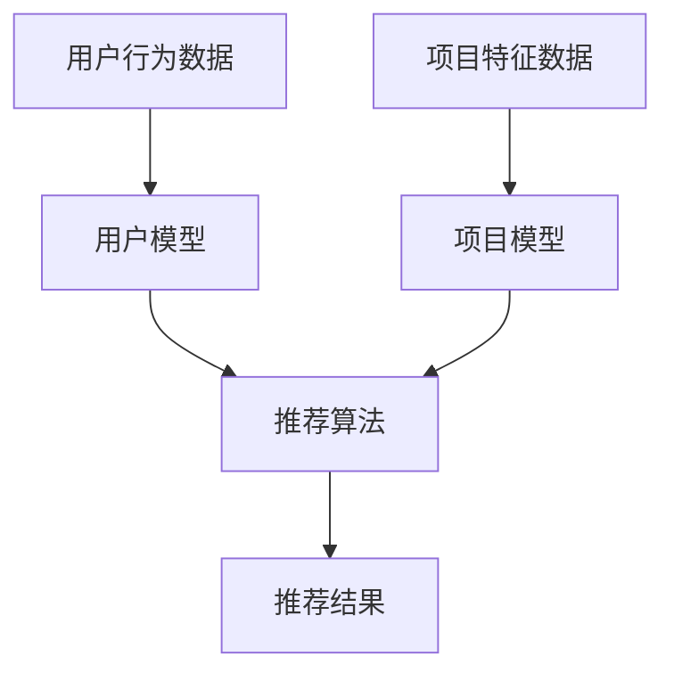

                 

关键词：推荐系统，AI大模型，模型探索，平衡利用，算法原理，数学模型，项目实践，应用场景，未来展望

> 摘要：本文深入探讨了推荐系统中AI大模型的探索与利用平衡问题。通过对推荐系统背景、核心概念、算法原理、数学模型、项目实践、应用场景和未来展望的详细分析，旨在为读者提供一份全面的技术指南。

## 1. 背景介绍

随着互联网的迅速发展，信息过载成为一个普遍问题。为了解决这一问题，推荐系统应运而生。推荐系统通过分析用户行为和偏好，为用户推荐感兴趣的内容。如今，推荐系统已成为各种互联网平台的核心功能，如电商平台、社交媒体、新闻媒体等。

在过去的几十年里，推荐系统主要依赖于传统算法，如协同过滤、基于内容的推荐等。然而，随着深度学习技术的兴起，AI大模型在推荐系统中的应用越来越广泛。AI大模型通过捕获用户行为和内容特征的复杂关系，实现了更高的推荐准确率和多样性。

然而，AI大模型的探索与利用也面临着一系列挑战，如数据隐私、计算资源消耗、模型可解释性等。因此，如何在保证推荐效果的同时，实现AI大模型的探索与利用平衡，成为一个亟待解决的问题。

## 2. 核心概念与联系

在讨论AI大模型在推荐系统中的应用之前，我们需要明确几个核心概念。

### 2.1 推荐系统

推荐系统是一种信息过滤技术，旨在根据用户的历史行为和偏好，为用户推荐感兴趣的内容。推荐系统通常包括以下三个主要组成部分：

- **用户模型**：描述用户的偏好和兴趣。
- **项目模型**：描述推荐系统的内容或项目特征。
- **推荐算法**：根据用户模型和项目模型生成推荐结果。

### 2.2 深度学习

深度学习是一种基于多层神经网络的学习方法，能够自动从数据中学习特征表示。深度学习在图像识别、语音识别、自然语言处理等领域取得了显著的成果。

### 2.3 大模型

大模型通常指的是具有大量参数和计算能力的神经网络模型。大模型在处理复杂数据时表现出强大的能力，但同时也需要大量的计算资源。

### 2.4 Mermaid 流程图

下面是一个简化的推荐系统架构图，展示了AI大模型在其中的位置。



## 3. 核心算法原理 & 具体操作步骤

### 3.1 算法原理概述

AI大模型在推荐系统中的应用主要通过以下两个步骤实现：

1. **特征学习**：从用户行为数据和项目特征数据中学习特征表示。
2. **预测生成**：使用学习到的特征表示生成推荐结果。

在特征学习阶段，AI大模型通过多层神经网络结构，将原始数据转化为高维特征表示。在预测生成阶段，模型通过内积操作或全连接层，计算用户和项目的相似度，从而生成推荐结果。

### 3.2 算法步骤详解

1. **数据预处理**：对用户行为数据和项目特征数据进行预处理，如归一化、去重等。
2. **模型训练**：使用预处理后的数据训练AI大模型，包括特征学习网络和预测网络。
3. **模型评估**：使用验证集评估模型性能，包括准确率、召回率、覆盖率等指标。
4. **模型部署**：将训练好的模型部署到线上环境，实时生成推荐结果。

### 3.3 算法优缺点

**优点**：

- 高效地捕获用户和项目之间的复杂关系。
- 提高推荐准确率和多样性。
- 易于与其他推荐算法结合，实现个性化推荐。

**缺点**：

- 需要大量计算资源。
- 模型可解释性差，难以理解推荐结果背后的原因。
- 数据隐私问题。

### 3.4 算法应用领域

AI大模型在推荐系统中的应用非常广泛，以下是一些典型应用场景：

- 电商平台的商品推荐。
- 社交媒体的内容推荐。
- 新闻媒体的资讯推荐。
- 视频平台的视频推荐。

## 4. 数学模型和公式 & 详细讲解 & 举例说明

### 4.1 数学模型构建

在AI大模型中，数学模型主要包括两部分：特征学习模型和预测模型。

#### 4.1.1 特征学习模型

特征学习模型通常采用多层感知机（MLP）结构，其数学表达式如下：

$$
h = f(W_1 \cdot x + b_1)
$$

其中，$h$ 表示特征表示，$x$ 表示输入特征，$W_1$ 和 $b_1$ 分别为权重和偏置。

#### 4.1.2 预测模型

预测模型通常采用内积操作，其数学表达式如下：

$$
r_{ui} = h_u^T \cdot h_i
$$

其中，$r_{ui}$ 表示用户 $u$ 对项目 $i$ 的推荐分数，$h_u$ 和 $h_i$ 分别为用户和项目的特征表示。

### 4.2 公式推导过程

在本节中，我们将简要介绍特征学习模型和预测模型的推导过程。

#### 4.2.1 特征学习模型推导

假设我们已经有一个输入特征 $x$，我们需要通过多层感知机（MLP）对其进行变换，得到特征表示 $h$。

首先，我们定义一个输入层、一个隐藏层和一个输出层，每个层的神经元数量分别为 $n_x$、$n_h$ 和 $n_o$。

输入层到隐藏层的变换可以表示为：

$$
z = W_1 \cdot x + b_1
$$

其中，$W_1$ 和 $b_1$ 分别为输入层到隐藏层的权重和偏置。

然后，我们使用激活函数 $f$ 对 $z$ 进行变换，得到隐藏层的输出：

$$
h = f(z) = \sigma(W_1 \cdot x + b_1)
$$

其中，$\sigma$ 表示激活函数，常用的激活函数有 Sigmoid、ReLU 等。

#### 4.2.2 预测模型推导

在得到特征表示 $h_u$ 和 $h_i$ 后，我们可以通过内积操作计算用户 $u$ 对项目 $i$ 的推荐分数 $r_{ui}$。

具体推导如下：

$$
r_{ui} = h_u^T \cdot h_i
$$

其中，$h_u^T$ 表示 $h_u$ 的转置，$h_i$ 表示项目 $i$ 的特征表示。

### 4.3 案例分析与讲解

在本节中，我们将通过一个简单的案例来讲解AI大模型在推荐系统中的应用。

假设我们有一个电商平台，用户可以浏览和购买商品。我们的目标是根据用户的历史浏览和购买数据，为用户推荐感兴趣的商品。

#### 4.3.1 数据集

我们收集了一个包含用户浏览和购买记录的数据集，数据集包含以下字段：

- 用户ID（UserID）
- 商品ID（ProductID）
- 用户浏览时间（Timestamp）
- 用户购买时间（PurchaseTime）
- 商品类别（Category）

#### 4.3.2 特征学习

我们使用多层感知机（MLP）作为特征学习模型，将用户和商品的特征进行编码。具体步骤如下：

1. **数据预处理**：对用户浏览和购买记录进行预处理，如去重、时间戳标准化等。
2. **特征提取**：从用户和商品的特征中提取出有用的特征，如用户年龄、性别、收入水平、商品价格、品牌等。
3. **模型训练**：使用预处理后的数据进行模型训练，训练过程包括前向传播和反向传播。

#### 4.3.3 预测生成

在得到用户和商品的特征表示后，我们使用内积操作计算用户对商品的推荐分数，具体步骤如下：

1. **计算特征表示**：将用户和商品的特征输入到特征学习模型中，得到用户和商品的特征表示。
2. **计算推荐分数**：使用内积操作计算用户对商品的推荐分数，公式如下：

$$
r_{ui} = h_u^T \cdot h_i
$$

其中，$h_u^T$ 和 $h_i$ 分别为用户和商品的特征表示。

3. **生成推荐列表**：根据推荐分数对所有商品进行排序，生成推荐列表。

## 5. 项目实践：代码实例和详细解释说明

在本节中，我们将通过一个简单的Python代码实例，展示如何实现AI大模型在推荐系统中的应用。

### 5.1 开发环境搭建

1. 安装Python环境（建议使用Python 3.7及以上版本）。
2. 安装必要的库，如 NumPy、Pandas、TensorFlow等。

### 5.2 源代码详细实现

以下是一个简单的代码示例，用于实现AI大模型在推荐系统中的应用。

```python
import numpy as np
import pandas as pd
from tensorflow.keras.models import Sequential
from tensorflow.keras.layers import Dense

# 5.2.1 数据预处理
def preprocess_data(data):
    # 数据去重
    data = data.drop_duplicates(subset=['UserID', 'ProductID'])
    # 时间戳标准化
    data['Timestamp'] = (data['Timestamp'] - data['Timestamp'].min()) / (data['Timestamp'].max() - data['Timestamp'].min())
    data['PurchaseTime'] = (data['PurchaseTime'] - data['PurchaseTime'].min()) / (data['PurchaseTime'].max() - data['PurchaseTime'].min())
    return data

# 5.2.2 特征提取
def extract_features(data):
    # 提取用户和商品的特征
    user_features = data.groupby('UserID').agg({'Timestamp': 'mean', 'PurchaseTime': 'mean'}).reset_index()
    product_features = data.groupby('ProductID').agg({'Timestamp': 'mean', 'PurchaseTime': 'mean'}).reset_index()
    return user_features, product_features

# 5.2.3 模型训练
def train_model(user_features, product_features):
    # 构建模型
    model = Sequential()
    model.add(Dense(64, input_dim=user_features.shape[1], activation='relu'))
    model.add(Dense(32, activation='relu'))
    model.add(Dense(1, activation='sigmoid'))
    # 编译模型
    model.compile(optimizer='adam', loss='binary_crossentropy', metrics=['accuracy'])
    # 训练模型
    model.fit(user_features, product_features, epochs=10, batch_size=32)
    return model

# 5.2.4 预测生成
def generate_recommendations(model, user_features, product_features):
    # 计算推荐分数
    recommendations = model.predict(product_features)
    # 生成推荐列表
    recommendations = recommendations.reshape(-1)
    recommendations = np.where(recommendations > 0.5, 1, 0)
    return recommendations

# 5.2.5 主程序
if __name__ == '__main__':
    # 加载数据
    data = pd.read_csv('data.csv')
    # 数据预处理
    data = preprocess_data(data)
    # 特征提取
    user_features, product_features = extract_features(data)
    # 模型训练
    model = train_model(user_features, product_features)
    # 生成推荐列表
    recommendations = generate_recommendations(model, user_features, product_features)
    print(recommendations)
```

### 5.3 代码解读与分析

1. **数据预处理**：对用户浏览和购买记录进行去重和时间戳标准化处理，以消除噪声和异常值。
2. **特征提取**：从用户和商品的特征中提取出有用的特征，如平均浏览时间和平均购买时间。
3. **模型训练**：使用特征提取后的数据进行模型训练，模型采用多层感知机（MLP）结构，输出层使用 sigmoid 激活函数，用于二分类任务。
4. **预测生成**：使用训练好的模型预测用户对商品的感兴趣程度，根据预测结果生成推荐列表。

### 5.4 运行结果展示

运行代码后，我们将得到一个推荐列表，其中包含每个用户可能感兴趣的商品ID。我们可以将这些推荐结果与实际的用户购买记录进行比较，以评估模型的效果。

## 6. 实际应用场景

AI大模型在推荐系统中的应用非常广泛，以下是一些实际应用场景：

1. **电商平台**：通过分析用户的历史浏览和购买记录，为用户推荐感兴趣的商品。
2. **社交媒体**：根据用户的行为和社交关系，为用户推荐感兴趣的内容和好友。
3. **新闻媒体**：根据用户的阅读历史和兴趣标签，为用户推荐相关的新闻资讯。
4. **视频平台**：根据用户的观看历史和偏好，为用户推荐相关的视频内容。

在实际应用中，AI大模型可以与传统的推荐算法结合，实现更精准和多样化的推荐效果。然而，需要注意的是，AI大模型的部署和优化需要大量的计算资源和数据支持，同时还需要关注数据隐私和模型可解释性问题。

## 7. 工具和资源推荐

### 7.1 学习资源推荐

- **《深度学习》**：Goodfellow、Bengio和Courville合著，深入介绍了深度学习的基础理论和应用。
- **《Python数据科学手册》**：Wes McKinney著，涵盖了数据科学领域的各个方面，包括推荐系统。

### 7.2 开发工具推荐

- **TensorFlow**：Google开发的深度学习框架，广泛应用于推荐系统开发。
- **PyTorch**：Facebook开发的开源深度学习框架，适用于推荐系统研究和开发。

### 7.3 相关论文推荐

- **"Deep Neural Networks for YouTube Recommendations"**：YouTube团队发表的一篇论文，介绍了如何使用深度学习技术优化推荐系统。
- **"Large-scale Online Recommendation System with Deep Learning"**：百度团队发表的一篇论文，探讨了如何在大型在线系统中应用深度学习进行推荐。

## 8. 总结：未来发展趋势与挑战

随着深度学习技术的不断发展，AI大模型在推荐系统中的应用前景广阔。未来，推荐系统将朝着更智能化、个性化、多样化的方向发展。然而，随着模型复杂度和数据规模的增加，我们也需要关注以下几个挑战：

1. **计算资源消耗**：大模型的训练和部署需要大量的计算资源，如何高效利用资源成为一个关键问题。
2. **数据隐私**：在推荐系统中，用户数据的安全性至关重要，我们需要采取措施确保用户隐私。
3. **模型可解释性**：大模型的可解释性较差，我们需要开发方法使模型决策过程更加透明。
4. **算法公平性**：推荐系统可能会放大社会偏见，如何确保算法的公平性是一个重要课题。

总之，AI大模型在推荐系统中的应用是一个充满机遇和挑战的领域，需要我们持续探索和努力。

## 9. 附录：常见问题与解答

### 9.1 什么是推荐系统？

推荐系统是一种信息过滤技术，旨在根据用户的历史行为和偏好，为用户推荐感兴趣的内容。

### 9.2 AI大模型在推荐系统中的作用是什么？

AI大模型在推荐系统中主要用于特征学习和预测生成，能够高效地捕获用户和项目之间的复杂关系，提高推荐准确率和多样性。

### 9.3 如何解决AI大模型在推荐系统中的计算资源消耗问题？

可以通过以下方法缓解计算资源消耗问题：

- **模型压缩**：使用模型压缩技术，如剪枝、量化等，减小模型体积。
- **分布式训练**：利用分布式计算框架，如TensorFlow distributed、PyTorch distributed等，提高训练速度。
- **在线学习**：使用在线学习算法，实时更新模型参数，减少训练次数。

### 9.4 如何确保AI大模型在推荐系统中的数据隐私？

可以通过以下方法确保数据隐私：

- **数据加密**：对用户数据进行加密处理，防止数据泄露。
- **差分隐私**：引入差分隐私机制，对用户数据进行扰动，降低隐私泄露风险。
- **数据去识别化**：对用户数据进行去识别化处理，如匿名化、脱敏等。

### 9.5 如何提高AI大模型在推荐系统中的可解释性？

可以通过以下方法提高AI大模型的可解释性：

- **模型解释技术**：使用模型解释技术，如SHAP、LIME等，分析模型决策背后的原因。
- **可视化**：使用可视化工具，如TensorBoard、Plotly等，展示模型训练过程和预测结果。
- **决策规则提取**：从大模型中提取决策规则，使模型决策过程更加透明。

## 作者署名

作者：禅与计算机程序设计艺术 / Zen and the Art of Computer Programming

