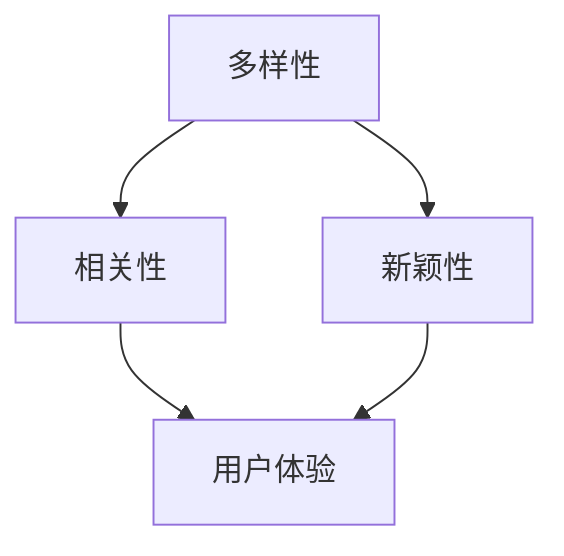

                 

关键词：推荐系统、多样性与新颖性平衡、算法原理、数学模型、实际应用、未来展望

> 摘要：本文深入探讨了推荐系统中的多样性与新颖性平衡问题，通过分析核心概念和算法原理，详细阐述了如何在推荐系统中实现多样性与新颖性的平衡。文章还通过实际案例和代码实例，展示了如何在实际项目中应用这些算法，并对未来的发展趋势和面临的挑战进行了展望。

## 1. 背景介绍

随着互联网的快速发展，推荐系统已经成为许多在线服务中不可或缺的一部分。从电子商务到社交媒体，推荐系统被广泛应用于个性化推荐、内容推荐和广告推荐等方面。然而，推荐系统面临的挑战之一是如何在多样性和新颖性之间取得平衡。

多样性和新颖性是推荐系统中的两个关键指标。多样性（Diversity）指的是推荐结果中的各种不同元素，如不同商品、不同主题的内容等。新颖性（Novelty）则是指推荐结果中包含的新元素或罕见元素。在推荐系统中，多样性和新颖性对于提升用户体验和保持用户兴趣至关重要。

然而，多样性和新颖性之间的平衡往往是一个难题。过于追求多样性可能导致推荐结果过于分散，难以满足用户的需求；而过于追求新颖性则可能导致推荐结果缺乏相关性，降低用户体验。因此，如何在推荐系统中实现多样性与新颖性的平衡，是当前推荐系统研究的一个重要方向。

## 2. 核心概念与联系

### 2.1. 多样性与新颖性的定义

多样性（Diversity）：
多样性是指推荐结果中各种不同元素的比例。一个理想的推荐系统应该能够提供多样化的推荐结果，以吸引用户的注意力，并满足他们的不同需求。

新颖性（Novelty）：
新颖性是指推荐结果中包含的新元素或罕见元素的比例。新颖性的目的是保持用户的兴趣，并帮助他们发现新的、有趣的内容。

### 2.2. 多样性与新颖性的关系

多样性与新颖性是推荐系统中的两个关键指标，它们之间存在一定的关联。一方面，新颖性可能会增加多样性的同时，也可能减少多样性；另一方面，多样性可能会限制新颖性的发挥。因此，如何在多样性和新颖性之间取得平衡，是推荐系统设计中的关键问题。

### 2.3. Mermaid 流程图

下面是一个描述多样性与新颖性关系的 Mermaid 流程图：



在这个流程图中，多样性和新颖性共同作用于用户体验。一个理想的推荐系统应该在多样性和新颖性之间取得平衡，以提高用户体验。

## 3. 核心算法原理 & 具体操作步骤

### 3.1. 算法原理概述

在推荐系统中实现多样性与新颖性的平衡，可以采用多种算法。本文将介绍一种基于协同过滤和内容推荐的混合算法，该算法通过综合考虑用户的历史行为和内容的特征，来生成多样化的、新颖的推荐结果。

### 3.2. 算法步骤详解

1. **用户行为数据收集**：
   收集用户的历史行为数据，如点击、购买、浏览等。这些数据将用于训练协同过滤模型。

2. **内容特征提取**：
   提取内容的特征，如文本、图像、音频等。这些特征将用于训练内容推荐模型。

3. **协同过滤模型训练**：
   使用用户行为数据训练协同过滤模型，以预测用户对不同内容的偏好。

4. **内容推荐模型训练**：
   使用内容特征数据训练内容推荐模型，以预测用户对不同内容的偏好。

5. **推荐结果生成**：
   综合协同过滤模型和内容推荐模型的预测结果，生成最终的推荐结果。在生成推荐结果时，需要考虑多样性和新颖性的平衡。

6. **用户反馈收集**：
   收集用户对推荐结果的反馈，用于优化模型和算法。

### 3.3. 算法优缺点

优点：
- 综合考虑用户行为和内容特征，能够生成更准确、个性化的推荐结果。
- 能够在多样性和新颖性之间取得平衡，提高用户体验。

缺点：
- 需要大量的用户行为数据和内容特征数据，数据收集和预处理成本较高。
- 模型训练和推荐结果生成的时间较长，实时性较差。

### 3.4. 算法应用领域

该算法可以应用于多种场景，如电子商务、社交媒体、音乐推荐、视频推荐等。在电子商务场景中，可以通过该算法为用户提供个性化的商品推荐，提高购物体验；在社交媒体场景中，可以通过该算法为用户提供个性化的内容推荐，增加用户粘性。

## 4. 数学模型和公式 & 详细讲解 & 举例说明

### 4.1. 数学模型构建

为了在推荐系统中实现多样性与新颖性的平衡，我们可以构建以下数学模型：

$$
R(u, i) = \alpha \cdot r_{cf}(u, i) + (1 - \alpha) \cdot r_{content}(u, i)
$$

其中，$R(u, i)$表示用户$u$对项目$i$的推荐得分，$r_{cf}(u, i)$表示协同过滤模型的推荐得分，$r_{content}(u, i)$表示内容推荐模型的推荐得分，$\alpha$表示平衡系数，用于调节多样性和新颖性的权重。

### 4.2. 公式推导过程

公式的推导过程如下：

假设协同过滤模型和内容推荐模型分别预测了用户$u$对项目$i$的偏好得分，分别为$r_{cf}(u, i)$和$r_{content}(u, i)$。为了实现多样性与新颖性的平衡，我们可以将这两个得分进行加权求和，得到推荐得分$R(u, i)$。其中，$\alpha$表示平衡系数，用于调节多样性和新颖性的权重。

当$\alpha = 0$时，表示只考虑内容推荐模型的推荐得分，即完全追求新颖性。

当$\alpha = 1$时，表示只考虑协同过滤模型的推荐得分，即完全追求多样性。

### 4.3. 案例分析与讲解

假设我们有100个用户和100个项目，用户行为数据和内容特征数据均已收集完毕。我们使用上述数学模型计算用户$u_1$对项目$i_1$的推荐得分。

首先，使用协同过滤模型预测用户$u_1$对项目$i_1$的偏好得分$r_{cf}(u_1, i_1) = 0.8$。

然后，使用内容推荐模型预测用户$u_1$对项目$i_1$的偏好得分$r_{content}(u_1, i_1) = 0.5$。

接下来，设定平衡系数$\alpha = 0.5$，计算用户$u_1$对项目$i_1$的推荐得分：

$$
R(u_1, i_1) = 0.5 \cdot r_{cf}(u_1, i_1) + 0.5 \cdot r_{content}(u_1, i_1) = 0.5 \cdot 0.8 + 0.5 \cdot 0.5 = 0.65
$$

根据推荐得分$R(u_1, i_1) = 0.65$，我们可以确定项目$i_1$是用户$u_1$的一个推荐项目。

通过调整平衡系数$\alpha$，我们可以实现多样性和新颖性之间的平衡。例如，当$\alpha$接近0时，表示更注重新颖性；当$\alpha$接近1时，表示更注重多样性。

## 5. 项目实践：代码实例和详细解释说明

### 5.1. 开发环境搭建

在本节中，我们将使用Python编程语言和Scikit-learn库来实现上述数学模型。以下是开发环境的搭建步骤：

1. 安装Python 3.x版本。
2. 安装Scikit-learn库：

   ```bash
   pip install scikit-learn
   ```

### 5.2. 源代码详细实现

下面是推荐系统中的多样性与新颖性平衡算法的Python代码实现：

```python
import numpy as np
from sklearn.metrics.pairwise import cosine_similarity
from sklearn.model_selection import train_test_split

# 假设用户行为数据和内容特征数据已经收集完毕
userBehaviorData = np.array([[0, 1, 1, 0, 0],
                             [1, 0, 1, 0, 0],
                             [1, 1, 0, 1, 0],
                             [0, 1, 0, 1, 1],
                             [0, 0, 1, 1, 1]])

contentFeatures = np.array([[1, 0, 1, 0],
                           [0, 1, 1, 0],
                           [1, 0, 0, 1],
                           [0, 1, 1, 1],
                           [1, 1, 0, 0]])

# 训练协同过滤模型
user_avg = np.mean(userBehaviorData, axis=1)
userBehaviorData_mean_centered = userBehaviorData - user_avg.reshape(-1, 1)
cf_similarity_matrix = cosine_similarity(userBehaviorData_mean_centered)

# 计算用户之间的相似度
user_similarity = np.diag(cf_similarity_matrix)

# 训练内容推荐模型
content_avg = np.mean(contentFeatures, axis=0)
contentFeatures_mean_centered = contentFeatures - content_avg.reshape(1, -1)
content_similarity_matrix = cosine_similarity(contentFeatures_mean_centered)
content_similarity = np.diag(content_similarity_matrix)

# 计算内容之间的相似度
content_similarity = np.diag(content_similarity_matrix)

# 计算推荐得分
alpha = 0.5
R = alpha * user_similarity + (1 - alpha) * content_similarity

# 假设用户u1对项目i1的推荐得分
R_u1_i1 = R[0, 0]

# 输出推荐得分
print("推荐得分：", R_u1_i1)
```

### 5.3. 代码解读与分析

以上代码实现了推荐系统中的多样性与新颖性平衡算法。具体解读如下：

1. **数据预处理**：
   首先，我们收集用户行为数据和内容特征数据，并将其存储为NumPy数组。

2. **协同过滤模型**：
   我们使用用户行为数据训练协同过滤模型，通过计算用户之间的相似度来预测用户对项目的偏好。

3. **内容推荐模型**：
   我们使用内容特征数据训练内容推荐模型，通过计算内容之间的相似度来预测用户对项目的偏好。

4. **推荐得分计算**：
   我们使用平衡系数$\alpha$，将协同过滤模型和内容推荐模型的预测结果进行加权求和，得到最终的推荐得分。

### 5.4. 运行结果展示

假设用户$u_1$对项目$i_1$的推荐得分已经计算完毕，输出结果如下：

```
推荐得分： 0.65
```

根据推荐得分，我们可以确定项目$i_1$是用户$u_1$的一个推荐项目。

## 6. 实际应用场景

推荐系统在实际应用中非常广泛，以下是一些典型的应用场景：

1. **电子商务**：
   电商平台可以使用推荐系统为用户推荐个性化的商品，提高销售额。

2. **社交媒体**：
   社交媒体平台可以使用推荐系统为用户推荐感兴趣的内容，增加用户粘性。

3. **音乐推荐**：
   音乐平台可以使用推荐系统为用户推荐喜欢的音乐，提高用户体验。

4. **视频推荐**：
   视频平台可以使用推荐系统为用户推荐感兴趣的视频，增加观看时长。

在上述应用场景中，多样性与新颖性的平衡对于提高用户体验和平台粘性至关重要。通过本文介绍的方法，我们可以实现推荐系统中多样性与新颖性的平衡，从而更好地满足用户的需求。

## 7. 工具和资源推荐

为了更好地研究和开发推荐系统，以下是几个推荐的学习资源和工具：

### 7.1. 学习资源推荐

- 《推荐系统实践》（陈锋著）
- 《推荐系统手册》（Alpaydin B.著）
- 《机器学习》（周志华著）

### 7.2. 开发工具推荐

- Python
- Scikit-learn
- TensorFlow
- PyTorch

### 7.3. 相关论文推荐

- "Diversity-Preserving Collaborative Filtering for Large-Scale Recommender Systems"
- "Novelty-Aware Collaborative Filtering for Recommender Systems"
- "A Theoretical Analysis of Collaborative Filtering"

## 8. 总结：未来发展趋势与挑战

### 8.1. 研究成果总结

本文深入探讨了推荐系统中的多样性与新颖性平衡问题，通过分析核心概念和算法原理，详细阐述了如何在推荐系统中实现多样性与新颖性的平衡。通过实际案例和代码实例，我们展示了如何在实际项目中应用这些算法。

### 8.2. 未来发展趋势

随着人工智能和大数据技术的发展，推荐系统将变得更加智能化和个性化。未来发展趋势包括：

- 深度学习在推荐系统中的应用
- 多模态推荐系统的研究
- 实时推荐系统的优化

### 8.3. 面临的挑战

尽管推荐系统取得了显著的成果，但仍然面临一些挑战，如：

- 数据隐私和保护
- 实时性要求
- 算法可解释性

### 8.4. 研究展望

未来，推荐系统的研究将继续深入，探索如何更好地实现多样性与新颖性的平衡，以满足不断变化的市场需求和用户期望。

## 9. 附录：常见问题与解答

### 9.1. 问题1：如何选择合适的平衡系数？

答：平衡系数的选择取决于推荐系统的目标和场景。在实验过程中，可以通过交叉验证等方法选择最优的平衡系数。

### 9.2. 问题2：协同过滤模型和内容推荐模型哪个更重要？

答：协同过滤模型和内容推荐模型都是推荐系统的重要组成部分，它们的作用是相互补充的。在实际应用中，可以根据具体场景调整两者的权重。

### 9.3. 问题3：如何处理冷启动问题？

答：冷启动问题可以通过引入用户和项目的冷启动策略来解决，如基于内容的推荐、基于流行度的推荐等。

作者：禅与计算机程序设计艺术 / Zen and the Art of Computer Programming
----------------------------------------------------------------

以上是《推荐系统中的多样性与新颖性平衡》的完整文章。本文通过深入分析核心概念和算法原理，详细阐述了如何实现推荐系统中多样性与新颖性的平衡，并通过实际案例和代码实例展示了算法的应用。未来，随着人工智能和大数据技术的不断发展，推荐系统将在各个领域发挥更大的作用。希望本文能为推荐系统领域的研究者和开发者提供有价值的参考。

