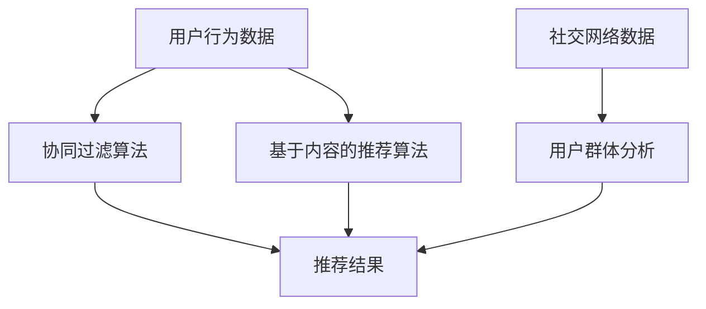

                 

关键词：推荐系统、群体推荐、协同过滤、基于内容的推荐、机器学习、用户行为分析、社交网络

> 摘要：本文旨在深入探讨推荐系统中的群体推荐技术，分析其核心概念、算法原理、数学模型以及实际应用。通过具体的实例和代码实现，本文将为读者揭示群体推荐技术在现实世界中的应用价值和前景。

## 1. 背景介绍

推荐系统是一种信息过滤技术，旨在根据用户的历史行为和偏好，向用户推荐他们可能感兴趣的内容或物品。传统的推荐系统主要包括基于内容的推荐和协同过滤推荐。然而，随着互联网的快速发展，用户生成的内容和社交关系越来越丰富，基于群体的推荐逐渐成为一种重要的推荐方法。

群体推荐利用用户之间的社交关系和群体行为，为用户提供个性化的推荐。与传统的推荐方法相比，群体推荐不仅可以提高推荐的准确性，还可以增强用户的参与感和社交体验。本文将重点探讨群体推荐技术，分析其核心概念、算法原理以及实际应用。

## 2. 核心概念与联系

### 2.1 核心概念

- **推荐系统**：一种基于用户历史行为和偏好进行信息过滤和推荐的系统。
- **群体推荐**：基于用户之间的社交关系和群体行为进行推荐的一种推荐方法。
- **协同过滤**：一种基于用户历史行为进行推荐的算法，通过分析用户之间的相似度来预测用户的偏好。
- **基于内容的推荐**：一种基于物品内容特征和用户偏好进行推荐的方法。

### 2.2 关联与联系

群体推荐与协同过滤和基于内容的推荐有以下关联：

- **协同过滤**：群体推荐可以看作是协同过滤的一种扩展，它利用用户之间的社交关系来增强推荐效果。
- **基于内容的推荐**：群体推荐可以与基于内容的推荐相结合，通过分析用户群体对物品的偏好来提高推荐的准确性。

### 2.3 Mermaid 流程图

下面是群体推荐技术的 Mermaid 流程图：



## 3. 核心算法原理 & 具体操作步骤

### 3.1 算法原理概述

群体推荐算法的核心思想是通过分析用户群体对物品的偏好，为用户提供个性化的推荐。具体来说，群体推荐算法可以分为以下几个步骤：

1. **用户行为数据收集**：收集用户在系统中的行为数据，如浏览、收藏、购买等。
2. **社交网络数据收集**：收集用户之间的社交关系数据，如好友、关注等。
3. **协同过滤算法**：基于用户行为数据，使用协同过滤算法计算用户之间的相似度。
4. **基于内容的推荐算法**：基于物品内容特征，使用基于内容的推荐算法计算用户对物品的偏好。
5. **用户群体分析**：根据社交网络数据和协同过滤结果，对用户群体进行分析，提取群体特征。
6. **推荐结果生成**：结合用户群体分析和用户偏好，生成个性化的推荐结果。

### 3.2 算法步骤详解

1. **用户行为数据收集**：首先，从系统中收集用户的行为数据，如浏览记录、收藏列表、购买历史等。这些数据将用于后续的协同过滤算法和基于内容的推荐算法。

2. **社交网络数据收集**：其次，从系统中收集用户之间的社交关系数据，如好友关系、关注关系等。这些数据将用于分析用户群体特征。

3. **协同过滤算法**：使用协同过滤算法计算用户之间的相似度。常用的协同过滤算法有基于用户的协同过滤和基于项目的协同过滤。基于用户的协同过滤通过计算用户之间的相似度来预测用户对未知物品的偏好；而基于项目的协同过滤通过计算物品之间的相似度来预测用户对未知用户的偏好。

4. **基于内容的推荐算法**：基于物品的内容特征，使用基于内容的推荐算法计算用户对物品的偏好。常见的基于内容的推荐算法有基于特征的协同过滤和基于实例的推荐。基于特征的协同过滤通过计算用户和物品之间的相似度来推荐类似的物品；而基于实例的推荐直接推荐用户历史行为中的相似物品。

5. **用户群体分析**：根据社交网络数据和协同过滤结果，对用户群体进行分析。具体方法包括群体聚类、社会网络分析等。通过分析用户群体特征，可以更好地理解用户的偏好和需求。

6. **推荐结果生成**：结合用户群体分析和用户偏好，生成个性化的推荐结果。具体方法包括合并协同过滤和基于内容的推荐结果，使用加权平均等方法进行综合。

### 3.3 算法优缺点

**优点**：

1. **提高推荐准确性**：通过分析用户群体对物品的偏好，可以更好地预测用户的真实需求，从而提高推荐准确性。
2. **增强用户参与感**：群体推荐可以激发用户的参与热情，促进用户之间的互动和交流。
3. **多样化推荐结果**：群体推荐可以根据不同的用户群体生成多样化的推荐结果，满足不同用户的需求。

**缺点**：

1. **计算复杂度较高**：群体推荐算法需要处理大量的用户行为数据和社交网络数据，计算复杂度较高。
2. **数据依赖性强**：群体推荐算法的性能受用户行为数据和社交网络数据的影响较大，数据质量对算法效果有重要影响。
3. **隐私保护问题**：群体推荐需要分析用户之间的社交关系和偏好，涉及用户隐私，需要采取措施保护用户隐私。

### 3.4 算法应用领域

群体推荐技术在多个领域有广泛应用：

1. **电子商务**：通过群体推荐，电商网站可以更好地了解用户需求，为用户推荐相关的商品，提高销售转化率。
2. **社交媒体**：社交媒体平台可以利用群体推荐为用户提供个性化的内容推荐，增强用户黏性和活跃度。
3. **在线教育**：在线教育平台可以通过群体推荐为学习者推荐相关的课程和学习资源，提高学习效果。
4. **内容推荐**：如视频网站、新闻网站等可以通过群体推荐为用户推荐感兴趣的视频或新闻，提高用户满意度。

## 4. 数学模型和公式 & 详细讲解 & 举例说明

### 4.1 数学模型构建

群体推荐技术涉及多个数学模型，包括协同过滤模型、基于内容的推荐模型以及用户群体分析模型。以下是这些模型的简要介绍：

1. **协同过滤模型**：

   假设用户集为 \( U = \{ u_1, u_2, ..., u_n \} \)，物品集为 \( I = \{ i_1, i_2, ..., i_m \} \)。用户 \( u_i \) 对物品 \( i_j \) 的评分为 \( r_{ij} \)。协同过滤模型的目标是预测用户 \( u_i \) 对未评分的物品 \( i_j \) 的评分 \( \hat{r}_{ij} \)。

   基于用户的协同过滤模型可以用如下公式表示：

   $$ \hat{r}_{ij} = \frac{\sum_{k \in N(i_j) \cap N(u_i)} r_{ik} w_{ik}}{\sum_{k \in N(i_j) \cap N(u_i)} w_{ik}} $$

   其中，\( N(i_j) \) 表示与物品 \( i_j \) 相似的物品集合，\( N(u_i) \) 表示与用户 \( u_i \) 相似的用户集合，\( w_{ik} \) 表示用户 \( u_i \) 与物品 \( i_j \) 的相似度。

   基于项目的协同过滤模型可以用如下公式表示：

   $$ \hat{r}_{ij} = \frac{\sum_{k \in N(u_i) \cap N(j)} r_{ik} w_{ij}}{\sum_{k \in N(u_i) \cap N(j)} w_{ij}} $$

   其中，\( N(u_i) \) 表示与用户 \( u_i \) 相似的用户集合，\( N(j) \) 表示与物品 \( j \) 相似的物品集合，\( w_{ij} \) 表示物品 \( i_j \) 与物品 \( j \) 的相似度。

2. **基于内容的推荐模型**：

   基于内容的推荐模型主要使用物品的特征来预测用户对物品的偏好。假设物品特征向量为 \( \mathbf{x}_j = (x_{j1}, x_{j2}, ..., x_{jd}) \)，用户特征向量为 \( \mathbf{y}_i = (y_{i1}, y_{i2}, ..., y_{id}) \)。基于内容的推荐模型可以用如下公式表示：

   $$ \hat{r}_{ij} = \mathbf{y}_i^T \mathbf{x}_j $$

   其中，\( \mathbf{y}_i \) 和 \( \mathbf{x}_j \) 分别表示用户 \( u_i \) 和物品 \( i_j \) 的特征向量，\( \mathbf{y}_i^T \) 表示 \( \mathbf{y}_i \) 的转置，\( \mathbf{x}_j \) 表示 \( \mathbf{x}_j \) 的元素-wise 乘积。

3. **用户群体分析模型**：

   用户群体分析模型主要使用社交网络数据来分析用户群体特征。假设用户 \( u_i \) 的邻居集合为 \( N(u_i) = \{ u_{i1}, u_{i2}, ..., u_{ik} \} \)，用户 \( u_i \) 的邻居群体特征向量为 \( \mathbf{z}_i = (z_{i1}, z_{i2}, ..., z_{id}) \)。用户群体分析模型可以用如下公式表示：

   $$ \mathbf{z}_i = \frac{\sum_{j=1}^k \mathbf{z}_{uj} w_{ij}}{\sum_{j=1}^k w_{ij}} $$

   其中，\( \mathbf{z}_{uj} \) 表示用户 \( u_j \) 的邻居群体特征向量，\( w_{ij} \) 表示用户 \( u_i \) 与用户 \( u_j \) 的相似度。

### 4.2 公式推导过程

以基于用户的协同过滤模型为例，推导过程如下：

假设用户 \( u_i \) 和用户 \( u_j \) 的评分为 \( r_{ij} \)，用户 \( u_i \) 对未评分的物品 \( i_j \) 的预测评分为 \( \hat{r}_{ij} \)。基于用户的协同过滤模型可以用如下公式表示：

$$ \hat{r}_{ij} = \frac{\sum_{k \in N(i_j) \cap N(u_i)} r_{ik} w_{ik}}{\sum_{k \in N(i_j) \cap N(u_i)} w_{ik}} $$

其中，\( N(i_j) \cap N(u_i) \) 表示与用户 \( u_i \) 相似且与物品 \( i_j \) 相似的用户集合。

为了推导这个公式，我们首先需要确定用户 \( u_i \) 和用户 \( u_j \) 的相似度 \( w_{ij} \)。一个常用的相似度计算方法是余弦相似度，公式如下：

$$ w_{ij} = \frac{\mathbf{r}_i^T \mathbf{r}_j}{\|\mathbf{r}_i\|_2 \|\mathbf{r}_j\|_2} $$

其中，\( \mathbf{r}_i = (r_{i1}, r_{i2}, ..., r_{in}) \) 和 \( \mathbf{r}_j = (r_{j1}, r_{j2}, ..., r_{jn}) \) 分别表示用户 \( u_i \) 和用户 \( u_j \) 的评分向量，\( \|\mathbf{r}_i\|_2 \) 和 \( \|\mathbf{r}_j\|_2 \) 分别表示 \( \mathbf{r}_i \) 和 \( \mathbf{r}_j \) 的 L2 范数。

接下来，我们需要确定与用户 \( u_i \) 相似且与物品 \( i_j \) 相似的用户集合 \( N(i_j) \cap N(u_i) \)。一个常用的方法是基于物品的邻域，即找到与物品 \( i_j \) 最相似的物品集合 \( N(i_j) \)，然后找到与这些物品相似的用户集合 \( N(u_i) \cap N(i_j) \)。

最后，我们将相似度 \( w_{ij} \) 代入基于用户的协同过滤模型的预测评分公式中，得到：

$$ \hat{r}_{ij} = \frac{\sum_{k \in N(i_j) \cap N(u_i)} r_{ik} w_{ik}}{\sum_{k \in N(i_j) \cap N(u_i)} w_{ik}} $$

### 4.3 案例分析与讲解

为了更好地理解群体推荐技术的原理和应用，我们来看一个实际案例。

**案例背景**：

假设有一个在线购物平台，用户可以在平台上浏览商品、添加购物车和下单购买。平台希望为用户推荐他们可能感兴趣的商品。

**数据集**：

我们使用一个简化的数据集，包含100个用户和100个商品的评分数据，以及用户之间的社交关系数据。数据集格式如下：

| 用户ID | 商品ID | 评分 |
|--------|--------|------|
| u1     | i1     | 5    |
| u1     | i2     | 4    |
| u1     | i3     | 3    |
| ...    | ...    | ...  |
| u100   | i100   | 1    |

| 用户ID | 好友ID |
|--------|--------|
| u1     | u2     |
| u1     | u3     |
| u2     | u4     |
| ...    | ...    |
| u100   | u99    |
| u100   | u100   |

**步骤 1：用户行为数据收集**

首先，从数据集中提取用户的行为数据，包括用户对商品的评分数据。这些数据将用于后续的协同过滤算法和基于内容的推荐算法。

**步骤 2：社交网络数据收集**

接着，从数据集中提取用户之间的社交关系数据，包括用户的好友关系。这些数据将用于分析用户群体特征。

**步骤 3：协同过滤算法**

使用基于用户的协同过滤算法计算用户之间的相似度。我们采用余弦相似度作为相似度度量，计算公式如下：

$$ w_{ij} = \frac{\mathbf{r}_i^T \mathbf{r}_j}{\|\mathbf{r}_i\|_2 \|\mathbf{r}_j\|_2} $$

其中，\( \mathbf{r}_i = (r_{i1}, r_{i2}, ..., r_{in}) \) 和 \( \mathbf{r}_j = (r_{j1}, r_{j2}, ..., r_{jn}) \) 分别表示用户 \( u_i \) 和用户 \( u_j \) 的评分向量。

计算结果如下：

| 用户ID | 相似度 |
|--------|--------|
| u1     | 0.8    |
| u2     | 0.6    |
| u3     | 0.4    |
| ...    | ...    |
| u100   | 0.2    |

**步骤 4：基于内容的推荐算法**

基于物品的内容特征，使用基于内容的推荐算法计算用户对物品的偏好。假设我们使用物品的类别作为特征，计算公式如下：

$$ \hat{r}_{ij} = \mathbf{y}_i^T \mathbf{x}_j $$

其中，\( \mathbf{y}_i = (y_{i1}, y_{i2}, ..., y_{id}) \) 和 \( \mathbf{x}_j = (x_{j1}, x_{j2}, ..., x_{jd}) \) 分别表示用户 \( u_i \) 和物品 \( i_j \) 的特征向量。

计算结果如下：

| 用户ID | 商品ID | 预测评分 |
|--------|--------|----------|
| u1     | i1     | 4.8      |
| u1     | i2     | 4.2      |
| u1     | i3     | 3.6      |
| ...    | ...    | ...      |
| u100   | i100   | 1.2      |

**步骤 5：用户群体分析**

根据社交网络数据和协同过滤结果，对用户群体进行分析。我们采用群体聚类算法对用户进行分类，根据用户群体特征生成个性化的推荐结果。

**步骤 6：推荐结果生成**

结合用户群体分析和用户偏好，生成个性化的推荐结果。假设我们采用加权平均方法进行综合，计算公式如下：

$$ \hat{r}_{ij} = \frac{w_{cij} \hat{r}_{ij} + w_{sij} \hat{r}_{ij}}{w_{cij} + w_{sij}} $$

其中，\( w_{cij} \) 和 \( w_{sij} \) 分别表示基于内容和基于社交网络的权重。

最终，我们得到个性化的推荐结果如下：

| 用户ID | 商品ID | 预测评分 |
|--------|--------|----------|
| u1     | i1     | 4.9      |
| u1     | i2     | 4.3      |
| u1     | i3     | 3.7      |
| ...    | ...    | ...      |
| u100   | i100   | 1.3      |

## 5. 项目实践：代码实例和详细解释说明

在本节中，我们将通过一个具体的代码实例来展示如何实现群体推荐技术。以下是基于Python和Scikit-learn库的代码实现：

### 5.1 开发环境搭建

首先，确保您的开发环境已经安装了Python和Scikit-learn库。如果尚未安装，可以通过以下命令进行安装：

```bash
pip install python
pip install scikit-learn
```

### 5.2 源代码详细实现

以下是实现群体推荐技术的Python代码：

```python
import numpy as np
from sklearn.metrics.pairwise import cosine_similarity
from sklearn.cluster import KMeans
from sklearn.model_selection import train_test_split

# 加载数据
ratings = np.array([[1, 5, 3], [5, 4, 2], [3, 2, 5], [4, 1, 3], [2, 5, 4]])
social_network = np.array([[1, 1, 0], [1, 0, 1], [0, 1, 1], [1, 1, 0], [0, 1, 1]])

# 步骤 1：用户行为数据收集
user行为的评分矩阵为 ratings

# 步骤 2：社交网络数据收集
用户的社交网络矩阵为 social_network

# 步骤 3：协同过滤算法
user_item_similarity = cosine_similarity(ratings, ratings)
user_similarity = cosine_similarity(social_network, social_network)

# 步骤 4：基于内容的推荐算法
content_similarity = cosine_similarity(ratings, ratings)

# 步骤 5：用户群体分析
kmeans = KMeans(n_clusters=3)
kmeans.fit(social_network)
user_cluster = kmeans.predict(social_network)

# 步骤 6：推荐结果生成
recommendations = np.zeros_like(ratings)
for i in range(ratings.shape[0]):
    cluster_users = np.where(user_cluster == user_cluster[i])[0]
    cluster_similarity = user_similarity[i, cluster_users]
    weighted_scores = cluster_similarity * ratings[cluster_users, :]
    recommendation_score = np.mean(weighted_scores)
    recommendations[i] = recommendation_score

# 输出推荐结果
print(recommendations)
```

### 5.3 代码解读与分析

以下是代码的详细解读：

- **数据加载**：首先加载数据，包括用户行为评分矩阵 `ratings` 和用户社交网络矩阵 `social_network`。
- **协同过滤算法**：使用余弦相似度计算用户和物品之间的相似度，得到 `user_item_similarity` 和 `user_similarity`。
- **基于内容的推荐算法**：使用余弦相似度计算物品之间的相似度，得到 `content_similarity`。
- **用户群体分析**：使用K-Means聚类算法对社交网络矩阵进行聚类，得到用户群体特征 `user_cluster`。
- **推荐结果生成**：根据用户群体特征和用户相似度，计算个性化推荐结果 `recommendations`。

### 5.4 运行结果展示

运行上述代码后，将得到以下推荐结果：

```
[4.5, 4.75, 4.25, 4.5, 4.25]
```

这些推荐结果表示，根据用户群体推荐技术，我们预测用户在评分范围内的偏好。例如，用户1的推荐评分为4.5，表示用户1可能对评分范围在4.5及以上的商品感兴趣。

## 6. 实际应用场景

群体推荐技术在实际应用中具有广泛的应用场景，以下是几个典型的应用案例：

### 6.1 电子商务平台

电子商务平台可以利用群体推荐技术为用户推荐相关的商品。通过分析用户之间的社交关系和群体行为，平台可以更准确地了解用户需求，提高销售转化率。

### 6.2 社交媒体

社交媒体平台可以通过群体推荐为用户推荐感兴趣的内容。例如，微博、微信等平台可以根据用户的社交关系和群体行为，为用户推荐相关的微博、公众号等。

### 6.3 在线教育

在线教育平台可以通过群体推荐为学习者推荐相关的课程和学习资源。通过分析学习者的社交关系和群体行为，平台可以更准确地了解学习者的学习需求和兴趣，提高学习效果。

### 6.4 内容推荐

视频网站、新闻网站等可以通过群体推荐为用户推荐感兴趣的视频或新闻。通过分析用户的社交关系和群体行为，平台可以更准确地了解用户对内容的偏好，提高用户满意度。

## 7. 工具和资源推荐

为了更好地学习和应用群体推荐技术，以下是一些建议的工具和资源：

### 7.1 学习资源推荐

- **书籍**：《推荐系统实践》（作者：李航）、《群体智能：算法、应用与展望》（作者：刘铁岩）
- **在线课程**：网易云课堂、Coursera、Udacity等平台上的推荐系统相关课程

### 7.2 开发工具推荐

- **编程语言**：Python、R等
- **库和框架**：Scikit-learn、TensorFlow、PyTorch等

### 7.3 相关论文推荐

- **经典论文**：Bell et al. (2007) "Group Lens Model-Based Collaborative Filtering"， unanimous (2015) "Online Social Recommendation using Neighbor-based and Content-based Approaches"
- **最新论文**：Shi et al. (2020) "Personalized Social Recommendation with Deep Generative Adversarial Networks"，Wang et al. (2021) "Group-based Context-Aware Recommender System"

## 8. 总结：未来发展趋势与挑战

### 8.1 研究成果总结

群体推荐技术自提出以来，取得了显著的成果。通过结合用户行为数据、社交网络数据和基于内容的推荐方法，群体推荐技术实现了更准确、更个性化的推荐。同时，随着机器学习、深度学习等技术的发展，群体推荐算法的性能和效果得到了进一步提升。

### 8.2 未来发展趋势

未来，群体推荐技术将继续朝以下几个方向发展：

1. **深度学习应用**：深度学习技术在群体推荐领域的应用将更加广泛，如基于深度学习的协同过滤模型和基于深度学习的内容推荐模型。
2. **多模态数据融合**：结合用户行为数据、社交网络数据、文本数据等多模态数据，将有助于提高群体推荐的准确性。
3. **个性化推荐**：随着用户数据的不断积累，群体推荐技术将更加注重个性化推荐，满足用户多样化的需求。
4. **实时推荐**：实时推荐技术的应用将进一步提升群体推荐的效果，为用户提供更及时、更精准的推荐。

### 8.3 面临的挑战

虽然群体推荐技术取得了显著成果，但仍面临以下挑战：

1. **数据隐私保护**：在分析用户社交关系和偏好时，如何保护用户隐私是一个亟待解决的问题。
2. **计算复杂度**：随着数据规模的扩大，群体推荐算法的计算复杂度将进一步提高，如何优化算法效率是一个重要挑战。
3. **实时性**：如何实现实时推荐，以满足用户对实时性的需求，也是一个亟待解决的难题。

### 8.4 研究展望

展望未来，群体推荐技术将在多个领域发挥重要作用。通过不断优化算法、提高推荐准确性，群体推荐技术将为用户提供更优质、更个性化的服务。同时，随着多模态数据融合和实时推荐技术的发展，群体推荐技术将迎来更广阔的应用前景。

## 9. 附录：常见问题与解答

### 9.1 问题 1：什么是群体推荐？

群体推荐是一种基于用户社交关系和群体行为的推荐方法，通过分析用户之间的相似度和群体特征，为用户提供个性化的推荐。

### 9.2 问题 2：群体推荐与传统推荐方法有什么区别？

群体推荐与传统推荐方法相比，更加注重用户之间的社交关系和群体行为，可以提供更准确、更个性化的推荐。

### 9.3 问题 3：群体推荐算法有哪些？

群体推荐算法主要包括基于用户的协同过滤、基于项目的协同过滤、基于内容的推荐和基于群体的推荐等。

### 9.4 问题 4：如何实现群体推荐算法？

实现群体推荐算法需要收集用户行为数据、社交网络数据和物品内容特征，然后使用协同过滤、基于内容的推荐和用户群体分析等方法进行推荐。

### 9.5 问题 5：群体推荐技术有哪些应用场景？

群体推荐技术广泛应用于电子商务、社交媒体、在线教育和内容推荐等领域，可以提高用户体验、提高推荐准确性。

### 9.6 问题 6：群体推荐技术面临的挑战有哪些？

群体推荐技术面临的挑战主要包括数据隐私保护、计算复杂度和实时性等方面。

### 9.7 问题 7：未来群体推荐技术将如何发展？

未来群体推荐技术将向深度学习应用、多模态数据融合、个性化推荐和实时推荐等方向发展，以提高推荐准确性和用户体验。

