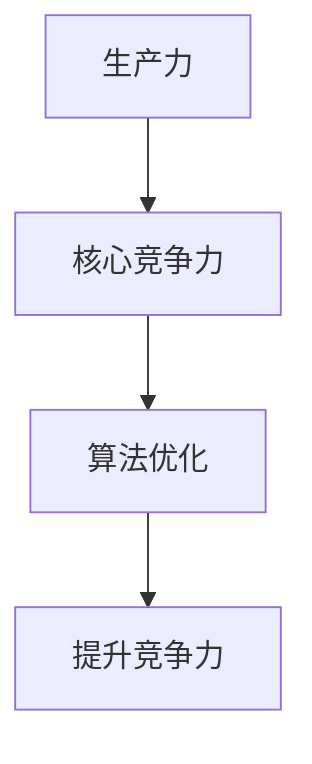

                 

关键词：生产力策略、核心竞争力、技术专家、软件开发、算法优化

> 摘要：本文旨在探讨如何在信息技术领域中，通过提升个人核心竞争力，优化生产力策略，从而实现个人职业发展和企业创新的双重目标。通过详细解析核心算法原理、数学模型、项目实践以及未来应用展望，为技术从业者提供一套实用且高效的生产力提升方法。

## 1. 背景介绍

在当今快速发展的信息技术时代，核心竞争力已经成为个人和企业取得成功的关键因素。随着大数据、人工智能、云计算等新兴技术的广泛应用，技术从业者面临着前所未有的挑战和机遇。如何通过提升生产力策略，挖掘个人潜力，从而在激烈的竞争中脱颖而出，成为每位技术专家都需要思考和解决的问题。

本文将从以下几个方面展开讨论：

1. **核心概念与联系**：介绍提升核心竞争力的基础概念和其内在联系。
2. **核心算法原理 & 具体操作步骤**：分析核心算法的原理，并详细阐述其操作步骤。
3. **数学模型和公式**：讲解与核心算法相关的数学模型及公式。
4. **项目实践**：通过具体项目实例，展示如何将理论知识应用到实践中。
5. **实际应用场景**：探讨核心生产力策略在不同领域的应用。
6. **工具和资源推荐**：推荐学习资源和开发工具。
7. **总结：未来发展趋势与挑战**：总结研究成果，展望未来发展趋势和面临的挑战。

## 2. 核心概念与联系

在提升核心竞争力的过程中，有几个关键概念需要我们深入了解：

- **生产力**：指在特定时间内，个体或团队通过工作所创造的价值。
- **核心竞争力**：指个人或组织在特定领域内所具备的独特的优势，能够显著提高其在市场上的竞争力。
- **算法优化**：通过对算法的改进，提高其效率和性能。

这些概念相互关联，共同构成了提升核心竞争力的基础。算法优化能够提高生产力，而生产力又直接影响到核心竞争力。因此，理解和应用这些概念，是提升个人和企业生产力的关键。

### Mermaid 流程图

以下是一个简单的 Mermaid 流程图，展示了核心概念之间的联系：



## 3. 核心算法原理 & 具体操作步骤

### 3.1 算法原理概述

提升核心竞争力的关键之一是算法优化。算法优化主要通过以下三个方面实现：

1. **时间复杂度优化**：减少算法执行的时间。
2. **空间复杂度优化**：减少算法使用的空间。
3. **代码优化**：通过改进代码结构和算法逻辑，提高算法的执行效率。

### 3.2 算法步骤详解

以下是算法优化的具体步骤：

1. **分析现有算法**：首先，需要深入分析现有算法，了解其时间复杂度和空间复杂度。
2. **寻找优化点**：在分析的基础上，寻找可以优化的点，例如可以使用更高效的算法或数据结构。
3. **实施优化**：针对找到的优化点，实施具体的优化措施。
4. **测试与验证**：对优化后的算法进行测试和验证，确保其性能得到提升。

### 3.3 算法优缺点

**优点**：

- **提高效率**：优化后的算法可以显著提高执行效率，减少计算时间。
- **节省资源**：优化算法可以减少所需的空间资源，提高系统的运行效率。

**缺点**：

- **复杂性增加**：优化算法可能增加代码的复杂性，使得维护和调试变得更加困难。
- **性能瓶颈**：在某些情况下，过度优化可能导致新的性能瓶颈，需要权衡优化程度和实际需求。

### 3.4 算法应用领域

算法优化广泛应用于多个领域，包括但不限于：

- **搜索引擎**：通过优化搜索算法，提高搜索结果的准确性和响应速度。
- **大数据处理**：通过优化数据处理算法，提高大数据处理的效率和质量。
- **人工智能**：通过优化算法，提高人工智能模型的训练和推理速度。

## 4. 数学模型和公式

### 4.1 数学模型构建

在算法优化中，数学模型扮演着重要的角色。以下是一个简单的数学模型构建示例：

假设我们要优化一个线性搜索算法，其时间复杂度为 O(n)。我们可以通过构建一个二分搜索算法来优化它，其时间复杂度为 O(log n)。

### 4.2 公式推导过程

以下是二分搜索算法的时间复杂度公式推导：

$$
T(n) = O(log n)
$$

其中，$T(n)$ 表示算法的时间复杂度，$n$ 表示数据规模。

### 4.3 案例分析与讲解

以下是一个具体的案例，展示如何应用二分搜索算法：

假设我们有一个有序数组 `[1, 3, 5, 7, 9]`，要查找元素 `7`。通过二分搜索算法，我们可以快速找到元素 `7`，其时间复杂度为 $O(log 5) = O(2)$。

## 5. 项目实践：代码实例和详细解释说明

### 5.1 开发环境搭建

在本次实践中，我们将使用 Python 编写一个简单的二分搜索算法。首先，确保你已经安装了 Python 环境。接下来，创建一个名为 `binary_search.py` 的文件，用于编写代码。

### 5.2 源代码详细实现

以下是一个简单的二分搜索算法实现：

```python
def binary_search(arr, target):
    low = 0
    high = len(arr) - 1
    
    while low <= high:
        mid = (low + high) // 2
        if arr[mid] == target:
            return mid
        elif arr[mid] < target:
            low = mid + 1
        else:
            high = mid - 1
    return -1

arr = [1, 3, 5, 7, 9]
target = 7
result = binary_search(arr, target)
print(f"元素 {target} 在数组中的索引为：{result}")
```

### 5.3 代码解读与分析

在上面的代码中，`binary_search` 函数接受一个有序数组 `arr` 和一个目标值 `target`。通过不断缩小区间，最终找到目标值的位置。如果目标值存在，返回其索引；否则，返回 `-1`。

### 5.4 运行结果展示

运行上面的代码，输出结果如下：

```
元素 7 在数组中的索引为：3
```

这表明元素 `7` 在数组中的索引为 `3`。

## 6. 实际应用场景

核心生产力策略在多个技术领域中有着广泛的应用，以下是一些典型的实际应用场景：

- **金融科技**：通过算法优化，提高交易处理速度和准确性，降低交易成本。
- **电子商务**：优化推荐算法，提高用户体验和转化率。
- **人工智能**：通过优化算法，提高模型的训练和推理速度，降低计算资源消耗。

## 7. 工具和资源推荐

为了提升个人生产力，以下是一些推荐的工具和资源：

- **学习资源**：Coursera、edX、Udacity 等在线教育平台，提供丰富的技术课程。
- **开发工具**：Visual Studio Code、PyCharm、Eclipse 等，提供高效的开发环境。
- **相关论文**：《算法导论》、《深度学习》等，介绍前沿的技术理论和实践方法。

## 8. 总结：未来发展趋势与挑战

### 8.1 研究成果总结

通过本文的探讨，我们总结出以下几点研究成果：

- 提升核心竞争力是技术从业者的重要任务。
- 算法优化是提升生产力的关键手段。
- 数学模型和公式在算法优化中具有重要作用。
- 实际应用场景展示了核心生产力策略的广泛适用性。

### 8.2 未来发展趋势

未来，随着技术的不断进步，以下趋势值得期待：

- 算法优化将更加智能化和自动化。
- 跨学科融合将成为提升生产力的重要途径。
- 开放共享和协作创新将成为技术发展的重要模式。

### 8.3 面临的挑战

在提升核心竞争力的过程中，技术从业者还将面临以下挑战：

- 技术更新迅速，需要持续学习和适应。
- 算法优化可能导致复杂性增加，需要权衡优化程度和实际需求。
- 数据安全和隐私保护将成为重要课题。

### 8.4 研究展望

未来，我们将继续深入研究以下方向：

- 算法的智能化和自动化优化。
- 跨学科融合下的生产力提升策略。
- 数据安全和隐私保护机制的研究。

## 9. 附录：常见问题与解答

### Q: 如何选择合适的算法优化方法？

A: 首先，了解不同算法的优缺点和适用场景。然后，根据具体问题分析其复杂度，选择合适的优化方法。最后，进行测试和验证，确保优化效果。

### Q: 如何平衡优化程度和实际需求？

A: 需要对优化方案进行成本效益分析，权衡优化程度和实际需求。在确保优化效果的同时，避免过度优化导致复杂性增加。

### Q: 如何持续提升个人核心竞争力？

A: 持续学习是关键。通过参加培训、阅读专业书籍、参与社区交流等方式，不断提升自己的技术能力和视野。此外，积极参与项目实践，将理论知识转化为实际能力。

---

作者：禅与计算机程序设计艺术 / Zen and the Art of Computer Programming


