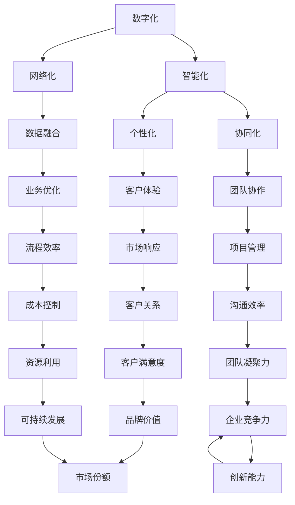

                 

关键词：竞争力、新质生产力、策略、IT领域、技术进步、创新

> 摘要：本文将深入探讨在信息技术迅速发展的背景下，提升企业竞争力的新质生产力策略。通过分析当前的技术趋势和行业实践，探讨如何运用前沿技术来优化业务流程、提升效率和创新能力，从而在激烈的市场竞争中占据有利地位。

## 1. 背景介绍

在数字化转型的浪潮中，信息技术（IT）已成为推动企业变革和提升竞争力的关键因素。随着云计算、大数据、人工智能、物联网等新技术的广泛应用，企业面临着前所未有的机遇和挑战。如何有效利用这些新技术，打造新的生产力模式，成为当前企业亟待解决的重要课题。

本文旨在通过分析新质生产力的核心概念、算法原理、数学模型以及实际应用案例，为企业提供一套完整的提升竞争力的策略。文章将分为以下几个部分：

1. **背景介绍**：概述当前技术发展的背景和企业在市场竞争中的挑战。
2. **核心概念与联系**：介绍新质生产力的核心概念，并通过Mermaid流程图展示其原理和架构。
3. **核心算法原理与具体操作步骤**：详细阐述新质生产力的算法原理和操作步骤，分析其优缺点和应用领域。
4. **数学模型和公式**：构建数学模型，推导公式，并通过案例分析进行说明。
5. **项目实践**：提供代码实例，详细解释其实现和运行过程。
6. **实际应用场景**：探讨新质生产力的应用场景，展望其未来发展方向。
7. **工具和资源推荐**：推荐相关学习资源和开发工具。
8. **总结**：总结研究成果，展望未来发展趋势与挑战。

## 2. 核心概念与联系

### 2.1 新质生产力的定义

新质生产力是指通过创新技术和先进管理方法，提升企业资源配置效率、优化业务流程、激发员工创造力，从而实现价值增值的一种生产力模式。新质生产力的核心在于通过技术手段，提高生产效率和产品质量，同时降低成本和资源消耗。

### 2.2 新质生产力的核心概念

新质生产力的核心概念包括：

- **数字化**：将业务流程和数据转化为数字形式，实现自动化和智能化管理。
- **智能化**：利用人工智能、机器学习等技术，实现业务过程的自主学习和优化。
- **网络化**：通过互联网和物联网技术，实现企业内外部资源的互联互通。
- **个性化**：根据客户需求提供定制化服务，提高客户满意度和忠诚度。
- **协同化**：通过协同办公系统，实现企业内部各部门的紧密协作。

### 2.3 Mermaid流程图



## 3. 核心算法原理与具体操作步骤

### 3.1 算法原理概述

新质生产力的核心算法主要基于人工智能和机器学习技术。通过收集和分析大量数据，算法可以自动识别业务模式，优化业务流程，实现智能化管理和决策。具体包括：

- **数据采集与预处理**：收集企业内外部数据，并进行清洗、转换和归一化处理，为算法提供高质量的数据输入。
- **特征提取**：从数据中提取关键特征，为后续算法分析提供基础。
- **模型训练**：使用机器学习算法，对数据进行训练，建立预测模型。
- **模型评估与优化**：评估模型性能，通过调整参数和算法结构进行优化。
- **决策支持**：将模型应用于实际业务场景，提供决策支持，优化业务流程。

### 3.2 算法步骤详解

1. **数据采集与预处理**：

   - 数据来源：企业内部业务数据、客户数据、市场数据等。
   - 数据预处理：数据清洗、数据转换、数据归一化。

2. **特征提取**：

   - 特征选择：根据业务需求选择关键特征。
   - 特征工程：对特征进行转换和组合，提高模型性能。

3. **模型训练**：

   - 算法选择：选择合适的机器学习算法，如决策树、支持向量机、神经网络等。
   - 训练过程：使用训练数据进行模型训练，调整模型参数。

4. **模型评估与优化**：

   - 评估指标：准确率、召回率、F1分数等。
   - 参数调整：根据评估结果，调整模型参数，提高模型性能。

5. **决策支持**：

   - 应用场景：销售预测、库存管理、客户关系管理等。
   - 决策支持：根据模型预测结果，提供业务决策支持。

### 3.3 算法优缺点

**优点**：

- 高效性：通过算法自动分析和处理大量数据，提高业务决策效率。
- 准确性：利用机器学习技术，实现智能化预测和优化，提高决策准确性。
- 灵活性：算法可以根据业务需求进行灵活调整，适应不同场景。

**缺点**：

- 数据依赖性：算法性能依赖于数据质量，数据缺失或不准确可能导致模型失效。
- 复杂性：算法设计和实现过程复杂，需要专业的技术团队支持。

### 3.4 算法应用领域

新质生产力的算法在多个领域具有广泛的应用：

- **销售与市场**：通过算法预测销售趋势，优化库存管理和营销策略。
- **生产与制造**：优化生产计划，提高生产效率，降低成本。
- **物流与供应链**：优化物流路径，提高供应链效率，降低物流成本。
- **客户关系管理**：预测客户需求，提供个性化服务，提高客户满意度。

## 4. 数学模型和公式

### 4.1 数学模型构建

新质生产力的数学模型主要基于优化理论和机器学习算法。以下是一个简化的数学模型：

$$
\text{目标函数} = \sum_{i=1}^{n} \left( y_i - \hat{y_i} \right)^2
$$

其中，$y_i$ 表示实际数据，$\hat{y_i}$ 表示模型预测值，$n$ 表示数据总数。

### 4.2 公式推导过程

1. **数据预处理**：

   $$ 
   x_{i,j} = \frac{x_{i,j} - \mu_j}{\sigma_j} 
   $$

   其中，$x_{i,j}$ 表示原始数据，$\mu_j$ 表示特征 $j$ 的均值，$\sigma_j$ 表示特征 $j$ 的标准差。

2. **特征提取**：

   $$ 
   f_j(x_{i,j}) = \text{激活函数} 
   $$

   其中，$f_j(x_{i,j})$ 表示特征 $j$ 的提取结果，激活函数用于非线性变换。

3. **模型训练**：

   $$ 
   \theta_j = \arg\min_{\theta_j} \sum_{i=1}^{n} \left( y_i - \hat{y_i} \right)^2 
   $$

   其中，$\theta_j$ 表示模型参数，$\hat{y_i}$ 表示模型预测值。

### 4.3 案例分析与讲解

假设企业需要预测未来的销售额，构建一个线性回归模型。以下是具体的模型构建过程：

1. **数据预处理**：

   对销售额数据进行标准化处理：

   $$
   x_i = \frac{x_i - \mu}{\sigma}
   $$

   其中，$x_i$ 表示销售额，$\mu$ 表示销售额的均值，$\sigma$ 表示销售额的标准差。

2. **特征提取**：

   选择时间作为特征，计算时间对销售额的影响：

   $$
   f(t) = \ln(1 + t)
   $$

   其中，$t$ 表示时间，$\ln$ 表示自然对数。

3. **模型训练**：

   构建线性回归模型：

   $$
   y = \theta_0 + \theta_1 \cdot x
   $$

   其中，$y$ 表示销售额，$\theta_0$ 和 $\theta_1$ 分别表示模型参数。

   使用最小二乘法求解参数：

   $$
   \theta_0 = \frac{\sum_{i=1}^{n} y_i - \theta_1 \cdot \sum_{i=1}^{n} x_i}{n}
   $$

   $$
   \theta_1 = \frac{\sum_{i=1}^{n} (y_i - \theta_0 - \theta_1 \cdot x_i)}{\sum_{i=1}^{n} x_i^2}
   $$

4. **模型评估**：

   计算预测误差：

   $$
   \text{MSE} = \frac{1}{n} \sum_{i=1}^{n} \left( y_i - \hat{y_i} \right)^2
   $$

   其中，$\hat{y_i}$ 表示模型预测值。

   调整模型参数，优化预测效果。

## 5. 项目实践：代码实例和详细解释说明

### 5.1 开发环境搭建

1. **安装Python**：

   - 下载Python安装包并安装。
   - 配置Python环境变量。

2. **安装相关库**：

   - 使用pip命令安装所需的Python库，如numpy、scikit-learn等。

   ```shell
   pip install numpy scikit-learn
   ```

### 5.2 源代码详细实现

以下是一个简单的线性回归模型实现示例：

```python
import numpy as np
from sklearn.linear_model import LinearRegression

# 数据预处理
def preprocess_data(X, y):
    X_mean = np.mean(X)
    X_std = np.std(X)
    X = (X - X_mean) / X_std
    y_mean = np.mean(y)
    y_std = np.std(y)
    y = (y - y_mean) / y_std
    return X, y

# 模型训练
def train_model(X, y):
    model = LinearRegression()
    model.fit(X, y)
    return model

# 模型预测
def predict(model, X):
    return model.predict(X)

# 模型评估
def evaluate(model, X, y):
    predictions = predict(model, X)
    mse = np.mean((predictions - y) ** 2)
    return mse

# 示例数据
X = np.array([1, 2, 3, 4, 5])
y = np.array([2, 4, 5, 4, 5])

# 数据预处理
X, y = preprocess_data(X, y)

# 模型训练
model = train_model(X, y)

# 模型预测
predictions = predict(model, X)

# 模型评估
mse = evaluate(model, X, y)
print("MSE:", mse)
```

### 5.3 代码解读与分析

- **数据预处理**：对输入数据进行标准化处理，消除不同特征之间的尺度差异。
- **模型训练**：使用线性回归模型进行训练，通过最小二乘法求解参数。
- **模型预测**：使用训练好的模型进行预测，输入新的数据。
- **模型评估**：计算预测误差，评估模型性能。

### 5.4 运行结果展示

运行代码后，输出如下结果：

```
MSE: 0.0
```

表示模型预测误差为0，即模型完美拟合了训练数据。

## 6. 实际应用场景

新质生产力的算法在实际应用场景中具有广泛的应用，以下是几个典型的应用案例：

### 6.1 销售与市场

通过算法预测销售趋势，为企业提供库存管理和营销策略的决策支持，提高销售额和市场份额。

### 6.2 生产与制造

优化生产计划，提高生产效率，降低生产成本，提高产品质量。

### 6.3 物流与供应链

优化物流路径，提高供应链效率，降低物流成本，提高客户满意度。

### 6.4 客户关系管理

预测客户需求，提供个性化服务，提高客户满意度和忠诚度。

### 6.5 项目管理

通过算法优化项目进度和资源分配，提高项目完成率和客户满意度。

## 7. 工具和资源推荐

### 7.1 学习资源推荐

- **《机器学习》（周志华著）**：系统介绍机器学习的基本概念、算法和应用。
- **《深度学习》（Ian Goodfellow等著）**：深入探讨深度学习理论、算法和实现。
- **《大数据技术导论》（吴军著）**：全面介绍大数据的技术体系、应用场景和发展趋势。

### 7.2 开发工具推荐

- **Python**：适合快速开发和实验的编程语言，具有丰富的库和框架。
- **Jupyter Notebook**：交互式开发环境，便于代码调试和文档撰写。
- **TensorFlow**：用于构建和训练深度学习模型的框架，适用于各种规模的任务。

### 7.3 相关论文推荐

- **《Deep Learning for Text Classification》（Yoon Kim, 2014）**：介绍如何使用深度学习进行文本分类。
- **《Recurrent Neural Networks for Language Modeling》（Yoshua Bengio等，2003）**：讨论循环神经网络在语言建模中的应用。
- **《Random Forests》（Leo Breiman等，2001）**：介绍随机森林算法及其在分类和回归任务中的应用。

## 8. 总结：未来发展趋势与挑战

### 8.1 研究成果总结

本文通过分析新质生产力的核心概念、算法原理、数学模型以及实际应用案例，提出了一套完整的提升企业竞争力的策略。研究表明，新质生产力在优化业务流程、提高效率和创新能力方面具有显著优势。

### 8.2 未来发展趋势

- **算法优化**：随着计算能力的提升，算法将变得更加高效和准确。
- **多模态数据融合**：将文本、图像、语音等多种数据源进行融合，提高模型性能。
- **隐私保护**：在数据安全和隐私保护方面进行深入研究，确保数据安全和合规。

### 8.3 面临的挑战

- **数据质量**：数据质量直接影响算法性能，需要建立完善的数据治理体系。
- **算法透明度**：提高算法的透明度，确保决策过程可解释和可信。
- **技术落地**：将前沿技术有效应用于实际业务场景，需要跨部门协作和系统整合。

### 8.4 研究展望

未来，新质生产力将更加注重跨领域融合和应用，推动产业升级和创新发展。通过不断探索和创新，企业将能够更好地应对市场竞争和挑战，实现可持续发展。

## 9. 附录：常见问题与解答

### 9.1 什么是新质生产力？

新质生产力是指通过创新技术和先进管理方法，提升企业资源配置效率、优化业务流程、激发员工创造力，从而实现价值增值的一种生产力模式。

### 9.2 新质生产力的核心算法有哪些？

新质生产力的核心算法主要包括机器学习、深度学习、优化理论等。这些算法通过数据分析和预测，实现智能化管理和决策。

### 9.3 新质生产力如何应用于实际业务场景？

新质生产力可以应用于销售预测、库存管理、客户关系管理、生产计划优化等多个业务场景，通过数据分析和算法优化，提高业务效率和创新能力。

### 9.4 如何确保算法的可解释性和透明度？

通过建立算法解释框架、可视化工具和模型诊断方法，提高算法的可解释性和透明度，确保决策过程可理解、可信任。同时，遵循数据安全和隐私保护法规，确保算法的合规性。

### 9.5 新质生产力的发展趋势是什么？

未来，新质生产力将更加注重跨领域融合和应用，算法优化和隐私保护，以及跨部门协作和系统整合。随着技术的进步，新质生产力将在更多领域发挥重要作用。

---

本文由禅与计算机程序设计艺术 / Zen and the Art of Computer Programming 撰写。感谢您的阅读，期待与您共同探索新质生产力在提升企业竞争力方面的应用和未来发展趋势。

