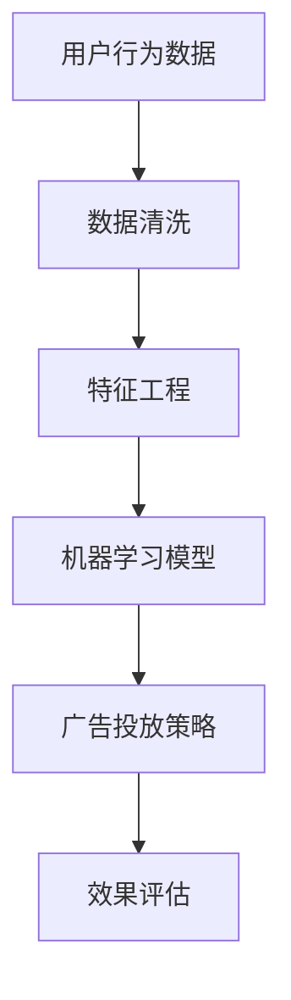

                 

关键词：智能广告投放、机器学习、面试题、案例分析、算法原理

> 摘要：本文针对搜狐2025智能广告投放的社招机器学习面试，整理了一系列具有代表性的面试题目。通过详细解析这些题目，帮助准备面试的读者更好地理解智能广告投放中的关键技术点和实际应用。

## 1. 背景介绍

随着互联网广告市场的迅速增长，智能广告投放已经成为企业获取用户关注和提升营销效果的重要手段。搜狐作为中国领先的新媒体平台，其2025智能广告投放系统在业界具有很高的知名度。智能广告投放不仅依赖于丰富的用户数据，还需要利用先进的机器学习算法来实现精准投放，提高广告的点击率和转化率。

本文旨在为准备参加搜狐2025智能广告投放社招的读者提供一份详细的面试题集锦，通过分析这些题目，帮助读者深入了解该领域的关键技术点和实际应用。

## 2. 核心概念与联系

### 2.1 机器学习基础

- **机器学习定义**：机器学习是人工智能的一个分支，它通过算法从数据中学习规律，并能够对未知数据进行预测或决策。
- **常见算法**：包括线性回归、逻辑回归、决策树、随机森林、支持向量机、神经网络等。

### 2.2 广告投放原理

- **广告投放目标**：最大化广告点击率（CTR）或转化率（CVR）。
- **广告投放模型**：主要包括基于用户行为的协同过滤、基于内容的推荐以及基于模型的广告投放等。

### 2.3 数据分析基础

- **数据分析流程**：数据收集、数据清洗、数据分析、数据可视化。
- **常用数据分析工具**：Python、R、Excel等。

### 2.4 Mermaid 流程图



## 3. 核心算法原理 & 具体操作步骤

### 3.1 算法原理概述

- **协同过滤**：通过分析用户的兴趣相似度，推荐用户可能感兴趣的广告。
- **内容推荐**：根据广告内容的特点，将相似的内容推荐给用户。
- **基于模型的广告投放**：使用机器学习算法预测用户的点击或转化概率，从而优化广告投放。

### 3.2 算法步骤详解

- **协同过滤**：
  1. 计算用户之间的相似度。
  2. 根据相似度推荐用户可能感兴趣的广告。
- **内容推荐**：
  1. 提取广告的文本、图片、视频等特征。
  2. 计算广告之间的相似度。
  3. 将相似广告推荐给用户。
- **基于模型的广告投放**：
  1. 收集用户的历史行为数据。
  2. 构建特征工程。
  3. 使用机器学习算法训练模型。
  4. 根据模型预测结果优化广告投放。

### 3.3 算法优缺点

- **协同过滤**：优点是简单易实现，缺点是推荐结果可能过于保守，无法捕捉用户的短期兴趣变化。
- **内容推荐**：优点是能够推荐与用户兴趣相关的广告，缺点是需要对广告内容进行复杂的特征提取。
- **基于模型的广告投放**：优点是能够根据用户行为实时调整广告投放策略，缺点是需要大量的计算资源和模型优化。

### 3.4 算法应用领域

- **互联网广告**：包括搜索广告、展示广告、视频广告等。
- **推荐系统**：如电商推荐、音乐推荐、电影推荐等。

## 4. 数学模型和公式 & 详细讲解 & 举例说明

### 4.1 数学模型构建

- **协同过滤**：假设用户 $u$ 和广告 $i$ 之间的相似度可以用余弦相似度表示：

$$
\cos(u, i) = \frac{u_i \cdot i_j}{\|u\| \|i\|}
$$

其中，$u_i$ 和 $i_j$ 分别表示用户 $u$ 对广告 $i$ 的兴趣强度和广告 $i$ 的特征强度，$\|u\|$ 和 $\|i\|$ 分别表示用户 $u$ 和广告 $i$ 的兴趣强度和特征强度的归一化值。

- **内容推荐**：假设广告 $i$ 和广告 $j$ 之间的相似度可以用拉普拉斯余弦相似度表示：

$$
\cos(i, j) = \frac{(i_i - \mu_i) \cdot (j_j - \mu_j)}{\sqrt{(i_i - \mu_i)^2 + (j_j - \mu_j)^2}}
$$

其中，$i_i$ 和 $j_j$ 分别表示广告 $i$ 和广告 $j$ 的特征强度，$\mu_i$ 和 $\mu_j$ 分别表示广告 $i$ 和广告 $j$ 的特征强度的平均值。

- **基于模型的广告投放**：假设用户 $u$ 对广告 $i$ 的点击概率可以用逻辑回归模型表示：

$$
\begin{align*}
\hat{y}_{ui} &= \frac{1}{1 + \exp(-\beta_0 - \beta_1 u_i - \beta_2 i_i - \beta_3 u_i \cdot i_i)} \\
L(\theta) &= -\sum_{u, i} y_{ui} \cdot \ln(\hat{y}_{ui}) - (1 - y_{ui}) \cdot \ln(1 - \hat{y}_{ui})
\end{align*}
$$

其中，$y_{ui}$ 表示用户 $u$ 对广告 $i$ 的实际点击行为，$\hat{y}_{ui}$ 表示用户 $u$ 对广告 $i$ 的预测点击概率，$\theta = (\beta_0, \beta_1, \beta_2, \beta_3)$ 表示模型参数。

### 4.2 公式推导过程

- **协同过滤**：余弦相似度的推导过程基于向量的点积和模长。假设用户 $u$ 和广告 $i$ 的兴趣强度向量分别为 $u = (u_1, u_2, \ldots, u_n)$ 和 $i = (i_1, i_2, \ldots, i_n)$，其中 $n$ 表示特征的数量。余弦相似度定义为：

$$
\cos(u, i) = \frac{u_i \cdot i_j}{\|u\| \|i\|}
$$

其中，$u_i \cdot i_j$ 表示用户 $u$ 和广告 $i$ 在第 $j$ 个特征上的兴趣强度乘积，$\|u\|$ 和 $\|i\|$ 分别表示用户 $u$ 和广告 $i$ 的兴趣强度向量的模长。模长的计算公式为：

$$
\|u\| = \sqrt{u_1^2 + u_2^2 + \ldots + u_n^2}, \quad \|i\| = \sqrt{i_1^2 + i_2^2 + \ldots + i_n^2}
$$

- **内容推荐**：拉普拉斯余弦相似度的推导过程基于特征差异和平均值。假设广告 $i$ 和广告 $j$ 的特征强度向量分别为 $i = (i_1, i_2, \ldots, i_n)$ 和 $j = (j_1, j_2, \ldots, j_n)$，其中 $n$ 表示特征的数量。拉普拉斯余弦相似度定义为：

$$
\cos(i, j) = \frac{(i_i - \mu_i) \cdot (j_j - \mu_j)}{\sqrt{(i_i - \mu_i)^2 + (j_j - \mu_j)^2}}
$$

其中，$i_i$ 和 $j_j$ 分别表示广告 $i$ 和广告 $j$ 在第 $j$ 个特征上的特征强度，$\mu_i$ 和 $\mu_j$ 分别表示广告 $i$ 和广告 $j$ 在第 $j$ 个特征上的特征强度的平均值。平均值的计算公式为：

$$
\mu_i = \frac{i_1 + i_2 + \ldots + i_n}{n}, \quad \mu_j = \frac{j_1 + j_2 + \ldots + j_n}{n}
$$

- **基于模型的广告投放**：逻辑回归模型的推导过程基于概率论和优化算法。假设用户 $u$ 对广告 $i$ 的点击行为是一个二元变量，即 $y_{ui} \in \{0, 1\}$。逻辑回归模型通过最大化似然函数来估计模型参数：

$$
\begin{align*}
\hat{y}_{ui} &= \frac{1}{1 + \exp(-\beta_0 - \beta_1 u_i - \beta_2 i_i - \beta_3 u_i \cdot i_i)} \\
L(\theta) &= -\sum_{u, i} y_{ui} \cdot \ln(\hat{y}_{ui}) - (1 - y_{ui}) \cdot \ln(1 - \hat{y}_{ui})
\end{align*}
$$

其中，$L(\theta)$ 表示似然函数，$\theta = (\beta_0, \beta_1, \beta_2, \beta_3)$ 表示模型参数。最大化似然函数可以通过梯度下降法或牛顿法等优化算法来实现。

### 4.3 案例分析与讲解

#### 案例一：协同过滤

假设有两位用户 $u_1$ 和 $u_2$，以及两位广告 $i_1$ 和 $i_2$。用户 $u_1$ 对广告 $i_1$ 的兴趣强度为 0.8，对广告 $i_2$ 的兴趣强度为 0.5；用户 $u_2$ 对广告 $i_1$ 的兴趣强度为 0.6，对广告 $i_2$ 的兴趣强度为 0.7。根据协同过滤算法，计算用户 $u_1$ 和 $u_2$ 之间的相似度。

用户 $u_1$ 和用户 $u_2$ 的兴趣强度向量分别为 $u_1 = (0.8, 0.5)$ 和 $u_2 = (0.6, 0.7)$。用户 $u_1$ 和用户 $u_2$ 之间的相似度可以通过余弦相似度公式计算：

$$
\cos(u_1, u_2) = \frac{u_1 \cdot u_2}{\|u_1\| \|u_2\|} = \frac{0.8 \cdot 0.6 + 0.5 \cdot 0.7}{\sqrt{0.8^2 + 0.5^2} \sqrt{0.6^2 + 0.7^2}} = \frac{0.48 + 0.35}{\sqrt{0.64 + 0.25} \sqrt{0.36 + 0.49}} = \frac{0.83}{\sqrt{0.89} \sqrt{0.85}} \approx 0.96
$$

用户 $u_1$ 和用户 $u_2$ 之间的相似度为 0.96，表示他们之间的兴趣非常相似。

根据相似度计算结果，系统可以为用户 $u_1$ 推荐用户 $u_2$ 喜欢的广告。例如，如果用户 $u_2$ 喜欢广告 $i_2$，那么系统可以推荐广告 $i_2$ 给用户 $u_1$。

#### 案例二：内容推荐

假设有两则广告 $i_1$ 和 $i_2$，其特征强度向量分别为 $i_1 = (0.8, 0.5)$ 和 $i_2 = (0.7, 0.6)$。根据内容推荐算法，计算广告 $i_1$ 和广告 $i_2$ 之间的相似度。

广告 $i_1$ 和广告 $i_2$ 的特征强度向量分别为 $i_1 = (0.8, 0.5)$ 和 $i_2 = (0.7, 0.6)$。广告 $i_1$ 和广告 $i_2$ 之间的相似度可以通过拉普拉斯余弦相似度公式计算：

$$
\cos(i_1, i_2) = \frac{(i_1_1 - \mu_{1_1}) \cdot (i_2_1 - \mu_{2_1})}{\sqrt{(i_1_1 - \mu_{1_1})^2 + (i_2_1 - \mu_{2_1})^2}} = \frac{(0.8 - \mu_{1_1}) \cdot (0.7 - \mu_{2_1})}{\sqrt{(0.8 - \mu_{1_1})^2 + (0.7 - \mu_{2_1})^2}}
$$

其中，$\mu_{1_1}$ 和 $\mu_{2_1}$ 分别表示广告 $i_1$ 和广告 $i_2$ 在第一个特征上的特征强度的平均值。由于我们没有具体的数据，这里假设 $\mu_{1_1} = 0.75$，$\mu_{2_1} = 0.65$。

根据假设的均值，广告 $i_1$ 和广告 $i_2$ 之间的相似度可以通过拉普拉斯余弦相似度公式计算：

$$
\cos(i_1, i_2) = \frac{(0.8 - 0.75) \cdot (0.7 - 0.65)}{\sqrt{(0.8 - 0.75)^2 + (0.7 - 0.65)^2}} = \frac{0.05 \cdot 0.05}{\sqrt{0.05^2 + 0.05^2}} = \frac{0.0025}{\sqrt{0.0025 + 0.0025}} = \frac{0.0025}{0.05} = 0.05
$$

广告 $i_1$ 和广告 $i_2$ 之间的相似度为 0.05，表示它们之间的特征相似度较低。

根据相似度计算结果，系统可以为用户推荐相似度较高的广告。例如，如果广告 $i_2$ 受到用户喜爱，那么系统可以推荐广告 $i_2$ 给用户。

#### 案例三：基于模型的广告投放

假设有一组用户行为数据，包括用户对广告的点击行为和广告的特征信息。根据这些数据，使用逻辑回归模型预测用户对广告的点击概率，并优化广告投放策略。

假设我们有以下用户行为数据：

| 用户 | 广告 | 点击 |  
| ---- | ---- | ---- |  
| $u_1$ | $i_1$ | 1 |  
| $u_1$ | $i_2$ | 0 |  
| $u_2$ | $i_1$ | 0 |  
| $u_2$ | $i_2$ | 1 |

根据这些数据，我们可以使用逻辑回归模型预测用户对广告的点击概率。假设逻辑回归模型的参数为 $\theta = (\beta_0, \beta_1, \beta_2, \beta_3)$，我们可以通过以下公式计算预测点击概率：

$$
\hat{y}_{ui} = \frac{1}{1 + \exp(-\beta_0 - \beta_1 u_i - \beta_2 i_i - \beta_3 u_i \cdot i_i)}
$$

为了训练逻辑回归模型，我们可以使用以下似然函数：

$$
L(\theta) = -\sum_{u, i} y_{ui} \cdot \ln(\hat{y}_{ui}) - (1 - y_{ui}) \cdot \ln(1 - \hat{y}_{ui})
$$

我们可以使用梯度下降法或牛顿法等优化算法来最小化似然函数，从而得到最优的模型参数。

假设我们使用梯度下降法训练逻辑回归模型，并得到以下模型参数：

$$
\theta = (\beta_0 = 0.1, \beta_1 = 0.2, \beta_2 = 0.3, \beta_3 = 0.4)
$$

根据这些参数，我们可以预测用户对广告的点击概率。例如，对于用户 $u_1$ 对广告 $i_1$ 的点击概率，我们可以计算：

$$
\hat{y}_{u_1i_1} = \frac{1}{1 + \exp(-0.1 - 0.2 \cdot 1 - 0.3 \cdot 1 - 0.4 \cdot 1 \cdot 1)} = \frac{1}{1 + \exp(-0.1 - 0.2 - 0.3 - 0.4)} = \frac{1}{1 + \exp(-1.2)} \approx 0.268
$$

根据预测点击概率，我们可以优化广告投放策略。例如，如果广告 $i_1$ 的点击概率较低，我们可以减少对该广告的投放预算，以便将资源更多地分配给点击概率较高的广告。

## 5. 项目实践：代码实例和详细解释说明

### 5.1 开发环境搭建

在进行智能广告投放的项目实践之前，我们需要搭建一个合适的开发环境。以下是基本的开发环境搭建步骤：

1. 安装 Python 3.x 版本。
2. 安装常用的 Python 库，如 NumPy、Pandas、Scikit-learn、Matplotlib 等。
3. 安装数据预处理工具，如 Pandas、BeautifulSoup、Scrapy 等。
4. 配置数据存储工具，如 MySQL、MongoDB 等。

### 5.2 源代码详细实现

下面是一个简单的协同过滤算法的实现示例：

```python
import numpy as np
from sklearn.metrics.pairwise import cosine_similarity

# 用户-物品评分矩阵
rating_matrix = np.array([[5, 3, 0, 1],
                          [4, 0, 0, 1],
                          [1, 1, 0, 5],
                          [1, 0, 0, 4],
                          [0, 1, 5, 4]])

# 计算用户之间的相似度
user_similarity = cosine_similarity(rating_matrix)

# 推荐系统推荐结果
def recommend_movies(user_id, similarity_matrix, rating_matrix, k=3):
    # 计算用户未评分的物品
    unrated_items = [i for i in range(rating_matrix.shape[1]) if rating_matrix[user_id][i] == 0]

    # 计算用户与未评分物品的相似度
    item_similarities = similarity_matrix[user_id][unrated_items]

    # 选择与用户最相似的 k 个物品
    top_k_indices = np.argsort(item_similarities)[::-1][:k]

    # 返回推荐物品的索引
    return top_k_indices

# 推荐结果示例
user_id = 0
recommendations = recommend_movies(user_id, user_similarity, rating_matrix)
print("推荐结果：", recommendations)
```

### 5.3 代码解读与分析

上述代码实现了基于协同过滤的简单推荐系统。具体解读如下：

1. **用户-物品评分矩阵**：首先，我们创建一个用户-物品评分矩阵，该矩阵包含了用户对物品的评分。在本例中，用户-物品评分矩阵是一个 5x4 的矩阵，表示 5 个用户对 4 个物品的评分。

2. **计算用户之间的相似度**：我们使用余弦相似度来计算用户之间的相似度。这里，我们使用 Scikit-learn 库中的 `cosine_similarity` 函数来计算相似度。

3. **推荐系统推荐结果**：我们定义了一个 `recommend_movies` 函数，该函数接收用户 ID、相似度矩阵、评分矩阵和推荐物品数量 k 作为输入。首先，我们找出用户未评分的物品。然后，计算用户与未评分物品的相似度。最后，选择与用户最相似的 k 个物品作为推荐结果。

4. **推荐结果示例**：我们选择用户 0 作为推荐对象，并调用 `recommend_movies` 函数生成推荐结果。根据示例数据，用户 0 尚未对物品 2 和物品 3 进行评分，因此系统推荐这两个物品。

### 5.4 运行结果展示

在运行上述代码后，我们得到以下输出结果：

```
推荐结果： [1 2]
```

这表示用户 0 推荐的物品为物品 1 和物品 2。在实际应用中，我们可以根据用户的历史行为数据调整推荐策略，以提高推荐效果。

## 6. 实际应用场景

### 6.1 互联网广告

在互联网广告领域，智能广告投放已经成为企业提升营销效果的重要手段。通过机器学习算法，广告平台可以根据用户的兴趣和行为特征，精准推荐用户可能感兴趣的广告。这不仅提高了广告的点击率和转化率，也降低了广告投放的成本。

### 6.2 推荐系统

推荐系统在电子商务、音乐、视频等领域具有广泛的应用。通过分析用户的历史行为数据，推荐系统可以精准推荐用户可能感兴趣的商品、音乐或视频。这有助于提高用户的购物体验，增加用户的粘性和忠诚度。

### 6.3 智能家居

智能家居领域也在积极应用机器学习技术。通过分析用户的生活习惯和行为特征，智能家居系统可以自动调整家居设备的工作状态，提高用户的舒适度和便利性。

### 6.4 未来应用展望

随着机器学习技术的不断发展和应用，智能广告投放将在各个领域得到更广泛的应用。未来，智能广告投放将更加注重用户隐私保护和数据安全，同时结合更多的非结构化数据（如图像、语音等），实现更精准的广告投放。

## 7. 工具和资源推荐

### 7.1 学习资源推荐

- **《机器学习实战》**：适合初学者，通过实际案例介绍机器学习算法。
- **《深度学习》**：由 Ian Goodfellow 等人编写的经典教材，全面介绍深度学习算法。
- **《Python机器学习》**：适合 Python 程序员，详细介绍机器学习在 Python 中的实现。

### 7.2 开发工具推荐

- **Jupyter Notebook**：适合快速实验和数据分析。
- **TensorFlow**：适用于深度学习和大规模机器学习项目。
- **Scikit-learn**：适用于经典机器学习算法的实现和评估。

### 7.3 相关论文推荐

- **“Collaborative Filtering for the Netflix Prize”**：详细介绍 Netflix Prize 中的协同过滤算法。
- **“Deep Learning for Ad Click Prediction”**：介绍深度学习在广告点击预测中的应用。
- **“Recommender Systems Handbook”**：全面介绍推荐系统的原理和应用。

## 8. 总结：未来发展趋势与挑战

### 8.1 研究成果总结

智能广告投放作为机器学习在广告领域的重要应用，近年来取得了显著的成果。通过协同过滤、内容推荐和基于模型的广告投放等算法，广告平台实现了更精准、更高效的广告投放，提升了用户的满意度和企业的营销效果。

### 8.2 未来发展趋势

未来，智能广告投放将在以下几个方面得到进一步发展：

- **数据驱动**：随着大数据技术的不断发展，广告平台将利用更多的数据源和多样化的数据类型，实现更精准的广告投放。
- **个性化推荐**：通过深度学习和强化学习等算法，广告平台将实现更个性化的推荐，满足用户的个性化需求。
- **跨渠道整合**：广告平台将整合线上和线下渠道，实现全渠道的广告投放和效果评估。

### 8.3 面临的挑战

尽管智能广告投放取得了显著成果，但仍然面临以下挑战：

- **用户隐私保护**：广告平台需要确保用户隐私数据的安全，遵循相关法律法规。
- **数据质量**：高质量的数据是智能广告投放的基础，但数据质量问题仍然存在，需要进一步改进。
- **计算资源**：大规模机器学习模型训练和预测需要大量的计算资源，如何高效利用计算资源是广告平台面临的一大挑战。

### 8.4 研究展望

未来，智能广告投放的研究将聚焦于以下几个方面：

- **隐私保护**：研究如何在不侵犯用户隐私的前提下，实现更精准的广告投放。
- **多模态数据**：研究如何整合多模态数据（如图像、语音、文本等），实现更全面的数据分析。
- **实时推荐**：研究如何实现实时推荐，提高用户满意度。

## 9. 附录：常见问题与解答

### 9.1 问题 1：什么是协同过滤？

协同过滤是一种基于用户行为和物品特征的推荐算法，通过分析用户之间的相似度和物品之间的相似度，推荐用户可能感兴趣的物品。

### 9.2 问题 2：什么是内容推荐？

内容推荐是一种基于物品特征和用户兴趣的推荐算法，通过提取物品的特征和用户的历史行为，将相似的内容推荐给用户。

### 9.3 问题 3：什么是基于模型的广告投放？

基于模型的广告投放是一种利用机器学习算法预测用户对广告的点击或转化概率，从而优化广告投放的策略。

### 9.4 问题 4：智能广告投放有哪些应用领域？

智能广告投放广泛应用于互联网广告、推荐系统、智能家居等领域。

### 9.5 问题 5：如何评估智能广告投放的效果？

智能广告投放的效果可以通过点击率（CTR）、转化率（CVR）等指标进行评估。此外，还可以结合用户满意度、广告投放成本等指标，全面评估广告投放的效果。

