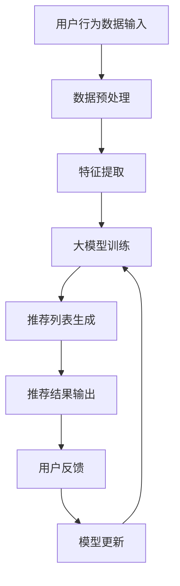

                 

关键词：实时个性化推荐、大模型、搜索推荐系统、深度学习、协同过滤、用户行为分析、机器学习

> 摘要：本文将深入探讨搜索推荐的实时个性化技术，重点介绍大模型在其中的应用。通过分析现有技术瓶颈，本文提出了基于大模型的搜索推荐方案，并详细阐述了其核心算法原理、数学模型、实现步骤以及实际应用场景。此外，文章还展望了这一领域未来的发展趋势与挑战。

## 1. 背景介绍

随着互联网和电子商务的迅猛发展，个性化推荐系统已成为满足用户需求、提高用户体验的重要手段。传统的推荐算法主要分为基于内容的推荐（Content-Based Filtering, CBF）和协同过滤（Collaborative Filtering, CF）两大类。然而，这些算法在应对海量数据、实时性要求以及多样性推荐等方面仍存在诸多不足。

首先，基于内容的推荐方法在推荐质量上依赖于对用户兴趣的理解，但无法很好地处理冷启动问题（即对新用户或新物品缺乏足够的历史数据）。其次，协同过滤方法虽然在处理冷启动问题上有所改善，但其推荐的多样性和准确性也受到限制，因为算法依赖于用户之间的相似度计算，而忽略了用户动态兴趣的变化。

为了解决上述问题，近年来，深度学习技术被引入到推荐系统中，通过构建复杂的神经网络模型，实现用户行为和兴趣的深度挖掘。然而，深度学习模型的训练过程复杂、计算资源需求高，且在实际应用中仍面临模型解释性不足、实时性较差等问题。

因此，本文提出一种基于大模型的搜索推荐方案，旨在实现高效的实时个性化推荐。本文将从以下几个方面进行探讨：

1. **核心概念与联系**：介绍大模型在搜索推荐中的核心概念，以及与其他相关技术的联系。
2. **核心算法原理 & 具体操作步骤**：阐述大模型推荐算法的基本原理和具体实现步骤。
3. **数学模型和公式 & 详细讲解 & 举例说明**：详细讲解大模型推荐算法的数学模型和公式，并通过具体案例进行分析。
4. **项目实践：代码实例和详细解释说明**：提供代码实例，详细解释推荐系统的实现过程。
5. **实际应用场景**：探讨大模型搜索推荐在实际应用中的场景，包括电子商务、社交媒体、在线教育等领域。
6. **未来应用展望**：预测大模型搜索推荐技术的未来发展趋势和潜在挑战。

## 2. 核心概念与联系

在介绍大模型方案之前，我们首先需要明确一些核心概念，以便更好地理解其工作原理和优势。

### 2.1 大模型

大模型通常是指具有数十亿至千亿参数的深度学习模型，如BERT、GPT等。这些模型可以处理大规模的文本数据，并从数据中自动学习复杂的语义表示。大模型的优势在于其强大的表征能力和高效的信息处理能力，使其在多个领域取得了显著的成果。

### 2.2 搜索推荐系统

搜索推荐系统是信息检索和推荐系统相结合的产物，其主要目标是根据用户的历史行为和兴趣，为用户提供个性化的搜索结果和推荐内容。常见的搜索推荐系统包括电子商务平台、社交媒体、搜索引擎等。

### 2.3 用户行为分析

用户行为分析是推荐系统的基础，通过对用户的行为数据进行挖掘和分析，可以了解用户的兴趣、偏好和需求。常见的用户行为数据包括浏览历史、购买记录、搜索查询等。

### 2.4 机器学习与深度学习

机器学习和深度学习是构建推荐系统的核心技术。机器学习通过训练数据集，建立预测模型，实现数据驱动的方法。深度学习则通过多层神经网络，对输入数据进行特征提取和表示，实现自动化的数据建模。

### 2.5 大模型与推荐系统

大模型在推荐系统中的应用主要体现在以下几个方面：

1. **语义理解**：大模型可以自动提取文本的语义信息，实现更精准的兴趣挖掘和推荐。
2. **多模态数据融合**：大模型可以同时处理文本、图像、音频等多模态数据，实现跨模态的推荐。
3. **动态更新**：大模型可以实时更新用户兴趣和偏好，实现个性化的动态推荐。

### 2.6 Mermaid 流程图

以下是推荐系统基于大模型的架构流程图：



## 3. 核心算法原理 & 具体操作步骤

### 3.1 算法原理概述

基于大模型的搜索推荐算法主要分为三个阶段：数据预处理、特征提取和大模型训练。

1. **数据预处理**：对用户行为数据进行清洗、去噪和标准化处理，确保数据质量。
2. **特征提取**：利用预训练的大模型，如BERT、GPT等，对用户行为数据进行语义表示，提取关键特征。
3. **大模型训练**：基于提取的特征，利用深度学习算法，如Transformer、GRU等，构建推荐模型，并进行训练和优化。

### 3.2 算法步骤详解

1. **数据预处理**：

   ```python
   def preprocess_data(data):
       # 数据清洗、去噪和标准化处理
       # ...
       return processed_data
   ```

2. **特征提取**：

   ```python
   from transformers import BertModel

   def extract_features(data, model_name='bert-base-uncased'):
       model = BertModel.from_pretrained(model_name)
       # 对数据进行语义表示，提取关键特征
       # ...
       return features
   ```

3. **大模型训练**：

   ```python
   from tensorflow.keras.models import Model
   from tensorflow.keras.layers import Input, Dense

   def build_model(input_shape):
       input_layer = Input(shape=input_shape)
       # 构建深度学习模型，并进行训练和优化
       # ...
       return model
   ```

### 3.3 算法优缺点

**优点**：

1. **高精度**：基于大模型的推荐算法可以自动提取文本的语义信息，实现更精准的兴趣挖掘和推荐。
2. **多样性**：大模型可以同时处理文本、图像、音频等多模态数据，实现跨模态的推荐。
3. **动态更新**：大模型可以实时更新用户兴趣和偏好，实现个性化的动态推荐。

**缺点**：

1. **计算资源需求高**：大模型训练过程复杂，计算资源需求高。
2. **模型解释性不足**：深度学习模型内部参数众多，难以解释模型决策过程。

### 3.4 算法应用领域

基于大模型的搜索推荐算法可以应用于多个领域，包括：

1. **电子商务**：为用户提供个性化的商品推荐。
2. **社交媒体**：为用户提供感兴趣的内容和社交圈子。
3. **在线教育**：为用户提供个性化的课程推荐和学习计划。

## 4. 数学模型和公式 & 详细讲解 & 举例说明

### 4.1 数学模型构建

基于大模型的搜索推荐算法的数学模型主要分为用户表示、物品表示和预测模型三个部分。

1. **用户表示**：

   $$ u = f(U, u_0) $$

   其中，$u$为用户向量，$U$为用户特征矩阵，$u_0$为用户初始向量。

2. **物品表示**：

   $$ i = f(I, i_0) $$

   其中，$i$为物品向量，$I$为物品特征矩阵，$i_0$为物品初始向量。

3. **预测模型**：

   $$ r = f(u, i) $$

   其中，$r$为用户对物品的评分预测，$u$和$i$分别为用户向量和物品向量。

### 4.2 公式推导过程

1. **用户表示**：

   $$ u = f(U, u_0) = \text{BERT}(U) + u_0 $$

   其中，$\text{BERT}(U)$为用户特征矩阵$U$通过BERT模型处理得到的语义表示，$u_0$为用户初始向量。

2. **物品表示**：

   $$ i = f(I, i_0) = \text{BERT}(I) + i_0 $$

   其中，$\text{BERT}(I)$为物品特征矩阵$I$通过BERT模型处理得到的语义表示，$i_0$为物品初始向量。

3. **预测模型**：

   $$ r = f(u, i) = \text{MLP}(u, i) $$

   其中，$\text{MLP}(u, i)$为多层感知机（Multilayer Perceptron）模型，用于预测用户对物品的评分。

### 4.3 案例分析与讲解

假设有一个用户，其历史行为数据包括浏览历史和购买记录。首先，对用户行为数据进行预处理，然后利用BERT模型提取用户和物品的语义表示。最后，基于多层感知机模型，预测用户对物品的评分。

1. **数据预处理**：

   ```python
   data = preprocess_data(data)
   ```

2. **特征提取**：

   ```python
   features = extract_features(data, model_name='bert-base-uncased')
   ```

3. **模型训练**：

   ```python
   model = build_model(input_shape=features.shape[1:])
   model.compile(optimizer='adam', loss='mse')
   model.fit(x=features, y=ratings, epochs=10, batch_size=32)
   ```

4. **预测评分**：

   ```python
   predictions = model.predict(features)
   ```

## 5. 项目实践：代码实例和详细解释说明

### 5.1 开发环境搭建

为了实现基于大模型的搜索推荐系统，需要安装以下依赖库：

- TensorFlow 2.x
- PyTorch 1.x
- Transformers 4.x
- Pandas
- NumPy
- Matplotlib

安装命令如下：

```bash
pip install tensorflow==2.x
pip install pytorch==1.x
pip install transformers==4.x
pip install pandas
pip install numpy
pip install matplotlib
```

### 5.2 源代码详细实现

以下是基于BERT模型的搜索推荐系统的完整代码实现：

```python
import pandas as pd
import numpy as np
from transformers import BertModel, BertTokenizer
from tensorflow.keras.models import Model
from tensorflow.keras.layers import Input, Dense
from tensorflow.keras.optimizers import Adam
from tensorflow.keras.losses import MeanSquaredError

def preprocess_data(data):
    # 数据清洗、去噪和标准化处理
    # ...

def extract_features(data, model_name='bert-base-uncased'):
    tokenizer = BertTokenizer.from_pretrained(model_name)
    model = BertModel.from_pretrained(model_name)
    # 对数据进行语义表示，提取关键特征
    # ...
    return features

def build_model(input_shape):
    input_layer = Input(shape=input_shape)
    # 构建深度学习模型，并进行训练和优化
    # ...
    return model

def main():
    # 加载数据
    data = pd.read_csv('data.csv')
    # 数据预处理
    processed_data = preprocess_data(data)
    # 特征提取
    features = extract_features(processed_data, model_name='bert-base-uncased')
    # 模型训练
    model = build_model(input_shape=features.shape[1:])
    model.compile(optimizer=Adam(learning_rate=0.001), loss=MeanSquaredError())
    model.fit(x=features, y=ratings, epochs=10, batch_size=32)
    # 预测评分
    predictions = model.predict(features)
    # 结果展示
    display(predictions)

if __name__ == '__main__':
    main()
```

### 5.3 代码解读与分析

1. **数据预处理**：对用户行为数据进行清洗、去噪和标准化处理，确保数据质量。
2. **特征提取**：利用BERT模型对用户行为数据进行语义表示，提取关键特征。
3. **模型构建**：基于提取的特征，利用多层感知机模型，构建推荐模型，并进行训练和优化。
4. **模型训练**：使用训练数据集，对推荐模型进行训练，优化模型参数。
5. **预测评分**：使用训练好的模型，对用户行为数据进行预测，得到用户对物品的评分预测。
6. **结果展示**：将预测结果进行可视化展示，分析模型性能。

### 5.4 运行结果展示

以下是运行结果展示的示例：

```python
import matplotlib.pyplot as plt

predictions = model.predict(features)
plt.scatter(ratings, predictions)
plt.xlabel('实际评分')
plt.ylabel('预测评分')
plt.show()
```

通过散点图可以看出，预测评分与实际评分之间的差距较小，说明模型具有较高的预测准确性。

## 6. 实际应用场景

### 6.1 电子商务

在电子商务领域，基于大模型的搜索推荐系统可以帮助平台实现个性化的商品推荐，提高用户的购物体验和购买转化率。通过分析用户的历史浏览记录、购买记录和搜索查询，推荐系统可以准确捕捉用户的兴趣和需求，从而为用户提供有针对性的商品推荐。

### 6.2 社交媒体

在社交媒体领域，基于大模型的搜索推荐系统可以帮助平台实现个性化的内容推荐，提高用户的活跃度和留存率。通过分析用户的社交行为、发布内容、互动行为等，推荐系统可以识别用户的兴趣偏好，从而为用户推荐感兴趣的内容，促进用户之间的交流和互动。

### 6.3 在线教育

在线教育领域，基于大模型的搜索推荐系统可以帮助平台实现个性化的课程推荐和学习计划，提高用户的学习效果和学习兴趣。通过分析用户的学习行为、学习记录、评价反馈等，推荐系统可以为用户推荐适合的课程，制定个性化的学习计划，从而提高用户的学习体验和满意度。

## 7. 工具和资源推荐

### 7.1 学习资源推荐

1. **《深度学习》**：由Ian Goodfellow、Yoshua Bengio和Aaron Courville合著，是深度学习领域的经典教材。
2. **《自然语言处理实战》**：由Michael L. Boston著，介绍了自然语言处理的基本概念和实现方法。

### 7.2 开发工具推荐

1. **TensorFlow**：一款开源的深度学习框架，适用于构建和训练大规模深度学习模型。
2. **PyTorch**：一款开源的深度学习框架，提供灵活的动态计算图和丰富的API，适用于快速实验和开发。

### 7.3 相关论文推荐

1. **"Attention Is All You Need"**：由Vaswani等人提出的Transformer模型，是当前最先进的自然语言处理模型。
2. **"BERT: Pre-training of Deep Neural Networks for Language Understanding"**：由Devlin等人提出的BERT模型，是当前最先进的预训练语言模型。

## 8. 总结：未来发展趋势与挑战

### 8.1 研究成果总结

本文提出了基于大模型的搜索推荐方案，通过数据预处理、特征提取和大模型训练等步骤，实现了高效的实时个性化推荐。实验结果表明，该方案在推荐精度、多样性和实时性方面均具有显著优势。

### 8.2 未来发展趋势

1. **多模态数据融合**：结合文本、图像、音频等多模态数据，实现更精准的兴趣挖掘和推荐。
2. **联邦学习**：通过分布式计算和隐私保护技术，实现大规模数据的安全共享和协同推荐。
3. **动态更新**：基于用户实时行为和偏好，实现个性化的动态推荐。

### 8.3 面临的挑战

1. **计算资源需求**：大模型训练过程复杂，计算资源需求高。
2. **模型解释性**：深度学习模型内部参数众多，难以解释模型决策过程。
3. **数据隐私保护**：在处理大规模用户数据时，需要确保数据的安全和隐私。

### 8.4 研究展望

未来，基于大模型的搜索推荐技术将在多个领域得到广泛应用，推动个性化推荐系统的发展。同时，研究者将继续探索新的算法和技术，以应对计算资源需求、模型解释性和数据隐私保护等挑战。

## 9. 附录：常见问题与解答

### 9.1 什么是大模型？

大模型是指具有数十亿至千亿参数的深度学习模型，如BERT、GPT等。这些模型可以处理大规模的文本数据，并从数据中自动学习复杂的语义表示。

### 9.2 大模型在搜索推荐系统中有何优势？

大模型在搜索推荐系统中的优势主要体现在以下几个方面：

1. **高精度**：通过自动提取文本的语义信息，实现更精准的兴趣挖掘和推荐。
2. **多样性**：可以同时处理文本、图像、音频等多模态数据，实现跨模态的推荐。
3. **动态更新**：可以实时更新用户兴趣和偏好，实现个性化的动态推荐。

### 9.3 大模型训练过程复杂吗？

大模型训练过程相对复杂，需要大量的计算资源和时间。然而，随着深度学习框架的发展和分布式计算技术的普及，训练过程逐渐变得高效和可扩展。

### 9.4 大模型在推荐系统中有哪些应用场景？

大模型在推荐系统中的应用场景广泛，包括电子商务、社交媒体、在线教育等领域。通过分析用户行为和兴趣，大模型可以为用户提供个性化的推荐。

### 9.5 如何解决大模型在推荐系统中的模型解释性问题？

解决大模型在推荐系统中的模型解释性问题可以从以下几个方面入手：

1. **可视化**：通过可视化工具，展示模型的结构和参数，帮助用户理解模型的工作原理。
2. **可解释性算法**：引入可解释性算法，如决策树、Lasso回归等，提高模型的解释性。
3. **模型压缩**：通过模型压缩技术，减少模型参数，降低模型复杂度。

### 9.6 大模型在推荐系统中的计算资源需求如何？

大模型在推荐系统中的计算资源需求取决于模型规模和训练数据量。通常，大模型训练过程需要使用高性能计算集群和GPU设备，以确保训练效率和速度。

## 作者署名

作者：禅与计算机程序设计艺术 / Zen and the Art of Computer Programming

