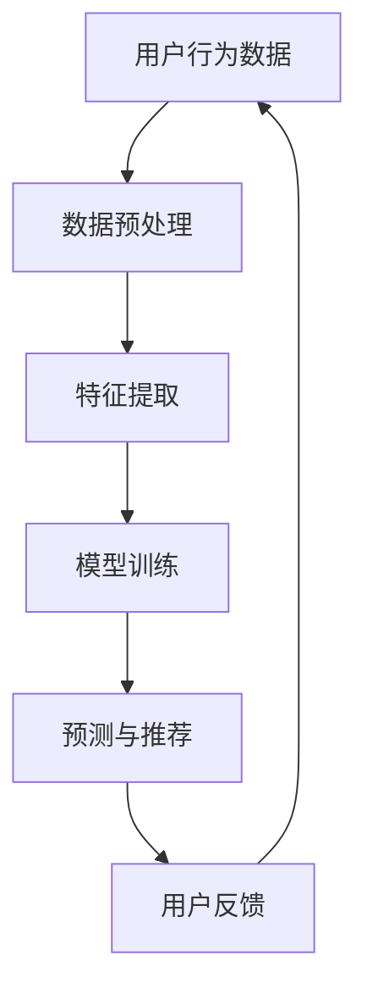

                 

关键词：搜索推荐系统、AI大模型、电商平台、核心竞争力、可持续发展

> 摘要：本文将深入探讨搜索推荐系统中AI大模型的应用及其对电商平台核心竞争力的提升与可持续发展的重要性。我们将从核心概念、算法原理、数学模型、项目实践、实际应用场景、未来展望等多个方面，全面解析AI大模型在电商平台中的关键作用。

## 1. 背景介绍

### 1.1 电商平台的兴起

随着互联网技术的迅猛发展和用户消费习惯的变化，电商平台已经成为现代商业的核心。从传统的电商平台如亚马逊、淘宝，到如今直播电商、社交电商等新兴形式，电商平台正不断影响着全球消费者的购物方式。

### 1.2 搜索推荐系统的崛起

在电商平台上，搜索推荐系统作为提升用户体验、增加销售额的重要手段，其重要性日益凸显。通过个性化推荐，搜索推荐系统能够有效提高用户粘性，降低用户流失率，从而增强电商平台的核心竞争力。

### 1.3 AI大模型的应用

近年来，随着人工智能技术的飞速发展，尤其是AI大模型的出现，为搜索推荐系统带来了新的机遇和挑战。AI大模型通过海量数据的学习和训练，能够实现更高精度、更智能的推荐结果，为电商平台提供了强大的技术支撑。

## 2. 核心概念与联系

### 2.1 搜索推荐系统

搜索推荐系统是指通过算法和模型，对用户的历史行为、兴趣偏好等进行分析，从而为用户推荐其可能感兴趣的商品、内容等。在电商平台上，搜索推荐系统主要分为基于内容的推荐和基于协同过滤的推荐。

### 2.2 AI大模型

AI大模型是指通过海量数据训练，能够实现高效、准确预测和分类的深度学习模型。在搜索推荐系统中，AI大模型的应用主要体现在用户行为预测、商品推荐、广告投放等方面。

### 2.3 Mermaid 流程图



## 3. 核心算法原理 & 具体操作步骤

### 3.1 算法原理概述

AI大模型在搜索推荐系统中的应用，主要基于深度学习技术，通过多层神经网络结构对海量数据进行训练，从而实现用户行为预测和商品推荐。其主要原理包括：

- 神经网络结构设计
- 数据预处理与特征提取
- 模型训练与优化
- 预测与推荐

### 3.2 算法步骤详解

#### 3.2.1 神经网络结构设计

神经网络结构设计是AI大模型的核心，通过调整网络层数、神经元数量、激活函数等参数，实现不同类型的预测和推荐任务。

#### 3.2.2 数据预处理与特征提取

数据预处理主要包括数据清洗、数据标准化、缺失值处理等。特征提取则是从原始数据中提取出对模型训练有帮助的特征，如用户行为特征、商品特征等。

#### 3.2.3 模型训练与优化

模型训练是通过反向传播算法，不断调整模型参数，使预测结果逐渐接近真实值。模型优化包括超参数调整、模型融合等。

#### 3.2.4 预测与推荐

预测与推荐是根据用户历史行为和特征，利用训练好的模型，对用户可能感兴趣的商品进行推荐。

### 3.3 算法优缺点

#### 优点

- 高精度预测：通过深度学习技术，实现更精准的用户行为预测和商品推荐。
- 自适应调整：模型可根据用户行为数据实时调整推荐策略，提高推荐效果。
- 海量数据处理能力：AI大模型能够处理海量数据，提高推荐系统的覆盖面。

#### 缺点

- 训练时间较长：AI大模型需要大量数据进行训练，训练时间较长。
- 资源消耗大：深度学习模型对计算资源要求较高，需要大量GPU资源。
- 难以解释性：深度学习模型的决策过程难以解释，难以满足监管和合规要求。

### 3.4 算法应用领域

AI大模型在搜索推荐系统中的应用非常广泛，包括但不限于以下领域：

- 电商平台商品推荐
- 社交媒体内容推荐
- 在线广告投放
- 智能客服系统
- 物流配送优化

## 4. 数学模型和公式 & 详细讲解 & 举例说明

### 4.1 数学模型构建

在AI大模型中，常用的数学模型包括神经网络模型、决策树模型、支持向量机模型等。以下以神经网络模型为例，介绍其数学模型构建过程。

#### 4.1.1 神经网络模型

神经网络模型主要由输入层、隐藏层和输出层组成。输入层接收外部输入数据，隐藏层通过神经元之间的连接实现数据传递和处理，输出层生成最终预测结果。

#### 4.1.2 激活函数

激活函数是神经网络模型中重要的组成部分，用于决定神经元是否激活。常见的激活函数包括 sigmoid 函数、ReLU 函数等。

#### 4.1.3 损失函数

损失函数用于评估模型预测结果与真实结果之间的差距，常用的损失函数包括均方误差（MSE）、交叉熵损失等。

### 4.2 公式推导过程

以神经网络模型为例，介绍其公式推导过程。

#### 4.2.1 前向传播

前向传播是指将输入数据通过神经网络模型进行传递，得到输出结果。其公式如下：

$$
\hat{y} = \sigma(\mathbf{W} \cdot \mathbf{a} + b)
$$

其中，$\hat{y}$ 表示预测结果，$\sigma$ 表示激活函数，$\mathbf{W}$ 表示权重矩阵，$\mathbf{a}$ 表示输入特征，$b$ 表示偏置。

#### 4.2.2 反向传播

反向传播是指通过计算损失函数关于模型参数的梯度，不断调整模型参数，使预测结果更接近真实结果。其公式如下：

$$
\frac{\partial L}{\partial \mathbf{W}} = \frac{\partial L}{\partial \hat{y}} \cdot \frac{\partial \hat{y}}{\partial \mathbf{W}}
$$

其中，$L$ 表示损失函数，$\hat{y}$ 表示预测结果，$\mathbf{W}$ 表示权重矩阵。

### 4.3 案例分析与讲解

以一个电商平台的商品推荐系统为例，介绍AI大模型在实际应用中的具体操作过程。

#### 4.3.1 数据收集与预处理

收集用户的历史购买数据、浏览数据等，进行数据清洗、数据标准化等预处理操作，提取用户行为特征和商品特征。

#### 4.3.2 模型训练与优化

使用预处理后的数据，通过深度学习框架（如TensorFlow、PyTorch等）训练神经网络模型，通过调整模型参数，优化模型性能。

#### 4.3.3 预测与推荐

将训练好的模型应用于实际场景，根据用户历史行为和特征，预测用户可能感兴趣的商品，并进行推荐。

#### 4.3.4 用户反馈与调整

根据用户对推荐结果的反馈，调整模型参数和推荐策略，提高推荐效果。

## 5. 项目实践：代码实例和详细解释说明

### 5.1 开发环境搭建

#### 5.1.1 硬件环境

- GPU：NVIDIA GeForce RTX 3070 或更高配置
- CPU：Intel i7 或更高配置
- 内存：16GB 或更高

#### 5.1.2 软件环境

- 操作系统：Linux 或 macOS
- Python 版本：3.7 或更高
- 深度学习框架：TensorFlow 或 PyTorch

### 5.2 源代码详细实现

以下是一个基于TensorFlow实现的电商商品推荐系统的简单示例代码：

```python
import tensorflow as tf
from tensorflow.keras.layers import Dense, Flatten, Embedding
from tensorflow.keras.models import Model

# 模型参数设置
input_shape = (100,)
num_classes = 10
embedding_dim = 64

# 构建模型
input_layer = tf.keras.layers.Input(shape=input_shape)
embedding_layer = Embedding(input_dim=num_classes, output_dim=embedding_dim)(input_layer)
flat_layer = Flatten()(embedding_layer)
output_layer = Dense(units=num_classes, activation='softmax')(flat_layer)

model = Model(inputs=input_layer, outputs=output_layer)

# 编译模型
model.compile(optimizer='adam', loss='categorical_crossentropy', metrics=['accuracy'])

# 训练模型
model.fit(x_train, y_train, epochs=10, batch_size=32, validation_data=(x_val, y_val))

# 评估模型
model.evaluate(x_test, y_test)
```

### 5.3 代码解读与分析

这段代码实现了一个简单的基于嵌入层的神经网络模型，用于对电商商品进行分类推荐。主要包含以下步骤：

- 导入TensorFlow库及相关层
- 设置模型参数
- 构建模型结构
- 编译模型
- 训练模型
- 评估模型

### 5.4 运行结果展示

在训练过程中，模型的损失函数和准确率会随着训练轮数的增加而逐渐下降。训练完成后，通过评估模型在测试集上的表现，可以判断模型的推荐效果。

## 6. 实际应用场景

### 6.1 电商平台商品推荐

AI大模型在电商平台商品推荐中发挥着重要作用，通过分析用户的历史行为、浏览记录、购买记录等，为用户提供个性化推荐，提高用户满意度和购买转化率。

### 6.2 社交媒体内容推荐

在社交媒体平台上，AI大模型通过对用户的兴趣偏好、互动行为等进行分析，推荐用户可能感兴趣的内容，提高用户粘性和活跃度。

### 6.3 在线广告投放

AI大模型在在线广告投放中，可以根据用户的浏览行为、兴趣爱好等，实现精准投放，提高广告效果和转化率。

### 6.4 智能客服系统

AI大模型在智能客服系统中，可以通过对用户问题的分析和理解，提供智能化的回答和建议，提高客服效率和服务质量。

### 6.5 物流配送优化

AI大模型在物流配送中，可以通过对配送路径、配送时间等进行分析，实现最优配送方案，提高配送效率和服务质量。

## 7. 未来应用展望

### 7.1 人工智能技术的不断发展

随着人工智能技术的不断发展，AI大模型在搜索推荐系统中的应用将更加广泛，实现更高的推荐精度和用户体验。

### 7.2 大数据时代的来临

大数据时代的来临，为AI大模型提供了丰富的数据资源，使得搜索推荐系统能够更好地了解用户需求，实现更精准的推荐。

### 7.3 个性化推荐的普及

随着用户对个性化体验的需求不断增加，个性化推荐将成为电商平台和社交媒体等平台的核心竞争力。

### 7.4 新兴应用场景的探索

AI大模型在新兴应用场景（如智慧城市、智能家居等）中的探索和应用，将进一步拓展搜索推荐系统的应用领域。

## 8. 总结：未来发展趋势与挑战

### 8.1 研究成果总结

本文从核心概念、算法原理、数学模型、项目实践等多个方面，全面解析了AI大模型在搜索推荐系统中的应用及其对电商平台核心竞争力的提升。

### 8.2 未来发展趋势

随着人工智能技术的不断发展，AI大模型在搜索推荐系统中的应用将更加广泛，实现更高的推荐精度和用户体验。

### 8.3 面临的挑战

尽管AI大模型在搜索推荐系统中具有巨大潜力，但同时也面临着数据隐私、算法透明度、技术成本等挑战。

### 8.4 研究展望

未来，研究应重点关注AI大模型在搜索推荐系统中的安全、透明和可解释性，以及如何更好地应对新兴应用场景的挑战。

## 9. 附录：常见问题与解答

### 9.1 什么是AI大模型？

AI大模型是指通过海量数据训练，能够实现高效、准确预测和分类的深度学习模型。

### 9.2 AI大模型有哪些应用领域？

AI大模型在电商平台、社交媒体、在线广告、智能客服、物流配送等领域都有广泛应用。

### 9.3 AI大模型的优势和劣势是什么？

优势：高精度预测、自适应调整、海量数据处理能力；劣势：训练时间较长、资源消耗大、难以解释性。

### 9.4 如何优化AI大模型？

可以通过超参数调整、模型融合、数据预处理等方法来优化AI大模型。

## 作者署名

作者：禅与计算机程序设计艺术 / Zen and the Art of Computer Programming
----------------------------------------------------------------

以上就是本文的全部内容，希望对您在搜索推荐系统与AI大模型的研究与应用中有所启发。感谢您的阅读！


