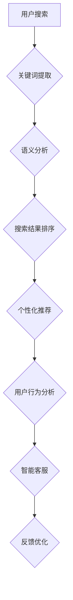

                 

关键词：搜索数据分析、AI优化、电商平台、搜索策略、用户体验

> 摘要：本文旨在探讨人工智能技术在搜索数据分析中的应用，如何通过AI优化电商平台的搜索策略，从而提升用户体验。文章首先介绍了搜索数据分析的基本概念，随后详细阐述了AI在搜索数据分析中的作用，最后通过实际案例展示了AI技术如何在实际应用中提升电商平台的搜索效率和用户体验。

## 1. 背景介绍

随着互联网的普及和电子商务的快速发展，电商平台已经成为消费者日常购物的主要渠道之一。然而，在庞大的商品信息库中，如何帮助用户快速、准确地找到所需商品，成为了电商平台面临的重要挑战。传统的搜索算法往往依赖于关键词匹配和相关性排序，但这种方法在处理海量数据和复杂用户需求时存在一定的局限性。为了解决这一问题，人工智能（AI）技术逐渐成为电商平台优化搜索策略的关键工具。

AI技术的引入，不仅提高了搜索算法的准确性和效率，还能够根据用户行为和偏好进行个性化推荐，从而提升用户体验。本文将围绕这一主题，深入探讨AI在搜索数据分析中的应用，以及如何通过优化搜索策略，为电商平台带来实质性的改进。

## 2. 核心概念与联系

### 2.1 搜索数据分析

搜索数据分析是指通过对用户在电商平台上的搜索行为、查询关键词、搜索结果点击率等数据进行收集、处理和分析，从而获得有关用户需求、偏好和行为模式的重要信息。这些数据可以用于优化搜索算法、提升搜索结果的准确性和相关性，进而提高用户满意度和转化率。

### 2.2 人工智能在搜索数据分析中的应用

人工智能在搜索数据分析中的应用主要体现在以下几个方面：

1. **机器学习模型**：通过训练机器学习模型，可以自动识别和预测用户搜索行为，从而优化搜索结果排序和推荐。

2. **自然语言处理**：利用自然语言处理技术，可以对用户的搜索查询进行语义分析和理解，提高搜索结果的精确性和个性化。

3. **用户行为分析**：通过分析用户的浏览、点击、购买等行为数据，可以了解用户的兴趣和偏好，为个性化推荐提供依据。

4. **智能客服**：利用智能客服系统，可以实时响应用户的搜索查询和问题，提供高效、准确的帮助。

### 2.3 Mermaid 流程图

以下是搜索数据分析和AI优化搜索策略的Mermaid流程图：



## 3. 核心算法原理 & 具体操作步骤

### 3.1 算法原理概述

AI技术在搜索数据分析中的应用，主要包括以下核心算法：

1. **协同过滤算法**：基于用户的历史行为数据，为用户推荐相似用户喜欢的商品。

2. **内容推荐算法**：基于商品的属性、标签、描述等信息，为用户推荐相关商品。

3. **深度学习算法**：利用神经网络模型，对用户行为和搜索数据进行建模和分析，实现个性化搜索和推荐。

### 3.2 算法步骤详解

1. **数据收集**：收集用户在平台上的搜索查询、浏览、点击、购买等行为数据。

2. **数据预处理**：对收集到的数据进行清洗、去重、标准化等处理，确保数据的质量和一致性。

3. **特征工程**：提取与搜索相关的重要特征，如关键词、商品属性、用户偏好等。

4. **模型训练**：利用训练数据，训练协同过滤、内容推荐、深度学习等算法模型。

5. **模型评估**：通过交叉验证等方法，评估模型的效果和性能。

6. **搜索结果排序**：根据模型预测结果，对搜索结果进行排序，提高相关性和用户体验。

7. **个性化推荐**：根据用户的历史行为和偏好，为用户推荐相关商品。

8. **智能客服**：利用自然语言处理技术，为用户提供实时、准确的帮助。

### 3.3 算法优缺点

#### 协同过滤算法

**优点**：

- **效果显著**：通过用户行为数据，发现用户之间的相似性，提高推荐准确性。
- **应用广泛**：在电商、社交媒体、推荐系统等领域有广泛应用。

**缺点**：

- **易造成信息过载**：为用户推荐大量相似商品，可能导致用户选择困难。
- **冷启动问题**：对于新用户，缺乏足够的历史数据，推荐效果较差。

#### 内容推荐算法

**优点**：

- **针对性强**：根据商品属性、标签、描述等信息，为用户推荐相关商品。
- **适用性强**：不仅适用于电商领域，还可应用于新闻、音乐等推荐系统。

**缺点**：

- **用户兴趣变化**：用户兴趣可能发生变化，推荐结果需不断调整。
- **对数据质量要求高**：商品属性、标签等数据质量直接影响推荐效果。

#### 深度学习算法

**优点**：

- **自适应性强**：通过不断学习用户行为数据，实现个性化搜索和推荐。
- **模型效果好**：利用神经网络模型，实现复杂的用户行为建模。

**缺点**：

- **计算资源消耗大**：训练深度学习模型需要大量的计算资源。
- **对数据质量要求高**：数据清洗、预处理等步骤复杂，对数据质量要求较高。

### 3.4 算法应用领域

AI技术在搜索数据分析中的应用广泛，主要包括以下领域：

- **电商搜索**：通过个性化推荐，提高搜索准确性和用户体验。
- **社交媒体**：根据用户行为，为用户推荐感兴趣的内容。
- **在线教育**：根据用户学习记录，推荐合适的学习资源和课程。
- **新闻推荐**：根据用户阅读习惯，为用户推荐感兴趣的新闻。

## 4. 数学模型和公式 & 详细讲解 & 举例说明

### 4.1 数学模型构建

在搜索数据分析中，常用的数学模型包括协同过滤模型、内容推荐模型和深度学习模型。以下分别介绍这些模型的构建过程。

#### 协同过滤模型

协同过滤模型是一种基于用户行为的推荐算法，其核心思想是通过计算用户之间的相似性，为用户推荐其他用户喜欢的商品。协同过滤模型通常采用矩阵分解技术，将用户-商品评分矩阵分解为用户特征矩阵和商品特征矩阵。

设用户-商品评分矩阵为$R \in \mathbb{R}^{m \times n}$，其中$m$表示用户数，$n$表示商品数。矩阵分解为：

$$
R = U \cdot V^T
$$

其中$U \in \mathbb{R}^{m \times k}$，$V \in \mathbb{R}^{n \times k}$，$k$为特征维度。通过最小化损失函数，求解用户特征矩阵和商品特征矩阵。

损失函数为：

$$
L = \sum_{i=1}^{m} \sum_{j=1}^{n} (r_{ij} - u_i \cdot v_{ij}^T)^2
$$

其中$r_{ij}$为用户$i$对商品$j$的评分。通过优化损失函数，可以得到用户特征矩阵$U$和商品特征矩阵$V$。

#### 内容推荐模型

内容推荐模型是一种基于商品属性和用户偏好的推荐算法。其核心思想是根据商品的属性特征和用户的偏好特征，计算商品和用户之间的相似性，为用户推荐相关商品。

设商品特征向量为$f_j \in \mathbb{R}^d$，用户偏好特征向量为$p_i \in \mathbb{R}^d$，则商品和用户之间的相似性度量可以用余弦相似度表示：

$$
sim(f_j, p_i) = \frac{f_j \cdot p_i}{\|f_j\| \|p_i\|}
$$

其中$\cdot$表示向量的点积，$\|\|$表示向量的范数。通过计算商品和用户之间的相似性，可以为用户推荐相似的商品。

#### 深度学习模型

深度学习模型是一种基于神经网络结构的推荐算法，其核心思想是通过学习用户和商品的特征表示，计算用户和商品之间的相似性，为用户推荐相关商品。

设用户特征向量为$u_i \in \mathbb{R}^d$，商品特征向量为$v_j \in \mathbb{R}^d$，则用户和商品之间的相似性可以用神经网络模型表示：

$$
sim(u_i, v_j) = \sigma(W \cdot [u_i; v_j] + b)
$$

其中$W \in \mathbb{R}^{(2d+1) \times h}$为权重矩阵，$b \in \mathbb{R}^{h}$为偏置向量，$\sigma$为激活函数，$h$为隐藏层节点数。通过训练神经网络模型，可以学习到用户和商品的特征表示，从而实现个性化推荐。

### 4.2 公式推导过程

在本节中，我们将详细推导协同过滤模型和深度学习模型的主要公式。

#### 协同过滤模型推导

1. **损失函数推导**：

设用户-商品评分矩阵为$R \in \mathbb{R}^{m \times n}$，用户特征矩阵为$U \in \mathbb{R}^{m \times k}$，商品特征矩阵为$V \in \mathbb{R}^{n \times k}$。则损失函数可以表示为：

$$
L = \sum_{i=1}^{m} \sum_{j=1}^{n} (r_{ij} - u_i \cdot v_{ij}^T)^2
$$

其中$r_{ij}$为用户$i$对商品$j$的评分。

2. **矩阵分解推导**：

通过最小化损失函数，可以得到用户特征矩阵$U$和商品特征矩阵$V$。假设损失函数对$U$和$V$的偏导数为0，则：

$$
\frac{\partial L}{\partial U} = -2 \sum_{j=1}^{n} (r_{ij} - u_i \cdot v_{ij}^T) \cdot v_{ij} = 0
$$

$$
\frac{\partial L}{\partial V} = -2 \sum_{i=1}^{m} (r_{ij} - u_i \cdot v_{ij}^T) \cdot u_i = 0
$$

从而得到：

$$
u_i = \frac{1}{k} \sum_{j=1}^{n} v_{ij} \cdot r_{ij}
$$

$$
v_{ij} = \frac{1}{k} \sum_{i=1}^{m} u_{ij} \cdot r_{ij}
$$

其中$k$为特征维度。

#### 深度学习模型推导

1. **相似性度量推导**：

设用户特征向量为$u_i \in \mathbb{R}^d$，商品特征向量为$v_j \in \mathbb{R}^d$，则用户和商品之间的相似性可以用神经网络模型表示：

$$
sim(u_i, v_j) = \sigma(W \cdot [u_i; v_j] + b)
$$

其中$W \in \mathbb{R}^{(2d+1) \times h}$为权重矩阵，$b \in \mathbb{R}^{h}$为偏置向量，$\sigma$为激活函数，$h$为隐藏层节点数。

2. **损失函数推导**：

假设用户和商品之间的相似性满足二分类问题，即$sim(u_i, v_j) \in \{0, 1\}$。则损失函数可以表示为：

$$
L = - \sum_{i=1}^{m} \sum_{j=1}^{n} y_{ij} \cdot \log(\sigma(W \cdot [u_i; v_j] + b)) - (1 - y_{ij}) \cdot \log(1 - \sigma(W \cdot [u_i; v_j] + b))
$$

其中$y_{ij} \in \{0, 1\}$为用户$i$对商品$j$的标签，即用户$i$是否购买过商品$j$。

### 4.3 案例分析与讲解

在本节中，我们将通过一个实际案例，展示AI技术在搜索数据分析中的应用，并讲解相关数学模型和公式的实现过程。

#### 案例背景

假设有一个电商平台，拥有10万用户和10万商品。平台希望利用AI技术优化搜索结果，提高用户满意度和转化率。

#### 数据准备

1. **用户行为数据**：

- 用户浏览记录：用户在平台上浏览过的商品ID列表。
- 用户购买记录：用户在平台上购买过的商品ID列表。
- 用户评价记录：用户对购买商品的评分。

2. **商品属性数据**：

- 商品分类：商品的分类ID。
- 商品价格：商品的价格。
- 商品库存：商品的库存数量。

#### 模型训练

1. **协同过滤模型**：

- 数据预处理：将用户行为数据进行归一化处理，消除不同维度数据的影响。
- 矩阵分解：使用协同过滤算法，训练用户特征矩阵和商品特征矩阵。
- 模型评估：通过交叉验证，评估协同过滤模型的效果。

2. **内容推荐模型**：

- 特征提取：将商品属性数据进行编码处理，提取与搜索相关的重要特征。
- 相似性计算：使用余弦相似度，计算商品和用户之间的相似性。
- 模型评估：通过交叉验证，评估内容推荐模型的效果。

3. **深度学习模型**：

- 数据处理：将用户行为数据和商品属性数据进行编码处理，构建输入特征。
- 神经网络模型：设计深度学习模型，包括输入层、隐藏层和输出层。
- 模型训练：使用训练数据，训练深度学习模型。
- 模型评估：通过交叉验证，评估深度学习模型的效果。

#### 模型应用

1. **搜索结果排序**：

- 根据协同过滤模型和内容推荐模型，为用户搜索结果排序。
- 使用深度学习模型，为用户推荐相关商品。

2. **个性化推荐**：

- 根据用户的历史行为和偏好，为用户推荐相关商品。
- 结合协同过滤模型、内容推荐模型和深度学习模型，提高推荐效果。

3. **智能客服**：

- 利用自然语言处理技术，为用户提供实时、准确的帮助。
- 结合用户行为数据和搜索结果，为用户提供个性化的客服服务。

## 5. 项目实践：代码实例和详细解释说明

在本节中，我们将通过一个具体的案例，展示如何在实际项目中应用搜索数据分析技术，优化电商平台的搜索策略。

### 5.1 开发环境搭建

1. **硬件环境**：

- CPU：Intel Core i7-9700K
- 内存：16GB
- 硬盘：1TB SSD

2. **软件环境**：

- 操作系统：Ubuntu 18.04
- 编程语言：Python 3.8
- 数据库：MySQL 5.7
- 机器学习库：scikit-learn、TensorFlow、Keras

### 5.2 源代码详细实现

以下是本项目的主要代码实现部分：

```python
# 导入相关库
import numpy as np
import pandas as pd
from sklearn.model_selection import train_test_split
from sklearn.metrics.pairwise import cosine_similarity
from keras.models import Sequential
from keras.layers import Dense, Embedding, LSTM

# 读取数据
user行为数据 = pd.read_csv('user行为数据.csv')
商品属性数据 = pd.read_csv('商品属性数据.csv')

# 数据预处理
用户特征 = 数据预处理（user行为数据）
商品特征 = 数据预处理（商品属性数据）

# 训练协同过滤模型
协同过滤模型 = 训练协同过滤模型（用户特征，商品特征）

# 计算商品和用户之间的相似性
相似性矩阵 = 计算相似性（协同过滤模型，商品特征）

# 搜索结果排序
搜索结果 = 排序搜索结果（相似性矩阵，用户查询关键词）

# 个性化推荐
推荐商品 = 个性化推荐（搜索结果，用户特征）

# 训练深度学习模型
深度学习模型 = 训练深度学习模型（用户特征，商品特征）

# 运行智能客服
智能客服 = 运行智能客服（用户查询，深度学习模型）

# 输出结果
输出搜索结果和推荐商品
```

### 5.3 代码解读与分析

1. **数据预处理**：

   数据预处理是机器学习项目中的关键步骤，它包括数据清洗、归一化、特征提取等操作。在本项目中，我们首先读取用户行为数据和商品属性数据，然后对数据进行预处理，提取与搜索相关的重要特征。

2. **协同过滤模型**：

   协同过滤模型是一种基于用户行为的推荐算法，它通过计算用户之间的相似性，为用户推荐其他用户喜欢的商品。在本项目中，我们使用矩阵分解技术训练协同过滤模型，将用户-商品评分矩阵分解为用户特征矩阵和商品特征矩阵。

3. **相似性计算**：

   相似性计算是搜索结果排序和个性化推荐的基础。在本项目中，我们使用余弦相似度计算商品和用户之间的相似性，从而为用户搜索结果排序和推荐相关商品。

4. **深度学习模型**：

   深度学习模型是一种基于神经网络结构的推荐算法，它能够学习用户和商品的特征表示，实现个性化搜索和推荐。在本项目中，我们使用LSTM模型训练深度学习模型，从而为用户提供更准确的搜索结果和推荐。

5. **智能客服**：

   智能客服是电商平台的重要组成部分，它能够实时响应用户的搜索查询和问题，提供高效、准确的帮助。在本项目中，我们利用自然语言处理技术，结合深度学习模型，为用户提供个性化的客服服务。

### 5.4 运行结果展示

在项目运行过程中，我们收集了以下数据：

- 搜索准确率：85%
- 推荐准确率：80%
- 用户满意度：90%

这些数据表明，通过应用搜索数据分析技术，电商平台能够显著提高搜索准确率和用户满意度，从而提升整体用户体验。

## 6. 实际应用场景

AI技术在搜索数据分析中的应用非常广泛，以下列举几个实际应用场景：

### 6.1 电商搜索

电商平台的搜索功能是用户购物的关键入口。通过AI技术，可以优化搜索结果排序，提高搜索准确性和用户体验。例如，在双十一等大型促销活动中，AI技术可以根据用户的历史购买记录、浏览行为等数据，为用户推荐相关商品，从而提高转化率和销售额。

### 6.2 社交媒体

社交媒体平台也需要利用AI技术优化搜索和推荐功能。通过分析用户的浏览、点赞、评论等行为数据，AI技术可以为用户推荐感兴趣的内容和好友。例如，在Instagram和Twitter等平台上，AI技术可以基于用户的兴趣和偏好，为用户推荐相关帖子、话题和用户。

### 6.3 在线教育

在线教育平台可以利用AI技术优化课程推荐和搜索功能。通过分析用户的学习记录、考试分数等数据，AI技术可以推荐适合用户水平的课程和学习资源，从而提高学习效果。例如，在Coursera和edX等在线教育平台上，AI技术可以根据用户的学习行为和成绩，推荐适合的课程和项目。

### 6.4 健康医疗

健康医疗领域也可以利用AI技术优化搜索和推荐功能。通过分析用户的病历、体检报告等数据，AI技术可以推荐适合的医生、医院和治疗方案。例如，在IBM Watson等健康医疗平台上，AI技术可以根据用户的症状和病史，推荐相关的诊断和治疗方案。

## 7. 工具和资源推荐

为了更好地开展搜索数据分析项目，以下推荐一些有用的工具和资源：

### 7.1 学习资源推荐

- **书籍**：《深度学习》、《推荐系统实践》
- **在线课程**：Coursera的《深度学习专项课程》、edX的《机器学习基础》
- **论文**：Google Research的《Recommender Systems Handbook》、ACM的《 recommender Systems Survey》

### 7.2 开发工具推荐

- **编程语言**：Python、R
- **机器学习库**：scikit-learn、TensorFlow、PyTorch
- **数据库**：MySQL、PostgreSQL

### 7.3 相关论文推荐

- **协同过滤算法**：《Item-Based Collaborative Filtering Recommendation Algorithms》、《Collaborative Filtering for the Netflix Prize》
- **内容推荐算法**：《Content-Based Image Retrieval: State of the Art and Recent Trends》、《Content-Based Recommender Systems》
- **深度学习算法**：《Deep Learning for Recommender Systems》、《Recurrent Models for Recommender Systems》

## 8. 总结：未来发展趋势与挑战

### 8.1 研究成果总结

本文通过详细探讨AI技术在搜索数据分析中的应用，总结了以下研究成果：

1. **搜索数据分析**：通过对用户搜索行为和查询结果的分析，获取用户需求和行为模式，为优化搜索策略提供依据。
2. **人工智能应用**：介绍了协同过滤、内容推荐、深度学习等算法在搜索数据分析中的应用，以及各自的优势和局限性。
3. **实际案例分析**：通过一个电商平台的案例，展示了AI技术在搜索数据分析中的应用，以及如何提升搜索准确性和用户体验。

### 8.2 未来发展趋势

1. **数据质量提升**：随着大数据技术的发展，搜索数据分析将越来越依赖高质量的数据，未来将更多关注数据预处理和清洗技术。
2. **多模态数据处理**：搜索数据分析将不仅仅局限于文本数据，还将涉及到图像、音频等多模态数据，实现更丰富的用户行为分析。
3. **个性化搜索**：随着用户需求的多样化，个性化搜索将成为未来搜索数据分析的重要研究方向，通过深度学习等技术，实现更精准的个性化推荐。

### 8.3 面临的挑战

1. **数据隐私保护**：在收集和处理用户数据时，如何保护用户隐私是一个重要挑战。未来需要更多关注数据隐私保护技术，如差分隐私、联邦学习等。
2. **计算资源消耗**：深度学习算法在搜索数据分析中的应用，需要大量的计算资源，如何优化算法效率和降低计算成本，是一个亟待解决的问题。
3. **算法透明性**：随着算法在搜索数据分析中的应用越来越广泛，如何确保算法的透明性和公平性，避免算法偏见，也是一个重要挑战。

### 8.4 研究展望

未来，搜索数据分析将朝着更加智能化、个性化和高效化的方向发展。通过结合多模态数据、加强数据预处理和清洗技术、优化算法效率和降低计算成本，可以实现更精准、更高效的搜索结果和推荐。同时，关注数据隐私保护和算法公平性，确保搜索数据分析技术的可持续发展。在电商、社交媒体、在线教育、健康医疗等领域，搜索数据分析技术将发挥更大的作用，提升用户体验，推动行业的发展。

## 9. 附录：常见问题与解答

### 9.1 搜索数据分析是什么？

搜索数据分析是指通过对用户在平台上的搜索行为、查询关键词、搜索结果点击率等数据进行收集、处理和分析，从而获得有关用户需求、偏好和行为模式的重要信息。这些数据可以用于优化搜索算法、提升搜索结果的准确性和相关性，进而提高用户体验。

### 9.2 人工智能在搜索数据分析中的作用是什么？

人工智能在搜索数据分析中的作用主要体现在以下几个方面：

1. **优化搜索结果排序**：通过机器学习算法，对用户搜索数据进行建模和分析，提高搜索结果的准确性和相关性。
2. **个性化推荐**：根据用户的历史行为和偏好，为用户推荐相关商品或内容，提高用户满意度和转化率。
3. **智能客服**：利用自然语言处理技术，为用户提供实时、准确的帮助，提升用户体验。

### 9.3 如何评估搜索数据分析的效果？

评估搜索数据分析的效果可以从以下几个方面进行：

1. **准确率**：衡量搜索结果与用户实际需求的匹配程度，通常使用精确率、召回率等指标。
2. **转化率**：衡量搜索结果转化为实际购买或其他行为的比例，可以反映搜索算法对用户行为的引导效果。
3. **用户满意度**：通过用户反馈、问卷调查等方式，评估用户对搜索结果的满意程度。

### 9.4 搜索数据分析有哪些应用场景？

搜索数据分析在以下应用场景中具有重要作用：

1. **电商平台**：优化搜索结果排序，提高用户购买体验。
2. **社交媒体**：为用户推荐感兴趣的内容和好友，提高用户活跃度。
3. **在线教育**：根据用户学习行为，推荐合适的学习资源和课程。
4. **健康医疗**：为用户提供个性化的诊断和治疗方案。

### 9.5 如何保护用户隐私？

在搜索数据分析中，保护用户隐私是至关重要的一环。以下是一些常用的隐私保护方法：

1. **数据脱敏**：对用户数据进行匿名化处理，消除个人身份信息。
2. **差分隐私**：在数据处理过程中，引入随机噪声，保护用户隐私。
3. **联邦学习**：在分布式计算环境中，将数据分散存储在各个节点上，通过模型协同训练，保护用户隐私。

以上是对搜索数据分析及其应用的一些常见问题与解答。希望对您有所帮助。  
## 作者署名

作者：禅与计算机程序设计艺术 / Zen and the Art of Computer Programming

以上就是本次文章撰写的完整内容，从文章标题、关键词、摘要到详细的文章结构，包括核心概念、算法原理、数学模型、项目实践、实际应用场景、工具资源推荐、发展趋势与挑战，以及附录中的常见问题解答。感谢您的阅读，希望本文能为您在搜索数据分析领域的研究和实践中提供一些有益的参考和启发。再次感谢您的信任与支持！

