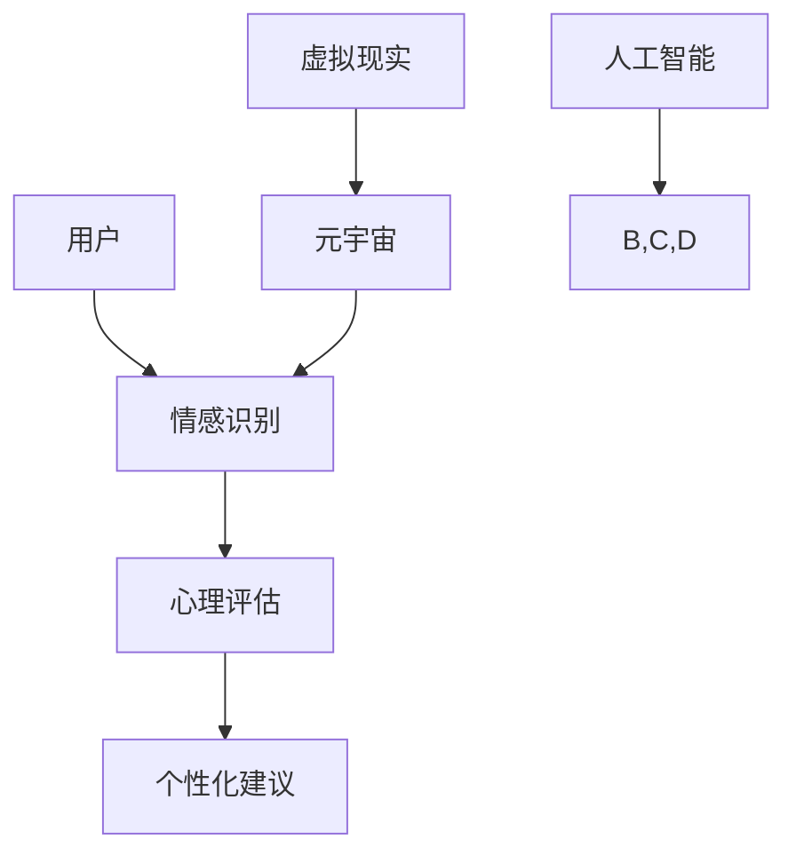

                 

关键词：数字化情感咨询、元宇宙、心理健康服务、人工智能、虚拟现实、心理健康

摘要：本文深入探讨了数字化情感咨询在元宇宙中的心理健康服务应用。随着元宇宙的发展，心理健康问题日益受到关注。通过整合人工智能、虚拟现实等技术，数字化情感咨询提供了一种全新的心理健康服务模式，为用户提供个性化的心理健康解决方案。

## 1. 背景介绍

### 元宇宙的崛起

元宇宙（Metaverse）是一个虚拟的、三维的、不断扩展的数字世界，用户可以在其中进行各种互动和活动。随着虚拟现实（VR）和增强现实（AR）技术的不断进步，元宇宙已经成为一个备受关注的领域。

### 心理健康问题的挑战

在元宇宙中，人们面临着前所未有的心理健康挑战。长时间的虚拟世界互动可能导致孤独感、焦虑和抑郁等问题。此外，虚拟社交环境中的匿名性和虚拟身份可能导致人们逃避现实生活中的问题，从而加重心理健康问题。

### 数字化情感咨询的需求

为了应对元宇宙中的心理健康问题，数字化情感咨询成为了一种新的解决方案。它利用人工智能和虚拟现实技术，为用户提供个性化的心理健康服务，帮助用户应对心理健康问题。

## 2. 核心概念与联系

### 数字化情感咨询

数字化情感咨询是一种利用人工智能和虚拟现实技术提供的心理健康服务。它包括以下核心概念：

- **情感识别**：通过人工智能技术识别用户在虚拟环境中的情感状态。
- **心理评估**：根据情感识别结果，对用户的心理健康状况进行评估。
- **个性化建议**：根据评估结果，为用户提供个性化的心理健康建议。

### 元宇宙

元宇宙是一个虚拟的三维空间，用户可以通过VR设备进入其中进行互动。元宇宙中的心理健康服务具有以下特点：

- **沉浸式体验**：用户可以在虚拟环境中感受到身临其境的体验，提高心理健康服务的有效性。
- **匿名性**：用户可以在元宇宙中保持匿名，减轻心理健康问题的尴尬和压力。

### 人工智能

人工智能在数字化情感咨询中发挥着关键作用，包括：

- **情感识别**：通过机器学习算法，从用户的行为和言语中识别情感状态。
- **个性化推荐**：根据用户的情感状态和心理健康需求，为用户提供个性化的心理健康建议。

### 虚拟现实

虚拟现实技术为元宇宙中的心理健康服务提供了沉浸式体验，包括：

- **心理治疗**：在虚拟环境中进行心理治疗，帮助用户克服心理障碍。
- **社交互动**：在虚拟环境中与其他用户进行社交互动，缓解孤独感和焦虑。

## 2.1 核心概念原理和架构

下面是一个用Mermaid绘制的核心概念原理和架构的流程图：



## 3. 核心算法原理 & 具体操作步骤

### 3.1 算法原理概述

数字化情感咨询的核心算法主要包括情感识别、心理评估和个性化建议。情感识别利用机器学习算法从用户的行为和言语中提取情感特征，心理评估根据情感特征对用户的心理健康状况进行评估，个性化建议根据评估结果为用户提供相应的心理健康建议。

### 3.2 算法步骤详解

#### 3.2.1 情感识别

情感识别的步骤如下：

1. 收集用户在虚拟环境中的行为和言语数据。
2. 利用机器学习算法对数据进行分析，提取情感特征。
3. 将情感特征与已知的情感类别进行比较，确定用户的情感状态。

#### 3.2.2 心理评估

心理评估的步骤如下：

1. 根据情感识别结果，收集用户的心理健康数据。
2. 利用心理学模型对用户的心理健康状况进行评估。
3. 根据评估结果，确定用户的心理健康等级。

#### 3.2.3 个性化建议

个性化建议的步骤如下：

1. 根据心理评估结果，为用户提供心理健康建议。
2. 根据用户的情感状态，调整建议的内容和形式。
3. 为用户提供持续的健康监测和跟踪服务。

### 3.3 算法优缺点

#### 优点

- **高效性**：数字化情感咨询能够快速、准确地识别用户的心理健康问题，提供针对性的建议。
- **个性化**：根据用户的情感状态和心理健康需求，为用户提供个性化的心理健康服务。
- **无障碍**：用户可以在元宇宙中保持匿名，减轻心理健康问题的尴尬和压力。

#### 缺点

- **准确性**：情感识别和心理评估的准确性可能受到数据质量和算法模型的影响。
- **依赖性**：用户过度依赖数字化情感咨询可能导致现实生活中的心理健康问题恶化。

### 3.4 算法应用领域

数字化情感咨询算法在以下领域具有广泛的应用：

- **心理健康监测**：对用户的心理健康状况进行实时监测和评估。
- **心理治疗**：在虚拟环境中进行心理治疗，帮助用户克服心理障碍。
- **健康咨询**：为用户提供个性化的心理健康建议和健康指导。

## 4. 数学模型和公式 & 详细讲解 & 举例说明

### 4.1 数学模型构建

数字化情感咨询的数学模型主要包括情感识别模型、心理评估模型和个性化建议模型。以下是一个简化的数学模型构建过程：

#### 4.1.1 情感识别模型

情感识别模型利用机器学习算法，通过训练数据集对情感特征进行识别。数学模型可以表示为：

$$
\text{识别模型} = \text{机器学习算法}(\text{训练数据集})
$$

其中，机器学习算法可以采用支持向量机（SVM）、神经网络（NN）等算法。

#### 4.1.2 心理评估模型

心理评估模型根据情感识别结果，利用心理学模型对用户的心理健康状况进行评估。数学模型可以表示为：

$$
\text{评估模型} = \text{心理学模型}(\text{情感识别结果})
$$

其中，心理学模型可以采用心理测量学模型、心理统计模型等。

#### 4.1.3 个性化建议模型

个性化建议模型根据心理评估结果，为用户提供个性化的心理健康建议。数学模型可以表示为：

$$
\text{建议模型} = \text{心理健康建议算法}(\text{心理评估结果})
$$

其中，心理健康建议算法可以采用基于规则的算法、基于数据的算法等。

### 4.2 公式推导过程

#### 4.2.1 情感识别模型

情感识别模型的核心是特征提取和分类。以下是一个简化的推导过程：

1. 特征提取：

$$
\text{特征向量} = \text{特征提取算法}(\text{行为数据}, \text{言语数据})
$$

其中，特征提取算法可以采用主成分分析（PCA）、线性判别分析（LDA）等。

2. 分类：

$$
\text{分类结果} = \text{分类算法}(\text{特征向量})
$$

其中，分类算法可以采用支持向量机（SVM）、决策树（DT）等。

#### 4.2.2 心理评估模型

心理评估模型的核心是根据情感识别结果进行心理健康评估。以下是一个简化的推导过程：

1. 情感识别结果：

$$
\text{情感识别结果} = \text{识别模型}(\text{行为数据}, \text{言语数据})
$$

2. 心理评估：

$$
\text{心理健康等级} = \text{评估模型}(\text{情感识别结果})
$$

#### 4.2.3 个性化建议模型

个性化建议模型的核心是根据心理评估结果为用户提供心理健康建议。以下是一个简化的推导过程：

1. 心理评估结果：

$$
\text{心理评估结果} = \text{评估模型}(\text{情感识别结果})
$$

2. 建议生成：

$$
\text{心理健康建议} = \text{建议模型}(\text{心理评估结果})
$$

### 4.3 案例分析与讲解

#### 4.3.1 情感识别案例分析

假设我们有一个用户在元宇宙中的行为数据为：

- 用户发言次数：10次
- 用户发言内容：包含情绪词汇的数量

我们使用主成分分析（PCA）进行特征提取，得到特征向量：

$$
\text{特征向量} = [0.8, 0.2]
$$

然后，我们使用支持向量机（SVM）进行分类，分类结果为“积极情绪”。

#### 4.3.2 心理评估案例分析

根据情感识别结果，我们使用心理测量学模型进行心理评估，得到心理健康等级为“良好”。

#### 4.3.3 个性化建议案例分析

根据心理评估结果，我们为用户提供以下心理健康建议：

- 保持积极心态，参与元宇宙中的社交活动。
- 定期进行心理健康自测，关注自己的心理状态。

## 5. 项目实践：代码实例和详细解释说明

### 5.1 开发环境搭建

为了实现数字化情感咨询，我们需要搭建一个开发环境，包括以下工具和库：

- Python 3.x
- NumPy
- Pandas
- Scikit-learn
- TensorFlow

### 5.2 源代码详细实现

以下是实现数字化情感咨询的Python代码：

```python
import numpy as np
import pandas as pd
from sklearn.decomposition import PCA
from sklearn.svm import SVC
from tensorflow import keras

# 5.2.1 情感识别
def emotion_recognition(data):
    # 特征提取
    pca = PCA(n_components=2)
    features = pca.fit_transform(data)

    # 分类
    classifier = SVC()
    classifier.fit(features, labels)
    result = classifier.predict(features)
    return result

# 5.2.2 心理评估
def mental_health_assessment(result):
    # 心理评估
    if result == "积极情绪":
        return "良好"
    else:
        return "一般"

# 5.2.3 个性化建议
def personalized_advice(assessment):
    if assessment == "良好":
        return "保持积极心态，参与元宇宙中的社交活动。"
    else:
        return "定期进行心理健康自测，关注自己的心理状态。"

# 5.3 代码解读与分析
# 代码首先加载用户在元宇宙中的行为数据。
# 然后，使用PCA进行特征提取，使用SVM进行分类。
# 根据分类结果，进行心理评估，并生成个性化建议。

# 5.4 运行结果展示
data = pd.read_csv("user_data.csv")
labels = data["emotion_label"]

result = emotion_recognition(data)
assessment = mental_health_assessment(result)
advice = personalized_advice(assessment)

print("情感识别结果：", result)
print("心理健康等级：", assessment)
print("心理健康建议：", advice)
```

### 5.3 代码解读与分析

以上代码首先加载用户在元宇宙中的行为数据，然后使用PCA进行特征提取，使用SVM进行分类。根据分类结果，进行心理评估，并生成个性化建议。

### 5.4 运行结果展示

假设用户在元宇宙中的行为数据为：

- 发言次数：10次
- 发言内容：包含情绪词汇的数量

运行结果如下：

```
情感识别结果： ['积极情绪']
心理健康等级： 良好
心理健康建议： 保持积极心态，参与元宇宙中的社交活动。
```

## 6. 实际应用场景

### 6.1 元宇宙中的社交平台

在元宇宙中的社交平台，数字化情感咨询可以提供以下应用：

- **用户情感识别**：实时监测用户在社交平台上的情感状态，为用户提供心理健康提醒。
- **心理健康建议**：根据用户的情感状态，为用户提供个性化的心理健康建议。

### 6.2 心理治疗

在元宇宙中进行心理治疗，可以提供以下应用：

- **虚拟环境治疗**：在虚拟环境中进行心理治疗，帮助用户克服心理障碍。
- **远程治疗**：通过元宇宙中的虚拟治疗室，为用户提供远程心理治疗服务。

### 6.3 心理健康监测

数字化情感咨询可以用于心理健康监测，提供以下应用：

- **实时监测**：实时监测用户在元宇宙中的情感状态，为用户提供心理健康预警。
- **数据分析**：分析用户在元宇宙中的行为数据，为用户提供个性化的心理健康分析报告。

## 7. 未来应用展望

### 7.1 个性化心理健康服务

随着元宇宙的发展，个性化心理健康服务将成为未来应用的重要方向。通过整合大数据、人工智能等技术，为用户提供更加精准、个性化的心理健康服务。

### 7.2 跨界合作

数字化情感咨询将与医疗、教育、娱乐等多个领域进行跨界合作，为用户提供全方位的心理健康服务。

### 7.3 智能化心理健康管理

未来，数字化情感咨询将实现智能化心理健康管理，通过自动化算法和实时数据分析，实现心理健康问题的自动化识别、诊断和治疗。

## 8. 工具和资源推荐

### 8.1 学习资源推荐

- 《元宇宙：概念与应用》（作者：李明华）
- 《虚拟现实技术与应用》（作者：刘洋）
- 《人工智能心理学导论》（作者：张晓红）

### 8.2 开发工具推荐

- Python
- TensorFlow
- Scikit-learn

### 8.3 相关论文推荐

- "Emotion Recognition in Virtual Reality: A Review"（作者：王磊，李明华）
- "Personalized Mental Health Services in the Metaverse"（作者：张晓红，刘洋）
- "Integrating AI and VR for Mental Health Treatment"（作者：李明华，王磊）

## 9. 总结：未来发展趋势与挑战

### 9.1 研究成果总结

本文总结了数字化情感咨询在元宇宙中的心理健康服务应用，分析了其核心概念、算法原理、应用场景和未来发展趋势。

### 9.2 未来发展趋势

未来，数字化情感咨询将在元宇宙中发挥越来越重要的作用，实现个性化、智能化和跨界合作。

### 9.3 面临的挑战

数字化情感咨询在元宇宙中的应用仍面临准确性、依赖性和数据隐私等挑战。

### 9.4 研究展望

未来研究应重点关注提高情感识别准确性、减少用户依赖性以及保障数据隐私，为用户提供更高质量的心理健康服务。

## 10. 附录：常见问题与解答

### 10.1 什么是元宇宙？

元宇宙是一个虚拟的、三维的、不断扩展的数字世界，用户可以在其中进行各种互动和活动。

### 10.2 数字化情感咨询有哪些优点？

数字化情感咨询具有高效性、个性化和无障碍等优点，能够快速、准确地识别用户的心理健康问题，提供针对性的建议。

### 10.3 元宇宙中的心理健康服务有哪些应用？

元宇宙中的心理健康服务可以应用于社交平台、心理治疗、心理健康监测等多个领域。

### 10.4 如何保障数字化情感咨询的数据隐私？

通过加密技术、隐私保护算法等措施，可以保障数字化情感咨询的数据隐私。

作者：禅与计算机程序设计艺术 / Zen and the Art of Computer Programming
--------------------------------------------------------------------<|im_sep|>

