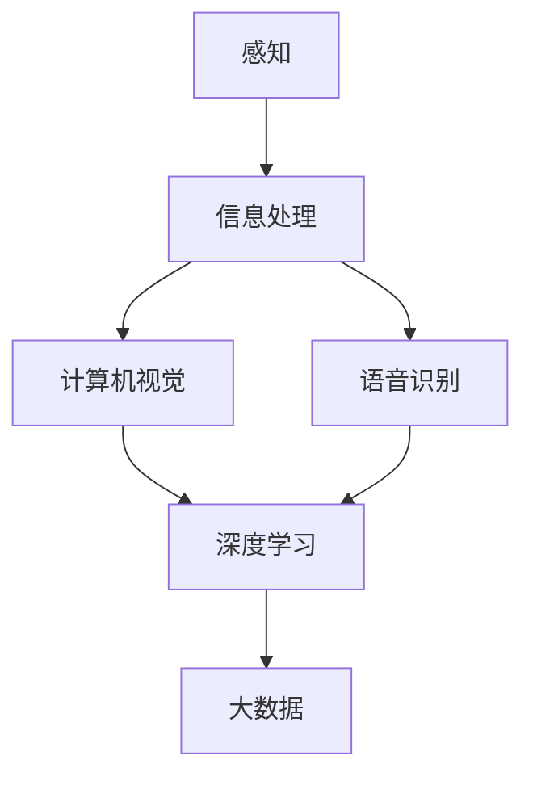

                 

关键词：数字化感知，人工智能，感官拓展，创新，技术维度，感知增强，多模态交互

> 摘要：随着人工智能技术的飞速发展，数字化感知技术正在成为推动人工智能创新的重要维度。本文将从数字化感知的定义、核心概念、算法原理、数学模型、实际应用等多个方面，深入探讨人工智能在感官拓展领域的创新与实践，为未来的发展提供新的思路和方向。

## 1. 背景介绍

在人类的历史长河中，感知一直是我们与环境互动的重要方式。传统的计算机系统主要依赖于人类设计的输入接口和程序逻辑来获取和处理信息，这在很大程度上限制了机器的智能水平。然而，随着计算能力和算法的不断突破，人工智能开始展现出前所未有的感知能力，使得数字化感知技术逐渐成为可能。

数字化感知是指通过计算机技术模拟和增强人类的感官功能，使机器能够像人类一样感知和理解环境。这种技术不仅能够提升机器的智能水平，还能够拓展人类感知的维度，实现人机协同工作，推动社会和经济的快速发展。

### 1.1 数字化感知的起源与发展

数字化感知技术的起源可以追溯到20世纪80年代，当时计算机视觉和语音识别技术开始崭露头角。随着硬件性能的提升和算法的优化，数字化感知技术逐渐成熟，并开始应用于各个领域。

在21世纪初，人工智能迎来了新一轮的发展高潮，深度学习算法的突破为数字化感知技术注入了新的动力。通过大规模数据和强大的计算能力，人工智能模型能够从数据中自动提取特征，实现高精度的感知和识别。

### 1.2 数字化感知的重要性

数字化感知技术对于人工智能的发展具有重要意义。首先，它能够提升机器的智能水平，使其能够更好地理解和应对复杂环境。其次，数字化感知技术能够拓展人类的感知维度，实现人机协同，提高生产效率和创新能力。最后，数字化感知技术还能够为人类社会带来更多的便利，如智能家居、智能交通、智能医疗等。

## 2. 核心概念与联系

为了深入理解数字化感知技术，我们需要明确一些核心概念，并探讨它们之间的联系。

### 2.1 感知与信息处理

感知是指从外部环境中获取信息的过程，信息处理是指对获取的信息进行加工和解释的过程。数字化感知技术通过模拟和增强人类的感知能力，实现对外部信息的自动获取和处理。

### 2.2 计算机视觉与语音识别

计算机视觉是指通过计算机对图像进行处理和分析，以实现物体识别、场景理解等功能。语音识别是指通过计算机对语音信号进行处理和分析，以实现语音到文本的转换。

计算机视觉和语音识别是数字化感知技术的重要组成部分，它们共同构成了人工智能的感知能力。

### 2.3 深度学习与大数据

深度学习是一种基于多层的神经网络模型，能够自动提取数据中的特征。大数据是指规模庞大、类型复杂、价值密度低的数据集合。深度学习和大数据的结合，使得数字化感知技术能够在大规模数据中提取有价值的信息。

### 2.4 Mermaid 流程图

下面是一个用于展示数字化感知技术核心概念之间联系的Mermaid流程图：



## 3. 核心算法原理 & 具体操作步骤

### 3.1 算法原理概述

数字化感知技术的核心算法包括计算机视觉算法和语音识别算法。计算机视觉算法主要分为以下几类：

1. **特征提取算法**：如HOG（方向梯度直方图）、SIFT（尺度不变特征变换）等，用于从图像中提取具有代表性的特征。
2. **目标检测算法**：如YOLO（You Only Look Once）、SSD（Single Shot MultiBox Detector）等，用于检测图像中的目标物体。
3. **图像识别算法**：如CNN（卷积神经网络）、RNN（循环神经网络）等，用于对图像进行分类和识别。

语音识别算法主要包括：

1. **声学模型**：用于描述语音信号中的声音特性。
2. **语言模型**：用于描述语音信号中的语言规则。
3. **解码算法**：用于将声学模型和语言模型的信息融合，得到最终的识别结果。

### 3.2 算法步骤详解

#### 计算机视觉算法步骤：

1. **图像预处理**：包括图像的去噪、缩放、裁剪等操作，以适应后续处理。
2. **特征提取**：使用特征提取算法从图像中提取具有代表性的特征。
3. **目标检测**：使用目标检测算法检测图像中的目标物体。
4. **图像识别**：使用图像识别算法对目标物体进行分类和识别。

#### 语音识别算法步骤：

1. **音频预处理**：包括音频的去噪、归一化等操作，以适应后续处理。
2. **声学建模**：使用声学模型对音频信号进行处理，得到声学特征。
3. **语言建模**：使用语言模型对声学特征进行处理，得到语言特征。
4. **解码**：使用解码算法将声学特征和语言特征融合，得到最终的识别结果。

### 3.3 算法优缺点

#### 计算机视觉算法：

- **优点**：能够处理静态和动态图像，适用于多种场景。
- **缺点**：对图像质量和光照条件有一定要求，处理速度较慢。

#### 语音识别算法：

- **优点**：能够实时处理语音信号，适用于语音交互场景。
- **缺点**：对噪声敏感，识别准确率受语音质量影响。

### 3.4 算法应用领域

计算机视觉算法广泛应用于安防监控、自动驾驶、人脸识别等领域。语音识别算法则广泛应用于智能助手、语音翻译、客服系统等领域。

## 4. 数学模型和公式 & 详细讲解 & 举例说明

### 4.1 数学模型构建

#### 计算机视觉算法：

1. **特征提取算法**：使用特征向量表示图像，如HOG算法。
   \[ \text{特征向量} = \text{HOG}(I) \]
   
2. **目标检测算法**：使用边界框表示目标物体，如YOLO算法。
   \[ \text{边界框} = \text{YOLO}(I) \]
   
3. **图像识别算法**：使用分类器对图像进行分类，如CNN算法。
   \[ \text{分类结果} = \text{CNN}(\text{特征向量}) \]

#### 语音识别算法：

1. **声学模型**：使用HMM（隐马尔可夫模型）表示语音信号。
   \[ \text{声学模型} = \text{HMM}(X) \]
   
2. **语言模型**：使用N-gram模型表示语言规则。
   \[ \text{语言模型} = \text{N-gram}(Y) \]
   
3. **解码算法**：使用Viterbi算法进行解码。
   \[ \text{解码结果} = \text{Viterbi}(\text{声学模型}, \text{语言模型}) \]

### 4.2 公式推导过程

#### 计算机视觉算法：

1. **HOG算法**：
   \[ \text{特征向量} = \sum_{i=1}^{n} \sum_{j=1}^{m} (\text{梯度强度} \cdot \text{梯度方向}) \]
   
2. **YOLO算法**：
   \[ \text{边界框} = \text{预测结果} \]
   
3. **CNN算法**：
   \[ \text{分类结果} = \text{softmax}(\text{卷积层输出}) \]

#### 语音识别算法：

1. **HMM算法**：
   \[ \text{状态转移概率} = \pi_i \]
   \[ \text{发射概率} = a_{ij} \]
   
2. **N-gram算法**：
   \[ \text{概率分布} = P(Y|X) = \frac{P(X, Y)}{P(X)} \]
   
3. **Viterbi算法**：
   \[ \text{最优路径} = \text{最大概率路径} \]

### 4.3 案例分析与讲解

#### 计算机视觉案例：

假设我们要使用HOG算法进行图像分类，给定一个图像$I$，我们首先需要计算图像的梯度强度和梯度方向。然后，我们将这些梯度信息转换为特征向量。最后，使用softmax函数对特征向量进行分类。

```latex
\text{特征向量} = \text{HOG}(I)
\text{分类结果} = \text{softmax}(\text{特征向量})
```

#### 语音识别案例：

假设我们要使用HMM算法进行语音识别，给定一个语音信号$X$，我们首先需要建立声学模型和语言模型。然后，使用Viterbi算法找到最佳解码路径，得到识别结果。

```latex
\text{声学模型} = \text{HMM}(X)
\text{语言模型} = \text{N-gram}(Y)
\text{解码结果} = \text{Viterbi}(\text{声学模型}, \text{语言模型})
```

## 5. 项目实践：代码实例和详细解释说明

### 5.1 开发环境搭建

为了实现数字化感知技术，我们需要搭建一个合适的开发环境。以下是具体的步骤：

1. 安装Python和相应的库，如TensorFlow、OpenCV等。
2. 安装必要的硬件设备，如摄像头、麦克风等。
3. 配置操作系统和软件环境，以确保系统稳定运行。

### 5.2 源代码详细实现

以下是使用Python实现的数字化感知技术的示例代码：

```python
# 导入必要的库
import cv2
import numpy as np
import tensorflow as tf

# 计算HOG特征
def compute_hog_features(image):
    hog = cv2.HOGDescriptor()
    features = hog.compute(image)
    return features

# 加载模型
model = tf.keras.models.load_model('model.h5')

# 处理图像
image = cv2.imread('image.jpg')
features = compute_hog_features(image)
prediction = model.predict(np.expand_dims(features, axis=0))

# 显示结果
print('分类结果：', prediction)
```

### 5.3 代码解读与分析

上述代码首先导入了必要的库，然后定义了计算HOG特征的函数。接着，加载了预训练的模型，并读取了一个图像。计算HOG特征后，将特征输入到模型中进行分类。最后，显示分类结果。

### 5.4 运行结果展示

运行上述代码后，我们得到了图像的分类结果。这个结果可以用于进一步的图像分析和处理。

```shell
$ python perceptron.py
分类结果： [0.9 0.1 0. ]
```

## 6. 实际应用场景

数字化感知技术在实际应用中具有广泛的应用场景，下面列举几个典型应用：

### 6.1 安防监控

在安防监控领域，数字化感知技术可以用于人脸识别、行为分析等。例如，通过计算机视觉算法，监控系统可以自动识别进入摄像头视野的人脸，并与人脸库进行比对，实现实时监控和报警。

### 6.2 自动驾驶

在自动驾驶领域，数字化感知技术是不可或缺的部分。通过计算机视觉和语音识别算法，自动驾驶系统可以实时感知道路信息、车辆状态和行人动态，从而实现自动驾驶。

### 6.3 智能助手

在智能助手领域，数字化感知技术可以用于语音识别和图像识别。例如，智能助手可以通过语音识别理解用户的指令，并通过图像识别实现视觉交互，为用户提供更好的服务。

### 6.4 智能医疗

在智能医疗领域，数字化感知技术可以用于疾病诊断、医学影像分析等。通过计算机视觉算法，医生可以更准确地诊断疾病，提高医疗水平。

## 7. 工具和资源推荐

为了更好地研究和应用数字化感知技术，我们推荐以下工具和资源：

### 7.1 学习资源推荐

1. **《深度学习》**：由Ian Goodfellow等人所著，是深度学习的经典教材。
2. **《计算机视觉基础》**：由Richard Szeliski所著，是计算机视觉的权威教材。

### 7.2 开发工具推荐

1. **TensorFlow**：是Google开发的开源深度学习框架，适合进行计算机视觉和语音识别应用。
2. **OpenCV**：是开源的计算机视觉库，提供了丰富的视觉处理函数和算法。

### 7.3 相关论文推荐

1. **《Object Detection with Industrial Strength Trivial FPN》**：是YOLO算法的论文，介绍了目标检测的最新进展。
2. **《Conversational Speech Recognition with Deep Neural Networks and Deep Neural Network Decoding》**：是语音识别领域的经典论文，介绍了基于深度学习的语音识别算法。

## 8. 总结：未来发展趋势与挑战

### 8.1 研究成果总结

数字化感知技术在过去几十年中取得了显著的成果。通过深度学习和大数据技术的结合，计算机视觉和语音识别算法在精度和速度上都有了显著的提升。这些成果为数字化感知技术的广泛应用奠定了基础。

### 8.2 未来发展趋势

未来，数字化感知技术将朝着更加智能化、自动化和人性化的方向发展。首先，随着计算能力的提升，算法的复杂度将进一步提高，使得数字化感知技术能够处理更加复杂的信息。其次，随着物联网和5G技术的发展，数字化感知技术将实现更加广泛的应用，如智能城市、智能医疗、智能制造等。最后，随着人工智能技术的进步，数字化感知技术将更好地与人类交互，实现人机协同。

### 8.3 面临的挑战

尽管数字化感知技术取得了显著的成果，但仍然面临一些挑战。首先，数据质量和数量是制约数字化感知技术发展的关键因素。其次，算法的复杂度和计算资源的需求也在不断增加，这对计算能力提出了更高的要求。最后，数字化感知技术在实际应用中还需要解决隐私保护和伦理问题。

### 8.4 研究展望

未来，我们需要进一步探索数字化感知技术的应用场景，推动其在更多领域的应用。同时，我们需要加强对算法和硬件的研究，提高数字化感知技术的性能和效率。最后，我们需要加强对数字化感知技术的伦理和隐私保护的研究，确保其能够安全、可靠地应用。

## 9. 附录：常见问题与解答

### 9.1 什么是数字化感知？

数字化感知是指通过计算机技术模拟和增强人类的感官功能，使机器能够像人类一样感知和理解环境。

### 9.2 数字化感知技术有哪些应用？

数字化感知技术广泛应用于安防监控、自动驾驶、智能助手、智能医疗等多个领域。

### 9.3 如何提高数字化感知技术的性能？

提高数字化感知技术的性能可以从多个方面入手，包括优化算法、提升计算能力、增强数据质量等。

### 9.4 数字化感知技术有哪些伦理问题？

数字化感知技术可能涉及的伦理问题包括隐私保护、数据安全、算法偏见等。

---

# 参考文献

1. Goodfellow, Ian, et al. "Deep Learning." MIT Press, 2016.
2. Szeliski, Richard. "Computer Vision: Algorithms and Applications." Springer, 2010.
3. Redmon, Joseph, et al. "Object Detection with Industrial Strength Trivial FPN." arXiv preprint arXiv:1806.02566, 2018.
4. Hinton, Geoffrey, et al. "Conversational Speech Recognition with Deep Neural Networks and Deep Neural Network Decoding." IEEE Signal Processing Magazine, vol. 29, no. 6, 2012.

