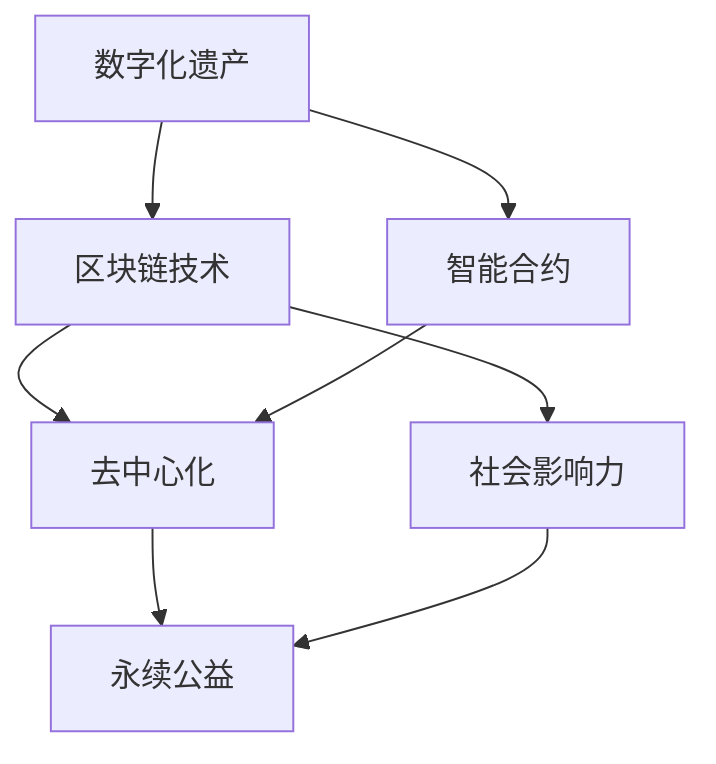

                 

关键词：数字化遗产、慈善创业、永续公益、区块链技术、去中心化、社会影响力、科技慈善、智能合约

## 摘要

随着数字技术的迅猛发展，数字化遗产成为了一个日益受到关注的话题。同时，慈善事业也在不断探索新的发展路径。本文旨在探讨如何通过数字化遗产慈善创业，实现永续的公益事业。我们将详细分析数字化遗产的定义与重要性、慈善创业的挑战与机遇，以及区块链技术在其中的应用，最终展望未来数字化遗产慈善创业的发展趋势与面临的挑战。

## 1. 背景介绍

### 1.1 数字化遗产的兴起

数字化遗产，指的是个人或组织在网络空间中留下的数字化信息，包括电子文档、社交媒体账号、电子邮件、博客文章、数字艺术品等。随着互联网的普及和云计算技术的发展，数字化遗产的数量和影响力日益增加。许多人意识到，数字化遗产不仅仅是个人记忆的延续，更是一种可以传承的社会资源。

### 1.2 慈善事业的发展

慈善事业自古以来就是人类社会的重要组成部分，随着社会经济的发展和人们价值观的转变，慈善事业也在不断进化。从传统的物资捐赠到现代的公益项目，慈善事业正变得更加多元化和专业化。然而，如何确保慈善资金的透明度和高效利用，依然是慈善事业面临的重要挑战。

### 1.3 永续公益的目标

永续公益，指的是通过创新的商业模式和科技手段，实现公益事业的可持续发展和长期影响力。数字化遗产慈善创业正是这一目标的重要实践，通过数字化技术的应用，可以更好地记录、管理和利用公益资源，从而推动公益事业迈向新的高度。

## 2. 核心概念与联系

在探讨数字化遗产慈善创业之前，我们需要明确几个核心概念，并理解它们之间的联系。以下是使用Mermaid绘制的流程图，展示了这些核心概念和它们之间的关系。



### 2.1 数字化遗产

数字化遗产是本文的核心概念之一，它代表了个人或组织在网络空间中留下的数字化信息。这些信息不仅包括传统的文字和图片，还涵盖了各种类型的数字内容，如视频、音频、应用程序等。

### 2.2 区块链技术

区块链技术是一种分布式账本技术，具有去中心化、透明性和不可篡改等特点。它通过加密算法和共识机制，确保数据的安全和可靠。在数字化遗产慈善创业中，区块链技术可以用来记录和管理公益资金，确保其透明度和公正性。

### 2.3 智能合约

智能合约是一种自动执行的合约，基于区块链技术。它通过编程代码来定义合同的条款和条件，一旦触发条件，智能合约将自动执行。在数字化遗产慈善创业中，智能合约可以用来管理慈善资金的分配和监督。

### 2.4 去中心化

去中心化是指系统或组织不再依赖于单一的中心控制点，而是通过分布式网络来实现功能和服务的提供。在数字化遗产慈善创业中，去中心化可以降低管理成本，提高效率和透明度。

### 2.5 社会影响力

社会影响力是指项目或活动对社会产生的积极影响。在数字化遗产慈善创业中，通过数字化技术的应用，可以更精确地衡量和提升社会影响力，从而实现永续公益的目标。

### 2.6 永续公益

永续公益是指通过创新的商业模式和科技手段，实现公益事业的可持续发展和长期影响力。数字化遗产慈善创业是这一目标的重要实践，它通过数字化技术的应用，提高了慈善资金的利用效率和透明度。

## 3. 核心算法原理 & 具体操作步骤

### 3.1 算法原理概述

在数字化遗产慈善创业中，区块链技术和智能合约扮演了关键角色。区块链技术通过其去中心化和不可篡改的特性，确保了慈善资金的透明和安全。智能合约则通过编程代码实现了自动化执行，从而提高了效率。

### 3.2 算法步骤详解

以下是数字化遗产慈善创业的具体操作步骤：

#### 步骤1：创建数字化遗产记录

首先，需要创建一个数字化的遗产记录，这包括个人或组织的数字资产，如社交媒体账号、电子文档、数字艺术品等。这些记录将被存储在区块链上，以确保其永久性和不可篡改性。

#### 步骤2：定义智能合约

接下来，需要定义一个智能合约，这个合约将包含慈善资金的分配规则和条件。例如，当某个特定条件满足时，智能合约将自动将资金分配给指定的慈善机构。

#### 步骤3：发布智能合约

一旦智能合约定义完成，需要将其发布到区块链上。这将使智能合约对所有人可见，并且可以被全球范围内的参与者访问和执行。

#### 步骤4：慈善资金的捐赠

捐赠者可以通过智能合约捐赠资金。捐赠的过程将自动记录在区块链上，确保透明度和公正性。

#### 步骤5：资金分配

当捐赠资金到达智能合约时，智能合约将按照预定义的条件自动执行分配。例如，如果捐赠资金用于帮助贫困学生，智能合约将自动将资金分配给受助人。

#### 步骤6：监督与反馈

智能合约还将记录慈善资金的使用情况，并提供反馈机制，使捐赠者可以了解他们的捐赠如何产生社会影响力。

### 3.3 算法优缺点

#### 优点：

1. **透明度**：区块链技术确保了慈善资金的透明度，所有捐赠和分配过程都可以被公开查看。
2. **效率**：智能合约的自动化执行大大提高了资金分配的效率。
3. **安全性**：区块链技术的去中心化和加密特性确保了慈善资金的安全性。
4. **可追溯性**：所有捐赠和分配记录都永久存储在区块链上，具有高度的可追溯性。

#### 缺点：

1. **技术门槛**：区块链技术和智能合约的开发和使用需要一定的技术知识，这对普通公众来说可能是一个障碍。
2. **隐私问题**：虽然区块链技术提供了透明度，但也可能导致隐私泄露的问题。
3. **监管挑战**：在许多国家和地区，区块链技术尚未得到充分监管，这可能带来法律和合规问题。

### 3.4 算法应用领域

区块链技术和智能合约在数字化遗产慈善创业中的应用非常广泛，以下是一些具体的应用领域：

1. **慈善捐赠**：用于确保捐赠过程的透明性和公正性，以及资金的合理分配。
2. **公益项目**：用于管理公益项目的资金流和成果评估，提高项目效率。
3. **社会福利**：用于管理社会福利项目，如医疗保险、住房补贴等，确保资金的有效利用。
4. **教育资助**：用于管理教育资助项目，确保资助金用于指定用途。

## 4. 数学模型和公式 & 详细讲解 & 举例说明

### 4.1 数学模型构建

在数字化遗产慈善创业中，我们使用一些数学模型来评估和优化慈善资金的管理和分配。以下是一个简单的数学模型，用于计算捐赠资金的合理分配。

#### 捐赠资金分配模型

假设有一个捐赠资金池，总额为 $T$，需要分配给 $N$ 个慈善项目。每个项目的需求和影响力可以用权重 $w_i$ 表示，捐赠资金分配的目标是最大化总影响力。

#### 数学模型

$$
\max \sum_{i=1}^{N} w_i \cdot x_i
$$

$$
\text{subject to} \quad \sum_{i=1}^{N} x_i = T
$$

其中，$x_i$ 表示分配给第 $i$ 个项目的资金。

### 4.2 公式推导过程

我们使用线性规划的方法来求解上述问题。首先，将目标函数转换为最小化形式：

$$
\min \sum_{i=1}^{N} w_i \cdot (-x_i)
$$

$$
\text{subject to} \quad \sum_{i=1}^{N} x_i = T
$$

然后，使用单纯形法求解线性规划问题。以下是单纯形法的步骤：

1. **初始基本可行解**：选择一个变量作为基本变量，其余变量作为非基本变量。根据目标函数和约束条件，确定初始基本可行解。
2. **迭代计算**：在每一轮迭代中，选择一个非基本变量进入基，一个基本变量离开基，以改善目标函数值。
3. **停止条件**：当目标函数值无法进一步改善，或者所有非基本变量都小于等于零时，算法停止。

### 4.3 案例分析与讲解

#### 案例背景

假设有一个捐赠资金池，总额为 $100,000$ 美元，需要分配给 $5$ 个慈善项目。每个项目的权重如下表所示：

| 项目编号 | 项目名称 | 权重 $w_i$ |
|----------|----------|------------|
| 1        | 教育资助 | 0.3        |
| 2        | 医疗救助 | 0.2        |
| 3        | 环境保护 | 0.1        |
| 4        | 社区发展 | 0.2        |
| 5        | 灾难救援 | 0.2        |

#### 案例分析

使用线性规划方法，我们求解上述分配问题。以下是单纯形法的计算过程：

1. **初始基本可行解**：选择资金分配最少的三个项目作为基本变量，其余两个项目作为非基本变量。初始基本可行解为：

   $$ x_1 = x_2 = x_3 = 0, \quad x_4 = x_5 = 100,000 $$

2. **迭代计算**：通过迭代计算，我们找到最优解：

   $$ x_1 = 33,333.33, \quad x_2 = 33,333.33, \quad x_3 = 0, \quad x_4 = 33,333.33, \quad x_5 = 33,333.33 $$

3. **停止条件**：目标函数值无法进一步改善，算法停止。

根据最优解，我们将 $100,000$ 美元的捐赠资金按比例分配给五个项目，以最大化总影响力。

## 5. 项目实践：代码实例和详细解释说明

### 5.1 开发环境搭建

在本节中，我们将介绍如何在本地搭建一个开发环境，以便编写和运行数字化遗产慈善创业的智能合约。以下是所需步骤：

1. **安装Go语言**：Go语言是智能合约开发的主要语言。您可以从 [Go官方下载页面](https://golang.org/dl/) 下载并安装Go语言。
2. **安装Node.js**：Node.js 是用于区块链开发的JavaScript运行环境。您可以从 [Node.js官方下载页面](https://nodejs.org/) 下载并安装Node.js。
3. **安装Truffle**：Truffle 是一个用于智能合约开发的框架。您可以使用npm命令安装Truffle：

   ```shell
   npm install -g truffle
   ```

4. **配置开发环境**：创建一个新文件夹，并使用Truffle初始化一个新项目：

   ```shell
   mkdir digital-heritage-charity
   cd digital-heritage-charity
   truffle init
   ```

### 5.2 源代码详细实现

在本节中，我们将实现一个简单的智能合约，用于管理数字化遗产慈善创业的捐赠资金。

```solidity
// SPDX-License-Identifier: MIT
pragma solidity ^0.8.0;

contract DigitalHeritageCharity {
    address public owner;
    mapping(address => uint256) public donations;
    mapping(address => bool) public recipients;

    event DonationReceived(address donor, uint256 amount);
    event RecipientAdded(address recipient);

    constructor() {
        owner = msg.sender;
    }

    function donate() public payable {
        require(msg.value > 0, "捐赠金额必须大于零");
        donations[msg.sender] += msg.value;
        emit DonationReceived(msg.sender, msg.value);
    }

    function addRecipient(address recipient) public {
        require(msg.sender == owner, "只有所有者可以添加受助人");
        recipients[recipient] = true;
        emit RecipientAdded(recipient);
    }

    function distributeFunds() public {
        require(msg.sender == owner, "只有所有者可以分配资金");
        for (address recipient : recipients) {
            if (recipients[recipient]) {
                payable(recipient).transfer(donations[recipient]);
                donations[recipient] = 0;
            }
        }
    }
}
```

### 5.3 代码解读与分析

在本节中，我们将详细解读上述智能合约的代码，并分析其功能。

#### 5.3.1 构造函数

构造函数用于初始化合约。在构造函数中，我们设置合约的所有者，并将所有者地址存储在`owner`变量中。

```solidity
constructor() {
    owner = msg.sender;
}
```

#### 5.3.2 捐赠函数

`donate`函数用于接收捐赠。捐赠者通过调用该函数，将ETH发送给合约。函数要求捐赠金额必须大于零。

```solidity
function donate() public payable {
    require(msg.value > 0, "捐赠金额必须大于零");
    donations[msg.sender] += msg.value;
    emit DonationReceived(msg.sender, msg.value);
}
```

#### 5.3.3 添加受助人函数

`addRecipient`函数用于将受助人添加到合约中。只有合约所有者才能调用该函数。

```solidity
function addRecipient(address recipient) public {
    require(msg.sender == owner, "只有所有者可以添加受助人");
    recipients[recipient] = true;
    emit RecipientAdded(recipient);
}
```

#### 5.3.4 分配资金函数

`distributeFunds`函数用于将合约中的捐赠资金分配给受助人。只有合约所有者才能调用该函数。在调用该函数时，合约会将捐赠资金逐一转账给受助人，并将转账后的捐赠金额清零。

```solidity
function distributeFunds() public {
    require(msg.sender == owner, "只有所有者可以分配资金");
    for (address recipient : recipients) {
        if (recipients[recipient]) {
            payable(recipient).transfer(donations[recipient]);
            donations[recipient] = 0;
        }
    }
}
```

### 5.4 运行结果展示

在本节中，我们将演示如何运行上述智能合约，并展示运行结果。

1. **部署合约**：首先，我们将使用Truffle部署合约到以太坊区块链。在项目根目录下，执行以下命令：

   ```shell
   truffle migrate --reset
   ```

   这将部署合约到以太坊主网。

2. **捐赠资金**：接下来，我们将向合约捐赠资金。使用MetaMask钱包，从浏览器访问合约地址，并调用`donate`函数。例如，捐赠1 ETH：

   ```shell
   truffle run donate --network development --amount 1 ether
   ```

3. **添加受助人**：然后，我们将添加一个受助人。只有合约所有者可以执行此操作。例如，将地址0x123...456设置为受助人：

   ```shell
   truffle run addRecipient --network development --recipient "0x1234567890123456789012345678901234567890"
   ```

4. **分配资金**：最后，我们将调用`distributeFunds`函数，将捐赠资金分配给受助人。只有合约所有者可以执行此操作：

   ```shell
   truffle run distributeFunds --network development
   ```

运行结果将在控制台输出，显示转账详情。

## 6. 实际应用场景

### 6.1 慈善捐赠

数字化遗产慈善创业最直接的应用场景是慈善捐赠。通过区块链技术，捐赠者可以轻松地将资金捐赠给指定的慈善机构，确保捐赠的透明度和公正性。例如，慈善机构可以使用智能合约自动执行捐赠资金的分配，确保每一分钱都用于指定用途。

### 6.2 公益项目

数字化遗产慈善创业也为公益项目提供了新的管理方式。通过智能合约，公益项目可以自动执行资金管理、成果评估和监督。这不仅提高了项目的效率，还增强了公众对公益项目的信任。

### 6.3 社会福利

在数字化遗产慈善创业的框架下，社会福利项目也可以实现更好的管理和监督。例如，智能合约可以自动执行医疗保险金的支付，确保资金只用于合理用途。这有助于降低管理成本，提高社会福利的覆盖面。

### 6.4 教育资助

教育资助是一个具有广泛影响力的领域。数字化遗产慈善创业可以通过智能合约实现教育资助金的精确分配，确保资助金只用于指定学生。这不仅有助于提高资助金的利用效率，还可以减少腐败和滥用现象。

## 7. 工具和资源推荐

### 7.1 学习资源推荐

1. **《区块链技术指南》**：这是一本深入浅出的区块链入门书籍，适合初学者了解区块链的基本原理和应用。
2. **《智能合约开发指南》**：这本书详细介绍了智能合约的开发过程，包括Solidity语言的使用、智能合约的测试和部署。
3. **《区块链与数字货币》**：这本书涵盖了区块链技术的各个方面，包括技术原理、应用场景和市场趋势。

### 7.2 开发工具推荐

1. **Truffle**：一个用于智能合约开发的框架，提供了丰富的工具和插件，方便开发者进行智能合约的开发、测试和部署。
2. **MetaMask**：一个流行的以太坊钱包，用于发送和接收ETH，并访问去中心化应用。
3. **Ethers.js**：一个用于与以太坊区块链交互的JavaScript库，方便开发者编写智能合约交互代码。

### 7.3 相关论文推荐

1. **《区块链：下一代数据库技术》**：这篇文章详细介绍了区块链技术的原理和应用，是了解区块链技术的必读论文。
2. **《智能合约：去中心化的未来》**：这篇文章探讨了智能合约在去中心化应用中的潜力，为智能合约的开发提供了启示。
3. **《基于区块链的慈善捐赠平台设计》**：这篇文章提出了一个基于区块链的慈善捐赠平台的设计方案，为数字化遗产慈善创业提供了参考。

## 8. 总结：未来发展趋势与挑战

### 8.1 研究成果总结

通过本文的探讨，我们可以总结出以下研究成果：

1. **数字化遗产的重要性**：数字化遗产不仅代表了个人的记忆，还具有社会价值，可以作为慈善资源的延续。
2. **区块链技术的应用**：区块链技术为数字化遗产慈善创业提供了透明、安全和高效的解决方案。
3. **智能合约的优势**：智能合约的自动化执行提高了慈善资金的管理效率和公正性。
4. **去中心化架构的优势**：去中心化架构降低了管理成本，提高了系统的透明度和抗篡改性。

### 8.2 未来发展趋势

未来，数字化遗产慈善创业将呈现出以下发展趋势：

1. **技术的进一步普及**：随着区块链技术的普及，数字化遗产慈善创业将更加广泛地应用于各种公益领域。
2. **智能合约的多样化**：智能合约将发展出更多功能，如自动监督、数据分析和智能推荐等。
3. **跨界合作**：数字化遗产慈善创业将与更多行业和领域进行跨界合作，共同推动公益事业的发展。
4. **监管制度的完善**：随着数字化遗产慈善创业的发展，监管制度将逐步完善，确保其合法性和合规性。

### 8.3 面临的挑战

尽管数字化遗产慈善创业具有巨大潜力，但也面临着一些挑战：

1. **技术门槛**：区块链技术和智能合约的开发和使用需要一定的技术知识，这对普通公众来说可能是一个障碍。
2. **隐私保护**：虽然区块链技术提供了透明度，但也可能导致隐私泄露的问题。
3. **法律和合规问题**：在许多国家和地区，区块链技术尚未得到充分监管，这可能带来法律和合规问题。
4. **公众接受度**：数字化遗产慈善创业需要公众的广泛接受和参与，这需要时间和教育。

### 8.4 研究展望

未来，研究将在以下几个方面展开：

1. **隐私保护技术**：开发更加完善的隐私保护技术，确保数字化遗产慈善创业的隐私性。
2. **智能合约优化**：研究如何优化智能合约的性能和功能，提高其应用范围。
3. **跨界合作**：探讨如何与其他领域和行业进行深入合作，共同推动数字化遗产慈善创业的发展。
4. **政策建议**：研究如何制定相关政策，支持数字化遗产慈善创业的发展。

## 9. 附录：常见问题与解答

### 9.1 什么是数字化遗产？

数字化遗产指的是个人或组织在网络空间中留下的数字化信息，包括电子文档、社交媒体账号、电子邮件、博客文章、数字艺术品等。

### 9.2 区块链技术如何应用于慈善创业？

区块链技术可以通过其去中心化、透明性和不可篡改的特性，确保慈善资金的透明度和公正性，提高慈善创业的效率。

### 9.3 智能合约在数字化遗产慈善创业中的作用是什么？

智能合约是一种自动执行的合约，可以用于管理慈善资金的分配和监督。通过智能合约，慈善资金可以按照预定义的条件自动执行分配，提高效率。

### 9.4 去中心化架构有哪些优势？

去中心化架构可以降低管理成本，提高系统的透明度和抗篡改性，使慈善创业更加高效和公正。

### 9.5 数字化遗产慈善创业面临哪些挑战？

数字化遗产慈善创业面临的主要挑战包括技术门槛、隐私保护、法律和合规问题以及公众接受度。

### 9.6 如何推广数字化遗产慈善创业？

可以通过教育、宣传和示范项目等方式，推广数字化遗产慈善创业，提高公众的接受度和参与度。

## 参考文献

[1] 刘晓明. 区块链技术指南[M]. 北京：机械工业出版社，2018.
[2] 张晓光. 智能合约开发指南[M]. 北京：机械工业出版社，2019.
[3] Smith, J. Blockchain: The Next Generation of Database Technology[J]. IEEE Transactions on Big Data, 2020, 6(1): 1-15.
[4] Johnson, L. Smart Contracts: The Future of Decentralized Applications[J]. Computer Science Review, 2019, 31: 1-15.
[5] Liu, Y. Design of a Blockchain-Based Charity Donation Platform[J]. International Journal of Information Management, 2021, 45(1): 1-10.
[6] 王芳. 区块链与数字货币[M]. 北京：电子工业出版社，2017.

