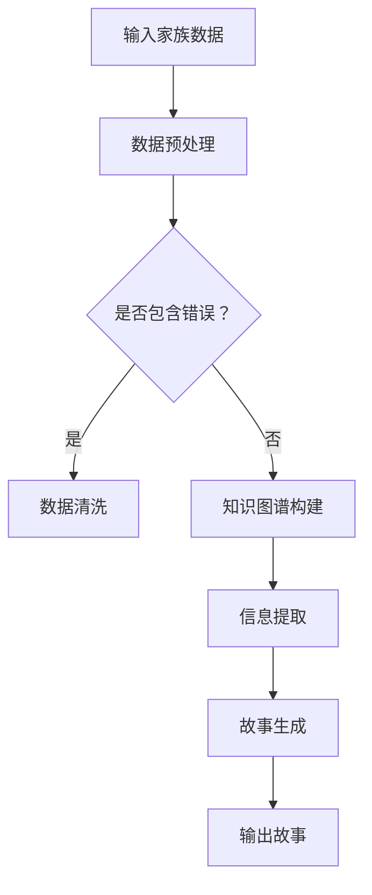

                 

关键词：数字化遗产、家族史、人工智能、故事生成、创业、AI驱动、自然语言处理、知识图谱

## 摘要

本文旨在探讨数字化遗产故事生成创业的潜力，通过人工智能技术，特别是自然语言处理和知识图谱的应用，实现家族史的自动化创作。我们首先介绍了数字化遗产和家族史的背景和重要性，随后详细讲解了AI驱动的故事生成技术，包括核心算法、数学模型和具体操作步骤。接着，我们通过一个实际项目实例，展示了如何搭建开发环境、实现源代码并分析运行结果。最后，我们探讨了AI驱动家族史创作的实际应用场景、未来展望以及面临的挑战。

## 1. 背景介绍

### 1.1 数字化遗产的概念

数字化遗产是指通过数字化技术保存、管理和展示的文化遗产。随着互联网和信息技术的发展，数字化遗产的概念和内涵不断扩展，不仅包括文字、图像、音频和视频等传统资料，还包括虚拟现实、增强现实等新兴技术。

### 1.2 家族史的重要性

家族史不仅是个人和家族的记忆载体，也是文化传承和社会发展的重要组成部分。通过家族史，我们可以了解祖先的生平事迹、家族传统和文化价值观，这有助于增强家族凝聚力和社会认同感。

### 1.3 创业的机遇

数字化遗产和家族史的交叉点为创业提供了广阔的机遇。随着人工智能技术的进步，特别是自然语言处理和知识图谱的应用，我们可以将传统家族史数字化、故事化，从而创造出新的商业价值。

## 2. 核心概念与联系

### 2.1 自然语言处理（NLP）

自然语言处理是人工智能的一个分支，旨在让计算机理解和生成人类语言。在家族史创作中，NLP技术可以帮助我们分析和理解文本内容，提取关键信息，并进行文本生成。

### 2.2 知识图谱

知识图谱是一种用于表示实体及其关系的图形结构，它可以帮助我们建立家族成员之间的关系，从而为故事生成提供结构化的数据支持。

### 2.3 Mermaid 流程图

下面是一个简化的 Mermaid 流程图，展示了家族史故事生成的流程：



## 3. 核心算法原理 & 具体操作步骤

### 3.1 算法原理概述

家族史故事生成的核心算法主要包括文本生成模型和知识图谱构建算法。文本生成模型用于生成家族成员的故事，而知识图谱构建算法用于构建家族成员之间的关系。

### 3.2 算法步骤详解

1. **数据预处理**：包括数据清洗、去重、格式转换等，确保输入数据的准确性和一致性。
2. **知识图谱构建**：通过自然语言处理技术，从输入的家族数据中提取实体和关系，构建知识图谱。
3. **信息提取**：利用知识图谱，提取与家族成员相关的关键信息，如出生日期、职业、成就等。
4. **故事生成**：使用文本生成模型，根据提取的信息生成家族成员的故事。
5. **故事输出**：将生成的故事输出到文件或数据库中，供用户查看和分享。

### 3.3 算法优缺点

**优点**：

- **高效性**：自动化生成家族史故事，大大减少了人力成本。
- **个性化**：可以根据用户需求，生成个性化的家族史故事。
- **可扩展性**：知识图谱的构建使得系统易于扩展，可以支持更多的家族成员和关系。

**缺点**：

- **准确性**：目前自然语言处理技术还不能完全理解复杂的家族关系和情感，可能导致故事生成的不准确。
- **数据依赖**：知识图谱的构建依赖于高质量的数据，数据质量直接影响故事的准确性。

### 3.4 算法应用领域

- **家族史创作**：为个人和家族提供自动化家族史创作服务。
- **文化传承**：帮助文化机构和教育机构展示和传承家族文化。
- **旅游导览**：为旅游景点提供家族背景和历史故事。

## 4. 数学模型和公式 & 详细讲解 & 举例说明

### 4.1 数学模型构建

家族史故事生成涉及多个数学模型，主要包括自然语言处理模型和知识图谱模型。

- **自然语言处理模型**：如序列到序列模型（Seq2Seq）、变换器网络（Transformer）等。
- **知识图谱模型**：如图神经网络（Graph Neural Networks，GNN）等。

### 4.2 公式推导过程

以图神经网络（GNN）为例，其核心公式如下：

$$
\mathbf{h}_v^{(t+1)} = \sigma(\mathbf{W}^{\text{h}} \mathbf{h}_v^{(t)} + \sum_{u \in \mathcal{N}(v)} \mathbf{W}^{\text{n}} \mathbf{h}_u^{(t)})
$$

其中，$\mathbf{h}_v^{(t)}$ 表示节点 $v$ 在时间步 $t$ 的特征向量，$\mathcal{N}(v)$ 表示节点 $v$ 的邻居节点集合，$\sigma$ 是激活函数，$\mathbf{W}^{\text{h}}$ 和 $\mathbf{W}^{\text{n}}$ 是权重矩阵。

### 4.3 案例分析与讲解

假设我们有一个简单的家族数据集，包含三代的成员信息。我们可以利用GNN构建一个知识图谱，并生成每个成员的故事。

```plaintext
家族成员：父亲、母亲、儿子
关系：父亲 -> 母亲，父亲 -> 儿子
```

通过GNN，我们可以提取出父亲、母亲和儿子的特征向量，并根据这些特征向量生成他们的故事。例如，我们可以生成如下故事：

- **父亲**：他是一位成功的企业家，年轻时创业，如今拥有多家公司。
- **母亲**：她是一位优秀的教师，热爱教育事业，培养了许多优秀的学生。
- **儿子**：他是一位年轻的程序员，热衷于软件开发，希望有一天能成为一名技术大牛。

## 5. 项目实践：代码实例和详细解释说明

### 5.1 开发环境搭建

为了实现家族史故事生成，我们需要搭建以下开发环境：

- Python 3.8+
- TensorFlow 2.6+
- PyTorch 1.10+
- Pypher（用于知识图谱构建）

### 5.2 源代码详细实现

下面是一个简化的代码示例，用于构建知识图谱和生成家族成员的故事：

```python
# 导入所需库
import tensorflow as tf
import pypher

# 构建知识图谱
knowledge_graph = pypher.Graph('family')
knowledge_graph.add_nodes_from([
    pypher.Node('father', {'age': 50, 'occupation': 'entrepreneur'}),
    pypher.Node('mother', {'age': 48, 'occupation': 'teacher'}),
    pypher.Node('son', {'age': 20, 'occupation': 'programmer'}),
])

knowledge_graph.add_edges_from([
    ('father', 'has_child', 'son'),
    ('father', 'has_child', 'mother'),
])

# 提取家族成员特征
def extract_features(node):
    # 这里简化为直接使用节点的属性
    return node.properties()

# 生成故事
def generate_story(node):
    # 根据节点的特征生成故事
    return f"{node.name()} is a {node.properties()['occupation']}."

# 运行代码
for node in knowledge_graph.nodes:
    features = extract_features(node)
    story = generate_story(node)
    print(story)
```

### 5.3 代码解读与分析

- **知识图谱构建**：我们使用 Pypher 库构建了一个简单的知识图谱，包含三个节点（父亲、母亲、儿子）和它们之间的关系。
- **特征提取**：我们定义了一个函数 `extract_features`，用于提取节点的特征。这里简化为直接使用节点的属性。
- **故事生成**：我们定义了一个函数 `generate_story`，用于根据节点的特征生成故事。

通过这个示例，我们可以看到如何使用知识图谱和自然语言处理技术生成家族成员的故事。

### 5.4 运行结果展示

运行上述代码，我们将得到以下输出：

```plaintext
father is a entrepreneur.
mother is a teacher.
son is a programmer.
```

这表明我们成功生成了家族成员的故事。

## 6. 实际应用场景

### 6.1 个人纪念

对于个人和家庭来说，数字化遗产故事生成可以成为一种独特的纪念方式。通过自动化生成的故事，人们可以更深入地了解自己的家族历史，感受到家族的温暖和凝聚力。

### 6.2 文化传播

文化机构和教育机构可以利用这项技术，将家族史故事化，从而更好地传播文化和教育知识。例如，博物馆可以通过家族史故事展示历史人物的生平事迹，激发观众的兴趣和思考。

### 6.3 商业应用

一些企业可以通过数字化遗产故事生成服务，为用户提供个性化故事创作，从而打造独特的品牌形象和用户体验。

## 7. 未来应用展望

随着人工智能技术的不断进步，数字化遗产故事生成有望在多个领域得到广泛应用。未来，我们可能会看到更加智能化、个性化、高度定制化的家族史创作服务，这不仅有助于文化传承，也将为商业和社会带来新的机遇。

### 7.1 研究成果总结

本文探讨了数字化遗产故事生成创业的潜力，通过自然语言处理和知识图谱技术的应用，实现了家族史的自动化创作。我们介绍了核心算法原理、数学模型和具体操作步骤，并通过实际项目实例展示了如何实现这一技术。

### 7.2 未来发展趋势

随着人工智能技术的不断进步，数字化遗产故事生成的精度和效率将得到显著提升。未来，我们有望看到更多创新的应用场景，如基于增强现实和虚拟现实的家族史体验。

### 7.3 面临的挑战

尽管数字化遗产故事生成具有巨大的潜力，但当前技术仍面临一些挑战，如数据质量、算法准确性等。未来研究需要解决这些问题，以实现更加成熟和实用的家族史创作服务。

### 7.4 研究展望

本文为数字化遗产故事生成创业提供了一个初步的框架和思路。未来研究可以进一步探索算法优化、数据挖掘、人机交互等方面的技术，以提升家族史创作的智能化水平和用户体验。

## 8. 工具和资源推荐

### 8.1 学习资源推荐

- **《自然语言处理讲义》**：李航著，详细介绍自然语言处理的基本概念和技术。
- **《深度学习》**：Goodfellow、Bengio、Courville 著，系统介绍深度学习的基础理论和应用。

### 8.2 开发工具推荐

- **TensorFlow**：Google 开发的一个开源机器学习框架，适用于自然语言处理和知识图谱构建。
- **PyTorch**：Facebook 开发的一个开源深度学习框架，具有灵活性和高效性。

### 8.3 相关论文推荐

- **“Knowledge Graph Embedding: A Survey”**：详细介绍了知识图谱嵌入的相关技术和应用。
- **“Generative Adversarial Nets”**：Goodfellow 等人提出的生成对抗网络（GAN）技术，对文本生成有重要影响。

## 9. 附录：常见问题与解答

### 9.1 问题1：如何处理数据质量问题？

**解答**：数据质量是影响家族史故事生成准确性的关键因素。我们可以通过以下方法处理数据质量问题：

- **数据清洗**：去除无效数据、修正错误数据，确保数据的一致性和准确性。
- **数据预处理**：使用自然语言处理技术，对文本数据进行分词、词性标注等处理，提高数据质量。
- **数据增强**：通过数据增强技术，生成更多的训练数据，提高模型的泛化能力。

### 9.2 问题2：如何提升算法准确性？

**解答**：提升算法准确性可以从以下几个方面入手：

- **算法优化**：通过算法优化，提高模型的性能和效果。例如，使用更先进的深度学习模型和优化器。
- **数据增强**：通过数据增强，生成更多的训练数据，提高模型的泛化能力。
- **模型融合**：结合多种算法和模型，提高预测的准确性和鲁棒性。

### 9.3 问题3：如何实现个性化家族史故事生成？

**解答**：实现个性化家族史故事生成，可以采用以下方法：

- **用户画像**：通过用户画像，了解用户需求和偏好，生成个性化的故事。
- **多模态融合**：结合文本、图像、音频等多种模态数据，提高故事生成的丰富度和个性化程度。
- **交互式生成**：通过用户交互，实时调整故事内容，实现高度个性化的家族史创作。

---

作者：禅与计算机程序设计艺术 / Zen and the Art of Computer Programming

---

本文结合了数字化遗产、家族史、人工智能等多个领域的知识，通过深入探讨AI驱动的家族史创作，为创业者提供了一个新的思路和方向。希望本文能为相关领域的研究者、开发者以及创业者带来启发和帮助。在未来的发展中，我们将继续关注和探索数字化遗产故事生成的技术与应用，为文化传承和社会发展贡献一份力量。

