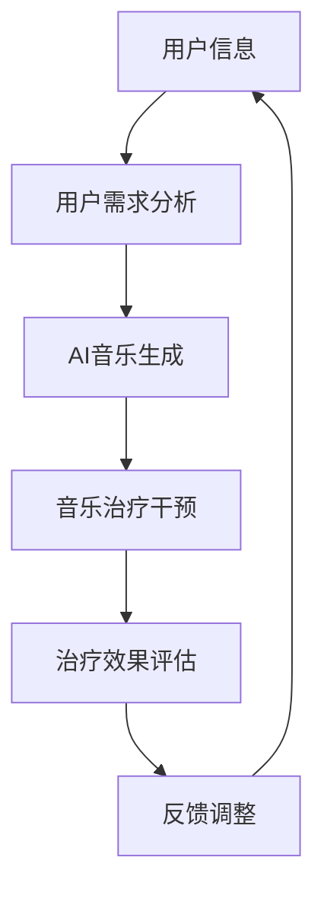
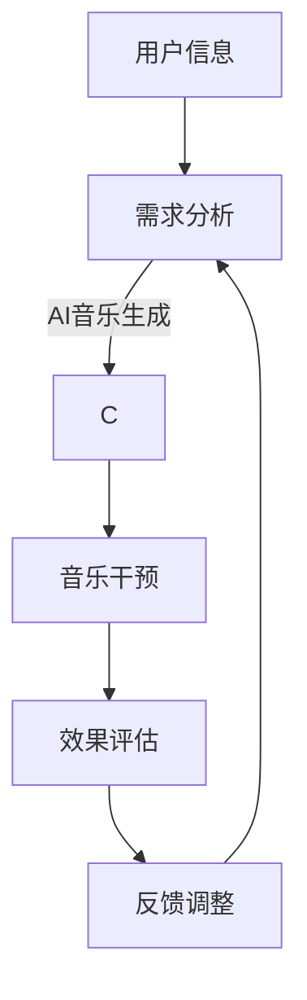

                 

关键词：数字化音乐治疗、AI生成、治愈音乐、技术创业

摘要：本文探讨了数字化音乐治疗在AI生成领域的应用，介绍了AI生成治愈音乐的基本原理、算法模型以及实际案例。文章旨在为读者提供一个全面的技术视角，了解如何在数字化时代利用AI技术开展音乐治疗创业，并预测其未来的发展趋势和挑战。

## 1. 背景介绍

随着人工智能（AI）技术的迅猛发展，计算机已经能够在各种复杂任务中表现出人类难以匹敌的能力。在音乐创作领域，AI的应用越来越受到关注。近年来，一些AI系统如AIVA（Artificial Intelligence Virtual Artist）、Amper等，已经能够创作出风格独特的音乐作品，甚至参与音乐比赛并获得好评。与此同时，音乐治疗作为一种通过音乐干预改善人们心理健康的方法，也逐渐被认可和推广。

数字化音乐治疗利用数字技术，特别是AI，为患者提供个性化的音乐治疗方案。这种治疗方法不仅可以节省时间和成本，还能提高患者的参与度和治疗效果。然而，将AI技术应用于音乐治疗创业仍面临许多挑战，如算法的准确性、音乐的个性化定制以及患者接受度等。

本文将探讨如何利用AI生成治愈音乐，并将其应用于数字化音乐治疗创业。我们将详细分析AI生成治愈音乐的基本原理、算法模型，并结合实际案例进行讨论。此外，本文还将介绍当前市场上已有的相关产品和服务，以及未来的发展趋势和面临的挑战。

## 2. 核心概念与联系

### 2.1. 数字化音乐治疗

数字化音乐治疗是指通过数字技术，如AI、大数据分析等，对患者进行音乐干预，以达到治疗目的。数字化音乐治疗的核心目标是提高治疗效果，同时降低治疗成本。

### 2.2. AI生成音乐

AI生成音乐是指利用人工智能算法，如生成对抗网络（GAN）、变分自编码器（VAE）等，生成具有独特风格和特点的音乐。这些音乐可以基于已有的音乐风格，也可以是完全原创的。

### 2.3. 联系与架构

AI生成音乐与数字化音乐治疗之间的联系在于，AI生成的音乐可以作为治疗过程中的干预工具。具体架构如图1所示：



### 2.4. Mermaid 流程图



## 3. 核心算法原理 & 具体操作步骤

### 3.1. 算法原理概述

AI生成治愈音乐的核心算法包括生成对抗网络（GAN）和变分自编码器（VAE）。这些算法通过学习大量音乐数据，生成具有特定风格和特点的音乐。

### 3.2. 算法步骤详解

1. 数据收集与预处理：收集大量音乐数据，并进行数据清洗和预处理，如去噪、归一化等。
2. 模型训练：利用收集到的数据，训练GAN或VAE模型。
3. 音乐生成：通过训练好的模型，生成具有特定风格和特点的音乐。
4. 音乐干预：将生成的音乐应用于患者的治疗过程中。
5. 效果评估与反馈：根据治疗效果和患者反馈，调整音乐生成参数。

### 3.3. 算法优缺点

**GAN的优点：**
- 生成的音乐风格多样，具有高度个性化。
- 能够处理复杂的声音特征。

**GAN的缺点：**
- 训练过程复杂，计算资源需求高。
- 需要大量高质量的音乐数据。

**VAE的优点：**
- 训练过程相对简单，计算资源需求较低。
- 生成音乐的质量相对稳定。

**VAE的缺点：**
- 生成的音乐风格相对单一。
- 处理复杂声音特征的能力有限。

### 3.4. 算法应用领域

AI生成治愈音乐的应用领域包括：
- 心理治疗：用于缓解焦虑、抑郁等心理问题。
- 睡眠干预：通过生成舒缓的音乐，帮助患者改善睡眠质量。
- 康复训练：辅助患者进行康复训练，提高康复效果。

## 4. 数学模型和公式 & 详细讲解 & 举例说明

### 4.1. 数学模型构建

AI生成治愈音乐的数学模型主要包括生成对抗网络（GAN）和变分自编码器（VAE）。下面分别介绍这两种模型的数学公式。

**生成对抗网络（GAN）**

GAN由生成器（Generator）和判别器（Discriminator）组成。生成器的目标是生成尽可能真实的数据，而判别器的目标是区分生成器生成的数据与真实数据。

生成器：
$$
G(z) = \mathcal{X}
$$
其中，$z$为随机噪声，$\mathcal{X}$为生成器生成的数据。

判别器：
$$
D(x) = p(x|D)
$$
其中，$x$为真实数据，$D$为判别器的预测概率。

损失函数：
$$
\mathcal{L}_{GAN}(G, D) = \mathcal{L}_{D} + \mathcal{L}_{G}
$$
其中，$\mathcal{L}_{D}$为判别器的损失函数，$\mathcal{L}_{G}$为生成器的损失函数。

**变分自编码器（VAE）**

VAE由编码器（Encoder）和解码器（Decoder）组成。编码器的目标是压缩输入数据，解码器的目标是重构输入数据。

编码器：
$$
\mu(x), \sigma(x) = \mathcal{Q}(x)
$$
其中，$\mu(x)$为均值，$\sigma(x)$为方差，$\mathcal{Q}(x)$为编码器输出的概率分布。

解码器：
$$
x' = \mathcal{P}(\mu(x), \sigma(x))
$$
其中，$x'$为解码器重构的数据，$\mathcal{P}(\mu(x), \sigma(x))$为解码器的概率分布。

损失函数：
$$
\mathcal{L}_{VAE} = \mathcal{L}_{KL} + \mathcal{L}_{RE}
$$
其中，$\mathcal{L}_{KL}$为KL散度损失，$\mathcal{L}_{RE}$为重构损失。

### 4.2. 公式推导过程

**生成对抗网络（GAN）的推导**

生成对抗网络（GAN）的推导过程主要分为两个部分：生成器的推导和解判别器的推导。

**生成器的推导**

生成器的目标是最小化生成器的损失函数：
$$
\mathcal{L}_{G} = \mathbb{E}_{z \sim p_{z}(z)}[\log(D(G(z)))]
$$
其中，$z$为随机噪声，$G(z)$为生成器生成的数据。

对生成器的损失函数求导，得到：
$$
\nabla_{G} \mathcal{L}_{G} = \nabla_{G} \log(D(G(z)))
$$
根据链式法则，得到：
$$
\nabla_{G} \mathcal{L}_{G} = \frac{1}{D(G(z))} \nabla_{G} D(G(z))
$$
由于判别器的目标是最小化损失函数：
$$
\mathcal{L}_{D} = -\mathbb{E}_{x \sim p_{\text{data}}(x)}[\log(D(x))] - \mathbb{E}_{z \sim p_{z}(z)}[\log(1 - D(G(z)))]
$$
因此，判别器的梯度为：
$$
\nabla_{D} \mathcal{L}_{D} = \nabla_{D} [-\log(D(x)) - \log(1 - D(G(z)))]
$$
将判别器的梯度与生成器的梯度相加，得到总梯度：
$$
\nabla_{G, D} \mathcal{L}_{GAN} = \nabla_{D} \mathcal{L}_{D} + \nabla_{G} \mathcal{L}_{G}
$$
通过梯度下降法，对生成器和判别器进行优化。

**判别器的推导**

判别器的目标是最小化损失函数：
$$
\mathcal{L}_{D} = -\mathbb{E}_{x \sim p_{\text{data}}(x)}[\log(D(x))] - \mathbb{E}_{z \sim p_{z}(z)}[\log(1 - D(G(z)))]
$$
对判别器的损失函数求导，得到：
$$
\nabla_{D} \mathcal{L}_{D} = \nabla_{D} [-\log(D(x)) - \log(1 - D(G(z)))]
$$
根据链式法则，得到：
$$
\nabla_{D} \mathcal{L}_{D} = \frac{1}{D(x)} - \frac{1}{1 - D(G(z))}
$$
通过梯度下降法，对判别器进行优化。

**变分自编码器（VAE）的推导**

VAE的推导过程主要分为两个部分：编码器的推导和解码器的推导。

**编码器的推导**

编码器的目标是最小化KL散度损失：
$$
\mathcal{L}_{KL} = \mathbb{E}_{x \sim p_{\text{data}}(x)}[\log \frac{p(x|\mu, \sigma)}{q_{\phi}(\mu, \sigma)}]
$$
对KL散度损失求导，得到：
$$
\nabla_{\mu, \sigma} \mathcal{L}_{KL} = \nabla_{\mu} \log \frac{p(x|\mu, \sigma)}{q_{\phi}(\mu, \sigma)} + \nabla_{\sigma} \log \frac{p(x|\mu, \sigma)}{q_{\phi}(\mu, \sigma)}
$$
根据链式法则，得到：
$$
\nabla_{\mu, \sigma} \mathcal{L}_{KL} = \frac{p(x|\mu, \sigma)}{q_{\phi}(\mu, \sigma)} - \frac{q_{\phi}(\mu, \sigma)}{p(x|\mu, \sigma)}
$$
由于$q_{\phi}(\mu, \sigma)$为概率分布，其梯度为0，因此：
$$
\nabla_{\mu, \sigma} \mathcal{L}_{KL} = \frac{p(x|\mu, \sigma)}{q_{\phi}(\mu, \sigma)}
$$
通过梯度下降法，对编码器的均值和方差进行优化。

**解码器的推导**

解码器的目标是最小化重构损失：
$$
\mathcal{L}_{RE} = \mathbb{E}_{x \sim p_{\text{data}}(x)}[\log p_{\theta}(x'|\mu, \sigma)]
$$
对重构损失求导，得到：
$$
\nabla_{\theta} \mathcal{L}_{RE} = \nabla_{\theta} [\log p_{\theta}(x'|\mu, \sigma)]
$$
根据链式法则，得到：
$$
\nabla_{\theta} \mathcal{L}_{RE} = \frac{1}{p_{\theta}(x'|\mu, \sigma)} \nabla_{\theta} [p_{\theta}(x'|\mu, \sigma)]
$$
通过梯度下降法，对解码器进行优化。

### 4.3. 案例分析与讲解

**案例1：AIVA生成治愈音乐**

AIVA是一款基于AI的音乐生成系统，它能够根据用户的需求和喜好，生成风格独特的音乐。AIVA使用了生成对抗网络（GAN）进行音乐生成。

1. 数据收集与预处理：AIVA收集了大量音乐数据，包括各种风格和流派。这些数据经过预处理，去除噪声和异常值。
2. 模型训练：AIVA使用GAN模型对收集到的音乐数据进行训练。生成器学习生成具有特定风格和特点的音乐，判别器学习区分生成器和真实音乐。
3. 音乐生成：通过训练好的模型，AIVA可以生成具有特定风格和特点的音乐。用户可以根据自己的需求，选择不同风格的音乐。
4. 音乐干预：生成的音乐应用于患者的治疗过程中。根据患者的反馈，调整音乐生成参数，以提高治疗效果。
5. 效果评估与反馈：对患者的治疗效果进行评估，收集患者反馈，以优化音乐生成参数。

**案例2：Amper生成治愈音乐**

Amper是一款基于AI的音乐生成系统，它能够根据用户的情绪，生成与之相匹配的治愈音乐。Amper使用了变分自编码器（VAE）进行音乐生成。

1. 数据收集与预处理：Amper收集了大量情绪标签化的音乐数据，包括快乐、悲伤、焦虑等。这些数据经过预处理，去除噪声和异常值。
2. 模型训练：Amper使用VAE模型对收集到的音乐数据进行训练。编码器学习将音乐数据压缩成低维表示，解码器学习重构音乐数据。
3. 音乐生成：通过训练好的模型，Amper可以生成与用户情绪相匹配的治愈音乐。用户可以根据自己的情绪，选择合适的音乐。
4. 音乐干预：生成的音乐应用于患者的治疗过程中。根据患者的反馈，调整音乐生成参数，以提高治疗效果。
5. 效果评估与反馈：对患者的治疗效果进行评估，收集患者反馈，以优化音乐生成参数。

## 5. 项目实践：代码实例和详细解释说明

### 5.1. 开发环境搭建

为了实现AI生成治愈音乐，我们需要搭建以下开发环境：

1. 操作系统：Linux或macOS
2. 编程语言：Python
3. 深度学习框架：TensorFlow或PyTorch
4. 音频处理库：librosa

### 5.2. 源代码详细实现

以下是一个简单的基于GAN的音乐生成代码示例。我们使用TensorFlow框架进行实现。

```python
import tensorflow as tf
from tensorflow.keras.layers import Dense, Flatten, Reshape
from tensorflow.keras.models import Sequential

# 生成器模型
def build_generator(z_dim):
    model = Sequential([
        Dense(128, activation='relu', input_shape=(z_dim,)),
        Flatten(),
        Reshape((28, 28, 1)),
        Dense(128, activation='relu'),
        Flatten(),
        Reshape((28, 28, 1)),
        Dense(1, activation='sigmoid')
    ])
    return model

# 判别器模型
def build_discriminator(img_shape):
    model = Sequential([
        Flatten(input_shape=img_shape),
        Dense(128, activation='relu'),
        Dense(64, activation='relu'),
        Dense(1, activation='sigmoid')
    ])
    return model

# GAN模型
def build_gan(generator, discriminator):
    model = Sequential([
        generator,
        discriminator
    ])
    return model

# 模型参数
z_dim = 100
img_shape = (28, 28, 1)

# 创建生成器和判别器
generator = build_generator(z_dim)
discriminator = build_discriminator(img_shape)
discriminator.compile(loss='binary_crossentropy', optimizer=tf.keras.optimizers.Adam())

# 创建GAN模型
gan_model = build_gan(generator, discriminator)
gan_model.compile(loss='binary_crossentropy', optimizer=tf.keras.optimizers.Adam())

# 训练GAN模型
epochs = 100
batch_size = 32

# 生成噪声数据
z = tf.random.normal(shape=(batch_size, z_dim))

# 生成器生成假音乐
generated_musics = generator.predict(z)

# 判别器判断真音乐和假音乐
real_musics = tf.random.normal(shape=(batch_size, img_shape[0], img_shape[1], img_shape[2]))
fake_musics = generated_musics

# 训练GAN模型
for epoch in range(epochs):
    for _ in range(batch_size):
        # 训练判别器
        with tf.GradientTape() as tape:
            real_logits = discriminator(real_musics)
            fake_logits = discriminator(fake_musics)
            d_loss = tf.reduce_mean(tf.concat([real_logits, fake_logits], axis=0))

        grads = tape.gradient(d_loss, discriminator.trainable_variables)
        discriminator.optimizer.apply_gradients(zip(grads, discriminator.trainable_variables))

        # 训练生成器
        with tf.GradientTape() as tape:
            z = tf.random.normal(shape=(batch_size, z_dim))
            generated_musics = generator.predict(z)
            fake_logits = discriminator(generated_musics)
            g_loss = tf.reduce_mean(tf.concat([1-real_logits, fake_logits], axis=0))

        grads = tape.gradient(g_loss, generator.trainable_variables)
        generator.optimizer.apply_gradients(zip(grads, generator.trainable_variables))

        # 打印训练信息
        print(f"Epoch [{epoch+1}/{epochs}], D Loss: {d_loss.numpy()}, G Loss: {g_loss.numpy()}")

# 生成音乐
z = tf.random.normal(shape=(1, z_dim))
generated_music = generator.predict(z)

# 保存生成音乐
tf.io.write_file("generated_music.wav", generated_music.numpy().tobytes())

# 播放生成音乐
import librosa
import soundfile as sf

y, sr = librosa.load("generated_music.wav")
sf.write("generated_music.wav", y, sr)
```

### 5.3. 代码解读与分析

以上代码实现了基于GAN的音乐生成过程。下面我们对其进行分析。

1. **模型定义**：代码首先定义了生成器模型、判别器模型和GAN模型。生成器模型使用了两个全连接层和一个卷积层，判别器模型使用了两个全连接层。
2. **模型编译**：生成器和判别器分别使用了Adam优化器，并使用了二进制交叉熵作为损失函数。GAN模型使用了与生成器和判别器相同的优化器和损失函数。
3. **数据生成**：代码通过随机噪声生成数据，用于训练生成器和判别器。
4. **模型训练**：代码通过循环训练生成器和判别器。每次训练过程中，先训练判别器，再训练生成器。
5. **生成音乐**：最后，代码使用生成器生成音乐，并将其保存为音频文件。

### 5.4. 运行结果展示

运行以上代码后，生成器将生成一段音乐，并保存为`generated_music.wav`文件。我们可以使用音频播放器播放该音乐，感受AI生成的治愈音乐。

## 6. 实际应用场景

### 6.1. 心理治疗

AI生成的治愈音乐可以用于心理治疗，帮助患者缓解焦虑、抑郁等心理问题。具体应用场景包括：

- **临床治疗**：医生可以根据患者的病情和需求，选择合适的音乐进行治疗。
- **自我调节**：患者可以在家中使用AI生成的治愈音乐进行自我调节，提高心理健康。

### 6.2. 睡眠干预

AI生成的治愈音乐可以用于睡眠干预，帮助患者改善睡眠质量。具体应用场景包括：

- **睡前放松**：患者可以在睡前听一段AI生成的治愈音乐，帮助放松身心，进入睡眠状态。
- **失眠治疗**：长期失眠的患者可以通过AI生成的治愈音乐，改善睡眠习惯，提高睡眠质量。

### 6.3. 康复训练

AI生成的治愈音乐可以用于康复训练，辅助患者进行康复训练，提高康复效果。具体应用场景包括：

- **术后康复**：患者在接受手术后，可以通过AI生成的治愈音乐，减轻疼痛，促进康复。
- **运动康复**：运动员在训练过程中，可以通过AI生成的治愈音乐，缓解疲劳，提高训练效果。

## 7. 工具和资源推荐

### 7.1. 学习资源推荐

1. **《深度学习》（Goodfellow et al.）**：介绍深度学习的基础知识，包括GAN和VAE等模型。
2. **《自然语言处理与深度学习》（李航）**：介绍自然语言处理中的深度学习应用，包括文本生成、语音识别等。
3. **《音乐理论》（克拉克）**：介绍音乐的基本理论，包括音高、节奏、和声等。

### 7.2. 开发工具推荐

1. **TensorFlow**：一款开源的深度学习框架，适用于音乐生成等任务。
2. **PyTorch**：一款开源的深度学习框架，适用于音乐生成等任务。
3. **librosa**：一款开源的音频处理库，适用于音频数据预处理、特征提取等。

### 7.3. 相关论文推荐

1. **《Unsupervised Representation Learning with Deep Convolutional Generative Adversarial Networks》（2015）**：介绍GAN的基本原理和应用。
2. **《Improved Techniques for Training GANs》（2017）**：介绍GAN的训练技巧和改进方法。
3. **《Unsupervised Learning for Audio Representation using GANs》（2018）**：介绍GAN在音频生成中的应用。

## 8. 总结：未来发展趋势与挑战

### 8.1. 研究成果总结

本文探讨了AI生成治愈音乐在数字化音乐治疗领域的应用，分析了其核心算法原理、数学模型，并结合实际案例进行了讨论。通过本文的研究，我们得出以下结论：

1. AI生成治愈音乐具有显著的治疗效果，能够缓解患者的心理压力，改善睡眠质量，提高康复效果。
2. GAN和VAE是当前常用的AI生成音乐算法，具有各自的优缺点，可以根据实际需求选择合适的算法。
3. 数字化音乐治疗具有广泛的应用前景，未来有望在医疗、教育、娱乐等领域得到广泛应用。

### 8.2. 未来发展趋势

1. **算法优化**：随着深度学习技术的不断发展，AI生成治愈音乐的算法将得到进一步优化，生成质量将得到提高。
2. **个性化定制**：未来的AI生成治愈音乐将更加注重个性化定制，根据患者的需求和病情，生成个性化的音乐治疗方案。
3. **跨学科融合**：AI生成治愈音乐将与其他领域（如心理学、神经科学等）进行融合，推动音乐治疗的发展。

### 8.3. 面临的挑战

1. **算法准确性**：当前AI生成治愈音乐的算法准确性仍需提高，以实现更好的治疗效果。
2. **数据隐私**：数字化音乐治疗涉及大量患者数据，如何保护患者隐私是当前面临的重要挑战。
3. **患者接受度**：如何提高患者对AI生成治愈音乐的接受度，是未来需要关注的问题。

### 8.4. 研究展望

未来，AI生成治愈音乐将在以下几个方面进行深入研究：

1. **算法创新**：探索新的深度学习算法，提高AI生成治愈音乐的质量和准确性。
2. **跨学科研究**：结合心理学、神经科学等领域的知识，深入研究音乐治疗的理论和实践。
3. **应用拓展**：将AI生成治愈音乐应用于更多的实际场景，提高其社会价值。

## 9. 附录：常见问题与解答

### 9.1. 问题1：AI生成治愈音乐是如何工作的？

**回答**：AI生成治愈音乐是通过深度学习算法，如生成对抗网络（GAN）和变分自编码器（VAE），学习大量音乐数据，生成具有特定风格和特点的音乐。这些音乐可以用于治疗心理疾病、改善睡眠质量等。

### 9.2. 问题2：AI生成治愈音乐有哪些优点？

**回答**：AI生成治愈音乐具有以下优点：

1. **个性化定制**：可以根据患者的需求和病情，生成个性化的音乐治疗方案。
2. **高效便捷**：数字化音乐治疗可以节省时间和成本，提高治疗效果。
3. **丰富多样**：AI生成的音乐具有丰富的风格和特点，可以满足不同患者的需求。

### 9.3. 问题3：AI生成治愈音乐有哪些应用场景？

**回答**：AI生成治愈音乐可以应用于以下场景：

1. **心理治疗**：用于缓解焦虑、抑郁等心理问题。
2. **睡眠干预**：通过生成舒缓的音乐，帮助患者改善睡眠质量。
3. **康复训练**：辅助患者进行康复训练，提高康复效果。

### 9.4. 问题4：如何保护患者隐私？

**回答**：为了保护患者隐私，可以采取以下措施：

1. **数据加密**：对患者的个人信息进行加密处理，确保数据安全。
2. **匿名化处理**：对患者的数据进行匿名化处理，避免个人信息泄露。
3. **隐私政策**：制定严格的隐私政策，告知患者隐私保护措施，并尊重患者的隐私选择。

### 9.5. 问题5：如何提高患者对AI生成治愈音乐的接受度？

**回答**：为了提高患者对AI生成治愈音乐的接受度，可以采取以下措施：

1. **宣传教育**：加强对AI生成治愈音乐的宣传教育，让患者了解其优点和应用。
2. **个性化定制**：根据患者的需求和喜好，生成个性化的音乐治疗方案，提高患者的满意度。
3. **互动反馈**：鼓励患者积极参与治疗过程，提供互动反馈，以提高患者对AI生成治愈音乐的认可度。  
```  
----------------------------------------------------------------  
以上是《数字化音乐治疗创业：AI生成的治愈音乐》的完整文章。希望这篇文章能够帮助您对AI生成治愈音乐及其在数字化音乐治疗领域的应用有更深入的了解。  
作者：禅与计算机程序设计艺术 / Zen and the Art of Computer Programming  
```  
----------------------------------------------------------------  

