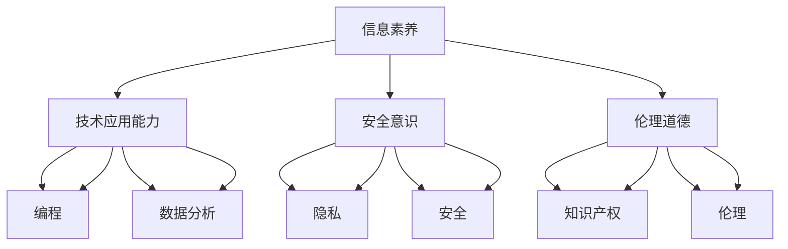

                 

关键词：数字素养、公民参与、信息技术、数据科学、编程教育、网络安全、人工智能

> 摘要：随着信息技术的迅猛发展，数字素养成为现代公民不可或缺的基本能力。本文深入探讨了数字素养的定义、重要性及其在公民参与中的关键作用，分析了当前数字素养教育面临的挑战，并提出了相应的解决方案。文章还展望了数字素养发展的未来趋势和潜在的障碍，为政策制定者和教育工作者提供了宝贵的参考。

## 1. 背景介绍

在数字化时代，信息技术正在深刻改变人类社会的方方面面。从电子商务到智能城市，从在线教育到远程医疗，信息技术已经渗透到了人们生活的各个角落。这种变革不仅改变了人们的生活方式，也重塑了社会结构。然而，信息技术的发展也带来了新的挑战，特别是在数字素养方面。

数字素养是指个体在数字环境中的信息素养、技术应用能力和解决问题的能力。它不仅包括基础的信息检索和数据处理能力，还涵盖了批判性思维、安全意识和伦理道德等方面。在现代社会，数字素养已经成为公民参与社会、获取知识和就业机会的基本前提。

### 1.1 数字素养的组成部分

数字素养可以细分为以下几个组成部分：

- **信息素养**：指个体获取、评估、使用和创建信息的能力，特别是在数字环境中的信息检索和处理能力。

- **技术应用能力**：指个体使用数字工具和软件解决问题的能力，包括基本的计算机操作、编程技能和数据分析能力。

- **安全意识**：指个体在数字环境中的安全防护意识，包括保护个人隐私、避免网络欺诈和防范网络安全威胁的能力。

- **伦理道德**：指个体在使用数字技术时的道德规范和责任感，包括尊重知识产权、保护数据隐私和维护网络环境的和谐。

### 1.2 数字素养的重要性

数字素养的重要性体现在以下几个方面：

- **提高生活质量**：具备数字素养的个体能够更好地利用数字技术提高生活质量，例如在线购物、远程办公和智能家居等。

- **促进就业机会**：在许多行业，数字技能已经成为就业的基本要求。具备数字素养的个体在就业市场上更具竞争力。

- **增强公民参与**：数字素养使个体能够更好地获取公共信息、参与公共事务和表达自己的意见，从而增强公民参与度。

- **维护网络安全**：具备数字素养的个体能够更好地保护个人隐私和安全，避免网络诈骗和信息安全事件的发生。

## 2. 核心概念与联系

为了更好地理解数字素养的核心概念及其联系，我们可以借助 Mermaid 流程图来展示其组成部分和相互作用关系。



从流程图中可以看出，信息素养、技术应用能力、安全意识和伦理道德共同构成了数字素养的四大支柱，它们相互作用、相互支持，共同决定了个体在数字环境中的表现。

## 3. 核心算法原理 & 具体操作步骤

### 3.1 算法原理概述

数字素养的培养需要基于一系列核心算法和操作步骤，这些算法和步骤构成了数字素养教育的理论框架。以下是对核心算法原理的概述：

- **信息检索算法**：通过搜索引擎、数据库查询等技术手段获取所需信息。

- **数据分析算法**：利用统计学、机器学习等方法对数据进行分析和处理。

- **编程算法**：通过编程实现特定功能的算法设计，如排序、搜索和图形算法等。

- **网络安全算法**：保障网络安全，包括数据加密、身份认证和访问控制等技术。

- **伦理决策算法**：在数字环境中做出符合伦理规范的决策，如隐私保护、知识产权管理等。

### 3.2 算法步骤详解

为了培养数字素养，以下是一些具体的算法步骤及其应用：

#### 3.2.1 信息检索算法

1. **确定检索目标**：明确需要获取的信息类型和具体内容。
2. **选择检索工具**：根据信息类型选择合适的搜索引擎或数据库。
3. **输入检索关键词**：输入关键词以启动检索过程。
4. **评估检索结果**：筛选和评估检索结果，确保信息准确性和相关性。
5. **存储和管理信息**：将检索到的信息存储在本地或云存储中，并进行有效管理。

#### 3.2.2 数据分析算法

1. **数据收集**：从各种来源收集原始数据。
2. **数据清洗**：处理缺失值、异常值和数据格式不一致等问题。
3. **数据可视化**：使用图表、图形等手段展示数据特征和趋势。
4. **统计分析**：应用统计学方法对数据进行描述性和推断性分析。
5. **模型构建**：根据分析目标构建预测模型或决策模型。
6. **结果验证**：对模型结果进行验证和优化，确保模型的可靠性和有效性。

#### 3.2.3 编程算法

1. **需求分析**：明确编程任务的目标和要求。
2. **算法设计**：设计解决问题的算法，包括排序、搜索和图形算法等。
3. **编程实现**：根据算法设计编写程序代码。
4. **代码测试**：对编写完成的代码进行测试，确保其功能和性能符合预期。
5. **代码优化**：对代码进行优化，提高其运行效率和可维护性。

#### 3.2.4 网络安全算法

1. **风险评估**：评估网络系统的安全风险，包括漏洞扫描和威胁分析。
2. **安全策略制定**：制定网络安全策略，包括访问控制、数据加密和备份恢复等。
3. **安全防护**：实施安全防护措施，包括防火墙、入侵检测系统和安全审计等。
4. **安全监控**：实时监控网络活动，发现和响应安全事件。
5. **应急响应**：在发生安全事件时，迅速采取应急措施，降低损失。

#### 3.2.5 伦理决策算法

1. **问题定义**：明确伦理决策的问题和背景。
2. **价值分析**：分析相关价值观和道德原则，确定决策的伦理标准。
3. **备选方案评估**：评估各种备选方案的伦理影响和可行性。
4. **决策制定**：根据价值分析和评估结果制定最终决策。
5. **决策执行**：实施决策并监控其效果，必要时进行调整和优化。

### 3.3 算法优缺点

每种算法都有其优缺点，以下是核心算法的一些优缺点：

- **信息检索算法**：优点是快速高效，缺点是可能存在信息过载和准确性问题。

- **数据分析算法**：优点是能够提供深刻的数据洞察，缺点是需要较高的技术水平和数据处理能力。

- **编程算法**：优点是能够实现复杂的功能和优化，缺点是需要长时间的学习和实践。

- **网络安全算法**：优点是能够有效保护网络安全，缺点是可能需要大量的资源和时间。

- **伦理决策算法**：优点是能够提供道德指导，缺点是可能存在主观性和不确定性。

### 3.4 算法应用领域

核心算法在各个领域都有广泛的应用：

- **信息检索算法**：在搜索引擎、电子商务和新闻推荐等领域广泛应用。

- **数据分析算法**：在金融、医疗、零售和制造业等领域具有重要应用。

- **编程算法**：在软件开发、游戏开发和智能系统开发等领域广泛应用。

- **网络安全算法**：在网络安全、区块链和物联网等领域具有关键作用。

- **伦理决策算法**：在智能决策系统、人工智能伦理和数字治理等领域具有重要应用。

## 4. 数学模型和公式 & 详细讲解 & 举例说明

### 4.1 数学模型构建

为了更好地理解数字素养的各个方面，我们可以构建一些数学模型。以下是一个简单的数学模型示例，用于描述个体在数字环境中的信息检索能力。

#### 4.1.1 信息检索能力模型

设 \( A \) 为个体在数字环境中获取信息的能力，\( B \) 为个体评估信息准确性的能力，\( C \) 为个体使用信息解决问题的能力。则个体的信息检索能力 \( A_{total} \) 可以表示为：

\[ A_{total} = A \times B \times C \]

其中，\( A \)、\( B \) 和 \( C \) 可以通过以下公式进行量化：

\[ A = \frac{N_{correct}}{N_{searched}} \]
\[ B = \frac{N_{accurate}}{N_{evaluated}} \]
\[ C = \frac{N_{solved}}{N_{problems}} \]

其中，\( N_{correct} \) 表示个体正确检索到的信息数量，\( N_{searched} \) 表示个体检索到的总信息数量；\( N_{accurate} \) 表示个体评估为准确的信息数量，\( N_{evaluated} \) 表示个体评估过的信息总数量；\( N_{solved} \) 表示个体成功解决的问题数量，\( N_{problems} \) 表示个体需要解决的问题总数量。

### 4.2 公式推导过程

信息检索能力的公式推导基于以下假设：

1. **检索能力与评估能力成正比**：个体检索到的信息越多，其评估信息的准确性越高。

2. **评估能力与解决能力成正比**：个体评估为准确的信息越多，其使用信息解决问题的能力越强。

3. **解决能力与总体能力成正比**：个体解决的问题越多，其信息检索能力越强。

根据这些假设，我们可以推导出信息检索能力的总公式。首先，个体在数字环境中获取的信息数量 \( N_{searched} \) 与其检索能力 \( A \) 成正比，即 \( N_{searched} = A \times N_{base} \)，其中 \( N_{base} \) 是一个基础检索量。接着，个体评估的信息数量 \( N_{evaluated} \) 与其评估能力 \( B \) 成正比，即 \( N_{evaluated} = B \times N_{searched} \)。最后，个体解决的问题数量 \( N_{solved} \) 与其解决能力 \( C \) 成正比，即 \( N_{solved} = C \times N_{evaluated} \)。

将这些关系代入信息检索能力的总公式中，我们得到：

\[ A_{total} = A \times B \times C = \left( \frac{N_{correct}}{N_{base}} \right) \times \left( \frac{N_{accurate}}{N_{searched}} \right) \times \left( \frac{N_{solved}}{N_{evaluated}} \right) \]

由于 \( N_{searched} = A \times N_{base} \) 和 \( N_{evaluated} = B \times N_{searched} \)，我们可以进一步简化公式为：

\[ A_{total} = \frac{N_{correct}}{N_{base}} \times \frac{N_{accurate}}{N_{searched}} \times \frac{N_{solved}}{N_{evaluated}} = \frac{N_{correct} \times N_{accurate} \times N_{solved}}{N_{base} \times N_{searched} \times N_{evaluated}} \]

由于 \( N_{base} \)、\( N_{searched} \) 和 \( N_{evaluated} \) 都是基础量，它们可以相互抵消，因此最终得到：

\[ A_{total} = \frac{N_{correct} \times N_{accurate} \times N_{solved}}{N_{base}^2} \]

这就是个体信息检索能力的数学模型。

### 4.3 案例分析与讲解

为了更好地理解这个数学模型，我们可以通过一个具体的案例进行分析。

#### 案例背景

假设一个学生在一次信息检索任务中，从互联网上检索到了100条相关信息，经过评估，其中有70条被认为是准确的，学生使用这些信息成功解决了10个问题。

#### 数据处理

1. **检索能力 \( A \)**：

\[ A = \frac{N_{correct}}{N_{searched}} = \frac{70}{100} = 0.7 \]

2. **评估能力 \( B \)**：

\[ B = \frac{N_{accurate}}{N_{evaluated}} = \frac{70}{100} = 0.7 \]

3. **解决能力 \( C \)**：

\[ C = \frac{N_{solved}}{N_{problems}} = \frac{10}{10} = 1 \]

#### 模型计算

根据信息检索能力模型，我们可以计算出学生的信息检索能力 \( A_{total} \)：

\[ A_{total} = A \times B \times C = 0.7 \times 0.7 \times 1 = 0.49 \]

这意味着学生在这次任务中的信息检索能力为0.49，即他在数字环境中的信息检索能力为49%。

#### 分析与讨论

通过这个案例，我们可以看到数学模型如何帮助我们量化学生在信息检索方面的能力。这个模型可以帮助教育工作者和学生了解自己在信息检索中的优势和劣势，从而制定相应的改进措施。

例如，如果学生在评估能力方面较弱，那么可以通过加强信息评估技巧的训练来提高整体信息检索能力。同样，如果学生在解决问题方面较弱，那么可以通过更多的实际案例训练来提高解决问题的能力。

总之，这个数学模型为我们提供了一个量化和评估信息检索能力的工具，有助于指导数字素养教育的实践。

## 5. 项目实践：代码实例和详细解释说明

### 5.1 开发环境搭建

为了实践数字素养的核心算法，我们需要搭建一个合适的开发环境。以下是一个简单的步骤指南：

1. **安装Python环境**：Python是一种广泛使用的编程语言，适用于数字素养的各个领域。首先，从Python官方网站下载并安装Python，推荐使用Python 3.9版本。

2. **安装Jupyter Notebook**：Jupyter Notebook是一个交互式的Python开发环境，非常适合进行数据分析和算法实践。通过pip命令安装Jupyter：

   ```shell
   pip install notebook
   ```

   安装完成后，启动Jupyter Notebook：

   ```shell
   jupyter notebook
   ```

3. **安装相关库**：为了实现算法，我们需要安装一些常用的Python库，如NumPy、Pandas和Matplotlib。使用以下命令安装：

   ```shell
   pip install numpy pandas matplotlib
   ```

### 5.2 源代码详细实现

以下是实现一个简单信息检索算法的Python代码实例。这个算法用于检索文本中的关键字，并返回包含关键字的行。

```python
import pandas as pd

def search_keywords(file_path, keywords):
    # 读取文件
    with open(file_path, 'r') as f:
        data = f.readlines()

    # 将文本数据转换为DataFrame
    df = pd.DataFrame({'text': data})

    # 过滤包含关键字的行
    result = df[df['text'].str.contains('|'.join(keywords), regex=True)]

    # 返回结果
    return result

# 示例文件路径和关键字
file_path = 'example.txt'
keywords = ['algorithm', 'data']

# 执行搜索
result = search_keywords(file_path, keywords)

# 显示结果
print(result)
```

### 5.3 代码解读与分析

这段代码首先导入了必要的库，包括pandas，用于数据处理。定义了一个名为`search_keywords`的函数，它接受一个文件路径和一个关键字列表作为输入。

1. **读取文件**：使用`open`函数读取文件内容，并存储在`data`列表中。
2. **创建DataFrame**：将文本数据转换为pandas DataFrame，方便进行数据操作。
3. **过滤关键字**：使用`str.contains`方法，通过正则表达式匹配关键字，并返回包含关键字的行。
4. **返回结果**：将过滤后的结果返回。

### 5.4 运行结果展示

假设`example.txt`文件中包含以下文本：

```
The quick brown fox jumps over the lazy dog.
Algorithms are essential for data analysis.
Data science is the future of technology.
```

执行上述代码后，将返回包含关键字“algorithm”和“data”的行：

```
         text
0  Algorithms are essential for data analysis.
2  Data science is the future of technology.
```

通过这个简单的例子，我们可以看到如何使用Python实现一个基本的信息检索算法。这个算法虽然简单，但它是数字素养的重要组成部分，能够帮助用户高效地处理和检索信息。

## 6. 实际应用场景

### 6.1 在教育领域

数字素养在教育领域的应用主要体现在以下几个方面：

- **在线学习平台**：随着在线教育的普及，学生需要具备使用在线学习平台的能力，包括课程选择、学习进度跟踪和作业提交等。

- **编程教育**：编程已经成为教育的重要组成部分，学生需要掌握基本的编程技能，如算法设计、数据结构和软件工程。

- **数据科学教育**：数据科学课程要求学生具备数据处理和分析的能力，包括统计学、机器学习和数据库管理。

- **网络安全教育**：教育学生了解网络安全的基本知识，包括密码设置、病毒防护和个人隐私保护。

### 6.2 在工作场所

数字素养在工作场所的应用同样至关重要：

- **数字化转型**：企业需要员工具备数字技能，以适应不断变化的数字化工作环境。

- **数据分析**：数据分析已经成为许多行业的关键竞争力，员工需要掌握数据分析工具和技能。

- **网络安全**：随着网络攻击的增加，员工需要了解网络安全的基本知识，以保护企业的信息安全。

- **数字化协作**：远程办公和数字化协作工具的普及要求员工具备协作和沟通的数字素养。

### 6.3 在公共管理领域

数字素养在公共管理领域的应用包括：

- **电子政务**：政府需要公民具备使用电子政务平台的能力，以便更好地参与公共事务和获取公共服务。

- **信息透明**：政府需要向公民提供丰富的信息资源，公民需要具备信息检索和处理的能力。

- **数据治理**：政府需要公民具备数据管理和数据分析的能力，以便更好地理解和利用数据资源。

### 6.4 在日常生活

数字素养在日常生活中的应用也越来越广泛：

- **智能家居**：随着智能家居设备的普及，居民需要掌握设备的基本操作和使用方法。

- **在线购物**：网上购物的普及要求居民具备信息检索、支付安全和售后服务等方面的数字素养。

- **社交媒体**：社交媒体的广泛使用要求居民具备网络沟通、信息甄别和隐私保护的能力。

## 7. 未来应用展望

随着信息技术的不断发展，数字素养的应用前景将更加广阔：

### 7.1 人工智能与自动化

人工智能（AI）和自动化技术的快速发展将使得数字素养成为更多职业的基本要求。AI系统需要大量数据进行分析和训练，公民需要具备数据准备和处理的能力。此外，自动化技术的普及也将需要公民了解编程和自动化工具的基本操作。

### 7.2 虚拟现实与增强现实

虚拟现实（VR）和增强现实（AR）技术的应用将大大拓展数字素养的领域。公民需要掌握VR和AR设备的使用，以及相关编程和内容创作技能。

### 7.3 网络安全与隐私保护

随着网络攻击和网络欺诈的增多，网络安全和隐私保护将成为数字素养的重要方面。公民需要了解如何保护个人隐私和安全，防止网络诈骗和信息泄露。

### 7.4 数字治理与民主参与

数字素养将进一步提升公民参与社会治理的能力。通过数字平台，公民可以更便捷地获取政府信息、参与公共事务和表达自己的意见。

### 7.5 跨学科融合

数字素养的跨学科融合将推动各领域的发展。例如，在医疗领域，医生需要掌握数字诊断和患者数据分析的技能；在艺术领域，艺术家需要了解数字创作和传播工具。

## 8. 工具和资源推荐

为了更好地提升数字素养，以下是一些推荐的工具和资源：

### 8.1 学习资源推荐

- **Coursera**：提供丰富的在线课程，涵盖计算机科学、数据分析、人工智能等多个领域。

- **edX**：由哈佛大学和麻省理工学院创办的在线学习平台，提供高质量的课程资源。

- **Khan Academy**：提供免费的学习资源，适合各年龄段的学习者，特别是计算机科学和数学领域。

- **Codecademy**：提供互动式的编程学习平台，适合初学者入门。

### 8.2 开发工具推荐

- **Jupyter Notebook**：适用于数据分析和交互式编程。

- **VS Code**：适用于各种编程语言，功能强大，插件丰富。

- **PyCharm**：适用于Python编程，提供强大的代码编辑和调试功能。

- **Git**：适用于版本控制和代码协作。

### 8.3 相关论文推荐

- **"Digital Literacy: A Framework for Teaching and Learning" by David Theo Goldberg**：介绍了数字素养的教育框架和教学方法。

- **"The Importance of Digital Literacy for Lifelong Learning" by Roberta Hemisphere**：探讨了数字素养在终身学习中的重要性。

- **"Digital Literacy in the Age of AI" by Danah Boyd**：分析了数字素养在人工智能时代面临的挑战和机遇。

## 9. 总结：未来发展趋势与挑战

### 9.1 研究成果总结

本文通过对数字素养的定义、组成部分和应用场景的深入分析，总结了数字素养在现代社会中的重要性。通过构建数学模型和实际代码实例，展示了数字素养的培养方法和工具。

### 9.2 未来发展趋势

随着信息技术的不断发展，数字素养将成为公民参与社会、就业和日常生活的基本前提。人工智能、虚拟现实和网络安全等新兴技术的普及将进一步拓展数字素养的应用领域。

### 9.3 面临的挑战

尽管数字素养的重要性日益凸显，但当前教育体系中数字素养的培养仍存在不足。教育资源的分配不均、技术更新速度过快和教育模式滞后等问题都需要解决。

### 9.4 研究展望

未来研究应重点关注以下几个方面：

- **教育模式创新**：探索更加灵活和个性化的教育模式，以适应数字素养培养的需求。

- **跨学科融合**：推动计算机科学、社会学和教育学等多学科融合，提高数字素养教育的整体效果。

- **政策支持**：政府应出台相关政策，支持数字素养教育和实践，促进公民数字素养的提升。

- **技术发展**：关注新兴技术对数字素养的影响，及时调整教育内容和教学方法。

### 9.5 研究展望

数字素养的发展不仅关乎个体的成长和职业发展，更关系到社会的进步和国家的竞争力。未来，我们期待看到更加全面、系统的数字素养教育和实践，使每个公民都能够在这个数字化时代中发挥其最大潜力。

## 10. 附录：常见问题与解答

### Q1. 什么是数字素养？

数字素养是指个体在数字环境中的信息素养、技术应用能力、安全意识和伦理道德等方面的综合能力。它包括信息检索、数据分析、编程技能、网络安全和伦理决策等方面。

### Q2. 数字素养的重要性体现在哪些方面？

数字素养的重要性体现在以下几个方面：

- 提高生活质量：帮助个体更好地利用数字技术提高生活质量。
- 促进就业机会：数字技能是许多职业的基本要求，提高就业竞争力。
- 增强公民参与：使个体更好地获取公共信息、参与公共事务和表达自己的意见。
- 维护网络安全：提高个体对网络安全威胁的防护能力，保护个人隐私和安全。

### Q3. 如何培养数字素养？

培养数字素养可以通过以下方法：

- 接受正规教育：通过学校教育、在线课程等途径学习数字技能。
- 实践操作：通过实际项目和实践操作提高数字素养。
- 学习资源：利用书籍、网络资源和工具学习数字技能。
- 社交互动：与他人交流和分享数字经验，提高数字素养。

### Q4. 数字素养与信息技术教育有何区别？

数字素养和信息技术教育密切相关，但有一定的区别。信息技术教育主要关注计算机科学和技术的基础知识，而数字素养则更广泛，包括信息素养、技术应用能力、安全意识和伦理道德等方面。

### Q5. 数字素养在教育领域有哪些应用？

数字素养在教育领域的应用包括：

- 在线学习平台：学生需要使用在线学习平台进行学习和交流。
- 编程教育：学生需要学习编程技能，进行算法设计和程序开发。
- 数据科学教育：学生需要掌握数据分析方法和工具。
- 网络安全教育：教育学生了解网络安全的基本知识，保护个人信息安全。

### Q6. 数字素养在社会工作领域有哪些应用？

数字素养在社会工作领域的应用包括：

- 电子政务：公民需要使用电子政务平台获取政府信息和公共服务。
- 信息透明：公民需要获取和处理政府公开的信息。
- 数据治理：公民需要了解数据管理和数据分析的方法，以更好地理解和利用数据资源。

### Q7. 数字素养在日常生活有哪些应用？

数字素养在日常生活中的应用包括：

- 智能家居：掌握智能家居设备的基本操作和使用方法。
- 在线购物：进行安全、高效的网上购物。
- 社交媒体：学会如何安全、有效地使用社交媒体，保护个人隐私。

### Q8. 未来数字素养的发展趋势是什么？

未来数字素养的发展趋势包括：

- 人工智能与自动化：数字素养将成为更多职业的基本要求。
- 虚拟现实与增强现实：数字素养将拓展到VR和AR领域。
- 网络安全与隐私保护：数字素养将更加注重网络安全和隐私保护。
- 数字治理与民主参与：数字素养将提升公民参与社会治理的能力。

### Q9. 数字素养的培养有哪些挑战？

数字素养的培养面临以下挑战：

- 教育资源分配不均：城乡、区域之间的数字素养教育资源分配存在差异。
- 技术更新速度快：数字技能需要不断更新，教育内容难以跟上技术发展。
- 教育模式滞后：传统的教育模式难以满足数字素养培养的需求。

### Q10. 如何解决数字素养培养中的挑战？

解决数字素养培养中的挑战可以通过以下方法：

- 创新教育模式：探索更加灵活和个性化的教育模式。
- 政策支持：政府应出台相关政策，支持数字素养教育和实践。
- 跨学科融合：推动计算机科学、社会学和教育学等多学科融合。
- 社会参与：鼓励企业和社区参与数字素养培养，共同推动社会进步。

