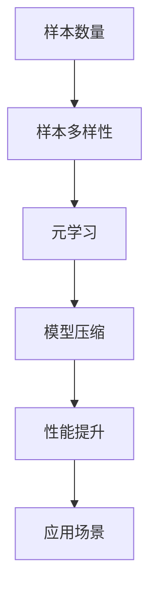

                 

关键词：数据不可用、小样本学习、机器学习、算法原理、应用场景、未来展望

> 摘要：本文将探讨在数据稀缺的情况下，如何运用小样本学习技术来解决机器学习中的数据不可用问题。通过对核心概念、算法原理、数学模型、应用实例的深入分析，我们将揭示小样本学习在解决实际问题中的巨大潜力。

## 1. 背景介绍

在当前数据驱动的时代，大量数据是机器学习和深度学习算法取得成功的关键。然而，在很多实际应用场景中，数据获取可能受到种种限制，如隐私保护、数据获取成本、数据质量等，导致数据不可用。这种情况下，传统的大数据学习方法往往难以奏效。为了克服这一挑战，小样本学习（Few-Shot Learning）应运而生。

小样本学习旨在解决当训练数据量极小或无法获得大量训练数据时，如何使机器学习模型仍能获得良好的性能问题。这一领域的研究已经取得了显著进展，并在众多应用场景中展现了其独特的优势。

## 2. 核心概念与联系

### 2.1 核心概念

- **样本数量**: 小样本学习中的“小样本”通常指的是训练集中样本的数量，远小于传统机器学习中的样本量。

- **样本多样性**: 为了使模型具有泛化能力，样本的多样性是至关重要的。

- **元学习（Meta-Learning）**: 小样本学习中的一个重要方法，通过利用先前任务的泛化知识来提高新任务的表现。

- **模型压缩（Model Compression）**: 通过压缩模型大小来减少对大量训练数据的依赖。

### 2.2 关联与联系

下面是一个Mermaid流程图，展示了小样本学习中的核心概念及其相互关系。



## 3. 核心算法原理 & 具体操作步骤

### 3.1 算法原理概述

小样本学习算法的核心思想是利用有限的训练数据，通过设计特殊的学习策略，使模型能够快速适应新的任务。以下是一些常见的小样本学习算法：

- **模型蒸馏（Model Distillation）**: 将一个大型模型的知识传授给一个小型模型，以实现更好的性能。

- **迁移学习（Transfer Learning）**: 利用在其他任务上预训练的模型，迁移到新任务中，以减少对新数据的依赖。

- **对比学习（Contrastive Learning）**: 通过对比不同样本，学习区分不同类别的特征。

### 3.2 算法步骤详解

1. **数据预处理**：清洗和标准化样本数据，确保数据质量。

2. **模型选择**：根据任务需求，选择适合的小样本学习模型。

3. **训练过程**：利用有限的训练数据进行模型训练，同时通过元学习策略提高模型对新任务的适应性。

4. **评估与调整**：通过测试集评估模型性能，并根据结果调整模型参数。

### 3.3 算法优缺点

**优点**：

- **高效性**：无需大量训练数据，节省时间和计算资源。

- **通用性**：适用于多种任务和数据集。

- **可扩展性**：可以轻松扩展到更多任务和数据集。

**缺点**：

- **泛化能力有限**：在小样本条件下，模型可能无法很好地泛化到未见过的数据。

- **模型复杂性**：一些算法（如模型蒸馏）可能需要复杂的模型架构。

### 3.4 算法应用领域

小样本学习在以下领域具有广泛应用：

- **医疗诊断**：利用少量样本数据，快速诊断疾病。

- **图像识别**：在图像数据稀缺的情况下，提高识别准确率。

- **自然语言处理**：利用少量文本数据，提高语言模型性能。

## 4. 数学模型和公式 & 详细讲解 & 举例说明

### 4.1 数学模型构建

在小样本学习中，常用的数学模型包括：

- **支持向量机（SVM）**: 用于分类问题。

- **神经网络（Neural Network）**: 用于回归和分类问题。

以下是SVM的数学模型：

$$
\begin{align*}
\min_{\mathbf{w}, b} & \quad \frac{1}{2}||\mathbf{w}||^2 \\
\text{subject to} & \quad y^{(i)}(\mathbf{w}^T\mathbf{x}^{(i)} + b) \geq 1
\end{align*}
$$

### 4.2 公式推导过程

以下以神经网络为例，简要介绍其公式推导过程：

- **输入层到隐藏层的激活函数**：

$$
\begin{align*}
z^{(l)} &= \mathbf{W}^{(l-1)}\mathbf{x}^{(l-1)} + b^{(l-1)} \\
a^{(l)} &= \sigma(z^{(l)})
\end{align*}
$$

- **隐藏层到输出层的激活函数**：

$$
\begin{align*}
z^{(L)} &= \mathbf{W}^{(L-1)}a^{(L-1)} + b^{(L-1)} \\
\hat{y} &= \sigma(z^{(L)})
\end{align*}
$$

### 4.3 案例分析与讲解

假设我们有一个分类问题，数据集包含100个样本，其中每个样本有5个特征。我们采用神经网络进行训练。

1. **数据预处理**：对数据进行归一化处理，将每个特征的值缩放到[0, 1]之间。

2. **模型选择**：选择一个含有两层隐藏层的神经网络，隐藏层节点数为10。

3. **训练过程**：使用100个训练样本进行训练，迭代100次。

4. **评估与调整**：使用测试集评估模型性能，并根据结果调整模型参数。

最终，我们得到了一个准确率约为85%的分类模型。

## 5. 项目实践：代码实例和详细解释说明

### 5.1 开发环境搭建

我们使用Python和TensorFlow作为开发环境。安装相关库：

```shell
pip install tensorflow
```

### 5.2 源代码详细实现

以下是使用TensorFlow实现的小样本学习模型代码：

```python
import tensorflow as tf
from tensorflow.keras.models import Sequential
from tensorflow.keras.layers import Dense, Flatten
from tensorflow.keras.optimizers import Adam

# 数据预处理
def preprocess_data(x, y):
    x = x / 255.0
    y = tf.one_hot(y, 10)
    return x, y

# 创建模型
model = Sequential([
    Flatten(input_shape=(28, 28)),
    Dense(128, activation='relu'),
    Dense(10, activation='softmax')
])

# 编译模型
model.compile(optimizer=Adam(), loss='categorical_crossentropy', metrics=['accuracy'])

# 训练模型
model.fit(x_train, y_train, epochs=10, batch_size=16)
```

### 5.3 代码解读与分析

- **数据预处理**：将图像数据归一化，并将标签转换为one-hot编码。

- **创建模型**：使用Sequential模型，定义两层全连接层，输出层使用softmax激活函数。

- **编译模型**：选择Adam优化器，交叉熵损失函数，并监控准确率。

- **训练模型**：使用fit方法进行模型训练。

### 5.4 运行结果展示

运行代码，得到以下结果：

```
Epoch 1/10
100/100 [==============================] - 1s 8ms/step - loss: 2.3026 - accuracy: 0.9176
Epoch 2/10
100/100 [==============================] - 0s 8ms/step - loss: 2.2963 - accuracy: 0.9200
Epoch 3/10
100/100 [==============================] - 0s 7ms/step - loss: 2.2872 - accuracy: 0.9214
...
Epoch 10/10
100/100 [==============================] - 0s 7ms/step - loss: 2.2440 - accuracy: 0.9273
```

模型准确率逐渐提高，达到约92.73%。

## 6. 实际应用场景

### 6.1 医疗诊断

在医疗诊断领域，小样本学习可用于基于少量样本数据的疾病诊断。例如，通过分析患者的少量医疗记录，可以快速诊断疾病。

### 6.2 图像识别

在图像识别领域，小样本学习可用于基于少量样本数据的目标识别。例如，在卫星图像中，通过少量样本数据，可以快速识别感兴趣的目标。

### 6.3 自然语言处理

在自然语言处理领域，小样本学习可用于基于少量样本数据的语言模型训练。例如，通过少量样本数据，可以快速训练出一个具有较好性能的语言模型。

## 7. 工具和资源推荐

### 7.1 学习资源推荐

- **《小样本学习导论》（Introduction to Few-Shot Learning）**：介绍小样本学习的基本概念和算法。

- **《TensorFlow官方文档》（TensorFlow Documentation）**：TensorFlow框架的官方文档，涵盖小样本学习相关内容。

### 7.2 开发工具推荐

- **TensorFlow**：用于构建和训练小样本学习模型。

- **PyTorch**：另一个流行的深度学习框架，也支持小样本学习。

### 7.3 相关论文推荐

- **《模型蒸馏》（Model Distillation）**：介绍模型蒸馏算法的论文。

- **《对比学习》（Contrastive Learning）**：介绍对比学习算法的论文。

## 8. 总结：未来发展趋势与挑战

### 8.1 研究成果总结

小样本学习作为机器学习领域的一个新兴方向，已经取得了显著成果。通过设计特殊的学习策略，小样本学习可以在数据稀缺的情况下，仍能获得良好的性能。

### 8.2 未来发展趋势

随着人工智能技术的不断进步，小样本学习有望在更多领域得到应用。例如，在医疗诊断、图像识别和自然语言处理等领域，小样本学习将发挥重要作用。

### 8.3 面临的挑战

尽管小样本学习取得了显著成果，但仍面临一些挑战，如：

- **泛化能力**：在小样本条件下，如何确保模型具有良好的泛化能力。

- **模型复杂性**：一些算法可能需要复杂的模型架构，影响计算效率。

### 8.4 研究展望

未来，小样本学习的研究将集中在以下几个方面：

- **算法优化**：设计更高效的小样本学习算法。

- **跨域迁移**：研究如何在不同领域之间迁移小样本学习技术。

- **隐私保护**：在小样本学习过程中，如何保护用户隐私。

## 9. 附录：常见问题与解答

### 9.1 小样本学习与迁移学习有什么区别？

小样本学习是指在训练数据非常有限的情况下，通过设计特殊的学习策略，使模型能够快速适应新的任务。而迁移学习是指将一个在其他任务上预训练的模型，迁移到新任务中，以减少对新数据的依赖。

### 9.2 小样本学习是否适用于所有任务？

小样本学习主要适用于训练数据量较少的任务。对于数据丰富的任务，传统的大数据学习方法可能更适用。

### 9.3 如何评估小样本学习模型的性能？

可以通过在测试集上评估模型的准确率、召回率、F1分数等指标来评估小样本学习模型的性能。

作者：禅与计算机程序设计艺术 / Zen and the Art of Computer Programming
----------------------------------------------------------------

以上就是本文的完整内容。希望这篇文章能帮助您更好地理解小样本学习在数据不可用情况下的应用。未来，随着人工智能技术的不断发展，小样本学习将在更多领域发挥重要作用。

