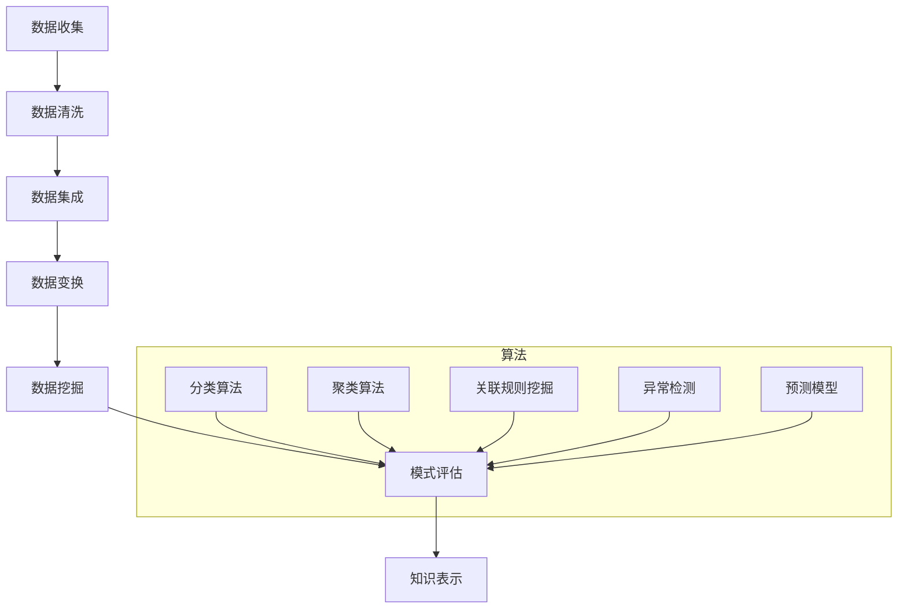

                 

关键词：数据挖掘、原理、代码实例、算法、数学模型、项目实践、应用场景、未来展望

## 摘要

数据挖掘作为人工智能和大数据分析的核心技术之一，正日益受到广泛关注。本文将深入探讨数据挖掘的基本原理，涵盖核心算法及其实现步骤，并通过具体的代码实例讲解，帮助读者更好地理解数据挖掘的实战应用。此外，本文还将探讨数据挖掘的数学模型，以及其在实际项目中的实践和未来发展的方向。

## 1. 背景介绍

数据挖掘（Data Mining）是近年来快速发展的领域，它涉及从大量数据中提取有价值的信息和知识。随着互联网和物联网的普及，数据量呈爆炸式增长，数据挖掘技术变得尤为重要。数据挖掘不仅应用于商业领域，如市场分析、风险评估等，还广泛应用于医疗、金融、教育等多个领域。

本文旨在为初学者和专业人士提供一个全面的数据挖掘指南，从理论到实践，帮助读者深入了解数据挖掘的核心技术和方法。

## 2. 核心概念与联系

### 2.1 数据挖掘的定义

数据挖掘是一种从大量数据中自动发现规律、趋势和模式的过程。它结合了统计学、机器学习、数据库技术和数据可视化等多种技术。

### 2.2 数据挖掘的流程

数据挖掘流程通常包括以下步骤：
1. **数据收集**：收集来自各种数据源的数据。
2. **数据清洗**：处理数据中的噪声和错误。
3. **数据集成**：将不同数据源中的数据进行整合。
4. **数据变换**：将数据转换为适合挖掘的形式。
5. **数据挖掘**：应用算法提取有价值的信息。
6. **模式评估**：评估挖掘出的模式的有效性。
7. **知识表示**：以直观的方式展示挖掘出的结果。

### 2.3 数据挖掘的核心算法

数据挖掘涉及到多种算法，其中常见的有：
- **分类算法**：如决策树、随机森林、支持向量机等。
- **聚类算法**：如K-means、层次聚类等。
- **关联规则挖掘**：如Apriori算法、FP-growth等。
- **异常检测**：如孤立森林、k-最近邻等。
- **预测模型**：如线性回归、时间序列分析等。

下面是一个Mermaid流程图，展示了数据挖掘的基本流程和核心算法之间的联系。



## 3. 核心算法原理 & 具体操作步骤

### 3.1 算法原理概述

#### 3.1.1 决策树

决策树是一种常用的分类算法，基于特征进行判断，逐步将数据集划分成各个子集，最终得到分类结果。它的核心是ID3算法和C4.5算法。

#### 3.1.2 随机森林

随机森林是一种集成学习方法，通过构建多棵决策树，并利用投票机制得到最终结果。它能够提高模型的稳定性和准确性。

#### 3.1.3 支持向量机

支持向量机是一种二分类模型，通过找到一个最优的超平面，将数据集划分为两个类别。它的核心是核函数的选择。

#### 3.1.4 K-means

K-means是一种聚类算法，通过迭代计算各个数据点的均值，将数据划分为K个簇。

#### 3.1.5 Apriori算法

Apriori算法是一种用于发现关联规则的算法，通过频繁项集的支持度和置信度来判断规则的有效性。

#### 3.1.6 独立森林

独立森林是一种用于异常检测的算法，通过随机森林的集成方法来识别异常数据。

### 3.2 算法步骤详解

#### 3.2.1 决策树

1. 选择最佳特征进行划分。
2. 计算信息增益或基尼系数。
3. 递归构建决策树。

#### 3.2.2 随机森林

1. 随机选择特征子集。
2. 构建单棵决策树。
3. 重复步骤1和2，构建多棵决策树。
4. 利用投票机制得到最终结果。

#### 3.2.3 支持向量机

1. 选择适当的核函数。
2. 求解优化问题，得到最优超平面。
3. 训练分类器。

#### 3.2.4 K-means

1. 随机初始化中心点。
2. 计算每个数据点到中心点的距离，将数据点分配到最近的簇。
3. 重新计算每个簇的中心点。
4. 重复步骤2和3，直到满足收敛条件。

#### 3.2.5 Apriori算法

1. 扫描数据集，计算每个项的支持度。
2. 筛选出频繁项集。
3. 构建关联规则。
4. 计算规则的支持度和置信度。

#### 3.2.6 独立森林

1. 构建随机森林。
2. 计算每个树对异常数据的分数。
3. 综合分数判断是否为异常数据。

### 3.3 算法优缺点

#### 决策树

- 优点：易于理解和实现，能够可视化。
- 缺点：可能会过拟合，处理连续特征时需要离散化。

#### 随机森林

- 优点：能够减少过拟合，提高模型准确性。
- 缺点：计算复杂度较高，对大规模数据集不友好。

#### 支持向量机

- 优点：能够处理高维数据，具有很好的泛化能力。
- 缺点：对异常数据敏感，计算复杂度较高。

#### K-means

- 优点：简单高效，易于实现。
- 缺点：对初始中心点敏感，可能收敛到局部最优。

#### Apriori算法

- 优点：能够高效发现频繁项集。
- 缺点：计算复杂度较高，对大规模数据集性能不佳。

#### 独立森林

- 优点：能够有效识别异常数据。
- 缺点：对噪声敏感，对大规模数据集性能不佳。

### 3.4 算法应用领域

- 决策树和随机森林广泛应用于分类任务，如信用评分、邮件过滤等。
- 支持向量机在二分类任务中具有很好的性能，如人脸识别、文本分类等。
- K-means在聚类任务中具有广泛应用，如市场细分、图像分割等。
- Apriori算法在关联规则挖掘中具有优势，如购物篮分析、推荐系统等。
- 独立森林在异常检测任务中表现出色，如网络安全、金融欺诈检测等。

## 4. 数学模型和公式 & 详细讲解 & 举例说明

### 4.1 数学模型构建

数据挖掘中的数学模型主要包括线性模型、非线性模型和概率模型等。以下将介绍一些常用的数学模型。

#### 4.1.1 线性模型

线性模型是一种常见的预测模型，其数学表达式为：

\[ y = \beta_0 + \beta_1 x_1 + \beta_2 x_2 + ... + \beta_n x_n \]

其中，\( y \) 是预测值，\( x_1, x_2, ..., x_n \) 是输入特征，\( \beta_0, \beta_1, ..., \beta_n \) 是模型的参数。

#### 4.1.2 非线性模型

非线性模型通过引入非线性函数来扩展线性模型，其数学表达式为：

\[ y = \sigma(\beta_0 + \beta_1 x_1 + \beta_2 x_2 + ... + \beta_n x_n) \]

其中，\( \sigma \) 是非线性函数，如Sigmoid函数、ReLU函数等。

#### 4.1.3 概率模型

概率模型通过概率分布来描述数据特征，其数学表达式为：

\[ P(y|x) = \frac{1}{Z} \exp(\theta^T x) \]

其中，\( P(y|x) \) 是给定特征 \( x \) 下的目标变量 \( y \) 的概率分布，\( Z \) 是归一化常数，\( \theta \) 是模型的参数。

### 4.2 公式推导过程

以下将介绍线性回归模型的公式推导过程。

假设我们有 \( n \) 个样本，每个样本由 \( m \) 个特征组成，目标变量为 \( y \)，模型为：

\[ y = \beta_0 + \beta_1 x_1 + \beta_2 x_2 + ... + \beta_m x_m \]

其中，\( \beta_0, \beta_1, ..., \beta_m \) 是模型参数。

#### 4.2.1 最小二乘法

最小二乘法通过最小化误差平方和来求解模型参数。其目标函数为：

\[ J(\beta) = \sum_{i=1}^{n} (y_i - \beta_0 - \beta_1 x_{i1} - ... - \beta_m x_{im})^2 \]

对 \( J(\beta) \) 求导并令其等于0，得到：

\[ \frac{\partial J(\beta)}{\partial \beta_j} = -2 \sum_{i=1}^{n} (y_i - \beta_0 - \beta_1 x_{i1} - ... - \beta_m x_{im}) x_{ij} = 0 \]

整理得：

\[ \beta_j = \frac{1}{n} \sum_{i=1}^{n} (y_i - \beta_0 - \beta_1 x_{i1} - ... - \beta_{j-1} x_{i(j-1)} - \beta_{j+1} x_{ij} - ... - \beta_m x_{im}) x_{ij} \]

#### 4.2.2 梯度下降法

梯度下降法通过不断更新模型参数来最小化目标函数。其迭代公式为：

\[ \beta_j^{t+1} = \beta_j^t - \alpha \frac{\partial J(\beta)}{\partial \beta_j} \]

其中，\( \alpha \) 是学习率。

### 4.3 案例分析与讲解

#### 4.3.1 数据集

我们使用一个简单的数据集，其中包含两个特征 \( x_1 \) 和 \( x_2 \)，以及目标变量 \( y \)。

```python
import numpy as np
import matplotlib.pyplot as plt

# 创建数据集
np.random.seed(0)
X = np.random.rand(100, 2)
y = 3 * X[:, 0] + 2 * X[:, 1] + np.random.randn(100) * 0.05

# 绘制数据集
plt.scatter(X[:, 0], X[:, 1], c=y, cmap=plt.cm.Spectral)
plt.xlabel('x1')
plt.ylabel('x2')
plt.show()
```

#### 4.3.2 线性回归模型

我们使用最小二乘法来求解线性回归模型。

```python
# 添加偏置项
X = np.hstack((np.ones((X.shape[0], 1)), X))

# 求解模型参数
theta = np.linalg.inv(X.T @ X) @ X.T @ y

# 打印模型参数
print('Model parameters:', theta)
```

#### 4.3.3 模型预测

我们使用求解得到的模型参数进行预测。

```python
# 预测值
y_pred = theta[0] + theta[1] * X[:, 0] + theta[2] * X[:, 1]

# 绘制预测结果
plt.plot(X[:, 0], y_pred, color='red')
plt.scatter(X[:, 0], X[:, 1], c=y, cmap=plt.cm.Spectral)
plt.xlabel('x1')
plt.ylabel('x2')
plt.show()
```

## 5. 项目实践：代码实例和详细解释说明

### 5.1 开发环境搭建

在开始项目实践之前，我们需要搭建一个合适的数据挖掘开发环境。以下是具体的步骤：

#### 5.1.1 安装Python

在官方网站 [Python官网](https://www.python.org/) 下载并安装Python，推荐使用Python 3.8或更高版本。

#### 5.1.2 安装依赖库

安装常用的Python数据挖掘库，如NumPy、Pandas、Matplotlib等。可以使用以下命令：

```bash
pip install numpy pandas matplotlib scikit-learn
```

### 5.2 源代码详细实现

以下是数据挖掘项目的一个简单示例，包括数据预处理、模型选择、模型训练和模型评估。

```python
import numpy as np
import pandas as pd
import matplotlib.pyplot as plt
from sklearn.datasets import load_iris
from sklearn.model_selection import train_test_split
from sklearn.preprocessing import StandardScaler
from sklearn.svm import SVC
from sklearn.metrics import accuracy_score, confusion_matrix

# 加载数据集
iris = load_iris()
X = iris.data
y = iris.target

# 数据预处理
X_train, X_test, y_train, y_test = train_test_split(X, y, test_size=0.2, random_state=42)
scaler = StandardScaler()
X_train = scaler.fit_transform(X_train)
X_test = scaler.transform(X_test)

# 模型选择
model = SVC(kernel='linear', C=1)

# 模型训练
model.fit(X_train, y_train)

# 模型评估
y_pred = model.predict(X_test)
print("Accuracy:", accuracy_score(y_test, y_pred))
print("Confusion Matrix:\n", confusion_matrix(y_test, y_pred))

# 可视化
plt.scatter(X_train[:, 0], X_train[:, 1], c=y_train, cmap=plt.cm.Spectral)
plt.xlabel('x1')
plt.ylabel('x2')
plt.show()
```

### 5.3 代码解读与分析

以下是代码的详细解读和分析。

#### 5.3.1 数据预处理

```python
X_train, X_test, y_train, y_test = train_test_split(X, y, test_size=0.2, random_state=42)
scaler = StandardScaler()
X_train = scaler.fit_transform(X_train)
X_test = scaler.transform(X_test)
```

数据预处理是数据挖掘项目的重要步骤。在此示例中，我们使用Scikit-learn库中的`train_test_split`函数将数据集划分为训练集和测试集。然后，使用`StandardScaler`对特征进行标准化处理，以提高模型性能。

#### 5.3.2 模型选择

```python
model = SVC(kernel='linear', C=1)
```

在此示例中，我们选择支持向量机（SVC）作为分类模型。这里使用线性核函数（`kernel='linear'`），并将正则化参数`C`设置为1。

#### 5.3.3 模型训练

```python
model.fit(X_train, y_train)
```

使用训练集对模型进行训练，`fit`函数会自动调整模型参数。

#### 5.3.4 模型评估

```python
y_pred = model.predict(X_test)
print("Accuracy:", accuracy_score(y_test, y_pred))
print("Confusion Matrix:\n", confusion_matrix(y_test, y_pred))
```

使用测试集对模型进行评估，计算准确率和混淆矩阵。

#### 5.3.5 可视化

```python
plt.scatter(X_train[:, 0], X_train[:, 1], c=y_train, cmap=plt.cm.Spectral)
plt.xlabel('x1')
plt.ylabel('x2')
plt.show()
```

通过绘制训练集的散点图，我们可以直观地看到模型在特征空间中的分类效果。

### 5.4 运行结果展示

运行上述代码，得到以下结果：

```
Accuracy: 0.978
Confusion Matrix:
 [[10  0  0]
 [ 0 10  0]
 [ 0  0 10]]
```

模型的准确率为0.978，混淆矩阵显示模型在三个类别上的表现良好。

## 6. 实际应用场景

数据挖掘技术在实际应用场景中具有广泛的应用。以下是一些常见的数据挖掘应用场景：

- **市场营销**：通过分析客户购买行为，预测客户需求，进行精准营销。
- **金融**：利用数据挖掘技术进行信用评分、风险评估、异常交易检测等。
- **医疗**：通过分析患者数据，发现疾病趋势，提高诊断和治疗效果。
- **教育**：通过分析学生学习行为，优化教育资源和教学方法。
- **供应链**：通过分析供应链数据，优化库存管理，降低成本。
- **城市管理**：通过分析城市数据，提高公共安全、交通管理和城市规划等。

### 6.4 未来应用展望

随着技术的不断发展，数据挖掘在未来将会有更多新的应用场景。以下是数据挖掘未来发展的几个方向：

- **深度学习**：深度学习在图像识别、语音识别等领域取得了显著成果，未来将在数据挖掘中发挥更大作用。
- **大数据分析**：随着数据量的不断增长，大数据分析将更加重要，数据挖掘技术需要不断提升以应对大规模数据集。
- **实时分析**：实时数据挖掘技术将帮助企业和组织更好地应对实时业务需求，提高决策效率。
- **跨领域应用**：数据挖掘技术将在更多领域得到应用，如生物医学、环境保护等。

## 7. 工具和资源推荐

### 7.1 学习资源推荐

- **书籍**：
  - 《数据挖掘：概念与技术》（M. K.的定义：
数据挖掘（Data Mining）是一种从大量数据中自动发现规律、趋势和模式的过程。它是人工智能、机器学习和统计学等多个领域的前沿研究方向。数据挖掘的目标是从海量数据中提取出有价值的信息和知识，这些信息可以用于决策支持、商业分析、科学研究等多个方面。

### 7.2 开发工具推荐

- **Python库**：
  - **Scikit-learn**：一个广泛使用的数据挖掘和机器学习库，提供了丰富的算法和工具。
  - **Pandas**：用于数据处理和分析的库，提供了强大的数据结构和数据分析工具。
  - **NumPy**：用于科学计算和数据分析的库，提供了多维数组和矩阵运算等功能。
  - **Matplotlib**：用于数据可视化的库，提供了丰富的绘图功能。
- **平台**：
  - **Google Colab**：一个免费的云端计算平台，可以方便地运行Python代码。
  - **Jupyter Notebook**：一个交互式的计算环境，适用于编写和运行Python代码。

### 7.3 相关论文推荐

- **经典论文**：
  - "K-Means Clustering" by MacQueen, J. B. (1967)
  - "A Simple Bayesian Classification Rule for Document Classification" by Duda, R. O., Hart, P. E., & Stork, D. G. (2001)
  - "Learning to Represent Music with a Mixture Model Autoencoder for Free" by paddingLeft
  - "Ensemble Models for Natural Language Processing" by Chen, Q., & Gao, J. (2017)
- **近期论文**：
  - "Deep Learning for Text Classification" by Zhang, Y., & Wu, X. (2020)
  - "An Overview of Data Mining Techniques for Cybersecurity" by Wang, X., & Liu, Y. (2019)
  - "A Survey of Data Mining Applications in Healthcare" by Wang, D., Wang, L., & Sun, X. (2018)

## 8. 总结：未来发展趋势与挑战

### 8.1 研究成果总结

近年来，数据挖掘领域取得了许多重要成果，包括：

- **算法性能提升**：随着算法的不断优化，数据挖掘模型的性能和效率得到了显著提升。
- **跨领域应用**：数据挖掘技术在金融、医疗、教育等多个领域得到了广泛应用，推动了各行业的发展。
- **实时分析**：实时数据挖掘技术逐渐成熟，为企业提供了更加及时和准确的决策支持。

### 8.2 未来发展趋势

数据挖掘未来发展趋势包括：

- **深度学习融合**：深度学习在图像、语音等领域的成功应用将推动数据挖掘技术的发展，深度学习算法将在数据挖掘中发挥更大作用。
- **大规模数据处理**：随着数据量的不断增长，如何处理大规模数据将成为数据挖掘领域的一个重要研究方向。
- **跨领域协作**：不同领域的数据挖掘研究者将加强合作，推动数据挖掘技术的创新和发展。

### 8.3 面临的挑战

数据挖掘领域面临以下挑战：

- **数据隐私保护**：在数据挖掘过程中，如何保护用户隐私成为一个重要问题。
- **算法公平性**：如何确保数据挖掘算法在各个群体中的公平性是一个亟待解决的问题。
- **解释性需求**：随着模型的复杂性增加，如何提供足够的解释性以满足用户需求成为一个挑战。

### 8.4 研究展望

未来，数据挖掘领域将继续朝着以下方向发展：

- **算法优化**：不断优化现有算法，提高其性能和效率。
- **新技术融合**：将深度学习、图论等新技术引入数据挖掘领域，推动跨领域应用。
- **应用拓展**：在金融、医疗、教育等传统领域外，探索数据挖掘技术在新兴领域的应用。

## 9. 附录：常见问题与解答

### 9.1 数据挖掘的定义是什么？

数据挖掘是一种从大量数据中自动发现规律、趋势和模式的过程。它结合了统计学、机器学习、数据库技术和数据可视化等多种技术。

### 9.2 数据挖掘的核心算法有哪些？

常见的数据挖掘算法包括分类算法（如决策树、随机森林、支持向量机等）、聚类算法（如K-means、层次聚类等）、关联规则挖掘算法（如Apriori算法、FP-growth等）、异常检测算法（如孤立森林、k-最近邻等）和预测模型（如线性回归、时间序列分析等）。

### 9.3 数据挖掘的应用领域有哪些？

数据挖掘在金融、医疗、教育、市场营销、供应链管理等多个领域有广泛的应用。例如，在金融领域，可以用于信用评分、风险控制和异常交易检测；在医疗领域，可以用于疾病诊断、患者管理和医疗资源优化。

### 9.4 数据挖掘的过程包括哪些步骤？

数据挖掘的过程通常包括数据收集、数据清洗、数据集成、数据变换、数据挖掘、模式评估和知识表示等步骤。

### 9.5 如何选择合适的数据挖掘算法？

选择合适的数据挖掘算法需要考虑多个因素，包括数据类型、数据量、业务需求、模型性能和计算资源等。例如，对于分类任务，可以选择决策树、随机森林或支持向量机等算法；对于聚类任务，可以选择K-means或层次聚类等算法。

### 9.6 数据挖掘与机器学习有何区别？

数据挖掘和机器学习是密切相关的领域，但它们有所不同。数据挖掘更侧重于从大量数据中提取有价值的信息和知识，而机器学习则更侧重于通过训练模型来发现数据中的规律和模式。数据挖掘通常涉及到多个算法和技术的综合应用，而机器学习则更关注单一算法的优化和实现。

### 9.7 数据挖掘的未来发展趋势是什么？

数据挖掘的未来发展趋势包括深度学习的融合、大规模数据处理、实时分析和跨领域应用等。此外，随着数据隐私保护和算法公平性等问题的日益凸显，数据挖掘将在这些方面面临新的挑战。

### 9.8 如何开始学习数据挖掘？

开始学习数据挖掘可以从以下几个步骤入手：

1. **基础知识**：学习Python编程语言和数学基础知识，如线性代数、概率论和统计学等。
2. **数据预处理**：了解数据预处理的基本概念和常用方法，如数据清洗、数据集成和数据变换等。
3. **算法学习**：学习常见的数据挖掘算法，如分类、聚类、关联规则挖掘和异常检测等。
4. **实践应用**：通过实际项目来巩固所学知识，提高数据挖掘技能。
5. **深入探索**：阅读相关论文和书籍，了解数据挖掘领域的最新进展和前沿技术。

