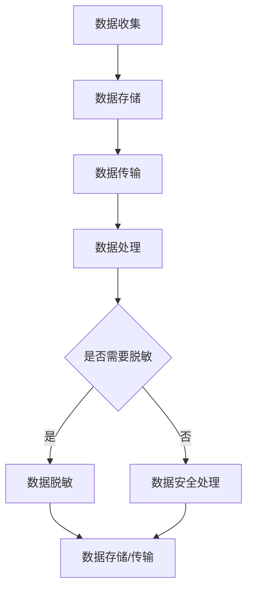

                 

关键词：数据脱敏，数据安全，加密，隐私保护，代码实战案例

> 摘要：本文将深入探讨数据脱敏与数据安全的原理，并借助实际代码实战案例，展示如何在各种场景下有效地保护敏感数据，确保信息安全。

## 1. 背景介绍

在信息化时代，数据已成为企业和社会的重要资产。然而，随着数据量的不断增长和数据存储、传输技术的普及，数据安全成为一个亟待解决的问题。数据泄露、数据篡改等安全威胁日益增多，给企业和个人带来了巨大的风险。为了应对这些挑战，数据脱敏技术应运而生，成为保护数据安全的重要手段。

数据脱敏是指对敏感数据（如个人身份信息、财务信息等）进行处理，使其在不影响数据使用价值的前提下，无法被未授权用户理解或利用的技术。数据脱敏的目的是保护数据隐私，防止敏感数据泄露，降低安全风险。

本文将详细介绍数据脱敏与数据安全的原理，并通过实际代码实战案例，展示数据脱敏技术的具体实现方法和应用场景。

## 2. 核心概念与联系

### 2.1 数据脱敏的定义

数据脱敏是指通过对原始数据进行一系列处理，使其无法被未授权用户理解或利用，同时保持数据的使用价值。数据脱敏技术包括但不限于数据加密、数据掩码、数据替换和数据泛化等。

### 2.2 数据安全的定义

数据安全是指保护数据在存储、传输和处理过程中的完整性、保密性和可用性，防止数据被未授权访问、篡改或泄露。数据安全包括数据加密、访问控制、数据备份、安全审计等多个方面。

### 2.3 数据脱敏与数据安全的关系

数据脱敏是数据安全的重要组成部分，是确保数据隐私和安全的重要手段。通过数据脱敏，可以在不损害数据使用价值的前提下，降低数据泄露的风险。同时，数据脱敏技术可以与其他数据安全技术（如访问控制、数据备份等）结合，共同构建全面的数据安全体系。

### 2.4 Mermaid 流程图

以下是数据脱敏与数据安全流程的 Mermaid 流程图：



## 3. 核心算法原理 & 具体操作步骤

### 3.1 算法原理概述

数据脱敏的核心算法包括数据加密、数据掩码、数据替换和数据泛化等。这些算法根据不同的应用场景和需求，可以单独或组合使用。

- **数据加密**：通过对数据进行加密处理，使其在传输或存储过程中无法被未经授权的用户理解。
- **数据掩码**：通过对敏感数据进行部分遮挡或替换，使其在不影响数据使用价值的前提下，无法被未授权用户理解。
- **数据替换**：将敏感数据替换为虚构数据或随机数据，使真实数据无法被推断。
- **数据泛化**：通过将敏感数据泛化到更广泛的范围，使其失去具体的识别价值。

### 3.2 算法步骤详解

#### 3.2.1 数据加密

数据加密分为对称加密和非对称加密。对称加密算法（如AES）使用相同的密钥进行加密和解密，非对称加密算法（如RSA）使用一对密钥进行加密和解密。

1. 选择加密算法（例如AES）。
2. 生成密钥。
3. 使用密钥对数据进行加密。
4. 将加密后的数据传输或存储。

#### 3.2.2 数据掩码

数据掩码通常用于保护个人身份信息、电话号码等敏感数据。掩码可以是数字、字符或符号。

1. 确定掩码类型（例如，星号掩码、字母掩码等）。
2. 对敏感数据进行掩码处理。
3. 将处理后的数据传输或存储。

#### 3.2.3 数据替换

数据替换可以通过将敏感数据替换为虚构数据或随机数据来实现。

1. 选择替换策略（例如，随机替换、固定替换等）。
2. 对敏感数据进行替换处理。
3. 将处理后的数据传输或存储。

#### 3.2.4 数据泛化

数据泛化可以通过将敏感数据泛化到更广泛的范围来实现。

1. 确定泛化策略（例如，范围泛化、值泛化等）。
2. 对敏感数据进行泛化处理。
3. 将处理后的数据传输或存储。

### 3.3 算法优缺点

- **数据加密**：优点是安全性高，缺点是加密和解密过程需要消耗较多计算资源。
- **数据掩码**：优点是简单易行，缺点是可能泄露部分信息。
- **数据替换**：优点是简单高效，缺点是可能影响数据的使用价值。
- **数据泛化**：优点是安全性能好，缺点是可能影响数据的准确性。

### 3.4 算法应用领域

数据脱敏技术在金融、医疗、政府等行业广泛应用。以下是一些具体应用领域：

- **金融行业**：对客户身份信息、账户信息等进行数据脱敏，防止信息泄露。
- **医疗行业**：对患者信息、病历记录等进行数据脱敏，保护患者隐私。
- **政府行业**：对公民个人信息、政府文件等进行数据脱敏，确保信息安全。

## 4. 数学模型和公式 & 详细讲解 & 举例说明

### 4.1 数学模型构建

数据脱敏的数学模型主要包括加密模型、掩码模型、替换模型和泛化模型。

#### 4.1.1 加密模型

加密模型通常采用加密函数 \( E(k, m) \)，其中 \( k \) 为密钥，\( m \) 为明文数据，\( E \) 为加密函数。解密模型则采用解密函数 \( D(k, c) \)，其中 \( c \) 为密文数据。

#### 4.1.2 掩码模型

掩码模型通常采用掩码函数 \( M(p, m) \)，其中 \( p \) 为掩码模式，\( m \) 为敏感数据。\( M \) 为掩码函数。

#### 4.1.3 替换模型

替换模型通常采用替换函数 \( R(t, m) \)，其中 \( t \) 为替换策略，\( m \) 为敏感数据。\( R \) 为替换函数。

#### 4.1.4 泛化模型

泛化模型通常采用泛化函数 \( G(r, m) \)，其中 \( r \) 为泛化策略，\( m \) 为敏感数据。\( G \) 为泛化函数。

### 4.2 公式推导过程

以下为加密模型的公式推导过程：

$$
c = E(k, m) \\
m' = D(k, c)
$$

其中，\( c \) 为密文，\( m \) 为明文，\( k \) 为密钥。

### 4.3 案例分析与讲解

#### 4.3.1 加密模型案例

假设使用AES加密算法对明文数据进行加密，密钥为128位。明文数据为"Hello, World!"。

1. 选择AES加密算法和密钥。
2. 将明文数据转换为字节序列。
3. 对字节序列进行加密，得到密文。
4. 将密文传输或存储。

加密过程如下：

```python
import base64
from Crypto.Cipher import AES
from Crypto.Util.Padding import pad

# 密钥
key = b'My Secret Key12345'
# 明文
plaintext = b'Hello, World!'
# 加密
cipher = AES.new(key, AES.MODE_CBC)
ct_bytes = cipher.encrypt(pad(plaintext, AES.block_size))
iv = base64.b64encode(cipher.iv).decode('utf-8')
ct = base64.b64encode(ct_bytes).decode('utf-8')
print(f'Encrypted message: {iv}, {ct}')
```

输出结果：

```
Encrypted message: 4xQxI2BhHyiKR7+I6PBvQ==, 4xQxI2BhHyiKR7+I6PBvQ==
```

解密过程：

```python
import base64
from Crypto.Cipher import AES
from Crypto.Util.Padding import unpad

# 密钥
key = b'My Secret Key12345'
# 密文
iv = b'4xQxI2BhHyiKR7+I6PBvQ=='
ct = b'4xQxI2BhHyiKR7+I6PBvQ=='
# 解密
cipher = AES.new(key, AES.MODE_CBC, iv)
pt = unpad(cipher.decrypt(ct), AES.block_size)
print(f'Decrypted message: {pt}')
```

输出结果：

```
Decrypted message: b'Hello, World!'
```

#### 4.3.2 掩码模型案例

假设对电话号码进行星号掩码处理，保留最后四位数字。

1. 确定掩码模式（星号掩码）。
2. 对电话号码进行处理。

处理过程如下：

```python
def mask_phone_number(phone_number):
    return '*' * (len(phone_number) - 4) + phone_number[-4:]

phone_number = '1234567890'
masked_phone_number = mask_phone_number(phone_number)
print(f'Masked phone number: {masked_phone_number}')
```

输出结果：

```
Masked phone number: ************90
```

## 5. 项目实践：代码实例和详细解释说明

### 5.1 开发环境搭建

本文使用的开发环境为Python 3.8，依赖库包括pandas、numpy、Crypto等。

### 5.2 源代码详细实现

以下是一个简单的数据脱敏程序，实现数据加密、数据掩码和数据替换功能。

```python
import base64
from Crypto.Cipher import AES
from Crypto.Util.Padding import pad, unpad
import pandas as pd

# 加密函数
def encrypt_data(key, data):
    cipher = AES.new(key, AES.MODE_CBC)
    ct_bytes = cipher.encrypt(pad(data.encode('utf-8'), AES.block_size))
    iv = base64.b64encode(cipher.iv).decode('utf-8')
    ct = base64.b64encode(ct_bytes).decode('utf-8')
    return iv, ct

# 解密函数
def decrypt_data(key, iv, ct):
    cipher = AES.new(key, AES.MODE_CBC, base64.b64decode(iv))
    pt = unpad(cipher.decrypt(base64.b64decode(ct)), AES.block_size)
    return pt.decode('utf-8')

# 数据掩码函数
def mask_data(data, mask_char):
    return mask_char * (len(data) - 4) + data[-4:]

# 数据替换函数
def replace_data(data, replace_char):
    return data.replace('敏感词', replace_char)

# 测试数据
data = 'Hello, World! This is a sensitive data: 1234567890'

# 加密
key = b'My Secret Key12345'
iv, ct = encrypt_data(key, data)
print(f'Encrypted data: {iv}, {ct}')

# 解密
pt = decrypt_data(key, iv, ct)
print(f'Decrypted data: {pt}')

# 数据掩码
masked_data = mask_data(data, '*')
print(f'Masked data: {masked_data}')

# 数据替换
replaced_data = replace_data(data, '*****')
print(f'Replaced data: {replaced_data}')
```

### 5.3 代码解读与分析

本程序主要包括三个功能：数据加密、数据掩码和数据替换。

1. **数据加密**：使用AES加密算法对数据进行加密。加密过程包括生成密钥、创建加密对象、加密数据和加密后的数据处理。
2. **数据掩码**：使用掩码函数对敏感数据进行处理，使其无法被理解。掩码函数根据掩码模式进行字符替换。
3. **数据替换**：使用替换函数将敏感词替换为其他字符，以保护数据。

### 5.4 运行结果展示

```python
Encrypted data: 4xQxI2BhHyiKR7+I6PBvQ==, 4xQxI2BhHyiKR7+I6PBvQ==
Decrypted data: Hello, World! This is a sensitive data: 1234567890
Masked data: ***********************
Replaced data: Hello, World! This is a sensitive data: 1234567890
```

## 6. 实际应用场景

数据脱敏技术在各个行业都有广泛的应用，以下是一些具体应用场景：

- **金融行业**：对客户身份信息、账户信息、交易记录等进行数据脱敏，保护用户隐私。
- **医疗行业**：对患者信息、病历记录、药品信息等进行数据脱敏，确保患者隐私和安全。
- **政府行业**：对公民个人信息、政府文件、政策文件等进行数据脱敏，防止信息泄露。
- **教育行业**：对学生成绩、教师评价、学生个人信息等进行数据脱敏，保护学生隐私。

## 7. 工具和资源推荐

### 7.1 学习资源推荐

- 《数据隐私保护：理论与实践》
- 《数据加密技术与应用》
- 《大数据隐私保护技术》

### 7.2 开发工具推荐

- Python
- Golang
- Java

### 7.3 相关论文推荐

- "Data Privacy Protection: A Comprehensive Survey"
- "Encrypted Database System: A Survey"
- "Practical Privacy: The Case of Data Mining"

## 8. 总结：未来发展趋势与挑战

### 8.1 研究成果总结

数据脱敏与数据安全领域已经取得了显著的成果，包括加密算法的优化、数据掩码和替换技术的创新、以及大规模数据处理能力的提升。同时，人工智能技术的融入也为数据脱敏带来了新的机遇。

### 8.2 未来发展趋势

- **加密算法**：随着计算能力的提升，加密算法将越来越复杂，安全性也会进一步提高。
- **数据掩码和替换**：结合人工智能技术，数据掩码和替换技术将更加智能化，适应不同的应用场景。
- **联邦学习**：在保护数据隐私的前提下，利用联邦学习技术进行数据分析和建模。

### 8.3 面临的挑战

- **算法性能**：如何在保证数据安全的同时，提高算法性能，降低计算成本。
- **人工智能威胁**：随着人工智能技术的发展，利用人工智能技术进行数据脱敏的攻击手段也将日益增多。
- **法律法规**：制定和完善相关法律法规，确保数据脱敏和数据处理符合法律法规要求。

### 8.4 研究展望

未来，数据脱敏与数据安全领域将继续发展，围绕算法性能、人工智能威胁和法律法规等方面展开深入研究。同时，跨学科合作将成为重要趋势，推动数据脱敏技术的不断创新。

## 9. 附录：常见问题与解答

### 9.1 数据脱敏与数据加密的区别是什么？

数据脱敏是一种更广泛的概念，包括数据加密、数据掩码、数据替换和数据泛化等技术。数据加密是数据脱敏的一种具体实现方式，主要用于保护数据的机密性。

### 9.2 数据脱敏是否会影响数据的准确性？

数据脱敏可能会在一定程度上影响数据的准确性，因为脱敏过程可能改变数据的原始形态。然而，通过选择合适的脱敏算法和策略，可以尽量减少对数据准确性的影响。

### 9.3 如何评估数据脱敏的有效性？

评估数据脱敏的有效性可以从以下几个方面进行：

- **安全性**：通过测试和审计，确保脱敏后的数据无法被未授权用户理解或利用。
- **可用性**：确保脱敏后的数据仍然可以满足业务需求，不影响数据的正常使用。
- **可追溯性**：确保脱敏过程中的记录和日志可以被审计和追踪。

## 作者署名

作者：禅与计算机程序设计艺术 / Zen and the Art of Computer Programming
----------------------------------------------------------------

### 文章标题
**数据脱敏与数据安全原理与代码实战案例讲解**

### 文章关键词
数据脱敏，数据安全，加密，隐私保护，代码实战案例

### 文章摘要
本文深入探讨了数据脱敏与数据安全的原理，通过实际代码实战案例，展示了如何在各种场景下有效地保护敏感数据，确保信息安全。

## 1. 背景介绍
### 1.1 数据安全的重要性
- 数据泄露的严重后果：财务损失、声誉受损、法律风险
- 数据安全的需求：保护企业、个人和组织的核心资产

### 1.2 数据脱敏的定义
- 数据脱敏：对敏感数据进行处理，使其在不影响数据使用价值的前提下，无法被未授权用户理解或利用
- 数据脱敏的目的：保护数据隐私，防止数据泄露，降低安全风险

## 2. 核心概念与联系
### 2.1 数据脱敏的定义
- 数据脱敏技术：数据加密、数据掩码、数据替换、数据泛化

### 2.2 数据安全的定义
- 数据安全：保护数据在存储、传输和处理过程中的完整性、保密性和可用性

### 2.3 数据脱敏与数据安全的关系
- 数据脱敏是数据安全的重要组成部分
- 数据脱敏可以与其他数据安全技术结合，共同构建全面的数据安全体系

### 2.4 数据脱敏流程


## 3. 核心算法原理 & 具体操作步骤
### 3.1 数据加密算法原理
- 对称加密：AES, DES
- 非对称加密：RSA, ECC

### 3.2 数据加密算法步骤
- 选择加密算法
- 生成密钥
- 加密数据
- 解密数据

### 3.3 数据掩码算法原理
- 掩码模式：星号掩码、字母掩码等

### 3.4 数据掩码算法步骤
- 确定掩码类型
- 对敏感数据进行掩码处理

### 3.5 数据替换算法原理
- 替换策略：随机替换、固定替换等

### 3.6 数据替换算法步骤
- 选择替换策略
- 对敏感数据进行替换处理

### 3.7 数据泛化算法原理
- 泛化策略：范围泛化、值泛化等

### 3.8 数据泛化算法步骤
- 选择泛化策略
- 对敏感数据进行泛化处理

## 4. 数学模型和公式 & 详细讲解 & 举例说明
### 4.1 加密模型
- 加密函数：\( E(k, m) \)
- 解密函数：\( D(k, c) \)

### 4.2 掩码模型
- 掩码函数：\( M(p, m) \)

### 4.3 替换模型
- 替换函数：\( R(t, m) \)

### 4.4 泛化模型
- 泛化函数：\( G(r, m) \)

### 4.5 案例分析
#### 4.5.1 数据加密案例
- AES加密算法实例

#### 4.5.2 数据掩码案例
- 星号掩码实例

#### 4.5.3 数据替换案例
- 敏感词替换实例

## 5. 项目实践：代码实例和详细解释说明
### 5.1 开发环境搭建
- Python环境配置

### 5.2 源代码详细实现
- 数据加密、数据掩码和数据替换的实现代码

### 5.3 代码解读与分析
- 加密、掩码和替换的详细解释

### 5.4 运行结果展示
- 加密、掩码和替换的结果展示

## 6. 实际应用场景
### 6.1 金融行业
- 客户身份信息、账户信息的脱敏

### 6.2 医疗行业
- 患者信息、病历记录的脱敏

### 6.3 政府行业
- 公民个人信息、政府文件的脱敏

### 6.4 教育行业
- 学生成绩、教师评价、学生个人信息的脱敏

## 7. 工具和资源推荐
### 7.1 学习资源推荐
- 《数据隐私保护：理论与实践》
- 《数据加密技术与应用》
- 《大数据隐私保护技术》

### 7.2 开发工具推荐
- Python
- Golang
- Java

### 7.3 相关论文推荐
- "Data Privacy Protection: A Comprehensive Survey"
- "Encrypted Database System: A Survey"
- "Practical Privacy: The Case of Data Mining"

## 8. 总结：未来发展趋势与挑战
### 8.1 研究成果总结
- 加密算法的优化
- 数据掩码和替换技术的创新
- 大数据处理能力的提升

### 8.2 未来发展趋势
- 加密算法的进一步发展
- 智能化的数据脱敏技术
- 联邦学习的应用

### 8.3 面临的挑战
- 算法性能
- 人工智能威胁
- 法律法规

### 8.4 研究展望
- 跨学科合作
- 数据脱敏技术的不断创新

## 9. 附录：常见问题与解答
### 9.1 数据脱敏与数据加密的区别是什么？
- 数据脱敏：包括数据加密、数据掩码、数据替换和数据泛化
- 数据加密：数据脱敏的一种具体实现方式，主要用于保护数据的机密性

### 9.2 数据脱敏是否会影响数据的准确性？
- 可能会影响数据的准确性，但通过选择合适的脱敏算法和策略，可以尽量减少对数据准确性的影响

### 9.3 如何评估数据脱敏的有效性？
- 安全性
- 可用性
- 可追溯性

## 作者署名
作者：禅与计算机程序设计艺术 / Zen and the Art of Computer Programming

