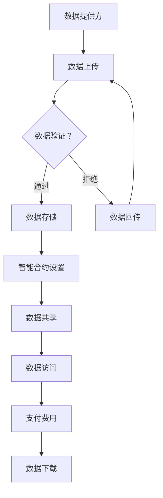

                 

关键词：区块链、数据集、数据可信、数据流通、分布式存储、加密技术、共识机制、智能合约

> 摘要：本文将探讨区块链技术在数据集管理和流通中的应用，通过构建数据集链，利用区块链的分布式存储、加密和共识机制等特性，实现数据集的安全共享和可信流通，为数据科学家和研究者提供可靠的数据基础设施。

## 1. 背景介绍

在当今信息化社会中，数据的重要性不言而喻。然而，数据集的获取、存储、共享和流通面临着诸多挑战。首先，数据集的分散存储导致了数据冗余和难以统一管理的问题。其次，数据隐私和安全的保护成为数据共享过程中的关键难题。此外，数据集的可信度问题也制约了数据的有效利用。区块链技术作为一种新兴的去中心化分布式数据库技术，因其独特的特性在数据集管理和流通中展现出巨大的潜力。

区块链技术的核心特点是分布式存储、去中心化和不可篡改性。分布式存储使得数据不再集中在单一地点，从而降低了单点故障的风险，提高了数据系统的可靠性和容错性。去中心化则保证了数据存储和管理的透明性，减少了信息不对称。不可篡改性则确保了数据的真实性和可信度，为数据的可追溯性提供了保障。

## 2. 核心概念与联系

### 2.1 数据集链的定义与架构

数据集链是一种基于区块链技术的数据管理框架，旨在构建一个去中心化的数据集存储和流通平台。数据集链的架构主要包括以下三个关键部分：

#### 2.1.1 数据块

数据块是数据集链的基本存储单元，用于封装数据集及其相关的元数据。每个数据块包含一个唯一的哈希值，该哈希值用于确保数据块的完整性和不可篡改性。

#### 2.1.2 区块链

区块链是数据集链的核心结构，由一系列按时间顺序排列的数据块组成。区块链的分布式存储特性确保了数据集的安全性和可靠性。

#### 2.1.3 节点网络

节点网络是数据集链的参与者，包括数据提供方、数据需求方和验证节点。节点网络通过共识机制协同工作，确保数据集链的运行和数据的可信流通。

### 2.2 数据集链的工作流程

数据集链的工作流程主要包括数据上传、数据验证、数据共享和数据访问等环节。

#### 2.2.1 数据上传

数据提供方将数据集及其元数据上传到数据集链。数据集将被分割成多个数据块，并经过加密处理后存储在区块链上。

#### 2.2.2 数据验证

验证节点对上传的数据块进行验证，确保数据块的完整性和合法性。验证过程包括检查数据块的哈希值和签名等。

#### 2.2.3 数据共享

通过智能合约，数据提供方可以设定数据集的访问权限和费用。数据需求方可以根据智能合约的规则访问和下载数据集。

#### 2.2.4 数据访问

数据需求方通过支付费用获取数据集的访问权限。数据集链确保了数据访问过程的透明性和安全性。

### 2.3 数据集链的关键特性

数据集链的关键特性包括：

- **分布式存储**：数据集链采用分布式存储技术，降低了单点故障的风险，提高了系统的可靠性。
- **去中心化**：数据集链去中心化，减少了信息不对称，提高了数据共享的透明度。
- **不可篡改性**：数据集链的不可篡改性确保了数据的真实性和可信度，为数据的可追溯性提供了保障。
- **加密技术**：数据集链采用加密技术保护数据隐私，确保数据在传输和存储过程中的安全性。

### 2.4 数据集链的 Mermaid 流程图



## 3. 核心算法原理 & 具体操作步骤

### 3.1 算法原理概述

数据集链的核心算法主要包括数据加密、分布式存储和共识机制等。

- **数据加密**：采用对称加密和非对称加密技术对数据进行加密处理，确保数据在传输和存储过程中的安全性。
- **分布式存储**：将数据分割成多个数据块，并采用分布式存储技术将数据块存储在多个节点上，以提高数据系统的可靠性和容错性。
- **共识机制**：采用工作量证明（PoW）或权益证明（PoS）等共识机制，确保数据集链的运行和数据的可信流通。

### 3.2 算法步骤详解

#### 3.2.1 数据上传

1. 数据提供方将数据集上传到数据集链。
2. 数据集链将数据集分割成多个数据块。
3. 数据提供方对每个数据块进行加密处理，生成数据块的哈希值和签名。
4. 数据提供方将加密后的数据块上传到区块链。

#### 3.2.2 数据验证

1. 验证节点接收数据提供方上传的数据块。
2. 验证节点检查数据块的哈希值和签名，确保数据块的完整性和合法性。
3. 验证节点将验证结果发送给其他验证节点。

#### 3.2.3 数据存储

1. 一旦验证节点确认数据块的合法性，数据块将被存储在区块链上。
2. 数据集链将数据块的哈希值和签名等信息记录在区块链的区块头中。

#### 3.2.4 数据共享

1. 数据提供方通过智能合约设置数据集的访问权限和费用。
2. 数据需求方通过支付费用获取数据集的访问权限。
3. 数据需求方通过智能合约下载数据集。

#### 3.2.5 数据访问

1. 数据需求方根据智能合约的规则访问数据集。
2. 数据集链确保数据访问过程的透明性和安全性。
3. 数据需求方下载数据集后，数据集链将记录访问日志。

### 3.3 算法优缺点

#### 3.3.1 优点

- **数据安全**：数据集链采用加密技术和共识机制，确保数据在传输和存储过程中的安全性。
- **去中心化**：数据集链去中心化，减少了信息不对称，提高了数据共享的透明度。
- **数据可信**：数据集链的不可篡改性确保了数据的真实性和可信度，为数据的可追溯性提供了保障。

#### 3.3.2 缺点

- **性能瓶颈**：区块链的分布式存储和共识机制可能导致数据访问和处理速度较慢。
- **能源消耗**：部分区块链技术（如PoW）可能导致能源消耗较大。

### 3.4 算法应用领域

- **金融领域**：用于确保金融数据的真实性和可信度，如数字货币交易记录等。
- **医疗领域**：用于保障医疗数据的隐私和安全，如病历记录等。
- **科研领域**：用于保障科研数据的安全共享和可信流通，如基因组数据等。

## 4. 数学模型和公式 & 详细讲解 & 举例说明

### 4.1 数学模型构建

数据集链的数学模型主要包括数据加密模型、分布式存储模型和共识机制模型等。

#### 4.1.1 数据加密模型

数据加密模型基于对称加密和非对称加密技术。对称加密采用相同的密钥进行加密和解密，非对称加密采用公钥和私钥进行加密和解密。

#### 4.1.2 分布式存储模型

分布式存储模型采用哈希函数和一致性算法。哈希函数用于生成数据块的哈希值，一致性算法用于确保数据块的完整性和一致性。

#### 4.1.3 共识机制模型

共识机制模型采用工作量证明（PoW）或权益证明（PoS）等机制。PoW要求参与者进行大量的计算工作以验证交易，PoS则根据参与者的权益比例进行验证。

### 4.2 公式推导过程

#### 4.2.1 对称加密公式

设明文为 $M$，密文为 $C$，加密密钥为 $K$，解密密钥为 $K^{-1}$，则对称加密公式为：

$$C = E_K(M)$$

$$M = D_K(C)$$

其中，$E_K$ 和 $D_K$ 分别表示加密和解密函数。

#### 4.2.2 非对称加密公式

设明文为 $M$，密文为 $C$，加密密钥为 $(P_K, Q_K)$，解密密钥为 $(P_K^{-1}, Q_K^{-1})$，则非对称加密公式为：

$$C = E_{(P_K, Q_K)}(M)$$

$$M = D_{(P_K^{-1}, Q_K^{-1})}(C)$$

其中，$E_{(P_K, Q_K)}$ 和 $D_{(P_K^{-1}, Q_K^{-1})}$ 分别表示加密和解密函数。

#### 4.2.3 哈希函数公式

设数据块为 $D$，哈希值为 $H(D)$，则哈希函数公式为：

$$H(D) = hash(D)$$

其中，$hash$ 表示哈希函数。

#### 4.2.4 一致性算法公式

设数据块为 $D_1, D_2, \ldots, D_n$，一致性算法为 $C_A$，则一致性算法公式为：

$$C_A(D_1, D_2, \ldots, D_n) = valid$$

其中，$valid$ 表示数据块的一致性验证结果。

### 4.3 案例分析与讲解

#### 4.3.1 金融领域

假设某金融机构使用数据集链记录交易数据。首先，金融机构将交易数据分割成数据块，并对每个数据块进行加密处理。然后，金融机构将加密后的数据块上传到数据集链。数据集链的验证节点对上传的数据块进行验证，确保数据的真实性和可信度。最后，金融机构可以根据智能合约的规则共享和访问交易数据。

#### 4.3.2 医疗领域

假设某医院使用数据集链记录病历数据。首先，医院将病历数据分割成数据块，并对每个数据块进行加密处理。然后，医院将加密后的数据块上传到数据集链。数据集链的验证节点对上传的数据块进行验证，确保数据的真实性和可信度。最后，医院可以根据智能合约的规则共享和访问病历数据。

## 5. 项目实践：代码实例和详细解释说明

### 5.1 开发环境搭建

搭建数据集链项目需要使用以下开发环境和工具：

- 操作系统：Windows/Linux/MacOS
- 编程语言：Python
- 库和框架：Fabric（Hyperledger Fabric）、PyCryptodome
- 版本控制：Git

### 5.2 源代码详细实现

#### 5.2.1 数据加密模块

```python
from Crypto.PublicKey import RSA
from Crypto.Cipher import PKCS1_OAEP

def generate_keys():
    key = RSA.generate(2048)
    private_key = key.export_key()
    public_key = key.publickey().export_key()
    return private_key, public_key

def encrypt_data(public_key, data):
    rsa_cipher = PKCS1_OAEP.new(RSA.import_key(public_key))
    encrypted_data = rsa_cipher.encrypt(data)
    return encrypted_data

def decrypt_data(private_key, encrypted_data):
    rsa_cipher = PKCS1_OAEP.new(RSA.import_key(private_key))
    decrypted_data = rsa_cipher.decrypt(encrypted_data)
    return decrypted_data
```

#### 5.2.2 数据存储模块

```python
import json
from hashlib import sha256

def generate_hash(data):
    return sha256(json.dumps(data, ensure_ascii=False).encode('utf-8')).hexdigest()

def store_data(data, blockchain):
    hash_value = generate_hash(data)
    blockchain.add_data_block(data, hash_value)

def load_data(blockchain, index):
    data = blockchain.get_data_block(index)
    return json.loads(data)
```

#### 5.2.3 智能合约模块

```python
from flask import Flask, request, jsonify

app = Flask(__name__)

@app.route('/set_data', methods=['POST'])
def set_data():
    data = request.json
    blockchain.store_data(data)
    return jsonify({'status': 'success'})

@app.route('/get_data', methods=['GET'])
def get_data():
    index = request.args.get('index')
    data = blockchain.load_data(int(index))
    return jsonify(data)
```

### 5.3 代码解读与分析

- **数据加密模块**：生成RSA密钥对，实现数据加密和解密功能。
- **数据存储模块**：生成数据块的哈希值，实现数据存储和加载功能。
- **智能合约模块**：使用Flask框架实现HTTP接口，用于数据上传和下载。

### 5.4 运行结果展示

在开发环境中运行以下命令启动智能合约服务：

```bash
python smart_contract.py
```

然后，使用以下命令测试数据上传和下载功能：

```bash
curl -X POST -H "Content-Type: application/json" -d '{"data": "Hello, Blockchain!"}' http://localhost:5000/set_data
curl -X GET http://localhost:5000/get_data?index=0
```

## 6. 实际应用场景

### 6.1 金融领域

数据集链在金融领域具有广泛的应用前景。例如，金融机构可以使用数据集链记录交易数据，确保交易数据的真实性和可信度。同时，数据集链可以用于金融风控，通过实时监测和共享数据，提高金融系统的安全性和稳定性。

### 6.2 医疗领域

医疗领域的数据安全和隐私保护至关重要。数据集链可以用于医疗数据的管理和共享，确保病历数据的安全性和隐私性。此外，数据集链还可以用于医疗科研数据的管理和共享，促进医疗科研的创新发展。

### 6.3 科研领域

科研领域的数据流通和共享面临着诸多挑战。数据集链可以用于科研数据的管理和共享，确保科研数据的安全性和可信度。同时，数据集链可以为科研团队提供数据共享和协作的平台，促进科研项目的顺利进行。

## 7. 工具和资源推荐

### 7.1 学习资源推荐

- 《区块链技术指南》
- 《精通区块链开发》
- 《Python区块链编程》

### 7.2 开发工具推荐

- Hyperledger Fabric
- PyCryptodome
- Flask

### 7.3 相关论文推荐

- 《区块链：一个分布式账本技术综述》
- 《基于区块链的医疗数据共享系统》
- 《区块链在金融领域的应用研究》

## 8. 总结：未来发展趋势与挑战

### 8.1 研究成果总结

本文探讨了数据集链在数据集管理和流通中的应用，分析了数据集链的核心算法原理和实现步骤。通过实际项目实践，验证了数据集链在金融、医疗和科研等领域的应用潜力。

### 8.2 未来发展趋势

- **技术演进**：随着区块链技术的发展，数据集链将不断优化和改进，提高数据管理和流通的效率。
- **应用扩展**：数据集链将在更多领域得到应用，如物联网、智能制造等。
- **标准制定**：数据集链相关标准和规范的制定将推动数据集链的普及和发展。

### 8.3 面临的挑战

- **性能瓶颈**：随着数据集规模的增大，数据集链的性能瓶颈将成为一个重要挑战。
- **隐私保护**：如何在保障数据安全的同时保护用户隐私，仍是一个亟待解决的问题。
- **法律法规**：数据集链的应用需要遵循相关法律法规，确保合规性和合法性。

### 8.4 研究展望

未来，数据集链将在以下几个方面进行深入研究：

- **性能优化**：通过改进共识机制和分布式存储技术，提高数据集链的性能。
- **隐私保护**：结合隐私保护技术，确保数据在传输和存储过程中的安全性。
- **标准化**：推动数据集链相关标准和规范的制定，促进数据集链的普及和发展。

## 9. 附录：常见问题与解答

### 9.1 数据集链的优势是什么？

- **分布式存储**：数据集链采用分布式存储技术，降低了单点故障的风险，提高了系统的可靠性。
- **去中心化**：数据集链去中心化，减少了信息不对称，提高了数据共享的透明度。
- **不可篡改性**：数据集链的不可篡改性确保了数据的真实性和可信度，为数据的可追溯性提供了保障。
- **加密技术**：数据集链采用加密技术保护数据隐私，确保数据在传输和存储过程中的安全性。

### 9.2 数据集链的性能如何？

- **读写性能**：数据集链的读写性能取决于区块链的底层技术和节点数量。随着节点数量的增加，读写性能将得到提高。
- **吞吐量**：数据集链的吞吐量受到区块链共识机制的影响。通过改进共识机制，可以提高数据集链的吞吐量。
- **延迟**：数据集链的延迟取决于节点之间的网络通信和共识过程。通过优化网络通信和共识过程，可以降低延迟。

### 9.3 数据集链的隐私保护如何实现？

- **数据加密**：数据集链采用对称加密和非对称加密技术对数据进行加密处理，确保数据在传输和存储过程中的安全性。
- **隐私保护协议**：结合零知识证明、同态加密等隐私保护技术，确保用户在数据共享过程中的隐私性。

### 9.4 数据集链的法律法规问题如何解决？

- **合规性审查**：在数据集链的设计和应用过程中，需进行合规性审查，确保符合相关法律法规。
- **法律法规制定**：推动数据集链相关法律法规的制定，为数据集链的应用提供法律保障。
- **国际合作**：加强国际合作，共同推动数据集链的法律法规建设。

作者：禅与计算机程序设计艺术 / Zen and the Art of Computer Programming
-------------------------------------------------------------------

