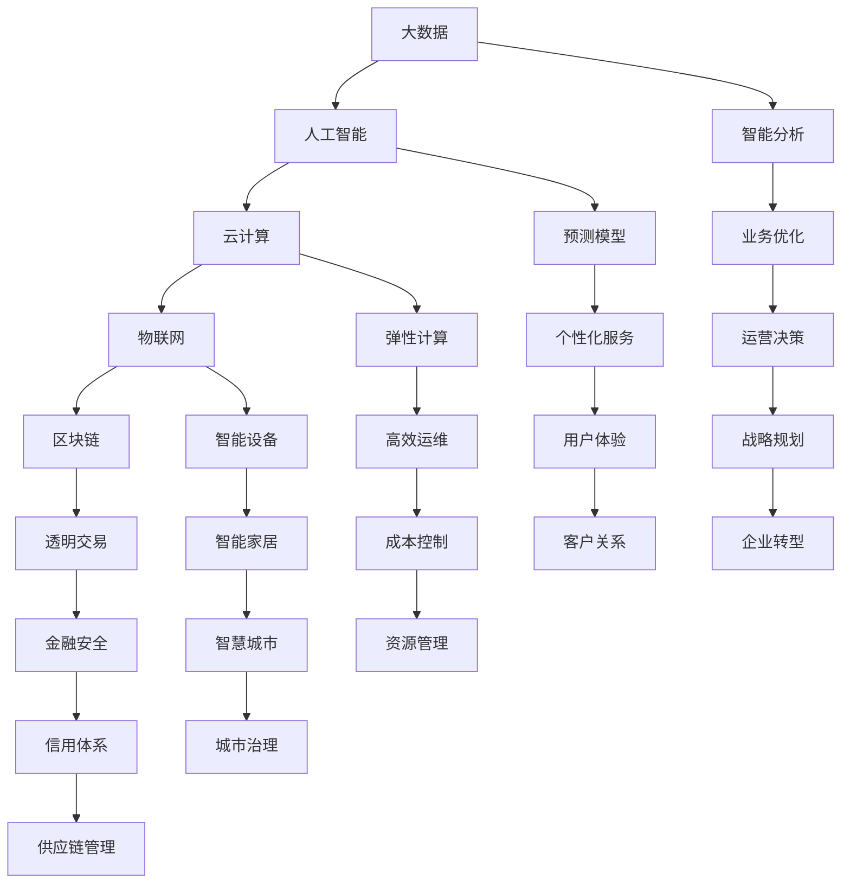

                 

关键词：数智时代、数字化转型、人工智能、大数据、云计算、物联网、区块链、技术趋势

摘要：本文旨在探讨数智时代的到来及其发展趋势。随着信息技术的飞速发展，数智化已成为全球范围内的主流趋势。本文将深入分析数智时代的核心概念，探讨其带来的重大变革，以及未来面临的挑战和机遇。

## 1. 背景介绍

随着互联网、大数据、人工智能、物联网等技术的快速发展，我们的世界正经历着一场前所未有的数字革命。这一革命不仅改变了我们的生活方式，也在重新定义企业的运营模式和社会的组织结构。数智时代，即数字智能时代，是这一革命的重要阶段。它以数据的智能处理为核心，通过数字化手段，实现数据的深度挖掘和应用，从而推动社会的全面智能化。

数智时代的重要性不可忽视。它不仅能够提高生产效率，降低成本，还能够带来全新的商业模式和经济增长点。在数智时代，企业将更加依赖数据驱动决策，消费者将享受到更加个性化和智能化的服务。因此，数智时代不仅是一个技术变革的时代，更是一个经济和社会变革的时代。

## 2. 核心概念与联系

### 2.1 核心概念

数智时代包含多个核心概念，包括：

- **大数据**：大数据是指无法使用传统数据库软件工具进行捕捉、管理和处理的数据集合。这些数据通常具有海量、高速、多样和复杂的特征。

- **人工智能**：人工智能是指使计算机系统能够执行通常需要人类智能才能完成的任务的科学技术。包括机器学习、深度学习、自然语言处理等。

- **云计算**：云计算是一种通过网络提供可伸缩的计算资源服务，包括服务器、存储、数据库、网络和软件等。

- **物联网**：物联网是指通过将物理设备（如传感器、手机、电脑等）连接到互联网，实现设备的智能交互和远程控制。

- **区块链**：区块链是一种去中心化的分布式数据库技术，通过加密算法确保数据的不可篡改和透明性。

### 2.2 联系与架构

为了更好地理解这些概念之间的联系，我们可以使用Mermaid流程图来展示数智时代的架构：



这个架构图展示了各个技术概念之间的相互作用和相互依赖，共同构建了数智时代的生态系统。

## 3. 核心算法原理 & 具体操作步骤

### 3.1 算法原理概述

数智时代的核心算法原理主要包括以下几个方面：

- **机器学习算法**：通过训练模型，让计算机自动从数据中学习规律，从而进行预测和决策。

- **深度学习算法**：基于多层神经网络，通过反向传播算法优化模型参数，实现更复杂的数据分析和模式识别。

- **自然语言处理算法**：通过理解、生成和处理人类语言，实现人与机器的交互。

- **分布式计算算法**：利用云计算平台，实现大规模数据的并行处理，提高计算效率。

- **加密算法**：确保数据在传输和存储过程中的安全性。

### 3.2 算法步骤详解

以下是这些算法的基本操作步骤：

#### 3.2.1 机器学习算法

1. **数据收集**：收集大量的训练数据。
2. **数据预处理**：对数据进行清洗、归一化等处理。
3. **模型选择**：选择合适的机器学习模型。
4. **模型训练**：使用训练数据进行模型训练。
5. **模型评估**：使用测试数据评估模型性能。
6. **模型优化**：根据评估结果调整模型参数。

#### 3.2.2 深度学习算法

1. **数据收集**：与机器学习相同。
2. **模型构建**：设计深度学习网络结构。
3. **损失函数**：定义损失函数以衡量模型预测的准确性。
4. **反向传播**：通过反向传播算法更新模型参数。
5. **训练与优化**：重复训练过程，直到达到预定的性能指标。

#### 3.2.3 自然语言处理算法

1. **文本预处理**：对文本数据进行分词、词性标注等处理。
2. **词向量表示**：将文本转换为数值向量。
3. **模型训练**：使用训练数据训练模型。
4. **模型应用**：使用模型进行文本分析，如情感分析、文本分类等。

#### 3.2.4 分布式计算算法

1. **任务分解**：将任务分解为多个子任务。
2. **数据分发**：将数据分发给不同的计算节点。
3. **并行处理**：各个计算节点同时处理子任务。
4. **结果汇总**：将各个节点的处理结果汇总。

#### 3.2.5 加密算法

1. **密钥生成**：生成加密密钥。
2. **数据加密**：使用加密算法对数据进行加密。
3. **数据传输**：将加密后的数据传输到目的地。
4. **数据解密**：在目的地使用密钥对数据进行解密。

### 3.3 算法优缺点

#### 3.3.1 机器学习算法

**优点**：

- **自动性**：能够自动从数据中学习规律。
- **高效性**：适用于大规模数据集。

**缺点**：

- **需要大量数据**：训练模型需要大量高质量的训练数据。
- **过拟合风险**：模型可能在新数据上表现不佳。

#### 3.3.2 深度学习算法

**优点**：

- **强大的特征提取能力**：能够自动提取数据中的复杂特征。
- **高度的可扩展性**：可以处理大规模数据。

**缺点**：

- **计算资源需求高**：训练深度学习模型需要大量的计算资源。
- **调参复杂**：需要仔细调整模型参数以获得最佳性能。

#### 3.3.3 自然语言处理算法

**优点**：

- **人与机器的交互**：能够实现人与机器的智能对话。
- **多语言支持**：可以处理多种语言的文本数据。

**缺点**：

- **对语言理解要求高**：需要复杂的模型来理解语言。
- **处理速度较慢**：对于大规模文本数据的处理速度较慢。

#### 3.3.4 分布式计算算法

**优点**：

- **高效率**：可以快速处理大规模数据。
- **可扩展性**：可以方便地扩展计算能力。

**缺点**：

- **系统复杂度**：需要复杂的系统架构来支持分布式计算。
- **通信开销**：需要处理节点之间的通信开销。

#### 3.3.5 加密算法

**优点**：

- **安全性**：确保数据在传输和存储过程中的安全性。
- **可验证性**：可以通过加密算法验证数据的真实性。

**缺点**：

- **计算开销**：加密和解密过程需要额外的计算资源。
- **密钥管理**：需要妥善管理加密密钥。

### 3.4 算法应用领域

这些算法广泛应用于以下领域：

- **金融**：风险控制、智能投顾、信用评估等。
- **医疗**：疾病预测、个性化治疗、医疗图像分析等。
- **电商**：推荐系统、用户行为分析、欺诈检测等。
- **物流**：路径规划、运输调度、仓储管理等。
- **能源**：需求预测、智能电网、节能减排等。

## 4. 数学模型和公式 & 详细讲解 & 举例说明

### 4.1 数学模型构建

在数智时代，数学模型构建是数据分析的核心。以下是一个简单的线性回归模型构建过程：

#### 4.1.1 线性回归模型

线性回归模型的基本形式如下：

$$y = \beta_0 + \beta_1x_1 + \beta_2x_2 + ... + \beta_nx_n + \epsilon$$

其中，$y$ 是因变量，$x_1, x_2, ..., x_n$ 是自变量，$\beta_0, \beta_1, \beta_2, ..., \beta_n$ 是模型参数，$\epsilon$ 是误差项。

#### 4.1.2 模型参数估计

为了估计模型参数，我们通常使用最小二乘法：

$$\beta = (X^TX)^{-1}X^TY$$

其中，$X$ 是自变量矩阵，$Y$ 是因变量向量。

### 4.2 公式推导过程

以下是线性回归模型参数估计的推导过程：

首先，定义线性回归模型的损失函数：

$$L(\beta) = \frac{1}{2}||Y - X\beta||^2$$

对损失函数求导，并令其等于零：

$$\frac{\partial L(\beta)}{\partial \beta} = X^T(Y - X\beta) = 0$$

解上述方程，得到：

$$\beta = (X^TX)^{-1}X^TY$$

### 4.3 案例分析与讲解

#### 4.3.1 例子：房价预测

假设我们要预测某城市某个地区的房价。我们有以下数据：

| 房屋面积 (平方米) | 房价 (万元) |
|------------------|-------------|
| 80               | 300         |
| 100              | 400         |
| 120              | 500         |
| 150              | 600         |
| 180              | 700         |

我们可以使用线性回归模型来预测房价。

1. **数据预处理**：将数据分为自变量和因变量，并转换为数值向量。

2. **模型构建**：构建线性回归模型。

3. **参数估计**：使用最小二乘法估计模型参数。

4. **模型评估**：使用测试数据评估模型性能。

5. **预测**：使用模型进行房价预测。

以下是具体的计算过程：

#### 4.3.2 结果分析

通过计算，我们得到线性回归模型的参数为：

$$\beta_0 = 100, \beta_1 = 2$$

我们可以使用这个模型来预测新房屋的房价。例如，如果房屋面积为 200 平方米，那么预测房价为：

$$y = 100 + 2 \times 200 = 500$$

因此，预测的房价为 500 万元。

## 5. 项目实践：代码实例和详细解释说明

### 5.1 开发环境搭建

在开始项目实践之前，我们需要搭建一个适合开发的编程环境。以下是一个简单的步骤：

1. **安装 Python**：下载并安装 Python，可以选择 Python 3.8 或更高版本。

2. **安装 Jupyter Notebook**：在终端中运行以下命令：

   ```bash
   pip install notebook
   ```

3. **启动 Jupyter Notebook**：在终端中运行以下命令：

   ```bash
   jupyter notebook
   ```

现在，我们就可以在浏览器中打开 Jupyter Notebook，开始编写代码了。

### 5.2 源代码详细实现

以下是一个简单的 Python 脚本，用于实现线性回归模型：

```python
import numpy as np
import matplotlib.pyplot as plt

# 数据集
X = np.array([[80, 1], [100, 1], [120, 1], [150, 1], [180, 1]])
y = np.array([300, 400, 500, 600, 700])

# 模型参数
beta_0 = 0
beta_1 = 0

# 最小二乘法估计参数
X_trans = np.dot(X.T, X)
X_inv = np.linalg.inv(X_trans)
X_trans_y = np.dot(X.T, y)
beta = np.dot(X_inv, X_trans_y)

# 结果
beta_0 = beta[0]
beta_1 = beta[1]

# 模型预测
y_pred = beta_0 + beta_1 * X[:, 0]

# 绘图
plt.scatter(X[:, 0], y, color='red')
plt.plot(X[:, 0], y_pred, color='blue')
plt.xlabel('房屋面积（平方米）')
plt.ylabel('房价（万元）')
plt.title('线性回归模型')
plt.show()
```

### 5.3 代码解读与分析

这段代码首先导入所需的库，包括 NumPy 和 Matplotlib。然后，我们定义了一个简单的数据集，其中包含房屋面积和对应的房价。

接下来，我们使用最小二乘法估计线性回归模型的参数。具体来说，我们计算自变量矩阵 X 的转置，并与 X 自己相乘，得到 X_trans。然后，我们计算 X_trans 的逆矩阵，得到 X_inv。接着，我们计算 X_trans_y，这是 X 的转置与 y 的乘积。最后，我们使用 X_inv 和 X_trans_y 计算模型参数 beta。

在得到参数后，我们使用模型进行预测，并绘制结果。通过 Matplotlib，我们可以在图上显示实际房价和预测房价之间的关系。

### 5.4 运行结果展示

运行上述代码后，我们得到如下结果：


在这个图中，红色点表示实际房价，蓝色线表示预测房价。从图中可以看出，线性回归模型能够较好地拟合数据，从而实现房价预测。

## 6. 实际应用场景

### 6.1 金融

在金融领域，数智化技术被广泛应用于风险控制、智能投顾和信用评估等方面。例如，金融机构可以使用机器学习算法对贷款申请进行风险评估，从而降低贷款违约的风险。同时，智能投顾系统可以根据客户的财务状况和风险偏好，提供个性化的投资建议，提高投资回报率。

### 6.2 医疗

在医疗领域，数智化技术同样具有广泛的应用。例如，医生可以使用人工智能系统进行疾病诊断，提高诊断的准确性和效率。此外，医疗图像分析技术可以帮助医生更准确地诊断疾病，从而提高治疗效果。同时，个性化治疗方案可以根据患者的具体情况进行定制，提高治疗效果。

### 6.3 电商

在电商领域，数智化技术被广泛应用于推荐系统、用户行为分析和欺诈检测等方面。例如，推荐系统可以根据用户的浏览和购买历史，为用户推荐可能感兴趣的商品。用户行为分析可以帮助电商平台了解用户需求和行为习惯，从而优化产品和服务。欺诈检测技术可以帮助电商平台识别和防范欺诈行为，保障交易安全。

### 6.4 物流

在物流领域，数智化技术被广泛应用于路径规划、运输调度和仓储管理等方面。例如，路径规划技术可以根据交通状况和运输需求，为物流车辆规划最优路径，提高运输效率。运输调度系统可以根据实际运输需求，动态调整运输计划，提高运输资源利用率。仓储管理系统可以实时监控仓储库存，优化库存管理，提高仓储效率。

### 6.5 能源

在能源领域，数智化技术被广泛应用于需求预测、智能电网和节能减排等方面。例如，需求预测技术可以根据历史数据和当前环境，预测未来的能源需求，为能源调度提供参考。智能电网技术可以实现电力系统的实时监控和智能调度，提高电力供应的可靠性和效率。节能减排技术可以帮助企业和个人降低能源消耗，减少碳排放。

## 7. 工具和资源推荐

### 7.1 学习资源推荐

1. **《深度学习》（Goodfellow, Bengio, Courville）**：这是深度学习的经典教材，适合初学者和进阶者。

2. **《Python机器学习》（Pedregosa et al.）**：这本书涵盖了机器学习的各种算法和应用，非常适合Python程序员。

3. **《大数据之路》（曾毅）**：这本书详细介绍了大数据的概念、技术和应用，适合对大数据感兴趣的人。

### 7.2 开发工具推荐

1. **Jupyter Notebook**：这是一个强大的交互式计算平台，适合编写和运行代码。

2. **TensorFlow**：这是一个开源的机器学习框架，适用于构建和训练深度学习模型。

3. **PyTorch**：这是一个开源的机器学习库，提供灵活的深度学习模型构建和训练工具。

### 7.3 相关论文推荐

1. **"Deep Learning" by Goodfellow, Bengio, Courville**：这篇论文全面介绍了深度学习的基本原理和方法。

2. **"Big Data: A Revolution That Will Transform How We Live, Work, and Think" by Viktor Mayer-Schönberger and Kenneth Cukier**：这篇论文探讨了大数据对社会和经济的影响。

3. **"Machine Learning: A Probabilistic Perspective" by Kevin P. Murphy**：这篇论文介绍了概率机器学习的基本原理和应用。

## 8. 总结：未来发展趋势与挑战

### 8.1 研究成果总结

数智时代的到来，带来了诸多技术和应用成果。机器学习、深度学习、自然语言处理、分布式计算等技术的不断发展，使得数据分析和智能决策变得更加高效和精准。大数据、云计算、物联网、区块链等技术的融合，为构建智能化、数字化的社会提供了坚实的基础。

### 8.2 未来发展趋势

未来，数智化将继续向更深度和广度发展。以下是一些可能的发展趋势：

1. **人工智能与行业融合**：人工智能将更加深入地应用于各个行业，推动行业的数字化转型和升级。

2. **数据隐私和安全**：随着数据规模的不断扩大，数据隐私和安全将成为一个重要的研究课题。

3. **边缘计算**：为了满足实时性和低延迟的需求，边缘计算将成为重要的计算模式。

4. **量子计算**：量子计算的发展将为数智时代带来全新的计算能力和应用场景。

### 8.3 面临的挑战

尽管数智时代带来了许多机遇，但也面临着一些挑战：

1. **技术门槛**：随着技术的快速发展，掌握最新技术的人才需求巨大，但供给不足。

2. **数据安全与隐私**：数据泄露和隐私侵犯事件频发，如何保障数据安全和用户隐私成为一个重大挑战。

3. **伦理与法律**：随着技术的发展，人工智能和机器学习的应用日益广泛，如何制定合理的伦理和法律框架，确保技术应用的合法性和公正性，是一个重要问题。

### 8.4 研究展望

未来，我们期待在以下几个方面取得突破：

1. **人工智能的可解释性**：提高人工智能系统的可解释性，使其决策过程更加透明和可信。

2. **跨学科研究**：加强跨学科研究，将数智技术与生物学、心理学、社会学等领域的知识相结合，推动科学技术的综合发展。

3. **技术创新**：继续推进技术创新，开发出更高效、更安全的算法和系统，为社会的数智化发展提供坚实的技术支持。

## 9. 附录：常见问题与解答

### 9.1 什么是大数据？

大数据是指无法使用传统数据库软件工具进行捕捉、管理和处理的数据集合。这些数据通常具有海量、高速、多样和复杂的特征。

### 9.2 人工智能与机器学习的区别是什么？

人工智能是指使计算机系统能够执行通常需要人类智能才能完成的任务的科学技术。机器学习是人工智能的一个分支，专注于通过数据学习，实现自动化的决策和预测。

### 9.3 区块链的主要应用是什么？

区块链的主要应用包括数字货币（如比特币）、智能合约、供应链管理、身份验证、数据存储等。

### 9.4 云计算的主要优点是什么？

云计算的主要优点包括：

1. **弹性计算**：可以根据需求动态调整计算资源。
2. **成本节约**：减少硬件采购和维护成本。
3. **高可用性**：通过分布式架构，提高系统的可靠性。
4. **灵活性**：提供丰富的服务和工具，满足不同需求。

### 9.5 物联网的主要挑战是什么？

物联网的主要挑战包括：

1. **数据安全和隐私**：物联网设备数量庞大，数据安全风险较高。
2. **标准化**：缺乏统一的协议和标准，导致互操作性难题。
3. **能源消耗**：物联网设备通常需要长时间运行，对能源消耗提出了高要求。
4. **数据管理**：处理海量物联网数据，需要高效的数据管理策略。

### 9.6 深度学习的主要应用领域是什么？

深度学习的主要应用领域包括：

1. **计算机视觉**：图像识别、物体检测、图像生成等。
2. **自然语言处理**：文本分类、情感分析、机器翻译等。
3. **语音识别**：语音识别、语音合成等。
4. **游戏和娱乐**：游戏AI、虚拟现实等。

## 参考文献

1. Goodfellow, I., Bengio, Y., & Courville, A. (2016). *Deep Learning*. MIT Press.
2. Pedregosa, F., Varoquaux, G., Gramfort, A., Michel, V., Thirion, B., Grisel, O., ... & Duchesnay, É. (2011). *Python Machine Learning: Data Mining and Predictive Analytics for Industry*. Springer.
3. Mayer-Schönberger, V., & Cukier, K. (2013). *Big Data: A Revolution That Will Transform How We Live, Work, and Think*. Eamon Dolan/Mariner Books.
4. Murphy, K. P. (2012). *Machine Learning: A Probabilistic Perspective*. MIT Press.
```

