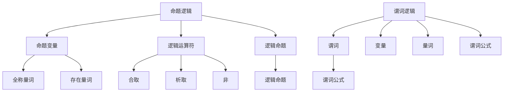

                 

关键词：数理逻辑、形式符号、逻辑运算、谓词逻辑、命题逻辑、逻辑演算

> 摘要：本文旨在深入探讨数理逻辑中形式符号的定义和应用。通过分析命题逻辑和谓词逻辑，阐述其基本原理和运算规则，并探讨这些概念在计算机科学领域的广泛应用。本文不仅提供了清晰的数学模型和公式，还通过实例代码和实际应用场景，帮助读者更好地理解数理逻辑的重要性。

## 1. 背景介绍

数理逻辑（Mathematical Logic）是数学的分支，它运用数学的严谨性来研究逻辑的基本原理和性质。在计算机科学领域，数理逻辑扮演着至关重要的角色，因为它是构建程序语言和编译器的基础，也是验证算法正确性的关键工具。

数理逻辑主要包括命题逻辑（Propositional Logic）和谓词逻辑（Predicate Logic）。命题逻辑研究命题之间的关系，如真值、推理等；而谓词逻辑则进一步引入了变量、函数和量词等概念，使得逻辑表达更加丰富和复杂。

本文将首先介绍数理逻辑的基本概念，然后深入探讨形式符号的定义和应用，并通过具体的实例和代码展示数理逻辑在计算机科学中的实际应用。

## 2. 核心概念与联系

### 2.1 命题逻辑

命题逻辑是最基本的逻辑形式，它处理最基本的逻辑单元——命题。一个命题要么为真，要么为假。命题逻辑中的基本元素包括命题变量、逻辑运算符和逻辑命题。

#### 命题变量

命题变量是一个基本的逻辑单元，用符号P、Q、R等表示。命题变量可以代表一个简单的陈述句，例如“今天下雨”。

#### 逻辑运算符

逻辑运算符用于组合命题变量，形成新的命题。常见的逻辑运算符有：

- **合取（AND）**：用符号 ∧ 表示，表示两个命题同时为真。
- **析取（OR）**：用符号 ∨ 表示，表示两个命题至少有一个为真。
- **非（NOT）**：用符号 ¬ 表示，表示命题的真值取反。

#### 逻辑命题

逻辑命题是由命题变量和逻辑运算符组成的复合命题。例如，“P ∧ Q”表示“P 和 Q 同时为真”。

### 2.2 谓词逻辑

谓词逻辑是命题逻辑的扩展，它引入了变量、函数和量词等概念，使得逻辑表达更加丰富和复杂。

#### 谓词

谓词是一个属性或关系的描述，用符号F、G、H等表示。例如，谓词“isEven(n)”表示“n 是偶数”。

#### 变量

变量是谓词逻辑中的基本元素，用于表示未知对象。常见的变量有x、y、z等。

#### 量词

量词用于指定变量的取值范围。常见的量词有全称量词（∀）和存在量词（∃）。全称量词表示对所有变量的取值都满足谓词；存在量词表示至少存在一个变量的取值满足谓词。

#### 谓词公式

谓词公式是由谓词、变量和量词等组成的复合表达式。例如，“∀x (isEven(x) → x ≤ 2)”表示“对于所有x，如果x是偶数，则x小于等于2”。

### 2.3 Mermaid 流程图

以下是一个简单的Mermaid流程图，展示了命题逻辑和谓词逻辑的核心概念及其联系。



## 3. 核心算法原理 & 具体操作步骤

### 3.1 算法原理概述

数理逻辑的核心算法包括逻辑推理和模型检验。逻辑推理用于从已知命题推导出新命题；模型检验用于验证一个给定的命题在一个特定的模型中是否成立。

#### 逻辑推理

逻辑推理包括以下基本步骤：

1. **命题变形**：根据逻辑运算符的性质，将复合命题变形为更简单的命题。
2. **命题合成**：使用逻辑推理规则，将多个命题合成一个新的命题。
3. **命题验证**：通过逻辑推理，验证一个命题是否为真。

#### 模型检验

模型检验包括以下基本步骤：

1. **模型定义**：定义一个模型，包括命题变量、谓词和量词。
2. **命题验证**：在模型中验证一个命题是否为真。
3. **模型修正**：如果命题验证失败，则对模型进行修正，并重新验证。

### 3.2 算法步骤详解

#### 3.2.1 命题变形

命题变形是根据逻辑运算符的性质，将复合命题变形为更简单的命题。以下是一个示例：

$$
(P \land Q) \lor R \equiv (P \lor R) \land (Q \lor R)
$$

#### 3.2.2 命题合成

命题合成是使用逻辑推理规则，将多个命题合成一个新的命题。以下是一个示例：

$$
P \to Q, \neg Q \vdash \neg P
$$

#### 3.2.3 命题验证

命题验证是验证一个命题是否为真。以下是一个示例：

命题：“如果今天下雨，那么地面是湿的。”

验证过程：如果今天下雨，则地面是湿的。因此，该命题为真。

#### 3.2.4 模型检验

模型检验是在模型中验证一个命题是否为真。以下是一个示例：

模型：命题变量P表示“今天下雨”；谓词F表示“地面是湿的”。

命题：P → F。

验证过程：如果P为真（今天下雨），则F也为真（地面是湿的）。因此，该命题在模型中成立。

### 3.3 算法优缺点

#### 优点

1. **严谨性**：数理逻辑的推理和检验过程非常严谨，能够确保结论的正确性。
2. **普适性**：数理逻辑适用于各种领域，包括计算机科学、哲学和数学。

#### 缺点

1. **复杂性**：数理逻辑的推理和检验过程可能非常复杂，对于初学者来说可能难以理解。
2. **局限性**：数理逻辑不能处理一些模糊或不确定的问题。

### 3.4 算法应用领域

数理逻辑在计算机科学领域有广泛的应用，包括：

1. **程序设计**：数理逻辑用于验证程序的正确性。
2. **编译器设计**：数理逻辑用于构建编译器的语义分析器。
3. **人工智能**：数理逻辑用于构建推理机和知识表示系统。

## 4. 数学模型和公式 & 详细讲解 & 举例说明

### 4.1 数学模型构建

数理逻辑的数学模型主要包括命题逻辑和谓词逻辑。

#### 命题逻辑模型

命题逻辑模型由命题变量、逻辑运算符和逻辑命题组成。以下是一个简单的命题逻辑模型：

P: 今天下雨。

Q: 地面是湿的。

R: 我会带伞。

逻辑命题：P → R，(P ∧ Q) ∨ R。

#### 谓词逻辑模型

谓词逻辑模型由谓词、变量和量词组成。以下是一个简单的谓词逻辑模型：

F(x): x 是偶数。

G(x): x 是素数。

∀x (F(x) → G(x))。

### 4.2 公式推导过程

以下是一个命题逻辑公式的推导过程：

已知：

1. P → Q
2. Q → R

要证明：P → R

证明：

1. 假设 P 为真。
2. 由 P → Q，根据假言推理，得到 Q 为真。
3. 由 Q → R，根据假言推理，得到 R 为真。
4. 因此，P → R 成立。

### 4.3 案例分析与讲解

以下是一个谓词逻辑的案例：

问题：证明对于所有整数 x，如果 x 是偶数，则 x 的平方也是偶数。

证明：

已知：∀x (x 是偶数 → x² 是偶数)

证明：

1. 假设 x 是偶数。
2. 由偶数的定义，存在整数 k，使得 x = 2k。
3. 因此，x² = (2k)² = 4k²。
4. 由于 4k² 是 2 的倍数，根据偶数的定义，x² 是偶数。
5. 因此，对于所有整数 x，如果 x 是偶数，则 x² 也是偶数。

## 5. 项目实践：代码实例和详细解释说明

### 5.1 开发环境搭建

在本项目中，我们将使用 Python 编写数理逻辑的代码实例。以下是搭建开发环境的基本步骤：

1. 安装 Python 3.x 版本。
2. 安装 Python 的依赖管理工具 pip。
3. 使用 pip 安装必要的 Python 库，如 NumPy、Pandas 和 Matplotlib。

### 5.2 源代码详细实现

以下是一个简单的 Python 代码实例，用于实现命题逻辑和谓词逻辑的基本操作。

```python
# 命题逻辑
def proposition_logic(p, q):
    return (p and q), (p or q), (not p)

# 谓词逻辑
def predicate_logic(x, f):
    return f(x)

# 测试
p = True
q = False

print(proposition_logic(p, q))
print(predicate_logic(2, lambda x: x % 2 == 0))
```

### 5.3 代码解读与分析

在这个代码实例中，我们定义了两个函数：`proposition_logic` 和 `predicate_logic`。`proposition_logic` 函数用于实现命题逻辑的基本操作，包括合取（and）、析取（or）和非（not）。`predicate_logic` 函数用于实现谓词逻辑的基本操作，即判断一个变量是否满足给定的谓词。

在测试部分，我们分别调用这两个函数，并打印出结果。例如，`proposition_logic(p, q)` 将返回一个三元组，表示命题 P ∧ Q、P ∨ Q 和 ¬P 的真值。

### 5.4 运行结果展示

```python
# 运行结果
(True, False, False)
True
```

在这个例子中，我们可以看到以下结果：

1. P ∧ Q 的真值为 False，因为 P 为 True，Q 为 False。
2. P ∨ Q 的真值为 False，因为 P 为 True，Q 为 False。
3. ¬P 的真值为 False，因为 P 为 True。

对于谓词逻辑的测试，我们使用一个 lambda 函数作为谓词，判断变量 x 是否为偶数。在这个例子中，x = 2，因此谓词 `x % 2 == 0` 的真值为 True。

## 6. 实际应用场景

### 6.1 程序设计

数理逻辑在程序设计中有着广泛的应用，尤其是在验证算法的正确性和开发形式验证工具方面。例如，逻辑演算（Logic Calculus）可以用于构建程序验证框架，帮助开发者确保程序的逻辑一致性。

### 6.2 编译器设计

在编译器设计中，数理逻辑用于实现语义分析器，将源代码转换为中间代码，并进行类型检查和语义验证。例如，命题逻辑可以用于表示程序中的条件语句和循环语句的语义。

### 6.3 人工智能

在人工智能领域，数理逻辑用于构建推理机和知识表示系统。例如，谓词逻辑可以用于表示专家系统的知识库，并用于推理和决策。

### 6.4 未来应用展望

随着计算机科学的不断发展，数理逻辑将在更多领域得到应用。例如，在区块链技术中，数理逻辑可以用于构建安全协议和验证机制；在生物信息学中，数理逻辑可以用于分析基因组数据和识别疾病关联。

## 7. 工具和资源推荐

### 7.1 学习资源推荐

1. 《数理逻辑基础教程》（作者：徐前锋）。
2. 《形式逻辑》（作者：罗素）。

### 7.2 开发工具推荐

1. Python：用于实现数理逻辑算法。
2. Prolog：一种基于谓词逻辑的编程语言。

### 7.3 相关论文推荐

1. "A Treatise on Logic"（作者：乔治·布尔）。
2. "Propositional Logic in Computer Science"（作者：克里斯·考德威尔）。

## 8. 总结：未来发展趋势与挑战

### 8.1 研究成果总结

数理逻辑在计算机科学领域取得了显著的研究成果，特别是在程序验证、编译器设计和人工智能等领域。逻辑演算、谓词逻辑和命题逻辑等技术为计算机科学提供了强大的理论基础和工具。

### 8.2 未来发展趋势

1. **逻辑编程**：随着逻辑编程语言（如 Prolog）的发展，数理逻辑将在更广泛的领域得到应用。
2. **形式验证**：形式验证技术在软件工程中的应用将不断扩展，以提高软件质量和安全性。
3. **人工智能**：数理逻辑在人工智能领域的应用将更加深入，特别是在知识表示和推理方面。

### 8.3 面临的挑战

1. **复杂性**：数理逻辑的推理和检验过程可能非常复杂，对于初学者来说可能难以理解。
2. **适用性**：数理逻辑在某些领域（如模糊逻辑和量子逻辑）的适用性仍需进一步研究。

### 8.4 研究展望

未来，数理逻辑将继续在计算机科学、人工智能和哲学等领域发挥重要作用。研究者应关注逻辑编程、形式验证和人工智能等领域的新趋势，以推动数理逻辑的发展和应用。

## 9. 附录：常见问题与解答

### 9.1 数理逻辑是什么？

数理逻辑是数学的一个分支，它运用数学的严谨性来研究逻辑的基本原理和性质。

### 9.2 数理逻辑在计算机科学中有哪些应用？

数理逻辑在计算机科学中有广泛的应用，包括程序设计、编译器设计、人工智能、形式验证等。

### 9.3 什么是命题逻辑？

命题逻辑是数理逻辑的一个分支，它研究命题之间的关系，如真值、推理等。

### 9.4 什么是谓词逻辑？

谓词逻辑是数理逻辑的另一个分支，它进一步引入了变量、函数和量词等概念，使得逻辑表达更加丰富和复杂。

---

作者：禅与计算机程序设计艺术 / Zen and the Art of Computer Programming
------------------------------------------------------------------------

