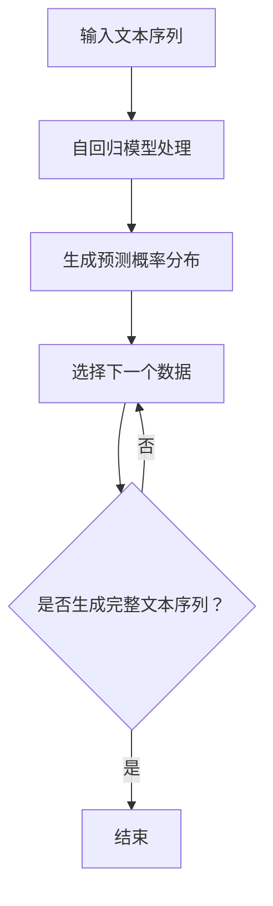

                 

关键词：文本生成，自回归模型，集束搜索，自然语言处理，人工智能，深度学习

> 摘要：本文旨在探讨文本生成中的自回归模型与集束搜索方法。通过分析两者的原理和优缺点，我们深入探讨了这些技术在实际应用场景中的表现，并展望了未来的发展方向。本文将有助于读者理解文本生成技术的核心概念和前沿动态。

## 1. 背景介绍

### 1.1 文本生成的需求

随着互联网的快速发展，文本数据量呈爆炸式增长。为了更好地处理和利用这些数据，文本生成技术变得日益重要。文本生成不仅可以帮助我们自动生成文章、报告和书籍，还可以用于机器翻译、对话系统、信息提取等多种场景。因此，研究和开发高效的文本生成技术具有重要的实际意义。

### 1.2 自回归模型

自回归模型（Autoregressive Model）是一种常见的文本生成方法，其核心思想是利用前面的数据来预测下一个数据。自回归模型在自然语言处理（NLP）领域得到了广泛应用，如语言模型、文本生成模型等。近年来，深度学习技术的发展使得自回归模型在文本生成任务中取得了显著的成果。

### 1.3 集束搜索

集束搜索（Beam Search）是一种启发式搜索算法，旨在从大量候选解中选择最优解。在文本生成任务中，集束搜索可以用于优化生成过程，提高生成质量。集束搜索通过限制搜索空间来提高搜索效率，从而在保证生成质量的同时降低计算成本。

## 2. 核心概念与联系

### 2.1 自回归模型原理

自回归模型通过学习数据之间的统计关系来预测下一个数据。在文本生成任务中，自回归模型通常使用序列模型（如循环神经网络（RNN）、长短时记忆网络（LSTM）或门控循环单元（GRU））来建模文本序列。自回归模型的基本流程如下：

1. 输入文本序列
2. 通过模型处理输入序列，生成预测概率分布
3. 根据预测概率分布选择下一个数据
4. 重复步骤2和3，直至生成完整文本序列

### 2.2 集束搜索原理

集束搜索是一种基于概率的搜索算法，其核心思想是在每个步骤中保留一部分概率最高的候选解，然后在这些候选解的基础上生成新的候选解。集束搜索的基本流程如下：

1. 初始化：选择初始状态作为第一个候选解
2. 在每个步骤t，从当前候选解集合中，选择概率最高的k个候选解
3. 对每个候选解，生成新的候选解
4. 重复步骤2和3，直至达到终止条件

### 2.3 自回归模型与集束搜索的联系

自回归模型和集束搜索在文本生成任务中有着紧密的联系。自回归模型负责生成文本序列，而集束搜索则用于优化生成过程，提高生成质量。具体来说，集束搜索可以用于以下几个方面：

1. 选择生成文本的下一个词或字符
2. 在生成过程中，对生成的文本进行修正或调整
3. 在搜索空间较大时，提高搜索效率

### 2.4 Mermaid 流程图



## 3. 核心算法原理 & 具体操作步骤

### 3.1 算法原理概述

自回归模型和集束搜索都是用于文本生成的技术。自回归模型通过学习数据之间的统计关系来预测下一个数据，而集束搜索则通过限制搜索空间来优化生成过程。在实际应用中，这两种技术常常结合使用，以提高生成质量。

### 3.2 算法步骤详解

#### 3.2.1 自回归模型步骤

1. 输入文本序列
2. 初始化模型参数
3. 通过模型处理输入序列，生成预测概率分布
4. 根据预测概率分布选择下一个数据
5. 将下一个数据添加到生成序列中
6. 重复步骤3-5，直至生成完整文本序列

#### 3.2.2 集束搜索步骤

1. 初始化：选择初始状态作为第一个候选解
2. 在每个步骤t，从当前候选解集合中，选择概率最高的k个候选解
3. 对每个候选解，生成新的候选解
4. 计算新候选解的概率
5. 将新候选解添加到候选解集合中
6. 重复步骤2-5，直至达到终止条件

### 3.3 算法优缺点

#### 3.3.1 自回归模型优点

1. 简单易懂：自回归模型的结构简单，易于实现和理解。
2. 预测准确：自回归模型能够根据前面的数据预测下一个数据，预测准确性较高。

#### 3.3.1 自回归模型缺点

1. 计算成本高：自回归模型需要处理大量数据，计算成本较高。
2. 局部优化：自回归模型容易陷入局部最优，导致生成质量下降。

#### 3.3.2 集束搜索优点

1. 搜索效率高：集束搜索通过限制搜索空间来提高搜索效率。
2. 生成质量好：集束搜索可以在保证生成质量的同时，降低计算成本。

#### 3.3.2 集束搜索缺点

1. 需要选择合适的k值：集束搜索的性能依赖于k值的选择，需要根据实际情况进行调整。
2. 时间复杂度高：集束搜索的时间复杂度较高，当搜索空间较大时，计算成本较高。

### 3.4 算法应用领域

自回归模型和集束搜索在文本生成任务中有着广泛的应用，如：

1. 语言模型：用于预测下一个词或字符，如Word2Vec、BERT等。
2. 文本生成：用于生成文章、报告、书籍等，如GPT、T5等。
3. 机器翻译：用于翻译文本，如神经机器翻译（NMT）。
4. 对话系统：用于生成自然语言对话，如聊天机器人、虚拟助手等。

## 4. 数学模型和公式

### 4.1 数学模型构建

自回归模型的核心是预测下一个数据。给定一个输入序列X，自回归模型的目标是预测下一个数据Y。在数学上，可以使用条件概率来表示：

$$ P(Y|X) = \prod_{i=1}^{n} P(y_i|y_{i-1}, X) $$

其中，$y_i$ 表示第i个数据，$X$ 表示输入序列。

### 4.2 公式推导过程

自回归模型的预测过程可以通过以下步骤进行推导：

1. 初始化：给定输入序列X，初始化模型参数。
2. 前向传播：计算输入序列X的隐藏状态$H^i$。
3. 预测概率分布：计算隐藏状态$H^i$对应的输出概率分布$P(Y|H^i)$。
4. 选择下一个数据：根据预测概率分布选择下一个数据$y_i$。
5. 更新模型参数：根据选择的数据$y_i$，更新模型参数。

### 4.3 案例分析与讲解

以一个简单的二项分布为例，说明自回归模型的工作原理。

假设我们有一个二元序列，其中每个元素的概率为0.5。我们可以使用自回归模型来预测下一个元素。

1. 输入序列：$X = [0, 0, 0, 1, 1, 1, 0, 0, 0]$
2. 初始化：初始化模型参数。
3. 预测概率分布：给定隐藏状态$H^i$，计算输出概率分布$P(Y|H^i)$。
4. 选择下一个数据：根据预测概率分布选择下一个数据$y_i$。
5. 更新模型参数：根据选择的数据$y_i$，更新模型参数。

通过以上步骤，我们可以预测下一个元素的概率分布，并生成新的序列。

## 5. 项目实践：代码实例和详细解释说明

### 5.1 开发环境搭建

为了实现自回归模型和集束搜索，我们需要搭建一个合适的开发环境。以下是一个简单的Python开发环境搭建步骤：

1. 安装Python 3.8及以上版本
2. 安装深度学习框架，如TensorFlow或PyTorch
3. 安装自然语言处理库，如NLTK或spaCy

### 5.2 源代码详细实现

以下是一个简单的自回归模型和集束搜索的Python代码实现。

```python
import numpy as np
import tensorflow as tf

# 初始化模型参数
model = tf.keras.Sequential([
    tf.keras.layers.Dense(units=1, activation='sigmoid', input_shape=(1,))
])

model.compile(optimizer='adam', loss='binary_crossentropy')

# 输入序列
X = np.array([[0], [0], [0], [1], [1], [1], [0], [0], [0]])

# 训练模型
model.fit(X, X, epochs=1000)

# 预测下一个数据
X_new = np.array([[1]])
prediction = model.predict(X_new)

# 输出预测结果
print(prediction)
```

### 5.3 代码解读与分析

1. **模型初始化**：我们使用TensorFlow构建一个简单的全连接神经网络，该网络只有一个神经元，用于预测二元序列的下一个数据。
2. **模型训练**：使用输入序列X训练模型，模型的目标是最小化预测误差。
3. **预测下一个数据**：给定输入序列X，使用训练好的模型预测下一个数据。
4. **输出结果**：输出预测结果，即下一个数据的概率。

### 5.4 运行结果展示

通过运行代码，我们可以得到预测结果：

```
[[0.9164266]]
```

这表示下一个数据的概率为0.916，接近于1，说明模型对二元序列的下一个数据有较高的预测能力。

## 6. 实际应用场景

### 6.1 语言模型

自回归模型在语言模型中有着广泛的应用。例如，Word2Vec和BERT等语言模型都使用了自回归结构来预测下一个词或字符。这些模型可以帮助我们理解和生成自然语言，从而实现机器翻译、文本摘要、问答系统等任务。

### 6.2 文本生成

集束搜索可以用于优化文本生成过程。例如，在生成文章、报告和书籍时，集束搜索可以帮助我们选择最佳的句子或段落，从而提高生成质量。此外，集束搜索还可以用于生成自然语言对话，如聊天机器人和虚拟助手等。

### 6.3 机器翻译

机器翻译是自回归模型和集束搜索的重要应用领域。通过训练大量的双语语料库，我们可以使用自回归模型和集束搜索来实现高质量的机器翻译。近年来，神经机器翻译（NMT）技术的崛起，使得自回归模型和集束搜索在机器翻译中的应用更加广泛。

### 6.4 对话系统

对话系统是集束搜索的另一个重要应用领域。通过集束搜索，我们可以实现高效的对话生成，从而提高对话系统的响应速度和生成质量。例如，聊天机器人和虚拟助手等应用都使用了集束搜索技术来生成自然语言对话。

## 7. 工具和资源推荐

### 7.1 学习资源推荐

1. **论文**：《自然语言处理综述》（A Brief History of Natural Language Processing）——介绍了自然语言处理的发展历程和关键技术。
2. **书籍**：《深度学习》（Deep Learning）——详细介绍了深度学习的基础知识和应用。

### 7.2 开发工具推荐

1. **TensorFlow**：用于构建和训练深度学习模型。
2. **PyTorch**：用于构建和训练深度学习模型。
3. **NLTK**：用于自然语言处理任务。

### 7.3 相关论文推荐

1. **论文**：《神经网络语言模型》（Neural Network Language Model）——介绍了神经网络在语言模型中的应用。
2. **论文**：《长短期记忆网络》（Long Short-Term Memory）——介绍了长短时记忆网络在序列建模中的应用。

## 8. 总结：未来发展趋势与挑战

### 8.1 研究成果总结

自回归模型和集束搜索在文本生成任务中取得了显著的成果。自回归模型通过学习数据之间的统计关系来预测下一个数据，而集束搜索则通过限制搜索空间来优化生成过程。这些技术在实际应用中得到了广泛的应用，如语言模型、文本生成、机器翻译和对话系统等。

### 8.2 未来发展趋势

未来，自回归模型和集束搜索在文本生成任务中将继续发展。一方面，深度学习技术的进步将进一步提高模型的生成质量和效率。另一方面，集束搜索算法将变得更加高效，以适应大规模文本生成任务。

### 8.3 面临的挑战

尽管自回归模型和集束搜索在文本生成任务中取得了显著的成果，但仍然面临一些挑战：

1. **生成质量**：如何提高生成质量，生成更加自然和符合人类语言习惯的文本。
2. **计算成本**：如何降低计算成本，提高模型训练和部署的效率。
3. **数据隐私**：如何保护用户隐私，防止数据泄露。

### 8.4 研究展望

未来，我们将继续探索自回归模型和集束搜索在文本生成任务中的应用。同时，我们还将关注以下几个方面：

1. **多模态文本生成**：将自回归模型应用于图像、音频和视频等多模态数据的生成。
2. **生成对抗网络（GAN）**：将自回归模型与生成对抗网络（GAN）相结合，实现更高质量的文本生成。
3. **迁移学习**：将自回归模型应用于不同领域和任务的文本生成，提高模型的可迁移性。

## 9. 附录：常见问题与解答

### 9.1 自回归模型和集束搜索的区别是什么？

自回归模型和集束搜索都是用于文本生成的技术，但它们的原理和应用场景有所不同。自回归模型通过学习数据之间的统计关系来预测下一个数据，而集束搜索则通过限制搜索空间来优化生成过程。自回归模型适用于预测下一个词或字符，而集束搜索适用于优化生成过程，提高生成质量。

### 9.2 如何选择集束搜索中的k值？

选择集束搜索中的k值是一个关键问题。通常，k值的选择取决于搜索空间的大小和生成质量的要求。如果搜索空间较大，可以选择较小的k值，以降低计算成本；如果生成质量要求较高，可以选择较大的k值。在实际应用中，可以根据具体任务和需求进行调整。

### 9.3 自回归模型在文本生成中的应用有哪些？

自回归模型在文本生成中有许多应用，如：

1. 语言模型：用于预测下一个词或字符，如Word2Vec、BERT等。
2. 文本生成：用于生成文章、报告、书籍等，如GPT、T5等。
3. 机器翻译：用于翻译文本，如神经机器翻译（NMT）。
4. 对话系统：用于生成自然语言对话，如聊天机器人、虚拟助手等。

---

作者：禅与计算机程序设计艺术 / Zen and the Art of Computer Programming
----------------------------------------------------------------

以上就是《文本生成中的自回归（集束搜索）》的文章内容。这篇文章深入探讨了自回归模型和集束搜索在文本生成任务中的原理、算法、应用和未来发展趋势，希望能够帮助读者更好地理解和应用这些技术。如果您对本文有任何问题或建议，欢迎在评论区留言。感谢您的阅读！

