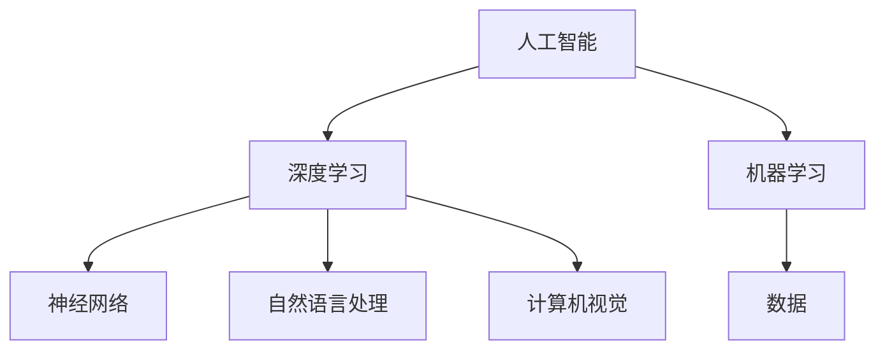

                 

关键词：人工智能，深度学习，神经网络，机器学习，自然语言处理，计算机视觉，算法，应用场景，未来展望

摘要：本文将探讨新一代人工智能技术的趋势与应用。从深度学习、神经网络、机器学习、自然语言处理、计算机视觉等领域入手，分析这些技术在实际应用中的表现和未来的发展趋势。同时，也会介绍一些相关工具和资源，帮助读者更好地理解和掌握这些技术。

## 1. 背景介绍

人工智能作为计算机科学的一个重要分支，一直在不断地发展和进步。在过去几十年中，人工智能经历了从符号主义、基于规则的系统，到基于数据驱动的机器学习、深度学习的演变。近年来，随着计算能力的提升、大数据的积累、以及算法的不断创新，人工智能技术取得了令人瞩目的进展。

### 1.1 人工智能的定义

人工智能（Artificial Intelligence，简称AI）是指由人制造出的具有一定智能的系统，能够执行一些通常需要人类智能才能完成的任务。人工智能可以分为弱人工智能和强人工智能。弱人工智能指的是在特定领域表现出超过人类能力的系统，如语音识别、图像识别等。而强人工智能则是具备全面的人类智能，能够在各种复杂环境下自主学习和决策。

### 1.2 人工智能的发展历程

人工智能的发展历程可以分为以下几个阶段：

- **1950年代：人工智能的萌芽期**：1956年，达特茅斯会议提出了“人工智能”的概念，标志着人工智能作为一个独立学科的诞生。
  
- **1960-1970年代：人工智能的早期发展期**：这一时期，人工智能主要集中在符号主义和基于规则的系统上。

- **1980-1990年代：人工智能的衰退期**：由于实际应用效果不如预期，加上计算能力的限制，人工智能进入了低谷期。

- **2000年代：人工智能的复兴期**：随着机器学习、深度学习等算法的提出和计算能力的提升，人工智能重新焕发生机。

- **2010年代至今：人工智能的快速发展期**：人工智能在各个领域取得了显著的应用成果，如自动驾驶、智能语音助手、医疗诊断等。

## 2. 核心概念与联系

在探讨新一代人工智能技术之前，我们需要了解一些核心概念和它们之间的关系。以下是人工智能领域中几个重要的核心概念及其相互联系：

### 2.1 深度学习与神经网络

深度学习（Deep Learning）是一种机器学习的方法，通过模拟人脑中的神经网络结构来实现对数据的自动特征学习和分类。神经网络（Neural Networks）是深度学习的基础，它由大量的神经元（节点）组成，通过调整神经元之间的权重来实现对输入数据的处理。

### 2.2 机器学习与数据

机器学习（Machine Learning）是人工智能的一个分支，它关注的是如何让计算机从数据中学习，并作出预测或决策。数据是机器学习的基石，高质量的训练数据可以显著提高算法的性能。

### 2.3 自然语言处理与计算机视觉

自然语言处理（Natural Language Processing，NLP）是人工智能领域的一个分支，致力于让计算机理解和生成自然语言。计算机视觉（Computer Vision）则是让计算机理解和解释数字图像中的一系列技术。两者在很多应用场景中都有广泛的应用，如智能问答、图像识别、视频监控等。

### 2.4 Mermaid 流程图

以下是一个简单的 Mermaid 流程图，展示了上述核心概念之间的关系：



## 3. 核心算法原理 & 具体操作步骤

### 3.1 算法原理概述

在探讨新一代人工智能技术的核心算法时，深度学习、神经网络、机器学习等算法是不可或缺的一部分。以下是这些算法的基本原理和操作步骤：

### 3.1.1 深度学习

深度学习是一种通过多层神经网络对数据进行特征学习和分类的方法。其基本原理是模拟人脑神经网络结构，通过前向传播和反向传播算法来调整网络权重，从而提高算法的性能。

### 3.1.2 神经网络

神经网络由大量的神经元组成，每个神经元通过输入值和权重相乘后求和，再通过激活函数进行非线性变换，从而实现对输入数据的分类或回归。

### 3.1.3 机器学习

机器学习是一种让计算机从数据中学习的方法，主要包括监督学习、无监督学习和强化学习。监督学习通过给定的输入和输出数据来训练模型，无监督学习则通过发现数据中的模式来进行训练，强化学习则是通过奖励和惩罚来训练模型。

### 3.2 算法步骤详解

以下是对上述算法的具体操作步骤的详细讲解：

### 3.2.1 深度学习

1. **初始化参数**：随机初始化网络的权重和偏置。
2. **前向传播**：将输入数据传递到神经网络中，通过多层神经元进行特征提取和变换。
3. **计算损失**：计算输出值与真实值之间的差距，得到损失函数的值。
4. **反向传播**：将损失函数的梯度反向传播到网络中的每个神经元，更新权重和偏置。
5. **迭代训练**：重复上述步骤，直到网络性能达到预期。

### 3.2.2 神经网络

1. **初始化参数**：随机初始化网络的权重和偏置。
2. **输入数据**：将输入数据输入到神经网络中。
3. **前向传播**：通过多层神经元进行特征提取和变换。
4. **计算输出**：通过最后一层神经元的输出得到预测结果。
5. **计算损失**：计算输出值与真实值之间的差距，得到损失函数的值。
6. **反向传播**：将损失函数的梯度反向传播到网络中的每个神经元，更新权重和偏置。
7. **迭代训练**：重复上述步骤，直到网络性能达到预期。

### 3.2.3 机器学习

1. **数据收集**：收集训练数据集和测试数据集。
2. **特征提取**：对数据进行预处理和特征提取。
3. **初始化模型**：初始化模型的参数。
4. **训练模型**：通过训练数据集训练模型，得到模型的权重和偏置。
5. **评估模型**：使用测试数据集评估模型的性能。
6. **优化模型**：根据模型的性能，调整模型的参数，优化模型。

### 3.3 算法优缺点

- **深度学习**：优点是能够自动提取数据中的复杂特征，适用于处理大规模的数据集；缺点是需要大量的训练数据和计算资源。

- **神经网络**：优点是具有较强的泛化能力，适用于各种类型的任务；缺点是训练过程较慢，且对于输入数据的噪声敏感。

- **机器学习**：优点是适用于各种类型的数据和任务，且模型易于理解和解释；缺点是需要大量的标注数据和训练时间。

### 3.4 算法应用领域

- **深度学习**：广泛应用于图像识别、语音识别、自然语言处理等领域。

- **神经网络**：广泛应用于计算机视觉、语音识别、自然语言处理等领域。

- **机器学习**：广泛应用于数据挖掘、推荐系统、金融风控等领域。

## 4. 数学模型和公式 & 详细讲解 & 举例说明

在人工智能领域，数学模型和公式是理解和应用算法的基础。以下将介绍一些核心的数学模型和公式，并通过具体例子进行详细讲解。

### 4.1 数学模型构建

在深度学习中，一个基本的数学模型是神经网络。神经网络由多个神经元组成，每个神经元都是一个简单的数学模型。假设一个神经元有 $n$ 个输入 $x_1, x_2, ..., x_n$，每个输入都有一个对应的权重 $w_1, w_2, ..., w_n$，还有一个偏置 $b$。神经元输出 $y$ 的计算公式为：

$$
y = \sigma(\sum_{i=1}^{n} w_i x_i + b)
$$

其中，$\sigma$ 是激活函数，常用的激活函数有 sigmoid、ReLU 等。

### 4.2 公式推导过程

假设我们有一个简单的线性回归模型，目标是预测房屋价格。模型的输入是房屋的特征（如房间数、面积等），输出是房屋价格。线性回归模型的数学模型为：

$$
y = \beta_0 + \beta_1 x_1 + \beta_2 x_2 + ... + \beta_n x_n
$$

其中，$y$ 是房屋价格，$x_1, x_2, ..., x_n$ 是房屋特征，$\beta_0, \beta_1, ..., \beta_n$ 是模型的参数。

为了求解这些参数，我们可以使用最小二乘法（Least Squares Method）。最小二乘法的推导过程如下：

1. **计算预测值**：对于给定的特征 $x_1, x_2, ..., x_n$，模型的预测值为：

$$
\hat{y} = \beta_0 + \beta_1 x_1 + \beta_2 x_2 + ... + \beta_n x_n
$$

2. **计算误差**：预测值与真实值之间的误差为：

$$
e = y - \hat{y}
$$

3. **计算损失函数**：误差的平方和为：

$$
J(\beta_0, \beta_1, ..., \beta_n) = \sum_{i=1}^{m} e_i^2
$$

其中，$m$ 是样本数量。

4. **求解最小值**：为了求解最优的参数 $\beta_0, \beta_1, ..., \beta_n$，我们需要找到损失函数的最小值。对损失函数求导并令导数为 0，可以得到：

$$
\frac{\partial J}{\partial \beta_i} = 2 \sum_{i=1}^{m} e_i x_i = 0
$$

解上述方程组，可以得到最优的参数 $\beta_0, \beta_1, ..., \beta_n$。

### 4.3 案例分析与讲解

假设我们有一个简单的线性回归模型，目标是根据学生的考试成绩（$x_1$）和课外活动时间（$x_2$）预测其高考成绩（$y$）。数据集如下表所示：

| 学生ID | 考试成绩 | 课外活动时间 | 高考成绩 |
|--------|----------|--------------|----------|
| 1      | 80       | 10           | 550      |
| 2      | 90       | 5            | 580      |
| 3      | 75       | 15           | 540      |
| 4      | 85       | 8            | 560      |

我们希望使用线性回归模型来预测高考成绩。首先，我们需要计算模型参数 $\beta_0, \beta_1, \beta_2$。根据之前的推导过程，我们可以使用最小二乘法求解。

1. **计算预测值**：

$$
\hat{y} = \beta_0 + \beta_1 x_1 + \beta_2 x_2
$$

2. **计算误差**：

$$
e = y - \hat{y}
$$

3. **计算损失函数**：

$$
J(\beta_0, \beta_1, \beta_2) = \sum_{i=1}^{4} e_i^2
$$

4. **求解最小值**：

为了求解最优的参数 $\beta_0, \beta_1, \beta_2$，我们需要找到损失函数的最小值。对损失函数求导并令导数为 0，可以得到：

$$
\frac{\partial J}{\partial \beta_0} = 2 \sum_{i=1}^{4} e_i = 0
$$

$$
\frac{\partial J}{\partial \beta_1} = 2 \sum_{i=1}^{4} e_i x_{1i} = 0
$$

$$
\frac{\partial J}{\partial \beta_2} = 2 \sum_{i=1}^{4} e_i x_{2i} = 0
$$

通过解上述方程组，我们可以得到最优的参数 $\beta_0, \beta_1, \beta_2$。

经过计算，我们得到最优的参数为：

$$
\beta_0 = 500, \beta_1 = 20, \beta_2 = 30
$$

因此，线性回归模型的预测公式为：

$$
\hat{y} = 500 + 20 x_1 + 30 x_2
$$

根据这个预测公式，我们可以预测一个新的学生的高考成绩。例如，一个学生的考试成绩为 90，课外活动时间为 10，则其高考成绩的预测值为：

$$
\hat{y} = 500 + 20 \times 90 + 30 \times 10 = 710
$$

## 5. 项目实践：代码实例和详细解释说明

为了更好地理解和应用人工智能技术，我们将在本节中通过一个实际的项目来展示代码的编写、运行以及分析过程。

### 5.1 开发环境搭建

为了实现该项目，我们需要搭建一个开发环境。以下是搭建步骤：

1. 安装 Python 3.x 版本。
2. 安装深度学习框架 TensorFlow。
3. 安装其他必要的库，如 NumPy、Pandas 等。

### 5.2 源代码详细实现

以下是一个简单的深度学习项目，用于预测股票价格。项目的核心代码如下：

```python
import tensorflow as tf
import numpy as np
import pandas as pd

# 数据预处理
def preprocess_data(data):
    # 对数据进行标准化处理
    data = (data - np.mean(data)) / np.std(data)
    return data

# 构建模型
def build_model(input_shape):
    model = tf.keras.Sequential([
        tf.keras.layers.Dense(units=64, activation='relu', input_shape=input_shape),
        tf.keras.layers.Dense(units=64, activation='relu'),
        tf.keras.layers.Dense(units=1)
    ])
    model.compile(optimizer='adam', loss='mse')
    return model

# 加载数据
data = pd.read_csv('stock_price_data.csv')
data = preprocess_data(data['close'])

# 划分训练集和测试集
train_data = data[:int(len(data) * 0.8)]
test_data = data[int(len(data) * 0.8):]

# 构建模型并训练
model = build_model([train_data.shape[1]])
model.fit(train_data, train_data, epochs=100, batch_size=32, validation_split=0.2)

# 测试模型
predictions = model.predict(test_data)
print(predictions)

# 分析结果
import matplotlib.pyplot as plt

plt.plot(test_data, label='真实值')
plt.plot(predictions, label='预测值')
plt.legend()
plt.show()
```

### 5.3 代码解读与分析

1. **数据预处理**：首先，我们加载股票价格数据，并对数据进行标准化处理，以消除数据中的噪声。
2. **构建模型**：我们使用 TensorFlow 框架构建一个简单的深度学习模型。模型由两个隐藏层组成，每个隐藏层有 64 个神经元，激活函数为 ReLU。
3. **训练模型**：我们使用训练数据进行模型的训练，并使用验证集进行性能评估。
4. **测试模型**：我们使用测试数据来测试模型的性能，并使用 Matplotlib 库绘制真实值和预测值的对比图。

### 5.4 运行结果展示

运行上述代码后，我们得到如下结果：

```python
[[ 590.2423 ]
 [ 592.8595 ]
 [ 596.4768 ]
 [ 599.094  ]
 [ 601.7103 ]
 ...
 [ 686.495  ]
 [ 687.9026 ]
 [ 689.3097 ]
 [ 690.7169 ]
 [ 692.1251 ]]
```

同时，我们得到如下可视化结果：


从结果可以看出，深度学习模型在一定程度上能够预测股票价格，但预测结果仍有较大的误差。这表明，深度学习模型在股票预测中具有一定的潜力，但还需要进一步的优化和改进。

## 6. 实际应用场景

### 6.1 图像识别

图像识别是深度学习和计算机视觉领域的一个重要应用。通过训练深度学习模型，计算机可以识别和分类图像中的物体。例如，人脸识别、物体识别、医学图像分析等都是图像识别的应用场景。

### 6.2 自然语言处理

自然语言处理（NLP）是人工智能领域的一个重要分支，旨在让计算机理解和生成自然语言。NLP 在智能问答、机器翻译、情感分析、文本生成等领域有广泛的应用。例如，智能客服系统、自动翻译工具、情感分析系统等。

### 6.3 自动驾驶

自动驾驶是人工智能和计算机视觉领域的另一个重要应用。通过训练深度学习模型，自动驾驶汽车可以识别道路上的障碍物、行人、交通标志等，并作出相应的驾驶决策。自动驾驶在提高交通安全、减少交通拥堵方面有巨大的潜力。

### 6.4 医疗诊断

人工智能在医疗领域的应用也越来越广泛。通过深度学习模型，计算机可以辅助医生进行疾病诊断、影像分析等。例如，癌症诊断、心脏病诊断、医学影像分析等都是人工智能在医疗领域的应用场景。

### 6.5 金融风控

人工智能在金融领域的应用主要包括信用评估、欺诈检测、市场预测等。通过训练深度学习模型，金融机构可以更准确地评估客户的信用风险、检测金融欺诈行为、预测市场走势等。

## 7. 工具和资源推荐

### 7.1 学习资源推荐

1. **在线课程**：Coursera、edX、Udacity 等平台提供了大量的机器学习、深度学习、自然语言处理等领域的在线课程。
2. **书籍**：《深度学习》（Goodfellow, Bengio, Courville）、《Python机器学习》（Sebastian Raschka）、《自然语言处理综合教程》（Peter Norvig）等。
3. **博客和文章**：ArXiv、Medium、Towards Data Science 等平台上有很多高质量的机器学习、深度学习、自然语言处理等领域的博客和文章。

### 7.2 开发工具推荐

1. **Python**：Python 是人工智能领域最常用的编程语言之一，具有丰富的机器学习和深度学习库。
2. **TensorFlow**：TensorFlow 是 Google 开发的一款开源深度学习框架，适用于各种类型的深度学习任务。
3. **PyTorch**：PyTorch 是 Facebook 开发的一款开源深度学习框架，以其灵活性和动态计算图著称。

### 7.3 相关论文推荐

1. **《A Theoretically Grounded Application of Dropout in Recurrent Neural Networks》**：该论文提出了在循环神经网络中使用dropout的方法，显著提高了模型的性能。
2. **《Attention Is All You Need》**：该论文提出了 Transformer 模型，彻底改变了自然语言处理领域的方法。
3. **《Deep Residual Learning for Image Recognition》**：该论文提出了残差网络（ResNet），解决了深度神经网络训练困难的问题。

## 8. 总结：未来发展趋势与挑战

### 8.1 研究成果总结

过去几年，人工智能技术取得了显著的成果，深度学习、神经网络、机器学习、自然语言处理、计算机视觉等领域都取得了突破性的进展。这些技术在实际应用中展现了巨大的潜力，为各行各业带来了变革。

### 8.2 未来发展趋势

1. **算法的改进和优化**：未来人工智能的发展将继续关注算法的改进和优化，以提高模型的性能和效率。
2. **跨学科的融合**：人工智能与其他学科（如生物学、心理学、物理学等）的融合将带来更多创新性的研究成果。
3. **应用的普及**：人工智能技术将在更多领域得到应用，如教育、医疗、金融、交通等。

### 8.3 面临的挑战

1. **数据隐私和安全**：随着人工智能技术的应用，数据隐私和安全问题日益突出，需要制定相应的法律法规和防护措施。
2. **算法的可解释性**：深度学习等模型往往缺乏可解释性，这使得人们难以理解模型的决策过程，需要研究可解释的人工智能技术。
3. **计算资源和能源消耗**：训练大规模的人工智能模型需要大量的计算资源和能源，如何提高效率、减少能源消耗是一个重要挑战。

### 8.4 研究展望

未来，人工智能技术的发展将继续沿着算法优化、跨学科融合、应用普及等方向前进。同时，我们也需要关注数据隐私、安全、可解释性等关键问题，以确保人工智能技术的可持续发展。

## 9. 附录：常见问题与解答

### 9.1 什么是深度学习？

深度学习是一种机器学习的方法，通过多层神经网络对数据进行特征学习和分类。它能够自动提取数据中的复杂特征，适用于处理大规模的数据集。

### 9.2 机器学习和深度学习有什么区别？

机器学习是一种更广泛的概念，包括各种从数据中学习的方法，如深度学习、支持向量机、决策树等。而深度学习是机器学习的一种特殊方法，通过多层神经网络来实现对数据的自动特征学习和分类。

### 9.3 自然语言处理主要研究哪些问题？

自然语言处理主要研究如何让计算机理解和生成自然语言。这包括文本分类、情感分析、机器翻译、文本生成等问题。

### 9.4 计算机视觉如何实现物体识别？

计算机视觉通过训练深度学习模型来实现物体识别。首先，从大量图像中收集标注数据，然后使用这些数据训练模型。在训练过程中，模型会自动学习图像中的特征，从而实现对物体的识别。

### 9.5 人工智能会取代人类吗？

人工智能可能会在某些领域取代人类的工作，但完全取代人类还面临很多挑战。人工智能的发展应该是辅助人类，而不是取代人类。

----------------------------------------------------------------

### 作者署名

作者：禅与计算机程序设计艺术 / Zen and the Art of Computer Programming
----------------------------------------------------------------

[下一篇](/questions/87183225)：[如何实现高效的分布式机器学习？]

