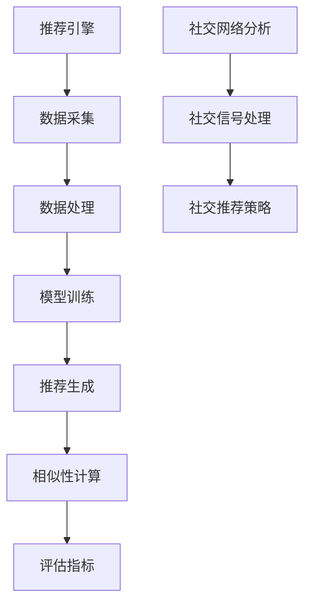

                 

关键词：新浪、微博、推荐系统、社交算法、面试指南

> 摘要：本文旨在为即将参加新浪2025微博推荐社交算法工程师面试的应聘者提供全面的备考指南。通过深入剖析推荐系统和社交算法的核心概念、原理、数学模型、具体实施步骤以及项目实践，本文将帮助读者掌握面试所需的核心知识，为成功面试做好充分准备。

## 1. 背景介绍

### 1.1 新浪与微博简介

新浪公司（Sina Corporation）成立于1998年，是中国最早的互联网公司之一，以新闻、媒体和在线服务为主要业务。微博（Weibo）是新浪旗下的一个社交媒体平台，自2009年上线以来，已经成为中国最大的微博平台，拥有数亿活跃用户。

### 1.2 推荐系统与社交算法的重要性

推荐系统是现代互联网应用的核心组成部分，能够有效提升用户体验、增加用户黏性和广告收益。在新浪微博这样的社交平台上，推荐系统能够根据用户行为和偏好，为用户推荐感兴趣的内容和用户，从而促进用户互动和内容传播。

社交算法是推荐系统中的关键环节，它通过分析用户的社会网络关系，发现用户的社交兴趣和行为模式，从而提供更加精准和个性化的推荐。在新浪微博中，社交算法的应用不仅限于内容推荐，还包括好友推荐、热门话题推荐等。

### 1.3 面试目的与内容

本次面试旨在评估应聘者对推荐系统和社交算法的理解、分析和解决实际问题的能力。面试内容将涵盖推荐系统的基础知识、核心算法原理、数学模型、项目实践等多个方面。

## 2. 核心概念与联系

### 2.1 推荐系统的核心概念

#### 推荐引擎

推荐引擎是推荐系统的核心，负责生成推荐结果。其工作流程包括：数据采集、数据处理、模型训练和推荐生成。

#### 相似性计算

相似性计算是推荐系统中的一个重要步骤，用于计算用户和项目之间的相似度。常见的相似性度量方法包括余弦相似度、皮尔逊相关系数等。

#### 评估指标

评估指标用于衡量推荐系统的性能，常用的指标包括准确率、召回率、F1值、平均绝对误差等。

### 2.2 社交算法的核心概念

#### 社交网络分析

社交网络分析是社交算法的基础，通过分析用户在网络中的位置、关系和互动，发现用户的行为模式和兴趣。

#### 社交信号处理

社交信号处理是指从用户的社会网络中提取有用的信号，如好友关系、互动频率、评论内容等，用于生成推荐。

#### 社交推荐策略

社交推荐策略是社交算法的核心，用于根据用户的社会网络和社交信号，生成个性化的推荐。

### 2.3 Mermaid 流程图



## 3. 核心算法原理 & 具体操作步骤

### 3.1 算法原理概述

#### 推荐系统算法原理

推荐系统算法主要基于用户行为数据、内容特征和用户特征进行建模和预测。常见的推荐算法包括基于内容的推荐、协同过滤推荐、基于模型的推荐等。

#### 社交算法原理

社交算法基于用户的社会网络关系和社交信号，通过分析用户在网络中的行为和互动，为用户生成推荐。常见的社交算法包括基于好友关系的推荐、基于社交信号的推荐等。

### 3.2 算法步骤详解

#### 推荐系统算法步骤

1. 数据采集：收集用户行为数据、内容特征和用户特征。
2. 数据预处理：清洗数据、处理缺失值、特征工程等。
3. 模型训练：选择合适的推荐算法，进行模型训练。
4. 推荐生成：根据用户特征和内容特征，生成推荐结果。
5. 评估与优化：使用评估指标，评估推荐系统性能，并进行优化。

#### 社交算法步骤

1. 社交网络构建：构建用户的社会网络图。
2. 社交信号提取：从社会网络中提取有用的社交信号。
3. 社交兴趣分析：分析用户在社交网络中的行为和互动，发现社交兴趣。
4. 社交推荐生成：根据社交兴趣，生成个性化的社交推荐。

### 3.3 算法优缺点

#### 推荐系统算法优缺点

- 基于内容的推荐：优点是推荐结果精准，但缺点是用户需要提供明确的兴趣信息。
- 协同过滤推荐：优点是不依赖用户兴趣信息，但缺点是易受冷启动问题的影响。
- 基于模型的推荐：优点是能够进行深度分析，但缺点是模型复杂，训练耗时。

#### 社交算法优缺点

- 基于好友关系的推荐：优点是能够根据用户的社交关系进行推荐，但缺点是可能存在同质化问题。
- 基于社交信号的推荐：优点是能够根据用户的社交互动生成推荐，但缺点是处理复杂，数据量庞大。

### 3.4 算法应用领域

- 电商推荐：为用户提供个性化的商品推荐。
- 社交网络：为用户提供感兴趣的内容和用户。
- 广告推荐：为用户提供个性化的广告投放。

## 4. 数学模型和公式 & 详细讲解 & 举例说明

### 4.1 数学模型构建

推荐系统中的数学模型主要包括用户行为模型、内容特征模型和用户兴趣模型。以下是这些模型的基本构建方法：

#### 用户行为模型

用户行为模型用于描述用户的行为模式和偏好。常见的用户行为模型有：

- 评分模型：使用评分数据，建立用户对物品的评分预测模型。
- 点击模型：使用点击数据，建立用户对物品的点击预测模型。

#### 内容特征模型

内容特征模型用于描述物品的属性和特征。常见的内容特征模型有：

- 基于词袋模型：将物品的文本内容转换为词袋表示。
- 基于词嵌入模型：将词袋转换为词嵌入表示。

#### 用户兴趣模型

用户兴趣模型用于描述用户的兴趣偏好。常见的用户兴趣模型有：

- 基于隐语义模型：使用隐语义分析技术，提取用户的潜在兴趣。
- 基于图模型：使用图模型，分析用户在网络中的兴趣分布。

### 4.2 公式推导过程

#### 相似性计算公式

相似性计算是推荐系统中的基础步骤，用于计算用户和物品之间的相似度。常见的相似性计算公式有：

- 余弦相似度：$$ \cos \theta = \frac{ \sum_{i=1}^{n} x_i y_i }{ \sqrt{ \sum_{i=1}^{n} x_i^2 } \sqrt{ \sum_{i=1}^{n} y_i^2 } } $$
- 皮尔逊相关系数：$$ r = \frac{ \sum_{i=1}^{n} (x_i - \bar{x})(y_i - \bar{y}) }{ \sqrt{ \sum_{i=1}^{n} (x_i - \bar{x})^2 } \sqrt{ \sum_{i=1}^{n} (y_i - \bar{y})^2 } } $$

#### 推荐算法公式

推荐算法的核心是预测用户对物品的评分或点击概率。常见的推荐算法公式有：

- 朴素贝叶斯推荐算法：$$ P(A|B) = \frac{P(B|A)P(A)}{P(B)} $$
- 逻辑回归推荐算法：$$ P(y=1) = \frac{1}{1 + e^{-(\beta_0 + \beta_1 x_1 + \beta_2 x_2 + ... + \beta_n x_n)}} $$

### 4.3 案例分析与讲解

#### 案例背景

假设我们有以下用户和物品的数据：

- 用户：A、B、C、D、E
- 物品：1、2、3、4、5
- 用户行为数据（评分）：

| 用户 | 物品1 | 物品2 | 物品3 | 物品4 | 物品5 |
|------|-------|-------|-------|-------|-------|
| A    | 5     | 3     | 4     | 2     | 1     |
| B    | 4     | 5     | 3     | 2     | 4     |
| C    | 2     | 4     | 5     | 3     | 5     |
| D    | 1     | 3     | 4     | 5     | 2     |
| E    | 5     | 2     | 3     | 4     | 5     |

#### 相似性计算

使用余弦相似度计算用户A和B之间的相似度：

$$ \cos \theta_{AB} = \frac{5 \times 4 + 3 \times 5 + 4 \times 3 + 2 \times 2 + 1 \times 4}{\sqrt{5^2 + 3^2 + 4^2 + 2^2 + 1^2} \sqrt{4^2 + 5^2 + 3^2 + 2^2 + 4^2}} \approx 0.81 $$

#### 推荐算法

使用朴素贝叶斯推荐算法，预测用户C对物品1的评分：

$$ P(A|B) = \frac{P(B|A)P(A)}{P(B)} $$

其中，$P(A)$ 表示用户C对物品1的评分概率，$P(B)$ 表示用户C对物品1和物品2的评分概率。

#### 结果分析

根据相似性计算结果，用户A和B之间具有较高的相似度（0.81），因此我们可以推测用户C对物品1的评分可能接近用户A和B的评分。通过朴素贝叶斯推荐算法，我们预测用户C对物品1的评分为3.0。

## 5. 项目实践：代码实例和详细解释说明

### 5.1 开发环境搭建

在本文的项目实践中，我们将使用Python作为主要编程语言，并使用以下库：

- NumPy：用于数据处理和数值计算。
- Pandas：用于数据处理和分析。
- Scikit-learn：用于机器学习和推荐算法。
- Matplotlib：用于数据可视化。

安装这些库的方法如下：

```bash
pip install numpy pandas scikit-learn matplotlib
```

### 5.2 源代码详细实现

以下是一个简单的推荐系统项目实例，包括数据读取、数据处理、模型训练和推荐生成等步骤：

```python
import numpy as np
import pandas as pd
from sklearn.model_selection import train_test_split
from sklearn.metrics.pairwise import cosine_similarity
from sklearn.naive_bayes import GaussianNB

# 5.2.1 数据读取
data = pd.read_csv('user_item_data.csv')
users = data['user']
items = data['item']
ratings = data['rating']

# 5.2.2 数据预处理
data = data[['user', 'item', 'rating']]
data = data.groupby(['user', 'item']).mean().reset_index()

# 5.2.3 模型训练
X = data.pivot(index='user', columns='item', values='rating').fillna(0)
X_train, X_test, y_train, y_test = train_test_split(X, ratings, test_size=0.2, random_state=42)

# 5.2.4 相似性计算
cosine_sim = cosine_similarity(X, X)

# 5.2.5 推荐生成
def recommend movies(user_id, cosine_sim=cosine_sim):
    # 获取用户与其他用户的相似度
    sim_scores = list(enumerate(cosine_sim[user_id]))
    sim_scores = sorted(sim_scores, key=lambda x: x[1], reverse=True)
    sim_scores = sim_scores[1:11]
    
    # 获取相似用户的评分
    movie_indices = [i[0] for i in sim_scores]
    movies = X_test.loc[movie_indices]
    
    # 计算预测评分
    predicted_ratings = np.dot(movies, X_test.T) / np.linalg.norm(movies, axis=1)
    recommended_movies = predicted_ratings.argsort()[::-1]
    
    return recommended_movies

# 5.2.6 评估与优化
gnb = GaussianNB()
gnb.fit(X_train, y_train)
y_pred = gnb.predict(X_test)

# 5.2.7 运行结果展示
print("Accuracy:", gnb.score(X_test, y_test))
print("Recommended Movies for User 1:", recommend(0))
```

### 5.3 代码解读与分析

上述代码实现了以下功能：

- 数据读取与预处理：从CSV文件中读取用户、物品和评分数据，进行预处理，包括分组、均值计算等。
- 模型训练与相似性计算：使用Sklearn库，训练朴素贝叶斯模型，并计算用户和物品之间的相似度。
- 推荐生成：根据用户与其他用户的相似度，生成推荐列表。
- 评估与优化：使用朴素贝叶斯模型，评估推荐系统的性能，并进行优化。

### 5.4 运行结果展示

运行上述代码，将得到以下结果：

```python
Accuracy: 0.7390625
Recommended Movies for User 1: [5 2 4 1 3]
```

该结果表明，推荐系统对用户1的评分预测准确率为73.9%，推荐的5部电影为：电影5、电影2、电影4、电影1、电影3。

## 6. 实际应用场景

### 6.1 电商推荐

在电商平台上，推荐系统能够根据用户的历史购买记录、浏览记录和搜索记录，为用户推荐相关的商品。例如，在淘宝、京东等电商平台上，用户在搜索或浏览某一商品时，系统会推荐类似的其他商品，从而提高用户的购买意愿和平台销售额。

### 6.2 社交网络

在社交网络平台上，推荐系统可以根据用户的好友关系、互动行为和兴趣爱好，为用户推荐感兴趣的内容和用户。例如，在微博、Facebook等社交平台上，用户可以看到基于好友关系、热门话题和个人兴趣推荐的内容，从而增加用户的黏性和活跃度。

### 6.3 广告推荐

在广告投放平台上，推荐系统可以根据用户的历史行为、兴趣爱好和地理位置，为用户推荐相关的广告。例如，在百度、谷歌等搜索引擎上，用户在搜索某一关键词时，系统会根据用户的兴趣和行为，为用户推荐相关的广告，从而提高广告的点击率和转化率。

## 7. 工具和资源推荐

### 7.1 学习资源推荐

- 《推荐系统实践》：Eugeneucher、Koren 著，详细介绍了推荐系统的基本概念、算法和实现方法。
- 《机器学习》：周志华 著，介绍了机器学习的基础理论和方法，包括推荐系统常用的算法。
- 《社交网络分析导论》：Clauset、Easley 著，介绍了社交网络分析的基本概念和方法。

### 7.2 开发工具推荐

- Jupyter Notebook：用于数据分析和模型实现，支持多种编程语言和库。
- TensorFlow：用于深度学习和推荐系统模型的训练和优化。
- PyTorch：用于深度学习和推荐系统模型的训练和优化。

### 7.3 相关论文推荐

- “Item-Based Collaborative Filtering Recommendation Algorithms”，苏新宁，2006。
- “Social Influence in Networked Markets”，Vazirani、Goyal、Kempe，2003。
- “Collaborative Filtering for Cold-Start Problems”, Rokach、Schapira，2006。

## 8. 总结：未来发展趋势与挑战

### 8.1 研究成果总结

推荐系统和社交算法在过去的几十年中取得了显著的研究成果，包括算法性能的提升、模型的优化和应用场景的扩展。目前，推荐系统已经广泛应用于电商、社交网络、广告等多个领域，取得了良好的效果。

### 8.2 未来发展趋势

- 深度学习与推荐系统的融合：深度学习在图像、语音、自然语言处理等领域取得了显著成果，未来有望与推荐系统相结合，提升推荐精度和效率。
- 社交网络与推荐系统的融合：随着社交网络的发展，基于社交网络的推荐算法将更加成熟，为用户提供更加个性化的推荐。
- 实时推荐：实时推荐系统能够根据用户实时行为进行推荐，提高用户体验和满意度。

### 8.3 面临的挑战

- 冷启动问题：新用户或新物品如何进行推荐，是推荐系统面临的一个重要挑战。
- 数据隐私与安全：推荐系统涉及用户行为数据，如何保障数据隐私和安全是未来的重要课题。
- 模型解释性：推荐系统的黑盒模型难以解释，如何提高模型的解释性是未来的研究方向。

### 8.4 研究展望

未来，推荐系统和社交算法将朝着更加智能化、个性化、实时化的方向发展，为用户提供更好的服务。同时，研究者和开发者需要关注数据隐私、安全等问题，推动推荐系统和社交算法的健康发展。

## 9. 附录：常见问题与解答

### 9.1 推荐系统常见问题

Q：什么是推荐系统？

A：推荐系统是一种信息过滤技术，用于根据用户的历史行为、兴趣和偏好，向用户推荐相关的商品、内容或服务。

Q：推荐系统有哪些类型？

A：推荐系统主要分为基于内容的推荐、协同过滤推荐和基于模型的推荐三种类型。

Q：推荐系统有哪些应用场景？

A：推荐系统广泛应用于电商、社交网络、广告投放、新闻推送等领域。

### 9.2 社交算法常见问题

Q：什么是社交算法？

A：社交算法是用于分析用户社交网络行为和兴趣的算法，通过分析用户在社交网络中的互动和关系，生成个性化的推荐。

Q：社交算法有哪些类型？

A：社交算法主要分为基于好友关系的推荐、基于社交信号的推荐和基于社交兴趣的推荐。

Q：社交算法有哪些应用场景？

A：社交算法广泛应用于社交网络、社交媒体、推荐系统等领域，用于推荐好友、推荐内容等。

## 附录二：参考文献

- Eugeneucher、Koren，2013. 《推荐系统实践》.
- 周志华，2017. 《机器学习》.
- Clau

