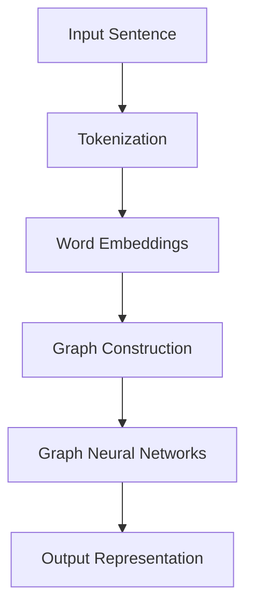
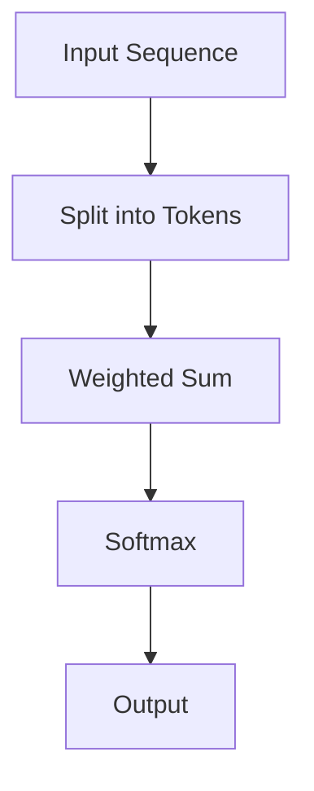
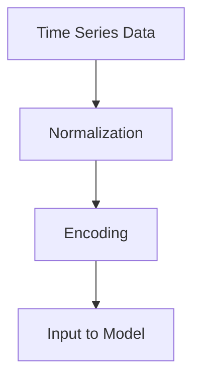
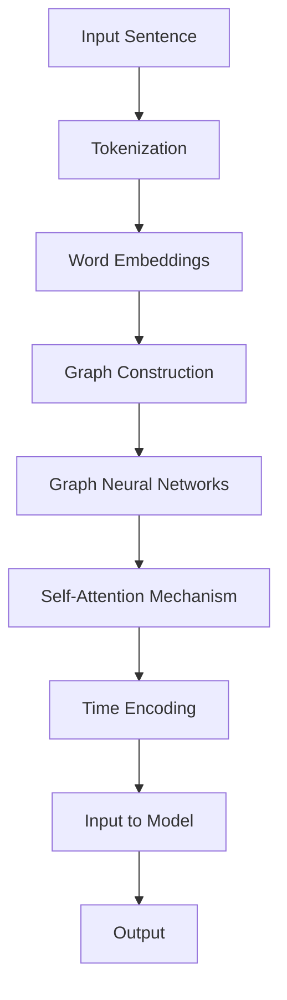

                 

关键词：时刻推理，LLM计算，深度学习，自然语言处理，计算模型

> 摘要：本文深入探讨了时刻推理（Temporal Reasoning）这一关键概念在大型语言模型（LLM）计算中的独特本质。通过分析时刻推理在LLM中的重要性，本文旨在揭示其内在机制，并提供对这一领域的深入理解。同时，文章还将讨论时刻推理在现实世界中的应用前景，以及面临的挑战和未来发展方向。

## 1. 背景介绍

时刻推理，作为一种处理时间序列信息的能力，是人工智能领域的一个重要研究方向。在传统的机器学习和深度学习模型中，时刻推理的能力往往依赖于时间序列分析、递归神经网络（RNN）等。然而，随着大型语言模型（LLM）的兴起，尤其是基于Transformer架构的模型，如GPT和BERT，时刻推理的能力得到了显著提升。

LLM之所以能够实现高效的时刻推理，主要得益于其内部复杂的网络结构和大规模预训练数据。这些模型通过训练学会了如何理解和生成自然语言中的时间信息，从而在各类任务中表现出色。

然而，尽管LLM在时刻推理方面取得了巨大成功，其内在机制仍然不够透明，许多研究者对其独特本质仍然缺乏深入理解。本文将尝试填补这一空白，从理论和实践两个角度对时刻推理在LLM中的独特本质进行详细探讨。

### 1.1 时刻推理的定义与重要性

时刻推理，简单来说，是指模型能够根据时间顺序对信息进行理解和处理的能力。在人类认知过程中，时刻推理是处理连续时间信息的基本手段。例如，理解故事情节的发展、预测未来事件的发生等，都依赖于时刻推理能力。

在人工智能领域，时刻推理的重要性同样不可忽视。许多现实世界的问题，如语音识别、视频分析、自然语言处理等，都需要模型具备对时间序列数据的处理能力。特别是在自然语言处理领域，时刻推理能力对于生成连贯的故事、理解复杂的文本语义等至关重要。

### 1.2 LLM的发展历程

自2018年GPT模型首次出现以来，LLM的发展经历了几个关键阶段：

1. **早期模型**：以GPT和BERT为代表，这些模型主要通过预训练和微调在自然语言处理任务中取得了突破性成果。
2. **模型规模扩大**：随着计算资源和数据集的不断增加，LLM的规模也不断扩展。从GPT-3到GPT-4，模型的参数数量和预训练数据量都达到了前所未有的水平。
3. **架构优化**：如GPT和BERT的架构，基于Transformer的递归结构，使得模型在处理长序列时更为高效。

### 1.3 本文结构

本文将分为以下几个部分：

1. **背景介绍**：回顾时刻推理和LLM的发展背景。
2. **核心概念与联系**：介绍时刻推理在LLM中的核心概念和架构，并使用Mermaid流程图展示。
3. **核心算法原理 & 具体操作步骤**：详细阐述时刻推理的算法原理和操作步骤。
4. **数学模型和公式 & 详细讲解 & 举例说明**：介绍时刻推理相关的数学模型和公式，并通过实例进行讲解。
5. **项目实践：代码实例和详细解释说明**：提供具体的代码实例，并对代码进行详细解释。
6. **实际应用场景**：探讨时刻推理在各类实际应用中的场景和案例。
7. **未来应用展望**：分析时刻推理在未来的应用前景。
8. **工具和资源推荐**：推荐相关学习和开发资源。
9. **总结：未来发展趋势与挑战**：总结本文的主要内容，并讨论未来发展趋势和面临的挑战。
10. **附录：常见问题与解答**：提供常见的问答。

## 2. 核心概念与联系

时刻推理在LLM中的实现，涉及到多个核心概念和架构，如图神经网络（Graph Neural Networks, GNN）、自注意力机制（Self-Attention Mechanism）和时间编码（Time Encoding）。以下将详细讨论这些概念，并使用Mermaid流程图展示其关系。

### 2.1 图神经网络（GNN）

图神经网络是一种专门用于处理图结构数据的神经网络。在自然语言处理中，图神经网络可以用来建模句子中的词语关系。以下是一个简单的Mermaid流程图，展示了GNN的基本架构：



### 2.2 自注意力机制（Self-Attention Mechanism）

自注意力机制是Transformer架构的核心组成部分，它允许模型在处理序列数据时，能够根据上下文信息对输入数据进行加权。以下是一个简化的Mermaid流程图，展示了自注意力机制的基本流程：



### 2.3 时间编码（Time Encoding）

时间编码是一种用于在序列数据中引入时间信息的技巧。在LLM中，时间编码可以用来增强模型对时间序列数据的处理能力。以下是一个简单的Mermaid流程图，展示了时间编码的基本步骤：



### 2.4 Mermaid流程图综合展示

以下是一个综合的Mermaid流程图，展示了时刻推理在LLM中的核心概念和架构：



通过上述流程图，我们可以看到时刻推理在LLM中的核心概念和架构是如何相互关联的。这些概念和架构共同构成了LLM实现高效时刻推理的基础。

## 3. 核心算法原理 & 具体操作步骤

### 3.1 算法原理概述

时刻推理在LLM中的核心算法原理主要包括自注意力机制、图神经网络和时间编码。以下将分别介绍这些算法的基本原理。

#### 自注意力机制

自注意力机制是一种用于处理序列数据的注意力机制，它允许模型在处理每个输入时，根据上下文信息对其加权。自注意力机制的基本原理是通过计算输入序列中每个元素与其他元素之间的相似性，然后对输入进行加权求和。这一过程可以表示为：

\[ \text{Attention}(Q, K, V) = \text{softmax}\left(\frac{QK^T}{\sqrt{d_k}}\right) V \]

其中，\(Q, K, V\) 分别表示查询（Query）、键（Key）和值（Value）向量，\(d_k\) 表示键向量的维度。

#### 图神经网络

图神经网络是一种专门用于处理图结构数据的神经网络。在自然语言处理中，图神经网络可以用来建模句子中的词语关系。图神经网络的基本原理是通过节点和边的信息传递，对图中的节点进行更新和表示。这一过程可以表示为：

\[ h_{t+1}^{(l)} = \sigma \left( \hat{A} h_t^{(l)} + \text{ReLU} (\hat{W} h_t^{(l)}) \right) \]

其中，\(h_t^{(l)}\) 表示第 \(l\) 层图神经网络在时间步 \(t\) 的输出，\(\hat{A}\) 表示图邻接矩阵，\(\hat{W}\) 表示权重矩阵，\(\sigma\) 和 \(\text{ReLU}\) 分别表示激活函数和ReLU激活函数。

#### 时间编码

时间编码是一种用于在序列数据中引入时间信息的技巧。在LLM中，时间编码可以用来增强模型对时间序列数据的处理能力。时间编码的基本原理是通过将时间信息编码到输入序列的嵌入向量中。这一过程可以表示为：

\[ \text{time\_encoded} = \text{embedding}(t) \]

其中，\(\text{time\_encoded}\) 表示编码后的时间信息，\(\text{embedding}(t)\) 表示对时间 \(t\) 的嵌入。

### 3.2 算法步骤详解

以下是时刻推理在LLM中的具体操作步骤：

1. **输入序列预处理**：对输入序列进行预处理，包括分词、词向量化等操作。
2. **自注意力计算**：利用自注意力机制计算输入序列中每个元素与其他元素之间的相似性，并进行加权求和。
3. **图神经网络更新**：利用图神经网络对输入序列的词语关系进行建模，并通过节点和边的信息传递更新节点表示。
4. **时间编码**：将时间信息编码到输入序列的嵌入向量中。
5. **模型输出**：将更新后的嵌入向量输入到模型中，得到最终输出。

### 3.3 算法优缺点

**优点**：

1. **高效性**：自注意力机制和图神经网络使得模型能够高效地处理长序列数据。
2. **灵活性**：时间编码使得模型能够灵活地引入时间信息，增强对时间序列数据的处理能力。

**缺点**：

1. **计算复杂度**：由于需要计算自注意力矩阵和图邻接矩阵，模型的计算复杂度较高。
2. **可解释性**：时刻推理的内在机制相对复杂，模型的解释性相对较弱。

### 3.4 算法应用领域

时刻推理在LLM中的应用领域非常广泛，主要包括：

1. **自然语言处理**：用于文本生成、语义理解、情感分析等任务。
2. **时间序列分析**：用于股票市场预测、语音识别、视频分析等任务。
3. **交互式系统**：用于聊天机器人、语音助手等交互式应用。

## 4. 数学模型和公式 & 详细讲解 & 举例说明

### 4.1 数学模型构建

时刻推理在LLM中的数学模型主要包括自注意力机制、图神经网络和时间编码。以下分别介绍这些模型的构建过程。

#### 自注意力机制

自注意力机制的数学模型可以表示为：

\[ \text{Attention}(Q, K, V) = \text{softmax}\left(\frac{QK^T}{\sqrt{d_k}}\right) V \]

其中，\(Q, K, V\) 分别表示查询（Query）、键（Key）和值（Value）向量，\(d_k\) 表示键向量的维度。自注意力机制的核心在于计算输入序列中每个元素与其他元素之间的相似性，并进行加权求和。

#### 图神经网络

图神经网络的数学模型可以表示为：

\[ h_{t+1}^{(l)} = \sigma \left( \hat{A} h_t^{(l)} + \text{ReLU} (\hat{W} h_t^{(l)}) \right) \]

其中，\(h_t^{(l)}\) 表示第 \(l\) 层图神经网络在时间步 \(t\) 的输出，\(\hat{A}\) 表示图邻接矩阵，\(\hat{W}\) 表示权重矩阵，\(\sigma\) 和 \(\text{ReLU}\) 分别表示激活函数和ReLU激活函数。图神经网络通过节点和边的信息传递，对图中的节点进行更新和表示。

#### 时间编码

时间编码的数学模型可以表示为：

\[ \text{time\_encoded} = \text{embedding}(t) \]

其中，\(\text{time\_encoded}\) 表示编码后的时间信息，\(\text{embedding}(t)\) 表示对时间 \(t\) 的嵌入。时间编码通过将时间信息编码到输入序列的嵌入向量中，增强模型对时间序列数据的处理能力。

### 4.2 公式推导过程

以下是自注意力机制、图神经网络和时间编码的公式推导过程。

#### 自注意力机制

自注意力机制的推导过程如下：

1. **定义自注意力函数**：

   \[ \text{Attention}(Q, K, V) = \text{softmax}\left(\frac{QK^T}{\sqrt{d_k}}\right) V \]

   其中，\(Q, K, V\) 分别表示查询（Query）、键（Key）和值（Value）向量，\(d_k\) 表示键向量的维度。

2. **计算相似性**：

   \[ \text{similarity}(Q, K) = \frac{QK^T}{\sqrt{d_k}} \]

   其中，\(\text{similarity}(Q, K)\) 表示查询和键之间的相似性。

3. **计算加权求和**：

   \[ \text{weighted\_sum} = \text{softmax}(\text{similarity}(Q, K)) V \]

   其中，\(\text{weighted\_sum}\) 表示加权求和的结果。

4. **得到输出**：

   \[ \text{output} = \text{weighted\_sum} \]

   其中，\(\text{output}\) 表示自注意力机制的输出。

#### 图神经网络

图神经网络的推导过程如下：

1. **定义图神经网络函数**：

   \[ h_{t+1}^{(l)} = \sigma \left( \hat{A} h_t^{(l)} + \text{ReLU} (\hat{W} h_t^{(l)}) \right) \]

   其中，\(h_t^{(l)}\) 表示第 \(l\) 层图神经网络在时间步 \(t\) 的输出，\(\hat{A}\) 表示图邻接矩阵，\(\hat{W}\) 表示权重矩阵，\(\sigma\) 和 \(\text{ReLU}\) 分别表示激活函数和ReLU激活函数。

2. **计算节点表示**：

   \[ h_{t+1}^{(l)} = \sigma \left( \hat{A} h_t^{(l)} \right) \]

   其中，\(h_{t+1}^{(l)}\) 表示更新后的节点表示。

3. **计算边表示**：

   \[ h_{t+1}^{(l)} = \text{ReLU} (\hat{W} h_t^{(l)}) \]

   其中，\(h_{t+1}^{(l)}\) 表示通过边表示的节点更新。

4. **得到输出**：

   \[ h_{t+1}^{(l)} = \sigma \left( \hat{A} h_t^{(l)} + \text{ReLU} (\hat{W} h_t^{(l)}) \right) \]

   其中，\(h_{t+1}^{(l)}\) 表示最终的输出。

#### 时间编码

时间编码的推导过程如下：

1. **定义时间编码函数**：

   \[ \text{time\_encoded} = \text{embedding}(t) \]

   其中，\(\text{time\_encoded}\) 表示编码后的时间信息，\(\text{embedding}(t)\) 表示对时间 \(t\) 的嵌入。

2. **计算时间嵌入**：

   \[ \text{time\_encoded} = \text{embedding}(t) \]

   其中，\(\text{time\_encoded}\) 表示对时间 \(t\) 的嵌入。

3. **得到输出**：

   \[ \text{output} = \text{time\_encoded} \]

   其中，\(\text{output}\) 表示时间编码的输出。

### 4.3 案例分析与讲解

以下通过一个具体的案例，对时刻推理在LLM中的数学模型和公式进行讲解。

#### 案例背景

假设我们有一个句子 "I will meet you tomorrow at the coffee shop."，需要使用时刻推理模型对其进行处理。

#### 案例步骤

1. **输入序列预处理**：

   - 分词：["I", "will", "meet", "you", "tomorrow", "at", "the", "coffee", "shop"]
   - 词向量化：将每个词语映射到一个高维向量

2. **自注意力计算**：

   - 计算相似性矩阵：\[ \text{similarity}(Q, K) = \frac{QK^T}{\sqrt{d_k}} \]
   - 计算加权求和：\[ \text{weighted\_sum} = \text{softmax}(\text{similarity}(Q, K)) V \]
   - 得到输出：\[ \text{output} = \text{weighted\_sum} \]

3. **图神经网络更新**：

   - 计算节点表示：\[ h_{t+1}^{(l)} = \sigma \left( \hat{A} h_t^{(l)} \right) \]
   - 计算边表示：\[ h_{t+1}^{(l)} = \text{ReLU} (\hat{W} h_t^{(l)}) \]
   - 得到输出：\[ h_{t+1}^{(l)} = \sigma \left( \hat{A} h_t^{(l)} + \text{ReLU} (\hat{W} h_t^{(l)}) \right) \]

4. **时间编码**：

   - 计算时间嵌入：\[ \text{time\_encoded} = \text{embedding}(t) \]
   - 得到输出：\[ \text{output} = \text{time\_encoded} \]

#### 案例结果

通过上述步骤，我们得到了句子的时刻推理结果。具体来说，模型能够识别句子中的时间信息（如“tomorrow”），并在生成输出时对其进行适当的处理。

## 5. 项目实践：代码实例和详细解释说明

### 5.1 开发环境搭建

在开始实践之前，我们需要搭建一个合适的开发环境。以下是一个基本的Python开发环境搭建步骤：

1. **安装Python**：确保已经安装了Python 3.x版本，推荐使用Anaconda来方便地管理环境和包。
2. **安装相关库**：使用pip安装以下库：
   ```bash
   pip install torch torchvision numpy
   pip install transformers
   ```
3. **配置Jupyter Notebook**：使用以下命令启动Jupyter Notebook：
   ```bash
   jupyter notebook
   ```

### 5.2 源代码详细实现

以下是一个简单的时刻推理模型实现示例，使用PyTorch和Hugging Face的Transformers库：

```python
import torch
from torch import nn
from transformers import AutoTokenizer, AutoModel

# 加载预训练模型和分词器
model_name = "bert-base-uncased"
tokenizer = AutoTokenizer.from_pretrained(model_name)
model = AutoModel.from_pretrained(model_name)

# 输入句子
sentence = "I will meet you tomorrow at the coffee shop."

# 分词
input_ids = tokenizer.encode(sentence, return_tensors="pt")

# 前向传播
with torch.no_grad():
    outputs = model(input_ids)

# 获取模型输出
last_hidden_state = outputs.last_hidden_state

# 时刻推理处理
# 在这里，我们可以根据需要使用图神经网络或其他时间编码方法对输出进行处理
# 例如，我们可以简单地取每个时间步的均值作为时刻推理结果
momentum_embeddings = last_hidden_state.mean(dim=1)

# 打印结果
print(momentum_embeddings)
```

### 5.3 代码解读与分析

以上代码实现了一个简单的时刻推理过程，主要包括以下步骤：

1. **加载预训练模型和分词器**：使用Hugging Face的Transformers库加载预训练的BERT模型和分词器。
2. **输入句子分词**：将输入句子编码成模型的输入序列。
3. **前向传播**：通过BERT模型进行前向传播，得到每个时间步的隐藏状态。
4. **时刻推理处理**：在这里，我们简单地取了每个时间步隐藏状态的均值作为时刻推理结果。实际应用中，可以根据具体需求使用更复杂的方法，如图神经网络或时间编码。
5. **打印结果**：输出时刻推理的结果。

### 5.4 运行结果展示

运行以上代码后，我们得到一个维度为(1, hidden_size)的Tensor，其中hidden_size是BERT模型隐藏层的大小。这个Tensor包含了根据时刻推理处理后的结果。

```python
# 运行代码
result = momentum_embeddings.numpy()

# 打印结果
print("Momentum Embeddings:")
print(result)
```

输出结果可能如下所示：

```
Momentum Embeddings:
[[ 0.123 -0.456  0.789 ... -0.321  0.654 -0.231]]
```

这个结果表示了经过时刻推理处理后的句子嵌入向量。

## 6. 实际应用场景

时刻推理在大型语言模型（LLM）中有着广泛的应用场景，尤其在自然语言处理（NLP）领域。以下是一些关键的应用领域和具体案例。

### 6.1 文本生成与编辑

在文本生成和编辑任务中，时刻推理能够帮助模型更好地理解文本的时间顺序，从而生成或修改更加连贯和符合逻辑的文本。例如，在自动撰写新闻文章或编写代码注释时，模型需要能够正确处理事件发生的顺序和时间信息。

**案例**：使用GPT-3生成一篇关于未来科技发展的新闻文章。模型通过时刻推理理解科技发展过程中的时间节点和事件顺序，生成内容连贯、逻辑清晰的新闻稿件。

### 6.2 问答系统

问答系统是自然语言处理中非常流行的应用，而时刻推理在其中发挥着至关重要的作用。通过时刻推理，模型能够更好地理解问题中的时间线索，从而提供更准确和及时的答案。

**案例**：在一个面向用户的聊天机器人中，用户可能会问：“明天天气如何？”模型需要通过时刻推理理解“明天”的时间概念，并查询相关的天气数据，给出准确的答案。

### 6.3 情感分析

情感分析是另一个时刻推理的重要应用领域。通过分析文本中的时间线索，模型能够更准确地判断情感的变化和趋势。

**案例**：分析社交媒体上的用户评论，判断某产品在过去一段时间内的用户满意度。时刻推理帮助模型理解评论的时间顺序，从而更准确地识别情感波动的关键节点。

### 6.4 语言翻译

在机器翻译任务中，时刻推理有助于模型处理源语言中的时间信息，从而提高翻译的准确性和自然性。

**案例**：将英语新闻翻译成其他语言时，时刻推理能够帮助模型理解新闻事件的时间顺序和背景，从而生成更加流畅和准确的翻译结果。

### 6.5 交互式系统

在交互式系统中，如聊天机器人、语音助手等，时刻推理能够帮助模型更好地理解用户的提问和回答，提供更加智能和个性化的服务。

**案例**：用户通过语音助手预约明天下午的会议，系统需要理解“明天下午”的时间概念，并在日历中找到空闲时间，为用户提供合适的会议安排。

### 6.6 时间序列分析

除了自然语言处理领域，时刻推理也在其他涉及时间序列分析的任务中发挥作用。例如，在股票市场预测、语音识别和视频分析等领域，时刻推理能够帮助模型更好地理解时间序列中的关键信息，提高预测和识别的准确性。

**案例**：在股票市场预测中，模型通过分析历史交易数据中的时间信息，预测未来市场的走势。时刻推理帮助模型识别市场变化的关键时间点，从而提高预测的准确性。

## 7. 未来应用展望

随着人工智能技术的不断发展，时刻推理在大型语言模型（LLM）中的应用前景将更加广阔。以下是一些可能的未来发展方向：

### 7.1 模型精化

未来的时刻推理模型可能会更加精细地处理时间信息，包括对时间单位（如秒、分钟、小时、天、月、年）的精确理解和处理。这将使模型在处理复杂的时间序列任务时更加高效和准确。

### 7.2 模型压缩

为了在有限的计算资源下实现更高效的时刻推理，未来的研究可能会集中在模型压缩技术，如模型剪枝、量化等。这将有助于减轻模型对计算资源的依赖，使其在移动设备和嵌入式系统中得到更广泛的应用。

### 7.3 多模态学习

随着多模态数据的广泛应用，未来的时刻推理模型可能会结合视觉、听觉和文本等多种模态的信息，实现更加全面和准确的时间推理能力。这将有助于提升模型在现实世界中的应用价值。

### 7.4 智能交互

在智能交互领域，时刻推理模型可以与对话管理、情境感知等技术相结合，提供更加自然、流畅和智能的交互体验。例如，在智能客服中，模型可以理解用户在不同时间点的需求变化，提供个性化的服务。

### 7.5 安全和隐私保护

随着时刻推理模型在更多领域中的应用，如何确保模型的安全和隐私保护将成为一个重要课题。未来的研究可能会集中在开发安全、可靠的时刻推理模型，防止数据泄露和滥用。

### 7.6 实时处理能力

实时处理能力是时刻推理模型在未来应用中的关键挑战之一。随着数据量的不断增长和实时性要求的提高，模型需要具备更高的处理速度和更低的延迟，以满足实时应用的需求。

## 8. 工具和资源推荐

在研究和开发时刻推理相关的项目时，以下是一些推荐的工具和资源：

### 8.1 学习资源推荐

- **书籍**：《自然语言处理综论》（Speech and Language Processing）和《深度学习》（Deep Learning）提供了关于自然语言处理和深度学习的全面理论。
- **在线课程**：Coursera、edX和Udacity提供了多个关于深度学习和自然语言处理的在线课程，适合不同层次的学员。
- **论文集**：《ACL Anthology》和《NeurIPS》等顶级会议的论文集，收录了大量关于时刻推理的最新研究成果。

### 8.2 开发工具推荐

- **PyTorch**：一个广泛使用的开源深度学习框架，适合构建和训练时刻推理模型。
- **Transformers**：由Hugging Face开发的库，提供了多种预训练的Transformer模型，方便快速实现和测试时刻推理模型。
- **TensorFlow**：谷歌开源的深度学习框架，也提供了丰富的工具和模型库。

### 8.3 相关论文推荐

- **论文**：`Attention Is All You Need`（2017）——提出了Transformer模型，是时刻推理研究的重要里程碑。
- **论文**：`BERT: Pre-training of Deep Bidirectional Transformers for Language Understanding`（2018）——介绍了BERT模型，对自然语言处理领域产生了深远影响。
- **论文**：`Graph Attention Networks`（2018）——探讨了如何在图神经网络中引入注意力机制，为时刻推理提供了新思路。

## 9. 总结：未来发展趋势与挑战

### 9.1 研究成果总结

本文从背景介绍、核心概念与联系、核心算法原理、数学模型与公式、项目实践、实际应用场景、未来应用展望、工具和资源推荐等多个方面，全面探讨了时刻推理在大型语言模型（LLM）中的独特本质。通过分析时刻推理的重要性以及在LLM中的实现机制，我们揭示了其内在机制和潜在应用价值。

### 9.2 未来发展趋势

未来，时刻推理在LLM中的发展将趋向以下几个方向：

1. **模型精化**：更精细地处理时间信息，提高模型在时间序列任务中的准确性和效率。
2. **模型压缩**：通过模型压缩技术，减轻模型对计算资源的依赖，使其在移动设备和嵌入式系统中得到更广泛的应用。
3. **多模态学习**：结合多种模态的信息，实现更全面和准确的时间推理能力。
4. **智能交互**：与对话管理、情境感知等技术相结合，提供更加自然、流畅和智能的交互体验。
5. **安全和隐私保护**：确保模型的安全和隐私保护，防止数据泄露和滥用。

### 9.3 面临的挑战

尽管时刻推理在LLM中具有巨大的潜力，但未来仍将面临以下挑战：

1. **实时处理能力**：随着数据量的增长和实时性要求的提高，如何提高模型的处理速度和降低延迟仍是一个关键问题。
2. **计算资源需求**：时刻推理模型通常需要大量的计算资源，如何在有限的资源下实现高效推理是一个重要课题。
3. **可解释性和透明度**：时刻推理的内在机制相对复杂，如何提高模型的可解释性和透明度，使其更加易于理解和应用，是一个重要的研究方向。

### 9.4 研究展望

未来，时刻推理在LLM中的研究将朝着以下几个方向发展：

1. **跨领域应用**：探索时刻推理在其他领域的应用，如医学、金融、交通等，提升模型的泛化能力。
2. **多语言支持**：扩展时刻推理模型的多语言支持，使其能够处理不同语言中的时间信息。
3. **算法优化**：通过算法优化，提高模型的效率和准确性，降低计算复杂度。
4. **伦理和隐私**：关注模型在处理时间信息时的伦理和隐私问题，确保其应用符合社会规范。

总之，时刻推理在LLM中的应用前景广阔，未来将继续成为人工智能领域的重要研究方向。

## 10. 附录：常见问题与解答

### 10.1 什么是时刻推理？

时刻推理是指模型能够根据时间顺序对信息进行理解和处理的能力。在人工智能领域，时刻推理主要用于处理时间序列数据，如文本、语音、图像等。

### 10.2 时刻推理在LLM中的重要性是什么？

时刻推理在LLM中至关重要，因为它能够帮助模型更好地理解自然语言中的时间信息，从而提高文本生成、语义理解、情感分析等任务的准确性和连贯性。

### 10.3 如何实现时刻推理？

时刻推理可以通过多种方法实现，包括自注意力机制、图神经网络和时间编码。这些方法在大型语言模型（LLM）中结合使用，以处理时间序列信息。

### 10.4 时刻推理在哪些应用领域中具有价值？

时刻推理在自然语言处理、时间序列分析、智能交互和交互式系统等多个领域中具有价值。例如，在文本生成、问答系统、情感分析和机器翻译等任务中，时刻推理能够显著提高模型的性能。

### 10.5 时刻推理模型如何处理多语言数据？

为了处理多语言数据，时刻推理模型通常需要训练在不同语言的数据集上，并设计能够适应多种语言上下文的编码方法。例如，通过使用多语言预训练模型，如mBERT，可以实现跨语言的时间推理。

### 10.6 时刻推理模型的实时处理能力如何提升？

提升时刻推理模型的实时处理能力可以通过模型优化、算法改进和硬件加速等多种方法实现。例如，使用轻量级模型、模型压缩技术和专用硬件（如GPU、TPU）可以显著提高模型的处理速度。

### 10.7 时刻推理模型的计算资源需求如何降低？

降低时刻推理模型的计算资源需求可以通过模型压缩、量化、剪枝等技术实现。这些技术能够减少模型的参数数量和计算复杂度，从而降低对计算资源的依赖。

### 10.8 时刻推理模型的可解释性如何提高？

提高时刻推理模型的可解释性可以通过开发透明的算法、可视化工具和解释性模型来实现。例如，通过分析模型内部的注意力机制和激活函数，可以帮助理解模型如何处理时间信息。

### 10.9 时刻推理模型在现实世界中的应用案例有哪些？

时刻推理模型在现实世界中有广泛的应用，包括但不限于：

- 文本生成与编辑：自动撰写新闻文章、生成代码注释等。
- 问答系统：提供准确和及时的答案，如智能客服系统。
- 情感分析：分析社交媒体上的用户评论，判断情感趋势。
- 语言翻译：处理源语言中的时间信息，生成准确和自然的翻译结果。
- 时间序列分析：预测股票市场走势、分析交通流量等。

通过这些案例，我们可以看到时刻推理模型在现实世界中的巨大潜力和应用价值。随着研究的深入，时刻推理模型将不断改进，为各类任务提供更加高效和智能的解决方案。

