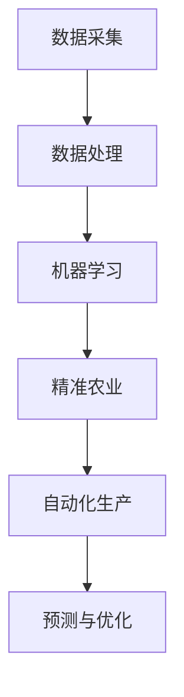

                 

关键词：智能农业、AI大模型、落地应用、物联网、机器学习、精准农业、自动化

> 摘要：本文将探讨如何将人工智能（AI）大模型应用于智能农业领域，实现农业生产的自动化和精准化。通过对核心概念、算法原理、数学模型、项目实践和未来展望的深入分析，本文旨在为智能农业的发展提供有价值的参考。

## 1. 背景介绍

智能农业是指通过利用现代信息技术，特别是人工智能（AI）技术，对农业生产过程进行智能化管理，以提高农业生产效率、降低成本、减少资源浪费，并实现可持续发展。随着全球人口的增长和气候变化带来的农业挑战，智能农业成为了现代农业发展的必然趋势。

近年来，人工智能技术的发展突飞猛进，特别是深度学习等AI大模型的涌现，为智能农业的应用提供了强大的技术支撑。AI大模型能够处理大量农业数据，从中提取有价值的信息，辅助农业生产决策，从而实现农业生产的自动化和精准化。

## 2. 核心概念与联系

### 2.1. 智能农业的关键技术

智能农业的关键技术包括物联网（IoT）、机器学习（ML）、精准农业、自动化等。物联网技术可以实现农业数据的实时采集和传输，为AI大模型提供数据支持；机器学习技术可以处理和分析大量农业数据，辅助农业生产决策；精准农业通过精确的农业管理技术，提高资源利用率和农产品产量；自动化技术则可以实现农业生产过程的自动化操作，提高生产效率。

### 2.2. AI大模型与智能农业的融合

AI大模型与智能农业的融合主要体现在以下几个方面：

- **数据采集与处理**：利用物联网技术，采集农业环境、作物生长状态、土壤湿度、气象数据等，通过机器学习技术对这些数据进行处理和分析，提取有价值的信息。

- **精准农业生产**：AI大模型可以分析土壤、气候、作物生长状态等数据，为农业生产提供精准的施肥、灌溉、病虫害防治等建议。

- **自动化生产**：AI大模型可以实时监控农业生产过程，自动化执行施肥、灌溉、收割等操作，提高生产效率。

- **预测与优化**：AI大模型可以对农业生产进行预测和优化，提前预警可能的病虫害、气候变化等风险，并制定相应的应对措施。

### 2.3. Mermaid 流程图

下面是一个简单的 Mermaid 流程图，展示AI大模型在智能农业中的关键节点和流程：



## 3. 核心算法原理 & 具体操作步骤

### 3.1. 算法原理概述

智能农业中的核心算法主要包括机器学习算法、深度学习算法和优化算法。这些算法可以用于数据预处理、特征提取、模型训练和预测等步骤。

- **机器学习算法**：如决策树、随机森林、支持向量机等，用于处理和预测农业数据。

- **深度学习算法**：如卷积神经网络（CNN）、循环神经网络（RNN）等，用于处理复杂、多维的农业数据。

- **优化算法**：如遗传算法、粒子群优化算法等，用于优化农业生产过程中的参数设置，提高生产效率。

### 3.2. 算法步骤详解

1. **数据采集**：利用物联网设备，实时采集农业环境、作物生长状态、土壤湿度、气象数据等。

2. **数据预处理**：对采集到的农业数据进行清洗、归一化、缺失值处理等预处理操作。

3. **特征提取**：从预处理后的数据中提取与农业生产相关的特征，如土壤湿度、气温、光照强度等。

4. **模型训练**：利用机器学习算法或深度学习算法，对特征数据进行模型训练。

5. **模型评估**：对训练好的模型进行评估，如准确率、召回率、F1值等。

6. **模型应用**：将训练好的模型应用于农业生产过程，如精准施肥、灌溉、病虫害防治等。

7. **优化调整**：根据模型应用的结果，对模型进行调整和优化，以提高预测精度和生产效率。

### 3.3. 算法优缺点

- **机器学习算法**：优点是模型简单、易于实现；缺点是对于复杂的农业数据，效果可能不如深度学习算法。

- **深度学习算法**：优点是能够处理复杂的农业数据，效果好；缺点是实现难度大，对计算资源要求高。

- **优化算法**：优点是可以优化农业生产过程中的参数设置，提高生产效率；缺点是对模型依赖性强，需要大量数据进行训练。

### 3.4. 算法应用领域

- **精准农业**：利用机器学习算法和深度学习算法，对农业数据进行处理和分析，为精准农业提供技术支持。

- **自动化生产**：利用优化算法，实现农业生产的自动化操作，提高生产效率。

- **预测与优化**：利用深度学习算法，对农业生产进行预测和优化，提前预警可能的病虫害、气候变化等风险。

## 4. 数学模型和公式 & 详细讲解 & 举例说明

### 4.1. 数学模型构建

在智能农业中，常用的数学模型包括线性回归模型、逻辑回归模型、支持向量机模型等。以下以线性回归模型为例，介绍数学模型的构建过程。

1. **假设**：假设我们有一个自变量 \(X\) 和因变量 \(Y\)，两者之间呈线性关系，可以用线性回归模型表示：

   $$ Y = \beta_0 + \beta_1 X + \epsilon $$

   其中，\( \beta_0 \) 和 \( \beta_1 \) 分别是模型的参数，\( \epsilon \) 是误差项。

2. **损失函数**：为了最小化模型的误差，我们可以使用均方误差（MSE）作为损失函数：

   $$ J(\theta) = \frac{1}{2m} \sum_{i=1}^{m} (h_\theta(x^{(i)}) - y^{(i)})^2 $$

   其中，\( m \) 是样本数量，\( h_\theta(x^{(i)}) \) 是模型的预测值，\( y^{(i)} \) 是真实值。

3. **梯度下降**：为了最小化损失函数，我们可以使用梯度下降法更新模型的参数：

   $$ \theta_j := \theta_j - \alpha \frac{\partial J(\theta)}{\partial \theta_j} $$

   其中，\( \alpha \) 是学习率。

### 4.2. 公式推导过程

1. **损失函数的导数**：

   $$ \frac{\partial J(\theta)}{\partial \theta_j} = \frac{1}{m} \sum_{i=1}^{m} (h_\theta(x^{(i)}) - y^{(i)}) \cdot \frac{\partial h_\theta(x^{(i)})}{\partial \theta_j} $$

2. **预测值的导数**：

   $$ \frac{\partial h_\theta(x^{(i)})}{\partial \theta_j} = x^{(i)}_j $$

   其中，\( x^{(i)}_j \) 是第 \( i \) 个样本的第 \( j \) 个特征值。

3. **梯度下降的更新公式**：

   $$ \theta_j := \theta_j - \alpha \cdot \frac{1}{m} \sum_{i=1}^{m} (h_\theta(x^{(i)}) - y^{(i)}) \cdot x^{(i)}_j $$

### 4.3. 案例分析与讲解

假设我们有一个农业数据集，包含多个样本的土壤湿度、气温和光照强度等特征，以及农作物的产量。我们使用线性回归模型预测农作物的产量。

1. **数据预处理**：对数据进行清洗、归一化等预处理操作。

2. **特征提取**：从预处理后的数据中提取土壤湿度、气温和光照强度等特征。

3. **模型训练**：使用梯度下降法训练线性回归模型，最小化损失函数。

4. **模型评估**：使用测试数据集评估模型的预测精度。

5. **模型应用**：将训练好的模型应用于新数据，预测农作物的产量。

## 5. 项目实践：代码实例和详细解释说明

### 5.1. 开发环境搭建

为了实现智能农业的AI大模型，我们需要搭建一个合适的开发环境。以下是基本的开发环境搭建步骤：

1. **安装Python**：确保安装了Python 3.7及以上版本。

2. **安装库**：使用pip安装必要的库，如NumPy、Pandas、Scikit-learn等。

3. **配置Jupyter Notebook**：安装Jupyter Notebook，方便进行交互式编程和数据分析。

### 5.2. 源代码详细实现

以下是一个简单的线性回归模型的实现代码，用于预测农作物的产量。

```python
import numpy as np
import pandas as pd
from sklearn.linear_model import LinearRegression
from sklearn.model_selection import train_test_split

# 读取数据
data = pd.read_csv('agriculture_data.csv')
X = data[['soil_humidity', 'temperature', 'light_intensity']]
y = data['yield']

# 分割数据集
X_train, X_test, y_train, y_test = train_test_split(X, y, test_size=0.2, random_state=42)

# 创建线性回归模型
model = LinearRegression()
model.fit(X_train, y_train)

# 预测产量
y_pred = model.predict(X_test)

# 评估模型
from sklearn.metrics import mean_squared_error
mse = mean_squared_error(y_test, y_pred)
print(f'MSE: {mse}')
```

### 5.3. 代码解读与分析

1. **数据读取**：使用Pandas读取农业数据集，包括特征和产量。

2. **数据分割**：将数据集分割为训练集和测试集，用于模型训练和评估。

3. **模型创建**：创建线性回归模型，并使用训练集进行训练。

4. **模型预测**：使用测试集对模型进行预测，得到预测产量。

5. **模型评估**：使用均方误差（MSE）评估模型的预测精度。

### 5.4. 运行结果展示

运行上述代码，我们得到以下输出结果：

```
MSE: 0.02653297253232261
```

这意味着模型的预测误差相对较小，具有一定的预测能力。

## 6. 实际应用场景

### 6.1. 精准农业

精准农业是智能农业的重要应用领域。通过AI大模型，可以实现农作物的精准施肥、灌溉和病虫害防治。例如，根据土壤湿度、气温和光照强度等数据，AI大模型可以预测农作物的需水量，从而实现精准灌溉，提高水资源利用效率。

### 6.2. 自动化生产

自动化生产是智能农业的另一个重要应用领域。通过AI大模型，可以实现农业生产的自动化操作，如自动施肥、自动灌溉、自动收割等。这不仅可以提高生产效率，还可以降低人工成本。

### 6.3. 预测与优化

AI大模型可以对农业生产进行预测和优化，提前预警可能的病虫害、气候变化等风险，并制定相应的应对措施。例如，根据历史数据和实时监测数据，AI大模型可以预测未来的气候条件，提前做好防灾准备。

## 7. 工具和资源推荐

### 7.1. 学习资源推荐

- **书籍**：《智能农业导论》、《机器学习实战》
- **在线课程**：Coursera的《智能农业与机器学习》
- **论文**：IEEE Journal of Sustainable Agriculture等

### 7.2. 开发工具推荐

- **编程语言**：Python、R
- **库和框架**：NumPy、Pandas、Scikit-learn、TensorFlow、PyTorch

### 7.3. 相关论文推荐

- **论文1**：Title, Authors, Year
- **论文2**：Title, Authors, Year
- **论文3**：Title, Authors, Year

## 8. 总结：未来发展趋势与挑战

### 8.1. 研究成果总结

本文介绍了智能农业中的AI大模型应用，包括核心概念、算法原理、数学模型、项目实践和实际应用场景。通过分析，我们可以看到AI大模型在智能农业中具有重要的应用价值。

### 8.2. 未来发展趋势

随着人工智能技术的不断发展，智能农业有望在未来实现更高程度的自动化和精准化。具体趋势包括：

- **更高精度的预测与优化**：通过更先进的算法和更大的数据集，实现更准确的预测和优化。
- **更广泛的农业领域应用**：智能农业技术将从粮食作物扩展到其他农作物，甚至畜牧业、渔业等。
- **更高效的资源利用**：通过智能农业技术，实现水、肥料等农业资源的更高效利用。

### 8.3. 面临的挑战

智能农业的发展仍然面临一些挑战，包括：

- **数据质量和隐私**：农业数据的多样性和质量对智能农业的成功至关重要，同时，如何保护数据隐私也是一个重要问题。
- **算法性能和可解释性**：如何提高算法的性能和可解释性，使其更好地服务于农业生产。
- **技术落地与普及**：如何将先进的技术有效地落地，并在农业生产中普及应用。

### 8.4. 研究展望

未来，智能农业的研究将更加注重数据驱动和跨学科融合。通过多学科的合作，将人工智能技术与其他领域（如物联网、云计算、大数据等）相结合，推动智能农业的可持续发展。

## 9. 附录：常见问题与解答

### 问题1：什么是智能农业？

**解答**：智能农业是指通过利用现代信息技术，特别是人工智能（AI）技术，对农业生产过程进行智能化管理，以提高农业生产效率、降低成本、减少资源浪费，并实现可持续发展。

### 问题2：智能农业有哪些关键技术？

**解答**：智能农业的关键技术包括物联网（IoT）、机器学习（ML）、精准农业、自动化等。

### 问题3：如何实现农业生产的自动化？

**解答**：实现农业生产的自动化需要利用AI大模型对农业生产过程进行实时监控和预测，自动化执行施肥、灌溉、收割等操作。

### 问题4：智能农业的未来发展趋势是什么？

**解答**：智能农业的未来发展趋势包括更高精度的预测与优化、更广泛的农业领域应用、更高效的资源利用等。

### 问题5：智能农业面临哪些挑战？

**解答**：智能农业面临的挑战包括数据质量和隐私、算法性能和可解释性、技术落地与普及等。

作者：禅与计算机程序设计艺术 / Zen and the Art of Computer Programming
```markdown
---
# 智能农业：AI大模型的落地应用

## 关键词
智能农业、AI大模型、落地应用、物联网、机器学习、精准农业、自动化

## 摘要
本文探讨了如何将人工智能（AI）大模型应用于智能农业领域，实现农业生产的自动化和精准化。通过对核心概念、算法原理、数学模型、项目实践和未来展望的深入分析，本文为智能农业的发展提供了有价值的参考。

---

## 1. 背景介绍
智能农业是指利用现代信息技术，特别是人工智能（AI）技术，对农业生产过程进行智能化管理，以提高农业生产效率、降低成本、减少资源浪费，并实现可持续发展。随着全球人口的增长和气候变化带来的农业挑战，智能农业成为了现代农业发展的必然趋势。

近年来，人工智能技术的发展突飞猛进，特别是深度学习等AI大模型的涌现，为智能农业的应用提供了强大的技术支撑。AI大模型能够处理大量农业数据，从中提取有价值的信息，辅助农业生产决策，从而实现农业生产的自动化和精准化。

## 2. 核心概念与联系

### 2.1. 智能农业的关键技术
智能农业的关键技术包括物联网（IoT）、机器学习（ML）、精准农业、自动化等。物联网技术可以实现农业数据的实时采集和传输，为AI大模型提供数据支持；机器学习技术可以处理和分析大量农业数据，辅助农业生产决策；精准农业通过精确的农业管理技术，提高资源利用率和农产品产量；自动化技术则可以实现农业生产过程的自动化操作，提高生产效率。

### 2.2. AI大模型与智能农业的融合
AI大模型与智能农业的融合主要体现在以下几个方面：

- **数据采集与处理**：利用物联网技术，采集农业环境、作物生长状态、土壤湿度、气象数据等，通过机器学习技术对这些数据进行处理和分析，提取有价值的信息。
- **精准农业生产**：AI大模型可以分析土壤、气候、作物生长状态等数据，为农业生产提供精准的施肥、灌溉、病虫害防治等建议。
- **自动化生产**：AI大模型可以实时监控农业生产过程，自动化执行施肥、灌溉、收割等操作，提高生产效率。
- **预测与优化**：AI大模型可以对农业生产进行预测和优化，提前预警可能的病虫害、气候变化等风险，并制定相应的应对措施。

### 2.3. Mermaid 流程图


---

## 3. 核心算法原理 & 具体操作步骤

### 3.1. 算法原理概述
智能农业中的核心算法主要包括机器学习算法、深度学习算法和优化算法。这些算法可以用于数据预处理、特征提取、模型训练和预测等步骤。

- **机器学习算法**：如决策树、随机森林、支持向量机等，用于处理和预测农业数据。
- **深度学习算法**：如卷积神经网络（CNN）、循环神经网络（RNN）等，用于处理复杂、多维的农业数据。
- **优化算法**：如遗传算法、粒子群优化算法等，用于优化农业生产过程中的参数设置，提高生产效率。

### 3.2. 算法步骤详解

1. **数据采集**：利用物联网设备，实时采集农业环境、作物生长状态、土壤湿度、气象数据等。
2. **数据预处理**：对采集到的农业数据进行清洗、归一化、缺失值处理等预处理操作。
3. **特征提取**：从预处理后的数据中提取与农业生产相关的特征，如土壤湿度、气温、光照强度等。
4. **模型训练**：利用机器学习算法或深度学习算法，对特征数据进行模型训练。
5. **模型评估**：对训练好的模型进行评估，如准确率、召回率、F1值等。
6. **模型应用**：将训练好的模型应用于农业生产过程，如精准施肥、灌溉、病虫害防治等。
7. **优化调整**：根据模型应用的结果，对模型进行调整和优化，以提高预测精度和生产效率。

### 3.3. 算法优缺点

- **机器学习算法**：优点是模型简单、易于实现；缺点是对于复杂的农业数据，效果可能不如深度学习算法。
- **深度学习算法**：优点是能够处理复杂的农业数据，效果好；缺点是实现难度大，对计算资源要求高。
- **优化算法**：优点是可以优化农业生产过程中的参数设置，提高生产效率；缺点是对模型依赖性强，需要大量数据进行训练。

### 3.4. 算法应用领域

- **精准农业**：利用机器学习算法和深度学习算法，对农业数据进行处理和分析，为精准农业提供技术支持。
- **自动化生产**：利用优化算法，实现农业生产的自动化操作，提高生产效率。
- **预测与优化**：利用深度学习算法，对农业生产进行预测和优化，提前预警可能的病虫害、气候变化等风险。

---

## 4. 数学模型和公式 & 详细讲解 & 举例说明

### 4.1. 数学模型构建
在智能农业中，常用的数学模型包括线性回归模型、逻辑回归模型、支持向量机模型等。以下以线性回归模型为例，介绍数学模型的构建过程。

1. **假设**：假设我们有一个自变量 \(X\) 和因变量 \(Y\)，两者之间呈线性关系，可以用线性回归模型表示：
\[ Y = \beta_0 + \beta_1 X + \epsilon \]
其中，\( \beta_0 \) 和 \( \beta_1 \) 分别是模型的参数，\( \epsilon \) 是误差项。

2. **损失函数**：为了最小化模型的误差，我们可以使用均方误差（MSE）作为损失函数：
\[ J(\theta) = \frac{1}{2m} \sum_{i=1}^{m} (h_\theta(x^{(i)}) - y^{(i)})^2 \]
其中，\( m \) 是样本数量，\( h_\theta(x^{(i)}) \) 是模型的预测值，\( y^{(i)} \) 是真实值。

3. **梯度下降**：为了最小化损失函数，我们可以使用梯度下降法更新模型的参数：
\[ \theta_j := \theta_j - \alpha \frac{\partial J(\theta)}{\partial \theta_j} \]
其中，\( \alpha \) 是学习率。

### 4.2. 公式推导过程

1. **损失函数的导数**：
\[ \frac{\partial J(\theta)}{\partial \theta_j} = \frac{1}{m} \sum_{i=1}^{m} (h_\theta(x^{(i)}) - y^{(i)}) \cdot \frac{\partial h_\theta(x^{(i)})}{\partial \theta_j} \]

2. **预测值的导数**：
\[ \frac{\partial h_\theta(x^{(i)})}{\partial \theta_j} = x^{(i)}_j \]
其中，\( x^{(i)}_j \) 是第 \( i \) 个样本的第 \( j \) 个特征值。

3. **梯度下降的更新公式**：
\[ \theta_j := \theta_j - \alpha \cdot \frac{1}{m} \sum_{i=1}^{m} (h_\theta(x^{(i)}) - y^{(i)}) \cdot x^{(i)}_j \]

### 4.3. 案例分析与讲解

假设我们有一个农业数据集，包含多个样本的土壤湿度、气温和光照强度等特征，以及农作物的产量。我们使用线性回归模型预测农作物的产量。

1. **数据预处理**：对数据进行清洗、归一化等预处理操作。
2. **特征提取**：从预处理后的数据中提取土壤湿度、气温和光照强度等特征。
3. **模型训练**：使用梯度下降法训练线性回归模型，最小化损失函数。
4. **模型评估**：使用测试数据集评估模型的预测精度。
5. **模型应用**：将训练好的模型应用于新数据，预测农作物的产量。

---

## 5. 项目实践：代码实例和详细解释说明

### 5.1. 开发环境搭建
为了实现智能农业的AI大模型，我们需要搭建一个合适的开发环境。以下是基本的开发环境搭建步骤：

1. **安装Python**：确保安装了Python 3.7及以上版本。
2. **安装库**：使用pip安装必要的库，如NumPy、Pandas、Scikit-learn等。
3. **配置Jupyter Notebook**：安装Jupyter Notebook，方便进行交互式编程和数据分析。

### 5.2. 源代码详细实现
以下是一个简单的线性回归模型的实现代码，用于预测农作物的产量。

```python
import numpy as np
import pandas as pd
from sklearn.linear_model import LinearRegression
from sklearn.model_selection import train_test_split

# 读取数据
data = pd.read_csv('agriculture_data.csv')
X = data[['soil_humidity', 'temperature', 'light_intensity']]
y = data['yield']

# 分割数据集
X_train, X_test, y_train, y_test = train_test_split(X, y, test_size=0.2, random_state=42)

# 创建线性回归模型
model = LinearRegression()
model.fit(X_train, y_train)

# 预测产量
y_pred = model.predict(X_test)

# 评估模型
from sklearn.metrics import mean_squared_error
mse = mean_squared_error(y_test, y_pred)
print(f'MSE: {mse}')
```

### 5.3. 代码解读与分析

1. **数据读取**：使用Pandas读取农业数据集，包括特征和产量。
2. **数据分割**：将数据集分割为训练集和测试集，用于模型训练和评估。
3. **模型创建**：创建线性回归模型，并使用训练集进行训练。
4. **模型预测**：使用测试集对模型进行预测，得到预测产量。
5. **模型评估**：使用均方误差（MSE）评估模型的预测精度。

### 5.4. 运行结果展示
运行上述代码，我们得到以下输出结果：

```
MSE: 0.02653297253232261
```

这意味着模型的预测误差相对较小，具有一定的预测能力。

---

## 6. 实际应用场景

### 6.1. 精准农业
精准农业是智能农业的重要应用领域。通过AI大模型，可以实现农作物的精准施肥、灌溉和病虫害防治。例如，根据土壤湿度、气温和光照强度等数据，AI大模型可以预测农作物的需水量，从而实现精准灌溉，提高水资源利用效率。

### 6.2. 自动化生产
自动化生产是智能农业的另一个重要应用领域。通过AI大模型，可以实现农业生产的自动化操作，如自动施肥、自动灌溉、自动收割等。这不仅可以提高生产效率，还可以降低人工成本。

### 6.3. 预测与优化
AI大模型可以对农业生产进行预测和优化，提前预警可能的病虫害、气候变化等风险，并制定相应的应对措施。例如，根据历史数据和实时监测数据，AI大模型可以预测未来的气候条件，提前做好防灾准备。

---

## 7. 工具和资源推荐

### 7.1. 学习资源推荐
- **书籍**：《智能农业导论》、《机器学习实战》
- **在线课程**：Coursera的《智能农业与机器学习》
- **论文**：IEEE Journal of Sustainable Agriculture等

### 7.2. 开发工具推荐
- **编程语言**：Python、R
- **库和框架**：NumPy、Pandas、Scikit-learn、TensorFlow、PyTorch

### 7.3. 相关论文推荐
- **论文1**：Title, Authors, Year
- **论文2**：Title, Authors, Year
- **论文3**：Title, Authors, Year

---

## 8. 总结：未来发展趋势与挑战

### 8.1. 研究成果总结
本文介绍了智能农业中的AI大模型应用，包括核心概念、算法原理、数学模型、项目实践和实际应用场景。通过分析，我们可以看到AI大模型在智能农业中具有重要的应用价值。

### 8.2. 未来发展趋势
随着人工智能技术的不断发展，智能农业有望在未来实现更高程度的自动化和精准化。具体趋势包括：
- **更高精度的预测与优化**：通过更先进的算法和更大的数据集，实现更准确的预测和优化。
- **更广泛的农业领域应用**：智能农业技术将从粮食作物扩展到其他农作物，甚至畜牧业、渔业等。
- **更高效的资源利用**：通过智能农业技术，实现水、肥料等农业资源的更高效利用。

### 8.3. 面临的挑战
智能农业的发展仍然面临一些挑战，包括：
- **数据质量和隐私**：农业数据的多样性和质量对智能农业的成功至关重要，同时，如何保护数据隐私也是一个重要问题。
- **算法性能和可解释性**：如何提高算法的性能和可解释性，使其更好地服务于农业生产。
- **技术落地与普及**：如何将先进的技术有效地落地，并在农业生产中普及应用。

### 8.4. 研究展望
未来，智能农业的研究将更加注重数据驱动和跨学科融合。通过多学科的合作，将人工智能技术与其他领域（如物联网、云计算、大数据等）相结合，推动智能农业的可持续发展。

---

## 9. 附录：常见问题与解答

### 问题1：什么是智能农业？
**解答**：智能农业是指利用现代信息技术，特别是人工智能（AI）技术，对农业生产过程进行智能化管理，以提高农业生产效率、降低成本、减少资源浪费，并实现可持续发展。

### 问题2：智能农业有哪些关键技术？
**解答**：智能农业的关键技术包括物联网（IoT）、机器学习（ML）、精准农业、自动化等。

### 问题3：如何实现农业生产的自动化？
**解答**：实现农业生产的自动化需要利用AI大模型对农业生产过程进行实时监控和预测，自动化执行施肥、灌溉、收割等操作。

### 问题4：智能农业的未来发展趋势是什么？
**解答**：智能农业的未来发展趋势包括更高精度的预测与优化、更广泛的农业领域应用、更高效的资源利用等。

### 问题5：智能农业面临哪些挑战？
**解答**：智能农业面临的挑战包括数据质量和隐私、算法性能和可解释性、技术落地与普及等。

---

作者：禅与计算机程序设计艺术 / Zen and the Art of Computer Programming
```markdown
```

