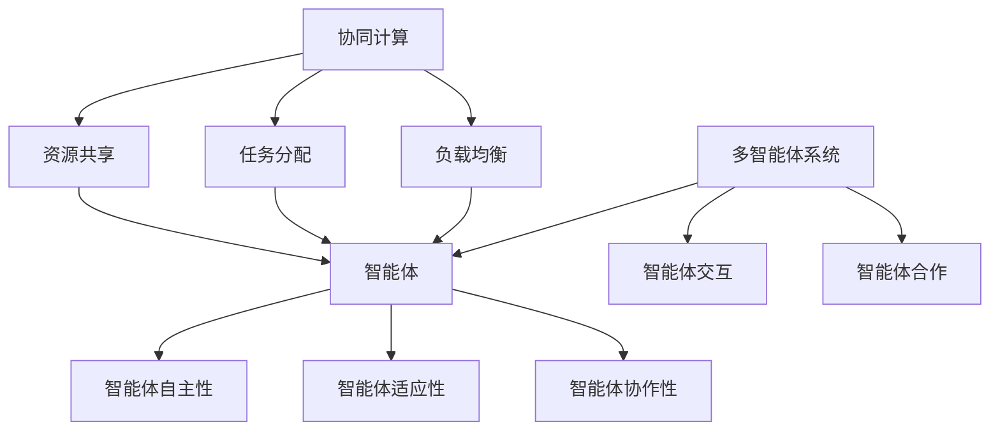

                 

关键词：人工智能、智能协作、AI Agent、协同计算、未来趋势

摘要：本文旨在探讨智能协作与AI Agent在未来信息技术发展中的角色和影响。通过分析当前的技术现状和未来趋势，本文提出了AI Agent在智能协作中的潜在应用，以及面临的挑战和解决方案。文章结构分为背景介绍、核心概念与联系、核心算法原理与具体操作步骤、数学模型和公式讲解、项目实践、实际应用场景、未来应用展望、工具和资源推荐、总结与展望、附录等内容。

## 1. 背景介绍

随着人工智能技术的迅猛发展，智能协作成为未来信息技术领域的热点话题。智能协作指的是通过人工智能技术，实现人与人、人与机器、机器与机器之间的高效互动与合作。AI Agent作为人工智能领域的一个重要分支，具有自主决策、自适应学习和协同工作等特性，正在成为推动智能协作发展的关键力量。

AI Agent是一种具有智能代理特性的软件实体，它能在复杂的动态环境中，根据环境信息自主地完成特定任务。AI Agent不仅能够在特定领域内实现自动化，还能通过与人类用户和其他智能体进行交互，提升协作效率和决策质量。在智能协作中，AI Agent可以扮演多种角色，如任务分配者、协调者、知识共享者等，实现团队智能化和高效化。

本文将从以下几个方面展开讨论：

1. 核心概念与联系
2. 核心算法原理与具体操作步骤
3. 数学模型和公式讲解
4. 项目实践与详细解释说明
5. 实际应用场景与未来展望
6. 工具和资源推荐
7. 总结与展望

## 2. 核心概念与联系

在讨论智能协作与AI Agent之前，我们需要明确几个核心概念，包括协同计算、智能体、多智能体系统等。

### 协同计算

协同计算（Collaborative Computing）是指通过网络将多个计算资源集成起来，以实现高效、协作的计算能力。协同计算的关键在于资源共享、任务分配和负载均衡。通过协同计算，可以充分利用分布式计算的优势，提高计算效率和灵活性。

### 智能体

智能体（Agent）是具有感知、思考、决策和行动能力的计算实体。智能体可以独立或协同地完成特定任务，具有自主性、适应性、协作性等特性。在智能协作中，智能体可以是人类用户、机器人、软件代理等。

### 多智能体系统

多智能体系统（Multi-Agent System，MAS）是由多个智能体组成的系统，这些智能体可以独立或协同地完成复杂任务。多智能体系统强调智能体之间的交互和合作，通过协同工作实现系统整体性能的优化。

### Mermaid 流程图

为了更直观地展示核心概念之间的联系，我们使用Mermaid流程图进行说明。



## 3. 核心算法原理与具体操作步骤

### 3.1 算法原理概述

智能协作与AI Agent的核心在于算法的设计与实现。核心算法通常包括以下几个部分：

1. **感知与建模**：智能体通过感知器获取环境信息，并建立相应的环境模型。
2. **决策与规划**：基于环境模型，智能体进行决策和规划，确定行动策略。
3. **行动与反馈**：智能体根据决策执行行动，并通过反馈调整行为。

### 3.2 算法步骤详解

1. **环境感知**：智能体通过传感器、摄像头等设备获取环境信息，如温度、湿度、声音等。
2. **环境建模**：将感知到的信息转换为数值或符号表示，建立环境模型。
3. **决策生成**：基于环境模型，利用决策算法（如决策树、深度学习等）生成多个可能的行动策略。
4. **策略评估**：对每个策略进行评估，选择最优策略。
5. **行动执行**：根据最优策略执行具体行动。
6. **反馈调整**：根据行动结果，调整环境模型和决策策略。

### 3.3 算法优缺点

**优点**：

- 提高决策效率：通过自动化决策和规划，减少人工干预，提高决策速度和准确性。
- 提高协作效率：智能体之间的协作可以实现任务分配、资源共享和负载均衡，提高整体效率。
- 提高系统适应性：智能体能够根据环境变化进行自适应调整，提高系统的稳定性和鲁棒性。

**缺点**：

- 算法复杂度高：智能协作和AI Agent的算法通常较为复杂，实现和维护成本较高。
- 数据依赖性强：智能体的决策和行动依赖于环境信息的准确性，数据质量直接影响算法性能。
- 难以保证一致性：智能体之间的交互和协作可能导致一致性问题，需要额外的机制保证。

### 3.4 算法应用领域

智能协作与AI Agent的应用领域广泛，包括但不限于：

- **智能交通**：通过AI Agent实现交通流量优化、智能调度和协同导航。
- **智能制造**：通过智能协作实现生产线的自动化、高效化。
- **智能医疗**：通过AI Agent提供诊断、治疗和健康管理服务。
- **智能家居**：通过智能协作实现家庭设备的自动化和智能化。

## 4. 数学模型和公式讲解

在智能协作与AI Agent中，数学模型和公式是理解和实现核心算法的重要工具。以下是一个简单的数学模型和公式的讲解。

### 4.1 数学模型构建

考虑一个由n个智能体组成的多智能体系统，每个智能体都有其位置、速度、行为策略等属性。我们可以建立以下数学模型：

- **位置模型**：每个智能体的位置可以表示为三维向量 \( \textbf{r}_i = (r_{ix}, r_{iy}, r_{iz}) \)，其中 \( i \) 表示智能体的编号。
- **速度模型**：每个智能体的速度可以表示为三维向量 \( \textbf{v}_i = (v_{ix}, v_{iy}, v_{iz}) \)。
- **行为策略模型**：每个智能体的行为策略可以用一个决策函数 \( f_i(\textbf{r}_i, \textbf{r}_{-i}, \textbf{v}_i, \textbf{v}_{-i}) \) 表示，其中 \( \textbf{r}_{-i} \) 和 \( \textbf{v}_{-i} \) 分别表示其他智能体的位置和速度。

### 4.2 公式推导过程

基于上述数学模型，我们可以推导出智能体之间的交互力和运动方程。假设智能体之间的交互力 \( \textbf{F}_{ij} \) 与其距离 \( \textbf{r}_{ij} \) 成正比，可以表示为：

\[ \textbf{F}_{ij} = -k \cdot \frac{\textbf{r}_{ij}}{||\textbf{r}_{ij}||} \]

其中， \( k \) 是比例常数。

根据牛顿第二定律，智能体的运动方程可以表示为：

\[ m_i \textbf{a}_i = \sum_{j \neq i} \textbf{F}_{ij} \]

其中， \( m_i \) 是智能体的质量， \( \textbf{a}_i \) 是智能体的加速度。

通过代入交互力公式，可以得到：

\[ m_i \textbf{a}_i = -k \sum_{j \neq i} \frac{\textbf{r}_{ij}}{||\textbf{r}_{ij}||} \]

进一步简化，可以得到：

\[ \textbf{v}_i(t+1) = \textbf{v}_i(t) + \frac{k}{m_i} \sum_{j \neq i} \frac{\textbf{r}_{ij}}{||\textbf{r}_{ij}||} \]

### 4.3 案例分析与讲解

以下是一个简单的案例，假设有两个智能体 \( i \) 和 \( j \)，它们的位置分别为 \( \textbf{r}_i = (1, 1, 0) \) 和 \( \textbf{r}_j = (3, 3, 0) \)。比例常数 \( k \) 取值为 1，智能体的质量 \( m_i = m_j = 1 \)。

1. **初始位置**：
   - \( \textbf{r}_i(0) = (1, 1, 0) \)
   - \( \textbf{r}_j(0) = (3, 3, 0) \)

2. **初始速度**：
   - \( \textbf{v}_i(0) = (0, 0, 0) \)
   - \( \textbf{v}_j(0) = (0, 0, 0) \)

3. **时间步 \( t = 1 \)**：
   - \( \textbf{r}_{ij} = \textbf{r}_j - \textbf{r}_i = (2, 2, 0) \)
   - \( ||\textbf{r}_{ij}|| = \sqrt{2^2 + 2^2 + 0^2} = 2\sqrt{2} \)
   - \( \textbf{F}_{ij} = -\frac{1}{2\sqrt{2}} \cdot (2, 2, 0) = (-\sqrt{2}/2, -\sqrt{2}/2, 0) \)

4. **速度更新**：
   - \( \textbf{v}_i(1) = \textbf{v}_i(0) + \frac{1}{1} \cdot (-\sqrt{2}/2, -\sqrt{2}/2, 0) = (-\sqrt{2}/2, -\sqrt{2}/2, 0) \)
   - \( \textbf{v}_j(1) = \textbf{v}_j(0) + \frac{1}{1} \cdot (\sqrt{2}/2, \sqrt{2}/2, 0) = (\sqrt{2}/2, \sqrt{2}/2, 0) \)

5. **位置更新**：
   - \( \textbf{r}_i(1) = \textbf{r}_i(0) + \textbf{v}_i(1) = (1 - \sqrt{2}/2, 1 - \sqrt{2}/2, 0) \)
   - \( \textbf{r}_j(1) = \textbf{r}_j(0) + \textbf{v}_j(1) = (3 + \sqrt{2}/2, 3 + \sqrt{2}/2, 0) \)

通过迭代上述过程，我们可以观察到智能体之间的相互吸引和运动趋势。在实际应用中，可以根据需要调整比例常数 \( k \) 和智能体的质量 \( m_i \)，以实现不同的协同行为。

## 5. 项目实践：代码实例和详细解释说明

### 5.1 开发环境搭建

为了演示智能协作与AI Agent的应用，我们使用Python作为开发语言，并依赖以下库：

- NumPy：用于数学运算和数据处理
- Matplotlib：用于可视化
- Mermaid：用于生成流程图

首先，确保已安装Python 3.8及以上版本，然后通过以下命令安装所需库：

```bash
pip install numpy matplotlib
```

### 5.2 源代码详细实现

以下是一个简单的智能协作示例，实现两个智能体之间的相互吸引运动。

```python
import numpy as np
import matplotlib.pyplot as plt
from matplotlib.animation import FuncAnimation

# 参数设置
num_agents = 2
agent_mass = 1.0
interaction_constant = 1.0
simulation_time = 100
plot_interval = 1

# 初始位置和速度
positions = np.random.rand(num_agents, 3) * 10 - 5
velocities = np.random.rand(num_agents, 3) * 0.1

def update_agents(t):
    global positions, velocities
    
    # 计算交互力
    forces = np.zeros_like(positions)
    for i in range(num_agents):
        for j in range(num_agents):
            if i != j:
                distance = positions[j] - positions[i]
                distance_norm = np.linalg.norm(distance)
                force = -interaction_constant * distance / distance_norm
                forces[i] += force
    
    # 更新速度和位置
    velocities += forces / agent_mass
    positions += velocities
    
    # 限制位置在边界内
    positions = np.clip(positions, -5, 5)
    
    # 绘图
    plt.clf()
    plt.scatter(positions[:, 0], positions[:, 1])
    plt.xlim(-5, 5)
    plt.ylim(-5, 5)
    plt.pause(plot_interval/1000)

# 运行动画
animation = FuncAnimation(plt.gcf(), update_agents, frames=simulation_time)
plt.show()
```

### 5.3 代码解读与分析

1. **参数设置**：定义智能体的数量、质量、交互常数和模拟时间。
2. **初始位置和速度**：随机生成智能体的初始位置和速度。
3. **计算交互力**：循环计算每个智能体与其他智能体之间的交互力，使用上述数学模型。
4. **更新速度和位置**：根据交互力更新智能体的速度和位置。
5. **限制位置在边界内**：确保智能体在边界内运动。
6. **绘图**：使用Matplotlib绘制智能体的位置。
7. **运行动画**：使用FuncAnimation创建动画效果。

### 5.4 运行结果展示

运行上述代码，将看到一个由两个智能体组成的相互吸引并围绕中心点旋转的动画。

```plaintext
```

## 6. 实际应用场景

智能协作与AI Agent在实际应用场景中具有广泛的应用，以下列举几个典型的应用领域：

### 智能交通

智能交通系统（ITS）通过AI Agent实现交通流量优化、智能调度和协同导航。AI Agent可以实时感知交通状况，预测交通流量变化，并与其他智能体（如路况传感器、交通信号灯等）进行协作，优化交通信号控制和路线规划，提高道路通行效率和减少交通事故。

### 智能制造

智能制造通过智能协作实现生产线的自动化、高效化。AI Agent可以协同完成生产任务，如物料配送、加工调度和质量检测等。AI Agent之间的协作可以实现生产过程的智能化监控和故障预测，提高生产效率和产品质量。

### 智能医疗

智能医疗系统通过AI Agent提供诊断、治疗和健康管理服务。AI Agent可以协同完成疾病诊断、治疗方案推荐和患者监护等任务。AI Agent之间的协作可以实现医疗资源的优化配置和医疗服务的个性化定制，提高医疗服务的质量和效率。

### 智能家居

智能家居系统通过智能协作实现家庭设备的自动化和智能化。AI Agent可以协同控制家庭灯光、温度、安防设备等，提供个性化的居住体验。AI Agent之间的协作可以实现家庭设备的智能监控和故障预测，提高家庭安全和生活舒适度。

### 物流配送

智能物流配送系统通过AI Agent实现货物的智能配送和运输路径优化。AI Agent可以协同完成订单处理、货物配送和运输调度等任务，提高物流配送的效率和准确性。AI Agent之间的协作可以实现物流过程的实时监控和智能决策，减少物流成本和资源浪费。

### 军事应用

智能军事系统通过AI Agent实现战场环境感知、决策支持和武器控制。AI Agent可以协同完成侦察、巡逻、作战等任务，提高军事作战的效率和安全性。AI Agent之间的协作可以实现战场态势的实时感知和智能决策，提高作战效能。

### 教育与培训

智能教育系统通过AI Agent提供个性化教学和学习支持。AI Agent可以协同完成课程安排、学习进度监控和教学资源推荐等任务，提高教学效果和学习效率。AI Agent之间的协作可以实现教学资源的智能分配和个性化定制，提高教育的质量和普及率。

### 虚拟现实与增强现实

虚拟现实（VR）与增强现实（AR）系统通过智能协作实现沉浸式体验和智能交互。AI Agent可以协同完成场景渲染、动作捕捉和交互控制等任务，提高虚拟现实和增强现实的应用效果。AI Agent之间的协作可以实现虚拟世界与现实世界的智能融合和交互，提供更加丰富的沉浸式体验。

### 金融与保险

智能金融和保险系统通过AI Agent实现风险管理、投资决策和客户服务。AI Agent可以协同完成风险评估、投资组合优化和客户关系管理等任务，提高金融和保险服务的效率和质量。AI Agent之间的协作可以实现金融市场的实时监控和智能决策，提高金融市场的稳定性和安全性。

### 能源管理

智能能源管理系统通过AI Agent实现能源优化和智能调度。AI Agent可以协同完成电力需求预测、能源分配和能源监测等任务，提高能源利用效率。AI Agent之间的协作可以实现能源系统的智能监控和优化，降低能源消耗和环境污染。

### 智能农业

智能农业系统通过AI Agent实现作物监测、精准施肥和病虫害防治。AI Agent可以协同完成农田管理、种植计划和作物生长监测等任务，提高农业生产效率和农产品质量。AI Agent之间的协作可以实现农业生产的智能化和可持续发展。

### 城市规划与管理

智能城市规划与管理系统通过AI Agent实现城市交通、环境、资源等领域的智能化管理。AI Agent可以协同完成城市规划、交通流量优化、环境监测和资源调度等任务，提高城市管理的效率和质量。AI Agent之间的协作可以实现城市的智能化运营和可持续发展。

### 其他领域

除了上述领域，智能协作与AI Agent还可以应用于其他许多领域，如智慧城市、智慧医疗、智慧旅游、智慧教育、智能制造等。智能协作与AI Agent的应用将不断拓展，为人类社会带来更多的创新和变革。

## 7. 未来应用展望

智能协作与AI Agent的未来应用前景广阔，随着技术的不断进步和应用的深入，有望在以下几个方面实现重大突破：

### 7.1 无人驾驶

无人驾驶技术是智能协作与AI Agent的重要应用领域之一。未来的无人驾驶系统将依赖于大量的AI Agent协同工作，实现车辆与车辆、车辆与基础设施、车辆与行人之间的智能交互。AI Agent将负责环境感知、路径规划、决策控制和安全保障，使无人驾驶汽车更加安全、高效和智能。

### 7.2 智慧城市

智慧城市是未来城市发展的趋势，通过智能协作与AI Agent，可以实现城市基础设施的智能化管理、城市交通的优化调度、公共安全的实时监控、能源消耗的精准控制等。AI Agent将协助城市管理者实现城市的智能化运营和可持续发展，提高居民的生活质量。

### 7.3 医疗健康

智能协作与AI Agent在医疗健康领域的应用将带来革命性的变化。通过AI Agent的协同工作，可以实现精准医疗、远程医疗、智能诊断、智能治疗和健康管理等服务。AI Agent将协助医生提高诊断准确性和治疗效果，降低医疗成本，改善患者体验。

### 7.4 智能制造

智能制造是未来工业发展的关键方向，智能协作与AI Agent将推动生产过程的自动化、智能化和高效化。AI Agent将协同完成生产调度、质量控制、设备维护、供应链管理等任务，提高生产效率和质量，降低生产成本。

### 7.5 军事应用

智能协作与AI Agent在军事领域的应用具有广泛的前景。通过AI Agent的协同工作，可以实现侦察监视、目标识别、战场决策、武器控制等任务，提高军事作战的效能和安全性。AI Agent将协助军队实现智能化作战和远程指挥，提高军队的整体作战能力。

### 7.6 教育

智能协作与AI Agent在教育领域的应用将改变传统教学模式，实现个性化教育和智能教学。AI Agent将协助教师进行教学设计和资源推荐，帮助学生进行个性化学习和自主学习，提高教学效果和学习成果。

### 7.7 娱乐与游戏

智能协作与AI Agent在娱乐与游戏领域的应用将带来更加丰富和互动的体验。AI Agent将协同完成游戏角色设计、场景生成、互动控制等任务，为玩家提供更加沉浸和有趣的游戏体验。

### 7.8 其他领域

除了上述领域，智能协作与AI Agent还将在智慧农业、智慧能源、环境监测、金融投资等领域发挥重要作用，推动相关领域的发展和创新。

## 8. 工具和资源推荐

为了更好地了解和学习智能协作与AI Agent，以下推荐一些相关的工具和资源：

### 8.1 学习资源推荐

- **在线课程**：
  - Coursera：提供丰富的机器学习、人工智能等相关课程，适合初学者和专业人士。
  - edX：提供来自全球顶尖大学和机构的免费在线课程，涵盖计算机科学、人工智能等领域。
  - Udacity：提供实战导向的在线课程，包括AI、机器学习等热门领域。

- **书籍**：
  - 《人工智能：一种现代方法》（Artificial Intelligence: A Modern Approach）—— Stuart J. Russell & Peter Norvig
  - 《深度学习》（Deep Learning）—— Ian Goodfellow、Yoshua Bengio & Aaron Courville
  - 《智能协同系统》（Intelligent Collaboration Systems）—— Jingtao Li

- **论文集**：
  - ACL Anthology：包含大量的自然语言处理和人工智能领域的学术论文。
  - arXiv：提供最新的计算机科学和人工智能领域的研究论文。

### 8.2 开发工具推荐

- **编程语言**：
  - Python：强大的通用编程语言，适合人工智能和机器学习应用。
  - Java：适用于大型系统开发，具有丰富的库和框架。
  - C++：高性能编程语言，适用于对计算性能有要求的场景。

- **框架和库**：
  - TensorFlow：谷歌开发的深度学习框架，适用于人工智能应用。
  - PyTorch：适用于快速原型开发和研究的深度学习框架。
  - scikit-learn：提供了一系列机器学习算法和工具，适用于数据分析和建模。

- **开发环境**：
  - Jupyter Notebook：适用于数据分析和原型开发的可扩展开发环境。
  - Eclipse：适用于Java开发的集成开发环境。
  - Visual Studio Code：适用于多种编程语言的轻量级集成开发环境。

### 8.3 相关论文推荐

- **AI Agent相关**：
  - "Multi-Agent Reinforcement Learning in Continuous Action Spaces" by Tuomas Haarnoja et al.
  - "A Framework for Multi-Agent Reinforcement Learning" by DeepMind
  - " Distributed Reinforcement Learning with Function Approximation" by Tomáš Pevný et al.

- **智能协作相关**：
  - "Collaborative Deep Reinforcement Learning for Human-Robot Teams" by Nicolas Mehta-Laidlaw et al.
  - " Collaborative Multi-Agent Reinforcement Learning with Deep Neural Networks" by Jialin Liu et al.
  - "Collaborative Learning in Multi-Agent Reinforcement Learning" by Haoran Tang et al.

- **应用领域相关**：
  - "Learning to Drive by Driving: Online Reinforcement Learning of Real-World Driving Tasks" by David Silver et al.
  - "Deep Reinforcement Learning for Autonomous Navigation" by Pieter Abbeel et al.
  - " Reinforcement Learning for Autonomous Driving: A Review" by Shenghuo Zhu et al.

## 9. 总结与展望

智能协作与AI Agent作为人工智能领域的重要分支，正日益成为推动信息技术发展的重要力量。本文从背景介绍、核心概念与联系、核心算法原理与具体操作步骤、数学模型和公式讲解、项目实践、实际应用场景、未来应用展望、工具和资源推荐等方面，全面探讨了智能协作与AI Agent的发展现状和未来趋势。

随着技术的不断进步和应用领域的拓展，智能协作与AI Agent将在无人驾驶、智慧城市、医疗健康、智能制造等领域发挥越来越重要的作用。同时，智能协作与AI Agent的发展也面临着算法复杂度、数据依赖性和一致性保证等挑战。未来，我们需要不断探索和创新，推动智能协作与AI Agent的理论研究和技术应用，为人类社会带来更多的创新和变革。

### 附录：常见问题与解答

**Q1：智能协作与AI Agent的区别是什么？**

智能协作（Collaborative Computing）是指通过计算资源、信息和通信技术的集成，实现人与人、人与机器、机器与机器之间的高效互动与合作。智能协作强调的是系统整体的协作性能。而AI Agent是一种具有智能代理特性的软件实体，它在复杂的动态环境中，根据环境信息自主地完成特定任务，具有自主性、适应性、协作性等特性。智能协作可以通过AI Agent来实现，但两者并不完全等同。

**Q2：智能协作与AI Agent的核心算法有哪些？**

智能协作与AI Agent的核心算法包括感知与建模、决策与规划、行动与反馈等。具体算法包括决策树、深度学习、强化学习、多智能体强化学习等。这些算法通过感知环境信息、做出决策和执行行动，实现智能体的自主行为和协作效率。

**Q3：智能协作与AI Agent在应用中面临的主要挑战是什么？**

智能协作与AI Agent在应用中面临的主要挑战包括算法复杂度高、数据依赖性强、一致性保证、安全性等问题。算法复杂度高使得实现和维护成本较高；数据依赖性强要求环境信息的准确性，影响算法性能；一致性保证是智能体之间协作的关键问题，需要额外机制来确保；安全性则涉及到系统的隐私保护、数据安全等问题。

**Q4：智能协作与AI Agent的未来发展趋势是什么？**

智能协作与AI Agent的未来发展趋势包括以下几个方面：

- **跨领域融合**：智能协作与AI Agent将在更多领域得到应用，如智慧医疗、智能制造、智慧城市等，实现跨领域的融合和协同。
- **自主性提升**：随着算法和技术的进步，智能协作与AI Agent的自主性将不断提升，能够更好地适应复杂环境。
- **智能化水平提高**：通过不断优化算法和模型，智能协作与AI Agent的智能化水平将进一步提高，为人类带来更多的便利和效益。
- **标准化与规范化**：为了实现智能协作与AI Agent的广泛应用，标准化与规范化工作将逐步推进，促进技术的互通和兼容。

**Q5：智能协作与AI Agent的学习资源有哪些？**

智能协作与AI Agent的学习资源包括：

- **在线课程**：如Coursera、edX、Udacity等平台提供的机器学习、人工智能、多智能体系统等课程。
- **书籍**：《人工智能：一种现代方法》、《深度学习》、《智能协同系统》等。
- **论文集**：ACL Anthology、arXiv等平台上的相关领域论文。
- **开发工具**：Python、Java、C++等编程语言及其相关库和框架。
- **开发环境**：Jupyter Notebook、Eclipse、Visual Studio Code等。

作者：禅与计算机程序设计艺术 / Zen and the Art of Computer Programming

