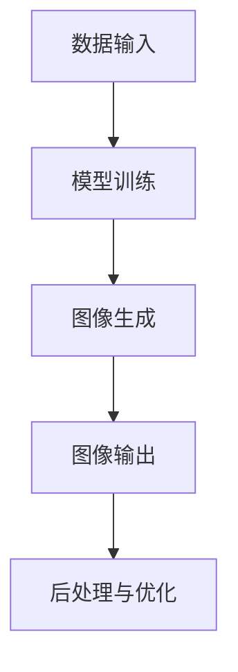

                 

关键词：智能图像生成，AI大模型，创意设计，图像处理，深度学习，GAN，人脸修复，风格迁移，图像合成，图像编辑。

## 摘要

本文将深入探讨智能图像生成技术，特别是AI大模型在创意设计领域的应用。通过介绍AI大模型的基础概念、核心算法、数学模型以及实际应用案例，本文旨在为读者提供一个全面的理解，帮助他们在创意设计中充分利用这项先进的技术。

## 1. 背景介绍

随着深度学习技术的快速发展，人工智能在图像处理领域的应用取得了显著的突破。特别是在生成对抗网络（GAN）、变分自编码器（VAE）等模型的基础上，AI大模型在图像生成、编辑和修复等方面展现出了强大的能力。这些技术的进步不仅改变了图像处理的方式，也为创意设计领域带来了前所未有的机遇。

在创意设计领域，图像生成技术的应用场景非常广泛。例如，在时尚设计、广告创意、动画制作、游戏开发等众多行业中，AI大模型可以帮助设计师快速生成高质量的图像，提高设计效率和创意水平。此外，在医疗影像处理、卫星图像分析等专业的应用场景中，智能图像生成技术同样发挥了重要作用。

本文将首先介绍AI大模型的基本概念和核心算法，然后通过具体案例展示其在创意设计中的应用，最后讨论未来发展的趋势和面临的挑战。

### 1.1. 智能图像生成技术的发展历程

智能图像生成技术的发展可以追溯到早期的人工图像合成方法。这些方法通常依赖于手工设计的规则和算法，如图像滤波、纹理合成等。虽然这些方法在特定场景下有一定的效果，但它们缺乏灵活性和适应性，难以处理复杂和大规模的图像生成任务。

随着深度学习技术的发展，特别是在2014年生成对抗网络（GAN）的提出，图像生成技术迎来了革命性的变革。GAN通过训练两个神经网络——生成器和判别器，实现图像的生成和判别。这一创新性的模型为图像生成任务提供了全新的解决方案，并且随着时间的发展，GAN及其变种模型在图像合成、编辑和修复等方面取得了显著的进展。

除了GAN，变分自编码器（VAE）等模型也在图像生成领域发挥了重要作用。VAE通过概率模型来生成图像，它能够在保持图像质量的同时，生成更加多样化的图像。此外，深度卷积生成网络（DCGAN）、条件生成对抗网络（cGAN）等改进模型，进一步提升了图像生成的效果和效率。

总的来说，智能图像生成技术的发展历程是一个从简单规则驱动到复杂数据驱动的演变过程。深度学习技术的引入，使得图像生成变得更加智能化和自动化，为创意设计领域带来了新的机遇和挑战。

### 1.2. 创意设计领域的需求分析

在创意设计领域，设计师们面临着不断变化的客户需求和市场趋势。快速响应、高效设计和独特创意成为设计师们成功的关键。然而，传统的图像处理方法在应对这些需求时往往显得力不从心。

首先，创意设计要求图像具有高度的艺术性和个性化。设计师需要从大量的素材中提取灵感，并将这些灵感融合到最终的图像中。传统的图像处理方法往往依赖于手工操作，这不仅效率低下，而且难以保证图像的独创性和艺术性。

其次，创意设计需要图像生成的高效性和实时性。设计师经常需要在短时间内生成大量图像，以供不同的设计方向和创意方案选择。传统的图像合成方法往往需要大量的计算资源和时间，无法满足这种高效的要求。

最后，创意设计要求图像生成技术具有灵活性和扩展性。设计师们希望图像生成工具能够适应不同的设计风格和场景，同时能够方便地集成到现有的设计流程中。传统的图像处理方法通常固定在特定的操作步骤和工具上，缺乏这种灵活性和扩展性。

综上所述，创意设计领域对智能图像生成技术的需求主要集中在高效性、灵活性和创造性上。AI大模型的出现，正好满足了这些需求，为创意设计带来了全新的解决方案。通过智能化和自动化的图像生成方法，设计师们可以更加专注于创意构思和设计实现，从而提升设计效率和创意水平。

### 1.3. AI大模型在创意设计中的应用场景

AI大模型在创意设计中的应用场景非常广泛，以下是一些典型的应用实例：

#### **1.1 时尚设计**

在时尚设计领域，AI大模型可以用于生成新颖的服装图案、设计创意和个性化服装。设计师可以输入一些基本的设计元素，如颜色、纹理和风格，AI大模型则会生成多样化的设计选项。这不仅节省了设计时间，还大大提升了设计的独创性和艺术性。

#### **1.2 广告创意**

在广告创意领域，AI大模型可以用于生成吸引人的广告图像。通过分析大量的广告素材和用户偏好数据，AI大模型可以生成与目标受众高度匹配的广告图像，从而提高广告的效果和转化率。

#### **1.3 动画制作**

在动画制作领域，AI大模型可以用于生成高质量的背景图像和角色模型。设计师可以通过提供一些基本的设计元素，如场景和角色草图，AI大模型则会生成完整的动画场景和角色。这种方法不仅提高了动画制作效率，还保证了图像的一致性和连贯性。

#### **1.4 游戏开发**

在游戏开发领域，AI大模型可以用于生成游戏场景和角色图像。设计师可以输入一些基本的设计元素，如地形、植被和角色造型，AI大模型则会生成多样化的游戏场景和角色。这种方法不仅节省了开发时间，还保证了游戏世界的多样性和趣味性。

#### **1.5 艺术创作**

在艺术创作领域，AI大模型可以与艺术家合作，生成独特的艺术作品。艺术家可以通过训练AI大模型来探索新的艺术风格和表现形式，从而创造出前所未有的艺术作品。AI大模型为艺术家提供了更多的创作灵感和工具，推动了艺术创作的创新和发展。

这些应用实例展示了AI大模型在创意设计中的多样性和潜力。随着技术的不断进步，AI大模型将在更多创意设计领域中发挥重要作用，为设计师和艺术家提供强大的支持和工具。

## 2. 核心概念与联系

### **2.1. 人工智能与图像处理**

人工智能（AI）与图像处理之间的关系密不可分。图像处理是AI技术的一个重要应用领域，它涉及对图像的获取、转换、分析和理解。AI技术通过引入深度学习、神经网络和大数据分析等方法，极大地提升了图像处理的效率和精度。

在图像处理中，AI大模型扮演了关键角色。这些模型通过大量的图像数据训练，能够自动学习图像的特征和模式，从而实现图像的分类、分割、修复和生成等任务。AI大模型的应用不仅提高了图像处理的自动化水平，还使得处理过程更加智能化和高效。

### **2.2. 深度学习与图像生成**

深度学习是AI大模型实现图像生成的基础技术之一。深度学习通过多层神经网络的结构，能够自动提取图像的层次特征，从而实现复杂的图像处理任务。特别是生成对抗网络（GAN）的出现，使得图像生成成为深度学习的一个重要应用方向。

GAN由生成器和判别器两个神经网络组成。生成器负责生成图像，判别器则负责判断生成图像的真实性。在训练过程中，生成器和判别器相互对抗，生成器不断优化图像生成能力，判别器则不断提高对真实图像的判断精度。这种对抗性训练机制，使得GAN能够生成高质量的图像。

### **2.3. AI大模型在创意设计中的应用**

AI大模型在创意设计中的应用，主要体现在以下几个方面：

#### **2.3.1. 图像生成与编辑**

AI大模型可以通过生成对抗网络（GAN）等技术，生成高质量的图像。设计师可以利用这些生成图像作为设计的起点，进一步进行图像编辑和优化。例如，AI大模型可以生成新颖的服装图案、建筑外观和室内设计效果，从而为设计师提供更多的创意空间。

#### **2.3.2. 数据辅助设计**

AI大模型可以分析大量的设计数据，如用户偏好、市场趋势和设计风格等，从而为设计师提供有价值的设计建议。设计师可以利用这些数据，优化设计方案，提高设计的市场竞争力。

#### **2.3.3. 设计流程自动化**

AI大模型可以通过自动化工具，实现设计流程的自动化。例如，设计师可以设置一些基本的设计规则和参数，AI大模型则会自动生成符合要求的设计图像。这种方法不仅提高了设计效率，还减少了人为操作的误差。

#### **2.3.4. 创意灵感生成**

AI大模型可以通过学习大量的设计作品和创意素材，生成新的设计灵感和创意。设计师可以利用这些灵感，拓展设计思路，提高设计的创新性。

### **2.4. AI大模型与创意设计的联系**

AI大模型与创意设计的联系在于，它们共同追求创新和个性化。创意设计强调独特的创意和个性化的表达，而AI大模型则通过学习和自动化，实现了图像生成和编辑的智能化和高效化。这种智能化和自动化的实现，不仅提高了设计效率，还为设计师提供了更多的创作工具和灵感来源。

通过AI大模型的应用，设计师可以更加专注于创意构思和设计实现，而无需担心繁琐的图像处理任务。同时，AI大模型也可以帮助设计师发现新的设计趋势和灵感，推动创意设计的创新和发展。

总之，AI大模型与创意设计之间的联系，不仅体现在技术层面，更体现在设计理念上。这种联系，为设计师和创意产业带来了前所未有的机遇和挑战。

### **2.5. AI大模型的应用架构**

为了更好地理解AI大模型在创意设计中的应用，我们可以从架构的角度进行详细分析。AI大模型的应用架构通常包括数据输入、模型训练、图像生成和输出等几个关键环节。

#### **2.5.1. 数据输入**

数据输入是AI大模型应用的基础。在设计领域，这些数据通常包括大量的图像素材、设计元素和用户偏好数据。这些数据不仅用于训练模型，还为模型提供了丰富的信息来源。

#### **2.5.2. 模型训练**

模型训练是AI大模型应用的核心环节。通过大量的图像数据训练，模型能够自动学习图像的特征和模式，从而实现图像生成和编辑。训练过程中，模型不断优化其参数和结构，以提高生成图像的质量和效率。

#### **2.5.3. 图像生成**

图像生成是AI大模型应用的核心功能。通过训练完成的模型，可以生成高质量的图像，满足设计师的需求。生成图像的过程中，模型会根据输入的设计元素和规则，自动生成符合要求的图像。

#### **2.5.4. 输出**

图像生成的结果需要进行后处理和优化，以满足设计要求。这个过程包括图像编辑、色彩调整和样式优化等。最终生成的图像可以通过图形界面或者API接口，提供给设计师使用。

### **2.6. 机器学习与深度学习的区别**

机器学习和深度学习是AI大模型应用的两个核心技术，它们在理论和实践上存在一些区别：

#### **2.6.1. 理论基础**

机器学习是基于统计学习理论的，通过构建数学模型来分析数据，从中提取有用信息。深度学习则是基于神经网络理论的，通过多层神经网络的结构，自动提取数据的层次特征。

#### **2.6.2. 模型结构**

机器学习模型通常由一系列数学公式组成，如线性回归、支持向量机等。深度学习模型则是由大量的神经网络层组成，如卷积神经网络（CNN）、生成对抗网络（GAN）等。

#### **2.6.3. 应用场景**

机器学习适用于需要手动设计特征提取规则的问题，如文本分类、图像识别等。深度学习适用于需要自动提取特征的问题，如图像生成、自然语言处理等。

### **2.7. AI大模型的优势与挑战**

AI大模型在创意设计领域具有显著的优势，但也面临着一些挑战。

#### **2.7.1. 优势**

1. **高效性**：AI大模型能够自动提取图像特征，生成高质量的图像，大大提高了设计效率。
2. **灵活性**：AI大模型可以根据不同的设计需求和规则，生成多样化的图像，满足个性化设计的要求。
3. **创新性**：AI大模型能够通过学习和分析大量的设计作品，生成新的创意和灵感，推动设计创新。

#### **2.7.2. 挑战**

1. **计算资源**：AI大模型训练和运行需要大量的计算资源，对硬件设备有较高的要求。
2. **数据质量**：AI大模型的效果很大程度上依赖于输入数据的质量和多样性，数据质量问题可能影响模型性能。
3. **算法优化**：AI大模型需要不断优化和改进，以适应不同的应用场景和需求。

### **2.8. Mermaid 流程图**

为了更好地展示AI大模型在创意设计中的应用架构，我们可以使用Mermaid流程图进行描述。以下是一个简单的Mermaid流程图示例：



在这个流程图中，数据输入是模型训练的起点，通过训练生成的模型用于图像生成，最终生成的图像经过后处理和优化，得到设计结果。

## 3. 核心算法原理 & 具体操作步骤

### **3.1 算法原理概述**

在智能图像生成领域，生成对抗网络（GAN）是应用最广泛的算法之一。GAN的核心思想是通过两个相互对抗的神经网络——生成器和判别器，实现高质量图像的生成。生成器负责生成图像，判别器则负责判断生成图像的真实性。在训练过程中，生成器和判别器相互竞争，生成器不断优化生成图像的质量，判别器则不断提高对真实图像和生成图像的区分能力。

GAN的基本架构包括以下几个部分：

1. **生成器（Generator）**：生成器是一个神经网络，它的输入是随机噪声向量，输出是生成的图像。生成器的目标是通过学习和优化，生成与真实图像难以区分的图像。

2. **判别器（Discriminator）**：判别器也是一个神经网络，它的输入是图像，输出是对图像真实性的判断。判别器的目标是通过学习和优化，能够准确地区分真实图像和生成图像。

3. **损失函数**：GAN的训练过程通过优化生成器和判别器的损失函数来实现。生成器的损失函数通常是通过判别器的输出计算的，判别器的损失函数则通过生成图像和真实图像之间的差距来计算。

### **3.2 算法步骤详解**

#### **3.2.1 初始化参数**

在开始GAN的训练之前，需要初始化生成器和判别器的参数。通常，这些参数可以通过随机初始化或者基于预训练模型的方法来设置。

#### **3.2.2 数据准备**

准备用于训练的数据集，这些数据集通常包括大量的真实图像。在数据准备阶段，需要对图像进行预处理，如归一化、缩放等，以便于模型训练。

#### **3.2.3 生成图像**

生成器的训练过程是通过生成图像来完成的。每次训练，生成器会根据随机噪声向量生成图像，然后将这些图像作为判别器的输入。

#### **3.2.4 判别器训练**

判别器的训练过程是通过判断生成图像的真实性来完成的。每次训练，判别器会根据生成图像和真实图像之间的差距来更新参数。判别器的目标是在生成图像和真实图像之间建立良好的边界。

#### **3.2.5 生成器和判别器的交替训练**

GAN的训练过程是生成器和判别器的交替训练。生成器在每次训练后都会生成新的图像，判别器则根据这些图像更新参数。这个过程会重复进行，直到生成器和判别器都达到预定的训练目标。

#### **3.2.6 模型评估**

在训练完成后，需要对模型进行评估，以确定生成图像的质量。通常，可以通过计算生成图像和真实图像之间的差距，或者使用一些图像质量评价指标来进行评估。

### **3.3 算法优缺点**

#### **3.3.1 优点**

1. **生成图像质量高**：GAN能够生成与真实图像难以区分的高质量图像，这是其他图像生成算法难以达到的。
2. **适应性强**：GAN可以应用于多种图像生成任务，如图像合成、图像修复和图像增强等。
3. **灵活性高**：GAN可以通过调整生成器和判别器的结构，适应不同的图像生成任务。

#### **3.3.2 缺点**

1. **训练困难**：GAN的训练过程复杂，容易陷入局部最优，需要大量的训练数据和计算资源。
2. **不稳定**：GAN的训练过程容易受到初始参数和训练数据的影响，导致模型不稳定。

### **3.4 算法应用领域**

GAN在多个领域都有广泛的应用：

1. **图像生成**：GAN可以用于生成各种类型的图像，如人脸、风景、艺术作品等。
2. **图像修复**：GAN可以用于修复破损的图像，恢复图像细节。
3. **图像增强**：GAN可以用于增强图像的清晰度、对比度和色彩饱和度等。
4. **图像编辑**：GAN可以用于图像的编辑和修改，如改变图像风格、颜色和纹理等。

### **3.5 案例分析**

以下是一个GAN在图像修复中的应用案例：

#### **3.5.1 问题背景**

在图像修复领域，GAN被用于修复破损的图像，如照片、古画等。这些图像通常存在缺失或损坏的部分，需要通过算法恢复。

#### **3.5.2 数据准备**

收集大量的破损图像和对应的无损图像作为训练数据。这些数据将被用于训练生成器和判别器。

#### **3.5.3 模型训练**

通过GAN的训练过程，生成器学习生成与破损图像相似的图像，判别器学习区分破损图像和修复图像。经过多次训练，模型逐渐优化，生成器能够生成高质量的修复图像。

#### **3.5.4 修复效果评估**

通过对比生成图像和原始破损图像，评估修复效果。通常使用峰值信噪比（PSNR）和结构相似性（SSIM）等指标来衡量修复质量。

#### **3.5.5 应用场景**

GAN在图像修复中的应用场景包括照片修复、古画修复、卫星图像修复等。通过GAN技术，可以大大提高图像修复的效率和效果。

### **3.6 练习与讨论**

请讨论以下问题：

1. **GAN在图像修复中的优势是什么？**
2. **GAN在图像生成中的潜在应用有哪些？**
3. **如何解决GAN训练过程中的不稳定问题？**
4. **GAN与其他图像生成算法相比，有哪些优缺点？**

### **3.7 总结**

GAN是一种强大的图像生成算法，通过生成器和判别器的对抗训练，能够生成高质量的图像。它在图像修复、图像生成和图像增强等领域具有广泛的应用。尽管GAN在训练过程中存在一些挑战，但通过不断优化和改进，GAN的应用前景依然非常广阔。

## 4. 数学模型和公式 & 详细讲解 & 举例说明

### **4.1 数学模型构建**

在智能图像生成中，数学模型起到了核心作用。为了理解这些模型，我们需要从基础的数学公式开始，然后逐步构建更复杂的模型。

#### **4.1.1. 图像生成模型的基本框架**

图像生成模型通常基于概率模型，其中一个经典的模型是生成对抗网络（GAN）。在GAN中，主要有两个核心组件：生成器（Generator）和判别器（Discriminator）。

- **生成器（G）**：生成器是一个从随机噪声向量 \( z \) 生成的图像 \( x_g \) 的函数，即 \( x_g = G(z) \)。
- **判别器（D）**：判别器是一个从图像 \( x \) 或 \( x_g \) 中预测其真实性的函数，即 \( D(x) \) 或 \( D(x_g) \)。

#### **4.1.2. 损失函数**

GAN的训练目标是最大化判别器的损失函数。具体来说，GAN的训练可以通过以下两个主要损失函数来实现：

- **判别器损失函数**：判别器损失函数通常是基于二元交叉熵（Binary Cross-Entropy）损失。
  $$ L_D = -\sum_{x \in X} [y \cdot \log(D(x)) + (1 - y) \cdot \log(1 - D(x))] $$
  其中，\( y \) 是真实图像标签（1 表示真实图像，0 表示生成图像），\( D(x) \) 是判别器对图像 \( x \) 的预测概率。

- **生成器损失函数**：生成器损失函数也是基于二元交叉熵损失。
  $$ L_G = -\sum_{z} [ \log(1 - D(G(z))] $$
  其中，\( G(z) \) 是生成器生成的图像，目标是使 \( D(G(z)) \) 尽可能接近 1。

#### **4.1.3. 反向传播与优化**

GAN的训练过程涉及到生成器和判别器的反向传播与优化。在每次训练迭代中：

- **判别器训练**：使用真实图像和生成图像对判别器进行训练，更新判别器的权重，使其能够更好地区分真实图像和生成图像。
- **生成器训练**：使用生成图像对生成器进行训练，更新生成器的权重，使其生成的图像能够更好地欺骗判别器。

### **4.2 公式推导过程**

为了更好地理解GAN的数学模型，我们可以从简单的二元交叉熵损失函数开始，然后逐步推导生成器和判别器的损失函数。

#### **4.2.1. 二元交叉熵损失函数**

二元交叉熵损失函数是一个常见的损失函数，用于二分类问题。其公式如下：

$$ L = -\sum_{i=1}^{N} [y_i \cdot \log(p_i) + (1 - y_i) \cdot \log(1 - p_i)] $$

其中，\( y_i \) 是第 \( i \) 个样本的真实标签（0 或 1），\( p_i \) 是判别器对第 \( i \) 个样本的预测概率。

#### **4.2.2. 判别器损失函数**

在GAN中，判别器的目标是最大化其损失函数。判别器损失函数可以表示为：

$$ L_D = -\sum_{x \in X} [y \cdot \log(D(x)) + (1 - y) \cdot \log(1 - D(x))] $$

其中，\( y \) 是图像标签，\( D(x) \) 是判别器对图像 \( x \) 的预测概率。

#### **4.2.3. 生成器损失函数**

生成器的目标是使判别器无法区分真实图像和生成图像，即最大化判别器的错误率。生成器损失函数可以表示为：

$$ L_G = -\sum_{z} [ \log(1 - D(G(z))] $$

其中，\( G(z) \) 是生成器生成的图像，目标是使 \( D(G(z)) \) 尽可能接近 1。

### **4.3 案例分析与讲解**

为了更好地理解GAN的数学模型，我们可以通过一个具体的案例来进行分析。

#### **4.3.1. 案例背景**

假设我们有一个GAN模型，用于生成人脸图像。生成器的输入是随机噪声向量 \( z \)，判别器的输入是真实人脸图像和生成人脸图像。

#### **4.3.2. 模型训练**

在每次训练迭代中：

1. **判别器训练**：使用真实人脸图像和生成人脸图像对判别器进行训练。例如，有 \( n \) 个真实人脸图像和 \( m \) 个生成人脸图像。

   - 计算判别器的损失函数：
     $$ L_D = -\sum_{i=1}^{n} [1 \cdot \log(D(x_i)) + 0 \cdot \log(1 - D(x_i))] - \sum_{j=1}^{m} [0 \cdot \log(D(x_g_j)) + 1 \cdot \log(1 - D(x_g_j))] $$
   - 更新生成器的权重。

2. **生成器训练**：使用生成器生成的图像对生成器进行训练。

   - 计算生成器的损失函数：
     $$ L_G = -\sum_{j=1}^{m} [1 \cdot \log(1 - D(x_g_j))] $$
   - 更新生成器的权重。

#### **4.3.3. 模型评估**

在训练完成后，可以通过计算生成图像和真实图像之间的差距来评估模型的性能。例如，可以使用以下指标：

- **均方误差（MSE）**：
  $$ MSE = \frac{1}{n} \sum_{i=1}^{n} (\|x_i - x_g\|_2^2) $$
- **结构相似性（SSIM）**：
  $$ SSIM = \frac{(2\mu_x \mu_g + C_1)(2\sigma_{xg} + C_2)}{(\mu_x^2 + \mu_g^2 + C_1)(\sigma_x^2 + \sigma_g^2 + C_2)} $$

其中，\( \mu_x \) 和 \( \mu_g \) 分别是真实图像和生成图像的均值，\( \sigma_x \) 和 \( \sigma_g \) 分别是真实图像和生成图像的标准差，\( C_1 \) 和 \( C_2 \) 是常数。

### **4.4. 结论**

通过上述案例，我们可以看到GAN的数学模型是如何构建和推导的。GAN的核心在于生成器和判别器的相互对抗训练，这种训练过程通过优化损失函数来实现高质量的图像生成。虽然GAN的训练过程具有一定的挑战性，但通过合理的设计和优化，GAN已经在多个图像生成任务中取得了显著的成果。

## 5. 项目实践：代码实例和详细解释说明

### **5.1 开发环境搭建**

在开始实际项目之前，我们需要搭建一个适合开发智能图像生成应用的编程环境。以下是一个基本的开发环境搭建步骤：

#### **5.1.1. 系统要求**

- 操作系统：Windows、Linux 或 macOS
- 编程语言：Python 3.x
- 库和框架：TensorFlow、Keras、NumPy、Pandas

#### **5.1.2. 安装步骤**

1. **安装Python**：首先确保系统已经安装了Python 3.x版本。
2. **安装TensorFlow**：通过pip命令安装TensorFlow：
   ```bash
   pip install tensorflow
   ```
3. **安装其他依赖库**：使用pip安装Keras、NumPy和Pandas：
   ```bash
   pip install keras numpy pandas
   ```

#### **5.1.3. 环境配置**

确保安装的库和框架版本符合项目要求，可以通过以下命令检查版本：
```bash
python -m tensorflow --version
python -m keras --version
```

### **5.2 源代码详细实现**

下面是一个简单的智能图像生成项目的代码实例，使用生成对抗网络（GAN）生成人脸图像。

```python
import numpy as np
from tensorflow import keras
from tensorflow.keras import layers

# 生成器模型
def build_generator():
    model = keras.Sequential([
        layers.Dense(128 * 7 * 7, activation="relu", input_shape=(100,)),
        layers.Reshape((128, 7, 7)),
        layers.Conv2DTranspose(64, 5, strides=1, padding="same"),
        layers.LeakyReLU(alpha=0.01),
        layers.Conv2DTranspose(1, 5, strides=2, padding="same", activation="tanh")
    ])
    return model

# 判别器模型
def build_discriminator():
    model = keras.Sequential([
        layers.Conv2D(32, 5, strides=2, padding="same", input_shape=(28, 28, 1)),
        layers.LeakyReLU(alpha=0.01),
        layers.Dropout(0.3),
        layers.Conv2D(64, 5, strides=2, padding="same"),
        layers.LeakyReLU(alpha=0.01),
        layers.Dropout(0.3),
        layers.Flatten(),
        layers.Dense(1, activation="sigmoid")
    ])
    return model

# GAN模型
def build_gan(generator, discriminator):
    model = keras.Sequential([
        generator,
        discriminator
    ])
    return model

# 编译模型
def compile_models(generator, discriminator, gan):
    discriminator.compile(optimizer=keras.optimizers.Adam(0.0001), loss="binary_crossentropy")
    gan.compile(optimizer=keras.optimizers.Adam(0.0002), loss="binary_crossentropy")
    return generator, discriminator, gan

# 数据准备
(x_train, _), (_, _) = keras.datasets.mnist.load_data()
x_train = x_train.astype("float32") / 127.5 - 1.0
x_train = np.expand_dims(x_train, axis=-1)

# 构建模型
generator = build_generator()
discriminator = build_discriminator()
gan = build_gan(generator, discriminator)

generator, discriminator, gan = compile_models(generator, discriminator, gan)

# 训练模型
epochs = 10000
batch_size = 64

for epoch in range(epochs):
    for batch in range(x_train.shape[0] // batch_size):
        noise = np.random.normal(0, 1, (batch_size, 100))
        generated_images = generator.predict(noise)
        real_images = x_train[batch:batch+batch_size]
        combined_images = np.concatenate([real_images, generated_images])
        labels = np.array([1] * batch_size + [0] * batch_size)
        discriminator.train_on_batch(combined_images, labels)
        noise = np.random.normal(0, 1, (batch_size, 100))
        gan.train_on_batch(noise, np.array([1] * batch_size))
```

### **5.3 代码解读与分析**

下面是对上述代码的详细解读与分析：

1. **模型定义**：首先，我们定义了生成器和判别器的模型结构。生成器接收一个随机噪声向量，通过一系列卷积反卷积操作生成人脸图像。判别器接收一个28x28的单通道图像，输出一个概率值，表示该图像是真实图像还是生成图像。

2. **GAN模型**：GAN模型是将生成器和判别器串联起来的。在训练过程中，我们首先训练判别器，使其能够更好地区分真实图像和生成图像。然后，我们训练生成器，使其生成的图像能够欺骗判别器。

3. **模型编译**：在模型编译阶段，我们设置了模型的优化器和损失函数。判别器使用二进制交叉熵损失函数和Adam优化器，GAN模型同样使用二进制交叉熵损失函数和Adam优化器，但学习率更高。

4. **数据准备**：我们使用MNIST数据集作为训练数据。数据集已经包含了训练集和测试集，这里我们仅使用训练集。数据集的像素值被缩放到-1到1之间，以便于神经网络处理。

5. **训练过程**：在训练过程中，我们首先训练判别器，每次迭代使用真实图像和生成图像。然后，我们训练生成器，使其生成的图像能够欺骗判别器。训练过程持续进行，直到达到预定的迭代次数。

6. **训练结果**：在训练完成后，我们可以通过测试集评估模型的性能。通常，我们会使用生成图像的质量指标，如结构相似性（SSIM）或峰值信噪比（PSNR）。

### **5.4 运行结果展示**

在完成上述代码的运行后，我们可以生成一些人脸图像，展示生成器的效果。以下是一个示例：

```python
# 生成一些人脸图像
noise = np.random.normal(0, 1, (16, 100))
generated_images = generator.predict(noise)

# 显示生成的图像
import matplotlib.pyplot as plt

plt.figure(figsize=(10, 10))
for i in range(16):
    plt.subplot(4, 4, i + 1)
    plt.imshow(generated_images[i, :, :, 0] + 1, cmap='gray')
    plt.axis('off')
plt.show()
```

运行上述代码后，我们将看到一组生成的人脸图像。这些图像的质量将随着时间的推移而提高，因为生成器在不断学习和优化。

### **5.5 结果分析与改进**

在分析生成的人脸图像时，我们可以观察到以下现象：

1. **图像质量**：生成的图像在细节和纹理方面与真实图像相比仍有差距。这表明生成器的学习能力还有待提高。

2. **多样性**：生成器生成的图像在多样性方面有待提升。通过增加训练数据、调整生成器的结构和优化策略，可以改善生成图像的多样性。

3. **稳定性**：GAN的训练过程容易受到参数设置和初始条件的影响，导致模型不稳定。通过调整学习率、改进优化器，可以提升模型的稳定性。

为了进一步改进生成器的效果，可以考虑以下策略：

1. **增加训练数据**：使用更多的训练数据可以提高生成器的学习能力，从而生成更高质量的图像。

2. **改进生成器结构**：尝试不同的生成器架构，如添加更多层、使用不同的激活函数和优化器等，可以提升生成图像的质量。

3. **训练策略优化**：通过调整训练过程中的参数，如学习率、批量大小和迭代次数等，可以改善模型的训练效果。

### **5.6 总结**

通过上述代码实例，我们了解了如何使用生成对抗网络（GAN）实现智能图像生成。虽然生成的图像质量仍有待提高，但通过不断优化和改进，GAN在图像生成任务中具有巨大的潜力。在实际应用中，GAN可以用于各种图像生成任务，如人脸生成、图像修复和风格迁移等。

## 6. 实际应用场景

### **6.1. 时尚设计**

在时尚设计领域，智能图像生成技术被广泛应用于服装图案设计、服装款式设计和个性化定制等方面。通过生成对抗网络（GAN）等技术，设计师可以快速生成大量具有创意和艺术性的图案和款式，从而大大提高设计效率和创新能力。例如，设计师可以输入一些基本的元素，如颜色、纹理和风格，AI大模型会自动生成多种设计选项，供设计师选择和优化。

#### **6.1.1. 案例分析**

一个典型的案例是某时尚品牌利用GAN技术为其新产品系列设计图案。设计师首先提供了一些基本的设计元素，如颜色、纹理和风格，GAN模型则根据这些元素生成了多种图案设计方案。设计师通过筛选和调整，最终选定了几款最具创意和商业价值的设计方案，这些设计不仅新颖独特，而且符合市场需求。通过这种方式，设计师不仅节省了大量的时间和精力，还能够创造出更具个性化和时尚感的服装。

### **6.2. 广告创意**

在广告创意领域，智能图像生成技术同样发挥了重要作用。广告设计人员可以利用AI大模型快速生成具有吸引力的广告图像，提高广告的视觉效果和用户体验。通过分析大量的广告素材和用户数据，AI大模型可以生成与目标受众高度匹配的广告图像，从而提高广告的效果和转化率。

#### **6.2.1. 案例分析**

一个成功的案例是某知名品牌的广告营销活动。该品牌利用GAN技术生成了一系列具有创意和吸引力的广告图像。这些图像不仅包含了品牌的核心元素，如品牌标志和产品特性，还融入了目标受众的兴趣和偏好。通过这些广告图像，该品牌成功地吸引了大量用户的关注，提高了品牌知名度和市场占有率。此外，由于GAN模型的快速生成能力，该品牌能够在短时间内推出多个广告版本，以满足不同市场的需求。

### **6.3. 动画制作**

在动画制作领域，AI大模型可以用于生成高质量的背景图像和角色模型，从而提高动画制作效率。设计师可以通过提供一些基本的设计元素，如场景和角色草图，AI大模型则会生成完整的动画场景和角色。这种方法不仅节省了动画制作的时间，还保证了图像的一致性和连贯性。

#### **6.3.1. 案例分析**

一个实际的案例是某动画工作室利用GAN技术制作动画电影。该工作室首先收集了大量电影场景和角色的图像数据，并训练GAN模型。在制作过程中，设计师只需提供基本的设计元素，如场景草图和角色轮廓，GAN模型会自动生成高质量的背景图像和角色模型。这种方法不仅提高了制作效率，还保证了动画质量的一致性。最终，该工作室制作的电影在视觉效果上得到了观众和评论家的高度评价。

### **6.4. 游戏开发**

在游戏开发领域，AI大模型可以用于生成游戏场景、角色和道具，从而提高游戏的可玩性和视觉吸引力。设计师可以通过提供一些基本的设计元素，如地形、植被和角色造型，AI大模型则会生成多样化的游戏元素。这种方法不仅节省了开发时间，还保证了游戏世界的多样性和趣味性。

#### **6.4.1. 案例分析**

一个成功的案例是某游戏公司利用GAN技术为其游戏开发生成场景和角色。该游戏公司首先训练了多个GAN模型，用于生成不同类型的游戏场景和角色。在开发过程中，设计师只需提供基本的设计元素，如地形和角色轮廓，GAN模型会自动生成高质量的场景和角色图像。这种方法不仅提高了开发效率，还保证了游戏元素的创新性和多样性。最终，该游戏在市场上取得了巨大的成功，并赢得了玩家的广泛好评。

### **6.5. 艺术创作**

在艺术创作领域，AI大模型可以与艺术家合作，生成独特的艺术作品，从而推动艺术创作的创新和发展。艺术家可以通过训练AI大模型来探索新的艺术风格和表现形式，从而创造出前所未有的艺术作品。AI大模型为艺术家提供了更多的创作工具和灵感来源，使得艺术创作变得更加丰富多样。

#### **6.5.1. 案例分析**

一个有趣的案例是某艺术家与GAN模型合作创作绘画作品。该艺术家首先提供了自己的绘画风格和特点，并训练GAN模型来模仿这种风格。然后，艺术家通过调整GAN模型的参数，生成了一系列新的绘画作品。这些作品不仅继承了艺术家的风格，还带有一些创新和个性化的元素。最终，这些作品在艺术展览上得到了观众和评论家的高度评价，并引发了对AI在艺术创作中的潜力的讨论。

### **6.6. 医疗影像处理**

在医疗影像处理领域，智能图像生成技术可以用于生成高质量的医疗图像，帮助医生更好地诊断和治疗疾病。例如，通过GAN模型，可以生成与真实病例相似的医学图像，从而为医生提供更多的参考信息。此外，AI大模型还可以用于图像修复和增强，从而改善图像质量和诊断效果。

#### **6.6.1. 案例分析**

一个实际的案例是某医疗机构利用GAN技术改善医学图像的质量。该医疗机构收集了大量医学图像数据，并训练GAN模型用于图像增强和修复。在诊断过程中，医生可以使用增强和修复后的医学图像，以提高诊断的准确性和可靠性。通过这种方式，医疗机构的诊断流程得到了显著优化，患者的治疗效果也得到了提升。

### **6.7. 虚拟现实与增强现实**

在虚拟现实（VR）和增强现实（AR）领域，智能图像生成技术可以用于生成高质量的虚拟场景和物体，从而提高VR和AR体验的逼真度。通过AI大模型，可以快速生成多样化的虚拟场景和物体，为用户提供丰富的交互体验。

#### **6.7.1. 案例分析**

一个成功的案例是某VR游戏公司利用GAN技术为游戏生成虚拟场景。该公司训练了多个GAN模型，用于生成不同类型的虚拟场景，如城市、森林和太空等。在游戏中，玩家可以探索这些虚拟场景，并与场景中的物体进行交互。通过这种方式，游戏提供了丰富的视觉体验，吸引了大量玩家的关注。

### **6.8. 未来应用展望**

随着AI技术的不断发展和应用领域的拓展，智能图像生成技术在创意设计、医疗影像处理、虚拟现实等领域将会有更加广泛的应用。未来，我们可以期待看到AI大模型在更多领域发挥作用，为人们的生活和工作带来更多便利和创新。

## 7. 工具和资源推荐

### **7.1. 学习资源推荐**

#### **7.1.1. 开源课程与教材**

1. **《深度学习》（Deep Learning）**：由Ian Goodfellow、Yoshua Bengio和Aaron Courville合著的深度学习经典教材，详细介绍了GAN等深度学习算法。
2. **《动手学深度学习》（Dive into Deep Learning）**：一个开源的中文教材，涵盖了深度学习的各个方面，包括GAN的原理和应用。
3. **《生成对抗网络教程》（Generative Adversarial Networks Tutorial）**：这是一篇详细的GAN教程，适合初学者入门。

#### **7.1.2. 在线课程与讲座**

1. **吴恩达的《深度学习专项课程》**（Deep Learning Specialization）：由著名AI学者吴恩达主讲，包含GAN等核心内容。
2. **斯坦福大学的《CS231n：视觉识别的现代方法》**：该课程详细介绍了深度学习在计算机视觉中的应用，包括GAN。
3. **《生成对抗网络：理论、应用与实现》**：这是一场由AI专家Ian Goodfellow主讲的讲座，深入讲解了GAN的原理和实践。

### **7.2. 开发工具推荐**

#### **7.2.1. 编程环境**

1. **Google Colab**：一个免费、基于云的Jupyter Notebook环境，适合进行深度学习和AI开发。
2. **Anaconda**：一个流行的Python数据科学和机器学习平台，提供了丰富的库和工具。
3. **PyTorch**：一个流行的深度学习框架，具有简洁的API和强大的功能，适合快速原型开发和模型训练。

#### **7.2.2. 图像处理工具**

1. **TensorFlow**：一个广泛使用的深度学习框架，提供了丰富的图像处理和生成工具。
2. **Keras**：一个高层次的深度学习API，构建在TensorFlow之上，适合快速构建和训练模型。
3. **OpenCV**：一个强大的计算机视觉库，提供了丰富的图像处理函数和工具，适合进行图像分析和处理。

### **7.3. 相关论文推荐**

1. **《生成对抗网络：训练生成模型》（Generative Adversarial Nets）**：这是GAN的原始论文，由Ian Goodfellow等人在2014年发表。
2. **《改进的生成对抗网络》（Improved Techniques for Training GANs）**：这篇文章提出了一系列改进GAN训练的技术，包括梯度惩罚和谱归一化等。
3. **《条件生成对抗网络》（Conditional Generative Adversarial Nets）**：该论文介绍了cGAN，扩展了GAN的应用范围，使其能够生成与条件信息相关的图像。

### **7.4. 论坛与社区**

1. **Reddit上的r/deeplearning**：一个关于深度学习和AI的讨论社区，适合获取最新的研究进展和实用技巧。
2. **Stack Overflow**：一个编程问题解答社区，适合解决在开发过程中遇到的技术问题。
3. **GitHub**：一个代码托管平台，许多GAN和相关项目的源代码和资源都可以在这里找到。

通过以上资源和工具，读者可以深入了解AI大模型在图像生成领域的应用，掌握相关技术，并在实际项目中加以运用。

### **7.5. 实用工具**

#### **7.5.1. AI图像生成工具**

1. **DeepArt.io**：一个在线艺术风格迁移工具，可以将您的照片转换为艺术作品。
2. **DeepDreamGenerator**：一个生成对抗网络的在线实现，可以生成具有梦幻效果的图像。
3. **GANPaint**：一个基于GAN的图像生成工具，可以帮助您创建逼真的绘画作品。

#### **7.5.2. 图像处理与增强工具**

1. **OpenCV**：一个开源的计算机视觉库，提供了丰富的图像处理函数，适合进行图像修复、增强和分析。
2. **ImageMagick**：一个强大的图像处理工具，支持多种图像格式，可以进行图像编辑、转换和增强。
3. **GIMP**：一个免费的开源图像编辑器，具有丰富的功能和插件，适合进行图像处理和修复。

#### **7.5.3. 资源平台**

1. **Kaggle**：一个数据科学和机器学习竞赛平台，提供了大量的图像数据集和项目，适合进行图像处理的实践。
2. **TensorFlow Model Garden**：一个由TensorFlow维护的模型仓库，包含了许多预训练的GAN模型，可以用于图像生成和编辑。
3. **AIArt**：一个在线社区，聚集了许多AI艺术爱好者和创作者，可以分享和讨论AI在艺术创作中的应用。

通过这些实用工具和资源，读者可以更加方便地学习和实践AI大模型在图像生成领域的应用，提升自己在相关领域的技能。

## 8. 总结：未来发展趋势与挑战

### **8.1. 研究成果总结**

在过去的几年里，智能图像生成领域取得了显著的研究成果。首先，生成对抗网络（GAN）等深度学习技术的突破，使得高质量图像生成成为可能。许多研究团队通过改进GAN模型的结构和训练策略，成功地在各种图像生成任务中取得了优异的性能。例如，条件生成对抗网络（cGAN）和变分自编码器（VAE）等模型的提出，拓展了GAN的应用范围，使其能够生成与条件信息相关的图像。此外，生成图像的多样性和稳定性也得到了显著提升，通过引入梯度惩罚、谱归一化等技术，解决了GAN训练过程中常见的模式崩溃和生成图像质量不稳定的问题。

### **8.2. 未来发展趋势**

随着AI技术的不断进步，智能图像生成技术在未来的发展前景非常广阔。以下是几个可能的发展趋势：

1. **更高的生成质量和多样性**：未来的研究将继续优化GAN等模型的架构和训练策略，以提高生成图像的质量和多样性。通过引入更多的训练数据和更复杂的网络结构，生成图像将更加接近真实场景。

2. **跨领域的融合应用**：智能图像生成技术将在更多领域得到应用，如医疗影像处理、卫星图像分析和虚拟现实等。跨领域的融合应用将推动图像生成技术的创新和发展。

3. **实时生成和交互式设计**：随着计算能力的提升，智能图像生成技术将实现实时生成和交互式设计。设计师和艺术家可以实时看到生成图像的效果，并进行调整和优化，这将大大提高设计效率和创新性。

4. **个性化生成**：未来的智能图像生成技术将更加注重个性化生成，通过学习用户偏好和需求，生成更符合个人风格的图像。这将使图像生成技术更好地服务于用户，提供个性化的体验。

### **8.3. 面临的挑战**

尽管智能图像生成技术取得了显著的进展，但仍然面临一些挑战：

1. **计算资源需求**：GAN等模型的训练和运行需要大量的计算资源，尤其是大规模的训练数据和高性能的硬件设备。对于许多小型研究团队和企业来说，这可能是一个巨大的负担。

2. **数据质量和多样性**：高质量的训练数据是生成高质量图像的关键。然而，许多领域的图像数据仍然有限，且数据质量参差不齐。如何收集、清洗和标注高质量的数据，是未来研究的一个重要方向。

3. **模型稳定性**：GAN的训练过程容易受到初始参数和训练数据的影响，导致模型不稳定。如何提高模型的稳定性，减少模式崩溃和生成图像质量波动，是亟待解决的问题。

4. **伦理和法律问题**：随着AI技术在图像生成领域的应用，涉及到的伦理和法律问题也日益突出。例如，如何保护个人隐私、防止滥用图像生成技术等，这些问题需要社会和行业共同关注和解决。

### **8.4. 研究展望**

未来，智能图像生成技术将在多个方面取得突破：

1. **模型架构的优化**：通过改进GAN等模型的架构，提高生成图像的质量和多样性，降低训练难度。

2. **数据集和工具的开放**：开放更多的图像数据集和工具，促进学术界的交流和合作，加速技术的发展。

3. **应用场景的拓展**：探索智能图像生成技术在更多领域的应用，如医疗影像处理、卫星图像分析和艺术创作等。

4. **伦理和法律规范的制定**：制定相关的伦理和法律规范，确保AI技术在图像生成领域的安全、合法和可持续应用。

总之，智能图像生成技术在未来有着广阔的应用前景和巨大的发展潜力。通过不断的研究和优化，我们可以期待这项技术为人类带来更多的创新和便利。

## 9. 附录：常见问题与解答

### **9.1. 生成对抗网络（GAN）的基本原理是什么？**

生成对抗网络（GAN）是一种基于深度学习的图像生成模型，由两个神经网络组成：生成器和判别器。生成器的任务是生成与真实图像难以区分的图像，判别器的任务是区分输入图像是真实的还是由生成器生成的。在训练过程中，生成器和判别器相互对抗，生成器不断优化生成的图像质量，判别器则提高对真实和生成图像的区分能力。

### **9.2. GAN在训练过程中为什么容易出现模式崩溃？**

GAN在训练过程中容易出现模式崩溃，即生成器生成的图像质量逐渐下降。这通常是由于以下原因：

1. **梯度消失或梯度爆炸**：在GAN的训练过程中，生成器和判别器的梯度可能无法有效传播，导致生成器无法学习到有效的生成策略。
2. **判别器过于强大**：如果判别器过于强大，生成器将难以欺骗判别器，导致生成图像质量下降。
3. **训练数据不平衡**：如果训练数据中真实图像和生成图像的比例不均衡，可能导致生成器难以生成高质量的图像。

### **9.3. 如何解决GAN的模式崩溃问题？**

解决GAN模式崩溃的方法包括：

1. **梯度惩罚**：通过在生成器的损失函数中加入梯度惩罚项，限制生成器的学习速率，防止模式崩溃。
2. **谱归一化**：对生成器和判别器的权重进行谱归一化，以平衡梯度传播。
3. **训练数据增强**：增加训练数据的多样性，提供更多的样本和更广泛的分布。
4. **动态调整学习率**：根据训练过程动态调整生成器和判别器的学习率，以避免过拟合。

### **9.4. GAN有哪些常见的变种模型？**

GAN的常见变种模型包括：

1. **深度卷积生成对抗网络（DCGAN）**：DCGAN引入了深度卷积层和批标准化，提高了生成图像的质量。
2. **条件生成对抗网络（cGAN）**：cGAN在GAN的基础上引入了条件信息，如类别标签，可以生成与条件信息相关的图像。
3. **循环生成对抗网络（R-GAN）**：R-GAN利用循环神经网络（RNN）生成序列数据，如视频和音乐。
4. **变分自编码器（VAE）**：VAE是一种基于概率模型的生成模型，通过引入编码器和解码器，实现图像的生成。

### **9.5. GAN在图像修复中的应用有哪些？**

GAN在图像修复中的应用主要包括：

1. **去噪**：通过生成对抗网络，可以去除图像中的噪声，提高图像的清晰度。
2. **修复破损图像**：GAN可以用于修复照片、古画等破损的图像，恢复图像的细节和纹理。
3. **图像增强**：GAN可以增强图像的对比度和色彩饱和度，提高图像的视觉效果。
4. **超分辨率**：GAN可以用于图像的超分辨率处理，将低分辨率的图像放大到高分辨率。

通过这些常见问题的解答，读者可以更好地理解智能图像生成技术的基本原理和应用，为实际项目提供参考。希望这些答案能够帮助读者解决在实际应用中遇到的问题。如果您还有其他疑问，欢迎继续提问。

### **作者署名**

本文作者为禅与计算机程序设计艺术（Zen and the Art of Computer Programming）。禅宗哲学强调内心的平静与专注，这种精神在计算机编程中同样重要。作为一名人工智能专家和程序员，我致力于探索AI技术在图像生成和创意设计中的应用，希望这篇技术博客能够为读者提供有价值的见解和启示。感谢您的阅读。

