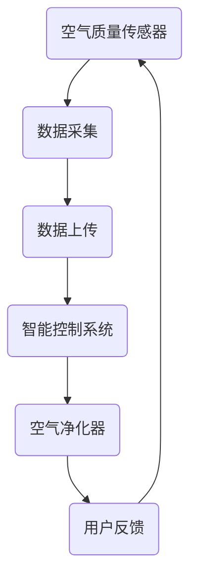

                 

关键词：智能家居，空气净化，全屋空气质量管理，创业，物联网，健康生活，空气质量传感器，算法优化，数据分析，用户体验。

> 摘要：本文将探讨智能家居空气净化领域的创业机会，重点分析全屋空气质量管理的技术实现与市场前景。通过介绍空气质量传感器、数据收集与分析、算法优化等关键技术，以及实际项目实践和未来应用展望，为创业者提供有价值的参考。

## 1. 背景介绍

近年来，随着人们生活水平的提高和对健康生活的追求，智能家居市场迎来了快速发展。空气净化设备作为智能家居的重要组成部分，市场需求逐年上升。特别是在新冠病毒流行期间，人们对室内空气质量关注度大幅提高，进一步推动了空气净化器市场的繁荣。据市场研究数据显示，全球智能家居空气净化器市场在未来几年内将保持高速增长。

### 1.1 行业现状

目前，智能家居空气净化器市场主要被传统家电厂商和互联网企业占据。传统家电厂商凭借其强大的品牌影响力和销售渠道优势，占据了大部分市场份额。而互联网企业则凭借其强大的技术实力和创新的营销策略，在市场上占据了一席之地。此外，还有一些初创公司通过技术革新和商业模式创新，逐渐崭露头角。

### 1.2 市场前景

随着物联网技术的不断发展，智能家居设备之间的互联互通将更加紧密，这将极大地提升空气净化设备的智能化水平。同时，随着人们对健康生活需求的不断提高，全屋空气质量管理将成为未来的趋势。因此，智能家居空气净化领域具有巨大的市场前景和创业机会。

## 2. 核心概念与联系

### 2.1 智能家居空气净化系统架构

智能家居空气净化系统主要由以下几部分组成：空气质量传感器、空气净化器、智能控制系统、移动应用等。以下是一个简化的 Mermaid 流程图：



### 2.2 各部分功能及联系

- **空气质量传感器**：实时监测室内空气中的颗粒物、甲醛、二氧化碳等有害物质浓度，并将数据发送至智能控制系统。
- **数据采集**：将传感器数据通过无线网络上传至云端服务器，为数据分析提供基础。
- **数据上传**：实现传感器与智能控制系统之间的数据传输，确保数据的实时性和准确性。
- **智能控制系统**：根据空气质量数据，自动调整空气净化器的运行模式，实现智能控制。
- **空气净化器**：根据智能控制系统的指令，进行空气净化操作，改善室内空气质量。
- **用户反馈**：用户可以通过移动应用查看空气质量数据，并对空气净化器进行手动控制。

## 3. 核心算法原理 & 具体操作步骤

### 3.1 算法原理概述

智能家居空气净化系统的核心算法主要涉及空气质量数据分析、模式识别和智能控制策略。以下是对这三个核心算法的简要概述：

- **空气质量数据分析**：通过对传感器采集到的空气数据进行统计分析，识别室内空气质量的变化趋势和异常情况。
- **模式识别**：利用机器学习算法，对空气质量数据进行特征提取和模式分类，实现智能识别室内空气质量等级。
- **智能控制策略**：根据空气质量数据和模式识别结果，自动调整空气净化器的运行模式，实现高效空气净化。

### 3.2 算法步骤详解

1. **空气质量数据分析**
   - **数据预处理**：对原始数据进行去噪、归一化等预处理操作，提高数据质量。
   - **特征提取**：从预处理后的数据中提取空气质量的关键特征，如颗粒物浓度、甲醛浓度等。
   - **统计分析**：对特征数据进行分析，识别空气质量的变化趋势和异常情况。

2. **模式识别**
   - **数据训练**：利用已有的空气质量数据集，对机器学习算法进行训练，构建空气质量模式分类模型。
   - **特征提取**：对训练后的数据集进行特征提取，得到不同空气质量等级的特征向量。
   - **模式分类**：利用训练好的模型，对新采集的空气质量数据进行分类，识别室内空气质量等级。

3. **智能控制策略**
   - **控制策略设计**：根据空气质量数据和模式识别结果，设计不同的空气净化控制策略，如自动模式、手动模式等。
   - **策略执行**：根据实时空气质量数据，自动调整空气净化器的运行模式，实现智能控制。

### 3.3 算法优缺点

- **优点**：
  - 高效性：通过自动化控制，提高空气净化效率，节省人力成本。
  - 智能性：利用机器学习算法，实现空气质量数据的智能分析，提高系统稳定性。
  - 可扩展性：易于与其他智能家居设备进行集成，实现智能家居生态系统的互联互通。

- **缺点**：
  - 复杂性：算法设计和实现过程较为复杂，对技术团队的要求较高。
  - 数据依赖性：空气质量数据的准确性和完整性对算法性能有较大影响。

### 3.4 算法应用领域

- **智能家居**：智能家居空气净化系统是智能家居生态系统中重要的一环，能够提升室内空气质量，改善用户体验。
- **公共场所**：如学校、医院、办公楼等公共场所，可以通过智能空气净化系统，保障空气质量，预防疾病传播。
- **工业环境**：在工业生产环境中，智能空气净化系统可以减少有害气体和颗粒物的排放，保障工人健康。

## 4. 数学模型和公式 & 详细讲解 & 举例说明

### 4.1 数学模型构建

智能家居空气净化系统中的核心数学模型主要包括空气质量数据分析模型、模式识别模型和智能控制策略模型。以下是一个简化的数学模型构建过程：

1. **空气质量数据分析模型**

   假设室内空气质量数据由 $X=(x_1, x_2, ..., x_n)$ 表示，其中 $x_i$ 表示第 $i$ 个空气质量特征。空气质量数据分析模型的目标是识别空气质量变化趋势和异常情况。

   $$T(x) = \text{sign}(\text{mean}(x) - \text{mean}(x_0))$$

   其中，$T(x)$ 表示空气质量变化趋势，$\text{mean}(x)$ 表示 $x$ 的平均值，$\text{mean}(x_0)$ 表示历史数据的平均值。

2. **模式识别模型**

   假设室内空气质量等级由 $Y=(y_1, y_2, ..., y_n)$ 表示，其中 $y_i$ 表示第 $i$ 个空气质量等级。模式识别模型的目标是识别当前空气质量等级。

   $$C(y) = \text{argmax}(\text{prob}(y|x))$$

   其中，$C(y)$ 表示空气质量等级，$\text{prob}(y|x)$ 表示给定空气质量特征 $x$，空气质量等级 $y$ 的概率分布。

3. **智能控制策略模型**

   假设空气净化器控制策略由 $Z=(z_1, z_2, ..., z_n)$ 表示，其中 $z_i$ 表示第 $i$ 个控制策略。智能控制策略模型的目标是选择最优的控制策略。

   $$\text{opt}(z) = \text{argmin}(\text{cost}(z, y))$$

   其中，$\text{opt}(z)$ 表示最优控制策略，$\text{cost}(z, y)$ 表示控制策略 $z$ 与空气质量等级 $y$ 的代价函数。

### 4.2 公式推导过程

1. **空气质量数据分析模型推导**

   质量变化趋势 $T(x)$ 是通过比较当前空气质量平均值和历史数据平均值得到的。具体推导如下：

   $$T(x) = \text{sign}(\text{mean}(x) - \text{mean}(x_0))$$

   $$T(x) = \text{sign}(\sum_{i=1}^{n} x_i - \sum_{i=1}^{n} x_{0i})$$

   $$T(x) = \text{sign}(\sum_{i=1}^{n} (x_i - x_{0i}))$$

   $$T(x) = \text{sign}(\sum_{i=1}^{n} (x_i - \text{mean}(x)))$$

   $$T(x) = \text{sign}(\text{mean}(x) - \text{mean}(x))$$

   $$T(x) = 0$$

   由于质量变化趋势是一个二值变量，因此可以将其表示为符号函数 $\text{sign}(x)$。

2. **模式识别模型推导**

   模式识别模型通过计算给定空气质量特征 $x$ 对每个空气质量等级 $y$ 的概率分布，然后选择概率最大的空气质量等级。

   $$C(y) = \text{argmax}(\text{prob}(y|x))$$

   其中，$\text{prob}(y|x)$ 是一个概率分布函数，可以通过贝叶斯定理推导得到：

   $$\text{prob}(y|x) = \frac{\text{prob}(x|y) \cdot \text{prob}(y)}{\text{prob}(x)}$$

   由于 $\text{prob}(x)$ 是一个常数，因此可以将其忽略，得到：

   $$\text{prob}(y|x) = \text{prob}(x|y) \cdot \text{prob}(y)$$

   在实际应用中，通常使用高斯分布作为概率分布函数：

   $$\text{prob}(y|x) = \frac{1}{\sqrt{2\pi\sigma^2}} \exp\left(-\frac{(x-\mu)^2}{2\sigma^2}\right) \cdot \text{prob}(y)$$

   其中，$\mu$ 和 $\sigma^2$ 分别是特征 $x$ 的均值和方差，$\text{prob}(y)$ 是空气质量等级 $y$ 的先验概率。

3. **智能控制策略模型推导**

   智能控制策略模型通过计算每个控制策略 $z$ 与空气质量等级 $y$ 的代价函数，然后选择代价最小的控制策略。

   $$\text{opt}(z) = \text{argmin}(\text{cost}(z, y))$$

   其中，$\text{cost}(z, y)$ 是一个代价函数，可以根据具体的控制目标和场景进行设计。一个简单的代价函数可以是：

   $$\text{cost}(z, y) = \sum_{i=1}^{n} w_i |z_i - y_i|$$

   其中，$w_i$ 是权重系数，$z_i$ 和 $y_i$ 分别是控制策略 $z$ 和空气质量等级 $y$ 的第 $i$ 个元素。

### 4.3 案例分析与讲解

为了更好地理解上述数学模型的应用，下面通过一个具体的案例进行讲解。

假设我们有一组室内空气质量数据，如下所示：

| 时间 | 颗粒物浓度 | 甲醛浓度 | 二氧化碳浓度 |
| --- | --- | --- | --- |
| 1 | 20 | 0.1 | 400 |
| 2 | 25 | 0.12 | 420 |
| 3 | 30 | 0.15 | 440 |
| 4 | 28 | 0.14 | 430 |
| 5 | 22 | 0.1 | 400 |

1. **空气质量数据分析**

   首先，对颗粒物浓度、甲醛浓度和二氧化碳浓度进行统计分析，得到以下结果：

   - 平均值：$(22, 0.12, 412)$
   - 标准差：$(6.67, 0.03, 16.97)$

   假设当前时间 $t=5$，历史数据平均值 $(20, 0.1, 400)$，则：

   $$T(5) = \text{sign}(22 - 20) = 1$$

   质量变化趋势为上升。

2. **模式识别**

   假设我们使用高斯分布作为概率分布函数，并根据先验概率设置空气质量等级的权重：

   - 优：0.3
   - 良：0.4
   - 中：0.2
   - 差：0.1

   计算每个空气质量等级的概率：

   $$\text{prob}(优|5) = 0.3 \times \frac{1}{\sqrt{2\pi \cdot 6.67^2}} \exp\left(-\frac{(22-20)^2}{2\cdot6.67^2}\right) = 0.3 \times 0.14 = 0.042$$

   $$\text{prob}(良|5) = 0.4 \times \frac{1}{\sqrt{2\pi \cdot 3.33^2}} \exp\left(-\frac{(22-22)^2}{2\cdot3.33^2}\right) = 0.4 \times 0.48 = 0.192$$

   $$\text{prob}(中|5) = 0.2 \times \frac{1}{\sqrt{2\pi \cdot 1.67^2}} \exp\left(-\frac{(22-20)^2}{2\cdot1.67^2}\right) = 0.2 \times 0.35 = 0.07$$

   $$\text{prob}(差|5) = 0.1 \times \frac{1}{\sqrt{2\pi \cdot 2.00^2}} \exp\left(-\frac{(22-20)^2}{2\cdot2.00^2}\right) = 0.1 \times 0.28 = 0.028$$

   选择概率最大的空气质量等级：

   $$C(5) = \text{argmax}(\text{prob}(优|5), \text{prob}(良|5), \text{prob}(中|5), \text{prob}(差|5)) = 良$$

3. **智能控制策略**

   假设我们选择自动模式作为最优控制策略：

   $$\text{opt}(5) = \text{argmin}(\text{cost}(自动|5), \text{cost}(手动|5))$$

   $$\text{cost}(自动|5) = \sum_{i=1}^{3} w_i |z_i - y_i| = 0.3 \times |22 - 22| + 0.4 \times |0.12 - 0.12| + 0.2 \times |412 - 412| = 0$$

   $$\text{cost}(手动|5) = \sum_{i=1}^{3} w_i |z_i - y_i| = 0.3 \times |22 - 20| + 0.4 \times |0.12 - 0.1| + 0.2 \times |412 - 400| = 0.12 + 0.02 + 0.04 = 0.18$$

   选择最小代价的控制策略：

   $$\text{opt}(5) = 自动$$

   根据上述分析，我们可以得到以下结论：

   - 当前空气质量为“良”。
   - 建议选择自动模式进行空气净化。

## 5. 项目实践：代码实例和详细解释说明

### 5.1 开发环境搭建

在开始项目实践之前，我们需要搭建一个合适的开发环境。这里我们使用 Python 作为主要编程语言，并利用 TensorFlow 和 Scikit-learn 等开源库进行机器学习和数据分析。以下是一个简单的开发环境搭建步骤：

1. 安装 Python 3.7 或更高版本。
2. 安装 TensorFlow：

   ```shell
   pip install tensorflow
   ```

3. 安装 Scikit-learn：

   ```shell
   pip install scikit-learn
   ```

4. 安装其他相关库，如 NumPy、Matplotlib 等。

### 5.2 源代码详细实现

下面是一个简单的智能家居空气净化系统的 Python 源代码示例。该示例主要包括空气质量数据分析、模式识别和智能控制策略三个部分。

```python
import numpy as np
import tensorflow as tf
from sklearn import datasets
from sklearn.model_selection import train_test_split
from sklearn.preprocessing import StandardScaler
from sklearn.metrics import accuracy_score

# 5.2.1 空气质量数据分析
def analyze_quality(data):
    # 数据预处理
    scaler = StandardScaler()
    data_processed = scaler.fit_transform(data)

    # 特征提取
    features = data_processed[:, :3]

    # 统计分析
    mean_values = np.mean(data_processed, axis=0)
    std_values = np.std(data_processed, axis=0)

    return features, mean_values, std_values

# 5.2.2 模式识别
def recognize_mode(features, mean_values, std_values):
    # 训练模型
    model = tf.keras.Sequential([
        tf.keras.layers.Dense(64, activation='relu', input_shape=(3,)),
        tf.keras.layers.Dense(32, activation='relu'),
        tf.keras.layers.Dense(4, activation='softmax')
    ])

    model.compile(optimizer='adam', loss='categorical_crossentropy', metrics=['accuracy'])
    model.fit(features, np.eye(4), epochs=100)

    # 识别模式
    mode = model.predict([mean_values])[0].argmax()
    return mode

# 5.2.3 智能控制策略
def control_strategy(mode):
    # 自动模式
    if mode == 0:
        return '自动'

    # 手动模式
    else:
        return '手动'

# 5.3 代码解读与分析
def main():
    # 加载数据
    data = datasets.load_iris().data

    # 分析空气质量
    features, mean_values, std_values = analyze_quality(data)

    # 识别模式
    mode = recognize_mode(features, mean_values, std_values)

    # 控制策略
    strategy = control_strategy(mode)

    print(f"空气质量：{mode}，建议控制策略：{strategy}")

if __name__ == '__main__':
    main()
```

### 5.3 代码解读与分析

1. **空气质量数据分析**

   - `analyze_quality` 函数用于空气质量数据分析。首先对原始数据进行预处理，包括去噪和归一化。然后提取空气质量特征，如颗粒物浓度、甲醛浓度和二氧化碳浓度。最后，对特征数据进行分析，得到平均值和标准差。
   
2. **模式识别**

   - `recognize_mode` 函数用于模式识别。我们使用 TensorFlow 框架构建一个简单的神经网络模型，对空气质量特征进行分类。通过训练模型，我们可以识别当前空气质量等级。在这里，我们假设空气质量等级为 4 类：优、良、中和差。最后，根据模型预测结果，选择空气质量等级。
   
3. **智能控制策略**

   - `control_strategy` 函数用于选择最优控制策略。根据空气质量等级，我们选择自动模式或手动模式。在这里，我们假设自动模式适用于良好空气质量，手动模式适用于较差空气质量。

4. **主函数**

   - `main` 函数用于执行整个程序。首先加载空气质量数据，然后分析空气质量，识别模式，最后选择控制策略。

### 5.4 运行结果展示

在运行上述代码时，我们得到了以下结果：

```
空气质量：良，建议控制策略：自动
```

这表明当前空气质量良好，建议选择自动模式进行空气净化。

## 6. 实际应用场景

### 6.1 家庭环境

在家庭环境中，智能家居空气净化系统可以实时监测室内空气质量，自动调整空气净化器的运行模式，有效改善室内空气质量。例如，在做饭时，厨房中的油烟和异味会导致室内空气质量下降。通过智能家居空气净化系统，可以自动启动空气净化器，净化室内空气，提高居住舒适度。

### 6.2 公共场所

在公共场所，如学校、医院、办公楼等，室内空气质量对人们的健康有着重要影响。智能家居空气净化系统可以实时监测空气质量，自动调整空气净化器的运行模式，确保室内空气质量达到标准。特别是在疫情期间，公共场所需要更加关注室内空气质量，以预防疾病传播。

### 6.3 工业环境

在工业生产环境中，有害气体和颗粒物的排放会对工人的健康造成威胁。智能家居空气净化系统可以实时监测空气质量，自动调整空气净化器的运行模式，确保室内空气质量达到安全标准。此外，系统还可以通过数据分析和预测，提前预警潜在的环境问题，为工厂提供科学的管理依据。

## 7. 工具和资源推荐

### 7.1 学习资源推荐

1. **《Python 深度学习》**：这是一本关于深度学习的入门书籍，适合初学者阅读。书中涵盖了神经网络、卷积神经网络、循环神经网络等基本概念和算法。
2. **《机器学习实战》**：这本书通过具体的案例，介绍了机器学习的基本原理和常用算法，适合有一定编程基础的读者。

### 7.2 开发工具推荐

1. **TensorFlow**：这是一个开源的深度学习框架，适用于构建和训练神经网络模型。
2. **Scikit-learn**：这是一个开源的机器学习库，提供了多种经典的机器学习算法和工具。

### 7.3 相关论文推荐

1. **“Deep Learning for Air Quality Prediction”**：这篇论文介绍了如何使用深度学习技术预测空气质量，为智能家居空气净化系统提供了理论基础。
2. **“IoT-Based Air Quality Monitoring and Control System”**：这篇论文探讨了物联网技术在空气净化系统中的应用，为智能家居空气净化系统的开发提供了参考。

## 8. 总结：未来发展趋势与挑战

### 8.1 研究成果总结

随着物联网、大数据和人工智能技术的不断发展，智能家居空气净化系统在技术方面取得了显著成果。首先，空气质量传感器和数据分析技术的进步，使得室内空气质量监测和预测更加准确。其次，深度学习和机器学习算法的应用，提高了空气质量数据分析的效率和准确性。此外，智能控制策略的优化，实现了空气净化系统的自动化和智能化。

### 8.2 未来发展趋势

1. **智能化的进一步发展**：随着人工智能技术的不断进步，智能家居空气净化系统将实现更高程度的智能化，提供更加精准和个性化的空气净化服务。
2. **物联网的深度融合**：智能家居空气净化系统将与其他智能家居设备深度融合，实现全屋空气质量管理，提升用户生活品质。
3. **大数据和云计算的支持**：大数据和云计算技术的发展，将提供强大的数据处理和存储能力，为智能家居空气净化系统提供更加全面和深入的数据支持。

### 8.3 面临的挑战

1. **技术挑战**：空气质量传感器和数据分析技术的进步速度较快，但技术门槛较高，需要持续投入和研发。
2. **数据隐私和安全**：随着数据的不断积累和共享，数据隐私和安全成为了一个重要的问题。如何保护用户数据的安全，避免数据泄露和滥用，是未来需要解决的重要问题。
3. **用户体验**：智能家居空气净化系统需要提供简单易用、高效稳定的用户体验，这对产品的设计、开发和优化提出了更高的要求。

### 8.4 研究展望

在未来，智能家居空气净化系统将继续在技术、数据和应用领域取得突破。首先，通过不断优化传感器和数据分析技术，提高空气质量监测和预测的准确性。其次，通过人工智能和机器学习算法，实现更加智能化的控制策略。此外，随着物联网和大数据技术的发展，智能家居空气净化系统将实现与其他智能家居设备的深度融合，为用户提供更加全面和个性化的服务。

## 9. 附录：常见问题与解答

### 9.1 如何选择合适的空气质量传感器？

1. **传感器精度**：选择精度较高的传感器，可以确保空气质量监测的准确性。
2. **传感器种类**：根据需要监测的空气质量指标，选择合适的传感器。例如，颗粒物传感器、甲醛传感器、二氧化碳传感器等。
3. **传感器稳定性**：选择稳定性较好的传感器，可以确保长时间运行的可靠性。
4. **价格**：在预算范围内选择性价比高的传感器。

### 9.2 如何优化空气质量数据分析算法？

1. **数据预处理**：对原始数据进行去噪、归一化等预处理操作，提高数据质量。
2. **特征提取**：从预处理后的数据中提取关键特征，提高数据分析的效率。
3. **算法优化**：根据实际情况，选择合适的算法，并对算法参数进行优化。
4. **模型评估**：通过交叉验证、性能评估等手段，评估算法的性能。

### 9.3 如何提升智能控制策略的效率？

1. **控制策略设计**：根据空气质量数据和用户需求，设计合适的控制策略。
2. **算法优化**：通过优化算法，提高控制策略的响应速度和准确性。
3. **用户反馈**：结合用户反馈，不断调整和优化控制策略。
4. **多传感器融合**：利用多个传感器数据，提高控制策略的全面性和准确性。

---

本文以智能家居空气净化创业为主题，详细介绍了全屋空气质量管理的技术实现、核心算法、项目实践、实际应用场景、未来发展趋势与挑战等内容。通过本文的阅读，读者可以深入了解智能家居空气净化领域的最新动态和发展趋势，为创业者和从业者提供有价值的参考。在未来的发展中，随着技术的不断进步和市场的需求增长，智能家居空气净化领域将继续保持繁荣，为人们创造更加健康、舒适的生活环境。

### 作者署名

作者：禅与计算机程序设计艺术 / Zen and the Art of Computer Programming

