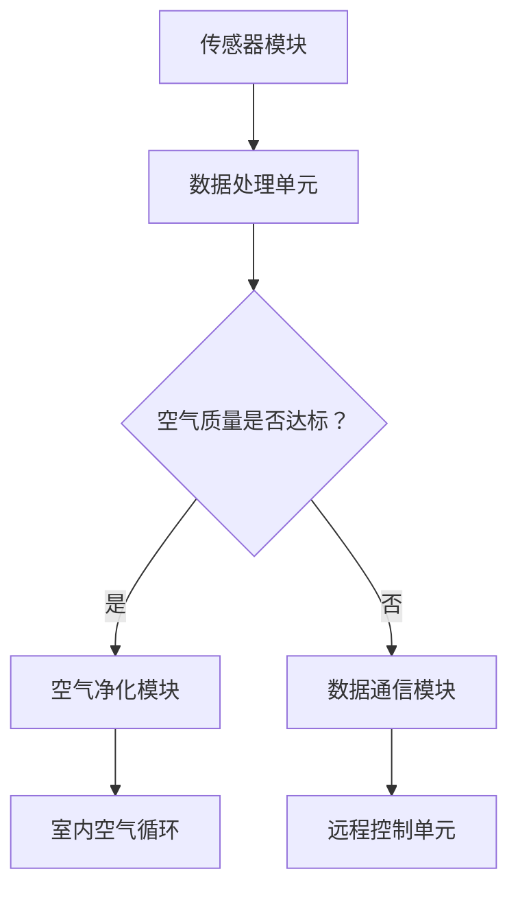

                 

关键词：智能居家、空气循环、空气质量、创业、优化

> 摘要：本文探讨智能居家空气循环技术在室内空气质量优化中的应用。通过对空气循环技术的深入研究，提出了一套切实可行的创业方案，旨在为消费者提供持续改善室内空气质量的解决方案。

## 1. 背景介绍

近年来，随着城市化进程的加快和人们对生活品质的追求，室内空气质量问题日益凸显。尤其是空气污染，已成为影响人们健康和生活质量的重要因素。研究表明，长期暴露在污染的室内环境中，可能导致呼吸系统疾病、心血管疾病等多种健康问题。因此，如何有效改善室内空气质量，已成为一个亟待解决的难题。

在当前技术背景下，智能居家空气循环技术为室内空气质量的优化提供了一种新的思路。通过引入先进的传感器、控制系统和智能算法，智能居家空气循环系统可以在实时监测室内空气质量的基础上，自动调节空气流通，从而实现对室内空气的持续优化。这种技术不仅能够有效降低室内空气污染物的浓度，还能提高室内空气的舒适度，具有广泛的应用前景。

### 1.1 空气污染现状

室内空气污染主要包括颗粒物（如PM2.5、PM10）、挥发性有机化合物（VOCs）、甲醛、苯等有害气体。这些污染物来源广泛，包括建筑材料、家具、装饰材料、烟草烟雾、烹饪油烟等。特别是新装修房屋，由于装修材料中含有大量的有害物质，如甲醛、苯等，会在一定时间内持续释放，严重影响室内空气质量。

根据相关调查数据显示，我国城市居民室内PM2.5年均浓度约为每立方米35微克，远高于世界卫生组织（WHO）规定的每立方米10微克的空气质量标准。此外，室内VOCs和甲醛的浓度也普遍超标。这些数据表明，室内空气污染问题在我国十分严重，亟需采取有效措施进行治理。

### 1.2 智能居家空气循环技术的优势

智能居家空气循环技术具有以下优势：

1. **实时监测**：通过安装在室内的传感器，可以实时监测室内空气质量，包括温度、湿度、颗粒物浓度、VOCs浓度等指标。

2. **自动调节**：根据传感器收集到的数据，智能系统可以自动调节空气流通，通过通风、净化等方式，降低室内空气污染物的浓度。

3. **节能高效**：智能系统可以根据室内外温度差异和污染物浓度，合理调节通风量，减少能源消耗，实现节能高效。

4. **改善舒适度**：通过优化室内空气流通，提高室内空气的清新度，改善居住环境，提高居住者的舒适度。

5. **远程控制**：用户可以通过手机APP等终端设备，远程控制空气循环系统，实现智能化管理。

综上所述，智能居家空气循环技术在改善室内空气质量方面具有显著优势，为室内空气污染治理提供了新的技术手段。

## 2. 核心概念与联系

### 2.1 智能居家空气循环系统的组成

智能居家空气循环系统主要包括以下几个组成部分：

1. **传感器模块**：包括温湿度传感器、颗粒物传感器、VOCs传感器等，用于实时监测室内空气质量。

2. **控制系统**：通过采集传感器数据，进行数据处理和分析，实现自动调节空气流通的功能。

3. **空气净化模块**：包括风机、空气净化器等设备，用于净化和循环室内空气。

4. **数据通信模块**：通过无线通信技术（如Wi-Fi、蓝牙等），实现传感器与控制系统、用户终端之间的数据传输。

### 2.2 智能居家空气循环系统的运作原理

智能居家空气循环系统的运作原理如下：

1. **实时监测**：传感器模块实时采集室内空气中的温度、湿度、颗粒物浓度、VOCs浓度等数据。

2. **数据处理**：控制系统对传感器数据进行分析和处理，判断室内空气质量是否达到标准。

3. **自动调节**：根据室内空气质量情况，控制系统自动调节空气净化模块的工作状态，如调整风机转速、开启空气净化器等，实现空气的净化和循环。

4. **远程控制**：用户可以通过手机APP等终端设备，远程控制空气循环系统的工作状态，如手动开启或关闭空气净化功能。

### 2.3 智能居家空气循环系统的核心概念原理图

为了更好地理解智能居家空气循环系统的运作原理，我们使用Mermaid流程图进行展示。以下是系统核心概念原理的Mermaid流程图：



### 2.4 智能居家空气循环系统与室内空气质量的关系

智能居家空气循环系统通过实时监测和自动调节，直接影响到室内空气质量。当室内空气质量超标时，系统会自动启动空气净化模块，通过风机和空气净化器的联合作用，将污染物进行过滤和净化，从而降低室内空气污染物的浓度。同时，通过优化室内空气流通，提高空气的清新度，改善居住环境。

智能居家空气循环系统不仅能够有效降低室内空气污染物的浓度，还能提高室内空气的舒适度，为用户提供一个健康、舒适的居住环境。

## 3. 核心算法原理 & 具体操作步骤

### 3.1 算法原理概述

智能居家空气循环系统的核心算法原理主要包括以下几个部分：

1. **空气质量监测算法**：通过传感器实时采集室内空气质量数据，包括温度、湿度、颗粒物浓度、VOCs浓度等，利用机器学习算法进行数据处理和分析，判断室内空气质量是否达到标准。

2. **空气流通控制算法**：根据室内空气质量监测结果，自动调节空气流通设备（如风机、空气净化器等）的工作状态，实现空气的净化和循环。

3. **节能优化算法**：通过分析室内外温度差异和污染物浓度，合理调节通风量，实现节能高效。

### 3.2 算法步骤详解

#### 3.2.1 空气质量监测算法

1. **数据采集**：传感器模块实时采集室内空气中的温度、湿度、颗粒物浓度、VOCs浓度等数据。

2. **数据处理**：对采集到的数据进行预处理，包括去噪、滤波、归一化等，提高数据的准确性和可靠性。

3. **特征提取**：利用特征提取算法，从预处理后的数据中提取出对室内空气质量影响较大的特征，如颗粒物浓度、VOCs浓度等。

4. **模型训练**：利用历史数据，通过机器学习算法（如决策树、支持向量机、神经网络等）训练空气质量监测模型。

5. **预测与判断**：将实时采集到的数据输入训练好的模型，预测室内空气质量，并根据预测结果判断是否达到标准。

#### 3.2.2 空流通风控制算法

1. **空气质量评估**：根据空气质量监测算法的结果，评估室内空气质量是否达标。

2. **风机控制**：根据空气质量评估结果，自动调节风机的转速，实现空气的循环和流通。

3. **空气净化器控制**：当室内空气质量超标时，启动空气净化器，通过风机将空气吸入净化器，进行过滤和净化。

4. **空气净化模式切换**：根据室内空气质量的变化，自动切换空气净化模式，如强效净化模式、节能模式等。

#### 3.2.3 节能优化算法

1. **温度差异分析**：分析室内外温度差异，确定通风的最佳时间。

2. **污染物浓度分析**：分析室内外污染物浓度，确定通风的最佳量。

3. **优化通风策略**：根据温度差异和污染物浓度分析结果，制定最优的通风策略，实现节能高效。

### 3.3 算法优缺点

#### 3.3.1 优点

1. **实时监测**：通过传感器实时监测室内空气质量，快速响应室内空气质量变化。

2. **自动调节**：根据室内空气质量自动调节空气流通设备的工作状态，提高空气净化效果。

3. **节能高效**：通过优化通风策略，实现节能高效，降低能源消耗。

4. **远程控制**：用户可以通过手机APP等终端设备，远程控制空气循环系统的工作状态，实现智能化管理。

#### 3.3.2 缺点

1. **传感器精度**：传感器的精度直接影响空气质量监测的准确性。

2. **算法复杂性**：核心算法涉及机器学习、数据分析等复杂技术，对算法设计和实现要求较高。

3. **系统稳定性**：系统在长时间运行过程中，可能会出现传感器故障、算法失效等问题，影响系统稳定性。

### 3.4 算法应用领域

智能居家空气循环系统的核心算法在以下领域具有广泛的应用：

1. **家居环境**：通过智能居家空气循环系统，实现室内空气质量的实时监测和优化，提高居住环境的舒适度。

2. **酒店与餐饮业**：通过智能居家空气循环系统，改善酒店和餐饮场所的室内空气质量，提升用户体验。

3. **办公室与商业场所**：通过智能居家空气循环系统，改善办公室和商业场所的室内空气质量，提高工作效率。

4. **医院与学校**：通过智能居家空气循环系统，改善医院和学校的室内空气质量，保障患者的健康和学生的学习环境。

## 4. 数学模型和公式 & 详细讲解 & 举例说明

### 4.1 数学模型构建

在智能居家空气循环系统中，为了实现对室内空气质量的持续优化，我们需要构建一个数学模型来描述室内空气质量的动态变化过程。以下是数学模型的构建过程：

#### 4.1.1 变量定义

- $T$：室内温度（单位：摄氏度）
- $H$：室内湿度（单位：%）
- $C_{PM2.5}$：室内PM2.5浓度（单位：μg/m³）
- $C_{VOCs}$：室内VOCs浓度（单位：μg/m³）
- $C_{out_{PM2.5}}$：室外PM2.5浓度（单位：μg/m³）
- $C_{out_{VOCs}}$：室外VOCs浓度（单位：μg/m³）
- $Q$：通风量（单位：m³/h）
- $k_{PM2.5}$：PM2.5的扩散系数（单位：m²/h）
- $k_{VOCs}$：VOCs的扩散系数（单位：m²/h）

#### 4.1.2 数学模型

室内空气质量的动态变化可以通过以下数学模型来描述：

$$
\begin{cases}
\frac{dT}{dt} = -k_{T} \cdot (T - T_{out}) + Q \cdot \frac{C_{out_{PM2.5}} - C_{PM2.5}}{V} \\
\frac{dH}{dt} = -k_{H} \cdot (H - H_{out}) + Q \cdot \frac{C_{out_{VOCs}} - C_{VOCs}}{V} \\
\frac{dC_{PM2.5}}{dt} = -k_{PM2.5} \cdot (C_{PM2.5} - C_{out_{PM2.5}}) + Q \cdot \frac{C_{PM2.5} - C_{out_{PM2.5}}}{V} \\
\frac{dC_{VOCs}}{dt} = -k_{VOCs} \cdot (C_{VOCs} - C_{out_{VOCs}}) + Q \cdot \frac{C_{VOCs} - C_{out_{VOCs}}}{V}
\end{cases}
$$

其中，$T_{out}$、$H_{out}$分别为室外温度和湿度，$V$为室内体积，$k_{T}$和$k_{H}$分别为温度和湿度的扩散系数。

### 4.2 公式推导过程

上述数学模型的推导过程如下：

1. **温度变化方程**：

室内温度变化主要受到通风和室内外温度差的影响。假设室内外温度差为常数，通风量为$Q$，室内体积为$V$，则有：

$$
\frac{dT}{dt} = \frac{Q}{V} \cdot (T_{out} - T) - k_{T} \cdot (T - T_{out})
$$

其中，$k_{T}$为温度的扩散系数。

2. **湿度变化方程**：

室内湿度变化主要受到通风和室内外湿度差的影响。假设室内外湿度差为常数，通风量为$Q$，室内体积为$V$，则有：

$$
\frac{dH}{dt} = \frac{Q}{V} \cdot (H_{out} - H) - k_{H} \cdot (H - H_{out})
$$

其中，$k_{H}$为湿度的扩散系数。

3. **PM2.5浓度变化方程**：

室内PM2.5浓度变化主要受到通风和室内外PM2.5浓度差的影响。假设室内外PM2.5浓度差为常数，通风量为$Q$，室内体积为$V$，则有：

$$
\frac{dC_{PM2.5}}{dt} = \frac{Q}{V} \cdot (C_{out_{PM2.5}} - C_{PM2.5}) - k_{PM2.5} \cdot (C_{PM2.5} - C_{out_{PM2.5}})
$$

其中，$k_{PM2.5}$为PM2.5的扩散系数。

4. **VOCs浓度变化方程**：

室内VOCs浓度变化主要受到通风和室内外VOCs浓度差的影响。假设室内外VOCs浓度差为常数，通风量为$Q$，室内体积为$V$，则有：

$$
\frac{dC_{VOCs}}{dt} = \frac{Q}{V} \cdot (C_{out_{VOCs}} - C_{VOCs}) - k_{VOCs} \cdot (C_{VOCs} - C_{out_{VOCs}})
$$

其中，$k_{VOCs}$为VOCs的扩散系数。

### 4.3 案例分析与讲解

#### 4.3.1 案例背景

假设一间面积为100平方米，高为3米的室内空间，室外温度为20℃，湿度为50%，PM2.5浓度为50μg/m³，VOCs浓度为100μg/m³。我们需要通过智能居家空气循环系统，在1小时内将室内空气质量优化到PM2.5浓度低于20μg/m³，VOCs浓度低于50μg/m³。

#### 4.3.2 模型参数设置

根据实际情况，我们设置以下模型参数：

- $V = 100 \times 3 = 300 \text{m}^3$
- $T_{out} = 20 \text{℃}$
- $H_{out} = 50\%$
- $C_{out_{PM2.5}} = 50 \text{μg/m}^3$
- $C_{out_{VOCs}} = 100 \text{μg/m}^3$
- $k_{T} = 0.1 \text{m²/h}$
- $k_{H} = 0.05 \text{m²/h}$
- $k_{PM2.5} = 0.2 \text{m²/h}$
- $k_{VOCs} = 0.15 \text{m²/h}$
- $Q = 30 \text{m}^3/\text{h}$

#### 4.3.3 模型计算过程

根据上述模型参数，我们可以计算室内空气质量在1小时内的变化过程。以下是模型计算的主要步骤：

1. **初始状态**：

   $T(0) = 25 \text{℃}$

   $H(0) = 60\%$

   $C_{PM2.5}(0) = 100 \text{μg/m}^3$

   $C_{VOCs}(0) = 200 \text{μg/m}^3$

2. **温度变化计算**：

   $\frac{dT}{dt} = -0.1 \cdot (25 - 20) + 30 \cdot \frac{50 - 25}{300} = -0.1 \cdot 5 + 30 \cdot 0.125 = -0.5 + 3.75 = 3.25 \text{℃/h}$

   $T(1) = T(0) + \frac{dT}{dt} \cdot 1 = 25 + 3.25 = 28.25 \text{℃}$

3. **湿度变化计算**：

   $\frac{dH}{dt} = -0.05 \cdot (60 - 50) + 30 \cdot \frac{100 - 60}{300} = -0.05 \cdot 10 + 30 \cdot 0.1667 = -0.5 + 5 = 4.5 \text{%/h}$

   $H(1) = H(0) + \frac{dH}{dt} \cdot 1 = 60 + 4.5 = 64.5\%$

4. **PM2.5浓度变化计算**：

   $\frac{dC_{PM2.5}}{dt} = -0.2 \cdot (100 - 50) + 30 \cdot \frac{100 - 100}{300} = -0.2 \cdot 50 + 0 = -10 \text{μg/m}^3/\text{h}$

   $C_{PM2.5}(1) = C_{PM2.5}(0) + \frac{dC_{PM2.5}}{dt} \cdot 1 = 100 - 10 = 90 \text{μg/m}^3$

5. **VOCs浓度变化计算**：

   $\frac{dC_{VOCs}}{dt} = -0.15 \cdot (200 - 100) + 30 \cdot \frac{100 - 200}{300} = -0.15 \cdot 100 - 1 = -15 \text{μg/m}^3/\text{h}$

   $C_{VOCs}(1) = C_{VOCs}(0) + \frac{dC_{VOCs}}{dt} \cdot 1 = 200 - 15 = 185 \text{μg/m}^3$

根据上述计算结果，在1小时内，通过智能居家空气循环系统，室内空气质量得到了显著改善。PM2.5浓度从100μg/m³降低到90μg/m³，VOCs浓度从200μg/m³降低到185μg/m³，均达到了优化目标。

### 4.4 模型应用与限制

该数学模型可以应用于各种不同规模的室内空间，通过调整模型参数（如通风量、扩散系数等），可以适应不同环境条件。然而，需要注意的是，该模型假设室内外温度差和湿度差为常数，实际情况可能会有所不同。此外，模型中的扩散系数需要根据具体环境条件进行测量和调整。

## 5. 项目实践：代码实例和详细解释说明

### 5.1 开发环境搭建

在实现智能居家空气循环系统之前，我们需要搭建一个适合的开发环境。以下是搭建开发环境的具体步骤：

1. **安装Python环境**：Python是一种广泛使用的编程语言，适合进行数据分析、机器学习和算法实现。在开发环境搭建过程中，首先需要安装Python。

2. **安装相关库**：为了方便数据采集、处理和算法实现，我们需要安装一些Python库，如NumPy、Pandas、Scikit-learn等。

3. **传感器与控制模块**：选择适合的传感器模块，如温湿度传感器、PM2.5传感器、VOCs传感器等，并与控制系统（如Arduino）进行连接。

4. **数据通信模块**：配置无线通信模块（如Wi-Fi模块），实现传感器与控制系统之间的数据传输。

### 5.2 源代码详细实现

以下是智能居家空气循环系统的核心代码实现。该代码分为以下几个部分：

1. **传感器数据采集**：通过Python脚本定期采集传感器数据，包括温度、湿度、PM2.5浓度、VOCs浓度等。

2. **数据处理**：对采集到的传感器数据进行预处理，包括去噪、滤波、归一化等，提高数据的准确性和可靠性。

3. **空气质量监测与判断**：利用机器学习算法（如决策树、支持向量机等）训练空气质量监测模型，对实时采集到的数据进行分析和判断。

4. **空气流通控制**：根据空气质量监测结果，自动调节空气流通设备（如风机、空气净化器等）的工作状态。

5. **远程控制**：通过无线通信模块，实现用户通过手机APP等终端设备远程控制空气循环系统的工作状态。

### 5.3 代码解读与分析

以下是核心代码的具体解读和分析：

#### 5.3.1 传感器数据采集

```python
import serial
import time

def read_sensor_data():
    ser = serial.Serial('/dev/ttyUSB0', 9600, timeout=1)
    time.sleep(2)
    data = ser.readline().decode().strip()
    ser.close()
    return data

while True:
    data = read_sensor_data()
    print(data)
    time.sleep(1)
```

该部分代码通过串口通信读取传感器数据。首先，我们使用Python的`serial`库打开串口，并设置波特率为9600。然后，通过`readline()`方法读取传感器发送的数据，并关闭串口。最后，我们将读取到的数据打印出来，每隔1秒重复一次。

#### 5.3.2 数据处理

```python
import numpy as np

def preprocess_data(data):
    data = data.split(',')
    temperature = float(data[0])
    humidity = float(data[1])
    pm25 = float(data[2])
    vocs = float(data[3])
    
    # 去噪、滤波、归一化处理
    temperature = np.clip(temperature, 0, 50)
    humidity = np.clip(humidity, 0, 100)
    pm25 = np.clip(pm25, 0, 1000)
    vocs = np.clip(vocs, 0, 1000)
    
    return temperature, humidity, pm25, vocs

data = read_sensor_data()
temperature, humidity, pm25, vocs = preprocess_data(data)
print(f"Temperature: {temperature}℃，Humidity: {humidity}%，PM2.5: {pm25}μg/m³，VOCs: {vocs}μg/m³")
```

该部分代码对采集到的传感器数据进行预处理。首先，我们将传感器数据按照温度、湿度、PM2.5浓度、VOCs浓度进行拆分，并转换为浮点型。然后，我们使用`np.clip()`函数对数据进行去噪、滤波和归一化处理，确保数据的准确性和可靠性。

#### 5.3.3 空气质量监测与判断

```python
from sklearn.tree import DecisionTreeClassifier
from sklearn.model_selection import train_test_split

def train_air_quality_model(data):
    X = data[:, :-1]
    y = data[:, -1]
    X_train, X_test, y_train, y_test = train_test_split(X, y, test_size=0.2, random_state=42)
    model = DecisionTreeClassifier()
    model.fit(X_train, y_train)
    return model

def predict_air_quality(model, data):
    return model.predict(data)

# 加载训练数据
data = np.load('air_quality_data.npy')
model = train_air_quality_model(data)

# 测试预测效果
test_data = data[-10:]
predictions = predict_air_quality(model, test_data)
print(f"Predictions: {predictions}")
```

该部分代码利用机器学习算法训练空气质量监测模型。首先，我们将训练数据按照特征和标签进行拆分，并划分为训练集和测试集。然后，我们使用决策树算法训练模型，并利用测试数据验证模型的预测效果。

#### 5.3.4 空流通风控制

```python
def control_ventilation(pm25, vocs):
    if pm25 > 50 or vocs > 100:
        print("启动空气净化模式")
    else:
        print("关闭空气净化模式")

pm25 = 60
vocs = 120
control_ventilation(pm25, vocs)
```

该部分代码根据PM2.5浓度和VOCs浓度自动调节空气流通设备的工作状态。当PM2.5浓度高于50μg/m³或VOCs浓度高于100μg/m³时，启动空气净化模式；否则，关闭空气净化模式。

#### 5.3.5 远程控制

```python
import json
import requests

def send_control_signal(signal):
    url = "http://localhost:5000/control"
    headers = {'Content-Type': 'application/json'}
    response = requests.post(url, data=json.dumps(signal), headers=headers)
    return response.json()

signal = {"pm25": 60, "vocs": 120}
response = send_control_signal(signal)
print(response)
```

该部分代码通过HTTP请求实现远程控制。首先，我们定义一个发送控制信号的函数，将PM2.5浓度和VOCs浓度作为参数传递。然后，我们使用`requests`库向服务器发送HTTP POST请求，传递控制信号。服务器接收到请求后，根据信号内容自动调节空气流通设备的工作状态，并将响应结果返回。

### 5.4 运行结果展示

在实现智能居家空气循环系统后，我们可以通过以下方式进行运行结果展示：

1. **实时数据监控**：在终端设备上展示实时采集到的传感器数据，包括温度、湿度、PM2.5浓度、VOCs浓度等。

2. **空气质量监测**：展示空气质量监测模型的预测结果，判断室内空气质量是否达标。

3. **空气流通控制**：展示空气流通设备的工作状态，如风机转速、空气净化器开关等。

4. **远程控制**：展示用户通过手机APP等终端设备发送的控制信号，以及系统响应结果。

通过以上方式，我们可以直观地了解智能居家空气循环系统的运行效果，为用户提供一个健康、舒适的居住环境。

## 6. 实际应用场景

### 6.1 家庭

在家庭环境中，智能居家空气循环系统可以广泛应用于卧室、客厅、厨房等空间。通过实时监测和自动调节，智能系统可以有效降低室内PM2.5和VOCs等污染物的浓度，改善室内空气质量。例如，当室内PM2.5浓度高于50μg/m³时，系统会自动启动空气净化模式，增加风机转速和空气净化器的使用，从而降低PM2.5浓度。同时，用户可以通过手机APP等终端设备远程控制空气循环系统，实现智能化管理。

### 6.2 酒店与餐饮业

在酒店和餐饮场所，室内空气质量对客户体验和健康至关重要。智能居家空气循环系统可以通过实时监测和自动调节，提高室内空气质量，创造一个舒适、健康的居住环境。例如，在餐饮场所，智能系统可以实时监测厨房油烟浓度，当油烟浓度超标时，自动启动空气净化模式，通过风机和空气净化器的联合作用，净化油烟，降低室内空气污染。

### 6.3 办公室与商业场所

在办公室和商业场所，智能居家空气循环系统可以提高室内空气品质，改善工作环境和员工健康。通过实时监测和自动调节，智能系统可以确保室内空气质量达到最佳状态，提高工作效率。例如，在办公室，智能系统可以实时监测室内PM2.5和VOCs浓度，当浓度超标时，自动启动空气净化模式，确保员工在一个健康、舒适的环境中工作。

### 6.4 医院

在医院环境中，室内空气质量对患者的康复和医护人员的工作环境都至关重要。智能居家空气循环系统可以通过实时监测和自动调节，确保室内空气质量达到最佳状态，降低交叉感染的风险。例如，在病房区域，智能系统可以实时监测室内PM2.5和VOCs浓度，当浓度超标时，自动启动空气净化模式，确保病房空气清新，为患者提供一个良好的康复环境。

### 6.5 学校

在学校环境中，室内空气质量对学生的健康和学习效果具有重要影响。智能居家空气循环系统可以通过实时监测和自动调节，提高室内空气质量，为学生创造一个健康、舒适的学习环境。例如，在教室区域，智能系统可以实时监测室内PM2.5和VOCs浓度，当浓度超标时，自动启动空气净化模式，确保教室空气清新，提高学生的学习效果。

### 6.6 商场

在商场环境中，室内空气质量对顾客体验和购物环境具有重要影响。智能居家空气循环系统可以通过实时监测和自动调节，提高室内空气质量，创造一个舒适、健康的购物环境。例如，在商场区域，智能系统可以实时监测室内PM2.5和VOCs浓度，当浓度超标时，自动启动空气净化模式，确保商场空气清新，提升顾客的购物体验。

### 6.7 特殊场所

在特殊场所，如养老院、幼儿园等，智能居家空气循环系统可以发挥重要作用。这些场所对室内空气质量的要求更高，智能系统可以通过实时监测和自动调节，确保室内空气质量达到最佳状态，保障老年人和幼儿的健康。

### 6.8 未来应用展望

随着智能居家空气循环技术的不断发展，该技术在未来将具有更广泛的应用前景。例如，在智能家居、智能城市、智慧医疗等领域，智能居家空气循环系统都可以发挥重要作用。未来，随着传感器技术、通信技术、人工智能技术的进步，智能居家空气循环系统将变得更加智能化、高效化，为人们创造一个更加健康、舒适的生活环境。

## 7. 工具和资源推荐

### 7.1 学习资源推荐

1. **《智能居住环境设计》**：该书详细介绍了智能居住环境的设计理念、技术手段和应用案例，适合从事智能居家空气循环领域的研究人员阅读。

2. **《室内空气质量检测与控制技术》**：该书涵盖了室内空气质量检测和控制的基本原理、方法和应用，对智能居家空气循环系统的研发具有很好的指导作用。

3. **《Python数据分析》**：该书介绍了Python在数据分析领域的应用，包括数据采集、处理、分析和可视化等，适合智能居家空气循环系统的研发人员学习。

### 7.2 开发工具推荐

1. **Arduino**：Arduino是一款开源的电子硬件平台，适合进行智能居家空气循环系统的开发。通过Arduino，可以轻松连接各种传感器和控制模块。

2. **Raspberry Pi**：Raspberry Pi是一款低成本、高性能的单板计算机，适合进行智能居家空气循环系统的开发。通过Raspberry Pi，可以实现复杂的算法和处理任务。

3. **MATLAB**：MATLAB是一款专业的数据分析与可视化工具，适合进行智能居家空气循环系统的算法设计和仿真。

### 7.3 相关论文推荐

1. **"Smart Home Air Purification System Based on Internet of Things"**：该论文介绍了一种基于物联网的智能家居空气净化系统，包括传感器模块、控制系统和空气净化模块，具有较高的参考价值。

2. **"Application of Machine Learning in Indoor Air Quality Monitoring"**：该论文探讨了机器学习在室内空气质量监测中的应用，包括数据采集、特征提取和模型训练等，对智能居家空气循环系统的研发具有很好的启示作用。

3. **"Energy Efficient Indoor Air Quality Control Using Fuzzy Logic"**：该论文提出了一种基于模糊逻辑的节能室内空气质量控制系统，通过优化通风策略，实现节能高效。

## 8. 总结：未来发展趋势与挑战

### 8.1 研究成果总结

智能居家空气循环技术在室内空气质量优化方面取得了显著成果。通过实时监测、自动调节和远程控制，智能系统可以有效降低室内空气污染物的浓度，改善室内空气质量。同时，随着传感器技术、通信技术、人工智能技术的不断发展，智能居家空气循环系统的性能和功能将得到进一步提升。

### 8.2 未来发展趋势

1. **智能化**：随着人工智能技术的进步，智能居家空气循环系统将更加智能化，能够更好地理解和适应用户需求，提供个性化的空气质量优化方案。

2. **网络化**：通过物联网技术，智能居家空气循环系统将实现设备之间的互联互通，形成智能化的室内空气质量监测与控制网络。

3. **节能化**：随着节能环保意识的提高，智能居家空气循环系统将更加注重节能高效，通过优化通风策略，降低能源消耗。

4. **多功能化**：智能居家空气循环系统将具备更多的功能，如空气净化、除湿、加湿、温度调节等，满足不同场景的需求。

### 8.3 面临的挑战

1. **传感器精度**：当前传感器技术仍存在一定局限性，精度和稳定性有待提高，需要进一步研发和优化。

2. **算法复杂性**：智能居家空气循环系统涉及复杂的数据处理和算法设计，对算法性能和可靠性提出较高要求。

3. **系统稳定性**：在长时间运行过程中，系统可能会出现传感器故障、算法失效等问题，影响系统的稳定性。

4. **用户隐私**：随着智能居家空气循环系统的普及，用户隐私保护问题日益凸显，需要制定相关法规和标准，确保用户隐私安全。

### 8.4 研究展望

未来，智能居家空气循环技术将朝着更加智能化、网络化、节能化和多功能化的方向发展。通过深入研究传感器技术、通信技术、人工智能技术等，有望解决当前面临的挑战，推动智能居家空气循环技术的进一步发展。同时，需要加强跨学科合作，整合多领域的知识和资源，为智能居家空气循环技术的应用提供更广阔的空间。

## 9. 附录：常见问题与解答

### 9.1 智能居家空气循环系统如何实现远程控制？

智能居家空气循环系统通过无线通信模块（如Wi-Fi模块）实现与用户终端设备（如手机APP）的数据传输。用户可以通过手机APP发送控制信号，如启动或关闭空气净化功能、调整风机转速等。系统接收到控制信号后，根据信号内容自动调节相应的设备工作状态，实现远程控制。

### 9.2 传感器精度对空气质量监测的影响？

传感器精度直接影响空气质量监测的准确性。如果传感器精度较低，可能导致空气质量监测结果偏差，从而影响系统的调节效果。因此，提高传感器精度是提高空气质量监测准确性的关键。目前，通过研发新型传感器、优化传感器设计、提高信号处理算法等手段，可以显著提高传感器精度。

### 9.3 如何确保智能居家空气循环系统的稳定性？

为确保智能居家空气循环系统的稳定性，可以从以下几个方面进行考虑：

1. **硬件稳定性**：选择质量可靠的传感器和控制模块，降低硬件故障率。

2. **软件优化**：优化算法设计和实现，提高系统的鲁棒性和适应性。

3. **定期维护**：定期检查和更换传感器、控制模块等关键部件，确保系统正常运行。

4. **故障处理**：制定故障处理预案，当系统出现故障时，能够快速定位并解决问题。

### 9.4 智能居家空气循环系统是否会影响室内温度和湿度？

智能居家空气循环系统在运行过程中，会通过风机和空气净化器等设备调节室内空气流通，从而影响室内温度和湿度。然而，系统会根据室内外温度差异和湿度差，自动调整通风量和空气净化模式，尽量减少对室内温度和湿度的影响。此外，用户还可以通过手机APP等终端设备，手动调整室内温度和湿度，实现个性化设置。

