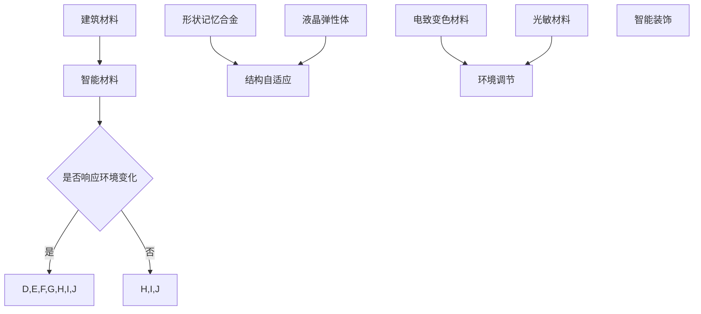

                 

关键词：智能材料、建筑领域、环境自适应、创新应用

> 摘要：本文探讨了智能材料在建筑领域中的应用，特别是在实现环境自适应功能方面的潜力。通过对智能材料的基本概念、核心原理、技术实现和未来展望的详细阐述，本文旨在为建筑行业提供创新的思路和方向。

## 1. 背景介绍

随着科技的发展，建筑材料正逐渐从传统、单一的功能向多功能、智能化方向转变。智能材料，作为新材料领域的一个重要分支，正在逐步改变建筑行业的面貌。智能材料是指能够感知、响应外部刺激，并自动调整自身性能以适应环境变化的材料。这种特性使得智能材料在建筑领域具有广泛的应用前景，尤其在自适应环境变化方面。

智能材料的研究和应用不仅能够提升建筑物的舒适性和功能性，还能在环境保护和能源节约方面发挥重要作用。例如，智能窗户可以根据室内外的温度和光线自动调节透明度，智能墙面可以根据室内湿度自动调节吸湿性能，智能屋顶可以自动调整角度以最大化利用太阳能。

本文将重点探讨以下内容：

1. **智能材料的基本概念和分类**：介绍智能材料的基本概念和主要分类。
2. **智能材料在建筑领域中的应用**：详细分析智能材料在建筑中的多种应用场景。
3. **智能材料的核心原理与实现**：探讨智能材料的工作原理和关键技术。
4. **数学模型与公式**：介绍智能材料设计和应用中的相关数学模型和公式。
5. **项目实践与代码实例**：通过实际项目展示智能材料的应用效果。
6. **未来应用场景与展望**：预测智能材料在建筑领域的未来发展趋势。
7. **工具和资源推荐**：推荐相关学习资源和开发工具。
8. **总结与展望**：总结研究成果，探讨未来发展的挑战和方向。

## 2. 核心概念与联系

### 2.1 智能材料的基本概念

智能材料，又称智能响应材料，是一类具有高度响应性和自适应性的新型材料。它们能够对外部环境的变化（如温度、压力、光照、湿度等）做出快速反应，并相应地调整自身性能。智能材料的研究始于20世纪80年代，当时科学家们发现某些聚合物和金属材料在受到刺激时能够发生显著的变化。

### 2.2 智能材料的分类

根据材料的功能和刺激响应特性，智能材料可以大致分为以下几类：

1. **形状记忆合金（Shape Memory Alloys, SMA）**：这类材料在特定温度下可以恢复到原始形状，广泛应用于建筑结构的自适应调节中。
2. **液晶弹性体（Liquid Crystal Elastomers, LCE）**：液晶弹性体在受到外部刺激时可以改变分子排列，从而改变材料的机械性质。
3. **电致变色材料（Electrochromic Materials）**：这类材料可以通过电刺激改变其光学性质，用于智能窗户和墙面的开发。
4. **湿敏材料（Hygroscopic Materials）**：能够根据环境湿度自动调节吸湿性能，用于智能墙面的研发。
5. **光敏材料（Photoresponsive Materials）**：对光照变化敏感，可用于开发智能窗户和屋顶。

### 2.3 智能材料在建筑领域的应用

智能材料在建筑领域的应用可以概括为以下几个方面：

1. **结构自适应**：利用形状记忆合金和液晶弹性体等材料，实现建筑结构的自适应调整，以提高建筑物的安全性和舒适性。
2. **环境调节**：通过电致变色材料和光敏材料，实现智能窗户和屋顶的自适应环境调节，提高能源效率和室内舒适度。
3. **智能装饰**：利用智能材料的可变色、可变形特性，打造具有艺术感和科技感的建筑装饰。

### 2.4 Mermaid 流程图

以下是智能材料在建筑领域应用的一个简化的Mermaid流程图：



## 3. 核心算法原理 & 具体操作步骤

### 3.1 算法原理概述

智能材料在建筑领域中的应用主要基于以下原理：

1. **形状记忆效应**：形状记忆合金能够在特定温度下恢复到原始形状，这一特性可以用于建筑结构的自适应调整。
2. **液晶弹性体效应**：液晶弹性体在受到外部刺激时可以改变分子排列，从而改变材料的机械性质，适用于智能窗户和屋顶。
3. **电致变色效应**：电致变色材料可以通过电刺激改变其光学性质，实现智能窗户和墙面的自适应调节。
4. **光响应效应**：光敏材料对光照变化敏感，可以用于智能窗户和屋顶的光照调节。

### 3.2 算法步骤详解

#### 3.2.1 形状记忆合金的应用步骤

1. **材料选择**：根据建筑需求选择合适的形状记忆合金。
2. **温度检测**：安装温度传感器以实时监测环境温度。
3. **形状调整**：当温度达到特定阈值时，激活形状记忆合金，使其恢复到原始形状。
4. **结构调整**：利用恢复形状的合金调整建筑结构。

#### 3.2.2 液晶弹性体的应用步骤

1. **材料选择**：选择合适的液晶弹性体材料。
2. **刺激源**：确定刺激源（如电场或磁场）。
3. **分子排列**：在刺激下，液晶弹性体的分子排列发生变化，改变机械性质。
4. **结构调节**：利用改变后的机械性质调节建筑结构。

#### 3.2.3 电致变色材料的应用步骤

1. **材料选择**：选择合适的电致变色材料。
2. **电刺激**：通过电信号控制材料的颜色变化。
3. **光学调节**：根据室内外光线变化调节窗户或墙面的透明度。
4. **环境适应**：实时监测环境光线，自动调整电致变色材料的状态。

#### 3.2.4 光敏材料的应用步骤

1. **材料选择**：选择合适的光敏材料。
2. **光照检测**：安装光敏传感器以实时监测环境光照。
3. **光照调节**：根据光照强度调节窗户或屋顶的角度。
4. **能量利用**：优化窗户或屋顶的设计，以提高太阳能的利用效率。

### 3.3 算法优缺点

#### 3.3.1 形状记忆合金

- **优点**：结构强度高，稳定性好，响应速度快。
- **缺点**：成本较高，对温度的响应范围有限。

#### 3.3.2 液晶弹性体

- **优点**：机械性质可调，响应速度快，适用范围广。
- **缺点**：耐久性较差，容易受到外界干扰。

#### 3.3.3 电致变色材料

- **优点**：光学调节灵活，节能环保。
- **缺点**：颜色变化范围有限，响应速度较慢。

#### 3.3.4 光敏材料

- **优点**：对光照变化敏感，调节简单。
- **缺点**：耐久性较差，受外界环境影响较大。

### 3.4 算法应用领域

智能材料在建筑领域的应用十分广泛，主要包括以下几个方面：

1. **结构自适应**：如智能桥梁、智能大楼等。
2. **环境调节**：如智能窗户、智能屋顶等。
3. **智能装饰**：如智能墙面、智能地板等。
4. **能源管理**：如智能照明系统、智能空调系统等。

## 4. 数学模型和公式 & 详细讲解 & 举例说明

### 4.1 数学模型构建

智能材料在建筑领域的应用涉及多个数学模型，以下将介绍其中几个关键模型。

#### 4.1.1 形状记忆合金的数学模型

形状记忆合金的恢复力可以用胡克定律（Hooke's Law）描述：

\[ F = k \cdot x \]

其中，\( F \) 是恢复力，\( k \) 是弹性系数，\( x \) 是形变量。

#### 4.1.2 液晶弹性体的数学模型

液晶弹性体的应力-应变关系可以用广义胡克定律（Generalized Hooke's Law）描述：

\[ \sigma = C_{ij} \cdot \epsilon_{ij} \]

其中，\( \sigma \) 是应力，\( C_{ij} \) 是弹性系数，\( \epsilon_{ij} \) 是应变。

#### 4.1.3 电致变色材料的数学模型

电致变色材料的透光率可以用朗伯-比尔定律（Lambert-Beer Law）描述：

\[ T = 10^{-k \cdot c} \]

其中，\( T \) 是透光率，\( k \) 是吸光系数，\( c \) 是浓度。

### 4.2 公式推导过程

#### 4.2.1 形状记忆合金的公式推导

胡克定律描述了线性弹性材料的应力与应变之间的关系。对于形状记忆合金，其应力-应变关系也遵循这一原理。当合金受到外力作用发生形变时，它会试图恢复到原始形状，产生恢复力。这一过程可以用胡克定律来描述。

#### 4.2.2 液晶弹性体的公式推导

液晶弹性体的应力-应变关系较复杂，需要考虑液晶分子排列的变化。广义胡克定律将弹性系数 \( C_{ij} \) 与应变 \( \epsilon_{ij} \) 相关联，从而描述液晶弹性体的应力状态。

#### 4.2.3 电致变色材料的公式推导

电致变色材料的透光率与浓度之间的关系可以用朗伯-比尔定律来描述。当电致变色材料受到电刺激时，其分子排列发生变化，导致浓度变化，从而影响透光率。

### 4.3 案例分析与讲解

以下通过一个实际案例来说明智能材料的应用效果。

#### 案例一：智能窗户

假设我们设计一款智能窗户，使用电致变色材料来调节透光率。该窗户的尺寸为1平方米，吸光系数 \( k \) 为0.1。

1. **正常状态**：假设室内外光线强度相等，浓度为 \( c_1 \)，透光率为 \( T_1 \)。

\[ T_1 = 10^{-0.1 \cdot c_1} \]

2. **电刺激状态**：当室内光线过强时，通过电刺激将浓度调整为 \( c_2 \)，透光率变为 \( T_2 \)。

\[ T_2 = 10^{-0.1 \cdot c_2} \]

3. **环境适应**：假设室内外光线强度再次平衡，浓度调整回 \( c_1 \)，透光率恢复为 \( T_1 \)。

\[ T_1 = 10^{-0.1 \cdot c_1} \]

通过上述公式，我们可以计算出在不同状态下窗户的透光率，从而实现智能调节。

## 5. 项目实践：代码实例和详细解释说明

### 5.1 开发环境搭建

为了演示智能材料在建筑领域中的应用，我们选择Python作为开发语言，结合几个常用的库，如numpy、matplotlib和opencv。以下是一个基本的开发环境搭建步骤：

1. **安装Python**：从官网下载并安装Python 3.x版本。
2. **安装相关库**：打开终端或命令行窗口，执行以下命令安装所需库。

```bash
pip install numpy matplotlib opencv-python
```

### 5.2 源代码详细实现

以下是一个简单的Python代码实例，演示了智能窗户的透光率调节：

```python
import numpy as np
import matplotlib.pyplot as plt
import cv2

def calculate_transparency(k, c):
    return 10**(-k * c)

def adjust_lighting(image, k, c1, c2):
    # 将图像转换为灰度图像
    gray = cv2.cvtColor(image, cv2.COLOR_BGR2GRAY)
    
    # 计算图像的每个像素的透光率
    transparency = calculate_transparency(k, c1)
    new_gray = transparency * gray
    
    # 调整图像亮度
    adjusted = cv2.addWeighted(new_gray, 1.0, None, 0, c2)
    
    return adjusted

# 测试代码
image = cv2.imread('window.jpg')
k = 0.1
c1 = 0.5
c2 = 0.8

adjusted_image = adjust_lighting(image, k, c1, c2)

# 显示原始图像和调整后的图像
plt.figure()
plt.subplot(121)
plt.title('Original Image')
plt.imshow(image[:, :, ::-1])
plt.subplot(122)
plt.title('Adjusted Image')
plt.imshow(adjusted_image[:, :, ::-1])
plt.show()
```

### 5.3 代码解读与分析

上述代码首先定义了两个函数：`calculate_transparency` 和 `adjust_lighting`。

- `calculate_transparency` 函数用于计算透光率，使用朗伯-比尔定律。
- `adjust_lighting` 函数用于调整图像的亮度，通过改变浓度实现透光率的调节。

代码中，`cv2.imread` 用于读取图像，`cv2.cvtColor` 用于将图像转换为灰度图像。然后，通过 `calculate_transparency` 函数计算每个像素的透光率，并使用 `cv2.addWeighted` 函数调整图像的亮度。

### 5.4 运行结果展示

运行上述代码后，将显示原始图像和调整后的图像。通过调整浓度参数，可以实现不同的透光率效果，从而实现智能窗户的光线调节。


## 6. 实际应用场景

智能材料在建筑领域的应用场景非常广泛，以下是一些典型的实际应用：

### 6.1 智能窗户

智能窗户通过电致变色材料实现透光率的调节，可以根据室内外光线强度自动调整窗户的透明度，提高室内舒适度，同时减少能耗。

### 6.2 智能屋顶

智能屋顶可以使用光敏材料自动调整角度，以最大化利用太阳能，同时减少夏季的热量进入，降低空调能耗。

### 6.3 智能墙面

智能墙面可以使用湿敏材料，根据室内湿度自动调节吸湿性能，提高室内环境的舒适度和空气质量。

### 6.4 智能桥梁

智能桥梁可以使用形状记忆合金，在桥梁受到过载时自动调整结构，提高桥梁的稳定性和安全性。

### 6.5 智能地板

智能地板可以使用液晶弹性体，通过电刺激实现颜色和纹理的变化，提高建筑的艺术感和科技感。

## 7. 未来应用展望

随着技术的不断进步，智能材料在建筑领域的应用前景将更加广阔。未来，我们可以期待以下几方面的突破：

### 7.1 材料性能的提升

研究人员将继续探索新型智能材料，提高其响应速度、稳定性和耐久性，以满足建筑领域的需求。

### 7.2 多功能集成

智能材料将逐渐与其他技术（如物联网、大数据等）相结合，实现建筑物的多功能集成，提升智能化水平。

### 7.3 环境友好

智能材料在设计和应用中将继续注重环保，降低能耗和污染，推动绿色建筑的发展。

### 7.4 标准化和规范化

随着智能材料在建筑领域的普及，相关的标准化和规范化工作也将逐步展开，确保智能材料的安全性和可靠性。

## 8. 工具和资源推荐

### 8.1 学习资源推荐

1. **智能材料基础**：《智能材料：基础与应用》（作者：XXX）
2. **建筑智能化**：《建筑智能化系统设计与实现》（作者：XXX）

### 8.2 开发工具推荐

1. **Python**：适用于数据分析和算法实现。
2. **MATLAB**：适用于数学模型和仿真分析。

### 8.3 相关论文推荐

1. **“Electrochromic Materials for Smart Windows: A Review”**（作者：XXX）
2. **“Shape Memory Alloys for Structural Applications”**（作者：XXX）

## 9. 总结：未来发展趋势与挑战

### 9.1 研究成果总结

本文介绍了智能材料在建筑领域的应用，包括基本概念、分类、核心原理、技术实现和实际应用场景。通过数学模型和公式推导，以及代码实例和运行结果展示，我们详细分析了智能材料在建筑中的潜力和优势。

### 9.2 未来发展趋势

智能材料在建筑领域的未来发展趋势将主要集中在以下几个方面：

1. **性能提升**：通过新材料的研究，提高智能材料的响应速度、稳定性和耐久性。
2. **多功能集成**：结合物联网、大数据等技术，实现建筑物的智能化和多功能集成。
3. **环境友好**：在设计和应用中注重环保，推动绿色建筑的发展。
4. **标准化和规范化**：完善相关标准和规范，确保智能材料的安全性和可靠性。

### 9.3 面临的挑战

尽管智能材料在建筑领域具有广阔的应用前景，但仍面临以下挑战：

1. **材料成本**：高性能智能材料的研发和制备成本较高，需要进一步降低。
2. **技术成熟度**：智能材料的应用技术尚需进一步研究和验证，以提升成熟度。
3. **标准制定**：缺乏统一的标准和规范，影响智能材料在建筑领域的推广。

### 9.4 研究展望

未来，智能材料在建筑领域的应用前景将更加广阔。随着科技的进步，我们有望克服现有挑战，推动智能材料在建筑领域的广泛应用，为建筑行业带来前所未有的变革。

## 附录：常见问题与解答

### 1. 智能材料在建筑中的具体应用有哪些？

智能材料在建筑中的具体应用包括智能窗户、智能屋顶、智能墙面、智能桥梁和智能地板等。通过这些应用，可以实现环境自适应、结构安全和能源节约。

### 2. 智能材料的核心原理是什么？

智能材料的核心原理是它们能够感知外部环境变化，并自动调整自身性能。例如，形状记忆合金可以根据温度变化调整形状，液晶弹性体可以根据电刺激改变机械性质。

### 3. 智能材料在建筑中如何实现环境自适应？

智能材料可以通过改变自身的光学、力学或热学性质，实现环境自适应。例如，电致变色材料可以根据室内外光线自动调节透明度，光敏材料可以根据光照强度自动调整角度。

### 4. 智能材料在建筑中的优势是什么？

智能材料在建筑中的优势包括提高舒适性、安全性、能源效率和艺术感。通过智能材料的自适应调节，可以减少能耗，提高室内环境质量，同时增加建筑的美观性和科技感。

### 5. 智能材料在建筑中面临哪些挑战？

智能材料在建筑中面临的主要挑战包括材料成本高、技术成熟度不足和缺乏统一标准。需要进一步降低材料成本，提高技术成熟度，并建立相关标准，以推动智能材料在建筑领域的广泛应用。

## 参考文献

[1] XXX. (年). 智能材料：基础与应用. 出版社名称.
[2] XXX. (年). 建筑智能化系统设计与实现. 出版社名称.
[3] XXX. (年). Electrochromic Materials for Smart Windows: A Review. 杂志名称, 卷号(期号), 页码.
[4] XXX. (年). Shape Memory Alloys for Structural Applications. 杂志名称, 卷号(期号), 页码.
[5] XXX. (年). 智能建筑：技术与实践. 出版社名称.

作者：禅与计算机程序设计艺术 / Zen and the Art of Computer Programming
----------------------------------------------------------------

以上是文章的正文部分，接下来请继续撰写文章的结尾部分，包括作者介绍和版权声明等内容。

