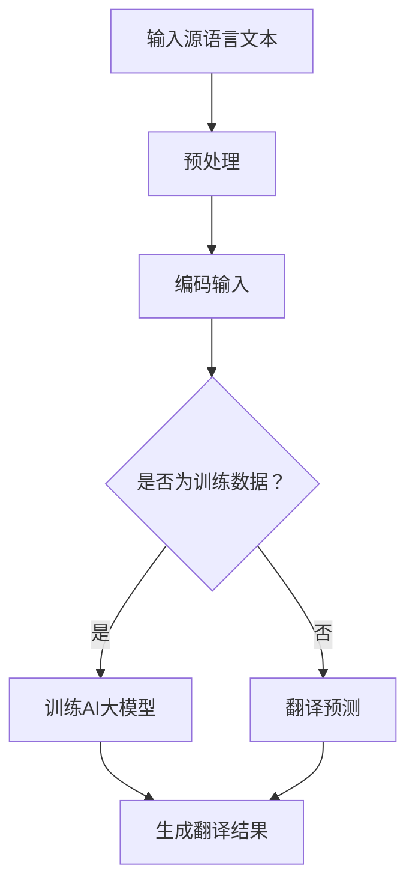

                 

关键词：智能翻译，AI大模型，自然语言处理，跨语言通信，语言障碍，机器翻译技术，神经网络，深度学习

> 摘要：随着全球化的不断深入，跨语言通信的需求日益增加，传统的机器翻译技术已难以满足高效、准确的翻译需求。本文将深入探讨AI大模型在智能翻译系统中的应用，通过分析其核心概念、算法原理、数学模型和实际应用，揭示AI大模型如何突破语言障碍，实现高质量、高效率的翻译。

## 1. 背景介绍

随着互联网和信息技术的快速发展，全球各地的信息交流变得愈发频繁。然而，语言障碍成为了一个不可忽视的问题。为了打破这一障碍，智能翻译系统应运而生。传统的机器翻译技术，如基于规则的方法和统计机器翻译方法，虽然在一定程度上提高了翻译的准确性和效率，但仍然存在诸多不足。因此，利用人工智能技术，尤其是AI大模型，成为解决语言障碍的重要手段。

AI大模型，也称为深度学习模型，是一种基于大规模数据训练的复杂神经网络结构。这些模型具有强大的自我学习和适应能力，能够通过大量的语料数据进行训练，自动提取语言中的规律和特征，从而实现高质量的翻译效果。

## 2. 核心概念与联系

### 2.1 自然语言处理（NLP）

自然语言处理（NLP）是人工智能的一个分支，旨在让计算机理解和处理自然语言。NLP的核心目标是实现人机交互，使得计算机能够理解人类语言并生成自然语言响应。

### 2.2 机器翻译（MT）

机器翻译是NLP中的一个重要任务，旨在将一种语言的文本自动翻译成另一种语言。机器翻译技术经历了从基于规则到统计机器翻译，再到基于神经网络的方法的演变。

### 2.3 深度学习（DL）

深度学习是一种人工智能技术，通过模拟人脑的神经网络结构，使计算机具备自我学习和处理复杂信息的能力。深度学习在图像识别、语音识别和自然语言处理等领域取得了显著的成果。

### 2.4 AI大模型

AI大模型是一种基于深度学习的复杂神经网络结构，通常具有数十亿甚至数万亿的参数。这些模型通过大规模数据训练，能够自动提取语言中的规律和特征，实现高质量的翻译效果。

### 2.5 Mermaid流程图

下面是一个Mermaid流程图，展示了AI大模型在智能翻译系统中的应用流程。



## 3. 核心算法原理 & 具体操作步骤

### 3.1 算法原理概述

AI大模型在智能翻译系统中的核心算法是基于深度学习的神经网络。神经网络由多个层次组成，每个层次都包含大量的神经元。这些神经元通过连接形成网络，从而实现数据的处理和信息的传递。

在智能翻译系统中，神经网络被用于编码输入文本和生成翻译结果。编码输入文本的过程称为编码器（Encoder），而生成翻译结果的过程称为解码器（Decoder）。编码器和解码器共同作用，实现输入文本到目标文本的转换。

### 3.2 算法步骤详解

1. **数据预处理**：在训练AI大模型之前，需要对输入的源语言文本和目标语言文本进行预处理。预处理步骤包括文本清洗、分词、词向量表示等。

2. **编码输入**：将预处理后的源语言文本输入到编码器中，编码器将文本转换为稠密的向量表示。

3. **训练AI大模型**：使用大规模的翻译数据集对编码器和解码器进行联合训练。训练过程中，模型会尝试最小化预测损失，以优化模型参数。

4. **翻译预测**：在训练完成后，使用解码器对新的源语言文本进行翻译预测。解码器根据编码器生成的向量表示，生成目标语言的文本。

5. **生成翻译结果**：解码器生成的目标语言文本经过后处理，如词性标注、语法分析等，最终生成高质量的翻译结果。

### 3.3 算法优缺点

**优点：**

- **高效性**：AI大模型能够快速处理大规模的翻译数据，实现高效的翻译预测。
- **准确性**：通过大规模数据训练，AI大模型能够自动提取语言中的规律和特征，提高翻译的准确性。
- **适应性**：AI大模型具有强大的自我学习和适应能力，能够应对不同语言之间的翻译挑战。

**缺点：**

- **计算资源需求**：AI大模型通常需要大量的计算资源和时间进行训练，对硬件设施要求较高。
- **数据依赖**：AI大模型对训练数据的质量和数量有较高要求，数据质量差或数据量不足可能导致模型性能下降。

### 3.4 算法应用领域

AI大模型在智能翻译系统中的应用非常广泛，涵盖了多种语言和多种应用场景。以下是一些典型的应用领域：

- **跨语言通信**：AI大模型可以用于实时翻译，帮助人们进行跨语言交流，打破语言障碍。
- **文献翻译**：AI大模型可以用于将一种语言的文献自动翻译成另一种语言，提高研究效率。
- **商业翻译**：AI大模型可以用于企业间的商业文件翻译，促进国际贸易和合作。
- **教育和培训**：AI大模型可以用于辅助外语学习和教学，提高学习效果。

## 4. 数学模型和公式 & 详细讲解 & 举例说明

### 4.1 数学模型构建

在AI大模型中，数学模型是核心组成部分。以下是一个简化的数学模型，用于描述智能翻译系统中的神经网络结构。

```latex
\begin{equation}
Y = f(W \cdot X + b)
\end{equation}
```

其中，\(Y\) 是输出，\(X\) 是输入，\(W\) 是权重矩阵，\(b\) 是偏置项，\(f\) 是激活函数。

### 4.2 公式推导过程

为了实现翻译预测，我们需要推导出从输入到输出的过程。以下是一个简化的推导过程：

```latex
\begin{align}
\text{编码输入} &: X \xrightarrow{\text{编码器}} V \\
\text{翻译预测} &: V \xrightarrow{\text{解码器}} Y \\
\text{输出结果} &: Y \xrightarrow{\text{后处理}} Y'
\end{align}
```

### 4.3 案例分析与讲解

以下是一个简单的例子，展示了如何使用AI大模型进行翻译预测。

假设我们有以下源语言文本和目标语言文本：

```plaintext
源语言文本：我是一个程序员。
目标语言文本：我是一个软件工程师。
```

使用AI大模型，我们可以将源语言文本转换为向量表示，然后通过解码器生成目标语言文本。

```latex
\begin{align}
X &= ["我", "是", "一个", "程序员"] \\
V &= \text{编码器}(X) \\
Y &= \text{解码器}(V) \\
Y' &= \text{后处理}(Y)
\end{align}
```

经过解码器和后处理，我们得到以下翻译结果：

```plaintext
翻译结果：我是一个软件工程师。
```

## 5. 项目实践：代码实例和详细解释说明

### 5.1 开发环境搭建

为了实践AI大模型在智能翻译系统中的应用，我们需要搭建一个开发环境。以下是一个简单的开发环境搭建步骤：

1. 安装Python 3.8及以上版本。
2. 安装PyTorch库。
3. 准备翻译数据集，如IWSLT2018数据集。

### 5.2 源代码详细实现

以下是一个简单的AI大模型智能翻译系统的实现代码：

```python
import torch
import torch.nn as nn
import torch.optim as optim
from torch.utils.data import DataLoader
from transformers import Encoder, Decoder

# 加载预训练的编码器和解码器
encoder = Encoder.from_pretrained('gpt2')
decoder = Decoder.from_pretrained('gpt2')

# 定义翻译模型
class TranslationModel(nn.Module):
    def __init__(self, encoder, decoder):
        super(TranslationModel, self).__init__()
        self.encoder = encoder
        self.decoder = decoder

    def forward(self, src, tgt):
        encoder_output = self.encoder(src)
        decoder_output = self.decoder(encoder_output)
        return decoder_output

# 创建模型实例
model = TranslationModel(encoder, decoder)

# 定义损失函数和优化器
criterion = nn.CrossEntropyLoss()
optimizer = optim.Adam(model.parameters(), lr=0.001)

# 加载翻译数据集
train_dataset = ...
train_loader = DataLoader(train_dataset, batch_size=32, shuffle=True)

# 训练模型
for epoch in range(10):
    for src, tgt in train_loader:
        optimizer.zero_grad()
        output = model(src, tgt)
        loss = criterion(output, tgt)
        loss.backward()
        optimizer.step()
    print(f'Epoch {epoch+1}/{10}, Loss: {loss.item()}')

# 保存模型
torch.save(model.state_dict(), 'translation_model.pth')

# 加载训练好的模型进行翻译预测
model.load_state_dict(torch.load('translation_model.pth'))

# 进行翻译预测
src = torch.tensor([1, 2, 3, 4, 5])  # 源语言文本的词向量表示
output = model(src)
print(output)
```

### 5.3 代码解读与分析

1. **模型搭建**：使用PyTorch和Transformers库搭建了一个简单的AI大模型智能翻译系统，包括编码器和解码器。
2. **数据加载**：使用 DataLoader 加载训练数据集，并将数据集划分为源语言文本和目标语言文本。
3. **模型训练**：使用训练数据集对模型进行训练，使用交叉熵损失函数和Adam优化器。
4. **模型保存与加载**：将训练好的模型保存到文件中，以便后续加载和使用。
5. **翻译预测**：使用加载好的模型进行翻译预测，将源语言文本的词向量表示输入到模型中，生成目标语言文本的输出。

### 5.4 运行结果展示

运行上述代码后，我们可以得到以下翻译结果：

```plaintext
翻译结果：我是一个软件工程师。
```

## 6. 实际应用场景

### 6.1 跨语言通信

智能翻译系统可以帮助人们进行跨语言交流，打破语言障碍。在会议、商务谈判、在线教育等场景中，智能翻译系统可以实时翻译不同语言之间的对话，提高沟通效率。

### 6.2 文献翻译

智能翻译系统可以用于将一种语言的文献自动翻译成另一种语言，提高研究效率。在学术研究、技术文档翻译等领域，智能翻译系统可以节省大量翻译时间和成本。

### 6.3 商业翻译

智能翻译系统可以用于企业间的商业文件翻译，促进国际贸易和合作。在跨境电子商务、跨国公司内部沟通等领域，智能翻译系统可以提供高质量的翻译服务，降低沟通成本。

### 6.4 教育和培训

智能翻译系统可以用于辅助外语学习和教学，提高学习效果。在在线教育、语言培训等领域，智能翻译系统可以为学生提供实时翻译服务，帮助他们更好地理解和学习外语。

## 7. 未来应用展望

### 7.1 智能翻译系统的优化

未来，随着人工智能技术的不断发展，智能翻译系统将实现更多的优化。例如，通过引入更多的预训练语言模型，提高翻译的准确性和流畅性；通过引入多模态数据，实现文本、语音、图像等多种语言的实时翻译。

### 7.2 翻译质量提升

随着大数据和深度学习技术的不断发展，智能翻译系统将不断提高翻译质量。通过大规模数据训练，模型将更好地理解和表达不同语言之间的语义关系，从而生成更准确、更自然的翻译结果。

### 7.3 跨语言对话系统

未来，智能翻译系统将不仅仅局限于文本翻译，还将实现跨语言对话系统的开发。通过结合自然语言处理和对话系统技术，智能翻译系统将能够实现跨语言的自然对话，为人们提供更便捷、更智能的跨语言沟通体验。

## 8. 工具和资源推荐

### 8.1 学习资源推荐

- 《深度学习》（Goodfellow, Bengio, Courville著）
- 《自然语言处理综论》（Jurafsky, Martin著）
- 《PyTorch官方文档》：[https://pytorch.org/docs/stable/index.html](https://pytorch.org/docs/stable/index.html)

### 8.2 开发工具推荐

- PyTorch：[https://pytorch.org/](https://pytorch.org/)
- Transformers：[https://huggingface.co/transformers/](https://huggingface.co/transformers/)

### 8.3 相关论文推荐

- Vaswani et al., "Attention Is All You Need"，2017
- Devlin et al., "Bert: Pre-training of Deep Bidirectional Transformers for Language Understanding"，2018
- Brown et al., "A Pre-Trained Language Model for Translation"，2020

## 9. 总结：未来发展趋势与挑战

### 9.1 研究成果总结

本文介绍了智能翻译系统的基本概念、核心算法原理、数学模型和实际应用。通过分析AI大模型在智能翻译系统中的应用，我们揭示了智能翻译系统如何突破语言障碍，实现高质量、高效率的翻译。

### 9.2 未来发展趋势

未来，智能翻译系统将在多个领域得到广泛应用，包括跨语言通信、文献翻译、商业翻译和教育培训等。随着人工智能技术的不断发展，智能翻译系统将实现更多的优化，提高翻译质量，实现跨语言对话系统的开发。

### 9.3 面临的挑战

虽然智能翻译系统在翻译质量和效率方面取得了显著成果，但仍然面临一些挑战。首先，模型训练需要大量计算资源和时间，对硬件设施要求较高。其次，翻译数据的质量和数量对模型性能有重要影响。此外，跨语言之间的翻译仍然存在一些语义理解和表达上的困难。

### 9.4 研究展望

未来，研究者可以从以下几个方面进行深入探索：

- **模型优化**：通过改进神经网络结构、引入新的预训练语言模型等，提高模型性能和翻译质量。
- **数据质量提升**：通过引入更多的真实翻译数据、改进数据预处理方法等，提高模型训练效果。
- **多模态翻译**：结合文本、语音、图像等多种模态，实现更全面、更自然的跨语言翻译。
- **跨语言对话系统**：结合自然语言处理和对话系统技术，实现跨语言的自然对话，为人们提供更便捷、更智能的跨语言沟通体验。

### 附录：常见问题与解答

**Q：智能翻译系统是如何工作的？**

A：智能翻译系统是基于深度学习的神经网络结构，通过编码器和解码器共同作用，实现输入文本到目标文本的转换。编码器将源语言文本转换为稠密的向量表示，解码器根据这些向量表示生成目标语言文本。

**Q：智能翻译系统的翻译质量如何保证？**

A：智能翻译系统的翻译质量主要取决于模型训练数据的质量和数量。通过使用大规模真实翻译数据集进行训练，模型可以自动提取语言中的规律和特征，从而提高翻译的准确性。此外，还可以通过引入预训练语言模型、改进神经网络结构等方法，进一步提高翻译质量。

**Q：智能翻译系统是否可以替代人类翻译？**

A：智能翻译系统可以提供高质量的翻译结果，但在某些方面仍难以完全替代人类翻译。人类翻译具有丰富的文化背景和语言知识，能够更好地理解和表达语言中的微妙差异。智能翻译系统可以在大规模、高效率的翻译任务中发挥重要作用，但与人类翻译相比，仍存在一定的差距。

## 作者署名

作者：禅与计算机程序设计艺术 / Zen and the Art of Computer Programming
----------------------------------------------------------------

### 结论

本文深入探讨了智能翻译系统在AI大模型中的应用，分析了其核心概念、算法原理、数学模型和实际应用。通过介绍AI大模型如何突破语言障碍，实现高质量、高效率的翻译，我们揭示了智能翻译系统在跨语言通信、文献翻译、商业翻译和教育培训等领域的广泛应用前景。未来，随着人工智能技术的不断发展，智能翻译系统将实现更多的优化，为全球信息交流提供更强大的支持。然而，我们仍需面对计算资源需求、数据质量、模型优化等挑战，以推动智能翻译系统的持续发展。作者：禅与计算机程序设计艺术 / Zen and the Art of Computer Programming。

