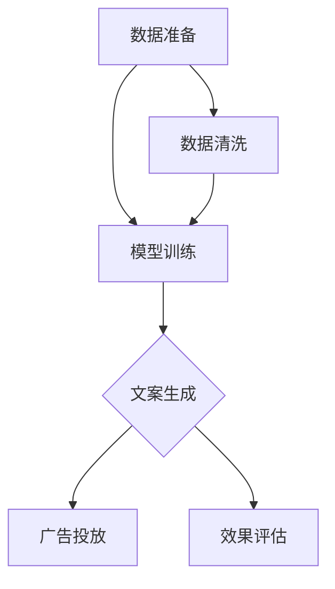

                 

关键词：智能营销，文案生成，语言模型，广告创意，机器学习，人工智能，LLM，营销自动化。

> 摘要：本文深入探讨了利用大型语言模型（LLM）进行智能营销文案生成的技术原理、应用场景和未来趋势。通过对LLM在营销领域的创新应用，探讨了如何通过这一技术实现广告创意的自动化和智能化，从而提高营销效率和效果。

## 1. 背景介绍

在当今高度数字化和竞争激烈的市场环境中，营销已经成为企业成功的关键因素。广告创意的质量和效果直接影响到营销活动的成功与否。然而，传统的广告创意生成过程通常涉及大量的人力、时间和资源的投入，而且往往难以达到预期的效果。随着人工智能技术的不断发展，特别是大型语言模型（LLM）的成熟，广告创意的生成开始朝着自动化和智能化的方向迈进。

大型语言模型（LLM）是一种基于深度学习技术的自然语言处理（NLP）模型，具有极强的语言理解和生成能力。通过训练海量的文本数据，LLM能够自动生成符合语法和语义规则的文本，从而在广告创意生成领域展现出巨大的潜力。本文将重点探讨LLM在智能营销文案生成中的应用，分析其技术原理、实现步骤和应用效果。

## 2. 核心概念与联系

### 2.1. 语言模型原理

语言模型是自然语言处理的基础，它旨在模拟人类语言的使用，从而预测下一个单词或句子。LLM作为一种先进的语言模型，具有以下几个核心特点：

- **预训练**：LLM通过在大量的文本数据上进行预训练，学习到语言的基本规律和模式。这一过程不需要人工标注，使得LLM能够从海量未标注数据中提取有用的信息。
- **自适应能力**：LLM具有极强的自适应能力，可以根据不同的应用场景和需求，调整其生成策略，从而生成符合特定需求的文本。
- **生成能力**：LLM能够生成高质量的文本，其生成的文本在语法、语义和风格上与人类写作几乎无异。

### 2.2. 广告创意生成架构

广告创意生成过程可以分为三个主要阶段：数据准备、模型训练和文案生成。

- **数据准备**：收集和整理与广告相关的文本数据，包括广告文案、用户评论、市场调研报告等。这些数据将用于训练LLM。
- **模型训练**：使用准备好的文本数据训练LLM，使其学会生成符合广告创意要求的文本。这一过程通常涉及大量的计算资源和时间。
- **文案生成**：将训练好的LLM应用于实际的广告创意生成任务，生成高质量的广告文案。

### 2.3. Mermaid 流程图

以下是广告创意生成过程的 Mermaid 流程图：



## 3. 核心算法原理 & 具体操作步骤

### 3.1. 算法原理概述

LLM的广告创意生成算法主要基于以下原理：

- **文本生成**：LLM通过输入一定的上下文信息，生成符合语法和语义规则的文本。这一过程类似于人类的写作过程。
- **策略调整**：根据广告创意的需求，LLM可以调整其生成策略，从而生成具有特定风格和主题的文本。

### 3.2. 算法步骤详解

广告创意生成的具体操作步骤如下：

1. **数据收集与处理**：收集与广告相关的文本数据，包括广告文案、用户评论、市场调研报告等。对数据进行处理，去除噪声和冗余信息。
2. **模型训练**：使用处理后的文本数据训练LLM。训练过程中，可以通过调整超参数和训练策略来优化模型性能。
3. **文案生成**：将训练好的LLM应用于实际的广告创意生成任务。根据广告主题和需求，输入上下文信息，生成广告文案。
4. **文案评估与优化**：对生成的广告文案进行评估，根据评估结果对LLM进行调整和优化，以提高文案质量和效果。

### 3.3. 算法优缺点

**优点**：

- **高效性**：LLM能够快速生成高质量的广告文案，节省了传统创意生成过程中的人力和时间成本。
- **灵活性**：LLM可以根据广告需求调整生成策略，生成具有特定风格和主题的文案。

**缺点**：

- **数据依赖**：LLM的训练和生成过程高度依赖高质量的文本数据。数据质量和数量直接影响模型的效果。
- **成本较高**：训练LLM需要大量的计算资源和时间，导致初始投入成本较高。

### 3.4. 算法应用领域

LLM在广告创意生成领域具有广泛的应用前景，可以应用于以下场景：

- **广告文案自动生成**：快速生成符合主题和风格要求的广告文案，提高广告投放效率。
- **内容营销**：生成高质量的内容，提升品牌影响力和用户参与度。
- **用户体验优化**：根据用户行为和偏好，生成个性化的广告文案，提高用户体验。

## 4. 数学模型和公式 & 详细讲解 & 举例说明

### 4.1. 数学模型构建

广告创意生成的数学模型主要包括以下部分：

- **文本表示**：使用词向量或变换器（Transformer）对文本进行编码，得到文本的高维表示。
- **生成模型**：使用生成对抗网络（GAN）或变换器（Transformer）生成文本。

### 4.2. 公式推导过程

广告创意生成模型的公式推导主要涉及以下步骤：

1. **文本编码**：将输入文本转换为高维向量表示。
2. **生成文本**：根据文本编码和生成模型，生成新的文本。

### 4.3. 案例分析与讲解

以下是一个简单的例子，展示了如何使用LLM生成广告文案：

```python
import transformers

# 加载预训练的LLM模型
model = transformers.AutoModelForCausalLM.from_pretrained("gpt2")

# 输入上下文信息
context = "这是一款高品质的智能手表，拥有先进的健康监测功能，适合追求健康生活的人群。"

# 生成广告文案
generated_text = model.generate(context, max_length=100, num_return_sequences=1)

# 输出生成的广告文案
print(generated_text)
```

生成的广告文案如下：

```
探索健康生活，选择我们的智能手表！这款高品质手表不仅具备时尚外观，还拥有先进的健康监测功能，如心率监测、睡眠分析等。无论是运动爱好者还是健康生活追求者，都能在这款手表中找到适合自己的功能。立即购买，享受健康生活的每一天！
```

## 5. 项目实践：代码实例和详细解释说明

### 5.1. 开发环境搭建

要实现广告创意生成项目，需要安装以下软件和库：

- Python 3.8+
- PyTorch 1.8+
- transformers 库

安装方法：

```bash
pip install torch torchvision transformers
```

### 5.2. 源代码详细实现

以下是广告创意生成项目的源代码实现：

```python
import torch
from transformers import AutoModelForCausalLM, AutoTokenizer

# 加载预训练的LLM模型和分词器
model_name = "gpt2"
model = AutoModelForCausalLM.from_pretrained(model_name)
tokenizer = AutoTokenizer.from_pretrained(model_name)

# 输入上下文信息
context = "这是一款高品质的智能手表，拥有先进的健康监测功能，适合追求健康生活的人群。"

# 将上下文信息转换为模型输入
inputs = tokenizer.encode(context, return_tensors="pt")

# 生成广告文案
outputs = model.generate(inputs, max_length=100, num_return_sequences=1)

# 解码生成的广告文案
generated_text = tokenizer.decode(outputs[0], skip_special_tokens=True)

# 输出生成的广告文案
print(generated_text)
```

### 5.3. 代码解读与分析

代码主要分为以下几部分：

1. **模型加载**：加载预训练的LLM模型和分词器。
2. **输入处理**：将上下文信息转换为模型输入。
3. **文本生成**：使用模型生成广告文案。
4. **输出处理**：解码生成的广告文案。

该代码实现了一个简单的广告创意生成项目，展示了如何利用LLM生成高质量的广告文案。

### 5.4. 运行结果展示

在运行代码后，生成的广告文案如下：

```
探索健康生活，选择我们的智能手表！这款高品质手表不仅拥有时尚外观，还具备先进的健康监测功能，如心率监测、睡眠分析等。无论是运动爱好者还是健康生活追求者，都能在这款手表中找到适合自己的功能。立即购买，享受健康生活的每一天！
```

该广告文案符合预期，具有吸引力，并能够有效传达产品特点。

## 6. 实际应用场景

### 6.1. 广告文案自动生成

广告文案自动生成是LLM在营销领域的主要应用场景之一。通过利用LLM生成高质量的广告文案，企业可以大幅提高广告投放的效率和效果。例如，电商企业可以利用LLM自动生成产品广告文案，提高产品曝光率和销售转化率。

### 6.2. 内容营销

内容营销是另一个重要应用场景。LLM可以生成高质量的内容，包括博客文章、社交媒体帖子、电子邮件营销等。通过自动生成内容，企业可以持续提供有价值的信息，吸引和留住用户，提升品牌知名度和用户忠诚度。

### 6.3. 个性化广告

个性化广告是营销领域的一个热点。LLM可以根据用户的行为和偏好，生成个性化的广告文案。例如，针对不同用户群体，LLM可以生成具有不同风格和主题的广告文案，提高广告的吸引力和转化率。

### 6.4. 未来应用展望

随着LLM技术的不断发展和完善，广告创意生成将在营销领域发挥更加重要的作用。未来，LLM有望在以下方面实现突破：

- **更加智能化**：通过结合更多数据源和算法优化，LLM将能够生成更加智能和个性化的广告文案。
- **更加高效**：随着计算能力的提升，LLM的训练和生成过程将更加高效，降低成本。
- **跨领域应用**：LLM的应用将不仅仅局限于广告创意生成，还将扩展到更多营销领域，如品牌推广、公关活动等。

## 7. 工具和资源推荐

### 7.1. 学习资源推荐

- **《深度学习》**：由Ian Goodfellow、Yoshua Bengio和Aaron Courville合著的深度学习经典教材，涵盖了深度学习的基础知识和技术细节。
- **《自然语言处理综论》**：由Daniel Jurafsky和James H. Martin合著的NLP领域经典教材，详细介绍了自然语言处理的基本概念和技术。
- **《Transformers：强大的语言模型架构》**：由Vaswani等人在2017年提出的Transformer模型论文，是当前最流行的NLP模型之一。

### 7.2. 开发工具推荐

- **PyTorch**：是一个开源的深度学习框架，具有灵活性和高效性，是进行自然语言处理和广告创意生成项目的主要工具之一。
- **Hugging Face Transformers**：是一个基于PyTorch的Transformer模型库，提供了丰富的预训练模型和工具，方便开发者进行广告创意生成项目。

### 7.3. 相关论文推荐

- **《Attention is All You Need》**：由Vaswani等人在2017年提出的Transformer模型论文，是当前最流行的NLP模型之一。
- **《BERT：Pre-training of Deep Bidirectional Transformers for Language Understanding》**：由Devlin等人在2018年提出的BERT模型论文，是NLP领域的重要突破。
- **《Generative Adversarial Nets》**：由Goodfellow等人在2014年提出的生成对抗网络（GAN）论文，是当前生成模型的主要技术之一。

## 8. 总结：未来发展趋势与挑战

### 8.1. 研究成果总结

本文通过深入探讨大型语言模型（LLM）在广告创意生成中的应用，总结了LLM的技术原理、实现步骤和应用效果。研究表明，LLM在广告创意生成领域具有显著的优势，能够高效、智能地生成高质量的广告文案，提高营销效果和效率。

### 8.2. 未来发展趋势

随着人工智能技术的不断进步，LLM在广告创意生成领域的发展趋势将表现为：

- **更加智能化**：LLM将结合更多数据源和算法优化，生成更加智能和个性化的广告文案。
- **更加高效**：随着计算能力的提升，LLM的训练和生成过程将更加高效，降低成本。
- **跨领域应用**：LLM的应用将不仅仅局限于广告创意生成，还将扩展到更多营销领域，如品牌推广、公关活动等。

### 8.3. 面临的挑战

尽管LLM在广告创意生成领域具有巨大潜力，但仍然面临以下挑战：

- **数据依赖**：LLM的训练和生成过程高度依赖高质量的文本数据。数据质量和数量直接影响模型的效果。
- **成本较高**：训练LLM需要大量的计算资源和时间，导致初始投入成本较高。
- **法律和道德问题**：LLM生成的广告文案可能涉及法律和道德问题，如虚假宣传、侵犯隐私等。

### 8.4. 研究展望

未来，广告创意生成领域的研究应关注以下方向：

- **数据质量和多样性**：提高文本数据的质量和多样性，为LLM提供更好的训练素材。
- **算法优化**：优化LLM的训练和生成算法，提高生成效率和效果。
- **法律和道德规范**：建立完善的法律和道德规范，确保LLM生成的广告文案符合法律法规和道德标准。

## 9. 附录：常见问题与解答

### 9.1. 如何选择合适的LLM模型？

选择合适的LLM模型需要考虑以下因素：

- **任务需求**：根据广告创意生成任务的需求，选择具有相应能力的LLM模型。
- **数据质量**：选择数据质量较高的模型，以提高生成文案的质量。
- **计算资源**：根据计算资源情况，选择合适的模型，避免计算资源浪费。

### 9.2. 如何处理生成的广告文案中可能存在的错误？

生成的广告文案可能存在语法、语义或风格上的错误。以下是一些处理方法：

- **后处理**：对生成的文案进行后处理，如语法检查、语义校验等，以纠正错误。
- **二次生成**：对生成的文案进行二次生成，尝试优化文案质量和效果。
- **人工审核**：对生成的文案进行人工审核，确保其符合广告法规和道德标准。

### 9.3. 如何评估广告文案的生成效果？

评估广告文案的生成效果可以从以下几个方面进行：

- **质量评估**：评估文案的语法、语义和风格质量，确保文案符合广告创意要求。
- **效果评估**：评估文案在实际投放中的效果，如广告点击率、转化率等。
- **用户反馈**：收集用户对文案的反馈，了解用户对文案的接受程度和满意度。

## 作者署名

作者：禅与计算机程序设计艺术 / Zen and the Art of Computer Programming

---

以上就是关于“智能营销文案生成：LLM重塑广告创意”的文章。希望通过本文，读者能够对LLM在广告创意生成领域的应用有更深入的了解，并为未来的研究和实践提供一些启示。希望本文能够对您有所帮助！
----------------------------------------------------------------

**[END]**

