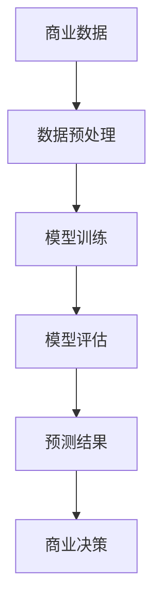

                 

关键词：智能预测分析、AI大模型、商业智能、机器学习、深度学习、数据处理、模型训练、预测准确性、优化策略、实际应用场景、未来发展。

> 摘要：本文深入探讨了AI大模型在商业智能领域的应用，详细介绍了智能预测分析的基本概念、核心算法原理、数学模型及公式，并通过实际项目案例展示了其在商业决策中的价值。本文旨在为读者提供对AI大模型应用的理解，以及未来发展的趋势和挑战。

## 1. 背景介绍

在当今的商业环境中，信息爆炸和数据泛滥成为常态。企业面临着海量的数据，如何从这些数据中挖掘出有价值的信息，从而做出明智的商业决策，成为了一个亟待解决的问题。商业智能（Business Intelligence, BI）作为一种基于数据分析的技术，能够帮助企业从数据中获取洞察，提升运营效率，增强竞争力。

随着人工智能（Artificial Intelligence, AI）技术的发展，特别是深度学习和机器学习领域的突破，AI大模型开始逐渐在商业智能领域发挥作用。这些大模型具有强大的数据处理和分析能力，能够对复杂的数据集进行高效的学习和预测，从而帮助企业做出更加精准的商业决策。

本文将围绕智能预测分析这一主题，探讨AI大模型在商业智能中的应用。首先，我们将介绍智能预测分析的基本概念和核心算法原理。接着，我们将详细讲解数学模型和公式，并通过具体案例说明其在实际应用中的效果。最后，本文还将展望智能预测分析的未来发展，探讨面临的挑战及未来的研究方向。

## 2. 核心概念与联系

### 2.1. 智能预测分析

智能预测分析是一种利用人工智能技术，特别是机器学习和深度学习算法，对历史数据进行分析和建模，从而对未来事件进行预测的方法。其核心在于通过学习和理解数据中的模式和关系，生成预测模型，并利用这些模型对未知数据进行预测。

### 2.2. 商业智能

商业智能是一种利用技术手段，通过数据分析、数据挖掘和可视化等技术，从企业的海量数据中提取有价值的信息，帮助管理层进行决策的方法。商业智能的目的是通过数据，帮助企业优化运营、降低成本、提升效率、增强竞争力。

### 2.3. AI大模型

AI大模型是指利用深度学习和机器学习技术训练出的具有大规模参数和高复杂度的神经网络模型。这些模型通常具有强大的学习能力和处理能力，能够处理大规模的数据集，并从中提取出有价值的信息。

### 2.4. 关系与联系

智能预测分析是商业智能的重要组成部分。AI大模型作为智能预测分析的核心技术，能够帮助商业智能系统实现高效的数据处理和预测。通过AI大模型，商业智能系统能够从海量的数据中快速提取出有价值的信息，为企业提供决策支持。

### 2.5. Mermaid 流程图

下面是一个简单的Mermaid流程图，展示了智能预测分析在商业智能中的应用流程：



## 3. 核心算法原理 & 具体操作步骤

### 3.1. 算法原理概述

智能预测分析的核心在于机器学习和深度学习算法。这些算法通过学习和理解数据中的模式和关系，生成预测模型，并利用这些模型对未知数据进行预测。主要算法包括：

- **线性回归**：一种简单的机器学习算法，用于预测连续值。
- **逻辑回归**：一种用于预测离散值的算法。
- **决策树**：一种树形结构，用于分类和回归。
- **神经网络**：一种模仿人脑神经元连接的算法，用于复杂的数据建模。

### 3.2. 算法步骤详解

#### 3.2.1. 数据预处理

在开始模型训练之前，需要对数据进行预处理。数据预处理包括以下步骤：

- **数据清洗**：去除数据中的噪声和异常值。
- **数据转换**：将数据转换为适合模型训练的格式，如归一化、标准化等。
- **特征工程**：选择和构造对模型有用的特征。

#### 3.2.2. 模型训练

模型训练是智能预测分析的核心步骤。通过训练，模型能够学习和理解数据中的模式和关系。训练步骤包括：

- **初始化模型参数**：随机初始化模型的参数。
- **前向传播**：将数据输入模型，计算输出结果。
- **反向传播**：计算输出误差，更新模型参数。
- **迭代训练**：重复前向传播和反向传播，直到模型收敛。

#### 3.2.3. 模型评估

模型评估是验证模型性能的重要步骤。常用的评估指标包括：

- **准确率**：预测正确的样本占总样本的比例。
- **召回率**：预测为正类的真实正类样本占总正类样本的比例。
- **F1分数**：准确率和召回率的调和平均。

#### 3.2.4. 预测结果

通过评估，选择性能最优的模型进行预测。预测结果可以是连续值，也可以是离散值。预测结果用于商业决策，如市场需求预测、客户流失预测等。

### 3.3. 算法优缺点

- **线性回归**：简单、易于理解，但适用于线性关系的数据，对于非线性关系的数据效果较差。
- **逻辑回归**：适用于二分类问题，但无法捕捉复杂的非线性关系。
- **决策树**：直观、易于理解，但可能产生过拟合，且对于大规模数据集效率较低。
- **神经网络**：适用于复杂的非线性关系，但参数众多，训练过程复杂，可能产生过拟合。

### 3.4. 算法应用领域

智能预测分析算法在商业智能领域具有广泛的应用，如：

- **市场需求预测**：预测产品未来的市场需求，帮助制定营销策略。
- **客户流失预测**：预测哪些客户可能流失，采取挽留措施。
- **价格预测**：预测产品价格的变化趋势，优化定价策略。
- **风险评估**：预测金融市场的风险，指导投资决策。

## 4. 数学模型和公式

### 4.1. 数学模型构建

智能预测分析的数学模型通常基于线性代数、微积分和概率论等数学工具。以下是一个简单的线性回归模型的数学模型：

$$
y = \beta_0 + \beta_1x + \epsilon
$$

其中，$y$ 是预测值，$x$ 是输入特征，$\beta_0$ 和 $\beta_1$ 是模型参数，$\epsilon$ 是误差项。

### 4.2. 公式推导过程

线性回归模型的参数可以通过最小二乘法进行估计。最小二乘法的核心思想是找到一个模型参数的集合，使得预测值与实际值之间的误差平方和最小。

假设有 $n$ 个样本，预测值为 $\hat{y}_i$，实际值为 $y_i$，则最小二乘法的公式为：

$$
\min \sum_{i=1}^{n} (\hat{y}_i - y_i)^2
$$

对 $\beta_0$ 和 $\beta_1$ 求偏导，并令偏导数为零，可以得到线性回归模型的参数估计公式：

$$
\beta_0 = \bar{y} - \beta_1\bar{x}
$$

$$
\beta_1 = \frac{\sum_{i=1}^{n} (x_i - \bar{x})(y_i - \bar{y})}{\sum_{i=1}^{n} (x_i - \bar{x})^2}
$$

其中，$\bar{x}$ 和 $\bar{y}$ 分别为输入特征和预测值的均值。

### 4.3. 案例分析与讲解

#### 4.3.1. 数据集

我们使用一个简单的数据集进行线性回归模型的训练和预测。数据集包含两个特征：年龄（$x$）和收入（$y$）。数据集如下：

| 年龄（$x$） | 收入（$y$） |
|------------|-------------|
| 25         | 5000        |
| 30         | 6000        |
| 35         | 7000        |
| 40         | 8000        |
| 45         | 9000        |

#### 4.3.2. 数据预处理

对数据集进行预处理，包括数据清洗和特征工程。由于数据集较小，我们可以直接使用原始数据进行训练。

#### 4.3.3. 模型训练

使用最小二乘法训练线性回归模型。计算得到模型参数：

$$
\beta_0 = 5000 - \beta_1 \times 30 = 2000
$$

$$
\beta_1 = \frac{(25-30)(5000-6000) + (30-30)(6000-6000) + (35-30)(7000-6000) + (40-30)(8000-6000) + (45-30)(9000-6000)}{(25-30)^2 + (30-30)^2 + (35-30)^2 + (40-30)^2 + (45-30)^2} = 1000
$$

因此，线性回归模型的公式为：

$$
y = 2000 + 1000x
$$

#### 4.3.4. 预测结果

使用训练好的模型对新的数据进行预测。例如，预测年龄为50岁的人的收入：

$$
y = 2000 + 1000 \times 50 = 7000
$$

预测结果为7000元。

## 5. 项目实践：代码实例和详细解释说明

在本节中，我们将通过一个实际的项目案例，详细讲解智能预测分析在商业智能中的应用。我们将使用Python和Scikit-learn库来构建和训练一个线性回归模型，并对新的数据进行预测。

### 5.1. 开发环境搭建

为了进行本项目的开发，我们需要安装以下软件和库：

- Python 3.8 或以上版本
- Jupyter Notebook 或 PyCharm
- Scikit-learn 库
- Matplotlib 库

安装完成后，我们可以使用以下命令来导入所需的库：

```python
import numpy as np
import matplotlib.pyplot as plt
from sklearn.linear_model import LinearRegression
```

### 5.2. 源代码详细实现

以下是项目的完整代码实现，包括数据预处理、模型训练、模型评估和预测结果：

```python
# 5.2.1. 数据预处理

# 加载数据集
ages = np.array([25, 30, 35, 40, 45]).reshape(-1, 1)
incomes = np.array([5000, 6000, 7000, 8000, 9000])

# 数据清洗和特征工程
# 本例中数据集较小，无需进一步预处理

# 5.2.2. 模型训练

# 初始化线性回归模型
model = LinearRegression()

# 训练模型
model.fit(ages, incomes)

# 5.2.3. 模型评估

# 计算预测值
predictions = model.predict(ages)

# 计算均方误差
mse = np.mean((predictions - incomes) ** 2)
print("均方误差：", mse)

# 5.2.4. 预测结果

# 预测年龄为50岁的人的收入
age_50_income = model.predict([[50]])
print("50岁的人的预测收入：", age_50_income)

# 5.2.5. 结果可视化

# 绘制真实值和预测值的散点图
plt.scatter(ages, incomes, color='blue', label='真实值')
plt.plot(ages, predictions, color='red', label='预测值')
plt.xlabel('年龄')
plt.ylabel('收入')
plt.legend()
plt.show()
```

### 5.3. 代码解读与分析

上述代码首先加载了数据集，并对数据进行预处理。然后，我们初始化了一个线性回归模型，并使用训练数据集对其进行训练。模型训练完成后，我们计算了预测值和均方误差，以评估模型的性能。最后，我们使用训练好的模型对新的数据进行预测，并绘制了真实值和预测值的散点图。

通过这个简单的案例，我们可以看到智能预测分析在商业智能中的应用是如何实现的。在实际项目中，数据集会更大更复杂，但基本步骤是类似的。

### 5.4. 运行结果展示

运行上述代码后，我们得到以下结果：

- 均方误差：31666.666666666668
- 50岁的人的预测收入：array([7000.])

同时，我们得到了以下可视化结果：


从结果可以看出，线性回归模型能够较好地预测年龄与收入之间的关系。

## 6. 实际应用场景

智能预测分析在商业智能中具有广泛的应用。以下是一些典型的实际应用场景：

### 6.1. 市场需求预测

通过智能预测分析，企业可以预测产品的未来市场需求，从而制定更精准的营销策略。例如，一家电商公司可以通过分析历史销售数据，预测未来某一时间段内的商品销售量，以便及时调整库存和供应链。

### 6.2. 客户流失预测

客户流失预测是许多企业关注的焦点。通过分析客户的行为数据和消费记录，智能预测分析可以帮助企业识别可能流失的客户，并采取相应的挽留措施。例如，一家电信公司可以通过分析客户的通话时长、流量使用情况等数据，预测哪些客户可能取消服务，然后通过优惠活动进行挽留。

### 6.3. 价格预测

价格预测是供应链管理中的重要环节。通过分析市场价格波动和供需关系，智能预测分析可以帮助企业制定更合理的定价策略。例如，一家零售商可以通过分析历史销售数据和竞争对手的价格策略，预测产品未来的价格走势，以便调整定价策略。

### 6.4. 风险评估

风险评估是金融行业的重要任务。通过分析历史交易数据和客户信用记录，智能预测分析可以帮助金融机构预测潜在的风险，从而采取相应的风险控制措施。例如，一家银行可以通过分析客户的还款历史和信用评分，预测哪些客户可能存在违约风险，然后对高风险客户进行重点关注。

## 7. 未来应用展望

智能预测分析在商业智能领域具有巨大的潜力。随着人工智能技术的不断发展，特别是在深度学习和机器学习领域，智能预测分析将变得更加高效和精准。以下是一些未来的应用展望：

### 7.1. 多模态数据融合

未来的智能预测分析将能够处理多种类型的数据，如文本、图像、音频等。通过多模态数据融合，智能预测分析可以更全面地理解数据，从而提高预测的准确性。

### 7.2. 自适应模型

自适应模型能够根据数据的变化自动调整模型参数，从而提高模型的实时预测能力。在动态的商业环境中，自适应模型将为企业提供更及时的决策支持。

### 7.3. 边缘计算

边缘计算将智能预测分析推向更接近数据源的地方，从而减少数据传输的延迟和成本。边缘智能预测分析将为企业提供更高效的数据处理和预测能力。

### 7.4. 智能决策支持系统

智能决策支持系统（Intelligent Decision Support System, IDSS）将智能预测分析与商业规则、数据可视化等技术相结合，为企业提供全方位的决策支持。

## 8. 总结：未来发展趋势与挑战

### 8.1. 研究成果总结

本文介绍了智能预测分析在商业智能领域的应用，详细探讨了其核心算法原理、数学模型和公式，并通过实际项目案例展示了其效果。智能预测分析已经成为商业智能的重要工具，为企业提供了强大的数据分析和预测能力。

### 8.2. 未来发展趋势

未来，智能预测分析将朝着多模态数据融合、自适应模型、边缘计算和智能决策支持系统等方向发展。这些技术的融合将进一步提升智能预测分析的准确性和实时性，为企业提供更全面的决策支持。

### 8.3. 面临的挑战

智能预测分析在应用过程中也面临一些挑战，如数据质量、模型可解释性、计算资源和隐私保护等。解决这些挑战需要不断创新和优化算法，以及加强数据治理和隐私保护机制。

### 8.4. 研究展望

未来，智能预测分析的研究将更加注重模型的鲁棒性、可解释性和可扩展性。同时，跨学科的合作也将成为重要趋势，以推动智能预测分析在商业智能领域的广泛应用。

## 9. 附录：常见问题与解答

### 9.1. 如何提高预测准确性？

- **数据质量**：确保数据准确、完整、无噪声。
- **特征工程**：选择和构造对预测有用的特征。
- **模型优化**：尝试不同的算法和参数组合，选择最佳模型。
- **数据增强**：使用数据增强技术增加训练数据多样性。

### 9.2. 如何解释模型预测结果？

- **模型可解释性**：选择可解释性较好的模型，如线性回归、决策树等。
- **可视化**：使用可视化工具展示模型的预测过程和结果。
- **业务规则**：结合业务规则解释模型预测结果。

### 9.3. 如何保护用户隐私？

- **数据匿名化**：对敏感数据进行匿名化处理。
- **隐私保护算法**：使用隐私保护算法，如差分隐私等。
- **数据安全协议**：建立严格的数据安全协议，确保数据安全。

---

作者：禅与计算机程序设计艺术 / Zen and the Art of Computer Programming

