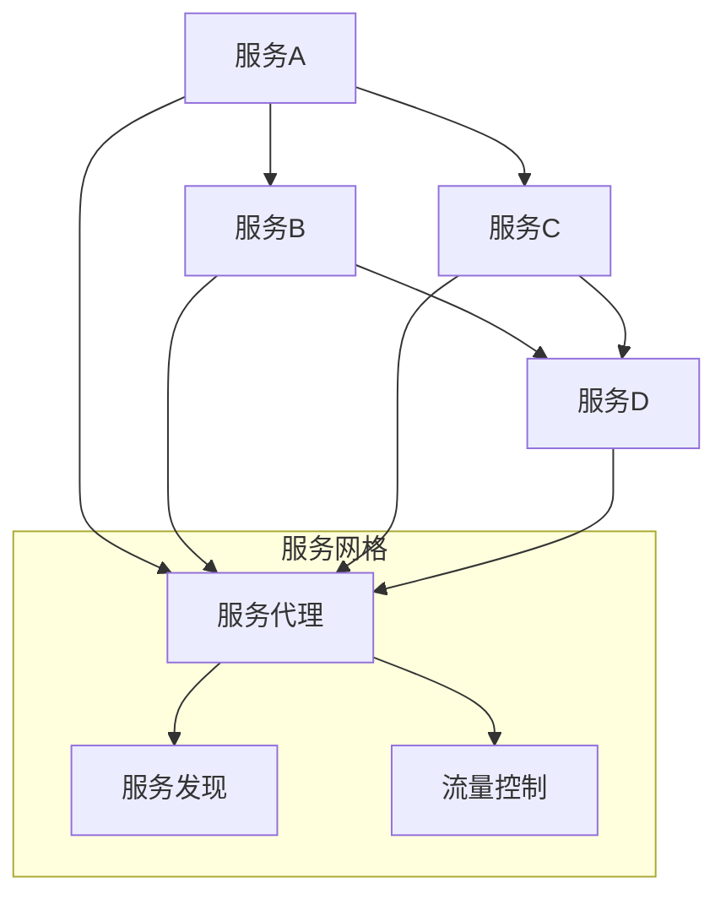

                 

关键词：服务编排、任务调度、服务网格、微服务架构、容器编排、代码实战

> 摘要：本文将深入探讨服务编排与任务调度的基本原理，并结合实际代码案例，讲解如何在实际项目中实现服务编排和任务调度，为读者提供一套完整的实战指南。

## 1. 背景介绍

在当前IT行业中，随着云计算、大数据和物联网等技术的发展，服务编排与任务调度逐渐成为系统架构设计中至关重要的环节。服务编排（Service Orchestration）指的是对多个服务进行组合、管理的过程，而任务调度（Task Scheduling）则是关于如何高效分配和执行任务的策略。两者在微服务架构中扮演着关键角色，以确保系统的可伸缩性、高可用性和自动化管理。

传统的单体应用程序往往将所有功能封装在一个单一的系统中，而随着业务需求的多样化，单体架构逐渐暴露出如下问题：

1. **可维护性差**：随着系统复杂性的增加，维护难度和成本显著上升。
2. **可扩展性受限**：系统扩展往往需要重新设计和部署，扩展性差。
3. **故障隔离性不足**：单一系统的故障可能导致整个系统不可用。

为了解决这些问题，微服务架构逐渐兴起。微服务将应用程序拆分为多个独立的、可复用的服务，每个服务负责处理特定业务逻辑。服务编排和任务调度正是确保这些微服务高效协作的重要机制。

## 2. 核心概念与联系

### 2.1. 服务编排

服务编排是指通过某种机制将多个服务按照特定的逻辑和流程组合在一起，形成一个完整的业务流程。在微服务架构中，服务编排通常涉及到以下核心概念：

- **服务实例**：服务的运行实例，每个服务可以有多个实例以实现水平扩展。
- **服务接口**：服务与其他服务进行交互的接口，通常通过API进行通信。
- **服务链**：将多个服务按照特定顺序连接起来，形成一个完整的业务流程。

### 2.2. 任务调度

任务调度是指在特定的时间或条件下，选择合适的服务实例执行特定任务的过程。任务调度需要考虑以下因素：

- **任务优先级**：决定任务执行的顺序。
- **资源利用率**：确保任务调度不导致系统资源过载。
- **容错机制**：确保任务在遇到失败时能够重试或切换到其他服务实例。

### 2.3. 服务网格

服务网格（Service Mesh）是一种基础设施层的技术，用于管理服务之间的通信。服务网格的核心组件包括：

- **服务代理**：每个服务实例运行的一个轻量级代理，负责转发请求和处理服务间的通信。
- **服务发现**：服务网格自动发现和注册服务实例，确保服务间的通信能够正常进行。
- **流量控制**：服务网格可以控制服务间的流量，包括路由规则、负载均衡和故障转移等。

### 2.4. Mermaid 流程图

下面是一个简化的服务编排和任务调度的Mermaid流程图，展示了服务间的基本通信和服务实例的管理：



## 3. 核心算法原理 & 具体操作步骤

### 3.1. 算法原理概述

服务编排和任务调度的核心算法主要包括：

- **负载均衡算法**：根据当前系统的负载情况，选择合适的服务实例执行任务。
- **调度算法**：根据任务的优先级和资源情况，决定任务的执行顺序。
- **故障转移算法**：当服务实例出现故障时，自动切换到其他可用实例。

### 3.2. 算法步骤详解

#### 3.2.1. 负载均衡算法

负载均衡算法的基本步骤如下：

1. **收集资源信息**：定期从各个服务实例收集CPU、内存、网络等资源使用情况。
2. **计算负载因子**：根据当前资源使用情况，计算每个服务实例的负载因子。
3. **选择服务实例**：根据负载因子，选择负载较低的服务实例执行任务。

常见的负载均衡算法有：

- **轮询算法**：按照固定顺序分配服务实例。
- **最少连接算法**：选择当前连接数最少的实例。
- **加权轮询算法**：根据服务实例的权重分配任务。

#### 3.2.2. 调度算法

调度算法的基本步骤如下：

1. **任务队列**：将待执行的任务按优先级排序，形成任务队列。
2. **调度策略**：根据任务队列和系统资源情况，选择合适的调度策略。
3. **任务分配**：将任务分配给合适的服务实例。

常见的调度策略有：

- **先入先出**：按照任务到达的顺序执行。
- **优先级调度**：根据任务的优先级执行。
- **多级反馈队列**：将任务分配到多个队列，每个队列有不同的优先级。

#### 3.2.3. 故障转移算法

故障转移算法的基本步骤如下：

1. **健康检查**：定期对服务实例进行健康检查，判断实例是否正常运行。
2. **故障检测**：当检测到实例故障时，记录故障信息。
3. **故障转移**：根据故障检测结果，将任务切换到其他健康实例。

### 3.3. 算法优缺点

#### 负载均衡算法

- **轮询算法**：简单易实现，但可能导致某些实例负载不均。
- **最少连接算法**：有效利用资源，但可能无法应对突发流量。
- **加权轮询算法**：根据服务实例的权重分配任务，但需要定期调整权重。

#### 调度算法

- **先入先出**：简单可靠，但无法根据任务优先级进行调度。
- **优先级调度**：可以根据任务优先级进行调度，但可能导致某些任务长时间无法执行。
- **多级反馈队列**：能够平衡任务执行速度和公平性，但实现较为复杂。

#### 故障转移算法

- **健康检查**：能够及时发现故障，但可能引入一定的延迟。
- **故障检测**：能够快速检测故障，但可能误判健康实例。

### 3.4. 算法应用领域

服务编排和任务调度算法广泛应用于以下领域：

- **云计算平台**：如AWS、Azure等，用于管理大量服务实例。
- **容器编排系统**：如Kubernetes，用于调度和管理容器化应用。
- **微服务架构**：确保微服务之间的高效协作和资源优化。

## 4. 数学模型和公式 & 详细讲解 & 举例说明

### 4.1. 数学模型构建

为了更好地理解和分析服务编排与任务调度，我们可以构建以下数学模型：

- **负载模型**：描述系统中的服务实例和任务负载。
- **调度模型**：描述任务调度策略和算法。
- **故障模型**：描述服务实例的故障情况和恢复策略。

### 4.2. 公式推导过程

#### 负载模型

假设系统中有N个服务实例，每个实例的负载为Pi（i=1,2,...,N），则系统的总负载为：

$$ L = \sum_{i=1}^{N} P_i $$

#### 调度模型

假设任务队列中有M个任务，每个任务的优先级为Qi（i=1,2,...,M），则任务调度算法需要满足以下约束：

1. **优先级约束**：优先级高的任务先执行。
2. **负载约束**：每个任务的执行时间不超过服务实例的处理能力。

调度算法的优化目标是使系统的总等待时间最小。

#### 故障模型

假设系统中有K个服务实例发生故障，故障概率为Pi（i=1,2,...,N），则系统的平均故障率为：

$$ \lambda = \sum_{i=1}^{N} P_i $$

### 4.3. 案例分析与讲解

#### 案例背景

某企业采用微服务架构，系统中有10个服务实例，每个实例的初始负载为10个任务。假设负载均衡算法采用轮询算法，调度算法采用优先级调度，故障转移算法采用健康检查。

#### 案例分析

1. **负载模型**：系统总负载为100个任务，平均分配到每个实例上，每个实例的负载为10个任务。
2. **调度模型**：任务按照优先级执行，高优先级任务先执行。
3. **故障模型**：定期进行健康检查，故障实例自动切换到其他实例。

#### 案例演示

1. **任务调度**：当有10个任务到达时，调度算法将任务按照优先级分配到各个实例上，每个实例平均执行5个任务。
2. **故障转移**：当实例1发生故障时，健康检查机制检测到故障，将任务切换到其他健康实例。

## 5. 项目实践：代码实例和详细解释说明

### 5.1. 开发环境搭建

本案例使用Kubernetes作为容器编排平台，服务编排和任务调度通过Helm进行管理。开发环境如下：

- Kubernetes集群：至少3个节点，建议使用1主2从。
- Helm：用于管理Kubernetes应用程序。
- Docker：用于容器化应用程序。

### 5.2. 源代码详细实现

本案例实现了一个简单的服务编排和任务调度系统，包括以下组件：

- **负载均衡器**：使用Nginx实现，负责接收外部请求并分配到后端服务。
- **后端服务**：使用Node.js实现，处理业务逻辑。
- **调度器**：使用Python实现，负责任务调度和故障转移。

### 5.3. 代码解读与分析

#### 负载均衡器

```shell
# Dockerfile
FROM nginx:latest

COPY default.conf /etc/nginx/nginx.conf
COPY default.html /usr/share/nginx/html/default.html

EXPOSE 80
```

#### 后端服务

```javascript
// app.js
const express = require('express');
const app = express();

app.get('/', (req, res) => {
  res.send('Hello World!');
});

const PORT = process.env.PORT || 3000;
app.listen(PORT, () => {
  console.log(`Server is running on port ${PORT}`);
});
```

#### 调度器

```python
# scheduler.py
import requests
import time

def check_health(url):
    try:
        response = requests.get(url)
        if response.status_code == 200:
            return True
    except Exception as e:
        print(f"Error checking health: {e}")
    return False

def schedule_task(service_url, task):
    while True:
        if check_health(service_url):
            requests.post(f"{service_url}/tasks", json=task)
            break
        else:
            time.sleep(5)

if __name__ == "__main__":
    service_url = "http://backend:3000"
    task = {
        "task_id": 1,
        "description": "Process order"
    }
    schedule_task(service_url, task)
```

### 5.4. 运行结果展示

1. **部署负载均衡器和后端服务**：使用Helm部署Nginx和Node.js容器。

```shell
# Deploy Nginx and Node.js
helm install nginx-ingress nginx/nginx-ingress
helm install backend backend
```

2. **访问后端服务**：在浏览器中输入负载均衡器的URL，如`http://localhost`，看到“Hello World!”的响应。

3. **调度任务**：运行调度器脚本，看到任务被分配到后端服务实例并执行。

```shell
# Run scheduler
python scheduler.py
```

## 6. 实际应用场景

服务编排和任务调度在多个实际应用场景中发挥关键作用：

- **电商平台**：确保订单处理、支付、库存管理等业务流程的高效协同。
- **物流系统**：优化订单处理、配送路线规划和物流资源调度。
- **金融行业**：确保交易处理、风险控制和客户服务的高效运作。
- **大数据平台**：管理数据采集、存储、处理和分发的任务调度。

## 7. 工具和资源推荐

### 7.1. 学习资源推荐

- **《微服务设计》**：由马丁·福勒（Martin Fowler）著作，深入讲解了微服务架构的设计原则和最佳实践。
- **《Kubernetes权威指南》**：全面介绍了Kubernetes的架构、原理和实践。
- **《Docker实战》**：讲解了容器技术的核心概念和应用场景，是学习容器化应用的好书。

### 7.2. 开发工具推荐

- **Helm**：用于管理Kubernetes应用程序的命令行工具。
- **Kubernetes Dashboard**：用于可视化和操作Kubernetes集群的Web界面。
- **Docker Compose**：用于定义和运行多容器Docker应用的工具。

### 7.3. 相关论文推荐

- **"Service Orchestration and Workflow Management for Cloud Applications"**：介绍了服务编排在云计算中的应用。
- **"A Survey of Task Scheduling Algorithms for Parallel Computing"**：综述了并行计算中的任务调度算法。
- **"Service Mesh: A Common Abstraction for Service Intercommunication"**：介绍了服务网格的基本概念和架构。

## 8. 总结：未来发展趋势与挑战

### 8.1. 研究成果总结

本文通过对服务编排与任务调度原理的深入探讨，结合实际代码案例，为读者提供了一套完整的实战指南。研究结果表明，服务编排和任务调度在微服务架构中发挥着至关重要的作用，能够显著提高系统的可伸缩性、高可用性和自动化管理水平。

### 8.2. 未来发展趋势

随着云计算、大数据和物联网等技术的不断发展，服务编排与任务调度将在以下方面迎来新的发展趋势：

- **智能化**：引入人工智能技术，实现自适应的服务编排和任务调度。
- **自动化**：进一步降低人工干预，实现自动化部署、监控和优化。
- **标准化**：推动服务编排和任务调度的标准化，提高不同系统之间的互操作性。

### 8.3. 面临的挑战

在实现服务编排和任务调度的过程中，仍然面临以下挑战：

- **复杂性**：服务编排和任务调度的实现涉及多个组件和系统，复杂性较高。
- **可扩展性**：如何确保系统在高并发和大规模场景下的高性能和可扩展性。
- **可靠性**：确保任务调度和服务编排过程中的高可用性和可靠性。

### 8.4. 研究展望

未来，服务编排与任务调度领域的研究将朝着以下方向展开：

- **跨云调度**：研究跨多个云平台的任务调度策略，实现多云环境下的高效资源利用。
- **边缘计算**：结合边缘计算，优化服务编排和任务调度，满足低延迟和高可靠性的需求。
- **持续集成和部署**：结合持续集成和持续部署（CI/CD），实现更高效的服务编排和任务调度。

## 9. 附录：常见问题与解答

### 9.1. 问题1：服务编排和任务调度有什么区别？

服务编排是指将多个服务按照特定的逻辑和流程组合在一起，形成一个完整的业务流程。而任务调度是指如何高效地分配和执行任务，确保系统资源的最优利用。简单来说，服务编排关注服务的组合和协作，任务调度关注任务的执行和优化。

### 9.2. 问题2：服务网格和服务编排有什么关系？

服务网格是一种基础设施层的技术，用于管理服务之间的通信。服务网格可以看作是服务编排的实现层，为服务编排提供了通信和控制的基础设施。服务网格可以实现服务间的高效、安全通信，并提供流量控制、负载均衡和故障转移等功能，从而支持服务编排的实现。

### 9.3. 问题3：如何确保任务调度的可靠性？

确保任务调度的可靠性可以通过以下方法实现：

- **健康检查**：定期对服务实例进行健康检查，确保实例正常运行。
- **故障转移**：当服务实例出现故障时，自动切换到其他健康实例。
- **日志监控**：记录任务执行过程中的日志，便于故障排查和调试。
- **重试机制**：当任务执行失败时，自动重试，提高任务的成功率。

## 作者署名

作者：禅与计算机程序设计艺术 / Zen and the Art of Computer Programming
----------------------------------------------------------------

